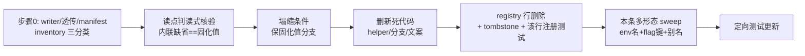

# FLY-1806 功能类 flag 批量删除+固化 — 实施计划
Issue: FLY-1806 (https://linear.app/geoforge3d/issue/FLY-1806/flag执行e1-功能类-46-条删-flag-固化成现值零行为变化批)
日期: 2026-08-16
基于: 无(上游为 **PR #853 分支 `origin/flywheel-FLY-1782`** 的 `product/doc/FLY-1782-flag-recheck/exec-ready.md` §3 + `resolver-state.md` §4 + `tally.md`;该分支未合入 main,本仓 main 上没有这些文件,只读取自 `git show`,依据版本即 PR #853 分支版 —— Tadashi 指令 c6a6e18b 确认口径)

> Codex design review 记录:R1 CHANGES REQUESTED(5 条,2 HIGH)→ 折入;R2 CHANGES REQUESTED(3 条,2 HIGH:fleet CAS schema / forwarder 分类)→ 折入;R3 CHANGES REQUESTED(2 MEDIUM:jq `//` 把 `false` 与缺席同投 `null`、口径同步)→ 折入(已实测 jq 语义);R4 **APPROVED**(1 条非阻断提示已折入:golden fixture 用确定性字段值)。

---

## 0. 一句话

把 exec-ready.md §3 功能类批里**可批量的 31 条** feature flag 从代码里删掉、逐条固化成当前生效值(= 真默认值),行为零变化;registry 行清理 + `RETIRED_FLAGS` tombstone,完删由「全仓多形态 sweep 零命中」证明,既有 drift 守卫只作 TS 布尔面的辅助。

## 1. 范围推导(46 → 32 → 31,逐步可核)

数字口径按 issue 要求以 `tally.md` 为准(§3 批 = 46 条,不手算总账);下面的减法每一步给出逐条名单,不是估算。

| 步 | 数 | 依据 |
|---|---|---|
| exec-ready.md §3 功能类批 | **46** | 上游文档逐行数(含表头外 46 行) |
| − 有解析器:`qa_auto` | −1 | issue 排除项①;resolver-state.md §4 唯一标红 |
| − 待查 ∩ §3(13 条,名单见下) | −13 | issue 排除项②;resolver-state.md §4 的 19 条待查里,6 条属 §2 急停批(FLY-1807),13 条落在 §3 |
| = 本批候选 | **32** | 本计划 §3 台账逐条列出 |
| − 设计期查实会变行为:`lead_dry_run` | −1 | 退出本单转 E3,证据见 §2 |
| = **本批执行** | **31** | |

**待查 ∩ §3 的 13 条**(全部不动,归 E6):`liveness_activity_window_ms` · `deferred_approval_ttl_ms` · `founder_reply_deadletter_age_ms` · `issue_display_sweep_ticks` · `ship_gate_grace_ms` · `merge_reconcile_window_days` · `ship_gate_card_grace_ms` · `reports_ttl_days` · `ghost_guard_wait_ms` · `runner_autocontinue` · `done_thread_reconcile_interval_min` · `done_thread_reconcile_max_per_run` · `delivery_secret_path`(它同时是「搬不是删」,双重出局)。

**范围内一条旧锁的澄清**:FLY-1456 里程碑曾把 `issue_status_emoji` / `issue_status_word` 标「留给 FLY-1150,source diff=0」。已核:FLY-1150 于 2026-08-15 00:04 **Canceled**(由 FLY-1778 替代,Annie 裁决),exec-ready.md(同日更晚、Annie 已批)把两条列入删批 ⇒ 旧锁失效,两条**在本批内**。

**baseline 说明**:FLY-1456 的 PR #695(`fa9fd4b06`)**已在当前 HEAD 祖先内**(已核 `git merge-base --is-ancestor`)——它对 45 条幸存者的标记已在 baseline 里,本批 31 条在该 baseline 上逐条验证仍存在。不存在「若 #695 先合」的未来冲突。

## 2. `lead_dry_run` 为什么退出本单(设计期证据)

本单验收自带退出规则:「任何一条做出来发现会变行为 ⇒ 退出本单,转 E3 逐条处理」。`lead_dry_run` 在设计期就查实命中:

- 它不是「冻结的配置」,是**被主动调用的 CLI 模式**(preflight dry-run:出 launch plan 而不真启动 Lead):
  - `scripts/verify-anna-isolation.sh:122` — **生产验证脚本**主动 `FLYWHEEL_LEAD_DRY_RUN=1 bash claude-lead.sh …` 拿 plan;
  - `scripts/lib/buddy-captain-preview.sh:148` — Buddy captain preview **生产路径**同样主动设 `=1`;
  - `packages/teamlead/scripts/claude-lead.sh:2372` 注释逐字:「overridable ONLY under FLYWHEEL_LEAD_DRY_RUN=1 (hermetic tests…)」— 测试 harness 依赖;
  - 影响面 15 个 prod 文件 + 13 个测试文件,横跨 claude-lead.sh / codex-lead.sh / 双 runtime / 各 mufasa launcher。
- 「当前生效值 == 真默认值」这个批量前提对它不成立:它的生效值**按调用方每次不同**(生产守护进程 0,preview/verify 工具 1)。删 flag = 删能力,`verify-anna-isolation.sh` 与 buddy preview 会从「出计划」变成「真启动 Lead」——不是零行为变化。
- FLY-1782 的分类器只看**读点句式**,不看「有没有人在调用时设它」,所以它漏进了 §3。这不推翻上游裁决的其余部分,只触发本单自己的逐条退出条款。

**处置**:不动任何代码;在 PR 描述与 Linear 里点名转 E3(逐条批),并建议 E6/E3 侧给分类器补一条「调用方 setter 扫描」。这个教训已泛化进 §4.1 的**步骤 0(writer inventory 前置)**,对 31 条逐条适用,不只防这一条。

## 3. 31 条执行台账(固化值 + 理由 + 读点)

理由列的通用事实(逐条已验,PR 描述必须逐条重申):
- **生产 `~/.flywheel/.env` 未设**(2026-08-16 逐条 grep 复核,32 条全部未设)——**必要条件而非充分条件**,`lead_dry_run` 已证明调用方注入可以推翻它;
- 因此 PR 的逐条理由必须写成:「.env 未设 **且** 全仓 inventory = 无 source/forwarder,或逐个列出节点与**终端 source** 证据(全部未设或同向)⇒ 当前生效值 = 内联缺省 = 固化值」(§4.1 步骤 0 的产物);
- **registry.default 与读点内联缺省一致**(本设计已逐条比对 registry 行 vs 读点判读式);
- 31 条全部属 resolver-state「无解析器 / 数值 sanitizer」两类 ⇒ 硬门①的「解析器优先」对它们的落点就是**读点判读式本身**,PR 里逐条引用判读式原文即为证据。

分类代号:**A** = default_on bool(`env.X !== "0"`,固化开:删守卫,无条件走开启路径,删除 `=0` 分支及其独占死代码);**B** = opt_in bool(`env.X === "1"`,固化关:删守卫,删除被门住的路径);**C** = 数值 sanitizer(`Number(env.X)`+回落,焊死为具名常量);**D** = shell 读点(同向塌缩条件)。

已知 writer inventory(设计期扫描结果,按 §4.1 步骤 0 的三类模型;实现节点重跑):
- **#23** `FLYWHEEL_ROUNDTABLE_THREAD_AUTOCONTINUE`:producer/source = `scripts/lib/qa-room.sh:53`(常量 `=1`,同向);pass-through forwarder = `packages/teamlead/scripts/claude-lead.sh:1954-1965`(raw env 非空时经 `env -i` 透传给 Lead 子进程,喂仓外 Discord plugin 的同名读点)。终端 source 全部「未设或 =1」⇒ 继续删;forwarder 条目与 qa-room 注入行随删(见 §4.3)。
- **#27** `FLYWHEEL_CMUX_AUTOSTART_EXEC`:`flywheel-cmux-autostart.sh:20-45` 的 `load_cmux_bool_flag` 是**读点自身的归一化 export(resolver-local assignment)**,不算独立 writer;终端 source = inherited env / `.env`,均未设 ⇒ 继续删。
- **#29** `FLYWHEEL_LEAD_CHROME_ENABLED`:source = 各 Lead manifest 的 `chromeEnabled` 字段(15 个全 `false`,同向),经 `lead-body.sh:95` 透传 ⇒ 继续删(manifest/CAS 面的精确处置见 §4.3)。
- **其余 28 条**:无任何 producer/forwarder。

| # | flag | env | 类 | 固化成 | 主读点(registry + 全仓 sweep 补齐) |
|---|---|---|---|---|---|
| 1 | `boot_sha_check` | `FLYWHEEL_BOOT_SHA_CHECK` | A | 开 | `bridge/boot-sha-check.ts#runBootShaCheck` |
| 2 | `gatepoller_circuit` | `FLYWHEEL_GATEPOLLER_CIRCUIT` | A | 开 | `bridge/gate-poller.ts:1325` `!== "0"` |
| 3 | `founder_thread_notify` | `FLYWHEEL_FOUNDER_THREAD_NOTIFY` | A | 开 | `bridge/gate-poller.ts` |
| 4 | `ship_ready_notify` | `FLYWHEEL_SHIP_READY_NOTIFY` | A | 开 | `workflow-ship-ready.ts:116` |
| 5 | `ship_ready_remind_ms` | `FLYWHEEL_SHIP_READY_REMIND_MS` | C | **1800000** | `workflow-ship-ready.ts:122` `Number(env.X)`(数值读点,drift 守卫**不覆盖**,靠 sweep) |
| 6 | `founder_reply_deliver` | `FLYWHEEL_FOUNDER_REPLY_DELIVER` | A | 开 | `bridge/gate-poller.ts` |
| 7 | `deferred_founder_approval` | `FLYWHEEL_DEFERRED_FOUNDER_APPROVAL` | A | 开 | `bridge/approval-signal/deferred-approval.ts` |
| 8 | `held_declined_reply` | `FLYWHEEL_HELD_DECLINED_REPLY` | A | 开 | `bridge/approval-signal/deferred-approval.ts` |
| 9 | `founder_notify_retry_max` | `FLYWHEEL_FOUNDER_NOTIFY_RETRY_MAX` | C | **5** | `bridge/founder-action-drain.ts` |
| 10 | `founder_reply_retry_max` | `FLYWHEEL_FOUNDER_REPLY_RETRY_MAX` | C | **10** | `bridge/gate-poller.ts` |
| 11 | `heartbeat_readopt` | `FLYWHEEL_HEARTBEAT_READOPT` | A | 开 | `HeartbeatService.ts`(`=0` 是 FLY-172 legacy 回退分支,随删) |
| 12 | `liveness_pane_dead` | `FLYWHEEL_LIVENESS_PANE_DEAD` | A | 开 | `HeartbeatService.ts` |
| 13 | `worktree_autoclean` | `FLYWHEEL_WORKTREE_AUTOCLEAN` | A | 开 | `bridge/worktree-cleanup.ts` + `bridge/lifecycle-closeout.ts`(多处 `=0 零写` 早退分支,随删) |
| 14 | `bridge_loop_guard` | `FLYWHEEL_BRIDGE_LOOP_GUARD` | A | 开 | `bridge/BridgeEventLoopGuard.ts#isEnabled/start` |
| 15 | `issue_status_emoji` | `FLYWHEEL_ISSUE_STATUS_EMOJI` | A | 开 | `bridge/plugin.ts#createBridgeApp` |
| 16 | `issue_status_word` | `FLYWHEEL_ISSUE_STATUS_WORD` | A | 开 | `HeartbeatService.ts` + `bridge/issue-display-refresher.ts` |
| 17 | `issue_attach_pin` | `FLYWHEEL_ISSUE_ATTACH_PIN` | A | 开 | `bridge/plugin.ts` |
| 18 | `issue_display_refresh` | `FLYWHEEL_ISSUE_DISPLAY_REFRESH` | A | 开 | `bridge/plugin.ts#startBridge` + `issue-display-refresher.ts`(`=0` legacy 渲染路径,随删) |
| 19 | `crash_reaper` | `FLYWHEEL_CRASH_REAPER` | A | 开 | `bridge/plugin.ts` |
| 20 | `stale_terminal_close` | `FLYWHEEL_STALE_TERMINAL_CLOSE` | A | 开 | `HeartbeatService.ts#staleCloseEnabled`(`=0` = pre-FLY-867 notify-only,随删) |
| 21 | `commdb_fsm_reconcile` | `FLYWHEEL_COMMDB_FSM_RECONCILE` | A | 开 | `bridge/plugin.ts` |
| 22 | `codex_lead_typing` | `FLYWHEEL_CODEX_LEAD_TYPING` | A | 开 | `lead-backends/codex/codex-lead-runtime.ts:514`(dry-run 报告里的文案分支同步简化) |
| 23 | `roundtable_thread_autocontinue` | `FLYWHEEL_ROUNDTABLE_THREAD_AUTOCONTINUE` | A | 开 | **只焊 raw 判读点,`_EFFECTIVE` 链保留**(§4.3):`codex-lead-runtime.ts:648` + `codex-lead-tui-home.sh` python resolver。source:`qa-room.sh:53` 同向 `=1`;forwarder:`claude-lead.sh:1954-1965` `env -i` 透传(喂仓外 plugin 同名读点);两处随删,塌缩后语义不变 |
| 24 | `zombie_reconcile` | `FLYWHEEL_ZOMBIE_RECONCILE` | A | 开 | `HeartbeatService.ts#zombieMachineryEnabled` |
| 25 | `terminal_thread_archive` | `FLYWHEEL_TERMINAL_THREAD_ARCHIVE` | A | 开 | `bridge/plugin.ts#terminalArchiveBuffer` |
| 26 | `disposition_receipt` | `FLYWHEEL_DISPOSITION_RECEIPT` | A | 开 | `bridge/disposition-receipt.ts#dispositionReceiptEnabled` |
| 27 | `cmux_autostart_exec` | `FLYWHEEL_CMUX_AUTOSTART_EXEC` | B/D | 关 | `scripts/flywheel-cmux-autostart.sh:53,76`(塌缩后条件只剩 `FLYWHEEL_CMUX_SUPERVISED == 1`,launchd 生产路径不变;注释自述「incident-response escape」,删除即按裁决放弃该应急口) |
| 28 | `claude_account_identity_check` | `FLYWHEEL_ACCOUNT_IDENTITY_CHECK` | B/D | 关 | `account-heal/quota-monitor.ts:463` + `claude-runner/bin/flywheel-claude-profile:957`(被门住的 identity-check 路径 = 死代码,随删) |
| 29 | `lead_chrome_enabled` | `FLYWHEEL_LEAD_CHROME_ENABLED` | B/D | 关(15 个 Lead manifest 全 false) | **registry 行不全,真实面 = env 读点 3 处 + manifest 配置面**(§4.3):`codex-lead-runtime.ts:669`(`=== "1"`)、`scripts/claude-lead.sh:2300`(`= "true"`!字面量不同)、`scripts/lead-body.sh:95`(透传);manifest 面按 §4.3 定案:**配置字段停发**(jq `//` 下 `false` 与缺席同投 `null`,hash 不变——已实测),**fleet CAS projection 的 `chromeEnabled` key 一字不改**(37 个已 applied journal 依赖) |
| 30 | `roundtable_thread_own_bot` | `FLYWHEEL_ROUNDTABLE_THREAD_OWN_BOT` | B | 关 | `bridge/roundtable/roundtable-config.ts#loadRoundtableConfig` |
| 31 | `done_thread_reconcile_dryrun` | `FLYWHEEL_DONE_THREAD_RECONCILE_DRYRUN` | B | 关 | `bridge/done-thread-reconcile.ts#resolveDoneThreadReconcileConfig`(与 `lead_dry_run` 的区别:**全仓无任何生产 setter**,只有读点 + 测试;删=按裁决放弃该运维试跑口,当前行为零变化) |

## 4. 机械配方(实现节点逐条执行)

### 4.1 每条的固定次序(31 条同构;writer inventory 前置)

0. **writer inventory(本条塌缩之前,不是之后)**:按词边界全仓扫本条 env 名的所有出现,先按**角色**归类,再判处置:
   - **producer/source**(真正决定值的地方:`.env`、QA 注入、manifest 字段、脚本常量);
   - **pass-through forwarder**(只转发既有值,如 `claude-lead.sh` 的 `env -i` 透传名单)——**必须递归追到终端 source**,forwarder 本身不构成独立 writer;
   - **resolver-local assignment**(读点自身的归一化 export,如 `load_cmux_bool_flag`)——是读点的一部分,不算 writer。
   处置只看**终端 source 的当前值**:全部「未设 或 == 固化值」⇒ 继续删(同向常量 source 与 forwarder 条目随塌缩一并删);存在**动态或反向 source**(值随调用方变化、或与固化值相反)⇒ **本条立即退出转 E3,零代码改动**(`lead_dry_run` 同款)。
   PR 逐条理由必须引用本步产物(「无 source/forwarder」或逐个列出节点与终端 source 证据),不许只写「.env 未设」。
1. **核验(硬门①落地)**:打开读点,逐字引用判读式(如 `process.env.FLYWHEEL_GATEPOLLER_CIRCUIT !== "0"`),确认内联缺省 == 台账固化值。**不一致 ⇒ 停,该条退出本单转 E3**(硬门③「先改值再删」在本批不该出现——出现即说明分类错了,退出而不是改值)。
2. **塌缩**:A 类删守卫保开启路径、删 `=0` 分支;B 类删守卫、删被门住的路径;C 类把 `Number(env.X)`+回落替换为具名常量(常量名保留原语义,如 `SHIP_READY_REMIND_MS = 1_800_000`),**保留原 sanitizer 的语义注释**;D 类按同向塌缩 shell 条件。
3. **死代码**:只删「因本条塌缩而新死」的代码(独占 helper、legacy 分支、`=0` 文案);顺手清理无关代码 = 违纪。每条在 PR 里列出删掉的死代码块。
4. **registry + tombstone(与本条塌缩同 commit,不留到收尾)**:删 `packages/config/src/feature-flags/registry.ts` 对应行;删 `feature-flags-registry.test.ts` 里该 flag 的注册断言 it 块;`truth.ts` 的 `RETIRED_FLAGS` 加 `{ envVar: "FLYWHEEL_…", retiredBy: "FLY-1806" }`(既有 FLY-1560/1674/1466 同款)。同 commit 完成才不会让 drift 守卫的 reverse check(registry 行声称的 readSite 已无 env 名)在中间 commit 变红——**每个 commit 独立可验证**。
5. **本条 sweep(多形态,FLY-205 教训)**:按词边界 grep——env 名(`FLYWHEEL_X`)、registry 键(`x_y`)、**本条专属别名**(#23 的 `_EFFECTIVE` 属「保留豁免」;#29 的 `chromeEnabled` / `CHROME_ENABLED`)——覆盖 `*.ts` / `*.sh` / `*.mjs` / plist 模板 / QA 脚本;live-code 命中即处理,**doc/ 与历史文档里的提及不改**。
6. **测试**:设 env=固化值 的测试 → 去掉 env 设定、断言保留(它们从「flag 开着时」变成「永远如此」的行为测试);测被删分支(`=0` / `=1` 反向)的测试 → 整块删除。**任何一条发现「反向分支测试删掉后行为断言必须改」⇒ 那条不是零行为变化,退出转 E3。**

### 4.2 完删证明的真实边界(drift 守卫只是辅助)

`feature-flags-drift.test.ts` 的两向扫描**只覆盖** 4 个 `packages/*/src` 目录下的非测试 `.ts`,且对注入式 `env.X` 只匹配**布尔比较**——数值读点(如 `workflow-ship-ready.ts` 的 `Number(env.FLYWHEEL_SHIP_READY_REMIND_MS)`)、shell/bin、camelCase manifest 字段、QA 脚本全都**不在其内**。⇒ 它只是 TS 布尔面的辅助守卫,**不是完删证明**。

**完删的主证据 = PR 附全仓 live-code 零命中 sweep 输出**:31 个 raw env 名 + 31 个 registry 键 + 逐条专属别名(§4.1 步骤 5),合法例外**分两栏逐项列出**:
- **live-code 合法残留**:tombstone 自身(truth.ts)、#23 保留的 `_EFFECTIVE` 活链、#29 的 `flywheel-fleet.sh` projection 里的 `chromeEnabled` key(CAS schema,唯一保留的 live 别名命中);
- **test-only 合法命中**:#29 的 golden-hash 回归 fixture 与 fleet/materializer 契约测试中的 `chromeEnabled` 字面量、tombstone 表驱动断言里的 31 个名字;
- 历史文档/doc 提及不计入。另在既有 registry 测试文件里加一个**表驱动断言**,**按组累积落地**(时序见 §5/§6):断言表里的每个名字不在 `FEATURE_FLAGS`、在 `RETIRED_FLAGS` 且 `retiredBy === "FLY-1806"`;G1-G6 每组 commit 把本组条目加进表(该组的 RED→GREEN),G7 只验证表的汇总恰好等于最终范围(31,或触发 E3 退出后的实际数)。扩展既有套件,不造新机制。

### 4.3 两条链的精确处置(R1 修正后,防漏也防删过头)

- **`roundtable_thread_autocontinue`:只焊 raw 判读点,`_EFFECTIVE` 链整体保留。** `_EFFECTIVE` 编码的是「**存在可解析 roundtable parent** 且 raw flag 未关」两个条件的合取,不是 raw flag 的别名:`codex-lead-runtime.ts:648-668` 只在 `parentChannelId` 存在时创建 `replyInThread`;producer(`codex-lead-runtime.ts:1436-1438`、`lead-actions/mcp-config.ts:158`、`codex-lead-tui-home.sh` python)按该有效状态**条件**发 `FLYWHEEL_ROUNDTABLE_THREAD_AUTOCONTINUE_EFFECTIVE=1`;consumer(`gateway/gateway-main.ts:201-204`、`lead-actions/config.ts:92`)在 marker 缺席时必须保持 `false`(无 parent 部署的 byte-compat,由 `gateway-main.test.ts:46-59`、`codex-lead-tui-home.test.sh:229-235` 钉住)。**恒真化会改无 parent 场景的行为 —— 禁止。** 正确塌缩:在两个 resolver 里把「raw flag 未关」焊成 true、保留 parent 条件;`replyInThread` 形状在 parent 存在时恒含 `autoContinue: true`(= 今天 unset 的实际形状);`truth.ts:208` 的 `_EFFECTIVE` allowlist 行**保留**;transport/producer/consumer 及其 parent/no-parent 用例全保留,只删「raw flag=0」反向用例。**raw env 的两处外围随删,逐一论证零变化**:①source `qa-room.sh:53`(注入 `=1`;删后 QA 房 raw unset,所有读者 default-on,同值);②forwarder `claude-lead.sh:1954-1965`(从 `env -i` 透传名单移除该 var;今天生产 unset ⇒ 本来就不透传,QA 注入 `=1` ⇒ 透传后插件读 `!== "0"` = 开,删后插件读 unset = 开,同值)。**仓外说明**:canonical Discord plugin(独立仓)也读同名 raw env(`roundtable-thread-policy.ts:67`,同款 `!== "0"` default-on)——本 PR 不碰插件仓;删除 forwarder 后,`env -i` 子进程里它实际恒为 default-on = 固化值;`=0` opt-out 能力的消失正是本裁决「删 flag 固化成开」的内容。插件侧是否同步删由 Lead 另行裁量。
- **`lead_chrome_enabled`:删配置能力与 env 链,fleet CAS projection key 一字不改,配置字段直接停发(R2 HIGH-1 + R3 #1 定案)。** env 面:`codex-lead-runtime.ts:669`(`"1"`)/ `claude-lead.sh:2300`(`"true"`)/ `lead-body.sh:95`(透传)三处塌缩为关。manifest 面(env 名 sweep 抓不到,按 `chromeEnabled`/`CHROME_ENABLED` 别名扫)的关键事实:`flywheel-fleet.sh:462-484` 的 `manifest_projection_sha` 把 `chromeEnabled: (.chromeEnabled // null)` 枚举进 canonical JSON hash,写入 transaction `postImage.manifestProjSha`,rollback 严格相等比较,本机 `~/.flywheel/fleet-backups` 现存 **37 个已 applied 的 journal** 依赖旧 hash;而 jq 的 `//` 把 **`false` 与字段缺席同投为 `null`**(设计期实测:`{}` 与 `{"chromeEnabled":false}` 都输出 `{"chromeEnabled":null}`)⇒ **停发字段不改 hash;会破坏 hash 的只有「从 projection 对象删 key」这一个动作**。**定案**:(i)`flywheel-fleet.sh` projection **一字不改**(live-code 合法残留,注记「CAS schema key,FLY-1806 焊死」);(ii)`materialize-lead-manifests.sh:87-93` **停止生成** `chromeEnabled` 字段(配置能力删除);(iii)`test-deploy.sh:1379-1402` 停止读写该字段;(iv)回归测试(扩展既有 `flywheel-fleet.test.sh`):对 pre-change 形状 fixture pin 一个**字面量 golden hash**(expected 不许在测试运行时用同一函数现算;**fixture 的全部投影字段用确定性值,不许让 `mktemp` 之类的随机路径进 hash**——R4 非阻断提示),并钉住 `false`/缺席投影等价 + post-change materializer 产出的 manifest 投影等于同一 golden;(v)契约测试同步更新(`materialize-lead-manifests.test.sh`、`fly1663-lead-v2-runtime.test.sh`、`restart-env-propagation.test.sh`)。**已部署的 15 个 manifest 不回写**(留 `false` 字段 = 投影同 `null`,惰性残留)。**escape**:若实现中发现停发方案无法保持 golden hash 逐字节稳定 ⇒ 本条退出转 E3(批量降为 30 条),不再加码。仓外残留:`~/.flywheel/bin/flywheel-lead-wrapper.sh:190`(v1 载体,FLY-1680 待退役)在仓库外,本 PR 不碰,死字节无害。

## 5. 验证与门

- **preflight(实现节点开工第一步,重跑不复用本设计的结论)**:① 逐条 grep 生产 `~/.flywheel/.env` 确认 31 个 env 仍未设;② 逐条重跑 §4.1 步骤 0 的 source/forwarder/resolver inventory(设计期结论:#23 = qa-room 同向 source + claude-lead forwarder,#27 = resolver-local,#29 = manifest 链全 false,**其余 28 条无 source/forwarder**);③ `lead_chrome_enabled` 重扫全部 Lead manifest 确认仍全 false / 缺席。任何一条变了 ⇒ 该条前提破 ⇒ 退出转 E3。
- **TDD 姿态(按组)**:这批是删除型改动,红-绿以**组**为单位——每组先把本组条目加进表驱动 tombstone 断言 + 改写本组「永远如此」行为测试预期(RED:registry 行未删、守卫未塌缩),再做本组塌缩与行清理(GREEN),REFACTOR 只做死代码清列。**不存在跨组的长红**:全量 31 条的汇总校验只落在 G7(见 §6),不声称是各组的 RED。
- **全仓门(FLY-224/248 教训,全 repo 不是只改动文件)**:`pnpm lint` + `pnpm -r build` + `pnpm test:packages:run`;宿主上按记忆规则**只跑定向文件**(全量 vitest 会压死生产 Bridge),全量结论以 PR CI 为准。
- **定向测试集(R1 补齐后)**:`packages/config` 的 `feature-flags-*.test.ts` / `flag-truth.test.ts` / `feature-flags-resolve.test.ts`(直接引用 `lead_chrome_enabled`);teamlead 的 GatePoller / HeartbeatService / plugin / workflow-ship-ready / deferred-approval / done-thread-reconcile / disposition-receipt / `boot-sha-check.test.ts` / `bridge-event-loop-guard.test.ts` / codex-lead-runtime / lead-actions(config + mcp-config)/ **`gateway-main.test.ts`** / roundtable-config / `quota-monitor*.test.ts` / `residue-harvest.test.ts` / `auto-qa-effects.test.ts`;claude-runner 的 `claude-profile.test.ts`;shell harness:`codex-lead-tui-home.test.sh` / `qa-room-env.test.sh` / `test-deploy-generalized.test.sh` / `materialize-lead-manifests.test.sh` / `flywheel-fleet.test.sh` / `fly1663-lead-v2-runtime.test.sh` / `restart-env-propagation.test.sh` / cmux-autostart harness。
- **行为零变化的证据形态**:不做真机 E2E(本批定义上零行为变化,且是 design→implement→qa 三段 DAG,QA 节点另行把关);PR 提供四件:①逐条判读式引用表(硬门①);②逐条 writer inventory 结论(§4.1 步骤 0);③全仓零命中 sweep 输出(§4.2,含显式例外清单);④drift/registry/定向测试全绿。

## 6. PR 结构与节奏

- **一个 PR**,commit 按模块分组;**每条 flag 的代码塌缩 + 测试 + registry 行 + tombstone 同 commit**(§4.1 步骤 4,保证每个中间 commit 上 drift 守卫两向都绿、独立可验证)。分组唯一、无重叠(31 条恰好一次):
  - **G1 GatePoller + founder 通知链(7)**:#2 gatepoller_circuit · #3 founder_thread_notify · #6 founder_reply_deliver · #7 deferred_founder_approval · #8 held_declined_reply · #9 founder_notify_retry_max · #10 founder_reply_retry_max
  - **G2 HeartbeatService 族(5)**:#11 heartbeat_readopt · #12 liveness_pane_dead · #16 issue_status_word · #20 stale_terminal_close · #24 zombie_reconcile
  - **G3 plugin/display/lifecycle(10)**:#1 boot_sha_check · #13 worktree_autoclean · #14 bridge_loop_guard · #15 issue_status_emoji · #17 issue_attach_pin · #18 issue_display_refresh · #19 crash_reaper · #21 commdb_fsm_reconcile · #25 terminal_thread_archive · #26 disposition_receipt
  - **G4 ship-ready(2)**:#4 ship_ready_notify · #5 ship_ready_remind_ms
  - **G5 codex-lead/roundtable(4)**:#22 codex_lead_typing · #23 roundtable_thread_autocontinue · #29 lead_chrome_enabled · #30 roundtable_thread_own_bot
  - **G6 shell/散件(3)**:#27 cmux_autostart_exec · #28 claude_account_identity_check · #31 done_thread_reconcile_dryrun
  - **G7 收尾**:只做最终全仓 sweep 复核、表驱动断言的**汇总校验**(断言表条目数 == 最终范围;各组条目已随组落)、文档/里程碑——**不含任何 registry/代码塌缩**。
- **PR 描述硬要求(验收①)**:按**最终实际范围**一行一条(正常 31;若 #29 或任何条触发 escape 则相应减少并点名),每行 = flag / 固化成哪个值 / 为什么(判读式原文 + source/forwarder inventory 结论 + 「.env 未设」)。写不出的不许删(不该发生——台账已全)。另加一节点名 `lead_dry_run` 退出转 E3 及证据、以及任何实现期新触发的 E3 退出。
- 文档归位:本文件夹随分支进 PR;里程碑行按惯例作为 PR 最后一个 commit。

## 7. 不做什么(诚实边界)

- **不碰** 13 条待查(E6)、`qa_auto`(registry/解析器不一致,另行)、49 条急停批(FLY-1807)、②批 10 条(FLY-1808)。
- **不做** `lead_dry_run` 的任何改动(退出转 E3)。
- **不碰** canonical Discord plugin 仓(#23 raw env 的插件侧读点,unset=开=固化值,零变化;是否同步删由 Lead 裁量)。
- **不清理**生产 `~/.flywheel/.env`(本批 31 条本来就没写在里面,无可清);**不碰**仓库外部署残留(v1 wrapper、已部署 manifest 的惰性 `chromeEnabled:false` 字段)。
- **不新造**任何守卫/报警器(修结构不加报警器):完删证明 = sweep 输出 + 既有 drift 守卫 + 既有测试套件的表驱动扩展(含 #29 的 golden-hash 回归,扩展在既有 `flywheel-fleet.test.sh` 内)。
- **不动** fleet CAS hash schema:`manifest_projection_sha` 的枚举一字不改;manifest 的 `chromeEnabled` 配置字段停发、已部署副本不回写(§4.3)。
- **不改**任何 flag 的值:31 条全部「现值==固化值」,硬门③的「先改值再删」零触发;若实现中任何一条触发 ⇒ 即退出。

## 8. 与验收的映射

| issue 验收 | 本计划落点 |
|---|---|
| 每条在 PR 描述里有固化值 + 理由 | §6 PR 描述硬要求(§3 台账为底稿,理由含 writer inventory) |
| 行为零变化;发现会变 ⇒ 退出转 E3 | §4.1 步骤 0/1/6 的三重退出闸 + §2 已先行退出 `lead_dry_run` |
| registry 对应行一并清理 | §4.1 步骤 4(与塌缩同 commit)+ §4.2 表驱动断言 + drift 守卫 |

## 9. 实现期追加硬门与三格证据

Tadashi 在实现期追加硬门(Lead 指令 `439bdab1-43ab-45e8-a312-9a9f34b583f4`、`19f073d7-882f-47a3-a290-0849c94a44e1`):每条删除前必须同时记录 ①生产现值;②读不到 flag 时实际走的代码分支,且该分支行为必须等于现值;③registry.default 是否是运行时真能消费的合法值。②不等立即退出 E3;③即使无效也不阻删,但必须在 PR 判词披露。

### G1 GatePoller + founder 通知链

本组 7 个 env 在 2026-08-16 实现 preflight 均为生产 `.env` **UNSET**;全仓 inventory 除读点/测试/registry 外无 source 或 forwarder。

| flag | ① 生产现值 | ② absent-read 验证 | ③ registry.default 可用性 |
|---|---|---|---|
| `gatepoller_circuit` | 开 | `undefined !== "0"` ⇒ 熔断开,等于现行为 ✓ | `true`,合法 bool ✓ |
| `founder_thread_notify` | 开 | `undefined !== "0"` ⇒ thread 通知开,等于现行为 ✓ | `true`,合法 bool ✓ |
| `founder_reply_deliver` | 开 | `undefined !== "0"` ⇒ reply ingest 开,等于现行为 ✓ | `true`,合法 bool ✓ |
| `deferred_founder_approval` | 开 | `undefined !== "0"` ⇒ 暂存批准开,等于现行为 ✓ | `true`,合法 bool ✓ |
| `held_declined_reply` | 开 | `undefined !== "0"` ⇒ held 解释通知开,等于现行为 ✓ | `true`,合法 bool ✓ |
| `founder_notify_retry_max` | `5` | `parseInt("")` 非有限数 ⇒ 回落 `5`,等于现行为 ✓ | `"5"`,可解析正整数 ✓ |
| `founder_reply_retry_max` | `10` | `positiveIntEnv(undefined, 10)` ⇒ `10`,等于现行为 ✓ | `"10"`,可解析正整数 ✓ |

### G2 HeartbeatService 族

本组 5 个 env 在 2026-08-16 实现 preflight 均为生产 `.env` **UNSET**;全仓 inventory 除读点/测试/registry 外无 source 或 forwarder。`stale_terminal_close` 固化的是 flag 开启,并不绕过 `staleTerminalClose` / `staleParkedClose` 未接线时的安全 no-op。

| flag | ① 生产现值 | ② absent-read 验证 | ③ registry.default 可用性 |
|---|---|---|---|
| `heartbeat_readopt` | 开 | `undefined !== "0"` ⇒ 采用 re-adopt 路径,等于现行为 ✓ | `true`,合法 bool ✓ |
| `liveness_pane_dead` | 开 | `undefined !== "0"` ⇒ 使用 pane/process tri-state 探活而非 window-exists legacy 路径,等于现行为 ✓ | `true`,合法 bool ✓ |
| `issue_status_word` | 开 | 所有读点 `undefined !== "0"` ⇒ badge 传 `withWord=true`,等于现行为 ✓ | `true`,合法 bool ✓ |
| `stale_terminal_close` | 开 | `undefined !== "0"` ⇒ 已接线时执行 close/reclaim,未接线仍 no-op,等于现行为 ✓ | `true`,合法 bool ✓ |
| `zombie_reconcile` | 开 | `undefined !== "0"` ⇒ 启用 tri-state reconcile、single-flight 与 backlog,等于现行为 ✓ | `true`,合法 bool ✓ |

### G3 plugin/display/lifecycle

本组 10 个 env 在 2026-08-16 实现 preflight 均为生产 `.env` **UNSET**;全仓 inventory 除读点/测试/registry 外无 source 或 forwarder。通用 dependency-injection seam(如 `enabled:false` / `autoclean:false`)保留给测试和 embedding caller,但生产 composition root 已固化成开。

| flag | ① 生产现值 | ② absent-read 验证 | ③ registry.default 可用性 |
|---|---|---|---|
| `boot_sha_check` | 开 | `undefined === "0"` 为 false ⇒ 执行 boot SHA 检查,等于现行为 ✓ | `true`,合法 bool ✓ |
| `worktree_autoclean` | 开 | `undefined !== "0"` ⇒ cleanup/closeout/sweep mutation 开,等于现行为 ✓ | `true`,合法 bool ✓ |
| `bridge_loop_guard` | 开 | `undefined === "0"` 为 false,再取生产 `enabledOption=true` ⇒ guard 开,等于现行为 ✓ | `true`,合法 bool ✓ |
| `issue_status_emoji` | 开 | 所有 `undefined !== "0"` 为 true、`undefined === "0"` 为 false ⇒ title badge/reconnect/auto-QA stamp 开,等于现行为 ✓ | `true`,合法 bool ✓ |
| `issue_attach_pin` | 开 | `undefined !== "0"` ⇒ attach pin 开,等于现行为 ✓ | `true`,合法 bool ✓ |
| `issue_display_refresh` | 开 | `undefined !== "0"` ⇒ late-bound unified refresher 建立并接收 enqueue,等于现行为 ✓ | `true`,合法 bool ✓ |
| `crash_reaper` | 开 | `undefined !== "0"` ⇒ `CrashReaperInjectedDeps.enabled=true`,等于现行为 ✓ | `true`,合法 bool ✓ |
| `commdb_fsm_reconcile` | 开 | `undefined !== "0"` ⇒ residue/boot 的 CommDB FSM face 开,等于现行为 ✓ | `true`,合法 bool ✓ |
| `terminal_thread_archive` | 开 | `undefined !== "0"` ⇒ 建 buffer、双 sink enqueue、targeted consumer,等于现行为 ✓ | `true`,合法 bool ✓ |
| `disposition_receipt` | 开 | `env.X !== "0"` 且 X 缺席 ⇒ 每个 pass 投递 pending receipt,等于现行为 ✓ | `true`,合法 bool ✓ |

### G4 ship-ready

本组 2 个 env 在 2026-08-16 实现 preflight 均为生产 `.env` **UNSET**;全仓 inventory 除读点/测试/registry 外无 source 或 forwarder。

| flag | ① 生产现值 | ② absent-read 验证 | ③ registry.default 可用性 |
|---|---|---|---|
| `ship_ready_notify` | 开 | `undefined !== "0"` ⇒ 每次 reconcile 执行 ship-ready 双路通知,等于现行为 ✓ | `true`,合法 bool ✓ |
| `ship_ready_remind_ms` | `1800000` ms | `Number(undefined)` 为 `NaN`、不满足正 safe integer ⇒ 回落 `1800000`,等于现行为 ✓ | `"1800000"`,可解析正 safe integer ✓ |

### G5 Codex Lead + roundtable

本组 4 个 env 在 2026-08-16 实现 preflight 均为生产 `.env` **UNSET**。额外 producer inventory:#23 的 `qa-room.sh` 会发同向常量 `=1`,`claude-lead.sh` 会把 raw env 透传进 `env -i` 子进程;两处随 raw flag 删除,而只表达「parent 可解析」的 `_EFFECTIVE` 派生链完整保留。#29 的 15 个 Lead manifest `chromeEnabled` 全为 `false`;配置字段停止生成,但已有 journal 依赖的 fleet CAS projection key 保留并由 golden hash 回归钉住。其余两条除读点/测试/registry 外无 source 或 forwarder。

| flag | ① 生产现值 | ② absent-read 验证 | ③ registry.default 可用性 |
|---|---|---|---|
| `codex_lead_typing` | 开 | `undefined !== "0"` ⇒ typing 开,等于现行为 ✓ | `true`,合法 bool ✓ |
| `roundtable_thread_autocontinue` | 开(仅在 parent 可解析时产生 `_EFFECTIVE`) | raw absent 时 `undefined !== "0"` ⇒ true;仍与 parent existence 合取,有 parent 时开、无 parent 时不发 marker,等于现行为 ✓ | `true`,合法 bool ✓ |
| `lead_chrome_enabled` | 关(`.env` unset + 15 个 manifest 全 `false`) | TS 的 `undefined === "1"` 与 shell 的 `${value:-false} = true` 均为 false,等于现行为 ✓ | `false`,合法 bool ✓ |
| `roundtable_thread_own_bot` | 关 | `undefined === "1"` ⇒ false,等于现行为 ✓ | `false`,合法 bool ✓ |

### G6 shell + default-off 散件

本组 3 个 env 在 2026-08-16 实现 preflight 均为生产 `.env` **UNSET**。#27 的 `load_cmux_bool_flag` 是读点内部归一化 assignment,终端 source 仍只是 inherited env / `.env`,两处均未设;#28、#31 除读点/测试/registry 外无 source 或 forwarder。`claude_account_identity_check` 删除的是 default-off probe/report 层;FLY-1182 后来增加且始终开启的 identity-anchor 防污染层不受影响。

| flag | ① 生产现值 | ② absent-read 验证 | ③ registry.default 可用性 |
|---|---|---|---|
| `cmux_autostart_exec` | 关 | resolver 对 absent 使用默认 `0`;原条件退化为只看 `FLYWHEEL_CMUX_SUPERVISED === "1"`,unsupervised 仍只守护 launchd,等于现行为 ✓ | `false`,合法 bool ✓ |
| `claude_account_identity_check` | 关 | TS 的 `undefined === "1"` 与 shell 的 `${value:-0} == 1` 均为 false,quota/probe/report 分支不执行,等于现行为 ✓ | `false`,合法 bool ✓ |
| `done_thread_reconcile_dryrun` | 关 | `undefined === "1"` ⇒ false,生产 scheduler 仍实际 archive 而非只计数,等于现行为 ✓ | `false`,合法 bool ✓ |
