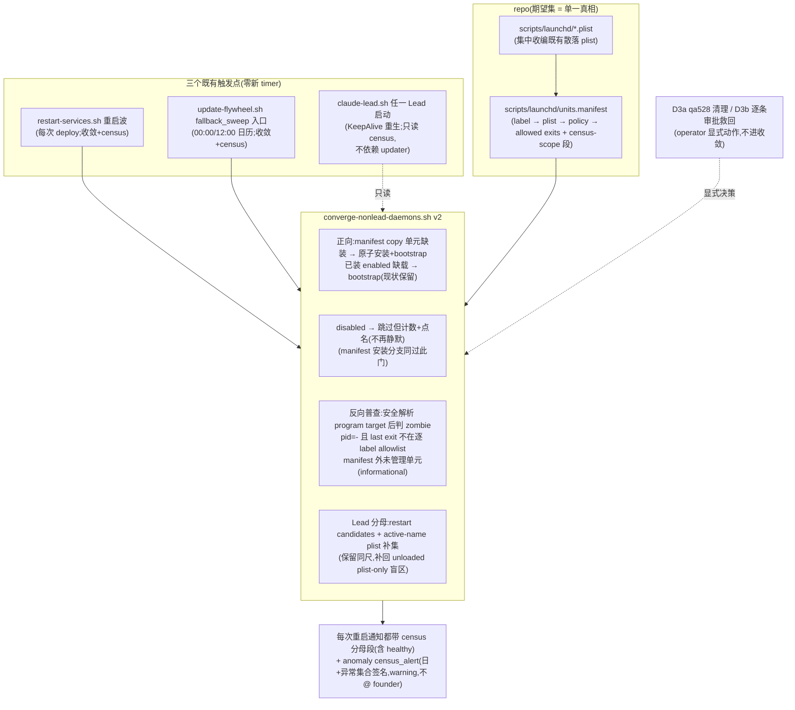

# FLY-1814 launchd 掉队收敛 — 实施计划

Issue: FLY-1814 (https://linear.app/geoforge3d/issue/FLY-1814/infra地基-掉出-launchd-的任务永远没人接回来-现在-14-个能力静默死着含唯一合法重启入口updater10天和-codex)
日期: 2026-08-19
基于: 无(直接审计;上游 = Linear issue 正文 + 评论区终稿定位[Annie 批准, 2026-08-19] + 本节点代码审计 + claude-design-review-round1.md[18 条全采纳] + claude-design-review-round2.md[N1-N6 全采纳] + Codex 正式设计审查第 1 轮[3 HIGH + 5 MEDIUM + 3 LOW 全采纳])

---

## 0. 保质期表 — 本计划里会过期的结论(先读这个)

| 结论 | as-of | 复核命令 | 过期后影响 |
|---|---|---|---|
| 8 个 aux job(growth×4 / sub×2 / skills-update / token-usage-daily)带 `disabled` override,两个域一致 | 2026-08-18 21:10 PDT | `launchctl print-disabled gui/$(id -u) \| grep flywheel` | §2 事实修正与 D3b 清单要重算 |
| 原 14 个里的 6 个核心 job(updater/quota-monitor/liveness-probe/standup + 2 Codex Lead)已回到 launchd | 2026-08-18 21:10 PDT | `launchctl list \| grep com.flywheel` | D3 清单要重算 |
| `com.xiaohongshu-deep-learning.qa528` 仍 loaded 且指向已删除的 `/var/folders/.../tmptczovkqh/...` 脚本 | 2026-08-18 21:15 PDT | `launchctl print gui/$(id -u)/com.xiaohongshu-deep-learning.qa528` | D3a 作废/改列 |
| `#866`(FLY-1830)收敛库已在 main 且生产验证生效(6 个核心 job 是它捞回来的) | 2026-08-18(commit `8b4e6c601`) | `git log --oneline main \| grep FLY-1830` | 计划前提崩塌,重审 |
| FLY-650 已由 `72cd5589f` 实施,但未改变 Darwin aux LaunchAgent 的 repo 字节权威;`provision-fleet-host.sh` 仍把 Darwin aux bring-up 委托给 `restart-services.sh` | 2026-08-19 | `git show --stat 72cd5589f && rg 'restart-services' scripts/provision-fleet-host.sh` | 若后续 portable provisioning 开始渲染 aux plist,§7 A4 要重审 |
| 代码行号(converge-nonlead-daemons.sh:256 等) | 2026-08-18 head | `git log -S "<代码片段>"` 重定位 | 行号漂移,语义不变 |

---

## 1. 一句话

把「launchd job 掉队」从一次性止血变成结构性收敛:以 repo 内 **units manifest** 为分母,在**既有触发点**(重启波 / updater 日历 / 任一 Lead 启动)上做双向收敛与普查(装回真掉队的、点名被 disable 的、揪出不该存在的),并把完整分母摘要写进每次成功重启通知;外加一次性清理(qa528)、逐条审批救回清单(8 aux,Annie 打勾制)、codex-log-guard 首装、CI 闭环、以及 Lead 冷启分批错峰(4×4/60s,已拍板)。**零新 timer、零新 daemon、零新 flag。**

## 2. 背景与事实修正

### 2.1 已经修好的部分(不重造)

`#866`(FLY-1830, `scripts/lib/converge-nonlead-daemons.sh`, 从 `restart-services.sh:2716` 调用)已让「已安装、enabled、但掉出 domain」的非 Lead daemon 在每次重启波自动收敛。生产验证:原 14 个里的 6 个核心 job 如今全部 loaded。**本计划不重建收敛机制,只补它结构性看不见的三类,并补一个不依赖 updater 的触发锚点(§2.5)。**

### 2.2 ⚠️ 事实修正:那 8 个 aux 不是「#866 救不回」,是**被 disabled flag 挡住的**

终稿定位写「已装但 #866 收敛救不回的 aux(实测 8 个仍掉)」,其依据是 08-18 20:21 的复测结论「print-disabled 显示 disabled=true 数量为 0」。本节点 08-18 21:10 双域实测推翻该读数:

```
launchctl print-disabled gui/$(id -u)   → 44 条 override,16 disabled / 28 enabled
launchctl print-disabled user/$(id -u)  → 同样 8 个 flywheel aux => disabled
值格式是 "=> disabled" / "=> enabled",不是 true/false
```

那 8 个(growth-improve/-learn/-report/-retro、sub-create-nightly、sub-daily-loop、skills-update、token-usage-daily)**全部 `=> disabled`**。08-18 那次「0 个 disabled」很可能是 parse pattern 按 `true` 匹配、没对上 `disabled` 字面(08-16 的复核与本次两个读数一致,孤例是 08-18 那一次)。机制上这正好解释「救不回」:`converge-nonlead-daemons.sh:256` 对 disabled 标签**故意 `continue`**(设计如此——收敛不得撤销有记录的决定),且当前是**静默跳过,不计数不报告**。

**Provenance 线索**(是线索不是结论):8 个里 6 个盘上带 `*.bak-fly886-20260709-125132` 备份;FLY-886(sub→tidal-echo 编排折叠)恰在 07-09 二次 In Progress、后于 08-14 被 **Canceled**。即 disabled flag 疑似一次**已取消迁移**的残留。skills-update 与 token-usage-daily 无此戳,来源不明。

**对本计划的影响**:救回这 8 个需要 `launchctl enable` + `bootstrap`,是在撤销一个有记录的 flag。事实修正已报 Tadashi 采纳并转 Annie,**Annie 裁定(2026-08-18,原话)**:「要救 不过不急 而且可能需要分别审批还需不需要 要怎么救」⇒ 不做批量救回,改为**逐条审批清单**(D3b),她逐条打勾后才执行;「不急」= 清单在机制半落地后出,不挡主线。收敛机制本身**继续尊重 disabled**,只把静默跳过改成计数+点名(D2)。

### 2.3 终稿范围 ↔ 本计划交付物映射

| 终稿范围(Annie 批准) | 交付物 |
|---|---|
| ① 已装但收敛救不回的 aux(8 个) | D2(disabled 可见性)+ D3b(逐条审批清单,Annie 打勾后逐条执行) |
| ② 交付但从未安装(codex-log-guard) | D1(manifest + 安装通道)+ D2(install-if-missing 收敛)。**验收 = codex-log-guard 经此通道装回**。终稿提到的 FLY-1330 janitor 在本仓当前零 footprint(全仓 grep 仅本计划自指)——它是**未来交付物**,通道为它这类新单元而设,但不进本单验收 |
| ③ 活口指死脚本(qa528) | D2(反向普查)+ D3a(一次性清理) |
| 附:查 CI 同源盲区 | D5(分析结论 + CI 闭环测试) |
| 附:并发上限方案 A(16 Lead 冷启分批错峰) | D4(4×4/60s,Discord 决定卡 1887-P2a 已拍板) |
| 附:voice-bridge 族不装(双监听) | D1 policy=`managed`(结构性挡住) |

### 2.4 为什么每次都发现不了(结构原因,决定设计形状)

- `#866` 的分母 = **盘上已装的 plist** ⇒「交付但从未安装」在定义上不可见;CI 测试继承同一分母 ⇒ 同源盲区(详 D5)。
- 收敛只往一个方向扫 ⇒「不该存在还在定时失败」(qa528)永远发现不了。
- disabled 跳过是静默的 ⇒「被关掉」与「在跑」在所有报告里长得一样。
- 队伍变小与健康一模一样 ⇒ 缺一个 repo 内的**期望集**(分母)。

### 2.5 ⚠️ 触发锚点的诚实账(交叉评审 #1,HIGH)

初稿把触发面写成「三重兜底」,实测是错的:**自动触发 `restart-services.sh` 的只有 updater 一条链**(`update-flywheel.sh:95`;self-ship FATAL 只检测不恢复,`self-ship-restart.sh:81-86` return 69 后要求「operator / next deploy 重新 enable」而 next deploy 恰恰需要 updater——闭环依赖;「登录重载」在常驻不注销的机器上永不触发)。08-18 那 6 个核心 job 被捞回,靠的是**人手**跑波。⇒ 若 updater 再次掉出,收敛与 census 一次都不会跑——与 issue 原始事故完全同构。

**修法(抄 `converge-flywheel-bin.sh:13` 的三挂点先例)**:D2.6 在 `claude-lead.sh` 的 Lead 启动路径加**只读 census**(不 bootstrap,不依赖 updater;任一 Lead 因 KeepAlive 重生即跑),发现可行动异常时经 `lead-alert.sh` 报一条(UTC 日+异常集合签名)。这是「updater 已死」世界里唯一能出声的东西。残余 SPOF 见 §6。

## 3. 设计总览



「由谁、什么时候、用什么信号发现」:**重启波(每次 deploy)+ updater 日历(12h 地板)+ 任一 Lead 重生(不依赖 updater 的第三锚点);信号 = 重启通知 census 段 + `census_alert`(UTC 日+可行动异常集合去重)。**

## 4. 交付物

### D1 — units manifest + plist 收编(期望集落 repo)

**文件**:`scripts/launchd/units.manifest`(TSV,`label \t plist_source \t policy \t allowed_exit_codes \t note`;`allowed_exit_codes` 是逗号分隔十进制整数,至少含 `0`,未知/空值 fail-closed;`#` 注释;另含 `# census-scope: <前缀>` 段声明反向普查的归属前缀——分母全部落 repo,不在代码里硬编码名单[评审 #10])。选 TSV:消费者是 Bash 3.2 收敛库,零依赖。`daily-standup` 明列 `0,1`——其 restart lock 冲突按脚本契约返回 1,不得把一天前的正常跳过报成 live failure;其余初始 repo 单元仅允许 `0`。

**host scope 声明**(评审 #2):manifest 顶部注释写死「`copy` 行只对 repo 与 `$HOME` 布局逐字匹配本机的主机成立」;packaged/fleet 主机不走 `copy`(`72cd5589f` 已实现 FLY-650,但 `provision-fleet-host` 的 Darwin aux bring-up 仍明确委托 `restart-services.sh`,并未渲染这些 plist——见 §7 A4)。

**policy 词表**(每行必填,fail-closed:未知 policy = 该行拒绝收敛并计 failed):

| policy | 语义 | 收敛动作 | census 期望 |
|---|---|---|---|
| `copy` | plist 以 repo 为字节权威 | 缺装 → **原子安装**(同目录 mktemp stage → chmod 0644 → Label 解析且与 manifest 一致 → mv → 复验,抄 `r4-window.sh:538` `r4_restore_updater` 形态[评审 #12])+ `bootstrap`;**bootstrap 前置检查**:①先过 disabled 门(「从未安装 + 已 disabled」真实可达,override DB 按 label 索引与 plist 无关[评审 #9b])②用 D2 的安全三态 resolver 得到 `resolved` 且脚本路径本机存在;`unknown` 或路径不存在都拒装、计 failed、点名「plist 路径不可验证/不适用于本机」[评审 #2] | enabled 时应 loaded;installed 内容与 repo 不一致 → 计 drift 点名(**不自动改写**) |
| `setup` | 经专用 setup 脚本渲染安装(quota-monitor 等) | 只做「已装缺载 → bootstrap」;**从不**从 repo 覆盖 | enabled 时应 loaded;未装 → 点名「需跑 setup」 |
| `external` | plist 只存在于机器(growth×4 / sub×2 / skills-update:payload 属别的 repo) | 只做「已装 + enabled 缺载 → bootstrap」 | disabled 时列入 disabled 段;未装不报错 |
| `managed` | 不该以 launchd job 形态存在(voice-bridge:supervisor 直管,装 plist = 双监听) | **永不**安装/bootstrap | 若发现其 label loaded → 反向普查按 anomaly 点名 |
| `hold` | 已交付、决策上暂不启用 | 不装不 bootstrap | 不报错,census 单列「hold: N」 |

**初始清单**(实施时以 §0 复核命令重验后定稿):`copy` = updater、daily-standup、token-usage-daily、bridge-liveness-probe、**codex-log-guard(本单唯一「从未安装但允许首装」的点名例外;验收即经此通道首装)**;`hold` = daily-digest(`pending-founder-optin`)、xiaohongshu-learning(创始人 gated pilot)。**通用规则:从未安装默认 `hold`,不得用「当前没 loaded」自动升级为 `copy`;只有显式逐 label 产品裁定可升级。**`setup` = quota-monitor、cmux-watcher、bridge;`external` = growth×4、sub×2、skills-update;`managed` = voice-bridge。**不入 manifest**:`com.flywheel.lead.*`(Lead wave/fleet 属地)、卫星前缀(census-scope 段声明,只进反向普查)。

**plist 收编与引用改写**(评审 #3,逐条核实过的完整清单):

`git mv scripts/com.flywheel.{updater,daily-standup,token-usage-daily,daily-digest,xiaohongshu-learning}.plist scripts/launchd/`,`.template` 留原处。必改引用:

1. `scripts/package-onboard.sh:102-103`(`PO_SCRIPT_FILES` 单列 updater + daily-standup;`po_copy_curated_scripts` `:548-551` 对缺失文件**硬失败**——不改打包直接红);
2. `scripts/package-onboard-files.allow:37-38`(**删除**——`:63` 的 `scripts/launchd/*` 通配已覆盖搬家后的文件;gate② 只校验「树里每个文件命中某条 pattern」,不校验反向,改路径只会留一条与通配重复的冗余行[评审 R2-N5]);
3. `scripts/r4/r4-window.sh:538`(`r4_restore_updater()` 读 `$R4_REPO/scripts/com.flywheel.updater.plist`——**灾难恢复里装回 updater 的函数**,默默打断 = 下次事故失去救命绳);
4. plist 的**自述安装注释/header**:`token-usage-daily`、`daily-digest` 的旧 `cp` 路径,以及 `bridge-liveness-probe`、`codex-log-guard` 仍自称 `TEMPLATE`/手工编辑;统一改成 manifest-managed 语义。和代码引用改写分开 commit,内容 diff 只有注释;
5. 文档:`packages/token-usage/README.md:79`、`doc/engineer/implementation/FLY-222-a0-a10-runbook.md:138` 等 grep 所得。

(初稿列的 `flywheel-daemon.sh` 引用**不存在**,已删——它只有 Lead plist 生成,不引这 5 个文件。)

**零残留断言必须三形态**(评审 #3):路径形 `scripts/com\.flywheel\.[a-z-]*\.plist`、相对路径形、**裸 basename 出现在清单类文件**(PO_SCRIPT_FILES / allowlist)——第三种才抓得住 `package-onboard.sh:103`。验收含跑 package-onboard 相关测试证明打包产物布局迁移完成。

**新单元交付通道**(FLY-1330 类未来单元):①plist 进 `scripts/launchd/` ②manifest 加行 ③(copy 类)下一个重启波自动装。D6 runbook 写明。

### D2 — converge-nonlead-daemons v2(双向收敛 + 普查)

改造 `scripts/lib/converge-nonlead-daemons.sh`(保持 source-only、Bash 3.2、tri-state probe、fail-closed disabled parse 全部现状纪律)。**新增 seam**(评审 #8):`_cnd_units_manifest()`(manifest 路径)、`_cnd_repo_launchd_dir()`(源目录)、`_cnd_install_plist()`(stage+validate+mv 原子安装)——行为测试用 fixture manifest,真实 manifest 的正确性由 D5.1 闭环测试单独守,**两类测试分母分开**。

1. **manifest 驱动的正向收敛**:「盘上 plist 枚举」升级为「manifest ∪ 盘上枚举」,各 policy 按 D1 表。行级错误 fail-closed 计 failed;**文件级** manifest 缺失/不可读 ⇒ `degraded` + 明确 detail(`units manifest unreadable: <path>`),**永不 healthy**;此时 manifest 驱动的安装分支跳过,但 v1 的盘上收敛照跑(已被生产验证的那半不陪葬)(评审 #9a)。
2. **disabled 可见性**:跳过 disabled 时累计 `skipped_disabled` 数+点名进 DETAIL。仍然**永不 enable**;manifest 安装分支同过此门(评审 #9b)。
3. **反向普查**(新函数 `census_launchd_fleet`,只读):
   - 枚举 `~/Library/LaunchAgents/*.plist` 不带前缀过滤(排除 `*.bak*`/`*-staged`/`*.pre-*`/`retired-*/`),按 **manifest census-scope 段**声明的前缀取「我们的」(评审 #10);
   - **ProgramArguments 安全 resolver(正向安装预检与 zombie 共用)**:返回 `resolved:<path>` / `not-applicable` / `unknown` 三态,**永不 `eval`、永不执行 plist 内容**。直接 interpreter 形态(`/bin/bash <script>`,`node <script>`)只接受参数数组里的首个绝对路径或字面 `~/...`;shell `-c` 只识别两种严格语法:整个 command 的首个安全路径 token(覆盖 `~/.flywheel/bin/skills-sync.sh`)或分号边界后的 `exec <安全路径 token>`(覆盖 liveness 的 `...; exec /Users/.../bridge-liveness-probe.sh`);token 仅准 `[A-Za-z0-9_./~+-]`,不做引号/命令替换/变量展开。只把开头字面 `~/` 展开为当前 `$HOME/`;字面 `$HOME`、其他 `$VAR`、glob、subshell、管道等一律 `unknown`。`unknown` 计 `unverifiable`,**不得**伪装成 zombie;copy 首装遇到 unknown fail-closed,只读 census 则点名并进入 anomaly 集合告警。
   - **zombie**:installed 或 loaded、resolver 为 `resolved` 且目标脚本不存在 → 点名(qa528 类);`not-applicable` 不按文件型 zombie 判。
   - **live failure**:`launchctl list` 中 pid="-" 且 last exit 不在该 manifest 行 `allowed_exit_codes` → 点名;有 pid 的历史非零退出**不报**(疤痕不是故障)。manifest 外/卫星 job 没有可靠退出契约,其非零只进 informational,不抬高状态;zombie 仍按上条独立可行动。
   - **unmanaged**:installed、非 Lead、非 census-scope 卫星、又不在 manifest → informational 一行(不 alert);
   - **Lead 分母**(评审 #4 + 正式审查修正):以 `lead_restart_collect_candidates`(`scripts/lib/lead-restart-lifecycle.sh:733`)为重启权威主集,但该函数当前会 `continue` 丢掉 `probe=unloaded` 的 plist-only Lead,恰好会漏本单 D 类。census 因此取**主集 ∪ active-name 的 `~/Library/LaunchAgents/com.flywheel.lead.*.plist` 补集**;补集按 plist 内 Label 验证、排除 `*.bak*`/retired/staged 与 `flywheel-test-*`,只用于只读分母,不反向改变 restart wave 权威。期望 = union 中非 skip-test 数,实载 = 逐 label domain probe loaded 数,`manifestless` 单列。这样保留「同尺」又显式补回 unloaded plist-only 盲区;
   - **仪器正对照**(评审 #11 修正谓词):`instrument_suspect` 只在**可证的仪器故障**时触发——`nonlead_daemon_disabled_labels` 返回非零(解析失败),或 `launchctl list` 非零/不可解析,或「manifest 声明 N 个 enabled 单元而 launchctl 一个都看不到」(相对分母,不用绝对数)。`print-disabled` 列表为空是**合法状态**(干净主机),不是故障。suspect 时不产出任何缺席结论。
4. **结果外露(含 healthy path)**:census 使用独立 `LAUNCHD_CENSUS_SUMMARY`,不靠当前只在 `state != healthy` 才附加的 `NONLEAD_DAEMON_CONVERGE_DETAIL`。给 `rn_render_completion_message` 增加一个明确的 `launchd_summary` 位置参数,更新全部生产 caller 与 `scripts/test-restart-services.sh` 的所有调用;renderer 在 routine healthy 完成消息里也始终追加一行,形如 `launchd: expected=N loaded=M converged=K skipped_disabled=J hold=H drift=D zombie=Z unverifiable=U lead=15/15(+1 manifestless)`。`skipped_disabled`/`hold`/unmanaged 只是分母可见性,**不把 state 从 healthy 抬成 degraded,也不触发 alert**;只有 expected-unloaded、install/parse failure、managed-loaded、drift、zombie、unverifiable、或契约外 live failure 算 anomaly。告警身份只取排序去重后的可行动 `category:name` 集合,不含 informational 明细;稳定的 disabled 决策不会制造告警风暴,同日新增异常也不会被旧 receipt 吞掉,且 founder-visible 分母每波都在。
5. **updater 日历地板**(评审 #6/#7/#13 全折入):收敛调用放 `fallback_sweep()` **入口**(fetch 之前——收敛是纯 launchd 侧动作,不该被 git fetch 结果或 deploy dirty 门控;三条出口都保证跑过一次)。并发防护用**只读探测**不取锁(抄 `daily-standup.sh:38-56` 逐字先例):`[[ -d ~/.flywheel/restart.lock.d ]] && skip`(TOCTOU 最坏多一次会失败的幂等 bootstrap,可忽略;**绝不 mkdir 抢占**——updater 崩溃残留锁会静默阻塞后续所有部署至 stale 阈值 7200s)。告警走新 helper `census_alert()`:**`--kind deploy_degraded`**(评审 R2-N1:`lead-alert.sh` 的 kind 是封闭白名单,未命中即 config_error 退出;`deploy_degraded` 在 `lead-alert.sh` / `LeadAlertNotifier.ts` / `kind-contract.ts` 三面已注册,且其注释逐字就是「update-flywheel.sh + `--lead updater` 的 shell-only deploy notice」场景——零注册成本,Bridge 启动零风险,§6 推掉 FleetSensors 的「新 kind 注册成本」理由保持成立;**不新增 kind**)、severity=**warning**、`--lead updater`、签名 `launchd-census-$(date -u +%Y%m%d)-<anomaly-set-sha256-16>`(hash 输入是排序去重的可行动 `category:name` 集合,签名取前 16 位,不含 informational/body 明细;同集合跨三个锚点共享 receipt,同日新增异常获得新 receipt)、**不 mention founder**、`1>&2 || true`,明细只进 body;**不得复用** `update-flywheel.sh` 现有的 `severe_alert`(severe + 分钟粒度签名 + @founder,全错)。sourced 测试路径零真实 POST(`ENV_FILE=/dev/null` 纪律)进验收;D5.2 加断言:census_alert 的 kind 在 `lead-alert.sh` 白名单内(防未来改 kind 后静默 config_error)。
6. **第三锚点**(评审 #1;调用形态按 R2-N2 写死):新增**薄可执行入口** `scripts/launchd-census.sh`(source 收敛库 → 调 `census_launchd_fleet` → 只读输出 + 按需 `census_alert`;不是新 daemon/timer/flag,只是 entrypoint)。`claude-lead.sh` 按 `converge_flywheel_bin()`(`:1314-1330`)同款**子进程调用**它——**不许** `bash scripts/lib/converge-nonlead-daemons.sh`(source-only 库无 main,直接执行 = exit 0 静默空跑还被日志报 OK,正是本单要消灭的故障形状)。顺手治本:收敛库末尾补 **auto-run guard**(`self-ship-queue.sh` 末尾同款:被直接执行时 exit 64 并自述 source-only),让写错调用形态从静默成功变响亮失败。**守卫**(R2-N4,抄先例第一件事):`FLYWHEEL_LEAD_DRY_RUN=1` 跳过;QA slot Lead(`flywheel-test-*` 身份)跳过——机器只有一个 gui 域,dry-run/QA 无资格代表生产下结论,其告警隔离也不是本计划能保证的前提。锚点语义:non-fatal、只读、不 bootstrap、不依赖 updater;可行动异常 → `census_alert` 同款 UTC 日+异常集合签名。

### D3 — 一次性清理与逐条审批救回(operator 显式动作,不进收敛逻辑)

按 Annie 裁定(要救/不急/分别审批)拆两半。**执行纪律修正**(评审 #14):FLY-913 guard 按命令串匹配,`bash scripts/fly1814-*.sh --apply` **不会被拦**(内部 launchctl 在子进程,hook 看不见)——初稿「被硬拦所以只能 operator 跑」是错的,已删。改为**脚本自证 operator 身份**:非 TTY 拒绝 `--apply`(只许 dry-run),显式 `--i-am-operator` 才放行,且执行时经 `lead-alert.sh` 留审计(审计写成功 + 送达确认,缺一不可——与 guard bypass 记账形状一致)。

**D3a — qa528 清理**(随主线):`scripts/fly1814-cleanup-zombie.sh`,幂等、dry-run 默认:`bootout` qa528 + plist 归档 `~/Library/LaunchAgents/retired-YYYYMMDD/`(沿用盘上已有形态;删除前 grep 引用)。

**D3b — 8 个 aux 的逐条审批清单**(机制半落地后出,不挡主线):清单文档每行一个决策:名字 / 它负责什么 / 为何 disabled(provenance:6 个带 bak-fly886 戳、2 个来源不明)/ 建议 / 确切 enable+bootstrap 命令。Annie **逐条打勾**后 operator 按勾执行 `scripts/fly1814-enable-aux-job.sh <label>`(单 label,幂等,打印前后状态证据);没打勾的行 manifest 改 policy=hold。执行完 census 自证:`zombie=0`,`skipped_disabled` = 「保持停用」裁定数。

codex-log-guard **不在**此脚本里:走 D1/D2 正道(manifest copy 行,merge 后首个重启波自动装上)——验收「装回它」证明的就是通道本身。

### D4 — Lead 冷启分批错峰(方案 A,已拍板)

`do_restart_all_leads()`(restart-services.sh:2149)候选循环:每完成 **4** 个 `classification=restart` 的 Lead,批间等待 **60s**(**参数已拍板**:Discord #flywheel-core 决定卡 1887-P2a 候选 A 原文「4×4,间隔 60 秒,不减能力只错峰」,Annie 回「a」;**不加就绪门**)。skip-test / manifestless 不计批。

**调用场景分开写死**:`do_restart_all_leads stagger|immediate` 取显式函数参数;正常 deploy 冷启动传 `stagger`,执行 4×4/60s;emergency rollback 调用点传 `immediate`,保持最快恢复、避免在故障回滚里额外平白等待约 3 分钟。未知 mode fail-closed。两条路径共享同一候选/结果逻辑,只有 `_dral_sleep` 是否调用不同;测试分别覆盖,不靠环境变量暗切。

实现精度(评审 #5/#17/#18):

- 常量用**函数内 `local batch_size=4 pause_secs=60`**,不进脚本头——`scripts/test-restart-services.sh:349-351` 用 awk 只抽函数体在 `set -u` 下跑,脚本头常量会 unbound 直接红;不用 `${VAR:-60}`(那是新 env 旋钮,违背铁律);
- sleep 走单点 seam `_dral_sleep()`(与 `_cnd_launchctl` 同款),测试 stub 成 no-op;
- stdout 契约(`skipped:N failed:N total:N`)不变;`$( )` 捕获点实为 **2 个**(`:2380` rollback、`:2614` deploy)——初稿写「三个」抄了 `:2168` 的过期注释,实施时顺手修正那条注释;
- 已知边界记录:批间 sleep 落在 command substitution 子 shell 里,父进程 TERM trap 在子 shell 已重置,「波中被 TERM」窗口扩大 ~3 分钟,结果是 lead_result 空 → 既有 unreadable 分支,可接受,不另设防;
- **观测**(评审 #18;落法按 R2-N3 修正):**不碰**既有 `LEAD_BODY_OBSERVATIONS_FILE` 的 5 字段 TAB 契约(写 `:1117-1119` / 读 `:1141` 硬绑;加第 6 字段会让 `read` 把余量塞进最后一个变量 → provenance 匹配全失败 → founder 可见完成消息的 body 计数塌成 0/0/N)。verify 耗时(kickstart → outcome_ready)**另写独立 sidecar 文件**,完成消息给一行分布,且必须**标注样本数与「失败 Lead 不在样本内」**(耗时只在成功分支记录,分布天然偏乐观,调参者需知)。

### D5 — CI 同源盲区:结论 + 闭环

**为什么测试与 roster 同源盲区**:`converge-nonlead-daemons.test.sh` 的 seam(`:33-82`)驱动 fixture 化的「已装目录」——它验证「给定这套已装 plist,收敛行为对不对」,而「codex-log-guard 该不该在这套里」不在它的宇宙里;`fly1663-qa-launchd.test.sh` 同理。**测试继承了被测库的分母定义,而分母本身没被任何东西声明过。** 修复 = D1 把分母落 repo,测试改绑 repo 真相:

1. **manifest 闭环测试**(新 `scripts/__tests__/launchd-units-manifest.test.sh`):manifest ↔ `scripts/launchd/` 双向闭合(**codex-log-guard 类「交付未登记」从此 CI 必红**);每行 Label 可解析、与文件内声明一致、非 Lead;policy 与 `allowed_exit_codes` 格式在词表;`copy` 行 ProgramArguments 经同一 resolver 得到 `resolved`。CI 路径验证与运行时主机预检明确分层:运行时检查展开后的真实 host 路径;CI 只把**精确已知前缀** `/Users/xiaorongli/Dev/flywheel/` remap 到当前 checkout root 后检查,其他绝对 host 前缀 fail-closed,`~/.flywheel/...` 等外部 home payload 不伪装成 repo 文件。由此「指死 repo 脚本」对自家单元 CI 必红,同时不把 host-specific 外部 payload 误判成 checkout 文件;census-scope 段格式合法。
2. **converge v2 行为测试**(扩展既有 .test.sh,fixture manifest):never-installed→原子安装+bootstrap;从未安装默认 hold + codex-log-guard 点名例外;「从未安装+disabled」→ 不装;disabled 跳过点名但保持 healthy;managed loaded → anomaly;ProgramArguments resolver 直连、`bash -c` 的 `exec`、字面 `~/`、动态 shell→unknown 四类;zombie;daily-standup exit 1 allowlisted 与非 allowlisted live-failure;unmanaged informational;Lead 主集与 unloaded plist-only 补集各一;instrument_suspect 修正谓词正反对照(空 print-disabled 列表 = 合法;解析失败 = suspect);manifest 文件缺失 → degraded 且盘上收敛照跑;未知 policy/allowed exits fail-closed;census_alert 的 kind 在 `lead-alert.sh` 白名单内(R2-N1);同日相同异常集合签名相同、不同集合签名不同;**healthy completion-message 阳性断言**(无 anomaly 仍含 `launchd: expected=... skipped_disabled=... hold=...`,并更新 renderer 全部调用);**第三锚点阳性对照**(R2-N2:不止断言 `claude-lead.sh` 调用点存在——空跑的调用点也存在;要喂 fixture 域断言 entrypoint 真产生非空 census 输出;库的 auto-run guard 直接执行 exit 64);dry-run/`flywheel-test-*` 身份下第三锚点零 census 零 alert(R2-N4)。
3. **D3 脚本测试**:dry-run 零 mutation;非 TTY 拒 `--apply`;`--apply` 在 seam 下逐步断言。
4. **D4**:批边界次序断言(`_dral_sleep` stub 计数),`scripts/test-restart-services.sh` 全套照跑。
5. **CI 注册**(评审 #16):同步 `.github/workflows/ci.yml` script-tests 显式枚举(FLY-1759 无 glob)+ `ci-structure.test.sh:585` 精确相等断言集合,并跑专门守「新增 shell suite 必须进 CI」的 `scripts/__tests__/ci-shell-suite-enumeration.test.sh`;确认 FLY-1870 的 script-tests 20 分钟上限余量。

### D6 — runbook:退役约定收敛成一条

现状三种互不知晓的退役形态(dated-subdir / `.decommissioned-*.bak` / `launchctl disable`)。runbook(`doc/engineer/implementation/launchd-units.md`)写死唯一约定:**退役 = bootout + plist 移入 `retired-YYYYMMDD/` + 删 manifest 行(或改 hold);`launchctl disable` 不是退役手段**(本单 §2.2 即证据)。附:新单元交付通道、census 读法、D3 审计要求、与 `fleet/manifest.json .launchdJobs[]` 的关系(见 §6)。

## 5. 实施顺序(单 PR,commit 分层)

1. D1 收编 git mv + 完整引用改写(**含 package-onboard.sh/allow/r4-window 三个 hard-fail 点**;plist 自述注释单独 commit)→ 2. D5.1 闭环测试(RED 先证尺子:codex-log-guard 未入 manifest 必红)→ 3. D2 converge v2 + D2.6 第三锚点 + D5.2(TDD)→ 4. D4 错峰 + D5.4 → 5. D3a/D3b 脚本 + D5.3 → 6. D5.5 CI 枚举同步 → 7. D6 runbook + CLAUDE.md 里程碑。

全仓 gate:`pnpm lint` + `pnpm -r build` + `pnpm test:packages:run` + 全部 `scripts/__tests__/*.test.sh` + **`scripts/test-restart-services.sh` 全套**(它在 `scripts/` 根下,不在 `__tests__` glob 里)+ package-onboard 相关测试 + `scripts/__tests__/ci-shell-suite-enumeration.test.sh` + sourced 测试零真实 POST 验证。

merge 后动作(operator):跑 D3a(qa528)→ 下一个重启波验证 codex-log-guard 自动装上 + census 段出现在通知里 → 出 D3b 清单交 Annie 逐条打勾(不急)→ 按勾执行。

## 6. 边界与非目标(诚实边界)

- **残余 SPOF(必须知道)**:三个锚点里,波与日历仍在 updater 下游;第三锚点(Lead 重生)只在有 Lead 死重生时触发且**只报警不修复**。⇒ 「updater 掉出 + 所有 Lead 稳定存活 + 无人手跑波」的世界里,发现延迟 = 到下一次任一 Lead 重生为止,修复仍需人。彻底independent 的 10-min 检测 = Bridge FleetSensors follow-up(`fleet-sensors.ts` 已有 botTick/`probeLaunchdJobAlive` tri-state 先例,2-edit 挂 lead-reconcile pass;新 alert kind + kind-contract 注册,告警风暴有疤[FLY-218/220],值得单独一单带独立 QA)。
- **不自动 enable**:disabled = 有记录的决定,机器永不撤销;撤销只在 D3b 打勾制里发生。
- **不自动删除**:zombie/unmanaged 只点名(qa528 在 D3a 一次性处理)。
- **不收敛 Lead 家族**:D 类掉队的**发现**由 census Lead 分母行覆盖(与重启波同尺),**恢复**归 Lead wave/fleet 属地(TUI 双监听风险);FLY-1800 是其成因单,不重叠。
- **不做 drift 自动改写**:copy 行 installed≠repo 只点名(会碰 operator 手改现场)。
- **不碰卫星 job 管理权**:census 可见(census-scope 段),收敛不动。
- **两份「期望集」的关系**(评审 #15):`units.manifest` = **声明**(本机权威);`fleet/manifest.json .launchdJobs[]` = **抓取**产物(fleet-capture 生成,provisioning 输入)。漂移时本机以 units.manifest 为准;fleet 侧收口不在本单(provision-fleet-host 明写 darwin aux 委托 restart-services,方向一致)。
- **manifest 不管非 launchd 形态**(voice-bridge supervisor 直管等):policy=managed 只表达「别装」。
- **已知可接受:self-ship 部署时收敛跑两遍**(R2-N6):`process_due_markers` → 波内一次(`:2716`)→ `fallback_sweep` 入口再一次。无害:收敛幂等、census 只读、同一异常集合日内去重吸收重复告警;代价是每 label 多一次 `launchctl print` 与日志里出现两段 census 摘要——记在此处,不为它加进程内状态。

## 7. 待确认假设(设计评审输入)

| # | 假设 | 状态 |
|---|---|---|
| A1 | ~~8 个 aux 的 enable 决策~~ | **已裁定**(Annie 2026-08-18):要救/不急/分别审批 ⇒ D3b 打勾制 |
| A2 | ~~方案 A 参数~~ | **已解决**:4×4/60s 已拍板(1887-P2a) |
| A3 | ~~daily-digest / xiaohongshu-learning 的期望态~~ | **已裁定**(Tadashi 2026-08-19):两者都 `hold`;daily-digest 标 `pending-founder-optin`,由 Lead 另问 Annie。codex-log-guard 是唯一 never-installed→copy 例外 |
| A4 | ~~FLY-650 是否仍未实施、会否与 repo plist 字节权威冲突~~ | **已解决**:`72cd5589f` 已实施 FLY-650,但没有渲染 Darwin aux plist;当前 `provision-fleet-host.sh` 仍委托 `restart-services.sh`。本单 `copy` 是当前权威,未来 provisioning 若扩到 aux plist 再以 §0 命令触发重审 |
