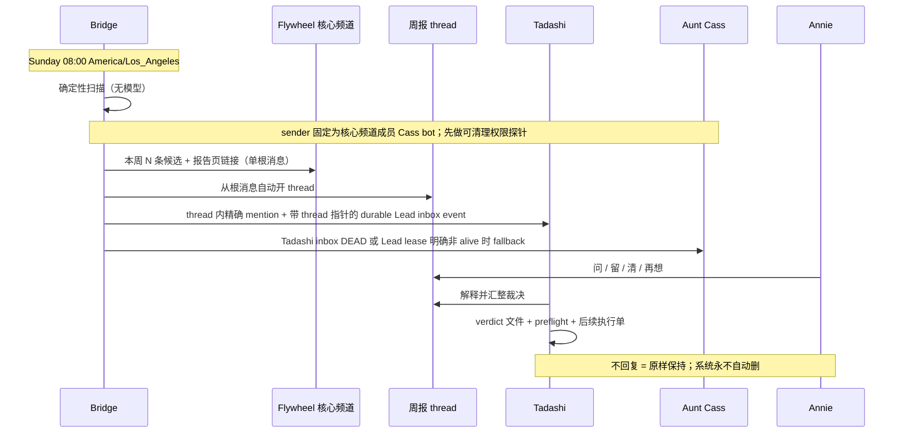

# FLY-1831 Flag 治理 A9 收尾 — 探索
Issue: FLY-1831 (https://linear.app/geoforge3d/issue/FLY-1831/flag治理a9收尾包-每周扫描运行合同-finalize-qa-脚本退役-flag-墓碑对齐并1881-8-个直读-env-残余逐条对账)
日期: 2026-08-21
基于: 无

## 1. 问题不是扫描算法，而是最后一公里合同仍分叉

FLY-1781 已经交付确定性扫描、稳定值判据、四层防派工、冻结候选、verdict 文件与 preflight；FLY-1808 已把五个 workflow 开关固化并写入 `RETIRED_FLAGS`。本单不重做这两套机制，只修三处收尾分叉：

1. 调度仍是“距上次成功满 7 天”，founder 无法预期固定到货时间。
2. 成功发布仍以“有候选”为前提，0 候选周不会固定收到报告；Discord 只有根消息，没有提问 thread，也没有机制化通知 Tadashi。
3. `qa-generalized` 仍把 FLY-1808 的五个墓碑当成启动条件注入和断言；另有 8 个直读 env 虽各自已有零散解释，但没有一张由代码测试钉死的最终处置表。

## 2. Founder 已定死的体验

Flywheel 试点的阅读面必须是 `generalChannel=1516209289406971965`。Linear 单保留为机器台账和裁决绑定，不再被描述为 founder 的主要阅读面。报告生成、候选计算和发布均不用 LLM；thread 内答疑由 Engineering Lead 承接。

## 3. 必须分开的两个“7 天”

- **运行时钟**：固定 `America/Los_Angeles` 周日 08:00。Bridge 若在槽位时离线，恢复后第一个 rider tick 补跑本周槽；同一槽最多提交一轮。
- **候选时钟**：同一解析后生效值至少两个可信样本，且首末样本跨度 `>= 7d`。这条安全判据不变，也不增加旋钮。

把两者继续共用 `FLAG_SCAN_INTERVAL_MS` 会让调度合同再次滑回“滚动 7 天”，因此实现必须新增日历槽计算，保留 `FLAG_SCAN_INTERVAL_MS` 只服务稳定判据。

## 4. 8 个直读 env 的收口方向

净删除优先，但不为了数字牺牲安全边界：

| env | 事实 | 初步处置 |
| --- | --- | --- |
| `FLYWHEEL_ALERT_ROUTING` | 生产 `=1`，默认关闭的 rollout 已结束 | 固化 ON，删 env 读点 |
| `FLYWHEEL_ALERT_TICKETS` | 生产 `=1`，ticket schema 已成为当前告警形态 | 固化 ON，删 env 读点 |
| `FLYWHEEL_CHROME_REAPER_MIGRATE_UNATTRIBUTED` | 高风险、人工一次性迁移接缝，默认不杀无归属 Chrome | 留作显式 exemption，不进 founder registry |
| `FLYWHEEL_DESIGN_HTML_GATE` | 已登记、default-on 的治理 gate，多入口共同读取 | 保持 registry |
| `FLYWHEEL_DETECTION_AI_CLASSIFY` | 生产 absent 即 ON，旧 kill switch 已无 rollout 任务 | 固化 ON，删 env 读点 |
| `FLYWHEEL_INSTRUCTION_PATH_CHECK` | 已登记、default-on 的设计审查绑定 gate | 保持 registry |
| `FLYWHEEL_QUOTA_QA_INJECTION` | 仅隔离 QA 房可用的故障注入接缝 | 移到 transient exemption |
| `FLYWHEEL_SYNC_BIN_ALLOW_TEMP_ROOT` | 仅显式 operator 调用可绕过 global-bin 防线 | 移到 transient exemption |

结果为 3 个净删除、3 个 exemption、2 个既有 registry；不新增 flag。

## 5. 推广边界

本单把可复用合同写死，但不把 Flywheel 自身的 TypeScript registry 强行解释成任意项目 registry：

- opt-in：项目必须显式启用 weekly flag governance；默认不扫描。
- registry：项目根下采用 `.flywheel/feature-flags/registry.json`（schema versioned、只含非秘密元数据与解析后生效值的 adapter 输出），路径必须相对 `projectRoot` 且不可越界。
- channel：项目在 roster 里显式给 `generalChannel`；周报只投该项目频道。
- owner：项目必须能唯一解析 Engineering Lead；CoS 为交付失败/Lead 不在线的接力人。

当前 PR 只让 Flywheel pilot 符合这套运行合同，并在 runbook 固化接入协议。多仓 adapter/轮询不在 A9 收尾包内；现在加入未被消费的 config 字段会制造另一笔配置债，违反“不是重做扫描器”和“净删除优先”。

## 6. 设计假设（显式）

1. “周日早上 8 点 PT”解释为 IANA `America/Los_Angeles`，自动跟随 PST/PDT，而不是固定 UTC 偏移。
2. 漏过槽位采用 catch-up，不等下一个周日；否则 Bridge 周日维护会静默丢整周报告。
3. 0 候选仍发布 HTML + Discord + thread；Linear 台账同样每槽一张，保证 run token 有可见锚。外部腿持续失败时不能谎称“每槽必达”：固定 24 小时后把未结腿明确记为 degraded、通知负责人并释放下一槽，永不让一轮永久卡死日历。
4. Discord thread 从周报根消息创建；根消息 id 与 thread id 相同，可作为恢复锚。
5. Discord sender 固定使用 `flywheel-cos-lead`（Cass）的已登记 bot token/id，不回退 host/announcer bot；Tadashi 的 bot user id、core group、`allowBots` sender membership 任一缺失都 fail loud。`access.json` 路径必须来自 FLY-1726 canonical identity projection，不能硬编码 home 路径。
6. Thread 中只 mention Tadashi；Cass 不是双 mention 的即时共答者。Bridge 另投 Tadashi 自己的 durable Lead inbox event；只有 mailbox `ACKED` 才证明 intake，`DEAD` 或现有 Lead lease liveness 明确非 `alive` 才向 Cass inbox fallback。健康 Lead 即使 ACK 较慢也不按墙钟重复投递。Discord 写入 id、unified alert channel receipt、`QUEUED/LEASED` 都不等于 Lead receipt。

## 7. 会过期的结论

| 结论 | as-of | 何时失效 | 重核 |
| --- | --- | --- | --- |
| Flywheel `generalChannel` 是 `1516209289406971965` | 2026-08-21 | roster 迁移频道 | `jq '.[] | select(.projectName|ascii_downcase=="flywheel") | .generalChannel' ~/.flywheel/projects.json` |
| 两个 alert rollout env 在生产均为 `1` | 2026-08-21 | `.env` 改动或部署 | `rg '^FLYWHEEL_ALERT_(ROUTING|TICKETS)=' ~/.flywheel/.env` |
| 五个 workflow env 已由 FLY-1808 墓碑化 | 2026-08-21 / HEAD `aa9d05f5b` | `truth.ts` 改动 | `rg 'FLYWHEEL_WORKFLOW_(TEMPLATE_DISPATCH|GENERALIZED_TEMPLATES|CLAIMS_WRITE|CLAIMS_READ|GATE_CARRIER)' packages/config/src/feature-flags/truth.ts` |
