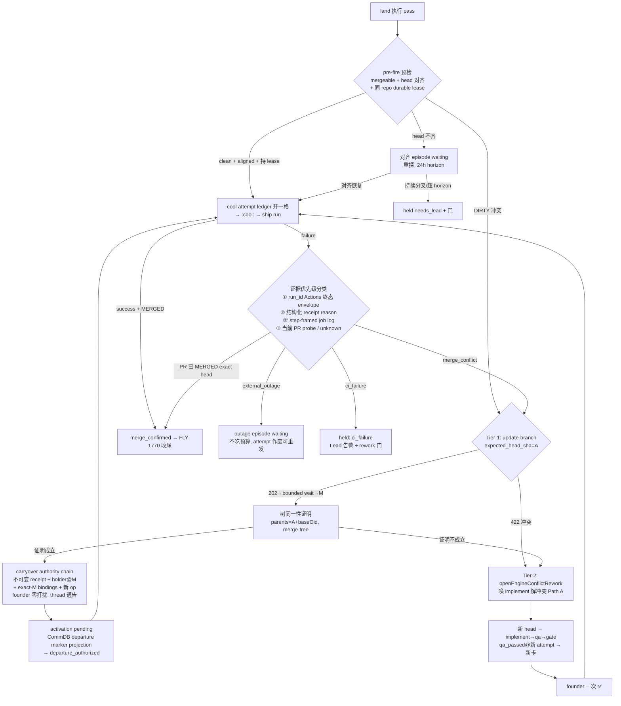

# FLY-1833 合库冲突常规自动流程 — 实施计划

Issue: FLY-1833 (https://linear.app/geoforge3d/issue/FLY-1833/shipp1-合库冲突必须变成常规自动流程-现在一撞冲突就卡死引擎要人工手术-founder-重批整轮)
日期: 2026-08-17
基于: 无(plan_only 档;机制审计直接折入本文 §2)
修订: R6(R1 九项 + R2 七项 + R3 五项 + R4 四项 + R5 三项全采纳。R5 增量:marker 落地子刀 —— `workflow_source_event.kind` CHECK 的 **rowid 保序** table-rebuild 迁移 + 窄口 `appendLandDepartureCutoff` writer(canonical payload digest,replay fail-closed)+ 闭合 union 扩展 + marker projection 全绑定校验 + `workflow_source_receipt.source_row_id` 迁移;§7.5⑥ oracle 统一为 marker-rowid 竞速矩阵(废除 `sent` 残留判据);cap 账本两处旧文案 + 流程图 activation gate 补齐)

---

## 0. 一句话

merge 撞冲突/竞速/外部故障时,land 不再判死:引擎先**自证干净合并**(base refresh + 树同一性证明 → 批准延续,founder 零打扰),自证不了才**驱动 implement 解冲突**(engine-authority rework → 走完 QA → 新 head 自动出新卡 → founder 一次 ✅),`pr_head_mismatch` 变成有界对齐复查,外部故障不吃重试预算,一切 held 都有 rework 门 —— **全程零 terminate、零 DB 手术、零重启,founder 的手指只花在内容决定上**。

## 1. 证据与根因(2026-08-16/17 四撞)

| # | 单 | 形状 | 根因位点 |
|---|---|---|---|
| 1/2 | FLY-1806 两次 | 同分钟另一单先合入 → `pulls.merge` 失败 → ship run failure → `ship_workflow_failed:failure` → land+run 双 held | `land-retry-policy.ts:63`(前缀判 terminal)+ `StateStore.ts:29947-29958`(rework 门不放行)|
| 3 | FLY-1809 | 批准与 head 对齐差 5 分钟 → `pr_head_mismatch` → terminal held;5 分钟后条件已消失仍永不复查 | `land-retry-policy.ts:28-33`(TERMINAL_REASONS)|
| 4 | FLY-1781(issue 评论) | GitHub 503:`cool_triggered` 回执把死掉的 ship run 当"已发车";重试预算被外部故障吃光;人工合入后引擎不认账 | `land-executor.ts:404-428/:441-495` |

**信息丢失是第一因**:ship run 失败只剩 `status=failure` 一个比特(`land-executor.ts:743-750`),merge conflict、CI 挂、外部 503 完全不可分;engine 路径零 mergeable 预检(`inspectPr` 只取 `state,headRefOid,mergeCommit`,`land-executor.ts:651-678`)。分类既不可得,只能一律 fail-closed 判死。

**与 FLY-1822 的边界**:1822 管 founder approve **之前**所有节点的返工门(死角清单在 Linear FLY-1822 正文+评论;repo 内无该清单文档,已核实);本单管**批准后 land 阶段**。两单共享 HL 原则(1822 评论 2026-08-16 17:37 终版):**系统自身原因进入的 held,其恢复不得消耗 founder 点击;founder 唯一不可约减的点击 = 对最终 head 的内容批准(新卡 ✅)**。实现一律走 Path A(wake/rework,保活)语义,禁止用 Path B(terminate+重派)冒充"重开"。

## 2. 机制审计结论(改动依据,file:line 为 flywheel-FLY-1833 worktree 现状)

1. **land 主循环**:`bridge/land-executor.ts:327-617`;merge 的真身 = 在 PR 贴 `:cool:`(`:680-699`)触发 `.github/workflows/ship-on-comment.yml`,由 `pulls.merge({merge_method:'squash', sha:HEAD_SHA})`(yml:164-172)完成。30s sweep:`plugin.ts:7714/7718-7746`(对 ≤20 op `Promise.all` 并发);显式 kick:`POST /api/lifecycle/land`。
2. **分类器**:`bridge/land-retry-policy.ts` — waiting(不吃预算,`nextAttemptAt=null` = 30s 随扫)/retryable(1m..2h 八档,FLY-1770)/terminal(→held)。`pr_head_mismatch`、`ship_workflow_failed:*` 均 terminal。FLY-1770 只治 merge **成功后**的收尾段。
3. **held 无出口**:run held 由 `holdWorkflowLandNode`(`StateStore.ts:45779-45890`);`listRunnableLandOperations` 永不收 held(`:45298-45312`);rework 门(`openOperatorRework`,`:29947-29958`)对 held 只放行 needs_lead / `land.last_error === "pr_head_mismatch"` 字面量 / loop_limit+ack 三类。
4. **批准 head 五层冻结**(全部保持不动):`workflow_gate_holder.head_sha`(PK 一部分,`:17513-17554`)、`workflow_ship_target_binding.frozen_head_sha`(`:17477-17493`)、`sessions.pr_head_sha`(`:7067-7143`)、`land_operation.approved_head`(UNIQUE 键一部分,`:17780-17810`;**head 变 = 另一个 operation**)、CommDB source payload `approved_head`。批准落账再验 exact head:`assertCurrentWorkflowGateAuthorityTx`(`:32173-32210`)。"answered gate is NEVER rebound":`bridge/ship-gate-rebind.ts:24-38`。
5. **ship-claim 解析是第六道闸**(R1-1 补):land 授权链尾部 `resolveEngineWorkflowShipClaims`(`land-executor.ts:198-204` → `StateStore.ts:38690-38763`)要求 founder claim 的 `subject_digest` 与当前 holder head 逐字相等,且每条冻结 evidence(`workflow_gate_holder_evidence`,不可变表 `:17684-17716`)的 git head 都等于 holder head;code manifest 的 `ship_claims=['qa_passed','founder_approved']`(`workflow-menu.ts:467-470`)。**任何"换 head 不换证据"的方案都会死在这里** —— 这决定了 carryover 必须是一等 authority chain(刀 5),也决定了 Tier-2 不能跳 QA(刀 6)。
6. **仓内零 content-equivalence 先例**;唯一 head 变更先例 = FLY-945 `merge-base --is-ancestor` 快进重绑,且显式拒绝已应答 gate(`auto-qa-coordinator.ts:1617-1719`)。
7. **新 holder → 自动出新卡的机器已跑通**(FLY-1772):supersede 统一 helper(`StateStore.ts:40366-40417`,五 writer+sentinel);materialization 队列(`:44919-44939` + `gate-materializer.ts:60-199`)对任何新 holder 天然发新卡、旧卡自动作废。
8. **rework 机器**:request/route/delivery/replacement/needs_lead 五态(`workflow-rework-coordinator.ts`);但 `workflow_rework_request.authority` CHECK 只允许 `qa|founder`(`StateStore.ts:18122-18135`),`openOperatorRework` 落 `authority='founder'`(`:30190-30206`),scope/policy 由 topology 计算(`:30138-30155`)—— engine 发起需专用事务(刀 6)。implement 返工唯一合法路由形态 = `['implement','qa']` + `['code_review','qa_retest','founder_gate']`(`:27031-27074`)。
9. **dispatcher 的 land op 选择**(R1-2 补):`workflow-engine-dispatcher.ts:2090-2137` 取该 run **created_at 最新**一行 op(`getLandOperationForRun`,`StateStore.ts:45008-45012`);其 approved_head 与当前 holder 不同 → `engine_land_operation_authority_mismatch` held;executor 返回 held → `:2138-2143` `holdWorkflowLandNode`。**"旧 op 静音、新 op 自然出现"在现状下不成立**,多代生命周期必须显式建(刀 4)。
10. **step 回执不可变且单发**(R1-3 补):`land_operation_step` PK `(operation_id, step)`(`:17865-17874`),同名 step 异 payload → `land_step_receipt_conflict`(`:45475-45542`)。**多轮 cool 尝试需要新的 append-only ledger**(刀 8)。
11. **不铸新 binding 的后果**:新 head 无 current-attempt `workflow_node_pr_binding` → `land_head_unavailable` 409 + durable 告警(`StateStore.ts:33991-34045`)。

## 3. 设计总览

**两条铁律**(全设计的安全底座):
- **Tier-1 只做机器可证明的干净合并**:新 head M 必须满足 ① M 的 parents 恰为 [A(已批 head 或上一段 refresh head), 发起时观测的 baseRefOid];② `tree(M) == git merge-tree --write-tree <baseOid> <A>` 输出(树同一性,杀"evil merge");③ merge-from-main,A 永远是 M 的祖先,零 force-push。任何一条不成立 → Tier-2。
- **Tier-2 一定重走 QA + 出新卡**:人手解过冲突 = 内容变了 = 新 head 必须拿到自己的 `qa_passed` claim(ship-claim 合同,§2.5)+ founder 对新 head 一次 ✅。自动化消灭的是其余全部人工(terminate/keyless 重派/领养/DB 手术),不是 QA 与那一次内容批准。

## 4. 改动清单(10 刀,依赖序)

### 刀 0 — 存量 held 行治理(沿 FLY-1770 刀 0 惯例)

不做自动迁移。实现 PR 附只读 census:`SELECT operation_id, run_id, issue_id, state, last_error FROM land_operation WHERE state='held'`,逐行标注裁定(`evidence_keep` / `manually_closed` / `needs_lead`),FLY-1806/1809 手术痕迹保留为证据。新机制只服务未来。

### 刀 1 — 感知面:结构化失败原因 + 证据优先级(R1-8)

1. `inspectPr` 增取 `mergeable,mergeStateStatus,baseRefOid`(不是 base 名);新增 `bridge/land-failure-classifier.ts`,输出闭合 union:`merge_conflict | head_moved | ci_failure | external_outage | cancelled | merged_externally | policy_blocked | unknown`。
2. **证据优先级(fail-closed precedence,高→低;R2-3 修正:① 只是可信 envelope,不是 root cause)**:
   ① **精确 run_id 的 Actions 终态 envelope**:cool receipt 已含 `run_id`;engine `gh api /repos/{slug}/actions/runs/{run_id}` + `/jobs` 取 conclusion 与**失败 step 定位**(Merge 步失败 vs 前置 build/test 失败 vs cancelled/timed_out)。**它证明"哪一步失败",不证明 Merge 步失败的原因**(Jobs API 不返回 action 抛的 HTTP status)。用量沿 FLY-1624 预算纪律,run 终态一次判定后 memo。
   ② **workflow 结构化 receipt**:`ship-on-comment.yml` 的 Merge 步 catch 错误,receipt 注释加 `reason=merge_conflict|head_moved|merge_error:<http_status_class>`(405/"not mergeable"→merge_conflict;409/"Head branch was modified"→head_moved;5xx→outage);**前置 CI 步失败由新增 always() 前置判定步显式产 `reason=ci_failure`**;`Report failure` 步透传。engine 校验 receipt 的 run/head 绑定;与 ① 的 step 定位冲突时 fail-closed。
   ②′ **job-log 有界解析,按失败 step framing**(R2-3 + R3-5 + R4-3;Merge 步失败但无结构化 reason 时 —— 旧 yml 窗口、`Report failure` 评论自身被 503 打掉的窗口):经 download-job-logs endpoint 拉日志(硬上界 256KB),**先用 Jobs API 的失败 `steps[].number` + 唯一 step name(现为 `✅ Merge PR`;schema 无 step `id`)锚定该 step 的日志 group boundary/时间窗,只在该边界内解析 `actions/github-script` 的稳定错误 envelope**(整段 tail 搜 token 会把前置 build/test 输出里的 `403/500` 文本误判;name 重复/number-name 不一致/边界缺失一律 unknown);提取归一 HTTP/status class,不落原文。step 边界找不全、token 多义、截断跨界 → **诚实 bounded `unknown`**(吃预算,有界后 held+门,不假装是 outage)。对抗 fixture:前置 Test step 打印 `HTTP 503`、Merge step 无可解析 reason → 判 unknown 非 outage。下载计入同一预算,终态 memo 后不重拉。
   ③ **当前 PR probe**:`mergeStateStatus` 作现场上下文(DIRTY→conflict;MERGED exact head→merged_externally)。**③ 是"现在"不是"当时"**:503 恢复后 probe 可能已 CLEAN,outage 判定只能来自 ②/②′。
3. `gh` 探测调用自身的错误归一(5xx/429/网络类)→ `external_outage`(探测动作撞外部故障)。
4. `mergeStateStatus` 闭合处理(R2-7 修正):`BEHIND`/`CLEAN`/`HAS_HOOKS`/`UNSTABLE`→可放行;`DIRTY`→conflict;`DRAFT`→`policy_blocked` terminal(held+门);**`BLOCKED`→`policy_alignment` waiting episode**(required checks/review/branch policy 可能自愈 —— 补取 `reviewDecision`/`statusCheckRollup` 定性:确认为不可自愈的保护/权限策略才转 `policy_blocked` held,否则 cadence 复查,horizon 24h 超限才 held+门);`UNKNOWN`→waiting `mergeability_pending`;未知枚举值 fail-closed 归 unknown。
5. 穷举 fixture 覆盖每个 GitHub enum/error;专项测试:「503 已恢复、probe 已 CLEAN,但 ②/②′ 证据仍判 outage」「无任何 reason 来源的 Merge 失败落 bounded unknown 而非 outage」「BLOCKED→CLEAN 自动继续;稳定 branch-policy block 超 horizon fail-loud」。

### 刀 2 — land-retry-policy 重裁 + waiting-with-cadence(R1-9)

1. 分类函数增加第四维输出:waiting 分支支持**带 cadence**(设置 `nextAttemptAt` 但**不**递增 `retry_count`)—— 现状 waiting 一律 `nextAttemptAt=null`(30s 随扫),`external_outage` 需要 5 分钟节流探测,必须有"不吃预算但有下次时刻"的形态。
2. 分类表变更(其余字面 reason 一律不动):

| reason | 现状 | 新裁定 |
|---|---|---|
| `pr_head_mismatch` | terminal→held | waiting(对齐 episode,刀 7) |
| `ship_workflow_failed:failure` | terminal→held | **废除盲盒 reason**:producer 改产刀 1 分类后的具体 reason |
| `merge_conflict`(新) | — | waiting(冲突例程接管,刀 5/6,不吃预算) |
| `ship_workflow_failed:ci_failure`(新) | — | terminal→held(真代码问题;Lead 告警 + 刀 9 门) |
| `external_outage`(新) | — | waiting + 5min cadence(不吃预算;episode >2h FYI 一次) |
| `policy_alignment_pending`(新) | — | waiting + cadence(BLOCKED 类可自愈条件;24h horizon → held) |
| `policy_blocked`(新) | — | terminal→held(DRAFT/确证不可自愈的保护策略;有门) |
| `ship_workflow_failed:cancelled` | terminal→held | retryable(超时/取消,八档退避;配合刀 8 重发) |
| `pr_closed_unmerged` / `cool_trigger_receipt_corrupt` / `land_step_receipt_conflict` | terminal | 不变(出口 = 刀 9 门) |

3. dispatcher 的 `land_partial` 台账正则(`workflow-engine-dispatcher.ts:2144-2151`)同步收录新 waiting 字面量;run 保持 **active**。

### 刀 3 — episode/lineage 持久化模型(R1-9;刀 5-8 的公共地基)

新表 `land_recovery_episode`(append-close 语义,不可变历史 + 单开活跃行;R2-6 修正 identity):
`(episode_id PK, run_id, root_approval_ref, kind CHECK IN ('alignment','outage','conflict','policy','refire'), scope_key TEXT NOT NULL DEFAULT '', current_operation_id, first_observed_at, last_probe_at, next_probe_at, state CHECK IN ('open','closed'), closed_reason, alert_uid)`(R3-4:`scope_key` **NOT NULL DEFAULT ''** —— SQLite UNIQUE 视多个 NULL 为不同值,可空则两条无 scope 的 open 行都插得进,horizon 重置+告警重复;测试显式插两条无 scope open 行断言第二条被拒)。
- **稳定 identity = `(run_id, root_approval_ref, kind[, scope_key])`**(不是 operation_id —— 否则换代新 op 天然重置 horizon/count,与"跨 op 不重置"目标矛盾);`current_operation_id` 只是当前观察上下文,op 换代(刀 4)在同一事务里 CAS 更新它、episode 行不换。唯一活跃行用 **partial unique index**:`CREATE UNIQUE INDEX ux_land_episode_open ON land_recovery_episode(run_id, root_approval_ref, kind, scope_key) WHERE state='open'`(SQLite 不接受 inline `UNIQUE(...) WHERE`)。
- **计数不落 episode 表(防双账,R2-6)**:carryover lineage depth 从不可变 carryover receipt 链推导(刀 5);engine rework cycle 从 `authority='engine'` 的不可变 request 行计数;refire 从刀 8 attempt ledger ordinal 推导。episode 只缓存 cadence/anchor/告警 uid。
- **alignment/policy episode**:24h horizon 锚 `first_observed_at`(不随 release 刷新);超限 → held needs_lead。**outage episode**:5min cadence 写 `next_probe_at`;>2h FYI 告警恰一次(`alert_uid` 幂等)。
- 全部更新 CAS fenced;测试:A→M→H 三代 op 共享同一 horizon(depth/cycle 仅从不可变 lineage 行推导);重启不重置;告警恰一次。

### 刀 4 — land op 多代生命周期(R1-2;Tier-1/2 与对齐例程的共同前置)

1. `land_operation` 增 `superseded_at TEXT` + `superseded_by_operation_id TEXT`(不动 state CHECK,避免表重建;**语义:`superseded_at IS NOT NULL` = 不可运行的前代**)。
2. **同事务换代协议**(单写者,`BEGIN IMMEDIATE`;R2-4 修正):generation-fence 旧 op → 经**专用 Tx helper**(不走旋转后的普通 owner seam)写 supersede receipt(step `superseded`,payload 含新 head)→ CAS 标旧行 `superseded_at/by` **且 `generation=generation+1`、`owner_id=NULL`、`lease_expires_at=NULL`**(显式撤销旧 owner —— 现状 `recordLandOperationStep`(`:45475-45563`)与 retry release(`:45634-45665`)只校验 state/owner/generation,不认识 superseded_at;不旋转 generation 则旧异步 continuation 仍可落 step/release 前代)→ `ensureLandOperation`(M 行)。**全部 land mutator 的 WHERE 增 `superseded_at IS NULL`**(writer matrix sentinel)。crash 任一边界的 replay:以「holder@M 已是当前 approved」为幂等判据重放补齐。
3. **dispatcher 选择规则改写**:按**当前 approved holder 的 head** 精确选 op(`getLandOperationForRun` 增 head 参数或新查询),忽略 `superseded_at IS NOT NULL` 行;仅当「当前 holder head 的 op 不存在且无换代协议在途」才走现有 `engine_land_operation_authority_mismatch` held。
4. **executor 的 supersede 结果不走 held→holdRun 分支**:release 增加 `superseded` 终局形态(dispatcher 视为本 pass no-op,下一 pass 拿新 op),`holdWorkflowLandNode` 不被触发。
5. `listRunnableLandOperations` / `claimLandOperation` / 刀 9 rework 门谓词全部排除 superseded 行(门只看**当前代** op)。
6. 测试:crash 在 settle A / create M / publish holder 三边界的 replay;重复执行;**旧 generation 分别尝试 `recordLandOperationStep`、retry release、merge_confirmed、completion 四类回写,全部被拒**(R2-4:不只测 claim)。

### 刀 5 — Tier-1:干净 base refresh + carryover 一等 authority chain(R1-1/7 + R2-1/5)

**触发**:分类 = merge_conflict / DIRTY 预检命中。

1. **update-branch 按 API 契约**(R1-7):`gh api -X PUT /repos/{slug}/pulls/{n}/update-branch -f expected_head_sha=<A>`。
   - `202 Accepted` = 异步:进入 bounded waiting(episode cadence 30s,上限 5min),轮询到 exact successor M(`headRefOid` 变化且 parents 含 A)或超时(超时→下轮重探重分类);
   - `422`:**先重探** —— head 已非 A(stale expected_head_sha)→ 刀 7 对齐例程;确为 merge conflict → Tier-2;
   - `403`(权限/策略)→ `policy_blocked` held + 告警(送 implement 无效,fail-loud);`429`/5xx → outage episode。
2. **树同一性证明**(Bridge 自有 clone,受控 config,无自定义 merge/filter driver —— FLY-245 教训):fetch 后验证 M 的 parents 恰为 [A, 发起时观测的 `baseRefOid`],且 `git merge-tree --write-tree <baseOid> <A>` 树 OID == `M^{tree}`。证明与发起者无关(人在 GitHub UI 点 "Update branch" 同样覆盖,经刀 7 对齐例程入口走同一验证)。
3. **carryover = 一等不可变 authority chain**(R1-1 + R2-1 核心修订 —— **专用侧表,不塞既有 binding/evidence 行**):
   - **不可变链表 `workflow_head_carryover_receipt`**:`(receipt_id PK, run_id, gate_node_id, attempt, predecessor_receipt_id NULL 引用同表, from_head, to_head, base_oid, second_parent_observed, proof_tree_oid, proof_kind CHECK='clean_base_merge_tree_identity', root_founder_claim_ref, root_source_receipt_ref, created_at)` + 禁 UPDATE/DELETE trigger(沿 `founder_review_card_binding` 惯例)+ **唯一链约束** `UNIQUE(run_id, gate_node_id, root_founder_claim_ref, to_head)`;**depth 不存字段,由 predecessor 链递归推导**(分叉/重复 segment 被唯一约束与链推导双重排除,重放路径唯一)。
   - **专用不可变 `workflow_carryover_pr_binding`**:`(run_id, node_id, attempt, to_head) PK, carryover_receipt_id, root_binding_receipt_ref` —— 引用 root 的既有 `workflow_node_pr_binding` 行。**不动 `workflow_node_pr_binding`**(其 PK `(run_id,node_id,attempt)` 一 attempt 一行、writer 要求 current activation(`:33507-33525`),carryover 时 run 在 land、原 producer 早非 current writer,同 attempt 二次铸造结构上不可行 —— R2-1 实证;R1 版"铸 pr_binding@M"作废)。
   - **专用不可变 `workflow_gate_holder_carryover_evidence`**:`(holder question/run/gate/attempt 引用, carryover_receipt_id, root_evidence_digest)` —— 既有 `workflow_gate_holder_evidence` 要求 `claim_id UNIQUE`(`:17684-17701`),原 claim 行不可复插,故 carryover holder 的 evidence 是"引用根 evidence + 证明链"的新形态,不复制 claim。
   - **统一 exact-head resolver = StateStore 内唯一 authority seam**(R3-1 定案:不留"bridge 文件或 StateStore 二选一"歧义):一个入口显式解析 `normal | carryover`,**carryover-capable land 路径的全部 exact-head 消费者逐一接入,实现期先产 producer/consumer matrix 再动刀**,已审计的必经点(不完整即挂):
     ① `resolveEngineWorkflowShipClaims` carryover 分支(验证链:receipt 不可变存在、root claim 对链起点成立且未撤销、predecessor 链首尾相接且 depth≤3、to_head==holder head);
     ② land authorize 的 pr_binding 检查(exact-M 经 `workflow_carryover_pr_binding`→root binding);
     ③ `evaluateWorkflowFounderReviewPrecondition` carryover 分支(它在 claims 之前跑且会在 M 上重算 founder-review HTML blob digest,干净 base merge 改动同一被审 HTML 文件即报 stale —— carryover 分支验链后以 **root-A artifact authority** 裁定);
     ④ **dispatcher 建 op 前置**(`workflow-engine-dispatcher.ts:2094-2112` 现用 `getCurrentWorkflowNodePrBindingForHead(holder.head_sha)`,M 无 normal binding 会先报 `engine_land_authority_unavailable`,新 op 到不了 executor);
     ⑤ **`bindWorkflowShipTargetForGateTx`**(`StateStore.ts:32294-32313` 只认 normal binding;carryover 的 exact-M ship_target_binding 铸造走专用写点,不复用该 seam);
     ⑥ **merge closeout 归账**(`StateStore.ts:45511-45527` 把 `approved_head=M` 传 `markWorkflowDeclaredPrMergedTx`,而 `workflow_declared_pr.frozen_head_sha` 冻结在 A(`:33224-33235`)→ 稳定报 `workflow_pr_manifest_declared_pr_not_found`,FLY-1770 收尾根本开不了 —— **裁定:declared_pr 继续冻结 A,merge attribution 经已验证的 M→root-A 链标记 A 行 merged,effective merged head M 落事件/receipt**);
     ⑦ 显式 lifecycle kick(`plugin.ts:6239-6254`)与 external-merge/founder-review reconcile(`external-merge-reconcile.ts:634-654`)同批接入。
     **正常分支全部谓词零改动**;新增 sentinel:carryover-capable land 路径禁止新增 raw `getCurrentWorkflowNodePrBindingForHead` 直调(源码扫描)。
   - `approval_origin` 新列:幂等 ADD COLUMN 迁移,闭合 CHECK(`NULL | 'engine_equivalence_carryover'`,NULL=既有 founder 语义),**唯一 writer sentinel**(源码扫描:该字面量只在 carryover 事务一处写)。
   - **同事务 CAS 前置**(缺一即拒,零写入):run active 且在 terminal land;holder@A 是当前 approved;原 founder claim/evidence 未撤销;无未完成 rework(request/delivery 活跃即拒);旧 op generation 匹配;提交前事务外重探 PR head/base/proof、事务内复核 store 侧前置 —— update-branch 已发生但 CAS 输掉时只落台账事件,下一 pass 重新分类,绝不半写。
   - 事务内容:supersede holder@A(reason `head_refresh_equivalent`;旧卡 void 文案新分支「head 已由系统干净合并更新,批准延续,无需操作」)→ 建 holder@M(`state='approved'`, `approval_origin='engine_equivalence_carryover'`, `materialization_stage='completed'` 不发卡)→ 写 carryover receipt + carryover_pr_binding + carryover evidence + exact-M `workflow_ship_target_binding` → 刀 4 换代协议建 M op。
4. **晚到 founder ingress 与外部 effect 的线性化**(R2-5 + R3-2 + R4-1 终版:cutoff 必须先于评论副作用,且与 founder 事件同一可排序域):founder source event 先落 CommDB、独立 projector 异步投影(`founder-approval-projector.ts:139-197`);`:cool:` 评论被 GitHub **接受即产生 workflow event**(`issue_comment.created`),之后 30 分钟 CI 冻结 HEAD_SHA 直接 merge,本地 supersede 撤不回 —— 而 attempt 的 `sent` 只能在拿到 comment_id **之后**落库,"comment 已发、sent 未落"的 crash 窗口使 `sent` 不可作 consent cutoff(R4-1 反例)。**departure-cutoff marker 协议(方案 A,单一排序域 = CommDB append-only rowid 序列)**:
   - **cutoff = CommDB 内的 durable `land_departure_cutoff` marker row**(与 founder source events 同表同序,携带 carryover receipt_id / operation / ordinal);写 marker 先于一切评论动作。
   - **CommDB/StateStore 落地子刀**(R5-1:现有 schema 会直接拒绝该 kind,且 rowid 是 consent 顺序根基,迁移不得依赖隐式行号):
     ① `workflow_source_event.kind` CHECK(`flywheel-comm/src/db.ts:182-190` 现只允许 `founder_approval|founder_feedback|turn_grant`)经幂等 table-rebuild migration 扩大,**显式 `INSERT ...(rowid,...) SELECT rowid,... ORDER BY rowid` 保序**,重建 no-UPDATE/no-DELETE triggers;迁移前后断言全部旧 rowid 与已持久化 StateStore cursor 的相对位置不变(FLY-1375 的重建先例(`db.ts:1074-1110`)没显式复制 rowid,不可照抄);
     ② 新增**窄口 `appendLandDepartureCutoff` writer**(不开放 generic kind/payload):`source_event_id` 稳定绑定 `(carryover_receipt_id, operation_id, ordinal)`,payload canonical 化 + digest;exact replay 返回原 rowid,同 id 异 tuple/digest fail-closed;
     ③ CommDB/projector/StateStore 的闭合 union(`WorkflowSourceEvent` `:423-430`、projector kind 分支、`WorkflowSourceEventInput`/`WorkflowSourceApplyResult`)全部扩展;marker projection 在 CAS 前验证 project/run、完整 carryover 链、current operation/head/generation、payload 的 operation/ordinal 与预期 departure 一致、activation 仍 pending;projection 已成功但 cursor 未推进的重放幂等;
     ④ `workflow_source_receipt`(`StateStore.ts:18674-18682`)增 `source_row_id` 幂等迁移(legacy 行 NULL 语义显式声明),rowid 有耐久落点而非只在 TS input 里传;
     ⑤ 真实迁移测试:seed 旧 CommDB 多种 source rows + 非零 cursor → migrate → rowid 原样、无 skip/reorder → marker 插入/投影;marker append、projection、cursor advance 三个 crash 边界 + tuple mismatch 拒绝。
   - **activation 闭合 schema**(R4-2:不向既有 holder/land state CHECK 偷塞字面量):新表 `workflow_carryover_activation`:`(carryover_receipt_id PK, state CHECK IN ('pending','departure_authorized','superseded'), source_cutoff_row_id, generation, first_observed_at, next_probe_at, alert_uid)`。carryover commit → `pending`;**projector 按 rowid 顺序应用 marker 之前的全部 founder events 后,由 marker 的 projection 以 CAS 推进 `departure_authorized`**(期间任何祖先 feedback 先被应用 → 直接 supersede activation,永不授权)。marker 之后的 feedback row = 真正 cutoff 后。
   - **全部发车入口同 seam 验闸**:dispatcher、显式 kick、`listRunnableLandOperations`/claim、executor 发评论前的 pre-effect recheck,对 carryover-origin op 一律要求 activation=`departure_authorized`;之后才允许 `prepared`→评论→`sent`(`sent` 只表示 comment_id 已回写,不承担线性化)。
   - **`WorkflowSourceEventInput` 增带 `row_id`** 并持久化进 source receipt / late-feedback 台账,先后关系可重放审计。
   - **barrier 有界出口**(R4-2:projector 遇前序 retryable row 会停在 cursor(`founder-approval-projector.ts:288-303`),无 horizon 则 barrier 可被无关事件永久卡住):activation `pending` 带 cadence + first_observed horizon(1h)+ 一次性 severe 告警 + held/rework 门出口。
   - **专用 `applyLateCarryoverFounderFeedbackTx`**(既有 feedback 事务要求 run 在 gate 且 holder `awaiting_review`(`StateStore.ts:37549-37589`),carryover 场景不能复用):以 source uid 幂等;验证 feedback 引用 holder 属当前 lineage 祖先;原子 supersede 后代 holder/claims/op/activation 并铸 Path A rework。不落 deadletter、不 poison。
   - **cutoff 后诚实化**:marker 之后的 feedback 不承诺阻止 M 合入:fail-loud 落账 + Lead severe 告警「founder 打回晚于发车授权,PR 可能已按原批准内容合入,请人工裁定(revert/跟进单)」。不做 ship workflow 的 pre-merge authorization handshake。
   - 测试:两库竞速(feedback 先 durable→暂停 projector→carryover commit→marker 写入→恢复:marker 前 feedback 必赢、activation 永不授权);**R4-1 反例钉死:activation 已授权→prepared→评论已接受→crash 未落 sent→feedback 到达 → feedback 落 cutoff-后告警路径,不产生「本地赢+远端合入」双真**;cursor 被前序 retryable row 卡住→horizon 告警;cutoff capture 前后 Bridge 重启;direct kick 绕闸 fail-closed。
5. **lineage cap ≤3 段**/原始批准(从链推导);超出 → Tier-2 新卡。
6. **thread 通告**:「检测到与 main 的冲突已由系统干净合并解决(A8→M8),批准延续,正在重新合入」。

### 刀 6 — Tier-2:openEngineConflictRework(R1-4/5)

**触发**:update-branch 判真冲突 / 树证明不成立 / 刀 5 cap 超限。

1. **专用 StateStore 事务 `openEngineConflictRework`**(不绕用 HTTP/operator consent seam):
   - schema:`workflow_rework_request.authority` CHECK 重建为 `qa|founder|engine`(SQLite 表重建迁移,沿既有幂等迁移形态);TS union 与全部 readers/coordinator/alert 的 exhaustive handling 同步(编译期 `never` 检查钉死);
   - 入场 fence:run active 且在 terminal land;当前 holder/op generation 匹配;存在 durable 分类/证明失败 receipt(刀 1 产物,作为触发证据引用);无未完成 rework;source event id 稳定幂等(uid = `engine_conflict_rework:${runId}:${cycle}`);
   - 原子完成:supersede holder(reason `engine_conflict_rework`)+ claim revocation + request/route/delivery admission,authority **如实记 `engine`**;
   - **路由 = 既有唯一合法 implement 形态** `scope ['implement','qa']` / policy `['code_review','qa_retest','founder_gate']`(R1-5:**撤回跳 QA** —— ship_claims 合同要求新 head 有自己的 `qa_passed`@current attempt,跳 QA 则批准后仍 land 不了;把 ship CI 当未建模的 QA 等价物 = 扩大安全边界,本单不做。若产品层想给"解冲突小 delta"开 QA 快道,另立单走 founder 决策)。
2. **冲突简报**(request feedback,机器生成):merge-tree conflicted paths 清单、base OID、指令三条 —— ① `git merge origin/main` 解冲突(**禁 rebase/force-push**);② 只解冲突不加新逻辑;③ 完工走标准 complete。Path A wake 原 implement 体;体死走 replacement materialization(FLY-1765/1772 机器)。
3. **闭环**:runner 完成 → 服务端 rev-parse 权威 head → binding@新 attempt → **qa_retest 产新 head 的 `qa_passed`**(decision 路径铸 gate-entry binding,FLY-1772 §13.6′ 既有 seam)→ gate 重入 → 新卡(**冲突换代文案**:「本卡为解冲突换代:内容差异仅为冲突解决(A8→H8,N 个文件)+ compare 链接」)→ founder ✅ → 刀 4 换代建新 op → `:cool:`。
4. **cycle cap ≤3 轮**/run land 阶段(从 `workflow_rework_request(authority='engine')` 不可变行计数,episode 只管 horizon/告警);超出 → held needs_lead + severe。runner 报语义冲突 → 既有 needs_lead 形态(held + 门 + 告警)。

### 刀 7 — pr_head_mismatch 对齐例程(FLY-1809 根治)

head 检查(`land-executor.ts:396-398/:483-485`)命中 mismatch 时开/续 alignment episode:

| 探测结果 | 处置 |
|---|---|
| PR head == approved(下一轮已对齐) | 关 episode,继续(FLY-1809 的 5 分钟竞速自愈) |
| PR head M 过刀 5 树证明(有人/系统做过干净 base merge) | 走 carryover(同一验证与 CAS,发起者无关) |
| PR head 分叉且非干净合并(批准后有内容推送) | supersede holder@A → 新 head 可铸 binding(能定位其产出 receipt)则出新卡等重批;来路不明 → held needs_lead + 告警 |
| episode 超 24h horizon | held needs_lead + 告警(有门) |

waiting 期间 run active、不吃预算。

### 刀 8 — cool attempt ledger + effect 协议(R1-3;issue 评论 ①③)

1. **新 append-only 表 `land_cool_attempt`**:`(operation_id, ordinal) PK`,列:`state CHECK IN ('prepared','sent','terminal','voided')`、`comment_id`、`ship_run_id`、`head_sha`、`classification`、`generation`、时间戳。替代单发 `cool_triggered`/不可表达的 `cool_voided`(`land_operation_step` PK `(operation_id, step)` 不支持多轮,§2.10);既有 `cool_triggered` step 保留为兼容读(存量 op),新写全走 ledger。
2. **effect 协议(prepared→sent→reconciled;R2-2 修正:无法收编 ≠ 静默作废)**:发评论前先落 `prepared`(占 ordinal);评论 body 仍必须是裸 `:cool:`(workflow 精确匹配),恢复锚 = 评论时间窗 + receipt 注释回读:crash 在"评论已发、sent 未落"时,重启后扫 PR 上 `flywheel-ship-receipt ... status=started` 的 `trigger_comment_id` 与 PR comments 里 engine 时间窗内的 `:cool:` 评论,比对收编。**注意 started receipt 只在 job 真正开跑时才出现(yml:36-56),评论已发但 workflow 仍 queued 的窗口既无 receipt 也无法证伪** —— 因此无法收编的 `prepared` 行**不是静默作废**,而是进入 **`ambiguous_cool_effect` 隔离**:op held + 刀 9 门 + severe 告警,**且该 repo 的外部在飞 fence(刀 9)保持占用**。释放走**有类型、append-only 的 adjudication release receipt**(R3-3:人工动作本身不是 fail-closed 证据),合法 basis 闭合三种:① 完整分页 + 绑定时间窗证明该窗口 `:cool:` 评论不存在;② 可信 exact run 终态(receipt/Actions conclusion);③ 旧 effect 已远端失效并复探确认 —— PR 已关闭,或 PR head 已确定离开 attempt.head(此时旧 workflow 的 `pulls.merge(sha=old)` 必 409 死路)。无证据的 generic override 禁止;释放走 CAS。测试:Lead adjudication 与迟到 started/merge 竞速,证不出远端失效则 fence 继续隔离。绝不在歧义窗口里放行第二发。
3. **在飞判定与状态推进**:存在 `state='sent'`(或 `prepared` 未裁定)且无终态的 attempt = 在飞;attempt 状态更新一律 `(state, generation)` 单调 CAS,**晚到的 started/terminal receipt 只允许命中 exact ordinal**(按 trigger_comment_id/run_id 绑定,不许模糊匹配到别的 attempt);ship run 终态 → 该 attempt `terminal` + 按分类决定是否允许下一 ordinal;`voided` 用于分类判定"那趟车作废"。
4. **refire cap ≤3**(由 ledger ordinal 推导,episode 表引用不另存);**FLY-1770 epoch 隔离**:epoch key 计算(`StateStore.ts:45651` `${step 数}:${current_step}`)**排除** attempt ledger 行(它不是 step 表,天然隔离;新增断言测试:void→refire 循环不推进 epoch、不洗退避预算)。
5. **merged 独立确认**(评论 ③):每轮 pass 的 `inspectPr` 对 `MERGED` + exact-head(approved 或 carryover 后 head)即落 `merge_confirmed`,与自家 attempt 成败无关(人工补 `:cool:` 合入 → 引擎下轮自动认账收尾)。

### 刀 9 — held@land 全面 rework 门(兜底)+ 串行化 lease(R1-6)

1. **rework 门**:`openOperatorRework` 的 held 准入对 land 形态从字面量单点改为:**run held 于 terminal land 节点 + 当前代 land op held(排除 superseded 前代,刀 4.5),即放行**。安全性:门 ≠ 自动执行;rework 是 Lead-authorized 动作,supersede holder + quiescence evidence 校验(`:29950-29968`)一根手指不动。1822 方向 ② 在 land 半边的落地。
2. **同 repo 串行化 = 两层所有权**(R1-6 + R2-2 修正:worker lease 可过期,外部在飞 fence 不可按时钟转让):
   - **worker lease 层**:新表 `land_repo_admission`:`(project_name, repo_identity) PK, owner_operation_id, generation, lease_expires_at`。`claimLandOperation` 事务内 CAS 竞争;未获 → release waiting `land_queue_busy`(不吃预算)。lease 由既有 30s sweep 续约/回收,过期接管走 CAS —— **但接管只授予"继续处理同一外部在飞"的权利,不授予新发车权**。
   - **外部在飞 fence 层**:durable 绑定 exact `(operation_id, ordinal, comment_id/run_id/head)`(即刀 8 attempt ledger 的未终态行)。**admission CAS 必须同时查询该 repo 全部 unresolved `prepared|sent` attempts:存在即不得发新 `:cool:`,无论 lease 是否过期/换主**(R2-2 的对抗场景:评论已发→Bridge 死→lease 过期→第二 op 拿到 lease→第一趟 workflow 迟到启动 —— fence 保证第二 op 永远发不了车)。fence 只在 `merge_confirmed`、可信 terminal receipt/Actions conclusion、或 `ambiguous_cool_effect` 的人工 fail-closed 裁定后释放;**永不因时钟到期释放**。
   - 测试:双 store worker + barrier 仅一方 admission;**评论已发→进程死→lease 过期→第二 op 请求 admission→第一 run 延迟 started:第二 op 始终不能发车**;owner 崩溃后同 attempt 接管可续处理;显式 `POST /api/lifecycle/land` kick 与 sweep 同闸不双发。

### 刀 10 — 告警与 founder 面一致性

- **Lead 告警**(engine alert outbox,payload 恒定 + uid 幂等,沿 FLY-1772 纪律):Tier-2 启动(warning,含冲突文件数)、cycle/refire/lineage cap 超限(severe)、ci_failure/policy_blocked held(severe)、outage episode >2h(FYI 恰一次)。
- **issue thread 通告**(founder 可见零点击):Tier-1 批准延续(刀 5.5)、Tier-2 启动「检测到需人工解决的冲突,已唤 implement 处理,QA 重验后会出一张新的批准卡」、新卡即旧卡作废(FLY-1772 既有)。
- 文案逐字与机制一致(1822 验收追加 #3);本设计没有 terminate 路径,不出现「重开」类词。

## 5. 批准语义安全论证(founder-consent 对齐,单列备审)

1. **不动的东西**(逐字):`assertCurrentWorkflowGateAuthorityTx`(`StateStore.ts:32173-32210`)、`verify-approval.ts` 全部拒绝类与 `:616-632` 逐字比较、`ship-gate-rebind.ts` "answered gate never rebound"、`land_operation` UNIQUE(...,approved_head)、founder-only merge 授权、reaction/文字批准入站链、**`resolveEngineWorkflowShipClaims` 的 founder 正常分支**。legacy runner_ship 路径整体 out of scope。
2. **carryover 为什么不是放宽**:它是**加法** —— 新 holder + 新 `approval_origin` 字面量 + 不可变 receipt 表 + claims 解析的**新增显式分支**(验证完整证明链,而非要求不存在的 founder@M claim);正常分支谓词零改动。绝不伪造 founder@M claim、绝不把 ship CI 当 QA claim。撤掉刀 5 整刀,系统回到今天的 fail-closed。
3. **她批的内容为什么被保真**:批准语义是「批 PR 的内容」而非「批 base 的位置」—— 正常时序里她批完、别的 PR 先合入,她批的 diff 也落在移动后的 main 上。Tier-1 的干净自动合并恰好只改 base 位置不改 PR 内容;树同一性杀内容夹带;`:cool:` ship run 全量 CI 再验合并后语义;QA claim 链在 Tier-1 不变(evidence 经 carryover receipt 锚回 A 起点的原始 evidence,QA 验的内容 = 她批的内容 = M 保真携带的内容)。Tier-2(内容变了)一律重走 QA + 回到她手上。
4. **git 操作面安全**:证明计算在 Bridge 自有 clone(受控 config,无自定义 merge/filter driver;FLY-245 教训);runner 解冲突走自己 worktree + 既有 pre-push guard(merge-from-main 天然快进)。
5. **审计闭环**:carryover receipt(root claim ref ↔ A ↔ M ↔ baseOid ↔ 证明树 OID ↔ lineage depth)+ supersede reason + thread 通告 + op 换代 receipt + attempt ledger,事后可完整重放"这次 merge 的授权链条"。

## 6. 有界性汇总

| 环 | 界 | 账本 | 超界处置 |
|---|---|---|---|
| Tier-1 carryover 链 | ≤3 段/原始批准 | `workflow_head_carryover_receipt` predecessor 链推导 | → Tier-2 新卡 |
| Tier-2 engine rework | ≤3 轮/run land 阶段 | `workflow_rework_request(authority='engine')` 行计数 | → held needs_lead + severe |
| `:cool:` refire | ≤3 次/op 代 | attempt ledger ordinal | → held + 门 + 告警 |
| update-branch 202 等待 | ≤5min/次 | episode cadence | → 下轮重探重分类 |
| 对齐复查 | 24h(锚 first_observed_at) | episode | → held needs_lead + 告警 |
| 外部故障 | 不吃预算;5min cadence;>2h FYI 一次 | episode | 恢复即自动续 |
| retryable(既有) | FLY-1770 八档 ×9 | 既有列 | → held + **刀 9 门**(原先无门) |
| 全部 held | — | — | rework 门全放行(Lead 动作),零 DB 手术 |

无新 timer(全骑 30s land sweep + GatePoller);无新 env flag(FLY-1466);episode/ledger/lease 全 durable,重启零丢账。

## 7. TDD 测试计划(RED → GREEN)

1. **分类器**:证据优先级矩阵(① envelope 定位、②/②′ 定因、③ 现场上下文,冲突 fail-closed);job-log 有界解析(256KB 上界、只存归一 class、解析失败→unknown);「503 已恢复、probe CLEAN,②′ 仍判 outage」「无 reason 来源的 Merge 失败 → bounded unknown 非 outage」;`mergeStateStatus` 全枚举 + 未知值 fail-closed;「BLOCKED→CLEAN 自动继续;稳定 policy block 超 horizon fail-loud」。
2. **retry-policy**:waiting-with-cadence 不递增 retry_count 但设 nextAttemptAt;新 reason 表逐条;既有字面量零回归(`land-retry-policy.test.ts` 全绿)。
3. **episode**:identity 锚 `(run_id, root_approval_ref, kind)`;A→M→H 三代 op 共享同一 horizon,depth/cycle 从不可变 lineage 行推导且不随 op 换代重置(episode 不存 count,防双账);horizon 锚 first_observed_at 不随 release 刷新;重启不重置;告警 uid 恰一次;partial unique index 生效(双无-scope open 行第二条被拒)。
4. **多代 op**:换代协议 crash 三边界 replay;dispatcher 按当前 holder head 选 op、忽略 superseded;executor superseded 终局不触发 holdRun;**旧 generation 尝试 recordStep / retry release / merge_confirmed / completion 四类回写全被拒**。
5. **Tier-1**(真 git fixture):① 干净 merge 全链(202→M→proof→carryover receipt+carryover_pr_binding+carryover evidence+ship_target_binding+holder@M+新 op);② evil merge(parents 对、树夹私货)→ 零 carryover 写入;③ 撤刀 5 后 ① 翻红;④ lineage 第 4 段 → Tier-2;⑤ CAS 竞态矩阵:与 operator rework、head 再移动分别竞速,carryover 侧必输且零半写;**⑥ 跨库 founder ingress 协议(oracle 一律以 marker rowid 为准,`prepared`/`sent` 前后变化不得改变胜负 —— R5-2):(a) feedback 先 durable→暂停 projector→carryover commit→marker 写入→恢复 projector:feedback rowid < marker → 必赢(supersede activation+后代,走 Path A),activation 永不授权,不 deadletter;(b) marker projection 之后的 feedback → cutoff-后 fail-loud 告警,不假装赢;(c) activation 已授权→prepared→评论已接受→crash 未落 sent→feedback 到达 → 仍走 cutoff-后路径(正文反例钉死);(d) marker projection 成功、cursor advance 前崩溃 → 重放幂等**;⑦ claims 解析:carryover 分支验链(断链/分叉/depth 超/receipt 缺一即拒),founder 正常分支谓词 sentinel 断言未动;⑧ **founder-review 前置**:base 干净合并改动同一被审 HTML 文件 → 正常分支报 stale(RED)、carryover 分支以 root-A artifact authority 放行(GREEN);⑨ update-branch 契约:stale expected_head_sha 422→对齐例程、403→policy_blocked、202 超时→重探;⑩ `approval_origin` 唯一 writer sentinel + 迁移幂等;**⑪ 整链测试:holder@M 起,经 dispatcher 建 op→cool→merge_confirmed→declared_pr 归账(A 行 merged,effective head M 落 receipt)→manifest finalization→run closeout 全通,raw 直调 sentinel 翻红对照**。
6. **Tier-2**(真实 compiled `tpl_code`,沿 FLY-1772 D1-β 基座):冲突→openEngineConflictRework(authority='engine' 落账;CHECK 迁移;uid 幂等)→wake/replacement 两路→简报含冲突文件→complete→qa_retest 产新 head `qa_passed`→gate 重入→冲突换代卡→✅→新 op→cool;3 轮 cap;语义冲突→needs_lead。
7. **对齐例程**:重放 FLY-1809(RED = 现状 held 永不复查;GREEN = 下轮自愈);人工 UI update-branch → carryover;分叉→新卡;来路不明→needs_lead;24h horizon。
8. **attempt ledger**:prepared→sent→terminal `(state,generation)` 单调 CAS;crash 在评论已发/sent 未落 → receipt/评论回读收编;**无法收编 → `ambiguous_cool_effect` 隔离(held+门+severe)且 repo fence 保持占用;释放只认 typed adjudication receipt 三种 basis(评论证不存在/exact run 终态/远端失效复探),generic override 被拒;adjudication 与迟到 started/merge 竞速测试**;晚到 receipt 只命中 exact ordinal;refire cap;**epoch 隔离对抗测试**(void→refire 循环不洗 FLY-1770 预算);人工合入→merged 独立确认(重放评论 ③)。
9. **outage**:503/429 序列 retry_count 不动(重放评论 ②);5min cadence;>2h FYI 恰一次;恢复自动续;episode 双无-scope open 行第二条被拒(NOT NULL DEFAULT '' 唯一性)。
10. **串行化两层**:双 store worker + barrier 仅一方 admission(重放 FLY-1806 端到端:RED = 双发双 held;GREEN = 一方排队,第一单合入后第二单预检进冲突例程直到新卡/延续);**对抗场景:评论已发→进程死→lease 过期→第二 op 拿 lease→第一 run 迟到 started,第二 op 始终发不了车**(外部在飞 fence);owner crash 后同 attempt 接管;sweep 与显式 kick 同闸。
11. **rework 门**:held@land 任意 last_error 可 operator rework(RED:`ci_failure` 现状 `run_not_reworkable`);仅当前代 op;quiescence 零松动;非 land held 逐字不变。
12. **安全哨兵**:`assertCurrentWorkflowGateAuthorityTx` / verify-approval / claims founder 分支源码 sentinel;carryover CAS 前置缺一即拒。
13. 全仓门:`pnpm lint` + `pnpm -r build` + `pnpm test:packages:run` + 相关 shell harness(host 全量按惯例不作验收门,定向 + CI 为准)。

## 8. 验收映射

| 要求 | 由谁满足 |
|---|---|
| issue 目标 1:冲突自动识别+自动 rebase | 刀 1(识别)+ 刀 5(机器合并)+ 刀 6(runner 解冲突,merge-from-main 形态) |
| issue 目标 2:不判死、rebase 完自动重试 land | 刀 2(waiting 化)+ 刀 4(多代 op)+ 刀 8/9(自动重发/串行)+ run 全程 active |
| issue 目标 3:批准跨"纯 rebase"不打扰 founder;重批降级为轻量确认 | 刀 5(树证明 carryover,零打扰)+ 刀 6.3(冲突换代卡,一次 ✅) |
| issue 目标 4:永不需要重启/手术 | 全路径 engine/sweep/API 驱动;刀 9 兜底门;episode/ledger durable 重启零丢账 |
| issue 边界:不放宽 founder-only merge / 不自动解语义冲突 | §5.1 不动清单 + 刀 6.4(语义冲突→needs_lead 有门)+ **Tier-2 不跳 QA** |
| issue 评论 ①②③(503 实证) | 刀 8.1-3 / 刀 2+3(outage 不吃预算)/ 刀 8.5 |
| 1822 HL 原则(系统 held 不耗 founder 点击;Path A 不冒充) | 刀 6(wake/replacement,零 terminate)+ 刀 9 + 刀 10 文案一致性 |
| 1822 评论(terminal-held 条件消失要免手术重驱) | 刀 7 对齐例程 |

## 9. 风险与边界

- **update-branch 权限**:依赖 gh token 对分支可推(与 `gh pr comment` 同源凭据);403/保护分支/fork PR → policy_blocked fail-closed,有门。
- **carryover 是本计划最重的一刀**(不可变链表 + 两张专用侧表 + 统一 exact-head resolver + claims/founder-review 双前置的 carryover 分支):若实现期发现 exact-head 消费方比审计更多、resolver 接不全,回退底线 = 砍掉刀 5、Tier-1 也走刀 6 新卡(founder 多一次轻量 ✅,其余自动化全保留)。回退不影响其他九刀。
- **authority CHECK 迁移**(刀 6)是 SQLite 表重建:沿既有幂等迁移形态,迁移测试覆盖存量 rework 行保真。
- **ship-on-comment.yml 改动**生效在 merge 后;刀 1 证据优先级保证新引擎 + 旧 yml 组合行为正确(① run 终态 envelope + ②′ step-framed job log 定因 + ③ probe 现场;解析不出 → 诚实 bounded unknown)。
- **不做**:legacy runner_ship 路径冲突自动化(FLY-1655 已裁为兼容边界);merge queue;跨 repo(nested)land;自动语义冲突解决;QA 快道(另立单);任何新 env flag;任何 Bridge 重启依赖。
- **QA 建议**:529 房真机重放三条链 —— ① 双 PR 同批冲突(FLY-1806 形状)到新卡/延续;② outage 注入预算不损;③ Tier-1 干净合并 carryover 全链(真 git + 真卡)。ship 前交独立 QA。

## 10. 实施校准与已知限制

- **Tier 语义按实装收口**:Tier-1 是 Bridge-owned disposable bare clone 内的 parent identity + clean `merge-tree` tree identity 证明，成立时把 exact-head authority 延续到新 head；Tier-2 **不是第二种内容等价证明**，而是 `openEngineLandConflictRework` 驱动 implement 解冲突、重走 code review/QA、生成新 ship 卡并由 founder 重新批准。custom merge/filter driver、缺对象、树不等价都不会续批。
- **等待有界**:`external_outage` 仅覆盖 GitHub/证明探针，5min cadence、2h FYI、24h held；finalize/cleanup 等后置错误继续走既有八档有限重试。无法确认归属的 prepared `:cool:` 使用 15min ambiguity horizon；`land_queue_busy` 使用 45min horizon，覆盖 ship workflow 的 30min timeout 与状态传播余量，避免把健康 `sent` attempt 后的正常排队误判为 held。两者超界均告警并 held，保留 operator rework 出口；未带 exact-head ship receipt 的人工 `:cool:` 不会被引擎收编。outage episode 记账若与 operation supersede 竞态，必须退化为普通 `external_outage` release，绝不遗留 lease/repo admission。
- **本 PR 接受的已知限制**:legacy GitHub `StatusContext.state` 仍未纳入 pending-check 分类；carryover activation 在 run 已先被其他原因置 held 时，既有 expiry 前置条件仍可能拒绝收口。这两项是低可达边界，未放宽 founder consent，后续单独治理。
- **工具边界**:`StateStore.ts` 已达约 1.6 MiB，超过 Biome `files.maxSize=1.0 MiB`，所以全仓 lint 会跳过该文件；这是 main 既有状态，不由本 PR 引入，PR body 必须披露并由后续拆分任务治理。真 git proof 套件已统一显式 `60s` timeout；`workflow-decision-routes.test.ts` 的 fetch wrapper 会保留 method/URL/cause，不再把宿主瞬态误报成 `undefined.status`。
