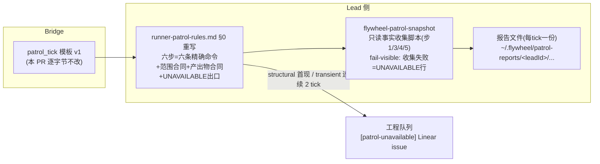

# FLY-1855 patrol_tick 六步规矩可执行化 — 实施计划

Issue: FLY-1855 (https://linear.app/geoforge3d/issue/FLY-1855/规矩机制-patrol-tick-六步实际只有两步被执行-无命令-范围冲突-无产出物-无读不懂出口)
日期: 2026-08-18
基于: 无

---

## 1. 问题与目标

Annie 2026-08-17 发现:Honey Lemon 的 patrol_tick 巡检六步只做了前两步,且**这个失效模式对每一个 Lead 都成立**。自查证实规律:

> **给了可直接执行命令的两步(§0 步 1/2),100% 被执行;没给命令的四步(步 3–6),0% 被执行。**

四个可定位缺陷(issue 原文,本计划逐条对应):

| # | 缺陷 | 本计划的修法 |
|---|------|------------|
| ① | 抽象名词无法解析成动作(「TURN belt」「engine node table」在库里找不到同名对象) | 每步落到唯一精确命令;账本类查询收口进一个 CI 测试的只读快照脚本(§4) |
| ② | 范围冲突:tick 措辞「你名下」与规矩第 5 步的全局语义相反 | 范围合同写死:**检测=整机,处置=名下**;本 PR 按 Lead 裁定保留 tick v1, v2 只作未来独立提案(§5) |
| ③ | 无产出物 ⇒ 做 2 步和做 6 步从外部看一样 | 产出物合同:每 tick 一份六步报告文件,逐步 `OK/FINDING/UNAVAILABLE`(§6) |
| ④ | 「读不懂」只能静默跳过 | UNAVAILABLE 出口:报告留痕;structural 首现建单,transient 连续 2 tick 才建单(§7) |

**实测代价锚点**:2026-08-17 全仓 GitHub 1h49m 零活动(21:21→23:10 UTC,四条 PR 全停),落在「名下」框之外,六步巡检没发现,最终 founder 本人发现——巡检存在的目的正是「founder 不该当人肉看门狗」。

## 2. 审计事实(本设计的地基,全部在生产上只读验证过)

- tick 正文由 `packages/teamlead/src/bridge/hook-payload.ts` `formatPatrolTick()`(约 :249)渲染,founder-fixed 两句模板,第二句就是「按 Bridge 的账,你名下有 N 个未终结 runner」——缺陷②的直接来源。FLY-1687 founder 裁定:tick 本体**零预判零指令**,「收到 tick 做什么」全部在 Lead 侧 `packages/teamlead/lead-rules-base/runner-patrol-rules.md` §0。
- roster 为空的 Lead **零 tick**(`patrol-tick.ts` roster.length===0 → continue);非 spawning Lead 零 tick。本计划不改这两个门(见 §9 边界)。
- 账本真身分布在**两个库**,且表空间巨大(teamlead.db 有 40+ 张 `workflow_*` 表)——执行者不可能猜对,必须写死:
  - `~/.flywheel/teamlead.db`(全局,Bridge StateStore):`workflow_run`、`workflow_run_node`(= 规矩里的「engine node table」)、`workflow_activation_turn`、`dead_letter_alerts`、`sessions`。
  - `~/.flywheel/comm/<project>/comm.db`(每项目):`three_stage_turn`(= 「TURN belt」)、`turn_wake_outbox`、`mailbox`(FLY-1573 投递账)、`turn_source_history`。
- 两库均可 `sqlite3 "file:<path>?mode=ro"` 只读直查(WAL 下安全)。2026-08-18 的初始探针仅证明下列表/列可读、**不证明 finding predicate 已校准**;正式 Codex review R1 随后用派生 candidate 数推翻了「能返回行即可」的过强表述:
  - 步 3 初始探针:`SELECT r.issue_id, n.node_id, n.attempt, n.state, substr(n.execution_id,1,8) FROM workflow_run_node n JOIN workflow_run r ON r.run_id=n.run_id WHERE n.state='running'` ✅(能返回本 runner,但也带入 103 条 terminated-run stale rows;实现不得直接使用)
  - 步 3:`SELECT issue_id, holder_exec_id, phase, epoch FROM three_stage_turn` ✅
  - 步 4:`mailbox` runner 收件 `QUEUED/LEASED` 计数 ✅(LEASED=306——证明**必须加时间窗过滤**,裸计数会淹没 Lead);`turn_wake_outbox` pending/sent ✅(=2);`dead_letter_alerts` ✅(=144,同理需窗口)
- Discord 独立信源的具体工具:Lead 的 Discord MCP server 暴露 `reply / react / edit_message / download_attachment / fetch_messages`——步 5 的 Discord 检查用 **`fetch_messages`**(读真 Discord,不是 Bridge 账面)。
- 规矩文件经 `packages/teamlead/scripts/lead-rules-bundle.sh`(:365,§0 顺位)进入所有 non-cos dept Lead(mailbox + commdb 两路;Claude 与 Codex Lead 共用 role-aware bundle)。
- 全局脚本安装精包先例:FLY-1482 的 `~/.flywheel/bin/flywheel-cmux-sync`(leaf symlink 解析回仓库 source tree)。快照脚本复用该分发形态。

## 3. 设计总览



改动面共四块,全部在本仓:

| 块 | 文件 | 性质 |
|---|------|------|
| A | `packages/teamlead/lead-rules-base/runner-patrol-rules.md` §0 全文重写 | 规矩(核心交付) |
| B | `packages/teamlead/src/bridge/hook-payload.ts` `formatPatrolTick` 模板 v2 | **待 founder 认可的独立后续;本 PR 不改** |
| C | 新 `scripts/lead-patrol-snapshot.sh` + installer symlink `~/.flywheel/bin/flywheel-patrol-snapshot` + `scripts/__tests__/lead-patrol-snapshot.test.sh`(进 ci.yml 字面枚举) | 新脚本(账本/外部系统只读,只写报告产物) |
| D | 扩展 `packages/teamlead/src/__tests__/fly369-patrol-rule.test.ts`:§0 合同锚点(每步含命令、产出物合同、UNAVAILABLE 出口、范围合同) | 守卫测试 |

## 4. 快照脚本 `flywheel-patrol-snapshot`(块 C)

**定位**:对账本与外部系统保持只读的事实收集器,收步 1/3/4/5 的事实,并把**预填的六步报告骨架原子写入产出目录**;步 2(pane 判读)与步 6(处置)仍由 Lead 定稿。规矩文件里每一步只写**一条命令**,账本 SQL 的唯一可执行真相收口在脚本里(避免 .md 与脚本两处 SQL 漂移;schema 改名时 CI 跑真库 RED,而不是 .md 静默腐烂)。脚本对 teamlead/comm/GitHub 是 read-only;唯一写副作用是本条 tick 的报告底稿。

契约:

- 调用:`flywheel-patrol-snapshot --project <name> [--lead <leadId>] [--tick-seq <n>]`(leadId 优先取参数,否则取 `FLYWHEEL_LEAD_ID`;两者都无则 usage error)。当前 v1 正常不传 `--tick-seq`,生成 `tickNA`。
- 路径解析必须与现有 runtime env 对齐:StateStore 依次取 `FLYWHEEL_STATE_DB_PATH` → `TEAMLEAD_DB_PATH` → `${FLYWHEEL_STATE_DIR:-$HOME/.flywheel}/teamlead.db`;projects registry 取 `FLYWHEEL_PROJECTS_FILE` → 同一 state dir 下 `projects.json`;CommDB 对显式 `FLYWHEEL_COMM_DB` 仅在其路径归属当前 `<project>` 时采用,否则固定取 state dir 下 `comm/<project>/comm.db`。测试覆盖显式 slot 路径,避免 Lead/Runner 两套 env 名造成读错生产库。
- 步 1:执行 `TMUX= tmux list-windows -a` 原样附上(供 Lead 与名册对账)。
- **project 过滤(Claude cross-review R1 HIGH-1)**:teamlead.db 是**全局**库、comm.db 是**每项目**库——所有账本 join 必须带 `workflow_run.project_name = <project>` 过滤,否则跨项目错配会批量铸假 finding(生产实测:running nodes = flywheel 124 / tidal-echo 1,tidal-echo 的 Lead 不过滤会每 tick 铸 124 条假「running node 无 TURN 行」)。「整机」维度只适用于 tmux 窗口清单与 `dead_letter_alerts`。
- 步 3 的**活性集合先收窄再对账**(正式 Codex review R1 HIGH):`workflow_run_node(state='running')` 不是活性账,生产上 124 行中 103 行属于 `workflow_run.status='terminated'`;直接使用会每 tick 铸约 188 条假 candidate。脚本只取 `workflow_run.project_name=<project> AND workflow_run.status='active' AND workflow_run_node.state='running'`,并把 `sessions.status='running'` 作为独立活性证据。三类候选限定在这个 active issue/execution 集合内:active **issue** 无 TURN 行 / active issue 的 TURN holder 不在同 issue 的 live running execution 集 / active live execution 的 `turn_wait_ledger.no_turn_streak >= 3`;active node 缺 live session 另记账本分歧。2026-08-18 PDT 修订后在生产只读库校准:flywheel active running nodes=11、live=10、active-without-live-session=1、active issues without TURN=0、TURN holder not live=1、live wait streak high=0(由约 188 条噪音降到 2 条可判候选);tidal-echo 的 1 条 active node 仍被 project filter 隔离。实现后在同一组 count-only query 上复测并写进 PR。
- 步 4(全部带时间窗 + 活性范围):`mailbox` 只投影仍在 `sessions.status='running'` 集合里的 runner 收件——`QUEUED` 超 30min,或 `LEASED` 已过 claim 且 `created_at` 在最近 24h;已终结 execution 的陈年 lease 不再每 tick 重报。`turn_wake_outbox` 只看 active execution 的 `pending/sent` 超 15min未 ack;`dead_letter_alerts` 只看最近 24h 且 `state='pending'`的未结算行(此表全局,不过滤 project,发现按归属路由);`accepted` 是已有真实投递 receipt 的终态,不得重报。保留现行「Runner reports/PRs vs verdict claims」半步:对 active run 的 `workflow_node_pr_binding.head_sha` 与有效 git-head `workflow_claims.subject_digest`(`codex_approved`/`qa_passed`/`founder_approved`)做一致性候选检查。2026-08-18 PDT 修订 predicate 的生产 count-only 校准:live mailbox old queued=0、live recent expired lease=0、active unacked wake >15m=1、active bound-node head/claim mismatch=0;2026-08-19 复核的 recent deadletters=4 全是 `accepted`,加终态过滤后 pending=0。候选量从裸 expired lease 约 302 条降至 1 条。**时间戳格式逐表标注**(R1 LOW-11):`mailbox.*`/`dead_letter_alerts.*` 为 TEXT ISO、`turn_wake_outbox.*` 为 INTEGER 毫秒——TEXT 窗口用 `julianday(...)` 解析而非将含 `T/Z` 的 ISO 值与 SQLite `datetime()` 字符串裸比较,INTEGER 则用 epoch 毫秒;混用会静默空转。CI fixture 两种格式都要覆盖,并断言陈年 expired lease 不出现、recent accepted dead-letter 不出现、recent pending dead-letter 出现。
- **报告列 allowlist(正式 Codex review R1 MEDIUM)**:任何查询都禁止 `SELECT *`。`mailbox` 只输出截断后的 `id/to_agent` + `state/created_at/claim_expires_at`;`turn_wake_outbox` 只输出截断后的 `wake_id/execution_id` + `issue_id/state/created_at`;`dead_letter_alerts` 只输出截断后的 `id/recipient` + `source_kind/lead_id/project_name/dead_count/state/created_at`;verdict 对账只输出 issue/node/attempt/predicate 与 head digest 的前 8 位。永不读取/输出 `content`、`delivery_content`、`envelope_json`、`summary`、`claim_token`、capability/token/evidence 原文。CI 向每张表灌 sentinel secret,断言报告里零命中。
- 步 5(GitHub 半自动,**一律 REST**,R1 LOW-7:`gh pr list` 走 GraphQL,不用):`GH_REPO=<projectRepo> gh api 'repos/{owner}/{repo}/pulls?state=open&per_page=50'` + 同样带 `GH_REPO` 的 `gh api 'repos/{owner}/{repo}/actions/runs?per_page=5'`,只投影 PR number/draft/head8/updated_at 与 run id/status/created_at,打印**整仓最近活动时刻**。`gh api` **没有 `-R` flag**;这里用官方支持的 `GH_REPO` placeholder 解析,不依赖 cwd。Discord 部分不进脚本(MCP 工具只在 Lead 会话里),骨架里留占位行指到 `fetch_messages`,并给**可执行的地址解析 + 可判定的选取规则**(R1 LOW-10):按 tick 名册 identifier 最多取 2 个、最近活动优先;先从与快照同一个 projects registry 用已 export 的 `PROJECT_NAME + LEAD_ID` 解析 `chatChannel`(不得假设未 export 的 `$CHAT_CHANNEL`),再用 `GET /api/chat-threads?issueId=<identifier>&channelId=<chatChannel>` 只从 Bridge 取 Discord `threadId` 地址,最后用 Discord MCP `fetch_messages` 读真消息/archive 状态。Bridge 只当地址簿,不采信其 `chat_threads` 作为状态真相。tick 只在名册非空时发出,故选取输入恒非空。
- 输出与落盘:先在报告目录同级临时文件生成 markdown 骨架,含逐步机器可读状态行 `STEP <n>: OK-CANDIDATE | FINDING-CANDIDATE | UNAVAILABLE(<原因>) | LEAD-JUDGMENT-REQUIRED`,再 `mv` 原子发布为本次报告路径;stdout 回显同一骨架并打印 `REPORT_PATH=<绝对路径>`。步 1(名册对账)、2(pane 判读)、5(Discord + 「账面应有活动」判断)、6(处置)初始一律为 `LEAD-JUDGMENT-REQUIRED`;只有步 3/4 可根据有界 predicate 预填 candidate。因此只要命令启动成功,即使 Lead 后续少做,也留下六行候选/未判定状态,不会把「有事实」误写成「已健康」。
- **fail-visible 不 fail-silent + 瞬态/结构分类**(R1 MEDIUM-5):sqlite 打开即设 `.timeout 3000`,失败做一次有界重试;仍失败 → 该步输出 `UNAVAILABLE(transient: <稳定token>)`(如 `sqlite_busy`;R2 LOW-1:原因必须归一为稳定 token 而非原始错误文本,否则「连续 2 tick」比对与 Linear 标题搜重会在易变字符串上碎裂,CI 断言 token 集)或 `UNAVAILABLE(structural: <原因>)`(表/列不存在、库打不开、gh 报错),继续收其余步。事实源故障仍以 0 退出并产报告;**用法错误或报告目录/临时文件/原子发布失败必须非零退出**,因为此时连 UNAVAILABLE 都无法形成持久产物,不得谎报成功。§7 的建单出口只对 structural 首现触发;transient 连续 2 个 tick 复现才升格建单——避免自愈性抖动铸工程 issue(告警噪音纪律)。
- 只读纪律:sqlite 一律 `file:...?mode=ro` URI + 有界 `LIMIT`;gh 固定两条 REST 调用(60min 节拍 × Lead 数,配额可忽略;不碰 FLY-1624 管的 Bridge GraphQL 预算)。
- 多仓项目 v1 只查项目主仓;从 projects.json 的真实字段 `projectRepo` 取 `owner/repo` slug(`projectRoot` 只用于本地仓路径),用 `GH_REPO=<projectRepo>` 解析 REST placeholders,不依赖 Lead 当前 cwd;见 §9。
- **安装接线**(R1 MEDIUM-4 + 正式 review LOW):新链接 `~/.flywheel/bin/flywheel-patrol-snapshot` 加入 `converge-flywheel-bin.sh` 的 **strict regime**。该路径会在缺失时通过 `strict_publish_link ... created` 原子创建,并同时提供 source sanity/shebang/exec 校验、漂移修复与 FLY-1389 temp/worktree-root 拒绝;不另造手工/一次性 installer。strict helper 现有 `cmux alert-chain` 专用人类文案需抽象成按名字区分的通用「managed executable」文案,但 `meta-alert.sh` 的既有 title/body 保持逐字节不变,不能让 snapshot 链路冒充 cmux 告警。管理名单、`symlink_source_for`、strict name 与全部 trusted fake-repo steady-state fixtures/hermetic 正反测试必须同 PR 落地。当前会进入 strict symlink lane 的 trusted fixture 精确只有:`converge-fly1389.test.sh`、`fly1577-alert-arrival.test.sh`、`fly1577-cmux-bin-closure.test.sh`;三者的 fake source + healthy-link seed 都要补齐。`converge-flywheel-bin.test.sh` 与 `packaged-seams.test.sh` 的相关 fixture 显式为 temp/worktree shape,按现有 guard 跳过 symlink lane,不为本改动伪造 source。

CI(`scripts/__tests__/lead-patrol-snapshot.test.sh`,遵循目录现有命名法,R1 MEDIUM-3):用**真代码**建库(StateStore dist 建 teamlead.db、flywheel-comm dist 建 comm.db),灌最小 fixture,跑脚本断言:报告文件确实原子落盘且含六段、active/live 边界内三类步 3 finding 各有阳性对照、terminated run/terminal session 不得泄入、**双项目 fixture 证 project 过滤**、陈年 expired lease 不出现而 live recent expired lease 出现、recent accepted dead-letter 不出现而 recent pending dead-letter 出现、两种时间戳格式窗口阳性、secret sentinel 零输出、故意删表后对应步 `UNAVAILABLE(structural)` 而其余步照常、全空库输出 all-clear 骨架。schema 漂移由「真代码建库」天然抓住。**CI 接线**:放入 `script-tests-2` 的独立无条件 step(预计 <5s,同步更新该 job 的 step-seconds 注释),在尾部 FLY-1870 tripwire 之前;同时更新 `ci.yml` 字面枚举和 `scripts/__tests__/ci-structure.test.sh` 的 `expected_shard_tests["script-tests-2"]` 精确有序列表。该 shard 已执行 `pnpm build` 且安装 sqlite3,无需 suite 内重复 build。

## 5. tick 模板 v2(块 B,**本 PR 不启用**;保留为待 founder 认可的独立提案)

现行(founder-fixed,FLY-1687):

```
[patrol_tick] 巡检时间到。
按 Bridge 的账,你名下有 N 个未终结 runner(此名册是待核声明,不是结论):
- <identifier> [<exec8>] (<role>, <status>)
```

v2 独立草案(改两句话 + 首行带 tick 序号,仍零预判零指令;deny-list `check|verify|suggest|inspect|建议|怀疑|该查` 全不触):

```
[patrol_tick #<seq>] 巡检时间到。范围合同:检测=整机,处置=名下;六步与产出物合同见 runner-patrol-rules.md §0。
按 Bridge 的账,你名下有 N 个未终结 runner(此名册只是 Bridge 的待核声明,不是巡检边界,也不是结论):
- <identifier> [<exec8>] (<role>, <status>)
```

- **`#<seq>` 是本条 tick 的 lead_events 序号**(R1 MEDIUM-6):现行正文不带任何可锚定 id,报告与 tick 无法 1:1 对上。future v2 若获认可,seq 与措辞必须作为**同一份逐字提案**批准;`formatPatrolTick` 入参已有 `seq`,零新数据。founder design HTML §4 的 after box 必须与上面草案逐字一致并解释该序号用途,不能展示 A、实现 B。
- 「范围合同/文件指针」是**范围声明与导航**,不是预判或按-runner 指令;FLY-1687 的不变量(Bridge 不做预检/健康判断/逐 runner 指令)原样保留,渲染阴性对照(deny-list 断言)原样保留。
- **当前授权分支(Lead ruling `0e86df21-300c-4ce0-9cd8-dec4ff38a312`)**:`formatPatrolTick` 与 render/parity 测试保持 v1 **逐字节不动**。本 PR 只落规矩侧范围合同,报告名使用 `tickNA` + UTC 时间窗锚定。v2 留在 design HTML 等 founder 明确认可后由独立小改启用;PR 描述必须明说「v2 待 founder 认可,本 PR 未启用」。

## 6. 产出物合同(块 A 核心之一,治缺陷③)

- 每条 tick 必产一份报告:`~/.flywheel/patrol-reports/<leadId>/<UTC 时间戳>-tickNA.md`;当前 v1 正文无 seq,故以文件名 UTC 时间戳 ↔ tick `scheduled_at` 的时间窗锚定。future v2 获认可后才切换为 `-tick<seq>.md` 直接 join。
- 格式:六行 `STEP <n>: OK | FINDING | UNAVAILABLE(<原因>)`,每行后跟一行证据/判断;「全部健康」也要写全六行。快照脚本在采集结束时原子落盘候选骨架;Lead 打开 stdout 最后一行指向的 `REPORT_PATH`,定稿步 1/2/5/6 与步 3/4 的 candidate,不得删掉任一步。
- 报告的意义:**做 2 步和做 6 步从此在文件系统上可区分、可事后取证**。默认不发 Discord;有 FINDING 或 UNAVAILABLE 时按现行 reporting rules 上报(全部健康只留档,不制造告警噪音——FLY-1612/1687 的噪音纪律)。
- 报告锚定 tick:当前为 UTC 时间窗近似配对;future v2 后可升级成 seq 直接 join。Bridge 机器核「每条已结算 tick 是否有对应报告文件且含六行 STEP」是 follow-up(§9),不在本单,不得把当前 v1 说成已有 1:1 key。

## 7. UNAVAILABLE 出口(治缺陷④)

- 任一步无法执行(命令报错 / 对象不存在 / 无法解析该步要求什么):报告记 `UNAVAILABLE(<原因>)`。建单口径分两类(R1 MEDIUM-5):**structural 首次出现**当场建 Linear issue;**transient**(SQLITE_BUSY/锁类,脚本已重试仍失败)只记报告,连续 2 个 tick 复现才升格建单。issue 精确标题 `[patrol-unavailable] step <n>: <稳定原因>`,以 `team=FLY + project=Flywheel + label=Flywheel` 自动进 Tadashi 队列。当前生产 projects registry 的 `flywheel.linear` 为 null,故不得用只在带 binding fixture 中成功的 `projectName=flywheel`。建前必须用 `GET /api/linear/issues?project=Flywheel&labels=Flywheel` 拉取非 terminal issues 并在本地 `jq` 做**精确标题**搜重;route 本身没有 `search`/`team` query。已有同标题 open issue 则在报告记录其 identifier 并禁止重复建单。**跳过而不留痕 = 违反合同**(写进规矩原文)。
- 新增第 0 步(自检):打开自己上一份报告;若上次有 UNAVAILABLE 而没建 issue,先补。这把「规矩只在事后生效永远发现不了它没生效」的缺陷类闭掉一半(另一半靠 follow-up 机器核)。

## 8. `runner-patrol-rules.md` §0 重写全文草案(块 A,核心交付;实现时可微调措辞,合同条款不可减)

> **范围合同**:检测范围=**整机**(全部 runner 窗口 + 项目仓库的外部真相);处置权限=**只覆盖你名下 runner**。tick 名册只是 Bridge 对「你名下」的待核声明,是步 1/3 的对账输入,**不是巡检边界**。跨界发现(别家 Lead 的 runner、无主窗口、全仓停摆)走步 6 上报,不越权处置。
>
> **产出物合同**:每条 tick 必产一份六步报告文件(路径与格式见上 §6;快照脚本会打印骨架与目标路径)。
>
> **UNAVAILABLE 出口**:见上 §7;跳过不留痕=违约。
>
> `[patrol_tick]` 仍是**纯闹钟**;Bridge roster 是**待核声明**。所有判断必须来自下列**独立信源**,不采信 Bridge 单方转述。
>
> **第 0 步(自检)**:run: `PATROL_DIR="${FLYWHEEL_STATE_DIR:-$HOME/.flywheel}/patrol-reports/${LEAD_ID:?LEAD_ID required}"; PREVIOUS_REPORT="$(find "$PATROL_DIR" -maxdepth 1 -type f -name '*-tickNA.md' -print 2>/dev/null | sort | tail -1)"; test -z "$PREVIOUS_REPORT" || sed -n '1,220p' "$PREVIOUS_REPORT"`;若上一份有 UNAVAILABLE 欠单,按步 6 补。然后 run: `SNAPSHOT_OUTPUT="$(~/.flywheel/bin/flywheel-patrol-snapshot --project "${PROJECT_NAME:?PROJECT_NAME required}" --lead "${LEAD_ID:?LEAD_ID required}")" && printf '%s\n' "$SNAPSHOT_OUTPUT"; REPORT_PATH="$(printf '%s\n' "$SNAPSHOT_OUTPUT" | sed -n 's/^REPORT_PATH=//p' | tail -1)"; test -n "$REPORT_PATH" && test -f "$REPORT_PATH"`。后续步骤共用这一份 `REPORT_PATH`,不得重复启动快照制造多份报告。
>
> 1. **名册核对(ground truth)** — run: `awk '/^## STEP 1$/{show=1; next} /^## STEP 2$/{show=0} show' "$REPORT_PATH"`。该段由快照内部的 `TMUX= tmux list-windows -a` 生成;与 tick 名册对账,窗口前缀是 Linear identifier;**整机维度**,多了少了都是 finding,不在你名下的异常记入报告并走步 6。忽略正常非 runner 窗口(`zsh` scaffolds、`cmux-*` 镜像、Codex Lead TUI;Claude Lead 自身在私有 socket)。
> 2. **pane 实况** — 对你名下每个 runner: `TMUX= tmux capture-pane -p -t <window> | tail -40`。活着≠推进:区分 TURN waiting / interactive menu / error loop。
> 3. **交接账(TURN belt = comm.db `three_stage_turn`;engine node table = teamlead.db `workflow_run_node`)** — run: `awk '/^## STEP 3$/{show=1; next} /^## STEP 4$/{show=0} show' "$REPORT_PATH"`(只读联查,按本项目 + active run/live session 过滤)。active running node 无 TURN 行 / active issue 的 TURN holder 不在 live execution 集 / active execution no_turn_streak 异常 → finding;历史 terminal 行不得重报。
> 4. **投递账 + verdict/receipt 一致性** — run: `awk '/^## STEP 4$/{show=1; next} /^## STEP 5$/{show=0} show' "$REPORT_PATH"`。该段只看 live runner 的 `mailbox` 超窗未结算、active `turn_wake_outbox` 未 ack、近 24h 且 `state='pending'` 的 `dead_letter_alerts`(已 `accepted` 的禁止重报),以及 active PR binding head 与有效 verdict claim subject 是否一致;只输出 allowlist 元数据,不得输出消息正文、envelope、summary、token 或 evidence 原文。有行 = 可能有没送到的唤醒/死信或 verdict 漂移,对照步 2/5 判。
> 5. **外部真相(整仓维度)** — run: `awk '/^## STEP 5$/{show=1; next} /^## STEP 6$/{show=0} show' "$REPORT_PATH"`。该段由 `GH_REPO=<projectRepo> gh api 'repos/{owner}/{repo}/pulls?state=open&per_page=50'` 和 `.../actions/runs?per_page=5` 的 REST 投影生成;看**整仓最近活动时刻**;全部 open PR 长时间零活动(如 >60min 且账面应有活动)是 finding(2026-08-17 全仓 1h49m 停摆类)。单个可疑 PR 再 run: `gh pr view <n> --repo <projectRepo> --json state,mergeable,headRefOid,statusCheckRollup`。Discord 最多检 2 个 tick 名册 identifier、最近活动优先;先 run: `PROJECTS_FILE="${FLYWHEEL_PROJECTS_FILE:-${FLYWHEEL_STATE_DIR:-$HOME/.flywheel}/projects.json}"; CHAT_CHANNEL_ID="$(jq -er --arg project "$PROJECT_NAME" --arg lead "$LEAD_ID" 'first(.[] | select(.projectName == $project) | .leads[] | select(.agentId == $lead) | .chatChannel)' "$PROJECTS_FILE")"`。每个 identifier 再 run(只解地址): `IDENTIFIER='<FLY-XX>'; THREAD_ID="$(curl -fsS -H "Authorization: Bearer ${TEAMLEAD_API_TOKEN:?TEAMLEAD_API_TOKEN required}" "${BRIDGE_URL:?BRIDGE_URL required}/api/chat-threads?issueId=$IDENTIFIER&channelId=$CHAT_CHANNEL_ID" | jq -r '.threadId // empty')"; test -n "$THREAD_ID"`,最后 run(读外部真相): Discord MCP `fetch_messages(chat_id=$THREAD_ID, limit=20)`。核最新消息/archive 状态;Bridge 只当 thread 地址簿,不采信 `chat_threads` 转述作为状态真相。
> 6. **处置** — run(报告):打开 `"$REPORT_PATH"`,将六行候选逐项定稿为 `OK | FINDING | UNAVAILABLE(<稳定原因>)` 并写下证据;名下 finding 按对应 emergency procedure 有界修复并留证。run(跨界):`PROJECTS_FILE="${FLYWHEEL_PROJECTS_FILE:-${FLYWHEEL_STATE_DIR:-$HOME/.flywheel}/projects.json}"; TADASHI_BOT_ID="$(jq -er 'first(.[] | select(.projectName == "flywheel") | .leads[] | select(.agentId == "flywheel-eng-lead") | .botUserId)' "$PROJECTS_FILE")"`;随后用 Discord MCP `reply(chat_id="1512578695468941333", message="<@$TADASHI_BOT_ID> [patrol cross-boundary] <finding>; report: $REPORT_PATH")` 发到 `#leads-roundtable`,由 Tadashi 统一路由,不得猜频道/收件人。run(UNAVAILABLE 搜重): `TITLE='[patrol-unavailable] step <n>: <稳定原因>'; EXISTING="$(curl -fsS -H "Authorization: Bearer ${TEAMLEAD_API_TOKEN:?TEAMLEAD_API_TOKEN required}" "$BRIDGE_URL/api/linear/issues?project=Flywheel&labels=Flywheel&state=backlog,unstarted,started&limit=250&slim=true" | jq -r --arg title "$TITLE" '.issues[] | select(.title == $title) | .identifier' | head -1)"`。若 `EXISTING` 非空,把 identifier 记入报告且禁止重复建单;否则只在 structural 首现或 transient 连续 2 tick 时 run(建单): `PAYLOAD="$(jq -n --arg title "$TITLE" --arg description "patrol report: $REPORT_PATH" '{title:$title, description:$description, team:"FLY", project:"Flywheel", labels:["Flywheel"]}')"; curl -fsS -X POST -H "Authorization: Bearer ${TEAMLEAD_API_TOKEN:?TEAMLEAD_API_TOKEN required}" -H 'Content-Type: application/json' "$BRIDGE_URL/api/linear/create-issue" -d "$PAYLOAD"`。全仓停摆走同一条 numeric-channel + Tadashi mention 命令。**报告六行全部定稿才算这条 tick 巡完;无法理解这里任一命令本身也必须记 UNAVAILABLE,禁止静默跳过。**

(§0 现有尾注「`runner_terminal_list` 只是内部起点、不采信 Bridge 单方转述、Lead 不得自建 timer」保留。)

## 9. 边界与不做什么(诚实边界)

- **不改** roster-empty 零 tick 门与非 spawning Lead 零 tick 门(FLY-1687 原设计;全机零 runner 时无人巡检,merged-PR 收尾停摆由 Bridge runner-ship probe 等既有机制兜)。
- **不做** Bridge 侧自动六步执行/自动判读(FLY-271/368 领域;LeadWatchdog 误报风暴史 FLY-193/218/220 是前车之鉴——pane 判读留给 Lead)。
- **不做** Bridge 侧「报告完整性机器核查」rider——作为 follow-up issue 由 Lead 随 PR 建(标题建议:`patrol 报告完整性 Bridge 核查`);本单先让违规**可取证**,再让它**可机器抓**。当前 v1 只能时间窗关联,future v2 后再升 seq join。
- 多 Lead 同时整机检测会重复发现同一跨界异常:相位已错开(`patrolTickOffsetMs`),队列端靠建单前搜重去重;v1 接受此冗余。
- 多仓项目 v1 只查主仓;插件 fork/skills 仓的外部真相留 follow-up。
- 报告文件留档不设自动清理(每 Lead 每天 ≤24 个小文件);满一个月后由日常清理单收编。
- **写路径边界**(R1 LOW-8 + 正式 review纠正):`~/.flywheel/patrol-reports/` 对 Claude Lead 可写;**所有 Codex Lead 形态(含 full-access 与 write-capable)都把 writable roots 钉在 projectRoot**,写不进该目录。生产当前所有 Codex-backed Lead 都 `canSpawnRunners=false`,收不到 tick;未来启用 spawning Codex dept Lead 前必须先按 backend 解析报告落点,否则禁止给它发 tick。
- 规矩/脚本生效方式:merge + 生产 `git pull` + installer symlink;规矩 bundle 在 Lead 启动时装载 → 需一次 Lead 重启波次(随下一次例行 restart-services 即可,不必专门重启)。

## 10. 已否决方案

| 方案 | 否决原因 |
|------|---------|
| 六步指令写进 tick 正文 | 违反 FLY-1687 founder 裁定(tick 零指令);规矩双写必漂移 |
| .md 里直接写全部 SQL,不建脚本 | 8+ 条多行 SQL 靠 Lead 逐条复制,schema 改名后 .md 静默腐烂;.md 与任何脚本双写 SQL 必漂移——收口成一个 CI 跑真库的脚本,规矩里每步只剩一条命令 |
| 全自动化六步(Bridge 执行+判断) | FLY-368 领域;pane 判读自动化=误报风暴前科;本单是规矩机制单 |
| 每 tick 报告发 Discord | 60min × N Lead 的 all-healthy 刷屏;告警噪音纪律(FLY-1612/1687)。报告落盘,FINDING/UNAVAILABLE 才上报 |
| UNAVAILABLE 只报给 Lead 的上级线不建单 | 「自动进入工程队列」要求结构化落点;口头上报会再次静默蒸发 |

## 11. 实施顺序(TDD)与验收

1. **RED**:扩展 `fly369-patrol-rule.test.ts`——断言 §0 含:范围合同锚点、产出物合同锚点、UNAVAILABLE 出口锚点、六步每步一条可执行命令(fenced/`run:` 标记)、Discord `threadId` 精确解址 route + `fetch_messages`、跨界 numeric roundtable channel + registry-derived Tadashi mention + `reply`、无「裸抽象名词步骤」。**既有锚点显式清算**(R1 MEDIUM-2,FLY-1687 交付过「既有锚点不动」,本单是有意替换,不是漂移):保留的 founder 不变量锚——`纯闹钟`、`独立信源`、`待核声明`、`不采信 Bridge 单方转述`、`Lead 不得自建 timer`;有意改写的锚——裸 `"TURN belt"` / `"engine node table"` 字面(§0 重写改为「名词 = 具体表名」的对照写法,锚点断言同步改为断言表名与命令存在);实现 PR 里逐条列出改了哪些断言、为什么。现文件即 RED。
2. **RED**:`lead-patrol-snapshot.test.sh`(§4 的 CI 契约,真代码建库 + 双项目阳性对照)+ 加进 `ci.yml` 字面枚举。
3. **GREEN**:写 `scripts/lead-patrol-snapshot.sh` + converge strict symlink;重写 §0。按 Lead ruling `0e86df21-300c-4ce0-9cd8-dec4ff38a312` 走 fallback 分支:`formatPatrolTick` 与 render/parity 测试 v1 字节不动,报告用 `tickNA`/时间窗锚定。只有未来拿到 founder 对**逐字 v2(含 `#<seq>`)**的记录化认可后,独立 PR 才改 block B。
4. 全仓门:`pnpm lint` + `pnpm -r build` + `pnpm test:packages:run` + 新 shell harness。
5. 真机验收(实现节点/QA 节点):在生产库上跑一次快照脚本(只读),六段齐全;人为断一张表路径跑出 UNAVAILABLE 阳性;一次真 tick 走完六步产出报告文件。
6. Follow-up issues 随 PR 建:Bridge 报告完整性核查 rider;多仓步 5 覆盖。

## 12. 风险

| 风险 | 缓解 |
|------|------|
| tick 模板 v2 需 founder 认可 | Lead 已裁定本 PR 保留 v1(`0e86df21-300c-4ce0-9cd8-dec4ff38a312`);缺陷②先由规矩侧范围合同压制,报告使用 tickNA/时间窗匹配。design HTML 的 v2(含 seq)只是未来独立提案,本 PR 不启用 |
| 快照脚本读 1.7GB 生产 teamlead.db 的负载 | 全部查询走既有主键/状态列 + `LIMIT`;只读 URI;60min 节拍单次运行,可忽略 |
| 阈值(30min/15min/24h/60min)误标 | 实现时以真库分布校准并写进测试;报告里标 `*-CANDIDATE`,判定权在 Lead |
| Lead 不跑脚本、报告造假 | 本单先做到「可取证」;机器核查 rider 是显式 follow-up。造假与漏做从「不可发现」变为「可审计违约」 |

## 13. 设计评审记录

2026-08-18 的独立上下文 Claude 交叉评审是早期质量输入,不替代当前 Runner Contract 要求的正式 Codex design gate。

- **Round 1**(`claude-design-review-round1.md`):CHANGES REQUESTED — 1 HIGH(跨库 join 缺 project 过滤,生产实测 tidal-echo Lead 会每 tick 铸 124 条假 finding)+ 5 MEDIUM(FLY-1687 守卫锚点清算、CI 接线、installer 接线、SQLITE_BUSY 瞬态分类、报告↔tick join key)+ 5 LOW。11 条全部采纳并折入本计划(§4/§5/§6/§7/§8/§9/§11/§12)。设计判断 (a)–(e) 全 AGREE(带条件,条件已折入)。
- **Round 2**(`claude-design-review-round2.md`):**APPROVED**。R1 全部 11 条确认折入(reviewer 逐条独立复核,含代码级验证:`StuckEscalationEnvelopeLike.seq` 在 envelope 上「零新数据」为真;`[patrol_tick #<seq>]` 无消费者破坏;`turn_wake_outbox.created_at` 毫秒标注正确)。附 3 条非阻塞 LOW 建议,已折入 §4(transient 稳定 token、installer 同 PR 落地、删不可达 n/a 分支)。设计判断 (a)–(e) 全 AGREE。

- **实现节点授权裁定**(Lead reply `0e86df21-300c-4ce0-9cd8-dec4ff38a312`,2026-08-18 PDT):founder 尚未认可 v2,本 PR 必须保留 v1 正文;只落规矩侧范围合同、快照脚本、tickNA/时间窗报告与 UNAVAILABLE 出口。v2 作为独立提案等 founder 点头后再启用。
- **正式 Codex Round 1**(request `2f27d93b-1165-49d2-8d4d-2ab1257230cf`):CHANGES REQUESTED。2 HIGH 指出 active/liveness 未界定会在生产每 tick 铸约 188 条假 candidate,且 founder HTML v2 漏 `#<seq>` 与 plan 不一致;另有 step4 陈年 lease、secret projection、CI exact inventory、verdict crosscheck、Codex 写边界等 finding。全部按本轮实测收敛进 §4–§13;v2 HIGH 通过「HTML 补齐未来逐字提案 + 当前 PR 明确 v1-only」闭合。修订后必须开新 design gate/request 复审。
- **正式 Codex 复审通道**(gate `4ad779fc-fc8d-4f06-91db-cf72e104bc6f`):2026-08-19 两个 request 因 reviewer 账号 weekly limit 非零失败,未产生 verdict;故设计门仍是 pending,不得将上述 Claude APPROVED 当成当前授权。等 Lead 给出可用的交叉 reviewer 路由后,对本版本开**新** gate/request,APPROVED 前不实现。
