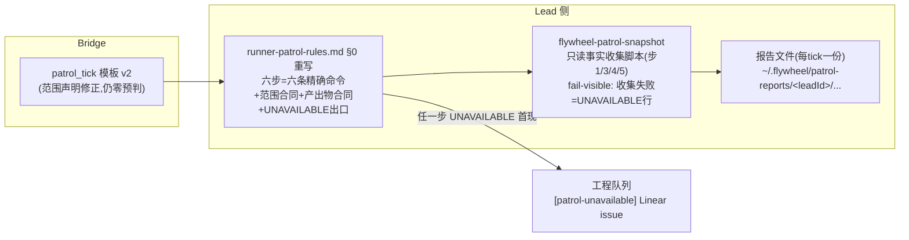

# FLY-1855 patrol_tick 六步规矩可执行化 — 实施计划

Issue: FLY-1855 (https://linear.app/geoforge3d/issue/FLY-1855/规矩机制-patrol-tick-六步实际只有两步被执行-无命令-范围冲突-无产出物-无读不懂出口)
日期: 2026-08-18
基于: 无

---

## 1. 问题与目标

Annie 2026-08-17 发现:Honey Lemon 的 patrol_tick 巡检六步只做了前两步,且**这个失效模式对每一个 Lead 都成立**。自查证实规律:

> **给了可直接执行命令的两步(§0 步 1/2),100% 被执行;没给命令的四步(步 3–6),0% 被执行。**

四个可定位缺陷(issue 原文,本计划逐条对应):

| # | 缺陷 | 本计划的修法 |
|---|------|------------|
| ① | 抽象名词无法解析成动作(「TURN belt」「engine node table」在库里找不到同名对象) | 每步落到唯一精确命令;账本类查询收口进一个 CI 测试的只读快照脚本(§4) |
| ② | 范围冲突:tick 措辞「你名下」与规矩第 5 步的全局语义相反 | 范围合同写死:**检测=整机,处置=名下**;tick 模板同步修订(§5) |
| ③ | 无产出物 ⇒ 做 2 步和做 6 步从外部看一样 | 产出物合同:每 tick 一份六步报告文件,逐步 `OK/FINDING/UNAVAILABLE`(§6) |
| ④ | 「读不懂」只能静默跳过 | UNAVAILABLE 出口:报告留痕 + 首次出现即建 `[patrol-unavailable]` Linear issue 进工程队列(§7) |

**实测代价锚点**:2026-08-17 全仓 GitHub 1h49m 零活动(21:21→23:10 UTC,四条 PR 全停),落在「名下」框之外,六步巡检没发现,最终 founder 本人发现——巡检存在的目的正是「founder 不该当人肉看门狗」。

## 2. 审计事实(本设计的地基,全部在生产上只读验证过)

- tick 正文由 `packages/teamlead/src/bridge/hook-payload.ts` `formatPatrolTick()`(约 :249)渲染,founder-fixed 两句模板,第二句就是「按 Bridge 的账,你名下有 N 个未终结 runner」——缺陷②的直接来源。FLY-1687 founder 裁定:tick 本体**零预判零指令**,「收到 tick 做什么」全部在 Lead 侧 `packages/teamlead/lead-rules-base/runner-patrol-rules.md` §0。
- roster 为空的 Lead **零 tick**(`patrol-tick.ts` roster.length===0 → continue);非 spawning Lead 零 tick。本计划不改这两个门(见 §9 边界)。
- 账本真身分布在**两个库**,且表空间巨大(teamlead.db 有 40+ 张 `workflow_*` 表)——执行者不可能猜对,必须写死:
  - `~/.flywheel/teamlead.db`(全局,Bridge StateStore):`workflow_run`、`workflow_run_node`(= 规矩里的「engine node table」)、`workflow_activation_turn`、`dead_letter_alerts`、`sessions`。
  - `~/.flywheel/comm/<project>/comm.db`(每项目):`three_stage_turn`(= 「TURN belt」)、`turn_wake_outbox`、`mailbox`(FLY-1573 投递账)、`turn_source_history`。
- 两库均可 `sqlite3 "file:<path>?mode=ro"` 只读直查(WAL 下安全)。以下候选查询已于 2026-08-18 在生产库真跑通过:
  - 步 3:`SELECT r.issue_id, n.node_id, n.attempt, n.state, substr(n.execution_id,1,8) FROM workflow_run_node n JOIN workflow_run r ON r.run_id=n.run_id WHERE n.state='running'` ✅(返回含本 runner 自身 FLY-1855/design/running)
  - 步 3:`SELECT issue_id, holder_exec_id, phase, epoch FROM three_stage_turn` ✅
  - 步 4:`mailbox` runner 收件 `QUEUED/LEASED` 计数 ✅(LEASED=306——证明**必须加时间窗过滤**,裸计数会淹没 Lead);`turn_wake_outbox` pending/sent ✅(=2);`dead_letter_alerts` ✅(=144,同理需窗口)
- Discord 独立信源的具体工具:Lead 的 Discord MCP server 暴露 `reply / react / edit_message / download_attachment / fetch_messages`——步 5 的 Discord 检查用 **`fetch_messages`**(读真 Discord,不是 Bridge 账面)。
- 规矩文件经 `packages/teamlead/scripts/lead-rules-bundle.sh`(:365,§0 顺位)进入所有 non-cos dept Lead(mailbox + commdb 两路;Claude 与 Codex Lead 共用 role-aware bundle)。
- 全局脚本安装精包先例:FLY-1482 的 `~/.flywheel/bin/flywheel-cmux-sync`(leaf symlink 解析回仓库 source tree)。快照脚本复用该分发形态。

## 3. 设计总览



改动面共四块,全部在本仓:

| 块 | 文件 | 性质 |
|---|------|------|
| A | `packages/teamlead/lead-rules-base/runner-patrol-rules.md` §0 全文重写 | 规矩(核心交付) |
| B | `packages/teamlead/src/bridge/hook-payload.ts` `formatPatrolTick` 模板 v2 + `patrol-tick-render.test.ts`/parity 测试更新 | 代码(一处字符串) |
| C | 新 `scripts/lead-patrol-snapshot.sh` + installer symlink `~/.flywheel/bin/flywheel-patrol-snapshot` + `scripts/__tests__/lead-patrol-snapshot.test.sh`(进 ci.yml 字面枚举) | 新脚本(只读) |
| D | 扩展 `packages/teamlead/src/__tests__/fly369-patrol-rule.test.ts`:§0 合同锚点(每步含命令、产出物合同、UNAVAILABLE 出口、范围合同) | 守卫测试 |

## 4. 快照脚本 `flywheel-patrol-snapshot`(块 C)

**定位**:只读事实收集器,收步 1/3/4/5 的账本与外部事实,打印**预填的六步报告骨架**;步 2(pane 判读)与步 6(处置)是 Lead 判断,不进脚本。规矩文件里每一步只写**一条命令**,账本 SQL 的唯一可执行真相收口在脚本里(避免 .md 与脚本两处 SQL 漂移;schema 改名时 CI 跑真库 RED,而不是 .md 静默腐烂)。

契约:

- 调用:`flywheel-patrol-snapshot --project <name> [--tick-seq <n>]`(leadId 从 `FLYWHEEL_LEAD_ID` env 取,无则要求显式 `--lead`)。
- 步 1:执行 `TMUX= tmux list-windows -a` 原样附上(供 Lead 与名册对账)。
- **project 过滤(Claude cross-review R1 HIGH-1)**:teamlead.db 是**全局**库、comm.db 是**每项目**库——所有账本 join 必须带 `workflow_run.project_name = <project>` 过滤,否则跨项目错配会批量铸假 finding(生产实测:running nodes = flywheel 124 / tidal-echo 1,tidal-echo 的 Lead 不过滤会每 tick 铸 124 条假「running node 无 TURN 行」)。「整机」维度只适用于 tmux 窗口清单与 `dead_letter_alerts`。
- 步 3:`workflow_run_node(state='running')` JOIN `workflow_run`(**含 project_name 过滤**)⋈ `three_stage_turn`(两库跨查,`ATTACH ... ?mode=ro` 或两查询 shell join)。输出三类候选 finding:running node 无 TURN 行 / TURN holder 的 exec 不在 running node 集 / `turn_wait_ledger.no_turn_streak` 异常高。
- 步 4(全部带时间窗,阈值实现时以真库数据校准并进测试):`mailbox` runner 收件 `QUEUED` 超 30min 或 `LEASED` 且 `claim_expires_at` 已过;`turn_wake_outbox` `pending/sent` 超 15min 未 ack;`dead_letter_alerts` 最近 24h(此表全局,不过滤 project,发现按归属路由)。**时间戳格式逐表标注**(R1 LOW-11):`mailbox.*` 为 TEXT ISO、`turn_wake_outbox.*` 为 INTEGER 毫秒——窗口过滤按各自格式写,混用会静默空转;CI fixture 两种格式都要覆盖。
- 步 5(GitHub 半自动,**一律 REST**,R1 LOW-7:`gh pr list` 走 GraphQL,不用):`gh api 'repos/{owner}/{repo}/pulls?state=open&per_page=50'` + `gh api 'repos/{owner}/{repo}/actions/runs?per_page=5'`,打印**整仓最近活动时刻**(max updated_at / 最新 run created_at)。Discord 部分不进脚本(MCP 工具只在 Lead 会话里),骨架里留占位行指到 `fetch_messages`,并给**可判定的选取规则**(R1 LOW-10):按 tick 名册的 identifier,取其 `[FLY-XX]` issue thread,最多 2 个、按最近活动排序(tick 只在名册非空时发出,故名册恒非空)。
- 输出:markdown 骨架,含逐步机器可读状态行 `STEP <n>: OK-CANDIDATE | FINDING-CANDIDATE | UNAVAILABLE(<原因>) | LEAD-JUDGMENT-REQUIRED`(步 2/6 恒为最后者),并打印本次报告文件的目标路径。
- **fail-visible 不 fail-silent + 瞬态/结构分类**(R1 MEDIUM-5):sqlite 打开即设 `.timeout 3000`,失败做一次有界重试;仍失败 → 该步输出 `UNAVAILABLE(transient: <稳定token>)`(如 `sqlite_busy`;R2 LOW-1:原因必须归一为稳定 token 而非原始错误文本,否则「连续 2 tick」比对与 Linear 标题搜重会在易变字符串上碎裂,CI 断言 token 集)或 `UNAVAILABLE(structural: <原因>)`(表/列不存在、库打不开、gh 报错),继续收其余步;脚本仅在用法错误时非零退出。§7 的建单出口只对 structural 首现触发;transient 连续 2 个 tick 复现才升格建单——避免自愈性抖动铸工程 issue(告警噪音纪律)。
- 只读纪律:sqlite 一律 `file:...?mode=ro` URI + 有界 `LIMIT`;gh 固定两条 REST 调用(60min 节拍 × Lead 数,配额可忽略;不碰 FLY-1624 管的 Bridge GraphQL 预算)。
- 多仓项目 v1 只查项目主仓(projects.json registry 的 repoPath);见 §9。
- **安装接线**(R1 MEDIUM-4):`converge-flywheel-bin.sh` 只收敛既有链接、**不创建**缺失链接——新链接 `~/.flywheel/bin/flywheel-patrol-snapshot` 的创建落在实际负责创建的安装位点(实现时确认精确站点,restart-services 安装步或独立 installer),同时把名字加进 converge 的管理清单;创建时按 FLY-1482 纪律校验 leaf symlink 解析进**生产仓 source tree**(不得指向临时 worktree)。**创建位点 + converge 清单项 + worktree-root 拒绝守卫三件必须落在同一个实现 PR**,不允许手工建链的过渡态(R2 LOW-2)。

CI(`scripts/__tests__/lead-patrol-snapshot.test.sh`,遵循目录现有命名法,R1 MEDIUM-3):用**真代码**建库(StateStore dist 建 teamlead.db、flywheel-comm dist 建 comm.db),灌最小 fixture,跑脚本断言:六段齐全、三类步 3 finding 各能被真数据触发(阳性对照)、**双项目 fixture 证 project 过滤**(第二个项目的 running node 不得泄进第一个项目的 STEP 3;单项目 fixture 抓不住 HIGH-1 这类错配)、故意删表后对应步变 `UNAVAILABLE(structural)` 而其余步照常(fail-visible 阳性对照)、时间戳双格式窗口过滤阳性对照、全空库输出 all-clear 骨架。schema 漂移由「真代码建库」天然抓住(改名 → 建库后查询失败 → RED)。**CI 接线**:新 suite 必须加进 `ci.yml` 的 shell suite 字面枚举(`ci-shell-suite-enumeration.test.sh` 强制,FLY-1773 教训),且该 CI job 需预构建 teamlead + flywheel-comm 两个 dist。

## 5. tick 模板 v2(块 B,需 founder 认可——经本单 design HTML 呈报)

现行(founder-fixed,FLY-1687):

```
[patrol_tick] 巡检时间到。
按 Bridge 的账,你名下有 N 个未终结 runner(此名册是待核声明,不是结论):
- <identifier> [<exec8>] (<role>, <status>)
```

v2 草案(改两句话 + 首行带 tick 序号,仍零预判零指令;deny-list `check|verify|suggest|inspect|建议|怀疑|该查` 全不触):

```
[patrol_tick #<seq>] 巡检时间到。范围合同:检测=整机,处置=名下;六步与产出物合同见 runner-patrol-rules.md §0。
按 Bridge 的账,你名下有 N 个未终结 runner(此名册只是 Bridge 的待核声明,不是巡检边界,也不是结论):
- <identifier> [<exec8>] (<role>, <status>)
```

- **`#<seq>` 是本条 tick 的 lead_events 序号**(R1 MEDIUM-6):现行正文不带任何可锚定 id,报告与 tick 无法 1:1 对上,承诺的「机器核查 rider」没有 join key。把 seq 显示进正文与措辞修订属**同一次 founder 认可**;`formatPatrolTick` 的入参 envelope 本就携带 `seq`,零新数据。founder 若否决,报告锚定降级为时间窗匹配(报告文件名里的 UTC 时间戳 ↔ tick `scheduled_at`)。
- 「范围合同/文件指针」是**范围声明与导航**,不是预判或按-runner 指令;FLY-1687 的不变量(Bridge 不做预检/健康判断/逐 runner 指令)原样保留,渲染阴性对照(deny-list 断言)原样保留。
- 改动落点:`formatPatrolTick` 一处字符串;更新 `patrol-tick-render.test.ts` 逐字节期望 + Mailbox/CommDB parity 测试;canonicalizer、恶意 roster fixture、6-status 闭集全不动。

## 6. 产出物合同(块 A 核心之一,治缺陷③)

- 每条 tick 必产一份报告:`~/.flywheel/patrol-reports/<leadId>/<UTC 时间戳>-tick<seq>.md`(seq = tick 正文首行的 `#<seq>`,模板 v2 起正文自带;founder 否决模板改动时退化为 `tickNA` + 时间窗锚定,见 §5)。
- 格式:六行 `STEP <n>: OK | FINDING | UNAVAILABLE(<原因>)`,每行后跟一行证据/判断;「全部健康」也要写全六行。快照脚本打印骨架,Lead 只补步 2/6 与判断,落盘用普通 shell 重定向(无需新工具)。
- 报告的意义:**做 2 步和做 6 步从此在文件系统上可区分、可事后取证**。默认不发 Discord;有 FINDING 或 UNAVAILABLE 时按现行 reporting rules 上报(全部健康只留档,不制造告警噪音——FLY-1612/1687 的噪音纪律)。
- 报告 1:1 锚定 tick:未来 Bridge 可机器核「每条已结算 tick 是否有对应报告文件且含六行 STEP」——该 rider 是 follow-up(§9),不在本单。

## 7. UNAVAILABLE 出口(治缺陷④)

- 任一步无法执行(命令报错 / 对象不存在 / 无法解析该步要求什么):报告记 `UNAVAILABLE(<原因>)`。建单口径分两类(R1 MEDIUM-5):**structural 首次出现**当场建 Linear issue;**transient**(SQLITE_BUSY/锁类,脚本已重试仍失败)只记报告,连续 2 个 tick 复现才升格建单。issue 标题 `[patrol-unavailable] step <n>: <原因>`,team FLY + label `Flywheel`(自动进 Tadashi 队列,FLY-270 gap-1 机制)。建前先按标题前缀搜重,有同因 open issue 则评论追加。**跳过而不留痕 = 违反合同**(写进规矩原文)。
- 新增第 0 步(自检):打开自己上一份报告;若上次有 UNAVAILABLE 而没建 issue,先补。这把「规矩只在事后生效永远发现不了它没生效」的缺陷类闭掉一半(另一半靠 follow-up 机器核)。

## 8. `runner-patrol-rules.md` §0 重写全文草案(块 A,核心交付;实现时可微调措辞,合同条款不可减)

> **范围合同**:检测范围=**整机**(全部 runner 窗口 + 项目仓库的外部真相);处置权限=**只覆盖你名下 runner**。tick 名册只是 Bridge 对「你名下」的待核声明,是步 1/3 的对账输入,**不是巡检边界**。跨界发现(别家 Lead 的 runner、无主窗口、全仓停摆)走步 6 上报,不越权处置。
>
> **产出物合同**:每条 tick 必产一份六步报告文件(路径与格式见上 §6;快照脚本会打印骨架与目标路径)。
>
> **UNAVAILABLE 出口**:见上 §7;跳过不留痕=违约。
>
> **第 0 步(自检)**:打开上一份报告,补欠账(未建的 `[patrol-unavailable]` issue)。
>
> 1. **名册核对(ground truth)** — run: `TMUX= tmux list-windows -a`。与 tick 名册对账,窗口前缀是 Linear identifier;**整机维度**,多了少了都是 finding,不在你名下的异常记入报告并走步 6。忽略正常非 runner 窗口(`zsh` scaffolds、`cmux-*` 镜像、Codex Lead TUI;Claude Lead 自身在私有 socket)。
> 2. **pane 实况** — 对你名下每个 runner: `TMUX= tmux capture-pane -p -t <window> | tail -40`。活着≠推进:区分 TURN waiting / interactive menu / error loop。
> 3. **交接账(TURN belt = comm.db `three_stage_turn`;engine node table = teamlead.db `workflow_run_node`)** — run: `~/.flywheel/bin/flywheel-patrol-snapshot --project <project>` 的 STEP 3 段(只读联查,按本项目过滤)。running node 无 TURN 行 / TURN holder 不在步 1 窗口清单 / no_turn_streak 异常 → finding。
> 4. **投递账** — 同一次快照 STEP 4 段(`mailbox` 超窗未结算 runner 收件、`turn_wake_outbox` 未 ack、近 24h `dead_letter_alerts`)。有行 = 可能有没送到的唤醒/死信,对照步 2 pane 实况判。
> 5. **外部真相(整仓维度)** — 同一次快照 STEP 5 段(REST:`gh api 'repos/{owner}/{repo}/pulls?state=open&per_page=50'` + `gh api 'repos/{owner}/{repo}/actions/runs?per_page=5'`),看**整仓最近活动时刻**;全部 open PR 长时间零活动(如 >60min 且账面应有活动)是 finding(2026-08-17 全仓 1h49m 停摆类)。单个可疑 PR 再 `gh pr view <n> --json state,mergeable,headRefOid,statusCheckRollup`。Discord:用 Discord MCP 的 `fetch_messages`,**选取规则写死**:按 tick 名册 identifier 对应的 `[FLY-XX]` issue thread,最多 2 个、最近活动优先;核最新消息/archive 状态,不采信 Bridge `chat_threads` 转述。
> 6. **处置** — 名下发现:既有 emergency procedure 有界修复留证;系统性故障建 follow-up issue。跨界发现:#leads-roundtable @对应 Lead 或 @Tadashi;全仓停摆类直接按现行 reporting rules 上报。最后写完报告文件(含 all-healthy)——**报告写完才算这条 tick 巡完**。

(§0 现有尾注「`runner_terminal_list` 只是内部起点、不采信 Bridge 单方转述、Lead 不得自建 timer」保留。)

## 9. 边界与不做什么(诚实边界)

- **不改** roster-empty 零 tick 门与非 spawning Lead 零 tick 门(FLY-1687 原设计;全机零 runner 时无人巡检,merged-PR 收尾停摆由 Bridge runner-ship probe 等既有机制兜)。
- **不做** Bridge 侧自动六步执行/自动判读(FLY-271/368 领域;LeadWatchdog 误报风暴史 FLY-193/218/220 是前车之鉴——pane 判读留给 Lead)。
- **不做** Bridge 侧「报告完整性机器核查」rider——作为 follow-up issue 由实现者随 PR 建(标题建议:`patrol 报告完整性 Bridge 核查`);本单先让违规**可取证**,再让它**可机器抓**。
- 多 Lead 同时整机检测会重复发现同一跨界异常:相位已错开(`patrolTickOffsetMs`),队列端靠建单前搜重去重;v1 接受此冗余。
- 多仓项目 v1 只查主仓;插件 fork/skills 仓的外部真相留 follow-up。
- 报告文件留档不设自动清理(每 Lead 每天 ≤24 个小文件);满一个月后由日常清理单收编。
- **写路径边界**(R1 LOW-8):`~/.flywheel/patrol-reports/` 对 Claude Lead 与 full-access Codex Lead(`READ_DENY=0`)可写;若未来上线 write-capable(受限 writableRoot=projectRoot)的 spawning Codex dept Lead,该形态写不进此路径——届时报告落点需随其 confinement 方案一起定(生产当前没有这种 Lead,显式移出 v1)。
- 规矩/脚本生效方式:merge + 生产 `git pull` + installer symlink;规矩 bundle 在 Lead 启动时装载 → 需一次 Lead 重启波次(随下一次例行 restart-services 即可,不必专门重启)。

## 10. 已否决方案

| 方案 | 否决原因 |
|------|---------|
| 六步指令写进 tick 正文 | 违反 FLY-1687 founder 裁定(tick 零指令);规矩双写必漂移 |
| .md 里直接写全部 SQL,不建脚本 | 8+ 条多行 SQL 靠 Lead 逐条复制,schema 改名后 .md 静默腐烂;.md 与任何脚本双写 SQL 必漂移——收口成一个 CI 跑真库的脚本,规矩里每步只剩一条命令 |
| 全自动化六步(Bridge 执行+判断) | FLY-368 领域;pane 判读自动化=误报风暴前科;本单是规矩机制单 |
| 每 tick 报告发 Discord | 60min × N Lead 的 all-healthy 刷屏;告警噪音纪律(FLY-1612/1687)。报告落盘,FINDING/UNAVAILABLE 才上报 |
| UNAVAILABLE 只报给 Lead 的上级线不建单 | 「自动进入工程队列」要求结构化落点;口头上报会再次静默蒸发 |

## 11. 实施顺序(TDD)与验收

1. **RED**:扩展 `fly369-patrol-rule.test.ts`——断言 §0 含:范围合同锚点、产出物合同锚点、UNAVAILABLE 出口锚点、六步每步一条可执行命令(fenced/`run:` 标记)、无「裸抽象名词步骤」。**既有锚点显式清算**(R1 MEDIUM-2,FLY-1687 交付过「既有锚点不动」,本单是有意替换,不是漂移):保留的 founder 不变量锚——`纯闹钟`、`独立信源`、`待核声明`、`不采信 Bridge 单方转述`、`Lead 不得自建 timer`;有意改写的锚——裸 `"TURN belt"` / `"engine node table"` 字面(§0 v2 改为「名词 = 具体表名」的对照写法,锚点断言同步改为断言表名与命令存在);实现 PR 里逐条列出改了哪些断言、为什么。现文件即 RED。
2. **RED**:`lead-patrol-snapshot.test.sh`(§4 的 CI 契约,真代码建库 + 双项目阳性对照)+ 加进 `ci.yml` 字面枚举。
3. **GREEN**:写 `scripts/lead-patrol-snapshot.sh` + installer symlink;重写 §0;更新 `formatPatrolTick` + render/parity 测试。
4. 全仓门:`pnpm lint` + `pnpm -r build` + `pnpm test:packages:run` + 新 shell harness。
5. 真机验收(实现节点/QA 节点):在生产库上跑一次快照脚本(只读),六段齐全;人为断一张表路径跑出 UNAVAILABLE 阳性;一次真 tick 走完六步产出报告文件。
6. Follow-up issues 随 PR 建:Bridge 报告完整性核查 rider;多仓步 5 覆盖。

## 12. 风险

| 风险 | 缓解 |
|------|------|
| tick 模板 v2 需 founder 认可 | 经本单 founder design HTML 呈报;未认可则模板整句不动(v1 原文保留),缺陷②仅由规矩内范围合同单边压制,报告锚定退化为时间窗匹配(§5/§6) |
| 快照脚本读 1.7GB 生产 teamlead.db 的负载 | 全部查询走既有主键/状态列 + `LIMIT`;只读 URI;60min 节拍单次运行,可忽略 |
| 阈值(30min/15min/24h/60min)误标 | 实现时以真库分布校准并写进测试;报告里标 `*-CANDIDATE`,判定权在 Lead |
| Lead 不跑脚本、报告造假 | 本单先做到「可取证」;机器核查 rider 是显式 follow-up。造假与漏做从「不可发现」变为「可审计违约」 |

## 13. 设计评审记录

Codex 通道 2026-08-18 晚全号额度打满(至 8/19 23:24Z),Gemini 免费层停服(FLY-1869 实测)。按 Tadashi 轮级裁定([lead-instruction 56e8a7ce] + sanctioned skip.json):本单设计评审以**独立上下文 Claude 交叉评审**收口,不记 Codex pending。

- **Round 1**(`claude-design-review-round1.md`):CHANGES REQUESTED — 1 HIGH(跨库 join 缺 project 过滤,生产实测 tidal-echo Lead 会每 tick 铸 124 条假 finding)+ 5 MEDIUM(FLY-1687 守卫锚点清算、CI 接线、installer 接线、SQLITE_BUSY 瞬态分类、报告↔tick join key)+ 5 LOW。11 条全部采纳并折入本计划(§4/§5/§6/§7/§8/§9/§11/§12)。设计判断 (a)–(e) 全 AGREE(带条件,条件已折入)。
- **Round 2**(`claude-design-review-round2.md`):**APPROVED**。R1 全部 11 条确认折入(reviewer 逐条独立复核,含代码级验证:`StuckEscalationEnvelopeLike.seq` 在 envelope 上「零新数据」为真;`[patrol_tick #<seq>]` 无消费者破坏;`turn_wake_outbox.created_at` 毫秒标注正确)。附 3 条非阻塞 LOW 建议,已折入 §4(transient 稳定 token、installer 同 PR 落地、删不可达 n/a 分支)。设计判断 (a)–(e) 全 AGREE。
