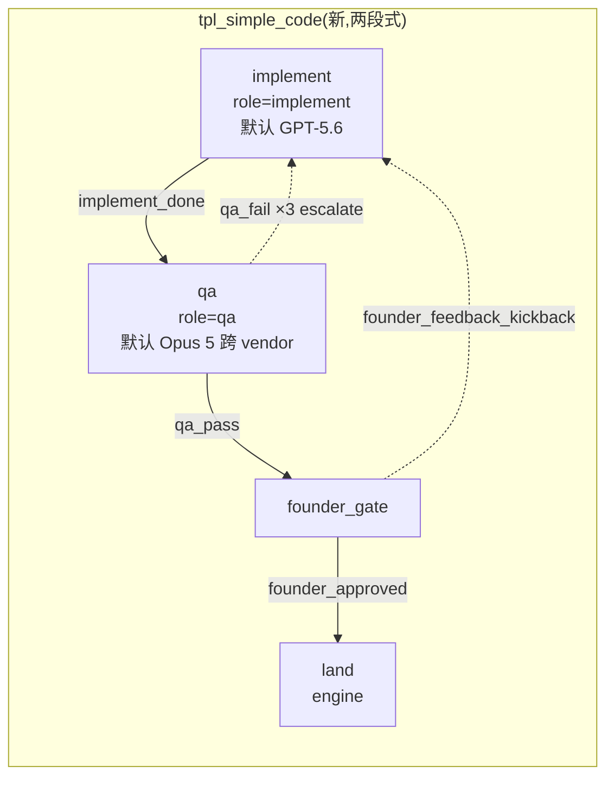
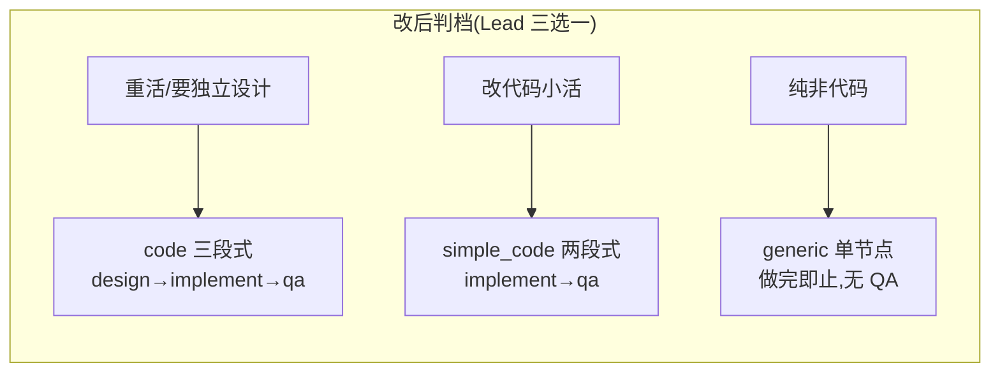

# FLY-1859 「简单代码」两节点流水线 — 实施计划
Issue: FLY-1859 (https://linear.app/geoforge3d/issue/FLY-1859/流程dag-新增简单代码两节点流水线implement-qa让-generic-回归纯非代码工作)
日期: 2026-08-18
基于: 无

## 0. 一句话

新增 menu shape `simple_code`(两个可执行节点 implement → qa,implement 默认 GPT-5.6、qa 默认 Opus 5),让改代码的小活在**一张 issue、一张 ship 卡**里由 DAG 自己完成 QA;同时把 engine-owned run 从 FLY-579 auto-QA(另开 QA·issue)的触发面上摘掉,使 `generic` 回归纯非代码工作 —— **单节点做完即止,不再产生 QA 单**。

## 1. 背景

Annie 2026-08-18 直令(FLY-1830 thread):

> 「generic 是不是不需要开一个独立的 QA 呀?不然还需要你在中间做协调,我觉得怪麻烦的。」
> 「我们还需要一个新的 DAG flow,可能是那种比较简单的 coding……把 design 和 coding 压缩在一条线上,然后可以用 Opus 去做,另外再加一个 QA 节点。」
> 「以后 generic issue 只跑真的那种可能不涉及到代码改动的流程……它也没有必要去跑 QA,真的一个节点做完就行了。」

2026-08-19 ship report 反馈最终订正模型针脚:`simple_code` 的 design + implement 合并节点使用 Codex GPT-5.6,qa 节点使用 Claude Opus 5。此订正取代下文评审阶段曾采用的 Opus → Codex 临时组合,但不改变跨 vendor 不变量。

今晚实例:FLY-1830 / FLY-1852 / FLY-1853 三张改代码小活都跑在 `generic` 上,QA 段全靠 Lead 人工衔接(回灌判据、盯凭据、代投报告),卡与账本分散在两个 issue 上。

## 2. 现状审计事实(设计的物理基础)

以下均为本分支(= main `2df1fd06b`)实读代码得出,带定位:

| # | 事实 | 定位 |
|---|------|------|
| F1 | taskCategory → templateId 的单一真相表只有 5 行:code/prd/design/prototype/generic | `packages/config/src/workflow-menu-contract.ts:8-14` |
| F2 | menu shape 定义在仓库根 `menus/shapes/<shape>.yaml`,Bridge boot 时 `loadWorkflowMenuSeeds()` → `compileWorkflowMenuSeed()` 编译并 `importWorkflowTemplateSeed` 发布 | `packages/teamlead/src/workflow-menu.ts:352-492`,`plugin.ts:4310` |
| F3 | `parseMenuShape` 的形状校验是**硬编码两档**:`shape === "code"` 必须 3 个可执行节点 + max-3 QA loop + unbounded founder loop;**其余所有 shape 必须恰 1 个可执行节点、0 个 loop** | `workflow-menu.ts:316-340` |
| F4 | `compileWorkflowMenuSeed` 的 `ship_claims` 也按 shape 字符串判:`code` → `["qa_passed","founder_approved"]`,其余 → `["founder_approved"]` | `workflow-menu.ts:467-470` |
| F5 | 节点能力由 node-type registry 决定:`implement` 与 `generic` 都带 `creates_pr/can_ship/approval_gate_holder`;`generic` 不是 phase role(`isPhaseRole:false`),`design/implement/qa` 是 | `packages/config/src/node-type-registry.ts:63-168` |
| F6 | engine dispatcher 给节点会话定 session_role:`isWorkflowPhaseRole(node.type) ? node.type : "main"` —— **generic 节点以 `main` 身份跑** | `workflow-engine-dispatcher.ts:2723` |
| F7 | FLY-579 auto-QA 的入口 `onMainAwaitingReview` 只对 `session_role === "main"` 的 awaiting_review 会话生效 → tpl_code 的 implement(role=implement)天然绕过;**tpl_generic_menu 的 execute(role=main)命中 → 另开 `QA·FLY-XX` issue + 独立 QA runner**。这就是今晚「另开 QA 单」的机制根源 | `auto-qa-coordinator.ts:419-427`,`event-route.ts:2916-2943`,`DirectEventSink.ts:1058-1082` |
| F8 | auto-QA 的 policy-off 分支会写 `qa_required=0` 快照(`setQaRequiredSnapshot`),让 ship gate(`evaluateQaShipGate`)豁免而不是 fail-close | `auto-qa-coordinator.ts:524-541` |
| F9 | root 节点起跑分**两条路**:**fresh dispatch 走 runs-route**,role-generic(`isWorkflowPhaseRole(node.type) ? node.type : "main"`)、不查 predecessor、不带 startPoint —— implement 作根在 fresh 路径**今天就能起跑**;**engine dispatcher(retry / crash 恢复 / delivery repair 重派)路径**的豁免谓词才写死了 design:`isRootDesignFirstAttempt = node.type === "design" && attempt === 1 && 无入边`,implement 作根的 attempt-1 恢复重派会抛 `engine_predecessor_unavailable` | `runs-route.ts:3005-3041`,`workflow-engine-dispatcher.ts:2400-2403, 2455-2464` |
| F10 | 生产 `workflow_category_binding` 的 5 行绑定由 FLY-1436 一次性 cutover 写入;`bindWorkflowCategory` 目前**没有任何生产调用方** —— 新 category 的绑定落库没有现成机制 | `workkind-cutover.ts:39-44`,`StateStore.ts:19831` |
| F11 | Lead 判档的系统级文案(canonical taskCategory 表)在 `department-lead-rules.md`;派工经 `POST /api/runs/start`,category 必须在该 Lead 的 adoption(`.flywheel/menus/adoption.yaml`,eng lead 现为 `[code, generic]`)且有 exact binding,否则 400 fail-loud | `lead-rules-base/department-lead-rules.md:178-206`,`runs-route.ts:2215-2320` |
| F12 | schema-v2 manifest 校验器(`validateWorkflowManifest`)是图结构通用的,**没有** design-first 之类的组合硬约束;menu 层的 F3 才是形状闸 | `workflow-template.ts:952-1260` |
| F13 | gemini-agent 的 dispatch 工具 schema 用 `enum: [...WORKFLOW_MENU_SHAPES]` 自动跟表,但 description 文字手工枚举了 5 档 | `packages/gemini-agent/src/tools/schemas.ts:84-101` |
| F14 | FLY-1638 的 `no_code` 终态豁免按 template id 白名单(`tpl_generic`/`tpl_generic_menu`)+ generic 节点类型,与本设计无交集 | `StateStore.ts:34706-34725` |
| F15 | engine 执行的 `qa_result` 事件在 legacy 事件端点被 409 拒收(FLY-1425,`isWorkflowEngineOwnedExecution` 判定),必须走 `/api/workflow/decision` → DAG qa 节点 verdict 与 auto-QA 的 `onQaResult` 路径**结构上不可能碰撞**;且该 engine-owned 判定谓词已存在,Fix 7 直接复用 | `event-route.ts:1155-1166`,`StateStore.ts:27550` |
| F16 | `evaluateQaShipGate`:`qa_required=0` → 干净放行(`qa_not_required`);`NULL` + 真 PR → fail-close 并依赖 **A-1b backfill**(重启对账)与 **A-3 orphan sweep**(重驱 `onMainAwaitingReview`)自愈 —— A-1b 对「policy 开 + 有 PR + 无记录」的会话会回填 `qa_required=1`,且快照**不可变**(`IS NULL` guard) | `flywheel-comm/src/ship-eligibility.ts:232-305`,`auto-qa-coordinator.ts:1903-1990, 2129-2160` |
| F17 | **跨 vendor review 硬不变量(admission + claim 双层)**:带 decision contract 的节点(由 `qa_fail`/`review_fail` loop 派生,`resolveWorkflowDecisionContract` —— simple_code 的 qa 节点必然命中)在 admission 时校验 producer 实际 runtime vendor ≠ 本节点 dispatch vendor,同 vendor → `same_vendor_review` 拒收;claim 层对 `qa_passed` 等 review-class predicate 再拒一次。`opus`/`fable` 均为 vendor claude → **implement=opus → qa=opus 的组合会让 qa 节点 100% 楔死**;tpl_code 活着仅因 implement 默认 codex(且它存在既有暗坑:override implement→fable + qa opus 同样会楔) | `StateStore.ts:27740-27770, 35541-35554`,`workflow-run-snapshot.ts:129-158`,测试锚 `StateStore.generalized-execution.test.ts:375` |
| F18 | Blueprint worktree takeover 谓词不对称:`sessionRole === "implement" || "qa"` 的 takeover **不要求** `startPoint !== undefined`(design 分支显式要求)→ implement 作根、无 startPoint、共享 key 下残留已注册 worktree 时会走 takeover → `reusableHead` 需要 startPoint → `worktree_takeover_failed` 硬失败;root design 同场景则 takeover=false → 干净重建 | `edge-worker/src/Blueprint.ts:1345-1352, 1416-1425, 1460-1476` |

## 3. 设计总览





核心不变量:

1. **QA 拓扑归模板所有**:engine run 有没有 QA,只看模板里有没有 qa 节点。simple_code 有(节点内闭环);generic/prd/design/prototype 没有(做完即止)。
2. **auto-QA(FLY-579)只服务 legacy 非-engine 会话**:engine-owned run 一律不再触发「另开 QA·issue」。
3. **tpl_code 字节不变**(回归红线)。

## 4. 变更清单

### Fix 1 — contract:新增 `simple_code` → `tpl_simple_code`

`packages/config/src/workflow-menu-contract.ts`:`WORKFLOW_MENU_BINDINGS` 增加 `{ taskCategory: "simple_code", templateId: "tpl_simple_code" }`。

下游自动跟表(实证过的消费方):`WORK_KIND_CATEGORIES`(`packages/teamlead/src/work-kind.ts:7`)、`canonicalizeWorkKind` 合法集、runs-route 的 400 legal set、gemini-agent 工具 enum(F13)。

### Fix 2 — 新 shape 文件 `menus/shapes/simple_code.yaml`

```yaml
shape: simple_code
nodes:
  - id: implement
    role: implement
    defaultModel: codex         # Annie 2026-08-19 最终直令:design + implement 合并节点用 GPT-5.6
    models:
      - model: opus
        allowedEfforts: [low, medium, high, max]
        defaultEffort: high
      - model: fable
        allowedEfforts: [low, medium, high, xhigh, max]
        defaultEffort: xhigh
      - model: codex
        allowedEfforts: [low, medium, high, xhigh, max]
        defaultEffort: xhigh
  - id: qa
    role: qa
    defaultModel: opus          # Annie 2026-08-19 最终直令:QA 用 Opus 5;默认 codex→opus 跨 vendor ✓
    models:
      - model: codex
        allowedEfforts: [low, medium, high, xhigh, max]
        defaultEffort: xhigh
      - model: opus
        allowedEfforts: [low, medium, high, max]
        defaultEffort: high
  - id: founder_gate
    type: gate
edges:
  - id: implement_done
    from: implement
    to: qa
    condition: implement_done
  - id: qa_pass
    from: qa
    to: founder_gate
    condition: qa_pass
loops:
  - id: qa_retry
    from: qa
    to: implement
    loopWhen: qa_fail
    exitWhen: qa_pass
    maxIterations: 3
    onLimit: escalate
  - id: founder_rework
    from: founder_gate
    to: implement
    loopWhen: founder_feedback_kickback
    exitWhen: founder_approved
```

**模型组合(F17 的解 = guarded flexibility)**:默认 codex→opus 跨 vendor;可选集保持 implement `[opus, fable, codex]` × qa `[codex, opus]`,坏组合(同 vendor)由 Fix 2b/2c 双守卫在编译期/派发期 fail-loud 拒掉。需要反向组合时,Claude implement(`opus`/`fable`)必须配 Codex qa。**诚实边界**:跨 vendor 不变量是 vendor 级、生产 workflow 只有 claude/codex 两家 —— **codex 整体不可用时,任何带 qa 节点的 shape(含 tpl_code)都不存在合法组合**,这是 F17 的既有代价,不是本单新增的单点;simple_code 与 tpl_code 同命。

编译期自动获得:land 终态节点 + `founder_gate → land (founder_approved)` 边(implement 带 `creates_pr`,`hasPrProducer` 命中,F2/F5);FLY-1772 打回一轮一张新卡、FLY-1655 terminal land 全部复用,零新机制。

### Fix 2b — 编译期跨 vendor 静态断言(护住所有 shape 的默认组合)

`compileWorkflowMenuSeed`:对每个 qa-role 节点,resolve 它与其唯一 producer(入边来源可执行节点)的**默认模型 vendor**,相同 → throw(Bridge boot fail-loud,坏 shape 永远进不了生产)。producer 数为 0 或 >1 时**显式 throw**(不裸取 `[0]` —— parse 层今天保证恰一,防御未来新 shape 绕过时 fail-loud 而非 undefined 行为)。对现有 code.yaml 逐字通过(codex→opus 跨)。这是把 F17 的 admission 时才爆的错前移到 menu 加载时。

### Fix 2c — 派发期 override 组合守卫(顺带闭掉 tpl_code 既有暗坑)

`resolveMenuOverrides`:对 qa-role 节点,校验 override 解析后的 vendor ≠ 其 producer 解析后的 vendor,同 vendor → `WorkflowMenuValidationError("SAME_VENDOR_REVIEW_COMBINATION", …, legal=可跨的模型别名集)`,HTTP 400 fail-loud。`resolveMenuOverrides` 被 runs-route **无条件**调用(无 override 也走)且对全部可执行节点解析 vendor → 守卫天然覆盖 menu 派发的两条 dispatch 解析源(pinned override + live_template)。**覆盖边界**:非 menu 的 custom template 不经此守卫,由 F17 的 admission/claim 双层兜底 —— 那两层是纵深防御,**不可删**。**这是本单对 tpl_code 派发面的唯一行为变化**:今天 override implement→fable(qa=opus 同 claude)会被接受、然后在 qa admission 静默楔死(F17)—— 改后变成派发时 400。把「必然楔死」变「立刻报错」是严格改进,风险面≈零(默认派发字节不变)。

### Fix 3 — `parseMenuShape` 形状校验加 `simple_code` 档(F3)

`workflow-menu.ts:316-340`:在 `code` 分支旁新增显式分支 —— `simple_code` 必须:恰 2 个可执行节点(1 个 role=implement + 1 个 role=qa)、恰 2 个 loop(qa_fail→implement,max 3,escalate;founder_feedback_kickback,unbounded)。其余 shape 维持「1 可执行节点 + 0 loop」不动。

写法上与现有 code 分支同风格(显式 if/else,不抽象出「shape 家族」框架 —— 现在只有 3 档,抽象不值得)。

### Fix 4 — `ship_claims` 按 qa 节点是否存在派生(F4)

`workflow-menu.ts:467-470`:`menu.shape === "code"` 的字符串判改为 `menu.nodes.some((n) => n.role === "qa")` → `["qa_passed","founder_approved"]`,否则 `["founder_approved"]`。对现有 5 个 shape 逐一等价(code 有 qa 节点,其余没有),用快照测试钉住等价性。

### Fix 5 — dispatcher 恢复路径的根节点豁免谓词从 design 泛化到 phase-role(F9)

fresh 起跑**今天就通**(F9 前半:runs-route role-generic)。要修的是 **engine dispatcher 的恢复/重派路径**:

`workflow-engine-dispatcher.ts:2400-2403`:

```ts
// 旧
const isRootDesignFirstAttempt =
    node.type === "design" && intent.attempt === 1 && !edges.some(to === node.id);
// 新
const isRootPhaseFirstAttempt =
    isWorkflowPhaseRole(node.type) && intent.attempt === 1 && !edges.some(to === node.id);
```

语义:任何 phase-role 节点作 DAG 入口(attempt 1、无入边)被 dispatcher 重派(crash 恢复 / delivery repair / retry)时,按构造不可能有 predecessor,`startPoint` 留空 → 从默认分支起跑(与今天 root design 恢复路径同路)。attempt>1(qa_fail 回环、founder 打回)必有 transition predecessor,fail-close 语义不变。tpl_code 的 design 根节点行为逐字不变。

### Fix 5b — Blueprint takeover 谓词对 implement/qa 补 startPoint 要求(F18)

`edge-worker/src/Blueprint.ts:1345-1352`:takeover 谓词中 `implement`/`qa` 分支补上与 design 分支相同的 `ctx.startPoint !== undefined` 条件。对 tpl_code **字节等价**(DAG 中段的 implement/qa 永远带 startPoint);implement 作根、无 startPoint、撞残留 worktree 时落回 `removeIfExists+create` 干净重建(与 root design 同路),不再 `worktree_takeover_failed` 硬死。配残留已注册 worktree 的回归测试。

### Fix 6 — menu 绑定的 boot 幂等 reconcile(F10)

新函数 `reconcileMenuCategoryBindings(store, projects)`(放 `workflow-menu.ts`),在 `plugin.ts:4310-4311` 的 `importWorkflowMenuSeeds(store)` **与 `retireLegacyWorkflowTemplates(store)` 之后**调用(绑定 reconcile 永远看到 retirement 后的世界,顺序不变量干净):

- 对每个 `hasProjectMenuConfig(projectRoot)` 的项目:取 adoption.yaml 全 Lead 采纳 shape 的并集;
- 对每个 shape:若 `getWorkflowCategoryBindingExact(project, shape)` **缺行**,`bindWorkflowCategory({ updatedBy: "system:menu-binding-reconcile" })` 补一行;
- **只补缺,绝不覆盖**已有行(FLY-1436 写的 5 行、任何 custom 绑定原样)。注意 `bindWorkflowCategory` 底层是 **UPSERT**(`ON CONFLICT DO UPDATE`,`StateStore.ts:19858-19868`)——「绝不覆盖」完全靠调用方先做 exact 查缺,这个前提必须用测试钉死(已有行 + 任意 owner → 字节不动);
- 单条失败 log fail-loud,不阻断 boot 其余部分。

这是机制化而非一次性手术:以后再加 shape,merge + 重启即生效,不需要 operator 手工绑。

### Fix 7 — engine-owned run 摘出 auto-QA 触发面(F7/F8;generic 回归本义的机制核心)

**判定谓词复用既有** `store.isWorkflowEngineOwnedExecution(executionId)`(F15,FLY-1425 已在 qa_result 边界用它,activation 绑定 + `engine_owned=1`;FLY-1788 保证 engine fresh/retry 全部铸 activation → 谓词对新 run 完备)。**不新写 helper。**

改两处(同一豁免必须覆盖 live path 和重启对账两个入口,否则 crash 窗口会楔死 engine run,见 F16):

1. **Live path** — `onMainAwaitingReview`:在现有 codex gate + `ensureShipRelevantDiff` **之后**、`resolveQaPolicy` **之前**(与 policy-off 同层):命中 engine-owned → 写 `setQaRequiredSnapshot({ required: 0, reason: "engine_owned_workflow_run" })`(复用 F8 豁免通道,founder gate 不被 fail-close 卡死),log 后 return,**不创建 QA·issue、不 spawn QA runner**。位置放 codex gate 之后 = Codex code review 纪律对 engine 会话原样保留。A-3 orphan sweep 重驱的就是本函数 → 自动收敛到同一豁免,无需另改。
2. **A-1b backfill** — `reconcileOnStartup` 步骤 (0):在「有记录→required=1」分支**之后**、「policy/evidence→exempt」分支之前加 engine-owned 检查 → `required: 0, reason: "backfill:exempt:engine_owned"`(放「有记录」之后 = 在飞 legacy QA 记录沿旧路收敛,与下方部署边界口径自洽)。不加这条,Bridge 在「engine 会话已进 awaiting_review、live path 还没写快照」的窗口重启时,A-1b 会按「code PR 无记录」回填 `qa_required=1`;快照不可变(`IS NULL` guard),live path 的豁免再也写不进去 → ship gate 永远等一条不会来的 auto-QA 记录,run 楔死。
3. **楔死态 fail-loud(部署窗口唯一的静默口)** — live path 的 engine-owned skip 命中时,若发现该会话 `qa_required === 1` **且无任何 auto_qa_record`**(旧代码 codex-held 期间快照为 NULL、又被旧 A-1b 回填成 1 的组合;快照不可变,新代码写不回 0),**不静默 return**:走既有 `alertLeadPipelineError` 通道报 Lead 一条,由 Lead 按现行方式一次性收尾。部署说明附一句排查 SQL(`SELECT sessions.execution_id FROM sessions WHERE qa_required=1 AND status IN ('awaiting_review','approved_to_ship') AND NOT EXISTS (SELECT 1 FROM auto_qa_record WHERE parent_execution_id=sessions.execution_id)` 交叉 engine-owned 谓词;子查询显式限定 `sessions.execution_id`,防未来同名列改义)。

**部署边界(诚实)**:存量已被回填/写成 `qa_required=1` 且已有 auto_qa_record 的在飞 engine 会话**不回改**(快照不可变是既有安全设计)—— 它们沿旧路收敛,新会话走新政。若上线时有个别此类会话,由 Lead 按现行方式收尾一次即清零。

**与 FLY-579 的关系显式定义**(issue 要求):auto-QA 管线整体保留、字节可用,但服务对象收窄为 **legacy 非-engine 会话**(现产线 fresh dispatch 已全走 engine,故其新增触发趋零)。删除 FLY-579 属未来独立清理单,不在本单。

### Fix 8 — 判档:Lead 侧三档标准 + adoption

1. `packages/teamlead/lead-rules-base/department-lead-rules.md` canonical 表加一行,并补选择判据:

| taskCategory | 用于 |
|---|---|
| `code` | 需要独立设计的工程活:架构/跨模块/新机制/高风险改动,design 产物值得 founder 审 |
| `simple_code` | 改代码但方案无需独立设计:小 bug 修复、局部重构、补测试、配置/脚本改动、按既有模式加小功能。implement 直接 TDD,QA 节点独立验证 |
| `generic` | **纯非代码**:调研/盘点/分析/一次性运维。单节点做完即止,不跑 QA |

边界规则(写进同文档):**改代码的活永远不走 generic**(再小也至少 simple_code);code vs simple_code 拿不准 → 取 code(宁重勿漏)。simple_code 的 qa 默认就是 Opus 5,可使用 Claude 工具面;是否升级三段式只由复杂度、风险与独立设计需求决定。

2. `.flywheel/menus/adoption.yaml`:`flywheel-eng-lead: [code, simple_code, generic]`。
3. `.lead/flywheel-eng-lead/identity.md` 派工示例处同步一句 simple_code 提示。
4. `packages/gemini-agent/src/tools/schemas.ts` description 文字补 simple_code 一句(enum 自动跟表,F13)。

### 不改(显式)

- `menus/shapes/code.yaml` 及 `parseMenuShape` code 分支 —— tpl_code 的**派发与 ship 行为**不变(触碰面只有 §5 列出的 Fix 2c 守卫与 Fix 7.2 回填值,均为 fail-loud/更安全方向)。
- FLY-1436 cutover 机器代码零改动,但要**诚实记录后果**:`FLY1436_TARGET_BINDINGS` 是对 `WORKFLOW_MENU_BINDINGS` 的活引用,加第 6 行后 activate 与 restore 两条 preflight(receipt `after` 比对 + `BINDING_TARGET_DRIFT`)都**永久不可满足** —— FLY-1436 视为历史终态,其回滚腿作废,回滚统一走本单 §8 的 revert 路径。committed 测试引用符号本身,不会红。
- `verify-approval` / ship gate / land / FLY-1772 打回机器 —— 模板驱动,零改动复用。
- FLY-1638 `no_code` 白名单(F14)—— implement 节点不走 no_code。
- sub/joycon 等无 menu config 项目 —— menu 域不激活,路径零变化。

## 5. 字节兼容与行为变化清单(诚实边界)

**有意的行为变化**(除新增 shape 外仅两条):

1. engine-owned run 不再触发 auto-QA。覆盖面不止 generic —— **prd/design/prototype 单节点 run 同样不再被挂 QA·issue**。这与「QA 拓扑归模板」不变量一致,也符合 Annie「非代码不用 QA」的原话,但比 issue 字面范围宽,**列为需 review 确认的 A3 假设**(如需只豁免 generic,可在 Fix 7 加 template id 判别,代价是引入第二张白名单)。
2. Fix 2c 的派发期 override 守卫:tpl_code 上「必然在 qa admission 楔死」的同 vendor override 组合(如 implement→fable + qa opus,F17 既有暗坑)从「接受后静默楔死」变为「派发时 400 fail-loud」。默认派发字节不变。
3. Fix 7.2 的 A-1b 回填值:tpl_code 的 engine-owned implement/qa carrier 在重启窗口(`qa_required=NULL`、无记录、有 PR)的回填从 `1` 变 `0`。founder 不可见(tpl_code 的 QA 强制真正落在 engine `ship_claims: qa_passed`,与 base qa gate 无关),且严格更安全(消除 engine carrier 被 base gate 误 park 的可能)——故 §「不改」处的表述收窄为「tpl_code 派发与 ship 行为不变」。

**不变**:legacy 非-engine 会话的 auto-QA 全链路;tpl_code 全行为;无 menu config 项目;`no-qa` label 等既有开关语义。

## 6. 测试计划(实现节点 TDD 红先行)

| 层 | 测什么 |
|---|---|
| workflow-menu.test.ts | simple_code 解析(合法形状过、错节点数/错 loop/缺 qa 角色拒);编译产物快照(land 附加、`ship_claims=["qa_passed","founder_approved"]`);Fix 4 对现有 5 shape 的 ship_claims 逐一回归等价;**Fix 2b 静态断言(同 vendor 默认组合 → menu 加载 throw;code.yaml 通过)**;**Fix 2c override 守卫(同 vendor 组合 400 + legal set;跨 vendor 组合照常)**;既有 pinned-count 断言(如 `workflow-menu.test.ts:636` `opusNodes` 计数)逐条**审读语义后**更新,不盲改数 |
| **qa admission 集成测试** | **真跑到 qa 节点 admission**(不能只测 parse/compile):simple_code 默认组合(codex→opus)admission 通过;人为构造同 vendor snapshot → `same_vendor_review` 拒(锚 F17 双层) |
| dispatcher / 起跑路径 | ① runs-route fresh:implement 作根起跑(role=implement、无 startPoint);② dispatcher 恢复:implement 根 attempt-1 重派不抛 `engine_predecessor_unavailable`;③ attempt 2(qa_fail 回环)仍要求 predecessor fail-close;④ root design 两条路径逐字回归;⑤ **Fix 5b:残留已注册 worktree + implement 根无 startPoint → 落 removeIfExists+create 干净重建(不 takeover 硬死);tpl_code 中段 implement/qa 带 startPoint 的 takeover 行为字节不变** |
| binding reconcile 测试 | 缺行补、已有行(FLY-1436 owner / custom owner)绝不覆盖、模板未发布时 fail-loud 不 crash boot |
| auto-QA 测试 | engine-owned main 会话:不建 QA·issue、写 `qa_required=0` 快照、founder gate 不被卡;**A-1b backfill 对 engine-owned 会话回填 0 而非 1(crash 窗口回归;放「有记录→1」分支之后)**;A-3 sweep 重驱后同样豁免;**楔死态 fail-loud:`qa_required=1` 且无记录的 engine 会话 → `alertLeadPipelineError`,不静默**;非-engine main 会话逐字回归(现 suite);codex gate 顺序不变 |
| rework/kickback 负例 | founder 对 simple_code 卡指定打回目标 "design"(节点不存在)→ 明确 fail-loud,绝不静默落到别的节点(A5 锚) |
| runs-route 测试 | taskCategory=simple_code 走通(adoption + binding 就位);未采纳 Lead 400 `MENU_NOT_ADOPTED_FOR_LEAD` |
| 全仓门 | `pnpm lint` + `pnpm -r build` + `pnpm test:packages:run`(受影响包定向全绿;宿主环境既有例外如实留证) |

## 7. 验收(镜像 issue)

1. 一张真「改代码小活」以 `taskCategory=simple_code` 端到端:**一张 issue、一张 ship 卡、QA 由 qa 节点完成、Lead 零人工衔接**(真机验收属本 DAG 的 QA 节点,不在 design 节点)。运行快照必须显式证明 implement=`gpt-5.6-sol`、qa=`claude-opus-5`,且 Opus qa 节点经 submission credential 提交 qa_pass/qa_fail verdict。
2. 一张纯调研 issue 走 `generic`:**不产生 QA·issue、不产生 QA 节点**,单节点完成 → founder gate。
3. 一张重活走 `code`:三段式行为逐字不变。

## 8. 部署与回滚

- 生效 = merge → 生产 `git pull` + **Bridge 重启**(seed import + binding reconcile 都在 boot;adoption/shape yaml 派发时现读)。
- 回滚 = revert;残留的 `flywheel/simple_code` 绑定行无害(category 不再合法即不可达),可用既有 unbind/retire 机器清理。

## 9. 假设与开放问题(review 重点)

- **A1** 命名沿用 issue 暂名 `simple_code` / `tpl_simple_code`。
- **A2(已被 founder 2026-08-19 最终裁决取代)** implement 默认 codex/xhigh(解析为 `gpt-5.6-sol`),可选 fable/opus;qa 默认 opus/high(解析为 `claude-opus-5`),可选 codex。坏组合由 Fix 2b/2c 双守卫拒,见 Fix 2「guarded flexibility」。opus 行仍保守用 `[low, medium, high, max]` 子集,与 code.yaml qa 行对齐并保持未来 Opus 4.6 绑定兼容。
- **A3** engine-owned auto-QA 豁免覆盖 prd/design/prototype(见 §5)。
- **A4** 绑定 seeding 走 boot reconcile(Fix 6)而非 operator 手术 —— 机制化换未来零手工。
- **A5** founder 打回(FLY-1772)对 simple_code 的合法目标 = implement/qa(无 design 节点);打回路由按既有「按实际节点解析」行为,不另加码;负例测试(指定 "design" → fail-loud)已列入 §6。

## 10. 评审记录(设计评审收口证据)

按 Tadashi 轮级政策(Codex 今晚全号打满、Gemini 免费层停服):设计评审以**独立上下文 Claude 交叉评审**收口,Antigravity(agy)作第二意见,不记 codex 补审 pending。

| 轮次 | 评审者 | 结论 | 要点 |
|---|---|---|---|
| R1 | Antigravity(agy 1.0.12,真 auth) | APPROVED | 无 blocking;确认 A3 机制与 Fix 5/6/7 定位(注:未发现 F17,见下) |
| R1 | Claude 独立上下文交叉评审 | CHANGES REQUESTED | **1 HIGH**(F17 same_vendor_review 双层不变量,当时的默认 opus→opus 必楔死)+ 4 MED(Blueprint takeover 不对称 / F9 双路径 / FLY-1436 restore 腿 / 部署窗口楔死态)+ 5 LOW。10 条全采纳,关键声称经本 Runner 亲手复核原文属实 |
| R2 | Claude 独立上下文交叉评审 | **APPROVED** | R1 全部闭合经代码级复核确认(含主动追验 `resolveNodeDispatchAtLaunch` 两条 dispatch 解析源均在守卫覆盖内、Fix 5b 三个到达面枚举、FLY-1643 `4857d999e` 在 HEAD);新增 1 MED(codex 韧性/首例 verdict 提交者,已按 guarded-flexibility 折入 Fix 2 + §7 验收点名)+ 4 LOW 文档修正(已全部折入);明示无需 R3 |

R2 后的 founder ship feedback 将默认针脚由评审时的 Opus → Codex 对调为最终的 GPT-5.6 → Opus 5;双守卫与跨 vendor 结论继续成立。
