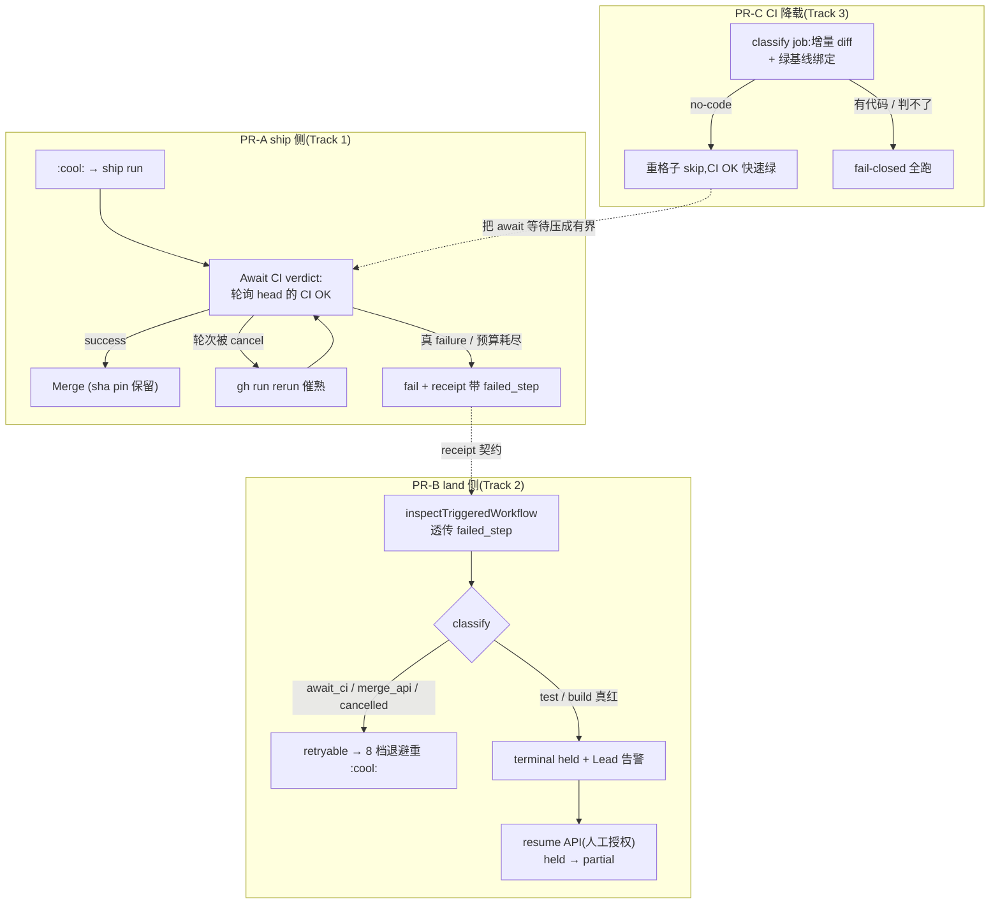

# FLY-1861 CI cancel 掐掉落地轮次 + land held 死角 — 探索

Issue: FLY-1861 (https://linear.app/geoforge3d/issue/FLY-1861/infraci-落地期间-runner-推台账-commit-掐掉在跑的-cicancel-in-progress-ship-merge)
日期: 2026-08-18
基于: 无(本文件夹首篇;上游输入 = issue 正文 Tadashi 取证 + FLY-1866 调查报告 `product/doc/FLY-1866-actions-cost-investigation/plan.md`)

---

## 1. 问题是什么(一句话)

落地在飞时同分支的任何新推送(台账 / QA 报告 / 文档)都会重置该分支的 CI 时钟(`cancel-in-progress` 掐掉在跑轮次),而 ship 的 Merge 步在自己的固定时刻拿 branch protection 撞运气;撞上「head 的 `CI OK` 还没有 success 结论」就 405,land_operation 被判成 **永久无出口的 held** —— 2.2 批次因此停摆,全舱普查有 18 张同类 held。

## 2. 本节点补全的实证(在 issue 取证之上)

issue 的因果链方向正确,但「ship 的 Merge 步看到非绿」这一环有更精确的形态,直接决定修法。本节点用 `gh` 拉了两张事故 PR 的真实 ship run 日志与 ci.yml 轮次:

### 2.1 Merge 失败的确切形态:405 "Required status check \"CI OK\" is expected."

两张事故单的 ship run(`ship-on-comment.yml`)里 **build/typecheck/lint/test 全绿**,失败的只有 Merge PR 步,错误一字不差:

```
RequestError [HttpError]: Required status check "CI OK" is expected.
status: 405   (POST /repos/xrliAnnie/flywheel/pulls/{871,868}/merge)
```

- 不是 `sha:` pin 的 409 "Head branch was modified"(merge 时刻 head == approved_head,pin 没拦);
- 是 **branch protection 的 required check `CI OK`** 在 head 上**缺少 success 结论**(实测 `enforce_admins: true`,连 admin 都绕不过);
- "is expected" = 该 check 在 merge 时刻**在跑或缺席**,不是「红了」。

### 2.2 两个独立时钟:ship run 与 ci.yml 轮次各跑各的

| | push→CI 轮起跑 | :cool: → ship run | ship Merge 时刻 | head 的 CI 轮终态 |
|---|---|---|---|---|
| #868 (head `4f773ae5`) | 00:38:34 | 00:53:46 | **01:16:20 → 405** | **01:31:27 success** |
| #871 (head `88ca1180`) | 00:46:04 | 01:02:35 | **01:22:15 → 405** | 02:05:17 failure(unit job 15m timeout) |

**#868 是最扎心的一张**:merge 失败仅 **15 分钟后** head 的 CI 就绿了,但 land 已判 held(terminal),没有任何机制会再看一眼。#871 则叠加了第二种病(FLY-889/1233 家族的 job timeout),head 的轮次最终真的 failure —— 两张卡死的表象相同、可自愈性完全不同,而现在的 land 侧一律 `ship_workflow_failed:failure` → held。

### 2.3 cancel-in-progress 的真实伤害方式

被 `cancel-in-progress` 掐掉的轮次属于**旧 head**(新 push 才触发 cancel,新 push 自带新轮)。它的伤害不是「让当前 head 非绿」,而是:

1. **每次推送把「head 拿到 CI OK success 的时刻」向后重置 15–50 分钟**(推送风暴下无上界;#871 从 20:53 到 21:30 连续三轮才第一次绿);
2. ship run 是 push 之外另起的时钟(:cool: 起 ~20 分钟),**两个时钟没有任何同步**,ship 先到 merge 点就 405;
3. 405 之后 ship run 发 `status=failure` receipt,land executor 读 receipt 判 `ship_workflow_failed:failure` → **terminal held**,循环闭死。

### 2.4 held 无出口(当前 main 逐处复核)

`StateStore.ts` 全部 9 处 `UPDATE land_operation` 守卫逐处读过(行号相对 issue 有漂移,结论不变):认领只收 `intent` / 到期 `partial` / 过期 `running`;两处失败写回只收 `running`;retry-runnable 只收 `partial`;`completed` 收尾只收 `completed`。**`held` 不在任何可推进集合里。** `POST /api/lifecycle/land` 的 202 假出口同步核实:`INSERT OR IGNORE` + `UNIQUE(project_name, issue_id, pr_number, approved_head)` ⇒ 同 head 重发命中旧行,一个字段不改。

### 2.5 生产存量(2026-08-18 只读普查 `~/.flywheel/teamlead.db`)

held 共 **18 张**,分三层,可自愈性不同:

| last_error | 张数 | 性质 |
|---|---:|---|
| `ship_workflow_failed:failure` | **12** | 本单主治。其中相当一部分是 #868 型(CI 后来绿了/PR 后来被人工 merge) |
| `pr_head_mismatch` | 5 | 同源近亲:批准后 head 又动了。出口是 founder 对新 head 重批(FLY-1772 kickback),**不是**本单的 retry |
| `linear_lookup_failed_retryable` | 1 | FLY-1751,FLY-1770 已裁定保留 forensic 账据,不动 |

## 3. 要解决的三个子问题

1. **ship 侧正确性**(验收 1):Merge 结果不能由「被顶掉/还在跑的轮次」决定 —— ship 应该认「当前 head 最新一轮 CI 的最终结论」,等它、必要时催它,而不是在固定时刻撞一次。
2. **land 侧出口**(验收 2):`ship_workflow_failed` 一刀切 terminal 是错的 —— #868 型(环境性,retry 即愈)与「测试真红」(代码性,retry 只烧钱)必须分开;并且 held 作为一个状态必须有**授权的人工收敛正路**,否则同类故障永远只能 founder 重批 + 重派。
3. **CI 降载**(FLY-1866 提案 A 并入):无代码变更的推送不烧 6 个重格子($207/月是全部候选都命中时的机会收益上限,不是实收),且**顺带把子问题 1 的等待时间上界压下来**(台账推送秒绿,不再重置 20 分钟时钟)。QA 后续实测把「仅修 run-list 分页」的增量订正为 11/328≈3.4%、约 $8/月,见 research §10。

## 4. 方案空间与取舍

### 4.1 ship 侧(子问题 1)

| 选项 | 内容 | 判定 |
|---|---|---|
| **S1(选)** | Merge 前加 **Await CI verdict** 步:轮询 head 的 `CI OK` → success 才 merge;in-progress 等;该 head 轮次被 cancel(顶掉/超时)则 `gh run rerun` 催熟再等;真 failure 才 fail。同时按 FLY-1866-B **砍掉 ship 自己重跑的 20 分钟测试**(matrix 覆盖 22 包已由守卫确认,零覆盖损失;ship 时钟 20min→~1min,腾出等待预算) | ✅ 一张 diff 同时拿到验收 1 + 1866-B 的 $25/月 + ship 循环提速 |
| S2 | 保留 ship 自跑测试,仅追加 await 步 | 可行但 ship 时长 20min+等待 ≈ 顶穿 30min timeout,要么提 timeout 要么放弃;且 $25/月 白丢。作为 S1 的降级备选 |
| S3 | ship 测试绿后自己往 head 盖 `CI OK` status 章 | ❌ ship 不跑 shell 套件与 payload 格子(占 CI 24.6%+),盖章=绕过覆盖,fail-open |
| S4 | 关掉 `cancel-in-progress` | ❌ 验收 3 明令保留;cancelled 计费($50/32d)恰是省钱机制在工作 |
| S5 | 落地窗口禁止 runner 推送(pre-push guard 查 active land_operation) | ❌ 与「QA 收工前 git status 必须为空」铁律死锁(QA 报告必须 push);治标 —— 推送不该致命,而不是消灭推送。列为 rejected |

S1 的边界:await 期间 head 又变(真的又推了)→ fail with `head_moved`,land 下一 tick 判 `pr_head_mismatch` —— 那是「批准绑定」哲学(head 变必须重批),**本单不动它**。

### 4.2 land 侧(子问题 2)

| 选项 | 内容 | 判定 |
|---|---|---|
| **L1(选)** | ship receipt 增加 `failed_step` 字段(Report failure 步读 `steps.*.conclusion` 写入);`inspectTriggeredWorkflow` 透传;`classifyLandRetryReason` 按 step 分类:`await_ci` / `merge_api` / ship run 自身 cancelled → **retryable**(既有 8 档退避);`test|build|typecheck|lint` → terminal;**旧 receipt 无 failed_step → 维持 terminal(保守,字节兼容)** | ✅ #868 型自愈;真红仍然停下来叫人 |
| **L2(选,与 L1 并行)** | held 授权收敛出口:`POST /api/lifecycle/land/:operationId/resume`(master token + 审计),校验 `state='held'` ∧ PR 未 closed ∧ approved_head == 当前 head → 原子 `held→partial`(next_attempt_at=now)。**这是 held 的第一条合法出路**,也是 12 张存量的捞法(PR 已被人工 merge 的,resume 后 executor 自然走 finalization 收尾,补 Linear Done + 归档) | ✅ 不与 FLY-1655「held=需要人看」冲突 —— resume 就是人看完之后的动作 |
| L3 | 把 `ship_workflow_failed` 一律改 retryable | ❌ 真红也重试 = 每张多烧 8 轮 ship;exhausted 后还是 held,没解决出口 |
| L4 | 只做一次性 closeout 手术脚本捞 18 张 | ❌ 「同类故障仍只能人工捞」原样保留;脚本是 L2 的子集,不如直接给正路 |
| 配套 | `release→held` 时给 Lead 发 mailbox 告警(带 operation_id + resume 指引),held 从沉默死角变有人接的工单 | ✅ 轻量,随 L2 |

### 4.3 CI 降载(子问题 3,FLY-1866-A 严格版)

1866 的 v3 已把门槛说透:workflow 级 `paths:` 做不到(`CI OK` 永远 pending 卡死 PR);必须是 **classify job + 重格子条件化 + `ci-ok` 聚合门改造**,并且要动 `ci-structure.test.sh` 三处钉死(job 集合 / no-needs / 聚合正则)—— 这是治理决定,本设计文档 + design review + founder 批准就是那场「显式讨论」。

**本节点在 1866 之上补的一个 fail-open 坑**:增量口径判「本次推送无代码」→ skip 重格子 → `CI OK` success —— 但如果**被这次推送顶掉的那轮(含代码)还没跑绿**,代码就从未被完整测过,head 却拿到了绿章。所以 no-code skip 必须**绑定绿基线**:

> skip 成立 ⟺ 本推送增量(event `before..after`)命中严格 allowlist **且** 同 PR 最近一个完成轮次的 `CI OK` = success。拿不到增量 / 找不到绿基线 → fail-closed 全跑。

allowlist 采用 1866 的严格版:`doc/**`、`product/doc/**`、`engineering/doc/**`、`content/doc/**`、`**/progress.md` —— 本仓 60+ 个 `.md` 是运行时生产输入(`lead-rules-base/`、`prompts/`、`.flywheel/agents/` 等),**不放行**。

它对子问题 1 的增益:有了它,台账推送的新轮 ~3 分钟即绿(quick-gate + classify),S1 的 await 等待有界;没有它,推送风暴下 await 可能反复被重置顶穿预算。**这就是「一张 diff 两个验收都要过」的机制原因。**

## 5. 推荐方案(S1 + L1 + L2 + 4.3,三个 PR 串行)



依赖关系:PR-A 先(receipt 产生方),PR-B 随后(消费方,对旧 receipt 字节兼容),PR-C 独立可并行;存量 12 张在 PR-B 部署后用 resume API 逐张捞(运维动作,附 runbook)。

## 6. 与已有单的边界(照 issue 要求划死)

- **FLY-889/1233(job 超时被 cancel)**:两种 cancelled 的判据表照抄 issue 写进 plan;本单**不修** timeout 贴边(那是 FLY-1863/C 候选的地盘),但 S1 的 rerun 催熟对 timeout 抖动型 cancelled **顺带有效**(rerun 可能过)。
- **FLY-1866**:提案 A 并入本单(§4.3);提案 B 并入 S1;C/D/E/F/G/H 不在本单。
- **FLY-1772 / pr_head_mismatch**:5 张 mismatch held 的出口是对新 head 重批,不走本单 resume(resume 的 head 校验会挡住它们,fail-closed)。
- **FLY-1655 terminal land 哲学**:held 仍是「需要人看」的状态;本单给的是「看完之后的合法动作」+ 「不该进 held 的不再进」。

## 7. 尚未收敛、留给 research/plan 的问题

1. `gh run rerun` 对 cancelled 轮的语义细节(能否 rerun 整轮 / --failed 只重跑挂的 job;对 `concurrency` 的再次竞争)。
2. Await 步的预算数值(CI 轮 p95 时长 vs ship job `timeout-minutes`)。
3. `ci-structure.test.sh` / `ship-merge-token.test.sh` 具体要改哪些钉(逐条列出,治理透明)。
4. resume API 的权威形态(master token vs founder-consent 通道)与审计落点。
5. classify job 的 `before..after` 在 force-push / opened / 非线性历史下的 fail-closed 细则。
