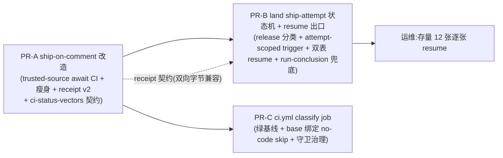

# FLY-1861 CI cancel 掐掉落地轮次 + land held 死角 — 实施计划

Issue: FLY-1861 (https://linear.app/geoforge3d/issue/FLY-1861/infraci-落地期间-runner-推台账-commit-掐掉在跑的-cicancel-in-progress-ship-merge)
日期: 2026-08-18
基于: research.md

**Version**: v1.58.0(暂定,ship 取空号)
**Status**: **codex-approved**(2026-08-18,xhigh,6 轮:R1 7 项 → R2 6 项 → R3 4 项 → R4 4 项 → R5 2 项 → R6 APPROVED;R1 两处按威胁模型收窄见 §8 rejected,其余全部折入)

---

## 0. 一句话

ship 的 Merge 从「固定时刻撞一次 branch protection」改成「等到 head 当前轮次的真结论」(等待 + 催熟被 cancel 的轮);land 侧把 ship 失败按失败步骤分类(环境性 → 带独立 ship-attempt 语义的退避自愈,真红 → held + 告警),held 获得恢复 workflow authority 的授权 resume 正路;CI 加 classify job 让无代码推送不烧重格子(绿基线 + base 绑定,fail-closed)—— 同时拿到 FLY-1866 提案 A 与 B。

## 1. 目标 / 非目标

**目标**:
- G1 落地在飞时同分支的台账/文档推送不再让 ship Merge 判非绿(验收 1)。
- G2 held 有可达收敛路径:环境性失败自动退避重试 —— 每次 due retry **恰好推进一个新 ship attempt**;外部 `:cool:` 触发是 **at-least-once,无固定重复总上限**(R3-#2 的诚实口径:GitHub comment POST 与本地 receipt 无共享事务,重复次数与 ambiguous crash re-entry 次数成正比、由 running lease 周期限速;**exact-head PR-state 复查保证的是安全收敛,不是数量** —— land-executor.ts:479 既有语义);真 held 有授权 resume(**连同 engine authority 一起恢复,并开启新预算**);存量 12 张可捞(验收 2)。
- G3 `cancel-in-progress` 原样保留(验收 3)。
- G4 无代码推送不跑重格子(7 个 runner executions:5 个 unit matrix cell + script-tests + payload);ship 不再重跑 20 分钟测试(FLY-1866-A/B)。

**非目标**:不修 unit job 15m timeout 贴边(FLY-889/1233/1863);不动 `pr_head_mismatch` 语义(FLY-1772 重批正路);不动 FLY-1751 forensic held;不做 FLY-1866 C-H;不把 classify 升级为安全边界(§8)。

## 2. PR 拆分与依赖



真实依赖是 **A→B 且 A→C**(R4-#3):`scripts/ci-status-vectors.json` 由 PR-A 引入,B 的 Bridge parser 与 C 的 classify parser 测试都消费它 —— **A 是 shared-contract prerequisite**。Revert 矩阵:revert A 的 workflow 行为时**保留 vectors 文件**(revert 说明里写死);B/C 单独 revert 无约束。三个 consumer 的测试各自断言 **vectors 全量被消费**(计数,防新增 case 被漏读)。A 上生产而 B 未上的窗口 = 现状,不更坏。

## 3. PR-A:ship-on-comment 改造

### 3.1 信任边界(R1-#5 的形态决定)

ship 砍掉自跑测试后,**job 不再需要执行任何 PR-head 内容**:`issue_comment` workflow 定义本来就从 default branch 加载(平台语义);checkout 改为**默认分支**(去掉 `ref: head_sha`)只为取 `scripts/ship-await-ci.sh` —— await 脚本永远来自 trusted main,job 内不存在「PR 控制的代码在高权 token 环境里执行」的路径(现状反而存在:`pnpm test` 执行 PR-head 任意代码)。SHIP_PAT merge 步维持 FLY-1701 合同原样,不需要拆双 job。

### 3.2 改动清单

| 文件 | 改动 |
|---|---|
| `.github/workflows/ship-on-comment.yml` | ① `permissions` 加 `actions: write`(rerun)。② checkout 去 `ref:`(默认分支,见 3.1)并**加稳定 `id: checkout`**(R5-#1:Report-failure 要读它的 outcome,现在没有 id 引用不了);删 setup-node/pnpm/install/better-sqlite3/Build/Typecheck/Lint/Test 步(FLY-1866-B)。③ Merge 前插 `id: await-ci` 步:`bash scripts/ship-await-ci.sh`,env `GH_TOKEN: ${{ github.token }}` + `PR_NUMBER`/`HEAD_SHA`/`AWAIT_BUDGET_SECONDS=1500`/`POLL_SECONDS=30`。④ Merge 步(`id: merge-pr`)script 内 try/catch:失败时把 HTTP status + message 写 `outputs.merge_error`(SHIP_PAT 表达式与 `pulls.merge` 调用保持同步同 step,T1/T2 合同不动),再 rethrow。⑤ Report failure 步 receipt 增加 `failed_step`(3.4);**各步 outcome、await output、merge_error 全部经 step `env` 传入,inline script 只读 `process.env`**(R5-#1:Actions expression 是执行前文本展开,`merge_error` 含 GitHub 返回的 message,内插 JS 源码时引号/反引号/换行会让 Report-failure 自己 SyntaxError/injection —— github-script 官方 inputs 合同就是 env 传参)。⑥ `timeout-minutes: 30` 保持。 |
| `scripts/ship-await-ci.sh` | 新脚本(3.3);每个 `gh` 调用套命令级 timeout(`timeout 60 gh …`),单次失败不崩溃、继续轮询(fail-closed 到预算)。失败路径先写 `outcome=<x>` 进 `$GITHUB_OUTPUT` 再非零退出。 |
| `scripts/ci-status-vectors.json` | status/conclusion 共享 test-vector contract(R3-#4;三个 runtime parser 共用,PR-A 先引入 —— **A 因此是 B/C 的 shared-contract prerequisite**,见 §2)。**merge-error→failed_step 映射不走 require**:R4-#1 —— `pr-info`/checkout 失败时 Report-failure 仍会跑(`if: failure()`)而 checkout 被 skip,无文件可 require ⇒ 映射作为**不依赖工作区的 inline 逻辑**写在 Report-failure script 里:先按 `steps.*.outcome` 判 `preflight`/checkout 失败,仅 merge-pr 失败时按其 `outputs.merge_error` 细分。 |
| `scripts/__tests__/ship-await-ci.test.sh` | 新 harness(PATH shim mock gh),接入 ci.yml + FLY-1759 枚举守卫更新;await parser 跑 vectors 全表。 |
| `scripts/__tests__/ship-merge-token.test.sh` | 不改,必须继续绿(T1-T3)。 |

### 3.3 `ship-await-ci.sh` 状态机(R1-#6 修订:exact-head + latest-run 判据,放弃「原因唯一性」论证)

每 `POLL_SECONDS` 一轮,到预算为止:

1. head 校验:`gh pr view --json headRefOid,state` —— head ≠ `HEAD_SHA` ⇒ `outcome=head_moved` exit 1;非 OPEN ⇒ `outcome=pr_not_open` exit 1。
2. 查 `HEAD_SHA` 的 `CI OK` check-run(exact-head,取最新):`success` ⇒ exit 0;check 尚无 conclusion ⇒ 继续等。
3. 非 success:查**该 exact head 的 ci.yml runs 全集**(`gh run list --workflow=ci.yml --commit $HEAD_SHA`),按 R2-#4 的 **closed mapping**:
   - 存在任何 `status !== completed` 的 run(涵盖 queued/in_progress/**requested/waiting/pending** 及未来未知 status)⇒ 继续等(不 rerun、不判死);
   - 全部 completed:取最新 run 的 conclusion —— `failure` ⇒ `outcome=ci_failure` exit 1(**真红零 rerun**);`cancelled | timed_out | startup_failure | stale` 且本 ship attempt 尚未 rerun 过 ⇒ `gh run rerun <latest-id>`(**至多一次**,先落 marker 再 rerun),继续等;已 rerun 过或其余 conclusion(`action_required | neutral | skipped` | 未知值)⇒ 继续等到预算(fail-closed 到 `await_ci_timeout`,不猜语义)。
4. 预算耗尽 ⇒ `outcome=await_ci_timeout` exit 1。

status/conclusion 语义跨三个运行边界(await bash / Bridge TS / classify bash)无法 import 同一函数 —— 共享形态是**一份 JSON test-vector contract**(`scripts/ci-status-vectors.json`,R3-#4):每个 runtime 的 parser 各自消费同一 vectors 跑表,**PR-A 先引入**(保证 PR 顺序成立)。另:merge 步的 `merge_error → failed_step` 映射是 Report-failure script 内的 **inline 纯逻辑**(R4-#1,不依赖工作区)。**producer policy test = 新文件 `scripts/__tests__/ship-report-failure.test.sh`**(进 FLY-1759 CI 枚举;R5-#1 点名交付归属):解析 yml 的 **`env` wiring**(不是注入不存在的 JS `steps` 对象)后以 mock env 执行 Report-failure script,覆盖 required-check 405 / other 405 / 409 / 无 status 四类映射、**pr-info 失败 / checkout 失败 / await 失败 / merge 失败四条路径都产出 terminal receipt**,以及 **merge message 含双引号 / 反引号 / 换行的注入负例**(script 不得二次失败)。

安全性来源(按 R1-#6 的口径陈述):exact-head 过滤 + latest-run 选择 + one-rerun 上限 + **Merge 前仍要求 `CI OK`=success**(rerun 选错轮最多浪费一次 rerun,永远不会错放 merge)。`gh run rerun` 沿用原 run 的 SHA/REF/actor 权限 —— 写入测试与风险表。

### 3.4 receipt 契约 v2(双向字节兼容)

```
<!-- flywheel-ship-receipt trigger_comment_id=… run_id=… run_url=… head=… status=failure failed_step=<v> -->
```

`failed_step` ∈ `await_ci_timeout | ci_failure | head_moved | pr_not_open | merge_405_required_check | merge_405_other | merge_409_head | merge_403 | merge_422 | merge_other | preflight`。Report failure 判定:`steps.await-ci` 失败 → 其 `outputs.outcome`;`steps.merge-pr` 失败 → 按 `outputs.merge_error` 细分 —— **`merge_405_required_check` 要求 status=405 且 message 匹配已实测的 `Required status check "…" is expected.` 形状**(R2-#6:GitHub 的 405 只承诺 "merge cannot be performed",draft/review/ruleset 拒绝同样走 405,只有 required-check 这个 message 才是可自愈的那种);其余 405 → `merge_405_other`;更早失败 → `preflight`。
**已知缺口(R1-#5,本 PR 不假装能修)**:Report failure 是 `if: failure()`,ship run 被手动 cancel / job timeout 时**不产生 terminal receipt** —— 现状即如此(land 永久 pending)。closed mapping 由 PR-B 的 **receiver 兜底**(4.3)完成;PR-A 只保证「凡 Report failure 跑了,receipt 必带 failed_step」。

### 3.5 TDD 清单(PR-A)

`ship-await-ci.test.sh`:① success 即返;② in_progress→success;③ cancelled→恰一次 rerun→success;④ rerun 后同 head 再 cancelled→不再 rerun→timeout;⑤ failure→`ci_failure` 且零 rerun;⑥ 存在更新 in-progress run 时不 rerun 旧 cancelled;⑦ head 变→`head_moved`;⑧ 预算耗尽→`await_ci_timeout`;⑨ 单次 gh 失败(网络)→继续轮询;⑩ 每条失败路径 `$GITHUB_OUTPUT` 先落 outcome;⑪ gh 挂起被命令级 timeout 切断。结构:`ship-merge-token.test.sh` 回归绿;枚举守卫更新。真机验收 → §6。

## 4. PR-B:land 侧 ship-attempt 状态机 + resume 出口

### 4.1 retry 必须真的重发 `:cool:`(R1-#1,本 PR 最核心的机制修正)

R1 证实三个断点:(a) `land-executor.ts:495` 的 release 调用点硬编码 `"held"`,classify 根本不被咨询;(b) `cool_triggered` step receipt 受 `PRIMARY KEY(operation_id, step)` 不可变,状态即使回 partial,重入也复用旧 trigger、永不再发 `:cool:`;(c) `retry_epoch_key` 由 `${stepCount}:${current_step}` 生成,step 集合一变 retry_count 就被重置,8 档上限失效。修法(一体设计):

- **显式 ship attempt 指针**:`land_operation` 增列 `ship_attempt INTEGER NOT NULL DEFAULT 0` 与 `resume_generation INTEGER NOT NULL DEFAULT 0`(幂等 ADD COLUMN)。trigger receipt 键改为 `cool_triggered:attempt=<ship_attempt>`;**attempt=0 读取时 fallback 旧字面键 `cool_triggered`**(Bridge 升级瞬间 in-flight 旧行不重发;attempt>0 只用新键 —— 存量 held 行 resume 后 attempt≥1,旧失败 receipt 自然废弃,R2-#2 的「存量原地回 held」由此关死)。**新 due retry 前先 `ship_attempt+1`**(与状态写回同事务)。`inspectTriggeredWorkflow` 按当前 attempt 的 triggerCommentId 过滤。
- **外部触发的诚实合同(R2-#1 + R3-#2)**:`triggerCool`(GitHub comment POST)与本地 receipt 落账没有共享事务 —— comment 成功、`recordStep` 未提交的 crash window 下,同 attempt 重入会再发一次 `:cool:`;反复在同一 window 崩溃则反复重发(expired-lease reclaim 路径不走 release、不推进计数,StateStore:45552/45624)。**不引入 durable-intent/comment 收养/circuit-breaker**;合同如实陈述:**重复次数与 ambiguous re-entry 次数成正比,由 running lease 周期限速,无固定总上限;exact-head PR-state 复查保证安全收敛而非数量**(后到 run 的 merge 撞 already-merged → 其失败 receipt 被 exact-head PR state 复查压掉,`land-executor.ts:479` 既有)。测试(R3-#2 点名):**连续注入两次 post-成功-crash**,第三次成功落 receipt 后停止重发;并覆盖「未记录的早期 run 先 merge」与「已记录的后期 run 先 merge」两种收敛次序。
- **release 调用点改为按分类决定去向**:workflow-failed 分支不再硬编码 `"held"`,改为 `classifyLandRetryReason(reason)` → terminal ⇒ held;retryable ⇒ `nextLandRetry` 退避写回 partial + next_attempt_at。
- **logical epoch(带预算代)**:ship 类 reason 的 `retry_epoch_key` = `ship:<pr_number>:<approved_head>:budget=<resume_generation>` —— 自动 retries 内稳定(与 step count 解耦,R1-#1),**只在人工 resume 时随 generation 前进**(第二轮人工预算的 exhaust 告警/事件不与第一轮撞键,R2-#2)。预算口径**对齐既有 `nextLandRetry` 语义**(R2-#6):初始失败 + 8 次 scheduled retries,**第 9 次失败 exhaust**(retryCount=9,既有测试断言原样保留)。非 ship 类 reason 的 epoch 生成不动(字节兼容 sentinel)。
- 分类表:

| receipt | 分类 |
|---|---|
| `step=await_ci_timeout` / `merge_405_required_check` | retryable |
| ship run 自身 cancelled(receiver 兜底判定,4.3) | retryable |
| `step=ci_failure` | terminal(真红) |
| `step=head_moved` / `pr_not_open` / `preflight` / `merge_405_other` / `merge_409_head` / `merge_403` / `merge_422` / `merge_other` | terminal(已知值显式列出,R4-#4) |
| 未知 `failed_step` 值 | terminal(fail-closed 兜底;**producer enum ↔ consumer 表的 exhaustive sentinel 测试**钉住两侧一致,新增枚举必须两侧同改) |
| 无 `failed_step`(旧 receipt) | terminal(= 现状,字节兼容) |

### 4.2 resume 出口:operation + workflow authority 一个事务(R1-#2)

R1 证实单表 CAS 不够:engine-owned land 进 held 时 `holdWorkflowLandNode` 连 `workflow_run.status` 一起置 held(`workflow-engine-dispatcher.ts:2070-2088` / `StateStore.ts:46105`),而 executor authorization 要求 run 仍 active(`land-executor.ts:158-175`)—— 只救 operation 行,kick 后 `land_target_not_current` 又 held。R2 进一步纠正 schema 事实:关联列名是 **`run_id`**(StateStore:17828,不是 `workflow_run_id`);`holdWorkflowLandNode` **只改 `workflow_run.status`,node 行不动** —— resume 不得发明 node `held→active` 转换。修法:

- StateStore 新方法 `resumeHeldLandOperation({operationId, actor, reason, now, expectedPrDisposition, expectedHeadSha})`(后两参由 executor 在 `inspectPr` 后提交 —— DB 内没有足够信息区分 OPEN/MERGED,R3-#1;executor 在事务后仍会按既有流程再查 GitHub state,TOCTOU 由 exact-head 复查兜住)**单事务**完成:① CAS `land_operation` `held→partial`(next_attempt_at=now;`retry_count=0, retry_epoch_key=NULL` = 人工授权开启新预算,旧值与旧 last_error 全部记入 receipt);**每一次成功 resume 都 `resume_generation+1`**(R3-#1:MERGED operation 的 post-ship finalization 也会再 held —— `land-executor.ts:582-600` / `post-ship-finalization.ts:743` —— 第二次 resume 的审计/hold-event/告警身份必须是新一代);**仅 `expectedPrDisposition='open'`(exact-head)额外 `ship_attempt+1`**(MERGED 不推进 attempt);② 若 `run_id IS NOT NULL`:校验 run 为 engine_owned、`status='held'`、`current_node_id`/node 的 exact attempt/execution、最新 dispatch ledger 身份与 approval/PR binding 仍指向本 operation —— 全部通过才把 **`workflow_run.status` `held→active`**(node/side-effect ledger 保持原样,留给 dispatcher 正常 reconcile);任何不符 ⇒ 整个事务回滚 `resume_refused:<why>`;`run_id IS NULL`(legacy)⇒ 只走 ①;③ 落审计 receipt,键 `resume_authorized:<resume_generation>`。
- **重复 held 与告警的身份键也带 generation**(R2-#2):`holdWorkflowLandNode` 的 hold-event 去重键(StateStore:46060 命中旧 event 直接 return,不再把刚 resume 的 run 改回 held)与 §4.4 outbox 键都并入 `resume_generation` —— 新一代的再次 held / 再次 exhaust 各自恰好一条。
- executor 侧 `resumeHeld(operationId)`(route 只 submit):先 `inspectPr` —— `MERGED` ⇒ 放行(重入走既有 `state==="MERGED"` 分支直接 finalization,**零 `:cool:`**);`OPEN` ∧ head == approved_head ⇒ 放行;其余 fail-closed(5 张 `pr_head_mismatch` 天然被挡)。
- `lifecycle-routes.ts` 新 `POST /land/:operationId/resume`(body `{actor, reason}` 必填;apiToken fail-closed guard;master-token 档)。200 `{state:'partial'}` / 409 `{error:'resume_refused:…'}`。不复用 `POST /land`(202 假出口语义不动)。
- 测试必须用**真 StateStore + dispatcher hold 造出的 engine-owned held**(不是 `authorize: ok` stub):resume 后 kick → 走到 triggerCool/finalization;「耗尽 → resume → 再耗尽」证明新预算独立且自动 attempt 不会隐式重置 epoch。

### 4.3 receiver 兜底:无 terminal receipt 的 ship run(R1-#5 后半)

`inspectTriggeredWorkflow` 增强:有 `status=started` receipt(含 run_id)、无 terminal receipt、且 started 已超宽限(≥45m,大于 ship timeout 30m)⇒ 查 run 真身 `gh run view <run_id> --json status,conclusion`,按 **closed mapping**(R2-#4,与 await 脚本共用同一张 status/conclusion 测试表):`status !== completed` ⇒ 维持 pending;completed 后 —— `cancelled | timed_out` ⇒ `{state:"failed", reason:"run_"+conclusion}`(retryable);`success` 而无 receipt(受控异常)⇒ 交给既有 exact-head PR state 复查分支;**其余一切已知(`failure | startup_failure | stale | action_required | neutral | skipped`)与未知 conclusion ⇒ failed(terminal,fail-closed)**;查询失败 ⇒ 维持 pending。**这补上现状就存在的「ship run 被 cancel 后 land 永久 pending」缺口,且未来新增 conclusion 不会永久 pending。**

### 4.4 held 告警(R1-#7 收窄)

**唯一 producer 规则(R3-#3)**:engine-owned operation 的**一切** held(含 generic sweep 先推到 `retry_exhausted` 的情形)只走既有 `holdWorkflowLandNode` 告警 —— dispatcher 对任意 `execution.status==='held'` 都会调它(`workflow-engine-dispatcher.ts:2138`),且它已在同事务向 `workflow_alert_outbox` 入队;executor **不新增** engine 侧告警(否则双发)。新 durable path **只服务 legacy(`run_id IS NULL`)**:既有 `workflow_alert_outbox.run_id` 是 NOT NULL(StateStore:17928)装不下 legacy,**禁止伪造 run id**。
**legacy outbox 的交付合同(R4-#2 + R5-#2,对齐现有 durable-outbox 形态而不是发明弱化版)**:新表 `land_alert_outbox` 照抄既有 outbox 状态机(`pending/delivering/sent/failed` + attempt + lease owner/expiry + fenced finish,合同同 StateStore:30908 的 drain 形态),**逻辑幂等键** `(operation_id, resume_generation)`;**入队与 legacy held 的唯一写回 CAS 在同一个 StateStore 事务里 `INSERT … ON CONFLICT DO NOTHING`**(state commit 后、enqueue 前不存在 crash 窗口 ⇒ 不可能沉默 held)。**transport identity 每个 delivery attempt 不同**:event id = `land-held:<operation_id>:<resume_generation>:<delivery_attempt>`(R6 收尾:此处是**人工 resume 的 generation** 与**投递 attempt**,不是该表 fenced-finish 用的 delivery-lease generation —— 名字写全防实现者拿错)(R5-#2:Lead-alert 通道是 claim-before-send —— `LeadAlertNotifier.ts:896` 先占 event id 再 POST,稳定 id 会把「claim 后、真正 send 前崩溃」的重试当 duplicate 吞掉、outbox 标 sent 而 Lead 从未收到;既有 workflow outbox 的 `${escalationUid}:${attempt}` 注释就是这个教训)。交付语义如实声明 **at-least-once,ambiguous send 后允许外部重复**。**存量不 backfill**:升级前已存在的 legacy held 走 §6 resume runbook 人工处理。内容带 operation_id + resume 指引。

### 4.5 TDD 清单(PR-B)

- 状态机端到端(真 Store):failure → backoff → due claim → attempt+1 → 恰好推进一个新 attempt、正常路径恰好一次新 `:cool:`(mock mergeDriver 计数)→ 新 run success → completed;**初始失败 + 8 次 retries、第 9 次失败真的 exhaust**(retryCount=9,对齐既有断言)→ held;receipt 已落盘的 crash/replay 同 attempt 复用 trigger(零重发);**连续两次 post-成功-crash → 第三次成功落 receipt 后停止重发;「未记录早期 run 先 merge」与「已记录后期 run 先 merge」两种次序都收敛**(R3-#2)。
- 告警唯一性与 durable 合同:engine-owned 被 generic sweep 先 exhaust、dispatcher 后 observe → 最终**恰一条**(既有 outbox);legacy held → `land_alert_outbox` 逻辑上恰一行;同 generation 重复 held 不加行,新 generation 加一行;**held-commit 原子性(state 与 enqueue 同事务,注入 commit 边界 crash)、并发双 drain 只发一条、首次 claim 后/真正 send 前崩溃 → lease reclaim 后第二 attempt 必须以新 transport id 真调 sink 并送达**(R5-#2 点名的不利次序;send 成功 fenced-finish 前崩溃 → 以新 attempt id 重发 = 允许的外部重复,断言按 at-least-once 合同写,不许假设 event-id 去重能证明送达)。
- 分类表逐行 + 旧 receipt 无 step → terminal 的字节兼容 sentinel;未知 `failed_step` → terminal;`merge_405_required_check` 的 message 匹配正反例。
- resume:engine-owned held(dispatcher 真 hold 造出,非 authorize:ok stub)resume → run active、node/ledger 原样 → kick → **dispatcher 最终经 `completeWorkflowLandNode` 收敛 node/run**(不是只证 operation 完成);resume 后 dispatch ledger 仍在 `listNonTerminalWorkflowSideEffects()` 范围;OPEN resume 推进 attempt → 发新 `:cool:`;**新 attempt 以同一 terminal reason 再失败 → operation 与 run 都重新 held 且本 generation 恰一条告警;再 resume/再 exhaust 产生下一 generation 的审计与告警**(R2-#2 点名链);**MERGED finalization-held → resume → 同 reason 再 held → 再 resume 的两代审计/run-state/告警链**(R3-#1 点名);各 refuse 分支;`resume_authorized:<gen>` 两次 resume 两条审计;MERGED-resume 零 triggerCool、不推进 attempt、generation 照进。
- receiver 兜底:started-only 各分支(closed mapping 全表,与 await 共用);宽限内不查;查询失败保持 pending。
- StateStore 守卫回归:9 处既有 UPDATE 对 held 仍全 no-op(穷举 sentinel);`ship_attempt`/`resume_generation` 列迁移幂等;attempt=0 的旧字面键 fallback 读取(升级瞬间 in-flight 旧行零重发)。

## 5. PR-C:ci.yml classify(FLY-1866-A,R1-#3/#4 修订版)

### 5.1 改动清单

| 文件 | 改动 |
|---|---|
| `.github/workflows/ci.yml` | ① 新 job `classify`(~1m):`permissions: {contents: read, checks: read}`(**两者都显式声明** —— job 级 permissions 会把未列项置 none),`checkout fetch-depth: 0`,`bash scripts/ci-classify.sh`(env `GH_TOKEN: ${{ github.token }}`),输出 `no_code`。② `unit-tests`/`script-tests`/`payload-distribution` 加 `needs: [classify]` + `if: needs.classify.outputs.no_code != 'true'`。`quick-gate` 不动(无 needs、永远全跑)。③ **`ci-structure.test.sh` 从 script-tests 移入 quick-gate**(治理守卫永不被 skip,R1-#4 深度防御)。④ `ci-ok`:needs + classify;聚合判据:`quick-gate`/`classify` 必须 success;三个重 job success 或(skipped ∧ `NO_CODE=="true"`);其它任何 skipped/failure/cancelled ⇒ 红。⑤ `concurrency` 一字不动。 |
| `scripts/ci-classify.sh` | 判据见 5.2。 |
| `scripts/__tests__/ci-classify.test.sh` | 新 harness(mock gh + 真 git fixture repo)。 |
| `scripts/__tests__/ci-structure.test.sh` | 4 处钉更新 + 新钉:重 job `if` 逐字、聚合新判据逐字、quick-gate/classify 无条件、`concurrency` 逐字(验收 3 变成会失败的检查)、ci-structure 自身必须在 quick-gate。**守卫更新是交付范围的一部分且必须在 PR 说明里台面化理由**(合规路径 = 更新 + 说明,不是绕过;Lead 订正 2026-08-18)。**注意:FLY-1875(teamlead 三分片合回)将来会改同一片守卫(matrix 钉),PR 说明里注明这层将来冲突。** |

### 5.2 `ci-classify.sh` 判据(R1-#3 修订:绿基线 + base 绑定)

**坐标定义先行(R2-#5)**:`pull_request` 事件下 Actions 默认 checkout 的 `HEAD` 是 **merge preview**(`refs/pull/N/merge`),拿它做 diff 会混入 base 相对分支的树差,docs-only 正例会被永远误判。classify 显式取 `H = github.event.pull_request.head.sha`、`B = github.event.pull_request.base.sha`,所有 git 运算用对象名 `G_head..H`,不用裸 `HEAD`。quick-gate 等其余 job 继续用 merge preview,不动。

`no_code=true` ⟺ 全部成立,任何查询失败/不确定 ⇒ false 全跑:

1. 绿基线 G:**本 PR** 上该 workflow 的 relevant completed 轮次里,**时序最新的一轮必须 conclusion=success**(不是「找一个 success 并排除更新的 failure/cancelled」—— timed_out/stale/action_required/neutral/skipped 等任何非 success 的更新完成轮同样使基线不成立,R2-#4);取该轮的 head SHA(G_head)与 base SHA(G_base)(runs API 的 pull_requests 字段);
2. **G_base == B**(base 前移 ⇒ false —— merge preview 含新 base 代码,旧绿证明不了它,R1-#3);
3. `git merge-base --is-ancestor G_head H` 真(force-push ⇒ false);
4. `git diff G_head..H --name-status -z --no-renames`:每条路径(增/删/改都查)命中 allowlist `doc/**`、`product/doc/**`、`engineering/doc/**`、`content/doc/**`(前缀精确匹配;**无 `**/progress.md` 全局例外** —— 会放行 `packages/**/progress.md`);**mode 检查用 `git diff --raw -z`(`--name-status` 不含 mode,R2-#5)**,任一端 mode `120000`(symlink)/`160000`(submodule)⇒ false;空 diff ⇒ 命中。

allowlist 天然不含 `.github/**`、`scripts/**`(classifier 与守卫自身的改动必然全跑)。

### 5.3 TDD 清单(PR-C)

正测试:docs-only + 绿基线同 base ⇒ true,且 **fixture 必须模拟真实 runner 拓扑**(checkout HEAD 是 merge commit、H 是其 PR-side parent,仍得 true —— R2-#5 的正例保命测试);空 diff ⇒ true。负测试(R1-#3 点名的 5 个全收):① base 前移(G_base ≠ B)且期间 base 含代码 ⇒ false;② code→docs rename(`--no-renames` 下现为 A+D,删除侧命中非 allowlist)⇒ false;③ allowlist 路径上的 symlink ⇒ false;④ `packages/x/progress.md` ⇒ false;⑤ 绿基线之后存在更新的**非 success 完成轮(failure/timed_out/skipped 各一例)** ⇒ false。另:无绿基线 / 非 ancestor / gh 失败 / `.github/**` / `scripts/ci-classify.sh` 自改 / `lead-rules-base/**.md` ⇒ 全 false。`ci-structure.test.sh` 新钉先 RED 后 GREEN。

## 6. 部署顺序与存量运维(R1-#7 修订)

1. PR-A 合入。**注意平台语义**:`issue_comment` workflow 从 default branch 加载 ⇒ 合 PR-A 自身的 `:cool:` 跑的还是旧 workflow,不能当 v2 的验收。
2. **Sacrificial PR 真机验收**(QA 节点,docs-only 小 PR):验 exact-head await、cancelled→rerun 路径(可手动 cancel 一轮 CI 制造)、receipt v2 落 comment、SHIP_PAT merge;同一张顺带对照验收 1 剧本(推台账顶掉在跑轮 → 立即 :cool: → await 等绿 → merge 成功;旧行为下同剧本必 405,有 #868 历史对照)。
3. PR-B 合入 + Bridge 重启。
4. 存量 runbook(Tadashi/founder,master token 逐张):`POST /api/lifecycle/land/<id>/resume`;首验挑 **PR 已 merge** 的一张(如 FLY-1844/#865,resume → 只补 finalization,零 :cool:);12 张 `ship_workflow_failed` 逐张回读留证;5 张 `pr_head_mismatch` 不捞;FLY-1751 不动。
5. PR-C 合入(可与 3-4 并行)。

## 7. 验收映射(全部是会失败的检查)

| 验收 | 落点 |
|---|---|
| 1 | §6-2 sacrificial PR 剧本(新行为 merge 成功;#868 为旧行为对照)+ await 单测 ①-⑪ |
| 2 | PR-B 状态机端到端(每 due retry 恰好推进一个 attempt;外部 post 为 at-least-once;**第 9 次失败 exhaust**)+ resume 双表事务测试 + 存量首验真机推进到 completed + 9-UPDATE 穷举 sentinel |
| 3 | `ci-structure.test.sh` 逐字钉死 `concurrency` 块 |
| 1866-A/B | classify 正负测试 + docs-only PR 分钟数观察;ship run 时长 ~20m → ~3m+await |

## 8. 风险与 rejected alternatives

| 风险 | 处置 |
|---|---|
| merge 只信 `CI OK`(merge preview 语义) | 与 branch protection 原生语义对齐(FLY-1866-B 已论证);revert PR-A 即回 |
| rerun 沿用原 run 的 SHA/REF/actor 权限(R1-#6) | rerun 只重跑既有 ci.yml 轮,不引入新代码来源;错放上限 = 一次浪费的 rerun,merge 仍要 CI OK success |
| classify fail-open | 绿基线 + base 绑定 + 聚合门「意外 skip ⇒ 红」+ quick-gate/守卫永不 skip,四层;各有专测 |
| A 上 B 未上窗口 | receipt 双向字节兼容,= 现状 |
| resume 滥用 | master-token + actor/reason 必填 + generation 审计 + 耗尽仍回 held |
| ship_attempt/resume_generation 列迁移 | 幂等 ADD COLUMN + 默认 0;attempt=0 读取 fallback 旧字面键 `cool_triggered`(in-flight 旧行零重发),attempt>0 只用新键(存量 resume 后旧失败 receipt 自然废弃);两条都有 sentinel 测试 |
| triggerCool 的 at-least-once(crash window) | 不引入 durable-intent;重复次数随 ambiguous re-entry 增长、由 lease 周期限速、**无固定总上限**,exact-head PR state 复查保证的是安全收敛(R4-#4 口径);专测注入连续两次 post-成功-crash |

**Rejected**(R1 建议中不采纳的两处,理由):
- **classify / await 逻辑必须来自 protected default-branch reusable workflow**:`pull_request` 模型下 PR 本来就能改 ci.yml 把测试改没再自绿 —— 这是 GitHub 平台既有事实,不因本单变化;本仓所有 PR 都 model-authored + founder-gated ship,信任边界在 ship gate 不在 CI。把 classify 当纯成本优化、不当安全边界(已写进 §1 非目标);ship-on-comment 侧则用 §3.1 的 default-branch checkout 达到同等效果而不引入 reusable-workflow 结构。
- **SHIP_PAT merge 拆独立 privileged job**:§3.1 之后 ship job 不再执行任何 PR-head 内容,单 job 内已无不可信代码;拆 job 只剩形式收益,违背 simplicity 原则。

## 9. 版本与文档

`doc/VERSION` → v1.58.0(暂定);CLAUDE.md milestone 随最后一个 PR 落;本文件夹随 PR-A 合入。
