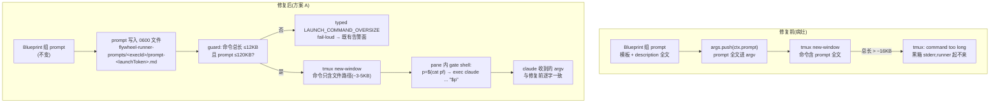

# FLY-1869 Runner spawn prompt 溢出 tmux 命令行 — 实施计划

Issue: FLY-1869 (https://linear.app/geoforge3d/issue/FLY-1869/runner-spawn-把-issue-description-全量内联进-tmux-命令行-超过-16-20kb-后-command)
日期: 2026-08-18
基于: 无

## 0. 一句话总结

claude-tmux runner 的 spawn 把整段 prompt(含 issue description 全文)作为 argv 内联进 `tmux new-window` 命令,超过 tmux 自身 ~16KB 命令缓冲即 `command too long` 起不来;修法 = **prompt 落盘 0600 文件 + pane 内 shell 展开回 claude argv**(语义零变化,命令长度变 O(1))+ **spawn 前置长度 guard**(typed fail-loud,取代 tmux 的黑箱报错)。

## 1. 病灶与机制(审计结论,均已在本分支源码核实)

### 1.1 溢出链路

```
Blueprint.ts:1796-1808   prompt = "<模板>\n\n${hydrated.issueDescription}"   ← description 全文,无截断
        ↓
TmuxAdapter.ts:1115      args.push(ctx.prompt)                               ← prompt 全文进 argv
        ↓
TmuxAdapter.ts:667-695   buildAmbientSafeWindowCommand → execFileFn("tmux", ["new-window", ..., ...windowCommand])
        ↓
tmux 3.5a                客户端→服务器单条命令有内部缓冲上限;issue 实测 16,000B 成功 / 20,000B 失败
                         (与 tmux imsg 协议单消息 16,384B 缓冲吻合;对我们而言按黑箱 ~16KB 处理)
```

不是 `ARG_MAX`(本机 1,048,576B)——上限属于 tmux 命令传输层,发生在 claude 进程 exec 之前。

### 1.2 关键先例:同一面墙已经撞过一次

`TmuxAdapter.ts:1028-1053`(FLY-154 hotfix)注释原文就写着 tmux `command too long`:当时把 `--append-system-prompt` 改成了 `--append-system-prompt-file <path>`(写 `$TMPDIR/flywheel-runner-prompts/<execId>/append-system-prompt.md`,dir 0700 / file 0600),**但 prompt 本体(最后一个 positional arg)没有一起改**。本单是把同一个修法补到 prompt 上。

### 1.3 四个 executor backend 现状矩阵

| Backend | prompt 进 tmux 命令行? | 依据 |
| -- | -- | -- |
| **claude-tmux(生产默认)** | ❌ **是 —— 唯一病灶** | `TmuxAdapter.ts:1115` |
| antigravity (`agy`) | 否 — 落盘 + 短指针 "Read the instructions in <path>" | `AntigravityTmuxAdapter.ts:98-125` |
| kimi | 否 — 同 agy 形态 | `KimiTmuxAdapter.ts:256-281` |
| codex | 否 — prompt 经 app-server `turn/start` API,不走 tmux argv | `CodexTmuxAdapter.ts:486` |

讽刺点即产品诉求:**分析越透的单越必然起不来**(分析块 prepend 进 description 的习惯) —— 且只打击生产默认 backend。

### 1.4 为什么"间歇"

失败是 description 长度的确定性函数,不是随机抖动:FLY-1863 事故里 05:52 失败(description 10KB+ 时命令总长越线)→ 06:07 description 被人工压缩 → 06:34 成功。阈值附近的单随编辑往复横跳。

### 1.5 为什么躺了 40 分钟

失败经 `Blueprint.emitFailed` → `session_failed` → sessions 表 `last_error`,这条链是通的;真正让它"不可重试 + 无人跟进"的是 rollback 悬挂指针 bug —— **Tadashi 已另立小单,不在本单 scope**(见 §8 诚实边界)。本单对"被告知"的贡献 = 让错误发生在我们自己的 guard 里(自述、可行动、进既有告警面),而不是 tmux 的一句黑箱 stderr。

## 2. 方案对比

### 方案 A(选定): prompt 落盘 + pane 内 shell 展开

写 `flywheel-runner-prompts/<execId>/prompt-<launchToken>.md`(复用 FLY-154 的目录与权限,per-launch 唯一,见 §3.1),tmux 命令里只传路径;pane 内的 launch-gate shell 在 `exec` claude 前 `p="$(cat -- "$pf")"`,把全文追加为 claude 的最后一个 positional arg。

- ✅ **claude 收到的 argv 与今天逐字一致**(语义零变化 —— prompt 仍是会话首消息原文,不改变 runner 行为)
- ✅ tmux 命令长度与 description 大小**解耦**(修复后实测预算 ~3-5KB,见 §3.4)
- ✅ 新上限脱离 tmux 命令层,受限的只剩单 argv 字符串的 OS 上限(guard 设跨平台可承诺的 120,000B,验收的 100KB(按 102,400B 计)之上留 ~17% 余量,详见 §3.3)
- ✅ 改动面最小:只动 `TmuxAdapter.ts`(+agy/kimi override 的机械签名适配)
- 已知 delta:shell 命令替换会剥去 prompt 末尾的连续换行(`$()` 语义)。语义无害,测试按"内容等价(忽略尾部换行)"断言。

### 方案 B(拒绝): claude 也改 kimi/agy 式短指针

"Read the instructions in <path>" 改变 runner 首动作语义(先做一次文件读取,prompt 不再逐字出现在会话开头),对生产默认 backend 是**无必要的行为回归风险**;A 用零语义变化达成同一目标。

### 方案 C(拒绝): description 截断 + 告警

丢信息,且正面违背本单的产品动机("分析越透越必须起得来")。截断永远不做;超预算走 fail-loud(§3.3)。

### 方案 D(拒绝): 经 env var 传递

`tmux new-window -e KEY=VALUE` 的 env 参数走同一条命令缓冲,不解决问题。

## 3. 详细设计

### 3.1 `buildCliArgs` seam 契约扩展(显式,不走侧信道)

```ts
// TmuxAdapter.ts — FLY-493 seam 的显式扩展
protected buildCliArgs(ctx, sessionId): { args: string[]; windowPromptFile?: string }
```

- **claude 基类 `buildClaudeArgs`**:不再 `args.push(ctx.prompt)`;当 `ctx.prompt` 非 blank 时写 `join(tmpdir(), "flywheel-runner-prompts", ctx.executionId, "prompt-<launchToken>.md")`(`mkdirSync {recursive, mode:0o700}` + `writeFileSync {mode:0o600}`,与 append-system-prompt.md 同目录同权限),返回 `{ args, windowPromptFile: promptPath }`。
  - **文件名带 launchToken(per-launch 唯一)**:launchToken 在 claude-tmux 恒存在(`TmuxAdapter.ts:658-661`);execId-确定性路径会跨 attempt 复用同一文件,理论上存在"旧 attempt 泄漏的 gated shell 读到新 attempt 内容"的别名类风险 —— token gate 已在 workflow 路径结构性关闭它(stale shell 的 token 永不匹配),per-launch 文件名把整类风险免费清零(路径本来就是作为参数传进 script 的,唯一化零成本)。生命周期不变(tmpdir,无主动清理)。**实现注(顺序约束)**:launchToken 派生现在 `TmuxAdapter.ts:658-666`,晚于 `buildCliArgs` 调用(:398)—— 实现时把 token/gate 派生提到 `buildCliArgs` 之前;文件名与 gate token 复用同一 token(workflow 路径 `ctx.launchGateToken` 本就在 ctx 里)。(独立评审 R1-4 + R2-3)
  - **blank prompt 走 inline**:判据是 `ctx.prompt.trim() === ""` 而非 `=== ""` —— `"\n"` 这类 whitespace-only prompt 今天能启动,若落盘会被 `$()` 剥空、再被 script 的非空检查误杀成 corpse pane。trim 后为空一律保持今天的 inline 行为,让 shell 侧的 fail-closed 检查只在真实文件损坏时触发。(独立评审 R1-2)
- **agy/kimi override**:机械适配为返回 `{ args }`(它们自带 file+pointer,argv 内容逐字节不变,回归测试钉住)。
- 文件生命周期与既有 append-system-prompt.md 一致(系统 tmpdir,无主动清理)—— 继承现状,非本单新增机制。

### 3.2 `buildAmbientSafeWindowCommand` gate script v2

options 增加 `promptFile?: string`。gated 路径 script(现 `TmuxAdapter.ts:118`)改为:

```sh
cf="$0"; tok="$1"; cleanup="$2"; pf="$3"; shift 3
n=0; while ! grep -qF "$tok" "$cf" 2>/dev/null; do [ "$n" -ge 1500 ] && exit 1; sleep 0.02; n=$((n+1)); done
[ "$cleanup" = "unlink" ] && rm -f -- "$cf"
if [ -n "$pf" ]; then
  p="$(cat -- "$pf")" || { printf 'FLYWHEEL_PROMPT_FILE_UNREADABLE %s\n' "$pf" >&2; exit 78; }
  [ -n "$p" ] || { printf 'FLYWHEEL_PROMPT_FILE_UNREADABLE %s\n' "$pf" >&2; exit 78; }
  exec "$@" "$p"
else
  exec "$@"
fi
```

(`p="$(cat …)"` 赋值语句的退出码取自命令替换,`||` 能接住 —— 独立评审已用真 /bin/sh 实验确认;`exit 78` 前的 stderr 面包屑让 corpse pane 的 capture 取证一眼见因,不再是第二种黑箱死法。独立评审 R1-3)

- `pf` 恒定作为第 4 个位置参数传入(无 promptFile 时传空串)——**gated 的 kimi/agy launch(workflow `launchCommitPath` 存在时它们也走这条 script)行为等价**,测试钉住。
- prompt 文件读不到/为空 → `exit 78`(区别于 gate 超时的 `exit 1`),**fail-closed:绝不让 claude 带空 prompt 静默启动**。claude-tmux 的 `remain-on-exit on` 保留尸体 pane,既有 pane-death 检测/收敛路径照常接手。
- prompt 内容只经位置参数与 `cat` 传递,**永不进入 shell 源码字符串**(维持现有注入安全姿态)。
- `promptFile` 存在但无 gate → builder throw(claude-tmux 恒有 gate,`TmuxAdapter.ts:657-666`;此分支为 fail-closed 契约守卫,防未来误用)。

### 3.3 spawn 前置长度 guard(defense in depth,typed fail-loud)

位置:`execute()` 组装完整 tmux argv 之后、`execFileFn("tmux", ...)` 之前。两条独立预算:

| 检查 | 预算 | 理由 |
| -- | -- | -- |
| tmux 命令总长 `Σ byteLength(arg)+1` | **12,288B** | < 实测成功下限 16,000B,留 ~25% 余量;修复后正常命令 ~3-5KB,触发即内部不变量破损。度量是 sound proxy:独立评审已在真 tmux 3.5a 上验证多参数 window command 直接按 argv exec(无 shell join、无引号膨胀) |
| `windowPromptFile` 内容大小 | **120,000B** | **取跨平台可承诺的最小上限**:Linux 单个 argv 字符串硬上限 `MAX_ARG_STRLEN` = 131,072B(与 ARG_MAX 无关),macOS 无此单串限制(独立评审实测 512KB 单参数在 Darwin 成功)。若取 512KB,合同"超限才失败"在 Linux(本仓 CI 平台)的 128KB-512KB 区间为假 —— guard 放行、exec 时 E2BIG 黑箱死,恰是本单要消灭的失败类。120,000B 在验收 100KB(按 102,400B 计)之上留 ~17% 余量、在 Linux 硬上限之下留 ~8% 余量,**一条合同全平台为真**。真出现 >120KB 的 prompt 需求时再立单(那时的形态大概率是 pointer 化)。(独立评审 R1-1 MEDIUM) |

超限**不截断、不降级**,抛 typed error,信息含:实测字节数、预算、Top-3 最大 args 的定位与长度。**定位启发式**(argv 元素没有名字):若超大元素的前一个元素以 `-` 开头,报"前导 flag + 值长度"(如 `--settings value, 4,102B`);否则报位置索引(如 `argv[41], 98,304B`)。(独立评审 R1-6)

- **workflow 路径**(`commitWorkflowLaunch` 存在):抛 `LaunchPrecommitError`,`LaunchPrecommitFailure` 新增 variant
  `{ code: "LAUNCH_COMMAND_OVERSIZE", reason: "tmux_command_budget" | "prompt_size_budget", physicalEvidence: "absent" }`
  (guard 在窗口打开前触发,`physicalEvidence: "absent"` 语义准确)→ dispatcher 既有 `precommit_failed` 处置:release launch owner → FLY-1638 退避 → 确定性失败第 5 代转 `needs_lead` + 既有 durable Lead 告警。**"被告知"由既有机制承接,不新建告警通道。**
- **fleet 直连路径**:抛携带同样自述信息的普通 typed Error → 既有 `session_failed` → `last_error` + DecisionLayer "[Failed]" 消息(`event-route.ts:238-239`)。

阈值为硬编码常量(不建 feature flag —— FLY-1806/1808 flag 收敛纪律;无运行时调参的真实需要)。

### 3.4 修复后命令长度预算(为什么 12KB guard 安全)

修复后 tmux 命令剩余变量部分:~28 个 `-e KEY=VALUE`(绝大多数是路径,~2KB)+ claude flags(`--settings` JSON、`--allowed-tools`、路径类,~1-2KB)+ gate script 常量(~0.4KB)≈ **3-5KB**,与 issue 内容彻底解耦。12,288B guard 距此有 ~2.5 倍 headroom,距 tmux 实测下限 16,000B 又留 ~25%;guard 触发 = 有人往命令行塞了新的大块内容 = 正该 fail-loud 的场景。

## 4. 流程图



## 5. 测试计划(TDD:先 RED 后 GREEN)

### 5.1 单元(`packages/claude-runner/test/TmuxAdapter.test.ts` 等)

1. `buildCliArgs`(claude):argv 不再含 prompt;`windowPromptFile` 指向 per-launch 唯一路径(`prompt-<launchToken>.md`)且内容与 `ctx.prompt` 逐字一致;dir 0o700 / file 0o600;`ctx.prompt` blank(空串或 whitespace-only)→ 保持 inline、无文件。
2. `buildAmbientSafeWindowCommand`:script 含 `pf` 消费逻辑;`promptFile` 未设时传空串、`exec "$@"` 分支行为等价(agy/kimi gated 回归);`promptFile` + 无 gate → throw。
3. **真 sh 执行 script v2**(不是 grep script 字符串):喂真文件,断言子进程收到的最后一个 arg == prompt 内容(尾部换行 delta 除外);文件缺失/为空 → exit 78,绝不 exec。
4. guard:总长恰在 12,288B 内 → 放行;超 1B → typed error,信息含实测值/预算/Top-3 contributors(按 §3.3 定位启发式);prompt 120,001B → `prompt_size_budget` variant;whitespace-only prompt(`"\n"`)→ inline 行为、不落盘;workflow 路径 → `LaunchPrecommitError` + `physicalEvidence: "absent"`。**guard 测试不开注入旋钮**:预算是硬编码常量,测试用真实超大 ctx 自然触线(`prompt_size_budget` 用 121KB prompt;`tmux_command_budget` 用超大 `allowedTools`/env 值把命令自然撑过 12,288B)—— 测的是生产常量本身,不是可调参数。(独立评审 R1-5)
5. agy/kimi override:返回 `{args}` 后,argv 与改前**逐字节一致**(byte-compat 哨兵)。

### 5.2 集成(真 tmux,独立 socket;参照 `scaffold-prune.real-tmux.test.ts` 先例)

1. **100KB+ prompt 真 spawn**(验收 1):claude binary 换成把收到的 argv 落盘的 test stub,断言 stub 收到的 prompt 与输入等价(忽略尾部换行)。
2. **同一 ctx 连续 spawn 5 次全成功**(验收 2,覆盖"间歇"形态)。
3. **guard 阳性对照**(验收 3 的"一条会失败的检查"):用超大 ctx 自然撑过生产常量 12,288B → 断言抛的是我们的 typed error 而非 tmux stderr;再以 20KB 命令直捅真 tmux 证明尺子本身(tmux 确实拒绝)—— 阳性对照证明 guard 挡在 tmux 前面,且测的是生产阈值本身(无注入旋钮,见 §5.1-4)。
4. gate token / adopt / replay 既有测试零回归。

### 5.3 全仓 gates

`pnpm lint` + `pnpm -r build` + package 断言(定向文件在 host 跑;全量 `pnpm test:packages:run` 只在 CI —— host 全量会压死生产 Bridge,既有纪律)。

### 5.4 独立 QA 建议(QA 节点执行,非实现者自证)

- 真机 529 隔离房或独立 socket:>100KB description 的单 spawn 成功;存活判据用 issue 给定的
  `ps -Ao pid,etime,%cpu,command | grep "claude --agent-id runner-" | grep -v grep`
  (**不得**用 `sessions.tmux_session` 判断 —— 该字段对活 runner 也可能为空);
- 同一单连续 spawn N≥3 次全成功;
- guard 阳性对照重放:spawn 一张 description >120,001B 的单 → 断言 `last_error` 含 `LAUNCH_COMMAND_OVERSIZE` / `prompt_size_budget` 的 typed 自述,而非 tmux stderr(预算是硬编码常量,QA 不可能也不需要调参 —— 用真实超大单自然触线)。

## 6. 验收标准对照

| Issue 验收 | 本设计的承接 |
| -- | -- |
| 1. description >100KB 的单成功 spawn | 方案 A;120KB guard 内畅通(全平台合同为真);§5.2-1 集成测试 + §5.4 真机 QA |
| 2. 同一单连续 N 次 spawn 全成功 | 命令长度与 description 解耦 → 确定性成功;§5.2-2 |
| 3. 逼近上限必须显式报错 | §3.3 双预算 typed guard,fail-loud 挡在 tmux 之前;§5.2-3 阳性对照 |
| 4. 不用 `sessions.tmux_session` 判 spawn 成功 | 写入 §5.4 QA 判据(ps 存活判据) |

## 7. 改动清单(预期)

| 文件 | 改动 |
| -- | -- |
| `packages/claude-runner/src/TmuxAdapter.ts` | `buildCliArgs` 契约扩展;`buildClaudeArgs` prompt 落盘;script v2;guard + 常量 |
| `packages/claude-runner/src/AntigravityTmuxAdapter.ts` | override 返回 `{args}`(机械) |
| `packages/claude-runner/src/KimiTmuxAdapter.ts` | 同上 |
| `packages/core/src/adapter-types.ts` | `LaunchPrecommitFailure` 新增 `LAUNCH_COMMAND_OVERSIZE` variant |
| `packages/claude-runner/test/*` | §5.1/§5.2 新测试 + byte-compat 哨兵 |

不碰:Blueprint 的 prompt 组装、DB schema、告警/重派机制、Codex/daemon 路径、`--append-system-prompt-file` 既有逻辑。

## 8. 诚实边界(本设计不做什么)

1. **不修 rollback 悬挂指针**("起不来"变"永拒重派"的次生死角)—— Tadashi 已另立小单;本单只保证 spawn 这一步要么成功要么 typed fail-loud。
2. **不新建告警通道**:"被告知"复用既有 `precommit_failed`→FLY-1638 needs_lead 告警(workflow)与 `session_failed`→"[Failed]"(direct)两条面;本单的贡献是让错误 typed、自述、发生在 spawn 之前。
3. **prompt >120KB 仍会失败**(loud,不是 silent)—— 预算取 Linux `MAX_ARG_STRLEN` 131,072B 之下的跨平台可承诺值(Darwin 物理上能到更大,但那会让合同在 CI 平台为假)。真需要 >120KB 时的形态(如 pointer 化)留给未来单;注意"分析进 comment 不进 description"的约定已把增长压力移出 description。
4. **不改变"分析块进 comment 不进 description"的行为约定** —— 那是已生效的运营约定,与本修复互补而非替代。
5. codex / agy / kimi 路径行为字节不变(agy/kimi 仅签名机械适配,byte-compat 哨兵钉住)。
6. 尾部连续换行剥离是已知且接受的 delta(shell `$()` 语义)。

## 9. 设计评审记录

Codex 全部 5 个 profile 撞 usage limit(至 2026-08-19 23:24,逐一实测)、Gemini CLI 免费层被 Google 停服(UNSUPPORTED_CLIENT,升级 0.55.1 无效)。经 Tadashi 裁定(question id `d6861b5f`,skip.json 落盘 `.flywheel/runs/88eb0352.../codex/skip.json`),本轮 design review 以**独立上下文 Claude 交叉评审**作补偿控制(项目 cross-family review 先例:FLY-1608 / FLY-1730)。

- **Round 1(CHANGES REQUESTED)**:完整报告见同文件夹 `cross-review-r1.md`。评审用真 /bin/sh + 真 tmux 3.5a 实验逐条核验了本计划的全部承重断言(溢出链、claude-tmux 恒有 gate、gated kimi/agy 共用同一 script、tmux 多参数直接 argv exec、`|| exit 78` 退出码传播、512KB 单参数在 Darwin 可行、typed-failure 全链路、无隐藏 script/argv 消费者)。1 MEDIUM + 5 LOW,六条全部采纳折入本版:
  1. (MEDIUM) prompt 预算 512KB→**120,000B**:Linux `MAX_ARG_STRLEN`=131,072B 使原合同在 CI 平台 128KB-512KB 区间为假(§3.3);
  2. blank prompt 判据 `trim()`(§3.1);
  3. `exit 78` 前 stderr 面包屑 `FLYWHEEL_PROMPT_FILE_UNREADABLE`(§3.2);
  4. prompt 文件名 per-launch 唯一 `prompt-<launchToken>.md`(§3.1);
  5. guard 测试无注入旋钮,用超大 ctx 自然触生产常量(§5.1-4/§5.2-3);
  6. Top-3 contributors 定位启发式(§3.3)。
- **Round 2(APPROVED)**:完整报告见同文件夹 `cross-review-r2.md`。评审用真 /bin/sh 复跑了修订版 gate script(面包屑 + exit 78 + 逐字投递 + 空 pf 直通全部正确),逐条核验六项折入。附 3 条 LOW 文档级修订(§5.4 QA 指令改自然触线形态 / §2 与 §4 图的旧文件名与余量精度 / §3.1 token 派生顺序约束),已全部折入本版。
