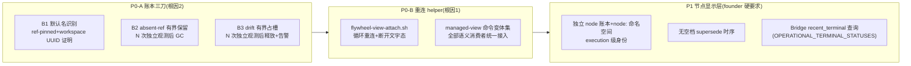

# FLY-1884 cmux 显示层完整性 — 实施计划
Issue: FLY-1884 (https://linear.app/geoforge3d/issue/FLY-1884/cmux体验-镜像-session-重建后cmux-旧-tab-挂死旧连接渲染全空-应自动重连或标记失效)
日期: 2026-08-20(R13,吸收 Codex design review R1×10 + R2×8 + R3×6 + R4×6 + R5×2 + R6×3 + R7×2 + 扩域复审 R1/R2/R3 APPROVED + implement hard-gate + 生产 A/B 故障证据修订)
基于: research.md

## 0. 一句话

把 cmux 侧栏从「活窗镜像」升级为「节点真相面板」:先拆掉让 tab 成批卡死/空白的两个结构病(prepared 账本死循环、一次性 attach),再把 Bridge 名册里的每个活跃节点(含无窗形态)和刚完工的节点渲染成可见 tab——founder 打开 cmux 永远能看到每个活跃节点的真实状态,任何「系统知道坏了」的状态必须告警,不许静默。

## 1. 目标 / 非目标

**目标**
- G1(根因 2):rename 事务不再因默认名「Terminal N」卡死;prepared 回执有界占槽(absent/drift 自动释放),死循环类不再需要手工账本手术。
- G2(根因 1):新建或 session 重建后 tab 必须收敛为活 pane 或明确失效态;clean-shell 有界重试,no-PTY 原位重建,任何路径不许无界往 pane 写 attach。
- G3(founder 硬要求):Bridge 名册内所有活跃节点在 cmux 可见——有窗走镜像 tab,无窗(额度墙/停驻/remote-control/headless)走节点 tab;节点转终态后保留终态摘要 tab(TTL 内)。**无空档合同(单一语义,实现与 QA 共用)**:(a)**active 形态之间的切换零空档**——节点 tab 只在镜像 tab 已 committed 且 surface 健康后才让位,反向(active 有窗→active 无窗)节点 tab 先 committed 才允许镜像清扫;(b)**active→终态允许有界空档,SLA = 镜像 tab 关闭后 ≤2 个 determinate additive round 内终态摘要 tab 出现**(determinate = 名册与 inventory 都读取成功的 round;indeterminate 冻结轮不计,故不承诺墙钟上限——正常节奏下约 2 分钟)——写入 founder 验收,不另设第二套说法。
- G4(共同验收):所有 preserve-for-manual 终局必须 episode 告警,禁止 log-only。

**非目标**:不改 cmux app 本体;不追「镜像为何重建」的全部成因(helper 化后不承重);v2 Lead 的 roster/create/dedup 模型不改,仅共享有界恢复收口;不覆盖 Bridge 名册之外的形态(不被追踪的 remote-control 体是数据源边界,如实标注);QA 隔离房不在半径。

## 2. 分层与顺序



P0-A 单独可 ship(解除当前生产疼痛);P0-B 依赖 P0-A(committed 回执恢复);P1 依赖 P0-B(node tab 的 helper 与识别地基)。一条分支三段提交,PR 拆分边界即 P0-A|P0-B|P1。
**P0-A 独立性(Codex R2-5)**:managed-view 命令 parser 的**基座随 P0-A 落地**——第一段提交里它只认识现网生产 attach 语法 + 既有 QA bin 覆写形态,供 provisional 分类使用;B1 mutation authority 来自 workspace UUID。P0-B 再往变体集里加 helper 语法并切换 producer。P0-A 段自带测试:不引入任何新语法/新 helper 的前提下,「Terminal N」卡死已能恢复。

## 3. P0-A:账本三刀(flywheel-cmux-sync.sh)

### 3.1 B1 默认名识别(带 mutation-boundary workspace UUID 证明)

#### 2026-08-19 implement hard-gate 修订:surface 证明改为原生 workspace UUID 证明

P0-A 前置实测推翻了本节原先的 surface-command 假设。cmux 0.61.0 的
`list-pane-surfaces` 只返回动态 `title/type/ref/selected/index/id`,没有
create-time command 或 launch argv。现存卡死行 `workspace:92`(账本期望
`FLY-1884-implement-codex-G-cmux-session-cmux-tab`)已显示为 `Terminal 37`,其
surface 已死亡;本单自建并回收的 `workspace:93` 同样只显示 `Terminal 38`。
因此,对 prepared abort 后从未启动的 surface,既无法在当下、也无法在恢复轮
证明它跑过 managed-view command。原设计明确规定「字段钉不死即停下问 Lead」,
question gate `cf86a8d6-6d6f-4499-aaff-382267fb317e` 已批准以下替代证明链。
原始 fixture 见 `fixtures/cmux-0.61-surface-identity.json`。

改用 cmux 原生、不可复用的 workspace UUID:

1. `new-workspace` 后以 `list-workspaces --id-format both` 从 exact before/after
   ref diff 取得该对象的 UUID,将它作为 prepared receipt 第五字段持久化:
   `prepared|generation|ref|title|workspace_uuid`。现有四字段行是 legacy,
   继续可读,但没有新增 mutation authority。
2. `_prepared_rename_guard`、`_rollback_unreceipted_guard` 与默认名恢复所需的
   `_title_tab_rename_guard` 在每次 mutation 的 genuine last-operation guard 内
   重读 socket generation 及
   `list-workspaces --id-format both`,必须恰有一个对象同时匹配
   `generation + workspace_uuid + ref + allowed pre-rename title`。UUID/ref/title
   任一不匹配均 fail-closed。workspace rename 后若 tab/surface 仍为同一默认名,
   只有同一 UUID receipt 可授权 exact-ref `rename-tab`;mutation 后仍按原路径
   重读 canonical title。这样不会把不存在的 surface launch identity 换个位置
   重新设成门。
3. 只有带 UUID 的新 prepared receipt 才可把 `^Terminal [0-9]+$` 视作默认名
   并重驱 rename。legacy 四字段 prepared 行(包括 `workspace:92`)绝不重命名,
   只按 §3.2 的 B2/B3 有界老化释放逻辑槽位;原 workspace 保留并 episode 告警。
   此后新 create 取得 UUID,可正常收敛为一个 committed canonical workspace,
   不会继续增长默认名 ghost。
4. committed 行保留 UUID,使 prepared→committed 不丢证明。带 UUID 的 close
   额外重读并匹配 workspace UUID,拒绝 ref 复用;legacy 四字段 canonical
   close 仍沿用既有 title/ref/generation authority,UUID 缺失不成为关闭拒绝条件。

新增必测负例:伪造 generation、同 ref 不同 UUID、同 UUID 不同 ref、UUID 对但
title 为 founder shell/其他值,全部零 rename/rollback mutation;legacy 四字段
`Terminal N` 只老化不重命名;新五字段 `Terminal N` 能重驱并 commit。

新谓词(单一定义点):
```bash
_workspace_title_is_default() { [[ "$1" =~ ^Terminal\ [0-9]+$ ]]; }
```
**放行语境收窄为 workspace UUID 证明,不再引用已被实测证伪的 surface-command 字段**:
1. `_prepared_rename_guard`:既有 generation + exact prepared receipt + allowed title 之上追加默认名;mutation boundary 必须重读 `list-workspaces --id-format both`,使 `generation + workspace_uuid + ref + allowed title` 唯一匹配。没有 UUID 的 legacy 行绝不 rename。
2. `_rollback_unreceipted_guard`:create 事务把 freshly-created workspace UUID 放在 guard 上下文;rollback 同样要求 UUID+ref+generation+默认/临时标题唯一匹配。这里的 “unreceipted” 只指尚未 committed,不是没有 create-time UUID。
3. `reconcile_prepared_ledger`:带 UUID 的默认名重驱 1;无 UUID 的 legacy 默认名进入 §3.2 B3 的专门老化分支,绝不伪造 rename authority。

ship 分支必须带端到端测试:新五字段行最终收敛出一个 committed canonical workspace;legacy 默认名行只释放逻辑槽位、原 workspace 保留并告警;默认名 ghost 数量不继续增长。

**明确不放宽**:`_ledger_close_guard`、`close_prepared_loser_ref`、`complete_title_migration` 的终态身份校验等 destructive final-title guard 一律继续要求 canonical 身份;`workspace_title_candidates`/stock 收养/restoredv1 等无回执所有权铸造路径不认默认名。
负例测试:founder 自建「Terminal 7」(surface=zsh)不被改名;同 generation ref 复用(旧 ref 被 close 后新 workspace 拿到同号)不被改名;陈旧/伪造 prepared 行不产生 mutation。

### 3.2 B2/B3 有界占槽(独立观测计数)

- sidecar `~/.flywheel/state/cmux-prepared-stall`,行 `kind|generation|ref|title|count|first_epoch|last_round`。**schema/lookup/清零/round 去重的身份统一为 (kind,generation,ref,title) 四元组**(Codex R2-2 + R3-6:ref 被复用给别的 title 不继承旧计数;测试覆盖「同 ref 换 title 同 round」);kind enum 统一登记全集 `absent|drift|node-absent|node-drift`(后两个 P1 使用)。mktemp+mv 原子写;**损坏/不可读 = 保留现状、计数不推进**(fail-safe preserve,不是 fail-open GC)。
- **独立观测定义**(Codex R1-7):watcher 每个 additive round 开始时生成持久 round id(epoch 秒 + 递增,存 `cmux-additive-round`);`reconcile_prepared_ledger` 同一 round 内无论被调用多少次(refresh/ghost-reap/手工 --refresh),同一四元组 **只计一次**(last_round 去重);且推进还要求距 first_epoch ≥ `FLYWHEEL_CMUX_PREPARED_MIN_AGE_SECONDS`(默认 120)。generation 变化 → 该行冻结不计数(交给既有 stale-generation 卫生)。
- B2(absent):计满 `FLYWHEEL_CMUX_PREPARED_ABSENT_PASSES`(默认 3)→ `_ledger_remove` + 清行 + log `GC prepared(absent-confirmed)`。ref 重现 → 清零。
- B3(drift/authority refusal):输入包括三类:(a)observed 非空/非默认/≠title/≠变体集;(b)**observed 是默认名,但 prepared 行没有 workspace UUID authority(legacy-default)**;(c)**带 UUID 的默认名重驱在 mutation-boundary 因 UUID/ref/title/generation 不匹配而被 guard 拒绝(authority-mismatch)**。三类都按 independent round + min-age 计满 `FLYWHEEL_CMUX_PREPARED_DRIFT_PASSES`(默认 5)→ **只删 prepared 回执行,绝不碰 workspace** + episode 告警;(a) kind=`prepared-drift-released`,(b) `prepared-legacy-default-released`,(c) `prepared-authority-mismatch-released`,均含 generation/ref/expected/observed。observed/authority 恢复 → 清零。
- reconcile 单行隔离:`_prepared_rename_guard` 通过既有 `GUARD_BLOCK_RC` 区分 `3=conclusive-authority-mismatch` 与 `1=indeterminate/stale-generation`。只有已成功读完 generation/ledger/workspace JSON 且 exact UUID/ref/title match 数明确 ≠1 才返回 3、推进 B3(c);JSON/账本/解析读不到或 generation 已变都返回 1,保留且计数不推进。两种 guard 拒绝都只 `continue` 当前行,不得 `return 1` 中断整个 `reconcile_prepared_ledger`。真实 cmux 命令失败/账本整体不可读仍可中止本 pass。测试必须在 authority-mismatch 行后放一个可正常收敛的 prepared 行;另注入 JSON 连续失败 N+ round,证明回执不释放且零 mismatch 告警。

### 3.3 G4 告警收口

审计 preserve-for-manual 终局:drift/legacy-default/authority-mismatch(B3 接管)、absent(B2 接管)、multiple-committed-owners ambiguous(补 episode 告警)、stale-generation 仍解析(已有告警,核对)、heal 拒绝(已有,核对)、attach 未分类(C 类,§4.5)、cleanup fence unknown(§5.4)。

## 4. P0-B:重连 helper

### 4.1 新脚本 `scripts/flywheel-view-attach.sh`

```bash
#!/bin/bash
# FLY-1884 display-only helper: keep one cmux surface attached to one
# Flywheel view session across view rebuilds. Never starts/stops/judges
# the runner; the watcher owns view-session lifecycle.
set -u
SESSION="${1:?Usage: flywheel-view-attach <view-session-name>}"
case "$SESSION" in cmux-*) ;; *) echo "[view-attach] refusing non-view session" >&2; exit 64 ;; esac
case "$SESSION" in *"'"*|*$'\n'*|*$'\r'*) echo "[view-attach] unsafe session name" >&2; exit 64 ;; esac
TMUX_BIN="${FLYWHEEL_CMUX_ATTACH_TMUX_BIN:-tmux}"
unset TMUX TMUX_PANE
stopping=0; trap 'stopping=1' INT TERM HUP
while [[ "$stopping" == "0" ]]; do
  if "$TMUX_BIN" has-session -t "=${SESSION}" 2>/dev/null; then
    "$TMUX_BIN" attach-session -t "=${SESSION}" || true
  else
    clear 2>/dev/null || printf '\033[2J\033[H'
    printf '[flywheel] 视图 %s 暂不存在 — 已断开,等待重建后自动重连…\n' "$SESSION"
  fi
  [[ "$stopping" == "0" ]] || break
  sleep 2
done
```
- 断开期只显示等待文案,**不读节点状态文件**(镜像 tab 是窗键控、节点 tab 是节点键控,两个键空间不混——Codex R1-8;节点状态由 P1 的节点 tab 承担)。
- `FLYWHEEL_CMUX_ATTACH_TMUX_BIN` 沿用既有 QA 覆写(绝对路径校验在 watcher 侧构造命令时做,helper 内直接用)。

### 4.2 managed-view 命令变体集(单一 parser,全消费者接入)

新函数对 `<title>` 产出**变体集**(旧 attach 语法 + 新 helper 语法 + QA bin 覆写形态),并提供反向解析(命令原文 → 所属 view 名):
```
managed_view_command_variants <title>   # 输出全部合法命令原文(每行一条)
managed_view_command_parse <command>    # 命中任一变体则输出 view 名,否则 rc=1
```
**全部语义消费者改走它**(Codex R1-5 点名的每一处):`workspace_title_candidates`(raw 匹配任一变体)、`reconcile_prepared_ledger` 的 provisional 分类(任一变体都算 provisional)、`_prepared_rename_guard`/`_rollback_unreceipted_guard`/`close_prepared_loser_ref` 的 provisional 参数、`complete_title_migration` 的 raw surface title 接受集、`normalize_stock_workspace_title`/`stock_workspace_records`/`_decode_stock_title`、`dismantle_view_display` 内嵌 raw_re、heal/reopen 注入内容(注入**新语法**)。
**落地分两段(Codex R2-5)**:parser 基座(生产 attach 语法 + QA 覆写形态)随 P0-A;helper 变体与 producer 切换随 P0-B。
- `build_attach_command` 默认产**新语法**;`FLYWHEEL_CMUX_VIEW_HELPER=0` 时逐字节回退旧语法(反向兼容哨兵)。
- 跨升级崩溃窗测试(三个,Codex R1-5):旧 raw title workspace、旧 attach surface + canonical workspace title、旧语法 prepared 回执——升级后都被识别并自然收敛,不判 drift。

### 4.3 交付闭包(Codex R1-8 + R2-7)

- **两个新 helper(view-attach、node-status)进入 Lead helper 现有的每一条真实生产 seam**:`flywheel-cmux-install.sh`、`flywheel-daemon.sh`、`converge-flywheel-bin.sh`、`package-onboard.sh` + allowlist、`packaged/bootstrap-services.sh`、`provision-fleet-host.sh`,以及对应 closure tests(实施时以 `grep -l flywheel-lead-attach` 的完整命中集为准清单,一条不漏)。watcher restart 前 readlink/executable 验证。
- **fail-closed 存在性门(两个 helper 同款)**:`build_attach_command` 产新语法前、node tab 的 create/prepare 前,均验证对应 helper 绝对路径存在+可执行+引号安全;不满足 → 不创建、不写 prepared authority、defer 并打 episode 告警(helper-missing)。宁可这一 tick 不建,不建一个必坏/必空白的 tab。
- 生命周期断言修正:单 tab 关闭的验收 = 该 surface 对应 helper **PID** 的前后 census(不是全局 pgrep);全局零残留只作全量 teardown 的断言。

### 4.4 P0-B 验收

- kill 任一 `cmux-*` view session,watcher 重建后 tab ≤5s 恢复;断开期显示等待文案(真机)。
- close tab → 该 helper PID 退出(per-PID census)。
- `FLYWHEEL_CMUX_VIEW_HELPER=0` → build_attach_command 输出与现网逐字节一致(哨兵)。

### 4.5 生产增补:attach 有界化 + no-PTY 原位重建(普通/v2 共享)

遵循 Ponytail 最小决策梯:不新建 daemon,不引入依赖,不 close/new-surface;直接使用 cmux 0.61 原生 `respawn-pane` 和 `set-status`/`clear-status`,只补一个必要的小状态表。

**状态与上限**:

- 新增 `ATTACH_HEAL_STATE`(默认 `~/.flywheel/state/cmux-attach-heal`),行格式 `generation|ref|title|kind|attempts|phase|first_epoch|last_epoch|last_round`;`kind=view|v2`,`phase=retrying|unclassified|rebuild-issued|rebuilt|dead`。**重试额度身份不含 surface ref**:`respawn-pane` 即使换 surface ref,同 generation/workspace/title/kind 仍继承已耗尽额度,不会开启无界重建循环;surface ref 只在每次 mutation guard 中精确钉住当下目标。单 watcher + mktemp/mv 原子改写;任一非法行/不可读写使整个 attach-heal 相 fail-closed,只显示失效 pill 与 episode 告警,不继续注入。
- clean bare shell(A):默认最多 `FLYWHEEL_CMUX_ATTACH_RETRIES=3` 次 `send`;每次必须在发送前持久化 attempt,因此 watcher 崩溃不会额外重放。N 次后下一次仍 0 clients 才 dead-letter 并进入重建。
- no-PTY(B):`read-screen` 精确包含 `open terminal failed: not a terminal` 即跳过 `send`,先写 `rebuild-issued`,再对原 exact workspace/surface 只调一次 `respawn-pane --command <canonical attach>`。命令返回成功后记 `rebuilt`;仍无 client 则保留「已重建·等待连接」pill,不再 send/respawn。命令失败记 `dead` + 红色「连接失效·需处理」pill。
- 其余可读非 shell、空屏,或既有 reopen render-escalation 后仍不可读(C):**不猜测 PTY,零 send/respawn**。首次只记 `unclassified` 并显示中性「连接未就绪·继续观察」pill;按 `last_round` 去重,连续 ≥2 个 determinate additive round 且距 `first_epoch` ≥ `FLYWHEEL_CMUX_PREPARED_MIN_AGE_SECONDS` 才升级红色「连接状态无法验证·需处理」pill并发一次 episode 告警。create 内秒级 verify loop 不重复推进独立观测。若后续变成 A/B 可进入其有界流程,持续 C 不产生 pane mutation。
- 任一类观测到 target client >0 即删 exact 状态行并 `clear-status flywheel_attach`;generation/ref/title/kind 换代是新 identity,不继承旧尝试。
- 底层 linked/private session 不存在时,不 send/respawn;对 exact committed workspace 写红色「底层 session 不存在·等待重建」pill。底层恢复后进入正常 A/B 分类。

**共享恢复收口与 mutation boundary**:

- 普通 runner/raw attach 与 v2 private Lead helper 都调同一个「读状态→分类→预占一次 mutation 额度」原语;两条路径保留各自现有的客户端计数、ownership guard 与 canonical command producer。映射写死:`kind=view → build_attach_command("cmux-"+title)`;`kind=v2 → build_lead_attach_command(private_socket)`。respawn guard 必须重算 producer,并证明它与 state kind/当前 roster socket 一致。
- `send`/`respawn-pane` 的 genuine last-operation guard 每次重读:cmux generation 未变;exact committed receipt + workspace title/ref 唯一;selected terminal surface ref 未变;target clients 仍为 0;ordinary 路径还需 `_view_shell_owned_for_title`,v2 还需 exact roster title/socket + private `main` session。`respawn-pane` 另要求当下仍是 no-PTY,或 clean-shell 计数已达 N。
- `create_workspace_for_window` 建立新 workspace 后走同一状态机,最多 N 次 send + 1 次 respawn;每次后重读 client count。返回前必须是三种显式结果之一:已有 client、A/B 已 dead-letter 且侧栏可见、或 C 已显示中性「连接未就绪」并进入跨 round 复核;不再把「cmux new-workspace 命令成功」当作「活 pane 成功」。

**崩溃语义**:`rebuild-issued` 是 at-most-once 回执。它在 cmux 命令前落盘;若恰在两者之间崩溃,恢复后保持红色 dead-letter 而不自动再重建,以「可见且少做一次」换「可能无界多做」;只有新 generation/workspace/title/kind identity 会开启新 episode,surface 换代不会重置额度。

**治理**:有界恢复是本单修掉无界写入的安全基线,不新增一个能恢复旧危险行为的 speculative kill switch。既有 `FLYWHEEL_CMUX_VIEW_HELPER=0` 仍只回退 runner command producer,有界状态机照常适用于 raw attach 与 v2。`FLYWHEEL_CMUX_ATTACH_RETRIES` 与 `ATTACH_HEAL_STATE` 路径进 non-flag allowlist。

## 5. P1:节点显示层

### 5.1 身份模型(Codex R1-3 + R2-1/R2-8)

- **逻辑主键 = exact `execution_id`,别无第二形态**(Codex R2-1:`workflow_node_id` 只是流程节点名 implement/qa/design,跨 execution/issue 重复,无唯一约束——只作显示/分组元数据)。注册表显式持久化 exact execution_id,终态 recent_terminal 回绑用它。**名册里每一行都渲染,不跳过**(缺 identifier/role 用 exec 短 id + issue_title 兜底显示)。
- **物理键(文件名/helper argv)= `sha256(exact execution_id)` 全长 64 hex**(Codex R3-3:execution_id 只是 TEXT,现网真实存在 `qa-...`、`exec-demo-stale` 等非 UUID 值,roster 仅拒 `|`/TAB/CR/LF——所以不做任何 UUID/前缀假设;全长 hash 路径安全、确定、任意 exec id 可构造)。注册表保留 raw execution_id 做反查。
- **authority title 生成一次、永不漂移(Codex R2-8 + R3-3)**:`node:<sanitize(identifier)-sanitize(role)>·<hash 后缀>`,hash 后缀 = 该物理键的**最短唯一前缀(≥8 hex,对照注册表全部现存行,不唯一则确定性延长到唯一)**,铸造时定死并写入注册表+node 账本,此后不随 roster 集合变化;identifier/role 缺失时 `node:<hash16>`。display alias 只活在状态文件内容里,可随 tick 更新。测试:非 UUID exec id 正常渲染;两个 hash 前 12 位相同的 exec(构造 fixture)titles 仍唯一;同 alias+同 8 位前缀对 fail-closed 延长消歧。
- **命名空间隔离**:小写 `node:` 前缀结构性撞不进 `is_managed_runner_title`(`^[A-Z]...`)、stock raw 语法、v2 Lead roster 标题——**现有 orphan-pin/stock/stale/conservative/close-request 清扫天然不认识它,无需四处加豁免**(Codex R1-2)。测试逐条证明 node tab 不进入这五条清扫路径;另一组测试:两个不同 execution、同 `workflow_node_id=implement` 同时 active → 两个 tab,各自转终态互不串。

### 5.2 独立 node 账本(Codex R1-1)

- 新文件 `~/.flywheel/state/cmux-node-ledger`,行 `state|generation|ref|exec_id|title`(state ∈ prepared|committed;title = `node:` authority 全名)。事务/锁/崩溃恢复复制 `_ledger_transaction` 模式(同款 inner-lock + mktemp+mv)。
- **通用 mirror 机器对 node 账本零感知**:`reconcile_prepared_ledger`/`self_heal_one_workspace`/mirror 清扫只读 `cmux-view-ledger`,行为不变(哨兵:node 行存在时 mirror reconcile 输出逐字节不变)。
- **node authority predicate 分阶段使用可证事实**,不假设长驻 helper 的 surface title:
  - prepared rename 恢复:①node 账本 exact generation/ref/exec_id/title 四元恰一;②workspace title ∈ {空,~,默认名,canonical node-status command};③exact ref 恰一个 selected terminal surface,其**当下 title**也在该允许集;④最后重读 generation/ref/workspace+surface title。该证据只用于刚创建/尚未 committed 的 migration。
  - committed readiness/close/TTL:①exact committed 四元恰一;②current workspace title 与 authority title 逐字节一致;③exact ref 仍有一个 terminal surface(**只证明存在,不比较动态 surface title**);④最后重读 generation/ref/workspace title。cmux 0.61 不暴露 launch argv,而 helper 前台 `sleep` 可能改变动态 title,所以不把未经 fixture 证明的值设成永久 close 门。
  - 负例:同 generation ref 复用、同前缀异 title、同 title 但 terminal surface 缺失,全部拒绝。
- node 账本本单**不扩 workspace UUID**:分支现有 schema 已落地且 node title 含 execution hash,committed mutation 还要求同 generation/ref/exec/title + workspace title + terminal surface 存在 + 最后重读;残余半径是「同 generation 内 ref 被复用,且另一 workspace 恰好复制完整 node authority title」。风险写入 §8;node 状态面未来加入更强 destructive 操作前再升级 UUID。
- **conclusive absent 的零变更 GC guard(Codex R3-4 + R4-3 分状态)**:founder 手工关 tab 后 ref 已不存在,统一 predicate 的「workspace 在场证明」不可满足——absent 路径走**独立、零 cmux mutation** 的账本行 GC(同 generation + 连续 N 次 conclusive absent,§3.2 sidecar node-absent)。**GC 半径按注册表状态分支**:state=active*(且 roster determinate 命中)→ **只删 absent 的账本回执行,注册行/authority title/物理键/状态文件全保留**(重建沿用同一 title);state=terminal-summary|unresolved-summary → 账本+注册行+状态文件全删,不重建;roster unknown → preserve 不 GC。测试四条:active 手工关 → 仅回执 GC → 下 round 同 title 重建;两类 summary 手工关 → 全 GC 且不重建;长驻 summary 到 TTL → predicate close;roster unknown → 不 GC。
- **node 账本 stale-generation 卫生(Codex R4-5)**:复用 view ledger 同款纪律——旧 generation 行:ref 在新 generation 快照 conclusively absent → 纯账本行移除(零 cmux mutation);ref 仍在场/被复用/快照不可判 → preserve + episode 告警,绝不碰 workspace。测试:cmux 重启后 active 节点以**原注册表 title** 铸新 generation 回执,旧行既不永久占槽也不误删复用 ref。
- node 专属最小 reconcile `reconcile_node_ledger`:prepared 恢复(rename 重驱,expected = node-status helper 命令)、absent/drift 有界(§3.2 sidecar,kind=node-absent|node-drift,四元身份)。

### 5.3 状态文件与渲染 helper

- `scripts/flywheel-node-status.sh <absolute-status-file>`(~25 行):参数必须是绝对路径且拒绝引号/CR/LF;producer 只传 `node_status_path(exact exec_id)` 产出的 `~/.flywheel/state/cmux-node-status/<sha256(exec_id)>.status`,canonical command/helper argv 逐字节一致。helper 循环 `clear + cat <absolute-status-file> + sleep 5`,trap 停止;文件缺失显示「等待同步器写入状态…」。集成测试:producer → path → command builder → helper argv 逐字节链路;非 UUID execution 跑**真 helper**(不只测 title 生成)。
- watcher 每 additive tick 原子重写 live 节点状态文件;终态/失联摘要写入后不再更新。内容:显示别名、issue 标题、状态词映射(running+无窗+heartbeat 老 → 「等待重生(额度墙/进程离线)」;ship_parked/awaiting_review/approved_to_ship/design_done → 「停驻中(等待后续阶段)」;pending → 「排队中(等待启动)」;adapter 无窗形态 → 「remote/headless 形态,无本地窗」;unresolved-summary → 「失联·无法确认终态」)、心跳年龄、更新时间;终态:最终 status、decision_route、pr_number、issue_url、完成时间(**字段以 StateStore 实有为准,不承诺 PR URL 拼装**——Codex R1-9)。

### 5.4 reconcile_node_presence(additive tick,roster read phase 之后)

- 输入:Bridge 新增 `mode=live` 投影(exec_id|workflow_node_id|identifier|session_role|status|adapter_type|heartbeat_at|issue_title,净化+截断,不可解析整相 indeterminate),状态集合精确为 `pending|running|ship_parked|awaiting_review|design_done|approved_to_ship`;`mode=active` 字节/语义不变。另读 `read_runner_tmux_exec_inventory`(**扩展为同时保留 exec→window_id 与该窗 title**,供 supersede 证明)与 recent_terminal 查询(按 exec_id 回绑)。
- 注册表 `~/.flywheel/state/cmux-node-registry`:`exec_id|title|display_alias|state|last_seen_epoch|last_ok_round|windowed_rounds|windowless_rounds|missing_live_rounds|summary_written|last_mirror_title|classification_round|summary_epoch`,state ∈ admitted|active-windowed|active-windowless|unresolved-summary|terminal-summary(伪代码与 schema 用同一套词——Codex R1-9;admitted = 首见活源铸的 pre-title 最小行,title/display_alias 为哨兵 `-`——Codex R6-1;末列供两类 summary TTL/cap 用)。debounce 全部落持久字段(round id 复用 §3.2):窗形态迁移需连续 2 个 ok round 同向观测;exec 从 live 投影消失 → `missing_live_rounds` 计数,期间 tab/状态原样保留;**只有 exact exec 的 recent_terminal 行可确证 `terminal-summary`**。两个 distinct complete round 后仍不在 live 且无 terminal 证据 → 转为如实标注的 `unresolved-summary`,发一次 episode 告警;它不是终态声明,但与 terminal-summary 一样纳入 cap/TTL、允许 founder 手工关后不重建,且只有在其 node workspace committed 后才允许旧 mirror 清扫。live 行重现 → 清零并回 active 状态;exact terminal 行出现 → 转 terminal-summary。状态机测试四组:live→缺席一次→重现;design_done/pending 始终保持 live;缺席两次且无终态→unresolved-summary;exact 终态行→terminal-summary。
- **无空档 supersede(Codex R1-4,双向)**:
  - placeholder → mirror:仅当「该 exec 的窗存在 + 窗 title 的 mirror workspace 在当前 generation 有 **committed** view-ledger 回执 + workspace/single selected terminal surface title 都逐字节等于 authority title」全部成立,才 guarded-close 节点 tab。cmux 不暴露 launch command,这里不再声称验证 surface command。mirror create/rename/commit 任一失败 → 节点 tab 原地保留。
  - mirror → placeholder(active 有窗→active 无窗,**tri-state freshness fence,Codex R3-1 + R4-1**):时序上现有 event cleanup(15s tick、30s 延迟)先于 60s additive node ensure,单靠节奏假设必然有空档;且「没查到映射就放行」对两个 additive round 之间生灭的新 execution 是 fail-open。改为在 `cleanup_workspace_for` / pending-cleanup 的 **mutation boundary 做三态判定**:
    1. **live**(全局分类快照——见下——严格新于该 pending marker,且其完整映射把该 title 绑到 live 名册的 execution)→ 要求该 exec 的 node 账本有当前 generation **committed** 回执才放行关闭;未就绪 → pending 行原样保留下 tick 重试(**宁可留死画面 tab,不留不可见**)。
    2. **conclusively-not-active**(全局分类快照严格新于 pending marker、标记 complete/determinate,且完整映射中**无**该 title)→ 按现行为清扫。**负证据必须来自完备快照,不来自「某行没写」**(Codex R5-1)。
    3. **unknown**(快照缺失/畸形/不完备 / 同 title 多义映射 / 快照不严格新于 pending marker / round indeterminate)→ **一律原样保留 pending**。
    unknown preserve 不是静默终局:pending marker 已超过既有 cleanup delay 后仍为 unknown,按 `generation+title` 发一次 episode 告警(已有 alert state 去重,无需新 counter);后续继续 preserve,Bridge/快照恢复即自然重试。风险表明确长期 Bridge 故障会保留 stale mirror,但 founder 会收到一次可操作告警。
    **三个 cleanup 调用者统一走带 marker 的请求记录(Codex R6-3)**:现网 `cleanup_stale_workspaces`(:6825)与 `cleanup_stale_conservative`(:7387)直接调 `cleanup_workspace_for`,没有 pending marker,「快照严格新于 marker」无从谈起。NODE_PRESENCE=1 时:`cleanup_workspace_for` **拒绝无 marker 调用**;两个直调者改为向同一持久 cleanup-request 记录**幂等入队一次**(按 title 去重,保留**首次观测**的 `(epoch, round)` token——重试不刷新 token,收敛可达)后返回,由 pending drain 统一走 fence。NODE_PRESENCE=0:三个调用者保持现行为逐字节不变。
    **cleanup-request 行 schema 与双向迁移(Codex R7-2)**:现网 `CLEANUP_PENDING` 行是 `title|epoch` 两字段,旧解析把余下内容整段塞进 `ts`(直接加第三列会让 `epoch|round` 进入算术)。定死:新行 = `title|epoch|round`;**解析函数就地升级为精确字段数校验、双格式并认**(2 字段 legacy / 3 字段新;其余 = 畸形)——OFF 路径对 legacy 行为逐字节一致,对 ON 残留 3 字段行取校验过的 epoch、忽略 round(照常清理,不误算);ON 对 legacy 2 字段行的比较**直接定义为 `snapshot_epoch > marker_epoch`(同 epoch 一律再等;缺失的 round 概念上是 unknown/最大哨兵,不是 0——否则字典序会把 `(epoch,正 round)` 误判为更新,Codex R8 措辞修正)**,marker 永不刷新;ON 下畸形行 preserve 不消失。测试五组(非 vacuous):legacy 行→ON;ON 行→OFF 清理;ON→OFF→ON 原 marker 保留;同 epoch 排序等待;纯 2 字段 P0 行为/输出哨兵。
    按调用者各一组测试:ON 下等新快照/等 node 回执;OFF 下字节一致。
    **全局分类快照(Codex R5-1 + R7-1 typed 文法,负证据的唯一权威)**:独立文件 `~/.flywheel/state/cmux-cleanup-snapshot`,单次原子整写(mktemp+mv),内容 = 头部(snapshot round id、capture epoch、determinate/complete 标记)+ **typed 行**:`active|title|exec_id`(等 committed node 回执)与 `protected|title|exec_id或哨兵-`(unknown/preserve)。protected 行来源三类:①注册行处于 missing/debounce/terminal-read-unknown;②**P1 激活时无法绑定 exec 的 legacy/prepared mirror(按当前 generation 账本 ref/title 落成持久 protected 行 + 每主体一次 episode 告警,G4)**;③admitted 等非终态注册行的 `last_mirror_title`(其行未转 terminal-summary 前一律否决负授权)。同 title 同时出现 active 与 protected → **按 protected/unknown 处理**(保守优先)。mutation boundary 上注册表或快照任一畸形/不可读 → 否决负分类。active 集为空时照样写快照(可含 protected 行;全空 = 完备负证据)。测试补:unbindable committed mirror / unbindable prepared mirror 对上更新的空 active 快照 → 都 preserve;active/protected 重复 title → protected;畸形注册表 → 否决负分类;admitted 行对上旧快照 → 否决负分类。**排序域统一**:pending marker 与快照头都用同一 epoch-秒 + round 序号,严格比较;watcher 重启后的**首个完备 determinate 快照即合法**(只要严格新于 pending marker——重启本身不豁免分类)。注册表行仍保留 `last_mirror_title`(身份绑定用),但 fence 的负判定只信快照文件。测试:active 集为空的快照允许负分类;从未见过的 title 在完备快照下负分类、在缺失/畸形快照下 preserve;畸形/缺头快照 → preserve;重启后首个完备快照(新于 pending)→ 允许分类,快照缺失期间 → preserve;外加原两条(cleanup 先到 → 等 committed;node 建立连续失败 >30s → mirror 一直保留)。
  - live→终态/失联摘要:按 G3(b) 合同——exact terminal 行出现后进入 terminal-summary;live 与 terminal 都没有 exact 行连续两轮后进入 unresolved-summary。两者都要求 node summary workspace committed 后才允许旧 mirror 清扫,故 founder 始终先看到真实标签。`recent_terminal` 读取 indeterminate/失败 → **该转换冻结**;缺证据绝不当终态定论(Codex R5-2)。
  - **首见活源即铸最小注册身份(Codex R5-2 + R6-1:不挂在 mirror commit 上)**:身份准入点 = **第一次观测到 exact 活源**——event drain 与 additive 发现路径在进入 workspace-exists 分支/任何 cmux create mutation **之前**,以幂等原子 upsert 写最小注册行(键 = exact exec_id;guard = `(session, window_id, title, @flywheel_exec_id)` 当场重读一致)。这覆盖 R6-1 点名的三个漏洞:commit 后崩溃窗(身份先于回执落盘,两文件无需跨文件原子)、prepared 恢复在源窗消失后才 commit(身份早已在首见时铸好)、**复用既有 canonical mirror 的新 execution 根本不走 create**(`_drain_file` 的 workspace-exists→self_heal 分支照样先过准入点)。P1 激活时从同一 exact inventory **种子化存量 committed mirror** 的注册行;无法绑定 exec 的 legacy/prepared mirror = fence 的 unknown 类(cleanup-protected),**绝不因未注册而负分类**。**pre-title 行字节 schema 定死**:`exec_id|-|-|admitted|...`(title/display_alias 用哨兵 `-`,state 枚举加 `admitted`;authority title/物理键留到首次建 node tab 时铸)。NODE_PRESENCE=0 时准入点不写(fence 反正短路)。测试:注册 upsert 前/后、view-ledger commit 前/后四个崩溃窗;prepared 恢复在源窗消失后 commit;既有 canonical mirror 被另一 execution 复用并在下个 additive round 前死亡——全部保有可分类身份或落 unknown 保护。
  - **不引入「扫全量 recent_terminal 当新准入」**(会与「terminal 手工关不重建」冲突)。全链状态机测试:两 round 之间 mirror 建成 committed → 窗死 → exact 终态行出现 → cleanup 按 fence 放行 → ≤2 determinate round 摘要 tab 出现 → founder 手工关摘要不重建。
  - **快照的 protected 集(Codex R6-2:terminal 证据缺席不得变成负授权)**:分类快照的映射 = 完整 live 映射 **∪ protected 集**——所有注册行中处于 missing/debounce/terminal-read-unknown 状态的 `last_mirror_title`,以及两类 summary 尚未有 committed node workspace 的 title。fence 对 protected 命中 → **unknown 类,preserve**。summary workspace committed 后可解除旧 mirror 保护;标签仍是「已结束」或「失联·无法确认终态」,不把未知伪装成终态。测试:live 消失 + recent_terminal 连续失败 → mirror 一直保留;恢复出 exact 终态行或完成两轮 unresolved 分类 → 对应 summary 先 committed,mirror 后清扫;后发 indeterminate round 不改写快照 → 旧 complete 快照对**新注册的 protected 行**不构成负授权。
  - 每个失败窗口(create/rename/commit)各一条无空档测试。
- 摘要:terminal-summary 只认 exact recent-terminal;unresolved-summary 明写「无法确认终态」。两类都按 summary_epoch 纳入 `FLYWHEEL_CMUX_NODE_SUMMARY_TTL_HOURS`(默认 24)与手工关 GC,均不重建;live 行重现时才恢复 active tab。
- **上限语义(Codex R2-6 + R3-5 采纳更简选项)**:`FLYWHEEL_CMUX_NODE_TABS_MAX`(默认 30,含边界)约束 **terminal-summary + unresolved-summary** 总数,超限按最旧 summary_epoch 淘汰;每个 victim 必须在 guarded close 成功后同时清 exact node receipt、注册行和状态文件,与 TTL/manual-close 的回收半径一致。**live 节点永远一行一 tab,无硬顶、无 overflow 聚合**。live 数异常(>100)只发 episode 告警提示名册可能异常,tab 照建。测试:31 个 live 节点全部单独可见(非 vacuous);cap victim 三类落盘状态全消失。
- 名册/inventory 任一 indeterminate → 整相冻结(不建不关不写状态)。

### 5.5 Bridge 查询(packages/teamlead)

新增两个 additive 查询,`mode=active` 字节/语义不变:

- `GET /api/sessions?mode=live` → 新 `StateStore.getLiveSessions()`,从单一定义点 `CMUX_LIVE_SESSION_STATUSES` 取得 `pending|running|ship_parked|awaiting_review|design_done|approved_to_ship`。不复用 `getActiveSessions()`(漏 design_done/pending),也不复用 readopt query(它有不同生命周期职责)。
- `GET /api/sessions?mode=recent_terminal&hours=N`(默认 48,上限 168),token 同 mode=active,投影同现有行;**终态集合 = `OPERATIONAL_TERMINAL_STATUSES`**(不含 approved_to_ship),按 last_activity_at 窗内过滤。

vitest:live 覆盖六个状态并排除全部 terminal;另加**集合完备性守卫** `CMUX_LIVE_SESSION_STATUSES ∪ OPERATIONAL_TERMINAL_STATUSES ⊇ Object.keys(WORKFLOW_TRANSITIONS)`,未来新增任何 workflow 状态却未归类时 CI 必须翻红;recent_terminal 过滤/窗界/上限/token/approved_to_ship 不得出现;mode=active 哨兵保持原字节语义。

### 5.6 kill switch 语义(Codex R1-10)

`FLYWHEEL_CMUX_NODE_PRESENCE=0` = **冻结保留**:不建/不关/不写状态文件/注册表只读;**既存 node tab 原样保留**(独立命名空间保证 P0 清扫不会碰它们,不产生「OFF 后被谁回收」的歧义)。**cleanup freshness fence 在 OFF 下完全短路(Codex R4-4)**:pending-cleanup 走 P0 原路径逐字节行为——绝不读冻结注册表、绝不等一个永远不会产生的 node 回执(否则 OFF 下 mirror cleanup 永久卡住,byte-compat 即告破)。哨兵测试两组:①预置注册表+node 账本+node tab,OFF 跑全循环,node 面零 mutation 且 mirror 面与 P0 末态逐字节一致;②预置 active 注册绑定 + 无 node 回执 + 到期 pending cleanup,OFF 下 mirror mutation/输出与 P0 字节一致(fence 不生效)。文档明示:OFF 后想清掉残留 node tab = founder 手工关(close guard 仍认账本)或重新 ON 走 TTL。
Flag 治理:两个布尔开关(`FLYWHEEL_CMUX_VIEW_HELPER`、`FLYWHEEL_CMUX_NODE_PRESENCE`)进 feature registry;不新增 attach-recovery 开关。数字/路径 knobs(PASSES/MIN_AGE/TTL/MAX/STATUS_DIR/ATTACH_BIN/ATTACH_RETRIES/ATTACH_HEAL_STATE)进 non-flag allowlist;新增 shell 测试文件加入 CI 显式清单(FLY-1338/1875 合同)。

## 6. 测试计划(TDD;沿用 test-cmux-sync.sh mock-cmux + 真 tmux 模式)

- **B1**:RED = prepared+「Terminal 7」preserve;GREEN = 重驱+commit。负例:founder「Terminal 7」(surface=zsh)不动;同 generation ref 复用不动;伪造/陈旧 prepared 行不动;destructive final-title guard 不放宽(哨兵)。
- **B2/B3**:同 round 多次进入只计一次;min-age 未到不计;absent×3 → GC+槽位释放+create 重建;ref 重现清零;drift×5 → 行释放+workspace 原样+告警恰一次;generation 变化冻结;sidecar 损坏 = 保留现状。
- **helper/语法**:参数校验;真 tmux kill+recreate 重连 e2e;close 后 per-PID 退出;helper 缺失 → build_attach_command 拒绝 + create defer + 告警;`=0` 逐字节回退哨兵;全部语义消费者 × 双语法矩阵;三个跨升级崩溃窗(旧 raw title/旧 surface/旧 prepared 回执);A 类恰 N 次 send 后只 respawn 一次;B 类零 send+一次 respawn;C 类零 pane mutation、首轮中性 pill、两次独立 round+min-age 后红 pill/一次告警;状态预占崩溃不重放;respawn 后 surface ref 改变也不重置额度;恢复 client 清状态/pill;无底层 session 零 pane mutation+失效 pill;`view/v2 → 各自 command producer` 矩阵;新建 workspace 只能以 client>0、显式 dead-letter 或 C 类可见 pending 结束。
- **node 面**:node: 标题不进五条清扫路径(逐条);mirror reconcile 对 node 账本零感知(字节哨兵);supersede 三失败窗无空档 + cleanup receipt fence 两反例(窗刚过 tick 消失 / node 建立连续失败 >30s → mirror 不关)+ 终态 SLA(≤2 determinate round);两个同 `workflow_node_id=implement` 的 execution 并行 live → 两 tab 各自转终态不串;`design_done`/`pending` 保持 live 且不显示「已结束」;非 UUID exec id 渲染 + hash 前缀碰撞消歧两组;node authority predicate 三负例(同 generation ref 复用/同前缀异 title/terminal surface 缺失);手工关四态机(live 重建 / terminal-summary 不重建 / unresolved-summary 不重建 / TTL close);缺席状态机四组(§5.4,含 unresolved-summary);两类 summary 共用 cap/TTL,cap victim 的 receipt/registry/status file 全清;collision join/leave 后 authority title 与账本字节不变;indeterminate 冻结;31 个 live execution 全部单独可见(非 vacuous);cleanup fence unknown 超过 delay 一次告警且继续 preserve;node helper 缺失 → 不创建不写 authority + 告警;`=0` 冻结保留哨兵。
- **Bridge**:vitest 覆盖 `mode=live` 六态全集、workflow 状态并集完备性、`mode=recent_terminal` 与 `mode=active` 哨兵(§5.5)。
- 全仓门:`pnpm lint` + `pnpm -r build` + 定向 `bash scripts/test-cmux-sync.sh`(宿主全量 vitest 不作验收门)。

## 7. 真机 QA 要点(独立 QA 节点)

1. 绝不批量动 founder 现网 tab;现网只做只读观察 + 单点注入(kill 一个 QA 自建 view session)。
2. 隔离 cmux 实例可行性先探(`cmux --socket` 新路径;不可则生产 app 上仅操作 QA 自建对象,前后 `cmux list-workspaces` 快照对账)。
3. 部署后生产观察:watcher 重启后 ≤5 分钟——workspace:52 被 B2 GC、growth-mufasa-lead tab 出现;`Rename-lag`/`title drift` 日志归零;无窗 implement 节点出现 `node:` tab。
4. cmux 默认命名行为确证(research §3.2 步骤)记录进 QA 报告。
5. 新建一个普通 runner 与一个 v2 private Lead workspace,两者都要在创建验证窗内观察到底层 client;QA 专用对象注入 clean-shell 与 no-PTY 两类故障,核对 N-send/one-respawn 边界。

## 8. 风险与回滚

| 风险 | 缓解 |
|---|---|
| B1 误收 founder 的 Terminal tab | create-time workspace UUID + generation/ref/allowed-title 在 mutation boundary 唯一匹配;legacy 无 UUID 行永不 rename;三组负例哨兵 |
| node 身份串行(node_id 重复/ref 复用/缺席误判终态) | execution_id 唯一主键 + 分阶段 authority predicate + live/terminal workflow 状态并集 CI 守卫 + exact 终态行确证;无终态证据只进明确 unresolved-summary |
| node 账本未持久化 workspace UUID | 残余半径要求同 generation ref 复用者同时复制 exact execution-hash workspace title;committed guard 另证 terminal surface 存在并最后重读;本单 node 面只显示/关闭自身状态 tab,未来增加更强 destructive 行为前再升级 UUID |
| B3 释放后正身与漂移 tab 并存困惑 | 告警点名漂移 ref+observed;漂移 tab 留人工 |
| 语法迁移破坏存量识别 | 变体集单 parser + 全消费者接入 + 三崩溃窗测试 + `=0` 字节回退 |
| node tab 被通用机器误伤 | `node:` 命名空间结构隔离 + 独立账本 + 逐清扫路径测试 |
| supersede 产生可见性空档 | placeholder→mirror:committed+workspace/surface-title readiness 后才让位;mirror→placeholder:tri-state freshness fence(unknown 一律 preserve);终态/失联摘要先 committed,旧 mirror 后清扫 |
| 名册抖动 / 新 workflow 状态 | indeterminate 冻结 + 窗形态/缺席 2-round debounce + exact 终态行确证 + live∪terminal 对 WORKFLOW_TRANSITIONS 的 CI 完备性守卫 |
| 侧栏膨胀 / 上限吞活节点 | soft cap/TTL 同时约束 terminal 与 unresolved 两类 summary;live 永远一行一 tab,无硬顶无 overflow;异常名册(>100)只告警 |
| helper 未随部署到位 | 两 helper 同款 fail-closed 存在性门 + 六条生产 seam 收敛(§4.3 清单)+ 告警 |
| 恢复 sweep 反复往坏 pane 写入 | 独立持久预占计数 + `rebuild-issued` at-most-once 回执;普通/v2 共享状态机 |
| `respawn-pane` 误伤已活/已复用 surface | exact generation+receipt+title+surface+0-client+ownership 最后守卫;A 须额度用尽,B 须 exact no-PTY 证据 |
| at-most-once 回执刚落盘就崩溃 | 不自动重放;侧栏显式 dead-letter+告警;新 identity 自然开新 episode |
| Bridge/分类快照长期不可用导致 stale mirror 保留 | cleanup fence fail-closed;超过既有 cleanup delay 按 generation+title 一次 episode 告警,恢复后自然重试 |
| 部署跑旧字节 | 合并后显式重启 watcher(FLY-1482 lease handoff) |

回滚:`FLYWHEEL_CMUX_VIEW_HELPER=0` / `FLYWHEEL_CMUX_NODE_PRESENCE=0`(语义见 §5.6);B1-B3 与 attach-heal/`respawn-pane` 无运行时开关(避免恢复旧的无界写入),回滚 = revert 对应提交并重启 watcher。账本:view-ledger 无 schema 变更;node-ledger/sidecar/注册表为新文件,revert 后残留文件无消费者、可删。

## 9. 交付物清单

- `scripts/flywheel-cmux-sync.sh`:B1(workspace UUID 证明)/B2/B3、round id、变体集 parser 及全消费者接入、attach-heal 有界状态机 + 原生 respawn/status、`reconcile_node_ledger`、`reconcile_node_presence`、告警收口。
- 新:`scripts/flywheel-view-attach.sh`、`scripts/flywheel-node-status.sh`;`flywheel-cmux-install.sh` + 部署 manifest 收敛两 helper。
- `packages/teamlead`:`mode=live`(六个非终态 live statuses)+ `mode=recent_terminal`(OPERATIONAL_TERMINAL_STATUSES)+ vitest。
- `scripts/test-cmux-sync.sh` + CI 显式清单:上述全部用例。
- flag registry / non-flag allowlist 登记。
- 文档:本 folder 三件 + 部署/QA runbook 段落。
