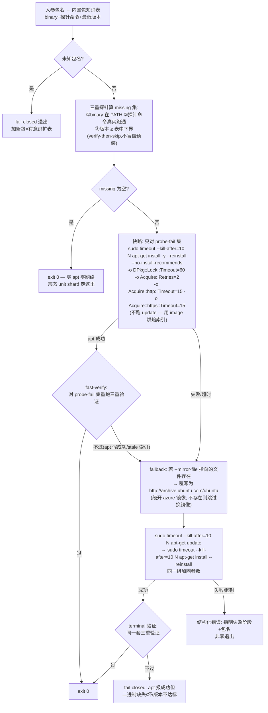

# FLY-1905 CI 去 apt 化 + 剩余安装加固 — 实施计划

Issue: FLY-1905 (https://linear.app/geoforge3d/issue/FLY-1905/ci根因-apt-装包步骤今日两波全仓卡死-调查为何会挂-去-apt-化疑我们侧可修dpkg-锁竞争无超时重试装了本已预装的包)
日期: 2026-08-19
基于: 同文件夹 research.md
版本: v4(v2 = 折入独立设计评审 R1 全部 10 项;v3 = 折入 founder 质疑:assume-and-skip → **verify-then-skip**;v4 = 折入 Codex R1 全部 5 项:reinstall 语义闭合恢复链 / T3 反自挂 watchdog / argv 校验 / 版本表 rationale / Bash 3.2 + sealed PATH 完整性)

## 1. 目标 / 非目标

**目标**
1. **verify-then-skip 取代 assume-and-skip**(founder 质疑折入):不是「因为实测预装所以删安装」,而是每次 CI 开头做秒级 preflight assert——工具**存在 + 真实跑得动 + 版本 ≥ 写死在脚本里的最低要求**;assert 全过才跳过安装(常态零安装,时间照省),任何一项不过 = fail loud + 自动走加固安装路兜底补装。绝不盲信预装环境;
2. 剩余唯一真实安装(ripgrep)加固:跳过 `apt-get update` 的快路 + 锁超时 + acquire 超时/重试 + 外部 `timeout(1)` 硬闸 + 换镜像 fallback;
3. 挂死止损:镜像故障窗内,受影响 step 在 ~6 分钟内具名 fail-fast(而非 15–20 分钟静默烧满 × 11 job);
4. 防回归:所有 pin 住 apt 步骤的 guard(共 4 处,见 §3)统一翻转为「必须走 helper、禁止裸 apt-get run 文本」。

**非目标**
- 不追求「镜像全网死时 CI 仍绿」(那需要 vendor 化 rg 或去 rg 依赖,exploration.md 选项 D/F 已拒绝/延后);
- 不改任何 test suite 对 `rg` 的使用;
- 不碰生产运行时代码。**范围如实声明:packages/ 侧有且仅有一个 CI-guard 测试文件要改**(`packages/teamlead/src/__tests__/fly-889-ci-workflow-timeout-guard.test.ts`,它 pin 了旧 apt 步骤形态),零生产源码改动。

## 2. 核心机制:共享 helper `scripts/ci-apt-install.sh`

一个新的小 shell helper,三处 CI step 共用。**合同**:

```
用法: bash scripts/ci-apt-install.sh [--timeout-secs N] [--mirror-file PATH] <pkg>...
  --timeout-secs   每条 apt 命令的外部硬闸秒数,默认 120
  --mirror-file    镜像列表文件路径,默认 /etc/apt/apt-mirrors.txt
                   (两者都走 argv 不走 env,避免新增 FLY-1455 flag 治理面;
                    --mirror-file 同时是 hermetic 测试的注入缝)
```

**argv 校验 fail-closed(Codex R1-3):`--timeout-secs` 是安全边界,不是普通参数**——GNU timeout 把 0 当「禁用超时」。在**任何 sudo/apt 调用之前**校验:N 必须是正整数且 ≤120;`--mirror-file` 必须带值;未知选项、空包列表一律拒绝。任一校验失败 = 非零退出 + 零 apt 调用。

**包知识表(写死在 helper 里,可审计——改下界 = 改这张表 = PR 里显式可见)**:

| pkg | binary | 探针命令(真实执行,exit 0 才算活) | 最低版本(初值) |
|---|---|---|---|
| tmux | tmux | `tmux -V` | 3.2 |
| lsof | lsof | `lsof -v`(版本在 stderr,照解析) | 4.9 |
| sqlite3 | sqlite3 | `sqlite3 --version` | 3.40 |
| ripgrep | rg | `rg --version` | 13.0 |

- **探针语义 = 三重验证**:①binary 在 PATH;②探针命令真实跑通(抓「装了但坏了」——binary 在但动不了);③解析出的版本 ≥ 表中下界(抓「版本不对」)。三者任一不过 → 该包记入 missing 集,fail loud 打印原因后走安装路。
- **版本解析必须吃下真实版式,解析不出 = fail-closed**(Codex R1-4):解析器必须处理 `tmux 3.5a`(字母后缀)与 lsof 把 `revision:` 打到 stderr 这类真实形态;探针 exit 0 但版本解析不出「主.次」→ 不许当达标放行,计入 missing 走安装,装后仍不可解析 = 终验失败。版本比较只做「主.次」两段数值比较,不引入版本库依赖;
- **下界表的每一行必须带 rationale**(Codex R1-4):当前初值(tmux 3.2 / lsof 4.9 / sqlite3 3.40 / rg 13.0)只是占位带,**实施 PR 里必须逐行替换为可审计依据**——要么「相关 suite 用到的确切命令/选项所需的最老版本」(用法考古),要么显式引用 supported-runner 政策线;表内逐行注释写明出处。收紧或放宽都必须改表 = PR 可见。
- **安装目标 = 恰好 probe-fail 集,且用 reinstall 语义闭合恢复链**(Codex R1-1,BLOCKER 修复):裸 `apt-get install` 对「apt 认为已是最新」的包会**直接成功而不重装**——「装了但坏」的 binary 会走出『探针失败 → apt 假成功 → 终验失败 → 死路』。因此:①install argv 只含 probe-fail 集(健康包绝不进 argv);②**canonical 规则(Codex R2 LOW 定稿):对整个 probe-fail 集统一加 `--reinstall`**——包括「本来就缺」的包(对未安装包 --reinstall 无害),规则一条、无分支,T2/T9/T10 与命令构造断言都钉这一形态;③fast install 后**立即**对该集重跑三重验证(fast-verify);④apt 非零 **或** fast-verify 不过,都触发 fallback(换镜像 → update → install --reinstall)——这样「烘焙索引里没有达标版本、update 后才有」的 stale-index 形态也被 fallback 兜住;⑤只有 fallback 之后的验证才是 terminal 判决。



设计要点(每条都锚在 research.md 的实测或评审发现上):
- **不跑 `apt-get update` 是最大的削面**:故障窗里卡死的全部是 update 阶段抓 4 个 azure 源索引;快路只抓 1 个 1.5MB deb。ripgrep 在 noble 无 -updates 顶替版本,烘焙索引 404 风险极低;真 404 由 fallback 的 update 兜住。
- **外部 `timeout(1)` 不信任 apt 内部超时**:实测 apt 在该故障形态下 14–18 分钟零输出不自退(research.md §5)。形态固定为 `sudo timeout --kill-after=10 "$N" apt-get ...`(timeout 以 root 跑,能杀 root 的 apt;`--kill-after` 是 option,**必须在 duration 之前**)。`timeout` 一律经 PATH 解析,绝不硬编码 `/usr/bin/timeout`(macOS 开发机上它可能只以 coreutils 形式存在)。
- **apt 选项必须逐个全拼**:`-o Acquire::http::Timeout=15 -o Acquire::https::Timeout=15` 两条分开写。apt 对未知 `-o` 键**静默接受**,写成 `Acquire::http(s)::Timeout` 这种简写会设置一个垃圾键、真超时永不生效且测试全绿——T2 的 argv 断言必须逐字要求这两个键(评审 R1-6)。
- **预期失败是受控控制流**(评审 R1-8):helper 用 `set -euo pipefail`,故「探针 miss」与「快路安装失败」这两类*预期内*失败必须以 guarded 形式调用(`if ! ...` / 显式捕获 rc);只有 fallback 失败与终探针失败是致命路径。
- **`DPkg::Lock::Timeout=60`**:防御假说①的病类(本次未发生,如实标注为防御项)。
- **终探针 fail-closed 且与首探针同一把尺**:安装后对全部请求包重跑同一套三重验证(存在+跑得动+版本达标)。保留 FLY-1759 的「缺 lsof/tmux 必须硬失败,绝不静默跳过」语义;同时防「apt 报成功但没装上/装了个坏的」的空过绿。
- **verify-then-skip 的自愈面**(founder 质疑折入):未来 image 去掉某预装包、或预装的坏了/版本低了,探针当场抓住并打印具名原因 → 自动走加固安装路补装 → 终探针复验;CI 既不盲信预装环境,也不会无解释变红(research.md §0 保质期表)。「省时间」只发生在验证通过之后,顺序不可反。
- 最坏预算:120×3 + 开销 ≈ 6.5 分钟 << 15/20 分钟 job 上限。

## 3. 变更清单(按文件)

### 3.1 新增 `scripts/ci-apt-install.sh`
按 §2 合同实现。`set -euo pipefail`;结构化 stderr(`[ci-apt-install] phase=<probe|fast-install|mirror-swap|fallback-update|fallback-install|verify> ...`);全部输出不吞。

### 3.2 新增 `scripts/__tests__/ci-apt-install.test.sh`(hermetic,详见 §4)

### 3.3 `.github/workflows/ci.yml` 三处替换
| 位置 | 现状 | 改为 |
|---|---|---|
| unit-tests(ci.yml:146-147) | `Install lsof/tmux for worktree process-reap tests`<br/>`sudo apt-get update && sudo apt-get install -y lsof tmux` | `Ensure lsof/tmux (FLY-1905 hardened, normally zero-network)`<br/>`bash scripts/ci-apt-install.sh tmux lsof` + `timeout-minutes: 8` |
| script-tests(ci.yml:209-210) | `Install tmux/lsof/sqlite3/ripgrep for hermetic test scripts`<br/>`sudo apt-get update && sudo apt-get install -y tmux lsof sqlite3 ripgrep` | `Ensure tmux/lsof/sqlite3/ripgrep (FLY-1905 hardened)`<br/>`bash scripts/ci-apt-install.sh tmux lsof sqlite3 ripgrep` + `timeout-minutes: 8` |
| script-tests-2(ci.yml:401-402) | 同上 | 同上 |

同步改写三处旧注释(FLY-889/FLY-1759 段):保留「为什么这些依赖是硬需求」的语义,更新「怎么装」为 helper 机制 + 指向本 issue 文档;更新 FLY-1870 step-seconds 注释里 apt 步骤的秒数(update+install ~30-60s → probe ~0s / rg install ~5-15s)。

**新 suite 注册形态(定死,评审 R1-7)**:在 **script-tests-2** 增加一个**新的具名 step**(`Test — FLY-1905 CI apt-install helper`)跑 `bash scripts/__tests__/ci-apt-install.test.sh`,并把该 step 名加进 ci-structure 的 `expected_shard_tests["script-tests-2"]` 清单 + FLY-1870 step-seconds 注释(保持逐 step 秒数记账)。该测试 step 自带 `timeout-minutes: 10`(Codex R1-2 的纵深防御:即使 harness watchdog 也回归,测试 step 也不烧满 job 上限)。

### 3.4 `scripts/__tests__/ci-structure.test.sh` guard 翻转
这是 CI 结构治理面,必须与 ci.yml 同 PR 锁步改:
- `expected_setup` 里的 step 名同步为新名;
- `expected_shard_tests["script-tests-2"]` 追加新具名测试 step(评审 R1-7);
- 删除「每个 script shard 恰有一个 `apt-get update` step 且含 tmux/lsof/sqlite3」块,替换为:
  1. 每个 script shard 恰有一个 step,其 run 文本含字面 token `bash scripts/ci-apt-install.sh`(**用完整 token 而非松散子串**,避免把同 job 里跑 `scripts/__tests__/ci-apt-install.test.sh` 的测试 step 误计——评审 R1-7)且参数含 tmux lsof sqlite3 ripgrep;
  2. unit-tests 恰有一个 step 调用 `bash scripts/ci-apt-install.sh`,参数含 tmux lsof;
  3. **整个 ci.yml 的所有 step `run:` 文本中 `apt-get` 出现次数为 0**(裸 apt 禁令,基于 YAML 解析的 run-text 断言;注释里出现 `apt-get` 字样不违规——评审 R1-9 对齐口径);
  4. 三个 helper step 都声明了 step 级 `timeout-minutes`(≤8)。

### 3.5 依赖 apt 步骤形态的既有测试(评审 R1-1/2/3 补上的漏网,与 ci.yml 同 PR 锁步改)
| 文件 | 现状 | 改法 |
|---|---|---|
| `packages/teamlead/src/__tests__/fly-889-ci-workflow-timeout-guard.test.ts:73-95` | 断言每个 script shard 恰一个 `/apt-get\s+update/` step 且含 tmux/lsof/sqlite3 → 新 ci.yml 下**硬红** | 改写成翻转后的不变量:每 shard 恰一个 `bash scripts/ci-apt-install.sh` step(含 4 包名)、全文件 run 文本零 `apt-get`,与 ci-structure 翻转镜像 |
| `scripts/__tests__/test-worktree-removal-contract.test.sh:63-71` | grep unit-tests 段字面 `apt-get install -y lsof` → **硬红** | 锚点改为新调用形态:unit 段含 `scripts/ci-apt-install.sh` 且含 `\blsof\b`(保留 FLY-1759「lsof 供给必须在 unit job 可见」的意图) |
| `scripts/cycle-time/__tests__/wiring.test.mjs:19` | `indexOf("Install tmux/lsof/sqlite3")` — step 改名后 indexOf=−1,断言**静默空过绿**(FLY-1327 的 sqlite3-先于-preflight 顺序守卫失效) | 锚点改为**含 sqlite3 的 4 包调用串**(`bash scripts/ci-apt-install.sh tmux lsof sqlite3 ripgrep`)或 script shard 的新 step 名,并显式加 `assert.ok(idx >= 0)`。**不许锚裸 helper 路径**:它在 ci.yml 的首次出现是 unit-tests step(不含 sqlite3),裸锚会让 FLY-1327 顺序守卫语义性弱化(评审 R2 LOW) |

### 3.6 测试注册
- `ci-shell-suite-enumeration.test.sh` 机制会自动要求新 suite 被枚举(§3.3 已以具名 step 注册);新 suite **不得**同时写进 `ci-shell-suite-manual-only.txt`(否则 overlap 检查红);
- packages 侧改动仅 §3.5 第一行的 guard 测试文件;`ci-matrix-coverage` 不受影响。

## 4. TDD(RED → GREEN)

先写 `scripts/__tests__/ci-apt-install.test.sh`(全红),再实现 helper(转绿)。

**hermetic 手法(评审 R1-4/5 修订)**:
- **sealed PATH,不是 PATH 前置**:CI 上跑本 suite 的 shard 已把真 rg/tmux/lsof/sqlite3 装进 `/usr/bin`,macOS 开发机 `/usr/bin` 也自带 sqlite3/lsof——前置 stub 无法让探针「看不见」真二进制,所有「缺包」用例会静默空转。suite 必须构造密封 stub 目录并 `export PATH="$STUB"`(仓内先例:`scripts/__tests__/flywheel-setup-services.test.sh:207`),按用例放入:假/缺的包二进制、假 `sudo`(记录 argv 后 exec 余下命令)、假或分场景真 `apt-get`,以及**真 `timeout` 的 symlink**;
- **`timeout` 预检 fail-closed**:suite 开头 `command -v timeout || command -v gtimeout`,解析到的真二进制以 `timeout` 之名链进 sealed PATH;两者皆无 → 显式环境诊断退出(仓内先例:ci.yml 的 `sqlite3 --version` / `command -v rg` 预检)。T3 的「证明不挂死」必须用真 timeout,不可 stub;
- **镜像文件走 `--mirror-file` 注入缝**:假 sudo 会真执行余下命令,硬编码 `/etc/apt/apt-mirrors.txt` 会写到真 `/etc`——所有用例把 `--mirror-file` 指向沙箱内 fixture;
- **sealed PATH 必须暴露 helper/harness 用到的全部外部命令**(Codex R1-5):不只 timeout 与包 stub——bash 本体(helper 经 `bash scripts/...` 或 sealed 目录里的 bash 链接调起)、tee/sed/awk/grep/mktemp 等 helper 实际用到的工具逐一链入;实施时以「helper 源码逐命令盘点」定清单,漏一个 = suite 在 sealed 环境里当场红,不会静默;
- **Bash 3.2 兼容**(Codex R1-5):suite 要在 macOS 开发机(/bin/bash 3.2)上真跑 helper——helper 与 suite 都禁 associative array 等 4.x 构造;CI 侧加 `bash -n` 语法检查,套件本身用目标 shell 执行;
- **T3 反自挂 watchdog**(Codex R1-2,BLOCKER 修复):T3 的唯一边界不能是「被测的 helper 超时行为」本身——若 helper 的 timeout 接线回归,T3 会原样复刻 20 分钟事故。harness 用**预解析的真 GNU timeout** 独立包住 helper 调用(上限 = helper 合法最坏预算 + 小余量),并区分两种结局:helper 自己结构化非零退出 = 预期通过;外层 watchdog 杀掉 = 测试失败。同时断言 apt 调用日志证明确实进了 stall 路径(防空转绿);
- `--timeout-secs 2` 注入小闸。

| 用例 | 场景 | 断言 |
|---|---|---|
| T1 | 四个二进制全在 sealed PATH,且探针命令全跑通、报告版本 ≥ 下界 | exit 0;apt-get 调用日志为空(零网络) |
| T2 | 缺 rg,快路成功(stub install 落一个 fake rg) | exit 0;apt-get **没有** `update` 调用;install argv **只含 rg、不含任何健康包,且带 `--reinstall`**(canonical 规则,Codex R1-1/R2-LOW);argv 含 `-o DPkg::Lock::Timeout=60`、`-o Acquire::Retries=2`、**`-o Acquire::http::Timeout=15` 与 `-o Acquire::https::Timeout=15` 两个逐字键**、`--no-install-recommends`;timeout argv 形态为 `--kill-after=10 2`(option 在 duration 前) |
| T3 | **镜像 stall 模拟(issue 验收④)**:stub apt-get trap TERM 后继续挂;**harness 用真 GNU timeout 独立包住 helper(反自挂,Codex R1-2)** | helper 自身结构化非零退出 = 通过;若由外层 watchdog 杀掉 = 测试失败;apt 调用日志证明进了 stall 路径;实测耗时 < 合法最坏预算+余量 |
| T4 | **锁占用模拟(issue 验收④)**:stub apt-get 打印 `Could not get lock /var/lib/dpkg/lock-frontend` exit 100,fallback 同败 | 非零退出;错误含阶段与包名;argv 断言 `DPkg::Lock::Timeout=60` 已传 |
| T5 | 快路失败 → fallback 成功(stateful stub 计数;`--mirror-file` 指向沙箱 fixture) | exit 0;fallback 前 fixture 文件被覆写为 archive.ubuntu.com;update 只在 fallback 出现一次 |
| T6 | 未知包名 | 非零退出;零 apt 调用 |
| T7 | apt 报成功但二进制仍缺失 | 非零退出(反空过绿) |
| T8 | `--mirror-file` 指向不存在路径时 fallback | 跳过换镜像仍走 update+install,不因缺文件崩 |
| T9 | **装了但坏了(founder 质疑)**:binary 在 sealed PATH 但探针命令 exit 1;**stub apt 忠实模拟真 apt:argv 无 `--reinstall` 就不动已存在的坏 binary**(Codex R1-1) | 该包判为 missing、stderr 具名原因;helper argv 必须带 `--reinstall` 才能让 stub 换掉坏 binary;fast-verify 复验通过 → exit 0 |
| T10 | **版本不对(founder 质疑)**:binary 在、探针跑通,但版本低于表中下界 | 该包判为 missing、stderr 写明「实测版本 < 下界」;走安装路(--reinstall);fast-verify 复验 |
| T11 | 终探针防空过绿升级:fallback 后 binary 仍跑不动或版本不达标 | 非零退出(terminal 验证是唯一终判,T7 的三重验证加强版) |
| T12 | **stale 索引(Codex R1-1)**:fast install 返 0 但 stub 没升级(烘焙索引无达标版本),fast-verify 不过;fallback update 后 stub 提供达标版本 | 走 fallback 后 exit 0;fast-verify 失败必须触发 fallback 而非直接终判 |
| T13 | **argv 校验负测试(Codex R1-3)**:`--timeout-secs 0`/负数/非数/缺值、`--mirror-file ""`(空值,Codex R2-LOW)、未知选项、空包列表 | 每种都非零退出且**零 apt/sudo 调用** |
| T14 | **版本解析(Codex R1-4)**:a) 真实版式 `tmux 3.5a`、lsof stderr `revision:` 行 → 解析正确判达标;b) 探针 exit 0 但输出解析不出版本 | a) exit 0 零安装;b) fail-closed 判 missing 走安装,装后仍不可解析 = 非零退出 |

## 5. 验收标准(对应 issue 交付 ①②③④)

- ① 无用安装归零(verify-then-skip 口径):ci-structure 翻转条款 3(YAML 解析的 run-text 零 `apt-get`,与 guard 同口径——评审 R1-9)+ unit-tests 常态日志显示「三重验证全过 → 零 apt 调用」—— §3.3/§3.4 + T1;**跳过安装的每一次都有验证记录在 step 日志里,不存在无验证的跳过**;
- ② 剩余安装带锁超时+重试+step timeout:T2/T4 argv 逐字断言 + ci-structure 翻转条款 4;
- ③ 两窗日志复盘:research.md §2–§6(已完成,含逐行铁证);
- ④ 注入 stall/锁占用模拟下 fail-fast 而非挂死:T3/T4;「装了但坏/版本不对」两类环境劣化被当场抓住并自动补装:T9/T10/T11;
- **真机自证(评审 R1-10 收紧)**:PR 自己的 CI run 里,两个 script shard 的 helper stderr 必须出现 `phase=fast-install` 成功且**零 `phase=fallback-*` 行**——正面证明「烘焙索引直装」在真实 image 上成立。若真机走了 fallback,视为快路假设被推翻,须回到 plan 重新裁(那意味着每次 CI 都在换镜像+全量 update,比现状还差,不许静默接受)。

## 6. 全仓门与 PR 打包

- `pnpm lint` + `pnpm -r build` + `pnpm test:packages:run`(packages 侧改动仅 §3.5 的 fly-889 guard 测试文件,预期该文件转绿、其余不受影响,仍全跑);
- 定向:新 suite + `ci-structure.test.sh` + `ci-shell-suite-enumeration.test.sh` + §3.5 三个文件 本地全绿;
- PR 最后一个 commit:CLAUDE.md milestone 行(per `feedback_archive_docs_in_main_pr`;doc-flow 下文档随分支走,无 git mv);
- 分支:`flywheel-FLY-1905`(现分支),base `main`,不自 merge,founder-gated ship。

## 7. 风险与回滚

| 风险 | 缓解 |
|---|---|
| 烘焙索引 404(rg 版本被顶替) | fallback update+install 兜底;T5 覆盖 |
| 烘焙索引在真机上整体不可用(image 清了 /var/lib/apt/lists) | §5 真机自证条款把它变成**响亮失败**:PR CI 必须见 fast-install 成功、零 fallback,否则回炉(评审 R1-10) |
| archive.ubuntu.com 与 azure 镜像同窗全挂 | 接受:~6 分钟具名失败(非目标②:不承诺全网死仍绿) |
| 未来 image 去掉某预装包 | 探针自愈走安装路;研究文档 §0 保质期表留了重核命令 |
| guard 翻转漏改导致 CI 自锁 | §3.4 + §3.5 全部四处 pin 点与 ci.yml 同 PR 锁步 + 本地全跑;guard 失败信息具名 |
| fallback 成功路径拖慢 shard | 慢 ~2–3 分钟,仍远低于 FLY-1870 tripwire 的 85%×20min 预算(评审 R1-10 附注),无需动 shard 结构 |
| 回滚 | 纯 CI lane + 测试文件:revert 单 PR 即回到现状,无生产状态迁移 |

## 8. 诚实边界

- 本单治的是「放大者」(我们侧结构):无用安装、全量 update、零超时。「触发者」(azure 镜像故障窗)不可根治,**还会再发生**——届时的预期行为变为:5/7 job 完全免疫(零 apt),2/7 job 大概率经换镜像 fallback 保绿,最坏 ~6 分钟具名失败。
- dpkg 锁竞争(假说①)本次未发生;`DPkg::Lock::Timeout` 是防御项,不据此宣称修了本次事故之外的病。
- 「烘焙索引可直装」在真机上尚未证明(design 阶段只有 research §6 的版本论证);§5 的真机自证条款把这个假设放进 PR CI 的硬验收,而不是留成默认成立。
- **verify-then-skip 的边界**:探针验的是「存在 + 探针命令跑得动 + 版本 ≥ 下界」,不是全功能自检——某工具若以「版本达标但个别子命令坏」的方式劣化,由使用它的测试本身抓(FLY-1759 一族本就 fail-closed)。探针的职责是把「盲信预装」变成「验过再跳」,不是替代测试。

## 9. 评审记录

- Round 1(2026-08-19,独立 cross-family Claude 评审员,对抗性 + 全仓核对):CHANGES REQUESTED,10 项(3 项漏网 pin 点、测试效度 2 项、apt 语法陷阱、guard 清单缺口、控制流/口径/真机自证收紧)——**全部采纳**,即本 v2。
- Round 2(同评审员,逐项对文核验):**APPROVED**;附 1 条 LOW(wiring.test.mjs 锚点不许用裸 helper 路径,须钉 4 包调用串或 step 名)——已折入 §3.5。
- v3(2026-08-19,founder 质疑经 Tadashi 折入指令 5455ac08):Annie 原话「就算这个工具安装了,万一安装的有问题呢?比如说,也许版本不对呢?」——v2 的 `command -v` 探针只验存在,确无等价机制;v3 升级为 **verify-then-skip 三重探针**(存在 + 探针命令真实跑通 + 版本 ≥ 写死在 helper 里的可审计下界),终探针同尺,新增 T9/T10/T11。常态路径仍零安装,省时不减验证。
- Codex Round 1(2026-08-19,`flywheel-codex-with-fallback` exec 通道,xhigh,session 01a01c1d-5f15-73f0-b892-d47c03242bbf,审 v3):CHANGES REQUESTED,5 项——①BLOCKER:裸 install 对「装了但坏」的包假成功,恢复链断(修:只装 probe-fail 集 + `--reinstall` 语义 + fast-verify + 失败并入 fallback + 只有 post-fallback 验证终判 + T12 stale-index);②BLOCKER:T3 若被测超时行为回归会自挂 20 分钟(修:harness 独立真 timeout watchdog + 两种结局区分 + stall 路径日志断言 + 测试 step 自带 timeout-minutes);③`--timeout-secs` 未校验(0=禁用超时!修:正整数 ≤120,全套负测试 T13);④版本表 rationale 必须落地(修:逐行绑定用法考古或 runner 政策 + 真实版式解析/不可解析 fail-closed T14);⑤Bash 3.2 兼容 + sealed PATH 完整命令清单——**全部采纳**,即本 v4。
- Codex Round 2(同 session resume,审 v4 @5601b16e6):**APPROVED**;附 1 条 LOW(--reinstall 口径统一为「对整个 probe-fail 集」canonical 形态 + T13 补 `--mirror-file ""` 空值)——已折入本文件(v4.1,编辑级,评审员明示无需再开轮)。
- Codex 设计评审(FLY-137 manifest 硬门)因当日全账号额度耗尽(app-server + exec 两通道 × 5 profile 实测被拒,23:24 PT 恢复)暂缺;Lead 裁决(2026-08-19,Tadashi):独立 Claude 评审只作补充控制不替代 gate,额度恢复后用仓内 flywheel-codex-with-fallback 补跑 codex-design-review 写 design-review.json 过 await-codex-gate,429 退避重试。本节点 park 至补门完成后才 complete。
