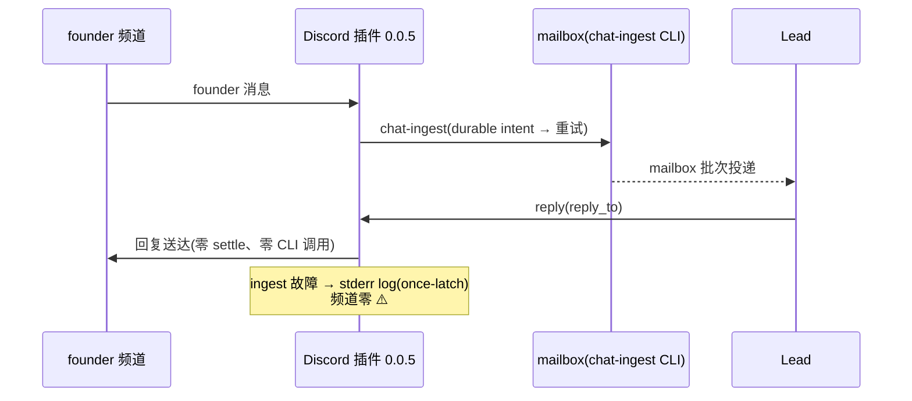

# FLY-1914 Discord 插件 chat-receipt 合同脱节收尾 — 实施计划

Issue: FLY-1914 (https://linear.app/geoforge3d/issue/FLY-1914/插件合同脱节-discord-插件仍在调已被-808-净删除的-chat-receipt-子命令-settle-永败重试-向-founder)
日期: 2026-08-19(R1 修订)
基于: research.md

## 0. 一句话

采纳已过 codex review + 独立 QA(exact head `a3117e1c`)的 fork PR #23 为修复本体,本单只做四件事:**preflight 复核**(采纳时一次 + founder merge 前一刻终检,配 fork-main 写冻结窗堵 TOCTOU)、**主仓规矩/文档 PR**(通用 CLI 消费者 sweep 规矩 + 修正三行陈旧里程碑 + 本 doc 文件夹)、**推动 founder-gated merge**、**按 FLY-1730 runbook 部署到生产 plugin cache 并真机验收**——其中部署第一块砖是补跑从未执行的生产 checker 收敛(research F13)。

## 1. 范围与红线

- **零新修复代码**:fix ① 的成品已在 fork PR #23(supersede #20)。除非 preflight 发现漂移(§2 矩阵),本单不改 PR #23 一个字节。
- **红线继承 FLY-1730 §1**:零新机制、净删除单;不引入新告警通道、新 flag、新配置面;mailbox 投递语义(FLY-1573/1574)逐字不碰。
- **交付定义 = 生产行为改变,不是 merge**(FLY-1730 铁律):founder 频道零 advisory + spool 零新 settle intent,才算完。
- **不做**(诚实边界,同 exploration §4):FLY-1612 告警治理、FLY-1645 主仓生产 closeout、checker dual marker 收窄、其余 fork 开放 PR(#14/#15/#19/#21/#22)的推进。FLY-1715(寄生放大器)已 merge 且已在 deployed-sha 内(research F17 更正),不属本单,但波后 census 照做——理由是「波前既存/未随波重启的 adapter 可存活」,与 #821 状态无关。
- 本设计节点不派发后继、不请求 ship 批准;merge 全部 founder-gated(`verify-approval` 纪律)。

## 2. 交付物 A — fork PR #23 采纳(preflight,两次执行 + 写冻结窗)

**执行两次**:①implement 节点动手第一步(采纳检查);②**founder merge 前一刻的终检**(必须重跑,消 TOCTOU——初检与 merge 之间任何 fork PR 落地都会使继承的 QA 证据失效;且 managed updater 部署的是 fork main HEAD 而非某个 PR 的 merge commit,merge 后落进 main 的任何东西都会被波次连带部署)。两次都把完整输出(40 位 OID、时间戳)留进 progress.md。

### 2.1 检查命令与判定(全部可拷贝执行)

**P1 — fork main 零漂移**:

```bash
gh api repos/xrliAnnie/claude-plugins-official/branches/main \
  --jq '{sha:.commit.sha, date:.commit.commit.committer.date}'
```

通过判据:`sha == 49c8c478542532cb37df0a6d39af62f09c0897d8`(research F9 基线)。

**P2 — PR #23 状态机**(比 R0 版细化,design review R1-2):

```bash
gh pr view 23 --repo xrliAnnie/claude-plugins-official \
  --json state,isDraft,baseRefName,headRefName,headRefOid,mergeable,mergeStateStatus,statusCheckRollup
```

| 观测 | 动作 |
|---|---|
| `state=OPEN`、`isDraft=false`、`baseRefName=main`、`headRefName=fix/FLY-1730-receipt-cli-desync`、`headRefOid=a3117e1cfef448304cf16d461d87ec5a874afbea`、`mergeable=MERGEABLE`、`mergeStateStatus∈{CLEAN,UNSTABLE→查 rollup}` | ✅ 原样进 merge 队列 |
| `mergeStateStatus=UNKNOWN`(GitHub 后台在算) | 等 30s 重查,最多 5 次;仍 UNKNOWN → 停,报 Tadashi |
| `statusCheckRollup` 有 pending/failed check | **不改字节**,先解 check(rerun/等待);check 红且需改代码 → 走漂移路径 |
| `state≠OPEN`(closed/merged)或 base/head 分支不符 | **停,报 Tadashi 人工裁决**——rebase 救不了这些态,严禁自动处置 |
| `headRefOid ≠ a3117e1c…`(有人推了新 commit) | 字节已变 → 走漂移路径(QA 绑定已失效) |
| `mergeable=CONFLICTING`(真 base 冲突/漂移) | 走漂移路径(唯一 rebase 正当场景) |

**漂移路径**(任何字节/head 变化后必须全走,缺一不可):rebase/修复 → `bun install --frozen-lockfile && bun test` 全绿 → 跨仓残留门 `node scripts/fly1645-receipt-residue-gate.mjs --plugin-root <fork checkout 根>` 零残留 → codex code review 对新 exact head 重审 → 独立 QA 重跑(FLY-1730 qa-report 的 PASS 随 head 作废,research F11)。

**P3 — 版本占号**:

```bash
gh api "repos/xrliAnnie/claude-plugins-official/contents/external_plugins/discord/.claude-plugin/plugin.json?ref=main" \
  --jq '.content' | base64 -d | python3 -c "import json,sys; print(json.load(sys.stdin)['version'])"
```

通过判据:`0.0.4`(→ PR #23 的 0.0.5 有效)。若已被占:patch 顺延改 PR #23 的 plugin.json 一处 → head 变 → 触发漂移路径全链。

### 2.2 写冻结窗(TOCTOU 收口,design review R1-1)

从**终检通过那一刻**起到 **§8.12(A1-A5 验收 + Phase C 联动解锁)完成**为止(与 §8 权威序列一致,单一释放边界),Tadashi 登记并执行:**fork 仓 main 全面写冻结**——期间除 PR #23 本身外,任何 fork PR 不得 merge、任何直接 push 不得发生(覆盖 #14/#15/#19/#21/#22 及未来新 PR;比 FLY-1730 只 HOLD #19 更宽,因为 updater 部署的是 fork main HEAD)。merge PR #23 后、`request-restart.sh` 入队**前一刻**,再读一次 fork main:

```bash
gh api repos/xrliAnnie/claude-plugins-official/branches/main --jq '.commit.sha'
```

判据:== PR #23 的 merge commit SHA(merge 时记录)。不符 → **停在部署前**,查明入侵者再议。

P1-P3 全绿(预期路径):PR #23 **零改动直接进入 merge 队列**,报 Tadashi 请求 founder-gated merge。QA PASS(FLY-1730 qa-report,head 绑定)在零漂移下继续有效,不重复烧真机 QA——已认账的证据不为「再看一眼」重烧;部署后验收(§5)另算,那是 QA 未覆盖的部分。

## 3. 交付物 B — 主仓 PR(本仓,implement 节点唯一写代码/文档的地方)

分支 `flywheel-FLY-1914` → PR base main。内容:

**B1 — 通用规矩落 CLAUDE.md**(research F19 空缺)。在主仓 CLAUDE.md `## Non-Negotiables` 之后新增独立小节,措辞(终稿以 codex review 为准):

```markdown
## CLI Contract Changes(FLY-1914)

净删除或改名 flywheel-comm(或任何被外部消费的 CLI)子命令的 PR,必须在 PR body 附一次
消费者 sweep 证据,含 sweep 执行时间戳,逐个列出调用方及处置(同步改造/确认零引用):

- 插件 fork 源:xrliAnnie/claude-plugins-official `external_plugins/`
- 本机全部插件缓存:`~/.claude/plugins/cache/*/`(生产实际运行的字节,与 fork main 可能不同版)
- 主仓 `scripts/` 与 `packages/`

任一 root 缺失/不可读时必须在证据里显式写明「该 root 未检查」——不允许把「没查到」
报成「零引用」。教训:#808 净删 `chat-receipt` 时评审漏了插件这个消费者,代价是
FLY-1730 + FLY-1914 两张单、一周 founder 频道告警噪音。
```

**B2 — 里程碑修正 + 本 doc 文件夹**(design review R1-5):CLAUDE.md 里程碑表**同 commit 内**做四件事——① FLY-1645 行状态更新(#808 已 merge 2026-08-12,插件半拆分见 FLY-1730/FLY-1914);② FLY-1730 行状态更新(#817 已 merge 2026-08-13 但生产 checker 副本未收敛;插件 PR #23 由 FLY-1914 接手;founder 8-18 关单);③ FLY-1715 行状态更新(#821 已 merge 2026-08-13 且已在 deployed-sha 内);④ 新增 FLY-1914 行。加本 doc 文件夹(exploration/research/plan/founder HTML/progress)。里程碑 commit 作 PR 最后一个 commit(`feedback_archive_docs_in_main_pr`)。

B 无 packages 代码改动 → 测试面 = `pnpm lint` 全仓 + CI 常规门;无需 vitest 新用例(纯文档 PR)。

## 4. 部署 runbook(ship/land 节点执行;merge 后开始)

**原样执行 FLY-1730 plan §4 Phase A→B→C**(该 runbook 已过 3 轮 design review,本单不重写,只登记五个 delta):

- **Delta-1(硬前置,research F13)**:Phase A step 2 从未执行——从 deployed checkout 显式跑 `scripts/install-discord-plugin-ops.sh`,然后验证:`grep -n ChatIngestRuntime ~/.flywheel/bin/check-discord-plugin.sh` 非空,且 `bash ~/.flywheel/bin/check-discord-plugin.sh` 对现 0.0.4 cache 仍 PASS(对旧插件惰性、零风险、可先行任意早做)。**跳过此步 = fleet wave 必被 fail-close。**
- **Delta-2(HOLD 升格为写冻结窗,§2.2)**:FLY-1730 的两条 HOLD 保留(FLY-1645 retired-flag removal HOLD——`FLYWHEEL_MAILBOX_DISCORD=1` 在 Phase C 验收全过前禁删,research F15),但 fork 侧从「只 HOLD #19」升格为「终检→终态回执之间 fork main 全面写冻结」,并加 request-restart 入队前的 fork main 复读(§2.2)。
- **Delta-3(残骸归档对象更新)**:Phase B step 8 的归档对象 = 部署时刻的活 intent(本设计节点快照:eng-lead 43 条 + product-lead 4 条,还在涨);沿用 Annie 已建立的先例目录形态(`settle-archive-fly1914-*`)。**部署前**若再堆积,按 issue 临时处置口径继续归档,不建新机制、不重复告警。
- **Delta-4(co-deploy 审计 + 主仓 main 冻结窗,design review R1-3 / R2-2)**:部署波会 fetch/pull **远端** main 最新(`restart-services.sh` 自 FLY-1730 时代已新增 pull-to-latest-main、identity preflight、voice-bridge replacement 等,行为以现行脚本为准),所以只审本地 `origin/main` 快照不够。Phase A 前:`git fetch origin main` 后记录**远端 main 完整 SHA**(冻结基准),验证生产 `~/.flywheel/deployed-sha` 是其 ancestor,审计 `git log <deployed-sha>..<冻结SHA> --oneline` **精确区间**(08-20 快照:4 个 commit,#884/#890/#888/#897;会过期,执行时重测)+ 本单 docs PR 这一个已登记例外:逐个确认无「已 merge 但 ship 前置未满足」的改动;有则先报 Tadashi 裁决,**不允许静默 co-deploy**。从审计通过起到 **§8.12(A1-A5 验收 + Phase C 联动解锁)完成**为止(与 fork 冻结同一释放边界),Tadashi 登记**主仓 main 写冻结**(唯一例外 = 本单 docs PR,merge 后更新冻结基准 SHA 并把新增区间补审)。**每次** restart 入队前一刻重读远端 main,判据 == 冻结基准 SHA;不符 → 停在 mutation 前。
- **Delta-5(终态回执补强,design review R1-4)**:在 FLY-1730 §4.6 四硬门之上追加三条,全部只读既有产物、零新 schema:①`leads-restart-status.json` 的 `.reason == "updater"`(排除「同 SHA 的无关健康波」冒充);②本次 `request-restart.sh` 入队时记录的 request marker 已被 updater 消费/清除;③本波窗口内零 `Flywheel restart degraded` 告警(Lead-only JSON 不覆盖非-Lead daemon 收敛降级)——有降级 → 停,报 founder 明示裁决。

其余逐字沿用:Phase B 终态回执原四硬门(founder 播报晚于 `phase_b_started_at`、`leads-restart-status.json` healthy/failed=0/skipped=0、`installed_plugins.json` 版本+SHA 匹配、cache 内容哨兵零 CLI 动词残留)、波前/波后进程 census fail-closed、managed 通道纪律(禁裸 `claude plugin update`、禁手敲 tmux/cmux)。

## 5. 验收(独立 QA 节点;真机,Claude-in-Chrome + 真 Discord)

**沿用 FLY-1730 plan §5 A1-A5 逐字**,仅 A5 对照组更新:

| # | 验收项 | 判据 |
|---|---|---|
| A1 | founder 频道连发 2 条消息,各获 Lead 带 reply_to 回复 | 回复正常送达(消息层无回归) |
| A2 | 15 分钟观察窗 | founder 频道**零** `⚠️` advisory;所有 Lead 载体 stderr 零 `settle failed`/零 chat-receipt spawn |
| A3 | spool 地板 | 观察窗内 `discord-*/chat-receipt-spool/settle/` 零新文件;`ingest/` 行为正常 |
| A4 | 多 runtime 回归 | 波后 census 证明观察窗内零旧路径进程;源码级断言新代码无告警面可发 |
| A5 | 对照组(防空绿) | 引用**本单 8-20 快照**(43+4 条活 intent、attempts=26、advisedAt=2026-08-20T05:11Z)+ FLY-1730 QA 的旧字节 A/B 实证:同操作旧代码必产 intent,新代码零产 |

## 6. 风险与回滚

**逐字继承 FLY-1730 plan §6**(一级=修复性 roll-forward 保结构门,禁整笔 revert delta;二级=founder 拍板回 0.0.4,前提 `FLYWHEEL_MAILBOX_DISCORD=1` 仍在——research F15 已确认)。本单新增:

| 风险 | 处置 |
|---|---|
| 初检与 merge 之间 fork 变动(TOCTOU) | §2 终检 + §2.2 写冻结窗 + request-restart 前复读;任一不符停在部署前 |
| preflight 漂移(P1-P3 任一失败) | §2.1 状态机分流:transient 重试 / 非 OPEN 停人裁 / 真冲突才 rebase;字节一变即重测重审重 QA,**不允许**带失效 QA PASS 合入 |
| 生产 checker 收敛(Delta-1)被再次遗漏 | runbook 列为 Phase A 硬门;ship 节点回执必须含 `grep ChatIngestRuntime ~/.flywheel/bin/check-discord-plugin.sh` 输出 |
| 部署波静默连带未验收改动上线 | Delta-4 deployed-sha..origin/main 区间审计,先裁决后开波 |
| 同 SHA 无关健康波冒充终态回执 / 非-Lead daemon 降级被掩盖 | Delta-5 三条补强门 |

## 7. 核心时序(终态)



## 8. 执行顺序(权威展开;§4 各 Delta 挂载在此序列上,与继承的 Phase A→B→C 无第二种解读)

**implement 节点**:
1. §2.1 采纳检查 P1-P3(JIT 实测,完整输出留 progress.md);
2. 主仓分支:B1 CLAUDE.md 规矩 + B2 里程碑修正与 docs → `pnpm lint` → push → PR(链接 FLY-1914 + fork PR #23 + FLY-1730 前史)→ codex code review loop → 报 Tadashi。

**merge/ship/land 节点(全部 founder-gated,顺序硬约束——checker-first 不变量:fork main 在生产 checker 收敛前一个字节都不许动)**:
3. Delta-4:fetch 并冻结远端 main SHA → deployed-sha ancestor 验证 → 精确区间 co-deploy 审计 → 登记主仓 main 写冻结(例外=本单 docs PR);
4. 本单 docs PR merge(founder-gated)→ 更新冻结基准 → managed 收敛 main 到生产;
5. **Delta-1(Phase A step 2)**:`scripts/install-discord-plugin-ops.sh` → `grep ChatIngestRuntime ~/.flywheel/bin/check-discord-plugin.sh` 非空 → `bash ~/.flywheel/bin/check-discord-plugin.sh` 对现 0.0.4 cache 仍 PASS;
6. 波前进程 census(FLY-1730 §4.3);
7. §2.1 终检 P1-P3 重跑 + §2.2 fork main 写冻结窗登记;
8. fork PR #23 merge(founder-gated)→ 冻结 merge commit SHA + merged manifest version;
9. §2.2 fork main 复读(== merge commit SHA)+ Delta-4 远端 main 复读(== 冻结基准)→ `request-restart.sh` 入队(记录 `phase_b_started_at` + request marker);
10. Phase B 终态回执:FLY-1730 §4.6 原四硬门 + Delta-5 三条补强;
11. 波后 census(§4.7)→ Delta-3 残骸归档(§4.8);
12. 验收 §5 A1-A5(独立 QA 节点)→ Phase C 联动解锁(FLY-1730 §4.9)→ 解除两个写冻结。
