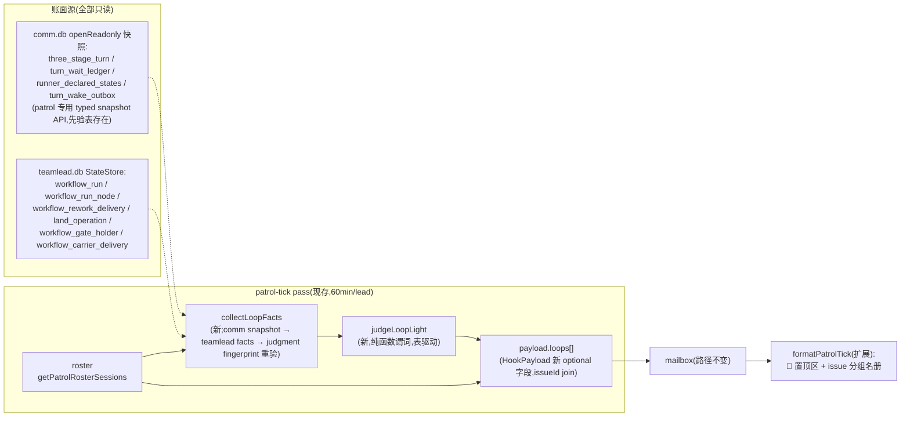

# FLY-1925 patrol_tick 名册加「圈」维度 — 实施计划

Issue: FLY-1925 (https://linear.app/geoforge3d/issue/FLY-1925/巡检tick-patrol-tick-名册加圈维度每-run-附当前节点棒持有者开圈状态-让有人在等不存在的圈直接印成红灯founder)
日期: 2026-08-20
基于: research.md(含 Codex design review R1 更正)

版本:ship 时取当前空号。

---

## 0. 一句话

patrol_tick 名册按 issue 分组附「圈」维度(current_node/attempt、棒持有者、
开圈账面、等待者),并做一个**纯账面**的红灯自检——「存在账记录账龄达到
30 分钟的 turn-poll 等待者,且账上不存在任何会向它发棒的圈」⇒ 该 issue 标
🔴 waiting-for-nonexistent-loop 并在 tick 正文置顶列出;纯读、零新告警
通道、零新 timer、零 flag、零 schema 迁移。

## 1. 硬约束(founder 裁定 + 项目纪律 + Codex R1 修订)

1. **红灯只进 tick 正文**——不走 `alertFailure`,不加告警通道;
2. **纯读**:不碰 turn belt / rework / land / gate / carrier 任何写路径;
   comm.db 一律 `CommDB.openReadonly`;
3. **红灯 = Bridge 账面自洽性检查**,与名册同级的「待核声明」——文案自带
   「账面自检,非结论,仍需独立核验」;不含任何「该查什么/建议动作」;
4. **fail-honest 三态**:`red / not_triggered / unknown`。非红态不叫 `ok`
   ——红灯缺席不是健康证明。所需账面任一读失败 → `unknown`
   (`⚠️ 账面不可读`),不红不绿;圈采集整体失败 → 名册主体照发;
5. **宁漏勿误**:一切过渡态显式豁免——fresh-wait(<30min)、棒换代观察
   滞后(stale tuple)、跨库快照漂移(tuple 重验失败 → unknown)、正常
   handoff 的 `pending` reservation、gate/carrier 活跃;
6. **红灯 v1 只锚 W1(turn-poll)**;`parked` 仅显示不判红(Codex R1 #1:
   `declare-state park` 是通用 done-but-alive 声明,Auto-QA awaiting_retest
   / 普通 park 都是健康态。与 issue 原文「turn-poll/parked」的偏差是设计
   裁定:parked 形态在名册可见,判断归 Lead);
7. 零新 timer(FLY-1570)、零新 flag、零 schema 迁移;30min 最小等待年龄
   是**写死常数**(非配置);
8. 与 FLY-1855 边界:不改 Lead 侧巡检执行步骤、不动 `runner-patrol-rules.md`;
9. 消毒纪律:runner 可控字段过 `canonicalPatrolToken`;闭集枚举字段过
   allowlist(allowlist 从导出状态常量派生,如 `WORKFLOW_RUN_NODE_STATES`);
   红灯行解释文字为模板固定字符串,零插值自由文本。

## 2. 架构



## 3. 数据模型(payload 扩展,全 optional 向后兼容)

`hook-payload.ts` 新增:

```ts
/** FLY-1925: 结构化开圈事实(闭集 kind/state;target/step 消毒后展示)。 */
export interface PatrolOpenLoop {
	kind: string;   // "attempt" | "rework" | "land" | "wake" | "gate" | "carrier"
	state: string;  // 该 kind 状态机的原值(渲染时过派生 allowlist)
	target?: string; // node id / execId8 等(消毒)
	step?: string;   // land current_step(消毒)
}

/** FLY-1925: issue 级圈账面(Bridge 账本声明,Lead 独立核验)。 */
export interface PatrolLoopEntry {
	/** 与 roster 行 join 的稳定键(sessions.issue_id 原值;Codex R1 #6)。 */
	issueId: string;
	/** 展示用(消毒);identifier 缺失的 session 各自回退 execId8,不作 join 键。 */
	identifier: string;
	runId8?: string;
	runStatus?: string;               // active | held;多 held 歧义 → unknown
	currentNode?: string;
	currentAttempt?: number;
	currentAttemptState?: string;     // WORKFLOW_RUN_NODE_STATES 派生 allowlist
	turnHolderExecId8?: string;
	turnPhase?: string;
	turnEpoch?: number;
	/** 结构化开圈;渲染 cap 3 条 + "+N more"。 */
	openLoops: PatrolOpenLoop[];
	/** 等待者。kind ∈ turn-poll | turn-poll-stale | parked;
	 * waitedMinutes 是 first_seen_at 至采集时刻的账龄,不声称进程持续 live poll。 */
	waiters: Array<{ executionId8: string; kind: string; waitedMinutes?: number }>;
	/** display-only 源缺失警示(闭集;如 parked 显示不可用)。固定渲染
	 * `(parked 显示不可用)`,绝不升级为 light=unknown(Codex R3 #3)。 */
	displayWarnings?: Array<string>;  // 闭集: "parked_unavailable"
	/** red | not_triggered | unknown。 */
	light: string;
	/** unknown 时的闭集原因:ledger_unreadable:<source> | ambiguous_runs | turn_tuple_moved。 */
	unknownReason?: string;
}
```

`HookPayload` 加 `loops?: PatrolLoopEntry[]`;`PatrolRosterEntry` 加
`issueId?: string`(join 键,optional 保持旧事件 replay 兼容)。旧 payload
(无 loops)→ 渲染走现状模板,**输出字节不变**(回放兼容锚)。

## 4. 红灯谓词(judgeLoopLight,纯函数)

输入 = 单 issue 的 `LoopFacts`(采集层产物,含每源读取成败 + 采集后
judgment fingerprint 重验结果);输出 = `{ light, reason? }`。

**红灯 ⇔ 同时满足**:

1. **有合格红灯等待者**(三集合,Codex R3 #1 + 运行时审查):每 issue 先算
   - `W_blocked` = roster 内所有满足「`turn_wait_ledger` 有行且
     (holder_exec_id, epoch) 与 `three_stage_turn` 当前行精确等值、且
     ≠ 当前 holder」的 exec(**不论年龄**——fresh waiter 也是被 block 的,
     它的 attempt 同样不能当发棒源);tuple 不匹配 → 标 `turn-poll-stale`,
     不入集;
   - `W_self` = 当前 holder 自己对当前 `(holder_exec_id, epoch)` 留下的
     exact-tuple wait 行。activation 失配时 holder 也可能收到 `not-yours`
     并写出这种自指账;它不独立触发红灯,但其 attempt 也不能用来掩盖
     另一个 `W_red` waiter;
   - `W_red` = `W_blocked` 中 `now - first_seen_at >= 30min`(写死常数
     `PATROL_RED_MIN_WAIT_MS`)者;
   红灯要求 **`W_red` 非空**(fresh-only 等待 → not_triggered);
2. **无发棒源**(S1..S5 全不成立;全部 scoped `(project_name, issue_id)`,
   run 级源一律取自 **run reducer 选中的那一个 run**。reducer 显式分支
   (Codex R2 #3 / R3 #4):`active.length === 1` → 选它(held 行无论多少
   仅显示,不贡献任何源);`active.length > 1` → `unknown(ambiguous_runs)`
   (防御分支,partial unique index 下理论不可达);`active.length === 0`
   时:`held.length === 1` → 选它;`held.length === 0` → 无 run(有效的
   「无 run 级源」观察,不是 unknown);`held.length > 1` →
   `unknown(ambiguous_runs)`:
   - S1:S1 成立 ⇔ 选中 run 存在「未绑 exec 的 `pending` reservation」或
     「绑给 **∉ (W_blocked ∪ W_self)** 的 exec 的 state ∈ (`pending`,`admitted`,
     `running`,`review`) attempt」——排除集含 W_blocked/W_self 而非仅 W_red:混龄
     场景(E1 等 2h、E2 同 tuple 刚等 5min,各有 running attempt)中 E2
     的 blocked attempt 不能冒充发棒者去抑制 E1 的红灯
     (Codex R1 #3 / R2 #3 / R3 #1);
   - S2:选中 run 通过 `workflow_rework_request.run_id` 关联的
     `workflow_rework_delivery` 无 state ≠ `completed` 行;**不按 request
     的 MAX/current route revision 过滤**,避免旧 revision 仍开着的 delivery
     被漏掉。route 仅按 delivery 自己的 `route_revision` join 作展示;
   - S3:无 `state != 'completed' AND superseded_at IS NULL` 的
     `land_operation`;
   - S4:无「retryable ∧ 目标匹配 ∧ 可投递」的 wake(镜像生产
     `inspectWorkflowTurnWakeRetry` 的只读可投递边界,StateStore.ts:43566-
     43649——生产 wake patrol 投递前会 cancel 终态/非 current 目标的
     wake,这类账面残留不是活权威;Codex R3 #2):
     state ∈ (`pending`,`sent`) ∧ `push_count < 2` ∧ (execution_id,
     epoch, activation_id) 与**当前 TURN 目标 tuple 精确匹配**,且:
     activation 非空时 TURN 的 target run/node/attempt 必须选中该 exec 的
     当前 active attempt(否则由 S1/S5 去证明圈);activation 为 NULL 的
     legacy recovery wake **精确镜像生产 guard**(Codex R4 #2:生产对
     activation-less wake 只 cancel `isStateStoreIrreversibleTerminalForZombie`
     的目标,StateStore.ts:43580-43587,不要求 patrol roster 成员——更严会
     对可投递的 recovery wake 制造假红):要求 TURN activation 亦为 NULL、
     exact execution/epoch、且目标 session 的 StateStore status 非不可逆
     终态(session 缺失按生产行为视为可投递;status 读失败 → unknown;
     目标 session 只读 lookup 加入注入 facts)。生产 guard 会 cancel 的行
     显示 `wake:stale`、push 用尽显示 `wake:exhausted`,均不算源;
   - S5:选中 run 无 state ∈ (`materializing`,`awaiting_review`) 的
     `workflow_gate_holder` 行,且无 state ≠ `completed` 的
     `workflow_carrier_delivery` 行。**`approved` holder 不算源**——批准
     事务原子铸后继(land successor / engine-terminal / carrier pending,
     StateStore.ts:38855-38948),`approved` 无后继 = 账面不自洽,恰是要
     暴露的形态;`approved` 仅显示(Codex R2 #2);
3. **账面可判(分层,Codex R2 #4)**:judgment-critical 源(turn / wait /
   wake + S1..S5 各表)全部读取成功——任一失败 → `unknown`;
   `runner_declared_states` 为 **display-only** 依赖,缺失仅标 parked 显示
   不可用,不阻断判定;且 teamlead 事实采集完成后**重读 judgment
   fingerprint 与初始快照一致**——fingerprint 的 wait 分量 = 该 issue
   roster exec **加当前 TURN holder(即使不在 roster)** 的全部原始 wait 行
   (holder + epoch + first_seen_at,
   canonical 排序;不是只有 aged/W_red 行——S1 依赖 W_blocked 成员,采集
   间隙新插入的 fresh 行会改变 S1 判定,Codex R4 #1),加当前 TURN tuple
   + current-target retryable wakes;任何行增删或分量漂移 →
   `unknown(turn_tuple_moved)`,bias to green(Codex R2 #5 / R4 #1);
   runStatus 歧义 → `unknown(ambiguous_runs)`。

`parked`(`getEffectiveDeclaredState` 未过期)→ waiters 列出 kind=`parked`,
永不触发红灯。

## 5. 变更清单(按包)

### 5.1 `packages/flywheel-comm` — patrol 专用只读快照 API

`db.ts` 新增 **`readPatrolTurnSnapshot(input)`**(Codex R1 #4/#5):

```ts
readPatrolTurnSnapshot(input: {
	issueIds: string[];
	executionIds: string[];   // roster execs;reader 再 union 所查 TURN holders
	nowMs: number;
}): PatrolTurnSnapshot
// PatrolTurnSnapshot = {
//   judgment:
//     | { available: true;
//         turns: Map<issueId, WorktreeTurn>;            // 含 target_run/node/attempt/activation
//         waits: Map<executionId, Array<{holderExecId; epoch; firstSeenAt}>>;
//         wakes: Map<issueId, Array<{state; pushCount; executionId; epoch; activationId}>> }
//     | { available: false; missingSources: string[] };
//   display:
//     | { available: true; declared: Map<executionId, "parked" | "long_task"> }
//     | { available: false };   // display-only:不阻断红灯判定(Codex R2 #4)
// }
```

- 进入前 `PRAGMA table_info` 验证:**judgment 三表**(three_stage_turn /
  turn_wait_ledger / turn_wake_outbox)任一缺 → `judgment.available:false`
  (**绝不把缺表折叠成空账**——legacy API 容错语义不改,patrol 不用它们做
  判定输入);`runner_declared_states` 缺 → 仅 `display.available:false`;
- 全部表在**一个 better-sqlite3 read transaction**里读完(单库内一致快照);
- wake 行携带 epoch/activationId(Codex R2 #1,S4 目标匹配所需);
- 另加 `rereadJudgmentFingerprint(issueId, executionIds)`:采集 teamlead
  事实后的重验读——先重读当前 TURN,将其 holder(即使不在 roster)union
  `executionIds`,再返回当前 TURN tuple + 这些 exec 的**全部原始 wait 行
  (holder/epoch/first_seen_at,canonical 排序)** +
  current-target retryable wakes 的紧凑指纹,与初始快照比对;行增删同样
  构成漂移(Codex R2 #5 / R4 #1)。

### 5.2 `packages/teamlead` `StateStore.ts` — 只读查询,零迁移

全部 scoped `(projectName, issueId)`(Codex R1 #7):

- `getPatrolWorkflowRuns(projectName, issueId)`:status ∈ (`active`,`held`)
  全部行(不静默取「最新」;调用方按 §4 run reducer 四分支处理:恰一
  active 赢——held 无论多少仅显示;active>1 → ambiguous(防御);无 active
  时恰一 held 选之、零 held = 无 run 有效观察、held>1 → ambiguous);
- `listActiveNodeAttempts(runId)`:state ∈ (`pending`,`admitted`,`running`,
  `review`)的结构化行 `{nodeId, attempt, state, executionId}`;
- `getLatestNodeAttempt(runId, nodeId)`:`ORDER BY attempt DESC LIMIT 1`;
- `listOpenReworkDeliveries(runId)`:delivery→request 按 `run_id` 且
  delivery state ≠ `completed`;不加 MAX/current revision 过滤。若需 route
  展示字段,按 delivery 自己的 `route_revision` join,返回 `{state,
  targetNodeId, targetAttempt, preferredActorExecutionId, routeRevision}`;
- `listOpenLandOperations(projectName, issueId)`:
  `state != 'completed' AND superseded_at IS NULL` → `{state, currentStep}`;
- `listOpenGateAuthorities(runId)`:`workflow_gate_holder` 非 `superseded`
  行 + `workflow_carrier_delivery` state ≠ `completed` 行(合并为
  `{kind: "gate"|"carrier", state}` 列表)。

### 5.3 `packages/teamlead` 新文件 `src/bridge/patrol-loop-ledger.ts`

- `collectLoopFacts(deps, project, issueId, rosterSessions): LoopFacts`:
  顺序 = comm 快照(§5.1 已一次取好,传入)→ teamlead 六查询(每张表独立
  try/catch,失败记 `unreadable:<source>`)→ `rereadJudgmentFingerprint` 重验;
  collectLoopFacts 全程同步无 await(单 Bridge 事件循环内不让出);
- `judgeLoopLight(facts)`:§4 谓词,表驱动可测;
- `toPatrolLoopEntry(facts, judged)`:execId 截 8 位、openLoops 结构化
  (`wake:exhausted` 等显示态在此产出)、dedupe;
- deps 全注入(`Pick<StateStore,...>` + comm snapshot 接口),不直接
  import CommDB。

### 5.4 `packages/teamlead` `src/bridge/patrol-tick.ts`

- `PatrolTickDeps` 扩展:`store` Pick 加 §5.2 六查询;新增
  `openCommReadonly?: (projectName) => PatrolCommReader | null`(null =
  库不可读;接口 = `readPatrolTurnSnapshot` + `rereadJudgmentFingerprint` + `close`);
- **不在 project 顶层预采集**:GatePoller 的 patrol rider 每 60 秒调用本 pass,
  而名册每 Lead 约 60 分钟才到期。对每个 Lead,先走完 roster-empty、未到期、
  settlement 等全部现有 `continue`;只有确定本轮要 mint tick 的分支才
  `openCommReadonly`(finally close)→ `readPatrolTurnSnapshot`,且仅传该 Lead
  roster 的 distinct issueIds + execIds→ 每 issue `collectLoopFacts` +
  `judgeLoopLight` → `payload.loops`;
- 每个 Lead 每个 patrol interval 最多采集一次;不同 Lead 不共享 waiter 集,
  避免把同 project 但不在该 Lead roster 的 exec 渲染进名册;
- **整段圈采集包一层 try/catch**:未预期异常 → `loops` 全
  unknown(`ledger_unreadable:collector`),名册主体照发;
- eventId / due 判断 / settlement 逻辑**零改动**。

### 5.5 `packages/teamlead` `src/bridge/hook-payload.ts`

- §3 类型 + `formatPatrolTick` 扩展。渲染改 **issue 分组**(exploration
  Q1 的 A 方案;Codex R1 #8 指出重复列不受控):

```
[patrol_tick] 巡检时间到。
🔴 按账面有 1 个 issue「有人在等不存在的圈」(账面自检,非结论,仍需独立核验):
- FLY-1855: ab12cd34 TURN 等待账记录账龄 182 分钟(棒=ef56gh78/qa/e3),账上无活动 attempt/返工圈/land/可重试 wake/gate 会向它发棒
按 Bridge 的账,你名下有 3 个未终结 runner(此名册是待核声明,不是结论):
FLY-1855 | run=9f3a12(active) node=implement@2(done) | 棒=ef56gh78/qa/e3 | 圈=无 | 🔴
  - [ab12cd34] (implement, running) 等待账=turn-poll(账龄182m)
  - [ef56gh78] (qa, running) 声明=parked
FLY-1901 | 圈=⚠️ 账面不可读(ledger_unreadable:comm_db)
  - [cd34ef56] (main, running)
```

  - 红灯置顶区:仅当存在 `light=red`;**上限 5 行**,超出 `(+N more 🔴)`;
    行 = identifier + waiter execId8 + `turn_wait_ledger.first_seen_at` 账龄
    + 棒三元组 + 固定否定句;不把账龄表述成进程连续 live poll 时长;
  - issue 组头行:identifier + run/node/棒/圈(openLoops cap 3 + `+N more`)
    + 灯;session 行缩进,带各自等待态;
  - roster 行无 loop entry 可 join(旧 payload / 采集降级)→ 整体回退
    **现状扁平模板,输出字节不变**;
  - 消毒:identifier / executionId8 / node / phase / step / target 过
    `canonicalPatrolToken`;state / kind / light / unknownReason 过**派生
    allowlist**(`WORKFLOW_RUN_NODE_STATES` 等状态常量下沉到无 StateStore
    依赖的 leaf module,StateStore re-export,renderer 只 import leaf + 本卡
    闭集,避免把巨大 StateStore runtime graph 拉进 renderer;未知值哈希转义);
    epoch / attempt / waitedMinutes 过 `Number.isSafeInteger`。

### 5.6 `packages/teamlead` `src/bridge/plugin.ts`

deps 补:`openCommReadonly: (project) => { try { return patrolReaderFrom(CommDB.openReadonly(commDbPathForProject(project))) } catch { return null } }`。
接线零结构变化(GatePoller rider / single-flight 不动)。

## 6. TDD 计划(RED 先行;谓词契约测试先于查询实现)

| # | 文件 | 断言 |
|---|---|---|
| T0 | 新 `patrol-loop-ledger.test.ts`(先写) | `judgeLoopLight` 表驱动契约:①1855 正例(aged W1 匹配 + S1..S5 全空)→ red;②S1..S5 各自单独成立 → not_triggered(逐源阴性);③`pending` reservation(未绑 exec)→ not_triggered;④仅 waiter 本人的 running attempt → 仍 red(自身 block 不算源);⑤绑 ∉W exec 的 running attempt → not_triggered;⑥stale tuple → waiter 标 stale 不红;⑦fresh wait(<30min)→ not_triggered;⑧parked-only waiter → 永不红(含 Auto-QA awaiting_retest 形态);⑨judgment 源 unreadable → unknown;⑩judgment fingerprint 漂移(含 turn tuple 变 + 同 tuple wake 状态变两种)→ unknown(turn_tuple_moved);⑪候选 run 多于一(active+active 不可能、active+held 取 active、held+held → ambiguous)→ 按 reducer;⑫wake push_count=2 的 sent 行 → 不算源但 openLoops 含 wake:exhausted;⑬superseded land → 不算源;⑭gate holder superseded + 无 carrier → 不算源(可红);⑮gate holder awaiting_review → not_triggered;⑯【R2】旧 epoch / 错 execution / 错 activation 的 retryable wake → 不算源(wake:stale),exact-current wake → not_triggered,exact-current 但 exhausted → 不算源;⑰【R2】gate approved 单独 → red,approved+carrier pending → not_triggered,approved+pending land successor(land 行)→ not_triggered;⑱【R2】E1、E2 皆 aged W1 且各有 running attempt → 仍 red(互抑禁止);㉑【R3】混龄:E1 aged、E2 同 tuple fresh(<30min),各有 running attempt,余源全空 → 仍 red(E2 ∈ W_blocked 被排除出 S1);fresh-only(仅 E2)→ not_triggered;㉒【R3/R4】exact-identity wake 但目标 attempt 已终态 / TURN target 非该 exec 当前 active attempt → 不算源(wake:stale);null wake 对非 null TURN activation → 不算源;exact legacy recovery wake:目标 session 不可逆终态 → 不算源,目标为**可逆非 roster status(如 approved)或 session 缺失** → 算源(镜像生产 deliver,防假红),status 读失败 → unknown;㉓【R4】采集间隙同 TURN 新增 fresh wait 行 → fingerprint 漂移 → unknown;㉔【运行时审查】holder 自指 exact wait 不独立触发红灯,但当另有 aged waiter 时 holder 的 running attempt 因 `W_self` 不得抑制红灯;⑲【R2】active run 存在时 held run 的 attempt/rework/gate 行不贡献源;零 run + 合格 W1 → red;⑳【R2/R3】runner_declared_states 缺表 + W1/S1-S5 完整 → 仍 red 且 loops 行带 displayWarnings=[parked_unavailable] |
| T0a | 同 T0 | holder 不在 roster 时,其 exact self-wait 仍进入 `W_self`;自身不触发红,但 holder running attempt 不得抑制另一个 aged roster waiter 的红灯 |
| T1 | `StateStore.patrol-tick.test.ts` 扩展 | §5.2 六查询:held run 全返回 / active attempts 结构化 / rework delivery 通过 request.run_id 关联且不被更高 route revision 隐藏、展示 join 使用 delivery.route_revision / land superseded 过滤 / gate+carrier 合并 / project scope(同 issueId 异 project 不串) |
| T2 | `flywheel-comm` db 测试 | `readPatrolTurnSnapshot`:单事务快照形状(wake 行含 epoch/activationId),当前 TURN holder 即使不在 roster 也 union 进 wait 读取;**judgment 三表缺任一 → judgment.available:false 列 missingSources(不折叠成空账)**;declared_states 缺表 → 仅 display.available:false;`rereadJudgmentFingerprint` 表驱动漂移用例:off-roster holder self-wait / 同 epoch wake mutation / fresh raw-wait 插入 / wait 行删除 / first_seen_at 变更均被指纹捕获(R5 non-blocking 折入) |
| T3 | `patrol-tick.test.ts` 扩展 | 圈采集异常 → loops 全 unknown 且名册照发;openCommReadonly 返 null → 降级;payload.loops 形状;未到期/live/settlement 提前退出时 reader 调用 0 次、mint 时每 Lead 1 次且不同 Lead waiter 不串;eventId/settlement 现测不回归 |
| T4 | `patrol-tick-render.test.ts` 扩展 | 🔴 置顶区 + 5 行 cap;issue 分组渲染;**旧 payload(无 loops)输出与现状逐字节一致**;恶意 node/step/identifier(换行+指令词)fixture → 哈希转义;unknown 行;openLoops cap;identifier 缺失多 session(issueId join 仍正确);displayWarnings 固定渲染 |
| T5 | 全链验收 | 真实 StateStore(内存)+ 临时 CommDB 文件库,经**真实 patrol pass + snapshot reader**(非预制 payload)复现 1855 形态 → `formatPatrolTick` 输出含置顶 🔴 行;再铸 `rework_delivery=pending` → 同 waiter 不红;采集间 mutate turn epoch → unknown |

全仓门:`pnpm lint` + `pnpm -r build` + `pnpm test:packages:run`。

## 7. 验收(issue 原文锚)

- 复现当晚 FLY-1855 形态(体 turn-poll + 无 attempt)于测试库,tick 渲染出
  🔴 行(T5,走真实 pass);
- 阴性对照:圈开着(rework pending)时同一 waiter 不红灯(T5);
- 旧 tick 事件回放输出字节不变(T4)。

## 8. 风险与已知边界

| 风险 | 处置 |
|---|---|
| 红灯误报透支信任 | 谓词宁漏勿误:aged W1 唯一触发源;stale/fresh/fingerprint-moved/ambiguous 全豁免且各有表驱动阴性测试(T0 ①-㉓) |
| 红灯漏报(v1 不判 parked) | 显式裁定并写进文档:parked 死等在名册仍可见(waiters 列),判断归 Lead;若生产反馈需要,后续卡再加 workflow-park 精确 provenance 判定 |
| 红灯漏报(v1 不判 attempt actor 活性) | S1 只认 durable attempt state,不借 tmux/roster 推断 actor 是否仍活着;死 actor 的 `running` 残留会 bias-to-green。此卡只揭示「圈不存在」,不判断「圈开着但卡住」,后续需真实 provenance 才能扩展 |
| comm.db 读失败拖垮 tick | 三层降级(单源 unreadable → unknown;snapshot unavailable → 全 unknown;collector 异常 → 名册照发) |
| 跨库快照漂移 | comm 单事务快照 + teamlead 采集后 judgment fingerprint 重验(TURN tuple + 全部原始 wait 行 + current-target retryable wakes),任何分量漂移 → unknown(bias to green);残余竞态窗被 fingerprint 前后一致性约束到读间隙内 |
| 假绿(stale 残留冒充活源) | S4 目标 tuple 精确匹配;S5 approved 不算源;held run 不贡献源;waiter 互抑禁止(W 集合);display-only 源缺失不升级为 unknown |
| holder activation 失配写出自指 wait,其 attempt 掩盖其他 waiter | 自指 exact tuple 归入 `W_self`:自身不触发红灯,但从 S1 actor 候选排除;表驱动覆盖「另有 aged waiter」场景 |
| run 已终态但 wait 行与 roster 尚未清理而重复红 | v1 有意保留账面不自洽红灯:无 run 本身正是「不存在的圈」;正文明确说等待**账记录账龄**和「账面自检,非 live 结论」,避免把残留账误述为活进程 |
| 60 秒 rider 反复同步扫库 | 所有圈采集下沉到 per-Lead 确认 mint 分支,越过 due/settlement 等提前退出后才读;非 mint 路径测试 reader=0 |
| tick 变长爆 pane | 红灯区 cap 5、openLoops cap 3、issue 分组不重复列 |
| 未来账面 state 枚举漂移 | 渲染 allowlist 从导出状态常量派生;未知值哈希转义降级显示 |

## 9. 不做什么

- 不自动救灯(无 wake / re-grant / respawn);
- 不动 Lead 侧 `runner-patrol-rules.md`(FLY-1855 地盘);
- 不动 turn belt / rework / land / gate / carrier 写路径;
- 不加告警通道 / timer / flag / schema 迁移;
- 不判「圈开着但卡住」(rework held / carrier needs_lead 等)的好坏——
  如实显示,判断归 Lead;
- 不改 legacy CommDB API 的容错语义(patrol 用自己的 typed snapshot)。
