# FLY-1942 通信层防线三件套 — 实施计划
Issue: FLY-1942 (https://linear.app/geoforge3d/issue/FLY-1942/通信层防线-三件套发信短-id-静默死信-bot-永久偷听-guard-误拦并-19431953)
日期: 2026-09-11
基于: research.md

**Status**: codex-reviewed + leadAcceptance(v5;Codex R1 9 项 + R2 8 项 + R3 7 项 + R4 确认轮 1 项全部并入;R4 由 Lead 授权为唯一确认轮,其剩余 HIGH 以 v5 文档修订吸收,按 Lead 裁定 3a7f34d5 走 leadAcceptance,不开 R5)

## 0. 目标与非目标

范围 = issue 正文三件 + Lead 裁定(question `ee7bbdf5`,2026-09-11)拉入的两项:

| 件 | 内容 | 来源 |
|---|---|---|
| 一 | `send`/`respond` 收件人本地校验;引擎侧「不存在 / 已终结」拆死因;死信通知回落发信方;规则段 | issue |
| 一' | 引擎写入者(bridge-land 清理指令、账号切换唤醒)写信箱前查收件人活性,跳过并留痕 | Lead 拉入 |
| 二 | Codex Lead 动态订阅:账本 + TTL + 上限 + 显式 roundtable 域 + 查询/退订 | issue |
| 三a | FLY-913 PreToolUse 护栏:按命令形态而非自由文本匹配;按 plist 形状而非标签前缀判服务 | Lead 拉入,优先 |
| 三b | Discord 插件 reply-guard:本地分类镜像 + 分级 reason + 探针读数 + 审计 | issue(有界) |

非目标(记为边界,不动代码):MAILBOX_STALE 假阴性 / 死信不进巡检;`lead-alert.sh` no-token fail-open 与 drain 不回写;护栏 07-09「首次安装新 plist」放行;Claude 插件侧 `rtMemberThreads`;把订阅集中到 Bridge;改 FLY-576「已订线程里人类无需 @」语义;turn-wait respond(FLY-2014 已修,只跑回归);给 terminal 收件人开任何 CLI 逃生口(R1 #1:队列的 StateStore 终态回收会把它杀掉,逃生口是假的);改动 parked-alive 重接管合同(R2 #1:FLY-229 保留,CLI 谓词改为与队列同一权威后该合同天然成立)。

## 1. 总览

```mermaid
flowchart TB
  subgraph I[第一件 · 收件人校验]
    A[Lead: flywheel-comm send --to X] --> B{M1 resolveRunnerRecipient<br/>形态→lineage 存在→StateStore 快照终结<br/>同一谓词 isMailboxTerminalStatus}
    B -->|malformed/not_found/ambiguous/terminal| C[exit≠0 + 原因 + hint<br/>信箱零行]
    B -->|唯一全 UUID 且未终结| D[入队 + stdout 单行 id<br/>stderr verify 提示]
    E[引擎: land-cleanup / account-switch] --> F{M2 enqueueRunnerInstructionIfDeliverable<br/>StateStore 三态}
    F -->|missing/terminal| G[skip + session_events 留痕<br/>不写信箱]
    F -->|alive| D2[insertInstruction]
    D --> H[runner-mailbox tick<br/>reconcile → claim]
    D2 --> H
    H --> I2{recipientState}
    I2 -->|missing| J[DEAD recipient_missing]
    I2 -->|terminal| K[DEAD recipient_terminal]
    J --> L{owning Lead?}
    K --> L
    L -->|无,且 from_agent 是本项目 Lead| M[按 recipient+sender 聚合的<br/>dead_letter_notice → from_agent]
  end
  subgraph II[第二件 · 订阅账本]
    N[父频道 @ 一次] --> O{route.parent == 显式 roundtable?}
    O -->|否| P[audit reject,不订]
    O -->|是| Q[journal.accept == accepted_new]
    Q --> R[M3 ledger 先持久化 → registry commit → source.addChannel<br/>audit add]
    R --> S[60s sweep: 过期→persist→remove→expire]
    T[CLI list / unsubscribe] --> R
  end
  subgraph III[第三件 · 两个 guard]
    U[Bash 命令] --> V{M4a shell IR:<br/>pipeline/stage/head/args/static-stdin<br/>+ plist 形状}
    V -->|命中| W[deny 带 pattern/segment/target/protected_by]
    V -->|载荷文本| X[allow]
    Y[discord reply] --> Z{M4b guard client<br/>timeout/retry/分级}
    Z -->|unavailable/unauthorized| AA{本地分类镜像}
    AA -->|own_top_level+单号| AB[deny + probe 读数 + 审计]
    AA -->|其他频道| AC[allow + 审计]
  end
```



## 2. 模块

### M1 — CLI 收件人校验层(flywheel-comm)

**新文件** `packages/flywheel-comm/src/recipient-resolve.ts`

```ts
export type RecipientResolution =
  | { kind: "lead"; toAgent: string }
  | { kind: "runner"; executionId: string; resolvedFromPrefix: boolean; issueId: string|null; leadId: string|null };
export class RecipientError extends Error {
  code: "recipient_malformed"|"recipient_not_found"|"recipient_ambiguous"|"recipient_terminal";
  candidates?: string[]; terminalStatus?: string;
}
export function resolveRunnerRecipient(deps: { commDb: CommDB; stateStore: StateStoreSnapshotReader }, raw: string): RecipientResolution;
/** 只读快照读者:better-sqlite3 `{readonly:true}` 打开 StateStore 文件(`db.ts:1235` 同款),`SELECT status FROM sessions WHERE execution_id = ?`;文件缺失/锁忙/损坏 ⇒ `{ readable:false, reason }`,永不抛。*/
export interface StateStoreSnapshotReader { readStatus(executionId: string): { readable: true; status: string | null } | { readable: false; reason: string } }
```

**新文件** `packages/flywheel-comm/src/session-terminal.ts`(单一来源,R2 #1):`OUTCOME_STATUSES`、`TERMINAL_STATUSES` 与 `isMailboxTerminalStatus(status) = TERMINAL_STATUSES.has(status) && status !== "awaiting_review"` 从 `StateStore.ts:714-733` **搬到这里**;`StateStore.ts` 改为 re-export(其 8 个仓内消费者 `operational-terminal-status.ts` / `workflow-ledger-states.ts` / `chrome-session-reaper.ts` / `viewer-session-reaper.ts` / `complete-marker-reconciler.ts` / `commdb-fsm-reconcile.ts` / `zombie-scan.ts` 零改动),`resolveRunnerRecipientState` 改用 `isMailboxTerminalStatus`。依赖方向已成立:teamlead `package.json:75` 依赖 `flywheel-comm`;`packages/flywheel-comm/package.json` 的 `exports` map(`:8-52`)加 `"./session-terminal"` 子路径(R3 #5),否则 teamlead 无法按包名导入。

判定顺序(research §1.2;**无 override**):

1. `isLeadRecipient(raw)`(从 `db.ts:4327` 抽出的同一谓词)⇒ `{kind:"lead"}`。
2. `canonical = raw.trim().toLowerCase()`(R1 #7:先小写再匹配,`=` 与 `LIKE` 行为一致)。`FULL_UUID_RE = /^[0-9a-f]{8}-[0-9a-f]{4}-[0-9a-f]{4}-[0-9a-f]{4}-[0-9a-f]{12}$/`;`PREFIX_RE = /^[0-9a-f]{8}[0-9a-f-]{0,27}$/`;否则 `recipient_malformed`。
3. 存在性:`session_receipt_lineage`,全 ID `WHERE execution_id = ?`;前缀 `WHERE execution_id LIKE ? || '%' LIMIT 3`(参数绑定;前缀经形态门不含 `%`/`_`)。0 ⇒ `recipient_not_found`;≥2 ⇒ `recipient_ambiguous{candidates}`;1 ⇒ 展开。
4. 终结(**与队列同一权威、同一谓词**):`stateStore.readStatus(executionId)`;`readable && status !== null && isMailboxTerminalStatus(status)` ⇒ `recipient_terminal{terminalStatus}`;`readable && status === null`(StateStore 无行)⇒ 放行(存在性已由 lineage 证明;队列会按 `missing` 处理并回落通知);`!readable` ⇒ 放行并 stderr `liveness_unverified: <reason>`。**CommDB `sessions.status` 不参与判定**(R2 #1:adapter 会独立写 `completed|timeout|blocked`——`TmuxAdapter.ts:1108-1134`、`CodexTmuxAdapter.ts:1784-1800,1863-1895`——而 StateStore 那时可能是 `awaiting_review`,mailbox 视为活)。StateStore 文件路径与 Bridge 同源:`TEAMLEAD_DB_PATH ?? ~/.flywheel/teamlead.db`(`config.ts:200-202`)。**不加任何 CLI flag**(R3 #4:公开 override 等于「指向不存在的文件即可绕过」);测试 seam = 设置既有 `TEAMLEAD_DB_PATH` 或向 `sendDetailed`/`respond` 注入 `StateStoreSnapshotReader`(与 `authorizationDeps` 同一注入风格)。

**谓词同源性(R1 #1 / R2 #1)**:队列侧 `resolveRunnerRecipientState` 与 CLI 侧第 4 步都调用 `isMailboxTerminalStatus` 作用于 StateStore `sessions.status`。差别只有一个:CLI 读的是磁盘快照(WAL 读者,`openDatabase` 已设 `busy_timeout=5000`),Bridge 读的是同一文件的写连接。StateStore 状态单调(`TERMINAL_STATUSES` 注释「once terminal, cannot go back」),所以快照只可能**少报**终结,永远不会把活体报成终结 ⇒ **CLI 拒收集合 ⊆ 队列必杀集合**严格成立。交叉真值表:

| CommDB status | StateStore status | tmux | 今天 `send` 结果 | v3 CLI | 队列 |
|---|---|---|---|---|---|
| completed | awaiting_review | alive(parked-alive,FLY-229) | 入队并可送达 | **放行**(不变) | alive,claim |
| completed | completed | alive/dead | 入队后 DEAD | 拒 `recipient_terminal` | terminal,DEAD |
| running | completed(快照滞后前) | — | 入队后 DEAD | 拒(快照已终结)或放行(快照未追上) | terminal,DEAD → 回落通知 |
| running | running | alive | 送达 | 放行 | alive |
| (无行,finalized) | terminated/completed | dead | 入队后 DEAD | 拒 | terminal |
| 任意 | 无行 | — | 入队后 DEAD(missing) | 放行 + lineage 存在 | missing,DEAD → 回落通知 |

**FLY-229 parked-alive 重接管合同原样保留**(`terminal-mcp/src/lifecycle.ts:14-41`、`runner-reengage-rules.md:8-35`、`runs-route.ts:1853-1860` 不改):它成立的前提正是 StateStore 把 `awaiting_review` 视为 mailbox-live,而 CLI 现在用的就是这条规则。
不提供 `--allow-terminal`:队列会在下一 tick 杀掉它(lane 顺序 `reconcileExpiredLeases` → `claimRunnerBatch`,`runner-mailbox-lane.ts:256-321`),finalized 收件人也没有 `wake` 身份(`wake.ts:104-107`)。**端到端回归**(真 StateStore 文件 + 真 CommDB + `RunnerMailboxLane.tick()`):① `CommDB=completed + StateStore=awaiting_review` ⇒ CLI 放行、tick 后行被 claim(LEASED)——parked-alive 合同;② `CommDB=running + StateStore=completed` ⇒ CLI 拒 `recipient_terminal`;若绕过 CLI 直写,tick 后 DEAD `recipient_terminal`;③ StateStore 文件不可读 ⇒ CLI 放行 + stderr `liveness_unverified`,tick 结果由真实状态决定。

**接线**

- `commands/send.ts`:保留 `send(args): Promise<string>`(R1 #7,`commands.test.ts:223-235` 等直接比较返回 id 的调用方不动);新增 `sendDetailed(args): Promise<{ id; resolvedTo; resolvedFromPrefix }>`,`send` = `sendDetailed(...).then(r => r.id)`。解析在 `authorizeLeadWrite` 之后、`insertInstructionWithId` 之前;`toAgent` 用 `resolvedTo`。现有测试的 `exec-123` 类夹具:凡走 `send()` 的用例改为先 `registerSession` 一个真 UUID(fixture helper `seedRunnerSession(db, uuid)`),不走 `send()` 而直写 `db.insertInstructionWithId` 的用例不动;实现前 grep `send(` 与 `toAgent:` 列全清单。
- `index.ts runSend`:**stdout 仍单行 id**(command substitution 兼容,R1 #7);verify 提示与前缀展开回显都到 **stderr**:`resolved <prefix> → <uuid>`、`verify: flywheel-comm message-status <id>`。`--json` 输出 `{instruction_id, resolved_to, resolved_from_prefix, verify_command}`。错误映射:`recipient_malformed` ⇒ exit 2;其余三种 ⇒ exit 1;stderr 一行 `flywheel-comm send: <code>: <text> (hint: flywheel-comm sessions list --project <p>)`。
- `commands/respond.ts`:在 `insertGuardedResponse` 之前,若 `!question.checkpoint && !isEngineMintedQuestionId(question.id)`(前缀 `workflow-gate:` / `turn-wait:` / `turn-wake-alert:` / `dead_letter:` / `terminalization_refused:`)且 `!isLeadRecipient(question.from_agent)`,对 `question.from_agent` 调 `resolveRunnerRecipient`;`recipient_terminal` ⇒ exit 1 不写。`--source-thread` 路径(Bridge 路由)不做本地检查。gate 类不检查的理由:gate 义务允许对 completed 节点投递(`isTerminalDeliveryObligation` 保护;Linear 8-21 第三例)。

**规则**(`packages/teamlead/lead-rules-base/runner-messaging-rules.md`)

在 `## Driving a parked / idle Runner` 前插入:

```
## Recipient ID + post-send verification (FLY-1942)

- `flywheel-comm send --to` / `respond` take the FULL execution UUID, or a hex PREFIX of ≥ 8
  chars that resolves to exactly one session. The CLI refuses, with exit ≠ 0 and a reason, any
  of: `recipient_malformed` (not hex / < 8 chars), `recipient_not_found` (no session ever had
  this id — check `flywheel-comm sessions list --project <p>`), `recipient_ambiguous` (prefix
  matches > 1 — use the full id), `recipient_terminal` (finalized or in a terminal status —
  the Runner lane would dead-letter it on the next tick; re-engage a live successor or start a
  new run via the Bridge). There is no override flag.
- `runner-<8char>` is the SendMessage address domain, NOT a `--to` value. Strip the `runner-`.
- Keep the printed message id. On your next patrol tick run `flywheel-comm message-status <id>`:
  `ACKED` = consumed; `QUEUED`/`LEASED` = not yet; `DEAD` = never delivered — read `dead_reason`
  (`recipient_missing` = you sent to a non-session; `recipient_terminal` = it died first) and
  resend to the right live recipient. A printed id is NOT delivery.
```

wake matrix `:70` 行改为:`| SendMessage / flywheel-comm send | ✅ when the recipient exists and is not terminal (FLY-1942: the CLI rejects short / unknown / terminal ids) | unconditional mailbox write (FLY-168) once accepted |`。`lead-rules-bundle.test.ts` 加 `toContain("## Recipient ID + post-send verification (FLY-1942)")`。

### M2 — 引擎侧:三态、发信前活性门、通知回落(teamlead + flywheel-comm)

**三态**(research §1.3 表格逐文件)

- `mailbox-queue.ts:53`:`export type MailboxRecipientState = "alive" | "terminal" | "missing" | "unknown" | /** @deprecated alias of terminal */ "terminal_or_missing"`;内部 `normalizeRecipientState()` 把 alias 映射为 `terminal`。
- `:1959` 与 `:2047`:`isKillable = state === "terminal" || state === "missing"`;SQL 的 `dead_reason`/`last_error` 改为参数,值 `recipient_terminal` 或 `recipient_missing`。`:1588-1596` `terminalizeRecipientInbox` 是显式 terminal,不变。
- `StateStore.ts:1547-1551`、`:11615-11629`:`state: "alive" | "terminal" | "missing"`;`!session ⇒ {state:"missing"}`。
- 消费者跟随:`runner-mailbox-lane.ts:161,245-254`;`lead-inbox-runtime.ts:303-304,1035`(`stateLabel`:`missing` ⇒ `"missing"`);`infra-alert-wiring.ts:54,178`;`flag-retirement-production.ts:113`(`terminal || missing`)。
- 全仓 grep `terminal_or_missing`:实现结束时生产代码只剩类型定义与 normalize;测试改断言。

**发信前活性门**(新 `packages/teamlead/src/bridge/runner-instruction-gate.ts`,R1 #2 修正)

```ts
export interface RunnerInstructionAudit { projectName: string; issueId: string; source: string; reason: string }
export type EnqueueOutcome = { queued: true; inserted: boolean } | { queued: false; skipped: "missing" | "terminal" };
export function enqueueRunnerInstructionIfDeliverable(
  deps: { store: Pick<StateStore,"resolveRunnerRecipientState"|"insertEvent">; commDb: Pick<CommDB,"insertInstruction"|"insertInstructionWithId"> },
  input: { fromAgent: string; executionId: string; content: string; dedupeId?: string; instructionId?: string; audit: RunnerInstructionAudit },
): EnqueueOutcome
```

- `alive` ⇒ `instructionId ? insertInstructionWithId : insertInstruction`(与今天字节等价)。
- `missing`/`terminal` ⇒ 不写信箱;`store.insertEvent({ event_id: "instruction_skipped:" + (dedupeId ?? instructionId ?? randomUUID()), execution_id, issue_id: audit.issueId, project_name: audit.projectName, source: audit.source, event_type: "instruction_skipped_recipient_" + state, severity: "info", payload: { fromAgent, reason: audit.reason, contentDigest: sha256(content).slice(0,16) } })`——`SessionEvent` 的 `issue_id` / `project_name` / `source` 为 NOT NULL(`StateStore.ts:776-788`、`:9762-9782`),由调用方从自己已有的 operation / session 行提供,不从 resolver 取。
- 接入两处:`land-cleanup-opportunity.ts:33-40`(`audit = {projectName: operation.project_name, issueId: operation.issue_id, source: "bridge-land", reason: "land-cleanup:" + operation.operation_id}`;`requestRunnerShutdown` 也只对 alive 写;返回值加 `skipped: number`,`acked/timedOut` 只按 alive 集合算)与 `account-switch-consumer.ts:202-209`(`audit` 从已枚举的 `session` 行取;`outcome.skipped_recipient += 1`;其窄接口 `AccountSwitchCommDb`(`:32-42`)补 `insertInstruction` 一项,测试 fake 只加该方法——R2 #7)。
- **不**接入:`design-review-manifest.ts:234`(gate 材料,协议义务)、`codex-instruction.ts:150,161` 与 `event-route.ts:381,516`(收件人是刚发事件的执行体,活性由构造保证;且 codex gate 是协议义务)、`plugin.ts:12977` 与 `commdb-lead-runtime.ts`(lead 收件人)。门的适用条件:「收件人集合由 issue / generation 枚举,而非由触发事件本身给出」。
- 测试(`runner-instruction-gate.test.ts`,新):用真 `StateStore`(内存 sql.js)插入 `completed` 会话与不插入两种,断言 `session_events` 持久行的 `event_type` / `issue_id` / `project_name` / `source`,以及 CommDB `mailbox` 零行;alive 用例断言一行且 `to_agent` 正确。

**通知回落(R1 #3 修正:按 recipient+sender 隔离)**

- `scanAndInsertDeadLetterNotices` 输入加 `resolveSenderLead?: (fromAgent: string) => string | undefined`。
- owning-Lead 路径**不变**(按 recipient 聚合,id `dead_letter:<recipient>:<through_seq>`,`source_ref = recipient`)。
- 仅当 `resolveOwningLead(recipient)` 为空时进入 fallback:对该 recipient 的 DEAD 行 `GROUP BY from_agent`,过滤 `resolveSenderLead(from_agent)` 非空的发信方;**每个 (recipient, sender) 独立**:cursor 查 `source_ref = recipient + "" + sender` 的最新通知、聚合与 summaries 都加 `AND from_agent = ?`、id `dead_letter:<enc(recipient)>:<enc(sender)>:<through_seq>`、`source_ref = recipient + "" + sender`、`toAgent = sender`;rate-limit 按该 source_ref。非 Lead 发信方(`bridge-land` 等)仍 `unroutable`。
- `runner-mailbox-lane.ts:301-307` 传 `resolveSenderLead`;`lead-inbox-runtime.ts` 用 `projectLeadIds = new Set(project.leads.map(l => l.agentId))`。
- 通知正文:summaries 前加 `dead_reason=recipient_missing: recipient <id> never had a session row — check the id you sent to.`(聚合含 `recipient_missing` 时)。
- 测试:两位项目 Lead 各发一条到同一 missing id ⇒ 两条通知,各自只含自己的行、互不 rate-limit;`bridge-land` ⇒ unroutable;owning-Lead 可解析时 fallback 不触发。

### M3 — 订阅账本(teamlead / codex backend)

**`RoundtableThreadRegistry.ts`**(R1 #5 + #7:向后兼容 API,纯内存状态机,持久化由 wiring 编排)

```ts
export interface SubscriptionEntry { threadId; parentChannelId; source: "mention"|"discovery"|"restore"; subscribedAt: string; lastActivityAt: string; expiresAt: string }
export interface RegistrySnapshot { version: 1; entries: SubscriptionEntry[] }
export class RoundtableThreadRegistry {
  constructor(opts?: { ttlMs?: number; cap?: number; now?: () => number })   // 全部可选:现有无参用法不变
  add(threadIdOrEntry: string | Partial<SubscriptionEntry> & { threadId: string }): boolean   // string ⇒ 兼容路径(source "mention",parent "")
  remove(threadId: string): boolean
  has(threadId: string): boolean            // 过期 ⇒ false(惰性,用 now())
  touch(threadId: string): boolean
  list(): string[]                          // 不变
  entries(): SubscriptionEntry[]            // 新
  snapshot(): RegistrySnapshot
  /** 纯计算:返回应用后的 snapshot 与副作用清单,不改内存 */
  planAdd(entry): { next: RegistrySnapshot; added: boolean; evicted: SubscriptionEntry[] }
  planRemove(threadId): { next; removed: boolean }
  planTouch(threadId): { next; touched: boolean }
  planSweep(): { next; expired: SubscriptionEntry[] }
  planRestore(snapshot): { next; restored: SubscriptionEntry[]; dropped: SubscriptionEntry[] }
  commit(next: RegistrySnapshot): void      // 唯一的内存写入点(除兼容 add/remove)
  get size(); oldest()
}
```

`has` 签名不变 ⇒ `mention-gate.ts:50`、`CodexDiscordGateway.ts:109` 与 `roundtable-thread-budget.test.ts`、`mention-gate-dynamic.test.ts`、`roundtable-reply-route.test.ts`、`CodexDiscordGateway-dynamic.test.ts`、`RoundtableThreadRegistry.test.ts` 现有用例**零改动**(兼容 `add(string)`/`list()` 保留;无 TTL 时 `ttlMs` 默认 `Infinity`)。

**`roundtable-subscription-ledger.ts`(新)**

- `ledgerPath(stateDir) = <stateDir>/roundtable-subscriptions.json`;`auditPath = <stateDir>/roundtable-subscriptions-audit.jsonl`。
- `parseLedgerFile(path): { ok: true; snapshot; dropped: Array<{raw, why}> } | { ok: false; reason: "missing" | "corrupt" }`——**无副作用、无上下文**(CLI `list` 也用它,R1 #8 / R3 #3):只做 schema 校验(R2 #5):`version === 1`;每条 `threadId`/`parentChannelId` 匹配 `^\d{17,20}$`;`subscribedAt`/`lastActivityAt`/`expiresAt` 为可解析且有限的 ISO 时间;`source ∈ {mention,discovery,restore}`;不合法条目进 `dropped{why}`;顶层形状不对 ⇒ `corrupt`。**域、TTL、去重、cap 全部在 `registry.planRestore(snapshot, expectedParentChannelId)`**:`entry.parentChannelId !== expectedParent` ⇒ drop `wrong_parent`;`expiresAt <= now` ⇒ drop `expired`;重复 `threadId` 保留 `subscribedAt` 最新 ⇒ drop `duplicate`;超 cap 按 `subscribedAt` 最新优先 ⇒ drop `over_cap`;所有 drop 审计 `restore_failed{why}`。错域条目因此**永远**到不了 `source.addChannel`。
- `persistSnapshot(path, snapshot)`:`tmp = path + "." + randomUUID() + ".tmp"`;`writeFileSync(tmp, JSON, {flag:"wx", mode:0o600})`;`renameSync(tmp, path)`;`finally` 删 tmp(若仍在);任何异常向上抛(形状同 fork `chat-receipt-runtime.ts:670-680`)。
- `quarantineCorrupt(path)`:`renameSync(path, path + ".corrupt." + Date.now() + "." + randomUUID().slice(0,8))`(唯一名,不覆盖既有备份)。
- `appendAudit(path, row)`:`appendRotatedLogSync`(`discord-send-core.ts:30-39` 形态,永不抛)。

**`roundtable-reply-in-thread-wiring.ts`(R1 #4 + #5)**

- `buildReplyInThreadWiring` 新增必填 `stateDir: string`;`codex-lead-runtime.ts:1740-1747` 与 `codex-lead-tui-runtime.ts:719-728` 都传 `config.stateDir`。
- **mutation 合同**(单函数 `applyPlan(plan, op, reason, actor)`):① `persistSnapshot(ledger, plan.next)`;失败 ⇒ 审计 `persist_failed`(best-effort)、内存与 source **不变**、返回 false;② `registry.commit(plan.next)`;③ 副作用:added ⇒ `await source.addChannel`,evicted/removed/expired ⇒ `source.removeChannel`;④ 审计 `add|remove|expire|evict|restore`。source 副作用失败只记审计 `source_failed`(内存与账本已一致;修复由**下一次 discovery reconcile(若配置了 guildId)或 restart 的 restore** 重放 `addChannel`——sweep 只做过期,不修 slot;`addChannel` 幂等,`RestPollDiscordInboundSource.ts:272-289`)(R3 #7)。
- **`resolveReplyRoute` 恢复为纯函数**:删除 `void subscribeImmediate(...)`(`:132`)。mention-source 的首次订阅移到 **`onTopicEngaged(route)`**(LeadInputRouter 只在 `journal.accept` / `acceptBatch` 返回 accepted / `accepted_new` 时调用,`LeadInputRouter.ts:194-205,218-226`):`if (route.parentChannelId !== parentChannelId) { audit reject; return }`;`applyPlan(registry.planAdd({...source:"mention", subscribedAt: now, lastActivityAt: now}), "add")`;然后原有 `seedBudgetForRoute` 逻辑。⇒ journal 写失败、accepted duplicate、TTL 过期后重放旧顶层消息都**不会**铸造/复活订阅。
- **touch**(R2 #3):`LeadInputRouter` 新增可选回调 `onInputAccepted?(entry: Pick<JournalEntry, "replyChannelId" | "replyRoute">)`,在 `submit` 的 `accepted` 分支与 `submitBatch` 的 `accepted_new` 分支**都**调用(`LeadInputRouter.ts:194-205,218-226`;duplicate / conflict 不调);两个 runtime 与 `onTopicEngaged` 并列注入。wiring 在 `entry.replyChannelId && registry.has(entry.replyChannelId)` 时 `applyPlan(registry.planTouch(...), "touch")`(touch 不写审计,只持久化)。测试走 socket `submitBatch`:`accepted_new` ⇒ touch;同成员 duplicate ⇒ 不 touch;persist 失败 ⇒ 内存不变。
- `start()`(R2 #5,restore 也遵守 persist→commit→side-effect):`parseLedgerFile` ⇒ corrupt 则 `quarantineCorrupt` + 审计 `restore_failed`;`planRestore(snapshot, parentChannelId)` 得到规范化 `next`(过期/无效/错域/重复/超 cap 已剔除)⇒ **先 `persistSnapshot(next)`**——失败时:若磁盘账本为 `missing` ⇒ 审计 `persist_failed` 后以空 registry 启动(没有可丢的旧条目);若磁盘账本非 missing ⇒ 审计 `persist_failed` 并 **`start()` 抛错**,runtime 现有路径(`codex-lead-runtime.ts:1848-1855`)把 `replyInThread.start()` 异常上抛、停 gateway、由 ownership 重试本 generation——绝不带着空内存接流量,后续 accepted mention 就不可能用空快照 rename 掉仍有效的旧账本(R3 #1)⇒ `commit(next)`。**启动拆成两阶段(R4 #1)**:现有 runtime 顺序是先 `await gateway.start()`(它会等 inbound source 启动完成,而 source 在有持久游标时会在 `start()` 返回前立刻 drain 积压——`CodexDiscordGateway.ts:182-188`、`RestPollDiscordInboundSource.ts:168-197`)再 `replyInThread.start()`,失败只是事后 `gateway.stop()`(`codex-lead-runtime.ts:1848-1855`、`codex-lead-tui-runtime.ts:821-829`),所以「失败后 stop」不等于「未接流量」。v5 把 `ReplyInThreadWiring.start()` 拆为 ① `restoreState()`:parse → normalize → persist → commit,**必须在 `gateway.start()` 之前成功**,失败即抛,gateway 从未启动;② `activateSource()`:在 gateway 装好 handler、source 启动后调用,执行 restored 条目的 `source.addChannel`、起 sweep 定时器、再 `discovery?.start()`——保留现有「handler 先于动态 drain」合同。两个 runtime 的 wrapper 改为 `await replyInThread?.restoreState(); await gateway.start(); try { await replyInThread?.activateSource(); } catch (e) { await gateway.stop(); throw e; }`。`stop()` 取消定时器并 `discovery?.stop()`。(**不经普通 add 回调**)⇒ restored 逐个 `source.addChannel` + 审计 `restore`,dropped 审计 `expire|restore_failed`;起 60s sweep(`setTimer` 注入;`applyPlan(registry.planSweep(), "expire")`);再 `discovery?.start()`。`stop()` 取消定时器。连续 crash-before-first-sweep 因规范化快照已落盘而幂等。故障序列测试(钉生产 wrapper 的调用顺序,对 headless 与 TUI 两个 runtime 各一条):有效旧账本 A/B → `restoreState()` 的 persist 注入失败 → 断言抛错且 **`gateway.start` 从未被调用**(spy 计数为 0,不是「最终调用了 stop」)→ 写能力恢复 → 重启后 A/B 仍在账本;另一条:积压里有新的 roundtable mention + restore 成功 ⇒ 该 mention 在 restore 之后才被 durable ingest,`onTopicEngaged` 基于已恢复的 registry 生成快照,A/B 仍在。
- **discovery 只修不铸**(R2 #2):`RoundtableThreadDiscovery.ts:129-185` 的 reconcile 改为:`desired` 只用于**剔除**——账本里存在、但 Discord 报告已归档/未加入的条目 ⇒ `applyPlan(planRemove, "archived")`;账本里存在且 Discord 仍活跃 ⇒ 若 `!source.isSubscribed(id)` 则补 `source.addChannel`(修复轮询槽,不改账本;`ChannelSubscriber` 注入接口(`RoundtableThreadDiscovery.ts:33-36`)加 `isSubscribed(id): boolean`,`RestPollDiscordInboundSource.ts:300-302` 已实现,fake source 同步——R3 #5);**Discord 有而账本没有的线程一律不添加**。durable 订阅的唯一铸造事件是 accepted mention(`onTopicEngaged`)。因此 TTL 到期或 CLI 退订后,discovery 周期、进程重启都不会复活订阅;要重新收听必须再被 @ 一次(新的 accepted 顶层消息)。删除 discovery 本地 `enforceCap`;cap 由 `planAdd` 统一。测试:`expire → reconcile → 仍 absent`;`unsubscribe → reconcile + restart → 仍 absent`;`新 accepted mention → 重新订阅`(唯一正向事件)。
- 测试(`roundtable-reply-in-thread.test.ts` 等):`durableAccept` 返回 retry / journal throw / accepted duplicate / TTL 过期后重放 ⇒ 账本零新增;persist 失败 ⇒ 内存与 source 不变;cap add+evict 一次 snapshot;残留 `.tmp` 与已有 `.corrupt.*` 不影响启动;crash-after-ledger-before-source ⇒ 重启 restore 补 `addChannel`;`unsubscribeThread` 后 `has=false`。

**配置**

- `codex-lead-runtime.ts:664-668`:`parentChannelId = (env.FLYWHEEL_ROUNDTABLE_CHANNEL_ID ?? "").trim()`;**删** `|| crossDeptChannelIds[0]`;非空但不在 crossDept ⇒ 仍 throw。新 `subscriptionTtlMs`(`FLYWHEEL_ROUNDTABLE_SUBSCRIPTION_TTL_MS` 夹到 `[60_000, 7*86_400_000]`,默认 `86_400_000`)进 `ReplyInThreadConfig`。TUI runtime 经 `parseCodexLeadRuntimeConfig` 复用。
- **不**把这两个变量加进 `codex-lead-runtime.ts:390-445` 的 child allowlist(R1 #9):它只投影 app-server/model 子进程环境,roundtable 配置由 runtime 自身在 parse 阶段消费。
- `scripts/flywheel-lead.sh:152-154`:`export FLYWHEEL_ROUNDTABLE_CHANNEL_ID="$roundtable_channel"`(非空时)。`run-codex-lead-mufasa-tui-fullaccess.sh:62` 加同名导出(非生产 launcher,只为不静默关闭 reply-in-thread)。
- `packages/teamlead/scripts/codex-lead-tui-home.sh:110-126` `roundtable_autocontinue_effective()`(R2 #6):删除 `crossDept[0]` 回退,只认 `FLYWHEEL_ROUNDTABLE_CHANNEL_ID`;注释改为镜像新规则;其 bash 测试加「有 crossDept、无显式 roundtable id ⇒ `FLYWHEEL_ROUNDTABLE_THREAD_AUTOCONTINUE_EFFECTIVE` 不写入」。

**查询 / 退订**

- `CodexLeadInboxSocket.ts` v2 新增 `listSubscriptions` / `unsubscribeThread {threadId: /^\d{17,20}$/, reason}`(同 HMAC,同 `parseRequest` 严格形态);server opts 加 `subscriptions?: { list(): SubscriptionEntry[]; remove(threadId, reason, actor): Promise<boolean> }`(remove = wiring 的 `applyPlan(planRemove)`)。
- 新 CLI `packages/teamlead/src/codex-lead-subscriptions-cli.ts`(`list|unsubscribe --project <p> --lead <id> [--thread <id>] [--reason <r>] [--json]`):state dir 用 `resolveCodexLeadStateDir`;**secret 与生产同源**:`lead.botToken ?? process.env.DISCORD_BOT_TOKEN`(`lead-inbox-runtime.ts:1254`,`ProjectConfig.ts:362-377` 的 fallback 合同),两者皆缺 ⇒ exit 2;`list` = `parseLedgerFile`(无副作用)+ 按 `expiresAt` 标 `active|expired`,corrupt ⇒ exit 4 报错不修复;`unsubscribe` 走 socket,socket 缺失 ⇒ exit 3。CLI 永不写账本。

### M4a — FLY-913 护栏:shell IR + 形态匹配 + plist 形状(`scripts/hooks/flywheel-restart-guard.py`,R1 #6 重写)

**最小 shell IR**(新增 `_parse_ir(cmd) -> list[PipeGroup]`;`_shell_segments` 保留给未迁移的 P4/P5/P6):

```
PipeGroup   = { pipelines: [Pipeline], sep_before: ";"|"&&"|"||"|"\n"|None }
Pipeline    = { stages: [Stage] }                      # 由 "|" 连接
Stage       = { head: str|None, args: [str], raw: str, stdin_literal: str|None,
                head_kind: "shell"|"executor"|"launchctl"|"kill"|"xargs"|"echo"|"printf"|"other" }
```

- **预处理**:在 lexing 前按行扫 heredoc `<<-?\s*(['"]?)(\w+)\1`:从下一行起到首个 `^\s*<delim>\s*$` 行为止的正文**切出**为 `body`,原位留 token `__HEREDOC_n__`,并记录 `quoted = bool(group 1)`;`<<<` 后的一个 word(shlex 解一个 token)同样存入 `stdin_literal`(单设分支,不复用 heredoc 正则)。**未引用定界符的 heredoc 正文会先做 shell 展开**(R3 #2):`quoted == False` 的 body 无论消费者是谁,都先跑「可执行边 ①」(`$(…)`/反引号/`<(…)`/`>(…)` 提取递归);`quoted == True` 的 body 只在消费者 head ∈ SHELLS/`eval`/EXECUTORS 时作为代码递归。新增 MUST_PASS 用的都是引用定界符(`<<'EOF'`),parser 必须保留这一区别。
- **lex**:现有 `shlex.shlex(punctuation_chars=";&|\n")` 但**保留分隔符类型**:`|` 切 stage,`;`/`&&`/`||`/`\n` 切 pipeline(修 `:315-339` 丢弃分隔符的问题)。
- **head/args**:复用 `_p3_hit` 的 wrapper walker(抽为 `_effective_head(tokens)`,含 env 赋值、`cd`、`_WRAPPERS`、`-S` payload、`-c` payload);`xargs [flags] <cmd…>` ⇒ head 取 `<cmd>`,`head_kind="xargs"` 标记且记录 `-I <ph>`/`{}` 占位;`args` = **不含空白**的 token(含空白的 token 是载荷文本,不进模式)。
- **static stdin**:stage.stdin_literal;否则若**前一 stage** 的 head 是 `echo` ⇒ 其全部 token(含引号字符串 token)按空格拼成 literal;是 `printf` ⇒ head-specific 渲染(R2 #4):第一个 token 为 format,`%s`/`%b` 依次替换为后续 data token,`\n`/`\t` 转义为换行/制表,其余 `%` 指示符丢弃,format 无 `%` 时 data token 每个各占一行;否则 None。
- **可执行边(R2 #4,四类,任一命中即递归 `_restart_block(payload, depth+1)`)**:① 任意 token(含带空白的引号 token)内的 `$(…)`/反引号/`<(…)`/`>(…)`:提取括号内文本为 payload(现有 `SHELL_EVAL_MARKERS` 的「不算只读」判断保留);② shell/env 的 `-c`/`-S` payload(现有);③ `rg --pre <prog>` / `--pre=<prog>` / `--hostname-bin[=]<prog>`:`<prog>` 为 payload(现有 `RG_EXECUTABLE_OPTIONS` 集合复用);④ `launchctl submit … -- <cmd…>`:`--` 之后的 token 作为嵌套 stage 再求 head/args(含 `-c` payload),其 target 并入本 pipeline 的候选集(保住 `test:120-142` 四条 submit 用例);⑤ `xargs`(已在 head 规则中)。
- **target 的 raw 匹配**:候选 token 集里的每个 token 先用原文(不剥 `$(id -u)` 等)跑 `com\.flywheel\.[A-Za-z0-9._-]+`,所以 `gui/$(id -u)/com.flywheel.lead.x` 仍命中(`test:145-146`)。
- **shell 吃文本递归**:head ∈ SHELLS 且无 `-c` 且 static stdin 非 None ⇒ `_restart_block(static_stdin, depth+1)`;有 `-c` ⇒ 现有 payload 递归;heredoc 所属 stage 的 head ∈ SHELLS/`eval`/EXECUTORS ⇒ 同样递归 `stdin_literal`。**`eval` 执行的是 argv 不是 stdin**(R3 #2):head == `eval` ⇒ 其全部 args(含引号 token)按空格拼成 payload 递归。深度上限 1 不变。
- **target 求值**(P1/P2 共用 `_pipeline_targets(pipeline, stage)`):按序取 ① 本 stage args;② 若 `head_kind=="xargs"`:占位符 `{}`/`-I` 值替换为 static stdin 的每一行;③ 同一 pipeline 上游 stage 的 args(保留现有 `grep -l com.flywheel.bridge … | xargs launchctl unload`、`ps aux | grep run-bridge | … | xargs kill -9` 命中);④ static stdin 各行的空白分词。得到候选 token 集。
- **P1**:某 stage head 基名 `launchctl` 且 args 的子命令位(跳过前导 `-x` flag)∈ `MUTATING_LAUNCHCTL`,且候选 token 集中存在**受保护 target**:匹配 `com\.flywheel\.[A-Za-z0-9._-]+`(`gui/501/<label>` 取尾段)或 `*.plist` 路径,或 `restart-services|update-flywheel`(`protected_by=restart_script`)。
- **`_protected_target(label_or_path)`**:① `PROTECTED_CORE_RE = ^com\.flywheel\.(bridge|lead\..+|updater|cmux-watcher|quota-monitor|qa\.lead\..+)$` ⇒ `core`(不读盘;`updater` 是 calendar-only 但是自宿主部署主体);② 读 plist(路径参数直接用;标签 ⇒ `$FLYWHEEL_RESTART_GUARD_LAUNCH_AGENTS_DIR`(默认 `~/Library/LaunchAgents`)`/<label>.plist`):含 `KeepAlive`/`RunAtLoad`/`StartInterval` 任一 ⇒ `plist_shape:<key>`;仅 `StartCalendarInterval` 或都无 ⇒ 不受保护;③ 不存在/解析失败 ⇒ `plist_missing`(fail-closed)。
- **P2**:某 stage head ∈ {`kill`,`pkill`,`killall`}(经 xargs/wrapper 到达亦算)且候选 token 集中有 `PROC_IDENT_RE` 命中。
- **P3**:`RUN_BRIDGE_RE` 只在 stage args 上搜(替换现有 `RUN_BRIDGE_RE.search(seg)`)。
- **P4/P5/P6 不动**。
- **结构化读数**:内部 `_scan(cmd) -> Match | None`,`Match = {pattern, segment: head + args[:3], target, protected_by}`;`scan_block(cmd, depth=0)` 保持为返回 `pattern` 字符串的兼容 wrapper(FLY-2456 receipt 依赖)。`DENY_REASON` 末尾追加 `matched: pattern=… segment=… target=… protected_by=…`;审计记录加 `match` 字段。

**RED 先行**:先为 R2 #4 点名的反例各写一条直接 `_scan` 单测(printf 管道喂 sh、grep 参数里的 `$(pkill …)` 命令替换、`rg --pre` / `rg --hostname-bin=` 可执行参数、`launchctl submit … -- /bin/bash -c '…restart-services…'`、`gui/$(id -u)/com.flywheel.lead.x`),再把现有 84 条 MUST_BLOCK、51 条 MUST_PASS、下列新增 14 条与 FLY-2456 路书 62 块(`qa-fly-2456-guard-receipt.py` exit 0)全部跑红/绿基线,然后实现;完整矩阵是合并门。

**新增必拦(8)**:`bash <<'EOF'\nlaunchctl kickstart -k gui/501/com.flywheel.bridge\nEOF`;`cat <<EOF\n$(pkill -f run-bridge)\nEOF`(未引用定界符 ⇒ 展开边);`eval 'launchctl kickstart -k gui/501/com.flywheel.bridge'`;`echo "launchctl bootout gui/501/com.flywheel.bridge" | bash`;`printf '%s\n' 'pkill -f run-bridge' | sh`;`xargs -I{} launchctl kickstart -k {} <<< gui/501/com.flywheel.bridge`;`launchctl disable gui/501/com.flywheel.updater`;`launchctl bootstrap gui/501 /tmp/new.plist`(plist 缺 ⇒ `plist_missing`)。

**新增必放(6)**:`node …/flywheel-comm/dist/index.js ask --lead x --exec-id y "… nohup npx tsx scripts/run-bridge.ts …"`;`cat > note.md <<'EOF'\nlaunchctl kickstart -k gui/501/com.flywheel.bridge\nEOF`;`flywheel-comm send --to <uuid> "please pkill -f run-bridge"`;`launchctl enable gui/501/com.flywheel.sub-create-nightly`(夹具目录放 calendar-only plist);`launchctl bootstrap gui/501 <fixture>/com.flywheel.growth-learn.plist`;`git commit -m "fix: guard blocked launchctl kickstart com.flywheel.bridge"`。

**部署**:`install-restart-guard.sh`(claude-lead.sh 每次 Lead 启动收敛;hook 按调用读取 ⇒ 立即生效);回滚 = revert + 重跑 installer。

### M4b — Discord 插件 reply-guard 客户端(fork 仓)

research §3.1-§3.3 逐字为合同。摘要:`reply-guard-client.ts`(可注入 fetch/now/sleep/env/audit)+ `reply-guard-client.test.ts`;超时 `TEAMLEAD_REPLY_GUARD_TIMEOUT_MS` 经 `parseIntInRange(raw, 4000, 500, 10000)`;abort/network 重试 1 次(250ms),HTTP 状态不重试;分类 `allow|deny|not_deployed|unauthorized|unavailable`;本地兜底按 research §3.2 决策表(core → 放;roundtable 线程 → 放;`DISCORD_OWN_CHAT_CHANNEL` 顶层 + 单号 → 拒 `guard_unavailable`/`guard_unauthorized`;其他频道 → 放 + 审计;env 缺 ⇒ `guard_unavailable_legacy_broad`);`server.ts` 薄调,`guardDenyResult` 省略空 `Issues:` 并追加 `probe={url attempts timeout_ms outcome http_status|error latency_ms at local}`;审计 `<DISCORD_STATE_DIR>/reply-guard-audit.jsonl`(非 allow 一律记,1MB 轮转到 `.1`,同 `gateway-health-files.ts:57-59`);`plugin.json` 0.0.7 → 0.0.8。本仓 `claude-lead.sh`:`LEAD_CHAT_CHANNEL` 派生(`:417` 同款 node -e,按 `PROJECT_NAME`+`LEAD_ID` 精确匹配)+ `:2111` 块 `-e "DISCORD_OWN_CHAT_CHANNEL=${LEAD_CHAT_CHANNEL:-}"`。

## 3. 稳定标识与展示标签

| 类别 | 值 | 出处 |
|---|---|---|
| CLI 错误码 | `recipient_malformed` / `recipient_not_found` / `recipient_ambiguous` / `recipient_terminal`;stderr 告警 `liveness_unverified` | M1 |
| 终态谓词 | `flywheel-comm/src/session-terminal.ts` `isMailboxTerminalStatus`;`StateStore.ts` re-export `OUTCOME_STATUSES`/`TERMINAL_STATUSES` | M1/M2 |
| StateStore 快照路径 | `TEAMLEAD_DB_PATH ?? ~/.flywheel/teamlead.db`(无 CLI flag;测试用 env 或注入) | M1 |
| flywheel-comm exports | `package.json` `exports` 加 `./session-terminal`(teamlead 按包子路径导入,R3 #5) | M1/M2 |
| `dead_reason` | 新 `recipient_missing`;`recipient_terminal` 收窄为「有 session 行且 terminal」 | M2 |
| `MailboxRecipientState` | `alive` / `terminal` / `missing` / `unknown`;`terminal_or_missing` deprecated alias | M2 |
| session_events kind | `instruction_skipped_recipient_missing` / `instruction_skipped_recipient_terminal`;source 由调用方给(`bridge-land` / `account-switch`) | M2 |
| 死信通知 id | owning: `dead_letter:<recipient>:<seq>`(不变);fallback: `dead_letter:<recipient>:<sender>:<seq>`,`source_ref = recipientsender` | M2 |
| 账本文件 | `roundtable-subscriptions.json`(version 1)/ `roundtable-subscriptions-audit.jsonl` / `roundtable-subscriptions.json.corrupt.<ts>.<rand>` | M3 |
| 审计 op | `add` / `remove` / `expire` / `evict` / `restore` / `restore_failed` / `reject` / `persist_failed` / `source_failed` | M3 |
| env | `FLYWHEEL_ROUNDTABLE_CHANNEL_ID`(现有,改为必需)/ `FLYWHEEL_ROUNDTABLE_SUBSCRIPTION_TTL_MS`(新)/ `TEAMLEAD_REPLY_GUARD_TIMEOUT_MS`(新)/ `DISCORD_OWN_CHAT_CHANNEL`(新)/ `FLYWHEEL_RESTART_GUARD_LAUNCH_AGENTS_DIR`(新,测试用) | M3/M4 |
| socket 方法 | `listSubscriptions` / `unsubscribeThread`(v2) | M3 |
| CLI | `codex-lead-subscriptions-cli.js list|unsubscribe`;exit 2 无 secret / 3 runtime 未运行 / 4 账本损坏 | M3 |
| guard reason | `guard_unavailable` / `guard_unauthorized` / `guard_unavailable_legacy_broad`;Bridge 侧 `issue_at_top_level` 不变 | M4b |
| 护栏审计字段 | `match: {pattern, segment, target, protected_by}`;`protected_by ∈ core | plist_shape:<key> | plist_missing | restart_script` | M4a |
| 插件版本 | 0.0.8 | M4b |

## 4. 迁移与回滚边界

- **零 schema 迁移**:`dead_reason` 无 CHECK;`session_events` 用现有 API;账本是新文件。
- **M1 回滚**:revert 后 `send` 恢复非空即过;已展开写入的行是全 ID,无残留;`send()` 签名未变。
- **M2 回滚**:`recipient_missing` 行保留(报表按 terminal 类处理);revert 后新行回到 `recipient_terminal`;`session_events` skip 记录无消费者依赖;fallback 通知 id 形状与 owning 不同,revert 后 owning 路径的 cursor 不受影响。
- **M3 回滚**:revert 后 registry 回到内存 Set;账本文件成为孤儿(不读不写);`FLYWHEEL_ROUNDTABLE_CHANNEL_ID` 多导出无害(旧代码本就优先读它)。回滚后无显式 env 的 Lead 又会回退到 crossDept[0]——这是回滚,不是缺陷。
- **M4a 回滚**:revert + `install-restart-guard.sh`;即时生效。
- **M4b 回滚**:memory 合同(revert 除 `plugin.json`,版本 0.0.9;`git diff` 断言);本仓 env 注入不需回滚。
- **上线顺序**:本仓 PR(M1+M2+M3+M4a+claude-lead.sh)→ Lead wave(受管重启)→ fork PR(M4b)→ `restart-services.sh` 受管更新插件。fork PR 先上也安全(`legacy_broad`)。

## 5. 负向守卫(实现必须证明「不会发生」)

1. `send --to 32e42494`(lineage 唯一、sessions running)⇒ 入队行 `to_agent` 36 位,stdout 恰一行;`--to 32E42494`(大写)同结果;`--to 32e4249`(7 位)⇒ exit 2 零行;`--to deadbeef`(lineage 无)⇒ exit 1 零行;两条 lineage 同前缀 ⇒ exit 1 列出两候选;StateStore `completed` ⇒ exit 1 `recipient_terminal`;StateStore `awaiting_review` 且 CommDB `completed` ⇒ 放行(parked-alive);StateStore 文件缺失 ⇒ 放行 + `liveness_unverified`。
2. `respond <turn-wait:…>`、`respond <workflow-gate:…>` 对 completed 节点 ⇒ 仍 exit 0(`cli.test.ts:655-657` 原样通过);普通问题且提问者 completed ⇒ exit 1 零行。
3. `db.insertInstructionWithId` 对未注册 `future-exec` 仍可写(`send-mailbox.test.ts:57` 改为 db 直写,合同保留在 db 层)。
4. 队列:`unknown` 仍拒绝终结并写 refused 警告;`missing` ⇒ `recipient_missing`,`terminal` ⇒ `recipient_terminal`;`terminal_or_missing` 输入 ⇒ `recipient_terminal`。lane `tick()`:running 收件人的 send 行被 claim;completed 收件人的行 DEAD。
5. land-cleanup 对 issue 下 3 个会话(alive/completed/failed)⇒ 信箱 1 行、`session_events` 2 行(含 `issue_id`/`project_name`/`source`)、返回 `{requested:1, skipped:2}`;`requestRunnerShutdown` 只对 alive 写。
6. 死信通知:两位 Lead → 同一 missing id ⇒ 各收一条只含自己行的通知;`bridge-land` ⇒ unroutable;owning-Lead 可解析 ⇒ 不走 fallback。
7. 订阅:非 roundtable 父频道 route ⇒ 账本零条 + 审计 `reject`;无 `FLYWHEEL_ROUNDTABLE_CHANNEL_ID` ⇒ `replyInThread === undefined`;`durableAccept` retry / journal throw / duplicate / 过期后重放 ⇒ 账本零新增;persist 失败 ⇒ 内存与 source 不变;TTL 到期 `has=false`,sweep 后 `removeChannel`;cap 满 ⇒ 一次 snapshot 完成 add+evict;重启恢复未过期条目且不经普通 add 回调;错域/重复/超 cap 条目在 restore 被丢弃并审计;有效旧账本 + restore persist 失败 ⇒ `restoreState()` 抛、`gateway.start` 从未调用、旧账本文件原样;`unsubscribeThread` 后 `has=false`、账本移除、审计 `remove actor=cli`;CLI `list` 对 corrupt 文件不改名。
8. 护栏:84 条 MUST_BLOCK + 新增 8 必拦全部命中(含未引用 heredoc 展开与 `eval` argv);51 条 MUST_PASS + 新增 6 必放全部 `None`;FLY-2456 receipt 对 `host-runbook.md` exit 0;`scan_block` 签名不变;deny 文案含 `matched:`。
9. 插件:research §3.3 九条;`Issues: .` 不再出现;`legacy_broad` 只在 env 缺失时出现。

## 6. 测试证据(RED → GREEN)

| 模块 | 文件 | 关键断言 |
|---|---|---|
| M1 | `flywheel-comm/src/__tests__/recipient-resolve.test.ts`(新)、`session-terminal.test.ts`(新) | 真值表(形态×大小写×存在×StateStore 状态×文件可读性);`isMailboxTerminalStatus` 与 StateStore 旧集合逐值等价 |
| M1 | `cli.test.ts` `describe("send")` / `describe("respond")` | exit 码、stdout 单行、stderr 提示、`--json` 字段、turn-wait 回归 |
| M1 | `send-mailbox.test.ts`、`commands.test.ts`、`respond-mailbox.test.ts` | 夹具 UUID 化;`send()` 返回 id 不变;零行断言;gate 类不受影响 |
| M1 | `teamlead/src/__tests__/lead-rules-bundle.test.ts` | 新标题存在;顺序不变 |
| M2 | `mailbox-queue-capabilities.test.ts`、`mailbox-queue.test.ts`、`fly2337-dead-mail-terminalization.test.ts` | 三态死因;alias 映射 |
| M2 | `bridge/__tests__/runner-instruction-gate.test.ts`(新,真 StateStore)、`land-cleanup-opportunity.test.ts`、`account-switch-consumer.test.ts` | skip + 持久 event 行;返回值 |
| M1/M2 | `bridge/__tests__/runner-mailbox-lane.test.ts`、`lead-inbox-runtime.test.ts`、`dead-letter-format.test.ts` | 交叉真值表三条 tick 端到端(真 StateStore 文件);fallback 隔离;`recipient_missing` 文案 |
| M3 | `RoundtableThreadRegistry.test.ts`(新增 plan*/commit 用例,旧用例不动)、`roundtable-subscription-ledger.test.ts`(新)、`roundtable-reply-in-thread.test.ts`、`RoundtableThreadDiscovery.test.ts`、`LeadInputRouter.replyRoute.test.ts`、`codex-lead-runtime.test.ts`、`codex-lead-tui-runtime.test.ts`、`CodexLeadInboxSocket.test.ts`、`codex-lead-subscriptions-cli.test.ts`(新) | §5.7 全部;fake clock/fake source/fake journal |
| M3 | `scripts/__tests__/`(bash)、`packages/teamlead/scripts/__tests__/`(tui-home) | `sanitize_codex_child_env` 导出两变量;tui-home 无回退 |
| M4a | `scripts/hooks/test-flywheel-restart-guard.py` | 84+8 拦、51+6 放、R2/R3 点名反例的直接 `_scan` 单测、plist 夹具目录、deny 文案含 `matched:`;`ci.yml:443` 与 `:630-631` 本地重跑 |
| M4b | fork `reply-guard-client.test.ts`(新,bun:test) | research §3.3 九条 |
| M4b | `packages/teamlead/scripts/__tests__/`(bash) | env -i 块含 `DISCORD_OWN_CHAT_CHANNEL` |

## 7. 验收回放

| 验收(issue) | 回放方式 | 条件 |
|---|---|---|
| 短 ID send 当场报错 | 生产 Lead pane:`send --to <7 位>` ⇒ exit 2;`--to <8 位唯一前缀>` ⇒ stderr `resolved …`,`message-status` 随后 ACKED | 本仓 PR 上线后 |
| turn-wait 问题可正常关闭 | `pnpm -F flywheel-comm test cli.test.ts` turn-wait 用例 + 生产 `respond` 一条真实 turn-wait ⇒ exit 0 | 无条件 |
| bridge-land 不再给 terminal 节点发信 | 下一次 land 后:`mailbox` 无 `from_agent='bridge-land' AND dead_reason IN (recipient_terminal, recipient_missing)` 新行;`session_events` 有 `instruction_skipped_recipient_terminal` | 本仓 PR 上线后一次 land |
| 驱动一次回话,TTL 后订阅消失;清单可查 | 单测(fake clock)+ `codex-lead-subscriptions-cli list`;生产回放需 Codex lead 在线 | **条件性**:2026-09-11 无 Codex lead runtime 在跑 |
| 「Bridge 健康 + guard 拦」不再发生 | 插件单测;生产:HL 向跨 Lead 频道发含单号消息,Bridge 卡顿窗口内也放行,审计 `classification=other` | fork PR 受管上线后 |
| 护栏不再按词误拦 | 新增必放;生产:`cat > x <<'EOF'` 含 launchctl 正文 ⇒ 放行;`launchctl enable gui/501/com.flywheel.sub-create-nightly` ⇒ 放行;`launchctl kickstart -k gui/501/com.flywheel.bridge` ⇒ 仍拦且文案含 `matched:` | installer 收敛后 |

## 8. 分块与顺序(单 PR,本仓;fork 单 PR)

| chunk | 内容 | 依赖 |
|---|---|---|
| C1 | M2 三态类型 + 队列死因 + StateStore(先改类型,让编译器列出全部消费者) | — |
| C2 | `session-terminal.ts` 下沉 + exports 子路径 + M1 helper + StateStore 快照读者(注入 seam)+ send/respond + CLI + 规则段 + 交叉真值表 lane 回归 | C1 |
| C3 | M2 发信前门 + land-cleanup / account-switch + 通知回落 | C1 |
| C4 | M4a 护栏(独立 python,可并行;RED 基线先跑) | — |
| C5 | M3 registry plan/commit(`planRestore` 含域/去重/cap)+ ledger(无上下文 schema 校验)+ wiring(两阶段 `restoreState()`/`activateSource()`、restore 先持久化、非 missing 失败即抛且 gateway 未启动、discovery 只修不铸、`ChannelSubscriber.isSubscribed`)+ 两个 runtime 的 start wrapper 顺序+ router `onInputAccepted(JournalEntry)` + config + launcher + tui-home + socket + CLI | — |
| C6 | claude-lead.sh `DISCORD_OWN_CHAT_CHANNEL` + bash 测试 | — |
| C7(fork) | M4b 客户端 + 测试 + 版本 | C6 可先可后 |

实现前核验(research §5):grep 所有起 runner 的路径均经 `preRegisterCommDb`;`codex-lead-tui-runtime.ts` 与 headless 的 wiring 对称;`send(`/`toAgent:` 的直接调用方与夹具全清单。

## 9. 边界(不做,记录)

- MAILBOX_STALE 假阴性 / 死信不进巡检 STEP 4(另开单;M2 通知回落让这类死信至少到达一个 Lead)。
- `lead-alert.sh` no-token fail-open / drain 不回写(另开单;它同时是护栏 bypass 告警腿死信的根因,本单靠减少 bypass 需求缓解,不修根)。
- 护栏 07-09「首次安装新 plist」:`plist_missing` fail-closed 维持;一次性安装白名单另开单。
- Claude 插件 `rtMemberThreads`:Discord 成员资格缓存,非订阅。
- Codex Lead 生产回放:等 Codex lead 上线。
- 插件 fork main 冻结窗口:合入即成为下一次受管重启目标,无 HOLD。
- StateStore 快照滞后(WAL 读者晚于写连接)的窗口:只会少报终结 ⇒ CLI 放行、队列 DEAD、通知回落发信方;不在 CLI 侧加 Bridge 探针(runner 无 API token)。
- TTL/退订后要重新收听一个线程,必须再被 @ 一次;Discord 侧「bot 仍是线程成员」不再自动等于订阅。
- 2026-09-11 本 design runner 自证:写本 plan 编辑脚本时,heredoc 正文里引用了 `launchctl submit … restart-services.sh` 字样,被现行 P1 按词硬拦——第三件 a 的形态在设计过程中再现一次。

## 10. Codex design review 记录

| 轮 | 结论 | 处置 |
|---|---|---|
| R1(thread `01a08f2e-a9eb-7c62-ac98-4e105df8f2e4`) | CHANGES REQUESTED:6 HIGH / 2 MEDIUM / 1 LOW | 全部并入 v2:删 `--allow-terminal` + 谓词同源论证 + lane 端到端回归 + terminal-mcp 文案;gate 事件补 `issue_id/project_name/source`;fallback 通知按 (recipient, sender) 隔离;订阅铸造移到 accepted-new 回调 + `onInputAccepted` touch;账本 persist→commit→side-effect 合同 + `stateDir` 必填 + 唯一 corrupt 名 + tmp 清理;护栏最小 shell IR(分隔符类型、static stdin、`<<<`、xargs 占位、同 pipeline target);`send()` 签名保留 + stdout 单行 + 小写规范化 + registry 向后兼容 API;CLI secret 同源 + 无副作用 list;child allowlist 明确不加 |
| R2 | CHANGES REQUESTED:4 HIGH / 3 MEDIUM / 1 LOW | 全部并入 v3:CLI 终结谓词改为 StateStore 只读快照 + 单一 `isMailboxTerminalStatus`(下沉到 flywheel-comm),CommDB status 不参与,parked-alive 合同保留,交叉真值表 + 三条 lane 回归;discovery 只修不铸(TTL/退订不可被复活);`onInputAccepted(JournalEntry)` 覆盖 submit 与 submitBatch;restore 先持久化 + 账本 schema 校验;tui-home 回退同删;gate 依赖 `Pick`;IR 补四类可执行边 + printf 渲染 + submit `--` 嵌套 + raw 标签匹配;research 同步 |
| R3 | CHANGES REQUESTED:2 HIGH / 4 MEDIUM / 1 LOW | 全部并入 v4:非 missing 账本的 restore persist 失败 ⇒ `start()` 抛、不接流量(旧账本不可被空快照覆盖);heredoc 保留定界符引用状态,未引用正文先扫展开边、`eval` 按 argv 递归(+2 必拦);`planRestore(snapshot, expectedParent)` 统一域/TTL/去重/cap,parser 无上下文;删 CLI `--state-store`,测试用 env/注入;exports 加 `./session-terminal`、`ChannelSubscriber.isSubscribed`;source 失败修复文案收窄为 discovery reconcile 或 restart;research §1.1/§1.2/§1.6/§2.2 与 v4 对齐。R3 = Lead 轮次上限 ⇒ 已报 Lead 申请确认轮 |
| R4(Lead 授权的唯一确认轮,范围限 R3 两项 HIGH) | CHANGES REQUESTED:R3 #2 已关闭;R3 #1 剩一个启动时序窗口(gateway 先启动并 drain 积压,restore 失败只是事后 stop) | 并入 v5:`ReplyInThreadWiring.start()` 拆为 `restoreState()`(gateway.start 之前,失败即抛)与 `activateSource()`(gateway 之后);两个 runtime wrapper 改顺序;故障测试断言 `gateway.start` 从未被调用。Lead 裁定 3a7f34d5:R4 未 APPROVED 不开 R5,直接 leadAcceptance |

## 11. Lead 裁定记录

- 2026-09-11 question `ee7bbdf5`:范围默认切法接受;拉入 bridge-land 清理指令死信(第一件')与 FLY-913 护栏误拦(第三件 a,优先);MAILBOX_STALE、lead-alert.sh 留边界;R3 为轮次上限。
- 2026-09-11 question `3a7f34d5`:授权一轮 R4 确认轮,范围限「v4 是否闭合 R3 两项 HIGH」,期间不推提交;R4 仍打回或撞额度 ⇒ 不开 R5,写 leadAcceptance(附 R3 反馈路径 + R4 原文)后交接。
- 执行:R4 结论 CHANGES REQUESTED(R3 #2 closed,R3 #1 启动时序窗口),已按上一条以 v5 吸收并进入 leadAcceptance。R3 反馈:`/tmp/codex-rescue-design-feedback-flywheel-FLY-1942-plan-round3.md`;R4 反馈:`/tmp/codex-rescue-design-feedback-flywheel-FLY-1942-plan-round4.md`(两者原文也复制到本文件夹 `codex-review-r3.md` / `codex-review-r4.md`)。
