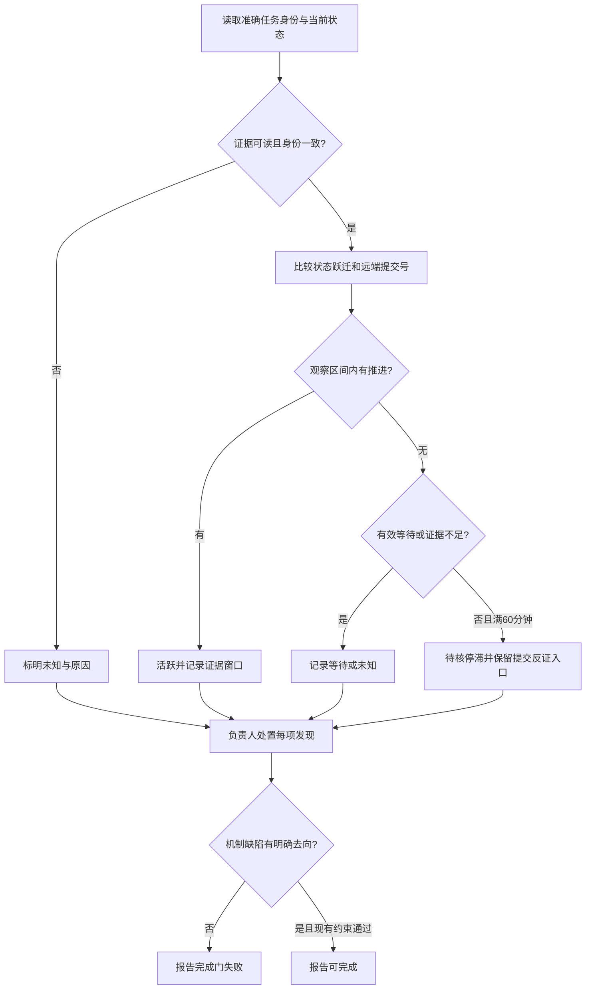

# FLY-1945 巡检证据与机制缺陷 — 实施计划
Issue: FLY-1945 (https://linear.app/geoforge3d/issue/FLY-1945/巡检体系-仪器假报修复-机制缺陷完成门并-1952)
日期: 2026-09-14
基于: research.md

设计基线：`579c79ed6`。本文件已于第 2 轮获得有效 `reviewVerdict=APPROVED`，审批回执见同目录 review-receipt.json；非阻塞建议见 follow-ups.md。设计节点不实现、不派工、不 merge、不部署。

## 1. Founder 概览

让“停滞”经得起提交记录反证，让每个机制问题都有明确去向，巡检才算完成。

仪器先确认正在观察哪一次任务，再看状态是否真的变化、该任务的远端分支是否推进。终端底栏不变不再等于停工。遇到机制问题，负责人选择链接已有修复单、新建带根因和验收反例的单，或解释为什么不立单。现有 Bridge 病根记录要求继续生效；创建任务不会自动派人。



可见验收：回放 8 月 20 日 21:37:49 那份报告，%7/#891 和 %8/#892 均得到活跃证据，冻结于 17:51 的停滞结论被撤销；删除任何一条机制 finding 的去向，完成门返回非零。活跃仅针对给定观察窗口，不代表任务已完成。

## 2. 改动边界与文件分工

| 文件 | 改动 |
|---|---|
| 新 packages/teamlead/src/patrol-continuity.ts | 只读状态/远端采集、纯判定函数、v2 sidecar I/O 与锁 |
| 新 scripts/flywheel-patrol-continuity.mjs | 按自身 realpath 找同 checkout dist 的可信启动器，沿用 dwell wrapper 形状 |
| scripts/lead-patrol-snapshot.sh | 一次调用 helper，为每个 owned pane 合并事实；不再用渲染行计时；输出 v2 骨架 |
| packages/teamlead/lead-rules-base/runner-patrol-rules.md | 语义、反证动作、机制三选一、原 awk 完成门扩展 |
| 新 packages/teamlead/src/__tests__/patrol-continuity.test.ts | 状态/时间/身份/远端/锁故障，纯函数与临时文件行为 |
| scripts/__tests__/lead-patrol-snapshot.test.sh | 接线测试、历史样本、零 pane、失败时完整性 |
| packages/teamlead/src/__tests__/fly369-patrol-rule.test.ts | 执行规则原文的 awk；三选一及负例 |
| scripts/package-onboard.sh / package-onboard-files.allow | helper 的 payload 闭包 |
| scripts/converge-flywheel-bin.sh | 新 launcher strict symlink、source sanity、安装枚举 |
| scripts/__tests__/fly1577-cmux-bin-closure.test.sh / package-onboard.test.sh | 源码 symlink 与打包执行形态 |
| .github/workflows/ci.yml | 仅在现有测试集合未自动覆盖新 helper 单测时加定向命令 |

不改生产 StateStore/CommDB schema 或生命周期状态机，不新增 patrol 定时器、远端写 API、工单派工器。保留所有 quota/menu/dead-pane/owner-scope/DWELL/磁盘检查，新增 helper 失败不能吞掉其他 finding。不修改 FLY-2080 补账权限或 founder ship/stop 权限。

## 3. 稳定身份和状态模型

### 3.1 身份

`ContinuityKey = canonicalDigest({project,lead,executionId,activationId,runId,nodeId,attempt,turnEpoch,bindingGeneration,repoSourceIdentity})`。repoSourceIdentity 固定本次采样选择的仓库来源类型、规范 repo identity 与 branch；注册表改仓或来源切换时重新建立归属窗口，不把不同 repo 的 head 相互比较。

从当前 owner index 中的 exact execution 出发，在 StateStore 只读关联 workflow_run_node 最新 attempt、workflow_execution_binding、workflow_activation_turn，并核对 CommDB three_stage_turn。现有 generalized activation 存在时禁止退化为 issue/title 匹配。非 workflow session 明确使用 `activationId=legacy:<executionId>`，run/node/attempt/epoch 为 null；仅在确认该 execution 没有 workflow binding 时使用，不把缺表或读取失败当 legacy。pane/target 仅作显示和 capture 路由，不参与任务身份。换 pane 不丢任务连续性；换 execution、activation 或 TURN episode 不继承旧任务停滞。

旧 parked execution 在 TURN 已移交时仍可记录当前 phase wait；不能把当前 writer 的提交说成旧 parked runner 的活动。先核对同一个 key 在整个比较区间均成立；跨 key 的远端 head 变化仅输出 `branch_activity`，不归功给任一 runner。

### 3.2 状态字段

`SemanticState = {sessionStatus,sessionStage,nodeState,turnRelation,effectiveWait}`，字段取源码当前枚举，不新造一套状态词典。`effectiveWait = null | {kind,id}`：精确未回答的 gate question、有效 parked declaration、合法 phase hold 分别使用 questionId／声明 episode／activation+epoch。parked 的有效性按 expires_at（毫秒）判断，只有续期不改变 episode。long_task 不等同等待，不豁免停滞；短文本 idle/旧 stop 不能充当有效等待。

只在稳定状态值或等待对象身份改变时更新 `lastStateChangeAtMs`。重复 stage set、重复 stop heartbeat、poll 时间、pane 动画和报告修改不更新它。初次可读采样只是建立观察基线，`lastStateChangeAtMs=null`，不伪造历史跃迁时间；`observedSinceMs` 独立记录。读到明确新状态则以本次采样时刻作为 observed transition 上界，字段说明不声称这是底层事件精确发生时间。

有序 stage/状态证据若显示采样间 A→B→A，按实际不同值的跃迁计入活动；禁止仅因 event seq 增加就重置时间。实施时只使用当前 stage 事件的经过验证 payload 和 exact node transition，无法解码的相关事件令该区间 unknown。源事件不存在/已被清理时不反推中间从未变化，以连续已读采样边界开始新的可判定窗口。

### 3.3 Sidecar v2

路径 `patrol-continuity/<lead>/<project>.v2.json`，权限 0600，机器维护。格式：

```text
{version:2, project, lead, sampledAtMs, entries:{[ContinuityKey]:{
  identity, semanticState, semanticDigest,
  observedSinceMs, lastStateChangeAtMs:null|integer,
  lastProgressObservedAtMs:null|integer, lastSuccessfulObservationAtMs,
  coverageSinceMs, sourcesComplete,
  sourceCursors:{stageEventId,workflowEventSeq},
  refs:[{repoIdentity,fullRef,headSha,observedAtMs}],
  lastVeto:{fromMs,toMs,source,oldHead,newHead}|null
}}}
```

`last_change_epoch` 保留为报告兼容字段：floor(max(observedSinceMs,lastStateChangeAtMs,lastProgressObservedAtMs)/1000)，并带 `last_change_basis=baseline|state_transition|remote_head`。它是可观察工作状态最后变化的上界，已不等于最后渲染行时间。`last_checked_epoch` 是采样时间，两者不得混淆。

复用 `acquireProcessLifetimeFileLock` 锁 `<project>.v2.lock`，在读旧值之前获取，覆盖采集/比较/原子 rename；锁冲突直接本次 unknown，最多 5 秒 readiness，禁止偷锁。只读数据库独立打开/关闭，远端请求期间没有生产写锁。lock onLost 取消采集且不得发布成功；rename 前检查仍持锁；finally 关闭所有 handle，已完成的 sidecar 文件才可投影到报告。所有远端探测合计最多 30 秒、并发最多 4，每个调用 5 秒，输出 1 MiB bound；超限按 affected identity unknown，不借超时给出 stalled。

旧 TSV 不迁移 epoch，不删除：首次 v2 建基线、标 `coverage=baseline`，不会继承 17:51 冻结值。坏 JSON、future timestamp、时钟回拨、错 project/lead/key 均 fail visible 并保留原文件；下一次修复后从新的完整观测重建 coverage。暂时读取失败保留最后成功状态，在 sidecar 写明确 coverage break（仅仍持锁且 sidecar 可读时），不刷新 last change；写失败同样本次 unknown。超过 90 分钟未采样视为 coverage gap，恢复时重新建立 coverage；不能用 outage 凑足 60 分钟。仅确认完整 owner inventory 时才移除已不再属于该 Lead 的 entries；不完整时不裁剪。

## 4. 提交反证与 STALLED 判定

### 4.1 取哪一个分支

读取 set-once worktree_binding_path/branch/generation。repo_baseline_set_json 是可选的 no_code 完成证明，不是普通实施节点启动的前置条件（`Blueprint.ts:1541-1547`）；workflow_node_pr_binding 通常在 gate-entry / completion 才产生，不能要求实施进行中先有它们。不可用 runner 可写的 sessions.branch 或整项目 PR 更新时间。

- 普通项目 root、尚无 PR binding：从本巡检已经选定的项目注册表中，按 exact projectName 取唯一 projectRepo（沿用 `lead-patrol-snapshot.sh:175-192` 的注册表信源及 safe_repo_slug 边界），与 set-once worktree_binding_branch 组成精确 GitHub root ref；GET `/repos/<owner>/<repo>/git/ref/heads/<encoded-branch>`。该信源标记 `source=project_registry_root`，不需要 repo_baseline_set_json。helper 自己只读该注册表并核对唯一匹配，不接受报告文字或 runner metadata 临时提交 repo slug；注册表缺失、重复 projectName、非法 slug、项目归属冲突或 binding generation 缺失才 unknown。项目注册表既有运维/Lead 管理边界不因本功能放宽。
- 如果可选 baseline 存在，验证 canonical encoding/digest 与受限路径；root `relative_path='.'` 的 remote 应与上述注册表 root 一致，才标记 `source=sealed_root`。坏 baseline 或 identity 冲突不得静默绕到注册表；baseline 为 null 是正常运行形态。非 GitHub remote → unknown。
- 已有 workflow_node_pr_binding：generation、target path、target_repo_identity/probe_repo_slug 必须相符，GET 精确 `/pulls/<number>` 验证 base repo，再使用响应中的 head.repo.full_name 和 head.ref GET 精确 ref。fork 的 head repo 可以不同；必须来自这个 exact PR 的当前响应。前后复读 PR head SHA 与 ref SHA 一致，否则 race → unknown。
- 多仓：注册表 root 是基础观测目标；已有 baseline inventory 或 exact target binding 声明的其他写入目标必须一并检查。为所有已绑定目标核对 exact PR/ref；baseline 中还有无法确定 branch 的 nested repo 时输出 `ref_binding_incomplete`，不可宣布整条 runner 无提交。允许单个已知目标的正证据 veto 停滞；全部否定必须覆盖全部已声明相关目标。不得把 fork/nested 目标悄悄替换成注册表 root；这些目标仍按上一条 exact PR 的 head repo/ref 规则核对。没有 baseline 本身不等于多仓未完整声明，也不构成 ref_binding_incomplete。
- ref 不存在、API 失败、限流、schema 错误、binding 缺失均 unknown；无 PR 不是“无 push”。不读取本地可变 origin 配置来覆盖已绑定 remote。

repo slug、branch/URL path、UUID、整数、SHA 全部边界验证；参数作为 execFile argv 传 gh，路径组件 encode，不拼 shell。只接收 GitHub 允许的固定 host，API 返回 URL 不用作任意抓取入口。SHA 为完整 40 位 hex（本项目当前 GitHub 格式），短 SHA 仅在标明历史数据的测试适配器中使用。日志与报告不含 token、raw terminal、remote credential 或提交正文。

### 4.2 判定顺序（唯一 reducer）

```text
1. ownership/state/key 不完整 → UNKNOWN，不能 STALLED。
2. exact same key 下任一远端 head 改变，或已验证的同期 push receipt
   → ACTIVE；记录 veto 的 [previousObservation,currentObservation] 区间；
      lastProgressObservedAtMs=currentObservation；本区间 STALLED 必须撤销。
3. semantic value 有真实跃迁 → ACTIVE，记录状态跃迁观察时间；
   已验证的最近状态/提交进展距今 <3600 秒也保持 ACTIVE。
4. effectiveWait 存在 → WAITING；仍输出 gate/park 身份，交接与 DWELL 照常检查。
5. 任一必要 source 缺失/过期/coverage 有缺口 → UNKNOWN。
6. 无变化，now - max(last_change,coverageSince) < 3600s → OBSERVING。
7. 满 3600s → STALLED_60M 候选，并保存原始区间和远端对照证据。
```

这里的 STALLED 是“指定区间内仪器未观察到状态/分支推进”的待核信号，不是证明期间绝无任何 push。轮询可能漏掉 A→B→A；任何后来取得的 exact 同期 push receipt 都能否定同一区间，必须修正本次判定和动作。不能用作者时间、committer 时间或 PR updated_at 作为 push receipt。当前版本不新建 GitHub webhook 历史库，也不声称能追溯每次推送。

Lead 对 STALLED 执行动作前，用同一 helper 的 `--recheck` 复读 exact key/ref；默认同一报告 interval，由报告中的机器字段传入而不是重跑整份 snapshot。正证据 → `result=stalled-falsified`，不发继续指令；有效等待 → `result=waiting-confirmed`；unknown → 不发送由 STALLED 驱动的 nudge，保留 UNAVAILABLE。只有仍为同一 episode 的 STALLED 候选才可按原有授权 send 要求状态说明；这不是 terminate/restart 权限。

`PANE_EVIDENCE` 追加 `schema=2 activity=<ACTIVE|WAITING|OBSERVING|UNKNOWN|STALLED_60M> semantic_sha256=<hash|unavailable> last_change_basis=... last_checked_epoch=... activity_evidence=<key>`；保留原 capture hash/line/byte/state_sha256（state_sha256 仍指渲染行，仅诊断）。另写 `ACTIVITY_EVIDENCE id=<key> exec=... activation=... interval_start=... interval_end=... source=state|remote_ref|baseline|unavailable ...`。机器原文不由 Lead 改写，Lead 只改 action/result；新正证据追加关联记录。任一 STALLED 记录缺对应 interval/ref 完整性字段，完成门失败。

每条 `activity=UNKNOWN` 都明确使 STEP 2 为 `UNAVAILABLE(<具体稳定原因>)`，对应 pane 保持 `action=REQUIRED result=UNSET`，交 Lead 定稿；不能当 clear，也不能生成 STALLED 驱动的唤醒。同一来源故障按 `(source,cause)` 汇总成一个 UNAVAILABLE_CAUSE 并列出 affected count，仍保留每条 pane 证据，不按每个 runner 重复建单。缺 optional baseline / 尚无 PR binding 的正常实施节点走注册表 root 的可用观测，**不产生 UNKNOWN 或 action=REQUIRED**。其他 quota/menu/dead-pane finding 保留其原动作，不能被这个结论覆盖。

## 5. 机制 finding 与三选一完成门

### 5.1 一份事实、一条闭合记录

snapshot 加 `patrol_schema=2`；第 6 步骨架提供 `MECHANISM_REVIEW result=LEAD-JUDGMENT-REQUIRED` 和注释示例，绝不预填“没有机制缺陷”。Lead 完成判断后写 `MECHANISM_REVIEW result=none|findings count=<n>`。每个发现用一条 `MECHANISM_DEFECT id=<64hex> step=<1-6|DWELL> class_key=<64hex> root_cause_ref=<token> counterexample_ref=<token>` 声明，再由同 id 的最终 FINDING 闭合。

id 按稳定 report identity + step + 首次 ordinal + class_key 生成，沿用 FLY-2080 marker 对同实例的身份语义；重排不能重新分配 id。class_key 复用既有错误码/guard/结构形状；没有代码错误码时明确使用 `mechanism_design` + 被违反规则的源码路径/symbol + 缺失转移形状，不能按标题相似度归类。根因可标为有证据支持的假设，但不得空白；验收反例必须描述具体输入、错误结果、应有结果。

新 FINDING 保留旧字段并添加 `id=<64hex> category=incident|mechanism_defect`；category 是缺陷类别，不由 `bridge_problem` 推导。机制项追加：

```text
disposition=existing|created|no_issue
repair_issue=<FLY-number|n/a>
repair_receipt=<uuid|n/a>
disposition_ref=<stable-token>
```

`disposition_ref` 精确关联报告内唯一 `MECHANISM_DISPOSITION <JSON>` 行：`{ref,findingId,mode,reason,issueIdentifier,issueUuid,issueUrl,receiptUuid,verifiedAt,rootCause,counterexample,dedupEvidence,linear_record}`。reason/rootCause/counterexample 是 JSON 字符串允许正常中文及空格，必须非空 trim（reason ≥10 字、rootCause/counterexample 各≥10 字）；禁止占位词 TODO/TBD/UNSET。`linear_record=issue|comment|not_applicable`，最后一种仅对无相关 Linear 源 issue 的 no_issue 合法，原因必须说明为何无落点。避免把任意正文拼到 shell/awk 字段。新的 JSON 检查由 helper `validate-report --report <path>` 执行，旧 awk 仍为同一完成门的第一层结构检查。

### 5.2 三条合法路径

| mode | 必须的证据 | 不能替代的东西 |
|---|---|---|
| existing | 完整去重结果；精确已存在 issue 的 identifier/UUID/URL；报告的根因与反例；本次关联 comment/description marker 回读 receipt | 只填任意 ticket ID、不相关工单、仅 memory 链接 |
| created | 先完整查重=0；新 issue 根因+验收反例+class_key+finding marker；fresh read 验证与真实 UUID | 创建请求成功但回读失败、带默认调度的 create+activate |
| no_issue | 具体不立原因、根因与反例，报告内同 finding 的 JSON 记录；若有相关 Linear 源 issue，把原因以同 marker comment 记到该 issue 并留 receipt | Linear 失败、暂时没查、先记 memory、稍后再说 |

`no_issue` 本来就允许没有修复单；不得强制为了“不立单”再创建修复单。无 Linear 源 issue 时必须写 `linear_record=not_applicable` 的理由，保留用户明确允许的报告原因出口，不产生 memory 账。`bridge_problem=yes` 时仍必须满足原 FLY-2080 病根子单/occurrence 规则，no_issue 只表示不额外开修复工作；`epic=unavailable` 不能代替新的 disposition。保留未完成原因不等于允许机械完成。

### 5.3 Linear 去重与写后验证

先按既有 class_key 完整分页查询 FLY-2072（Bridge 类）或当前项目含 archived 的机制修复候选（非 Bridge 类），逐张读取完整 description。若已有明确关联的修复单，也要 fresh read 关联 marker/根因与 scope；不要求把它迁到 FLY-2072，但 Bridge 的病根账仍保留。0 命中新建，1 命中复用，>1 命中 `mechanism_class_duplicate` 并停写；不使用 Bridge 的 250 条无 continuation 列表伪装全集。

同一 Bridge 类别子单若已有根因，直接补验收反例并用作 repair_issue，避免建两个同义单。追加实例前分页 comments 查本次 marker；网络超时后的重试先回读，不盲重发。写后复读 identifier/UUID/project/parent（若适用）/class_key/marker/正文；exact Bridge lookup 只能辅助拿 UUID，parent/team 仍由完整 Linear get 检查。

沿用 Lead 负责自己报告的写入范围；跨 Lead 同 class_key 使用已有 Linear 命中单作为共享账。现有 Linear API 不支持唯一约束，不能保证两个并发首次创建原子互斥：创建后必须再次全量同 key 查重，若 >1 则停止封口，Lead 选 canonical 单并在重复单留下 duplicate 关联，复读 canonical 后才闭合。此处理不派工、不改 workflow dispatch state。不可把 create endpoint 不支持的 state 参数当成已生效；使用既有人工 draft/backlog 建单路径，禁止紧跟 activation/dispatch。

### 5.4 可执行 gate（必须实际失败）

保留 `FLY-2080-FINDING-GATE-BEGIN/END` awk 哨兵和所有旧检查；value parser 改为预解析每行 token，重复 key、未知 category、缺 id 失败。v2 新报告必须有唯一 schema=2 和唯一 MECHANISM_REVIEW。对每个 MECHANISM_DEFECT，恰好一个同 id category=mechanism_defect FINDING；反向也一一对应；count 必须等于 distinct 声明数。零机制合法需显式 result=none count=0。普通 incident 仍遵循旧 A/B 门。

再执行 `flywheel-patrol-continuity validate-report --report "$REPORT_PATH"` 校验每条 JSON disposition、严格 field allowlist、mode 与 FINDING 一致、引用唯一、根因/反例/原因非空、existing/created 的 issue/UUID/URL 格式与关联 receipt 一致；同 id 不得用多条模式通过。helper 无法启动/坏 JSON/未解析行返回非零。它读取已回读的 Linear 证据，验证报告闭合，不会替 Lead 完成语义判断，也不把自述 receipt 当服务端授权。

完整完成门 = 旧基本完整性 + 旧磁盘 + 扩展 awk + helper 报告校验，全为 0。任一失败不得发送“巡检完成”；保留报告并按 UNAVAILABLE 原流程处理。不能通过把 STEP 改 OK 或删除 category 而使已声明的 MECHANISM_DEFECT 消失。工具无法识别尚未被 Lead 声明的自然语言问题，规则要求所有机制问题先声明，再处置；不声称本设计自动发现所有机制缺陷。

## 6. TDD 实施步骤

每组遵循：先加下面指定反例并运行确认失败 → 最小实现 → 同组转绿 → 提交。测试必须执行真实 reducer/awk/helper，不以文档含词代替行为。

1. **仪器反例**：在新 `patrol-continuity.test.ts` 导入待实现的 `evaluateContinuity(previous,current)` 与 `validatePatrolReport(text)`；将 `historical-observations.json` 作为脱敏来源复制到测试 fixture。回放四个采样：21:37:49 时 %7 为新 head 的 ACTIVE；%8 最近 head 变化观察为 20:39:40，相隔 3489 秒，仍有该窗口活动，输出 ACTIVE（ACTIVE 保持到最近进展满 3600 秒）。断言两行不存在 STALLED；last_change_basis=remote_head，epoch 不为 1787248266。保留真实日期，禁止把样本改成更容易通过的时间。
2. **纯 reducer**：实现第 3/4 节决策，单位统一 milliseconds，报告转换 seconds；输入接口为上述 Identity、SemanticState、probe result 的 discriminated union；所有 source 失败显式 unknown。ACTIVE 的持续窗口在 lastProgressObservedAtMs/lastStateChangeAtMs 后 <3600 秒，否则进入 WAITING/OBSERVING/STALLED 分支；等待有新推进时可报告 ACTIVE 并同时显示 wait，不能误发 nudge。重复 heartbeat 不改时间。
3. **采集/持久化**：用 `better-sqlite3` readonly+fileMustExist 打开数据库，SQL 用绑定参数；查询 exact owned ids，读取同巡检注册表的唯一 projectRepo 并选定 source，关闭数据库后 remote probe，结束前重读身份和 repo source 防止采样中 TURN/注册表变化。加入 kernel lock + 原子 v2 JSON；注入 clock/gh/readonly query 用于测试，生产 launcher 不接受任意模块路径。失锁、文件写失败、remote race 都不能产出成功的 STALLED。必须加真实临时 DB 的 implement fixture：有效 immutable binding、baseline=null、没有任何 PR binding、stage=implement、有效 TURN holder、注册表 root 合法；fake gh 返回精确 branch 完整 SHA。连续同 head/同状态满 3600 秒时生成 STALLED_60M；在区间内改变 head 时 ACTIVE；缺 optional 数据均不得出现 ref_binding_incomplete 或 UNKNOWN。测试经过真实 collector→sidecar→snapshot 接线，不能只喂 reducer 已解析好的 ref。
4. **snapshot 接线**：helper 一次输出所有当前 owned executions 的 JSON facts；每条 PANE_EVIDENCE 消费其 exact id 的结果，capture 仍按旧权限和完整性处理。helper 总失败为每条 pane 输出 UNKNOWN+action=REQUIRED，不少行。加入机制声明骨架；不修改数值 STEP 数量。
5. **机制门**：先用 `current-gate-gap.txt` 的缺 disposition 输入确认失败；加入第 5 节 parser、引用关系、三条模式和说明模板。扩展旧 awk 而不移除旧 gate；同步既有 extraction fixture 加 schema/category/id，避免旧样本误报。`validate-report` 必须同一入口可单独测试，不触发状态采集/sidecar 写。
6. **发布闭包与综合回归**：实现 realpath launcher，mode 100755；增加 package allow/source/converge strict symlink。通过临时 state 目录以源路径和托管 bin 路径运行相同 fixture，验证包内 dist 模块能加载。全部定向检查通过后写实现证据交 QA，后续部署由 updater 独立负责。

## 7. 必须覆盖的行为矩阵

| 场景 | 期望 |
|---|---|
| %7/#891、%8/#892 原历史序列 | 21:37 两行 ACTIVE，旧冻结停滞被反证 |
| 底栏不变、状态跃迁/remote head 变化 | last_change 前进；ACTIVE |
| 仅 spinner/时钟/报告 action 改变 | 不刷新语义计时 |
| 3600 秒同状态且完整 ref 核对；3599 秒 | 前者候选 STALLED；后者非 STALLED |
| implement 节点有 immutable binding、无 baseline、无 PR binding | 注册表 root + immutable branch 可探测；同 head 3600 秒 STALLED，head 推进 ACTIVE；无 UNKNOWN 噪声 |
| 上述 fixture 的注册表重复/缺失/非法 slug、baseline 与注册表冲突 | 明确 UNKNOWN，STEP 2 UNAVAILABLE；affected cause 聚合，不制造每 runner 一张单 |
| 采样中注册表 root repo 变化 | repoSourceIdentity 改变，旧新 repo 的 SHA 不比较，不冒充进展 |
| 旧 commit 现在 push；PR 仅评论更新时间变化 | head 变化计活动；PR updated_at 不计活动 |
| local commit 未 push | 不冒充远端提交证据；状态/本地其他信号也不得伪造 push |
| no PR、fork、closed PR、nested repo、ref 404 | exact ref 核对；缺绑定/删 ref/缺目标为 UNKNOWN |
| 两 active execution 共享分支；TURN 更换 | 不串归属；新 key 重新基线，其他 runner 提交不是本 runner 证明 |
| target 被新 execution 复用、常驻 reactivation | 不继承旧 epoch |
| parked 续期、过期、gate 关闭、A→B→A | 续期不算推进；过期/关闭新跃迁；真实中间跃迁算推进 |
| remote/source 超时、clock 回拨、坏 sidecar、writer 失锁、乱序 | 显式 UNKNOWN；不清空历史或伪装新进展 |
| 相同 key 并发采样、SIGKILL 锁持有者 | 后者不覆盖新值；死亡后锁自然释放 |
| report 含机制声明但无去向 | gate 非零（核心验收） |
| 三种完整合法去向 | gate 为 0；原 Bridge 约束也必须通过 |
| 同 STEP 两 finding 只有一项闭合 | gate 非零 |
| 重复/未知字段、重复 id、category 删除、空白原因、悬空 JSON ref | gate 非零 |
| Linear 不可用冒充 no_issue；分页断裂、写后 marker 不见 | gate 非零，不派工 |
| Bridge 病根单同时作 repair issue | 两套 receipt 合法闭合，不新建重复单 |
| 零 pane / 零机制 / 其他 quota finding / DWELL | 行数与旧检查均保留 |

## 8. 精确验证命令与证据

实施者先确认目标 checkout 的 dist 可用；必要时按依赖顺序构建（不运行无关根测试）：

```sh
pnpm --filter flywheel-teamlead... build
pnpm --filter flywheel-teamlead exec vitest run src/__tests__/patrol-continuity.test.ts src/__tests__/fly369-patrol-rule.test.ts src/__tests__/lead-rules-bundle.test.ts
bash scripts/__tests__/lead-patrol-snapshot.test.sh
bash scripts/__tests__/fly1577-cmux-bin-closure.test.sh
bash scripts/__tests__/package-onboard.test.sh
git diff --check
```

预期测试全 0。先保存 RED 输出和最小变更后的 GREEN 输出；历史 fixture 必须保持源 hash 与原始观察，演示规则缺去向时非零。不必对本设计文档运行生产功能测试；当前已执行的是旧 gate 缺口复现，不能写“实现测试通过”。

QA 在临时 DB/假 gh 之外，再用获授权的真实新巡检核对 host helper source/version、bindings、两次 exact ref 观测、最终报告 gate 退出码；没有生产授权时如实记“未做生产验证”。merge 与部署分离，本节点不重启。

## 9. 迁移、回滚和风险

v2 规则和 helper/snapshot 同一发布单元切换。新规则遇到旧 schema 明确 `report_schema_mismatch`，不能静默按旧门宣称完成；历史旧报告只读不改。若回滚，整体回退这三个组件，保留 v2 文件供追查，旧工具仍读旧 TSV；回滚恢复旧假报风险，运营必须把 STALLED 当未确认，不能声称问题已修复。部署/回滚执行均由后续发布流程决定。

主要取舍：接受精确 ref 轮询的时间区间，避免新增 webhook 历史库；接受依赖不可读时 UNKNOWN，避免错误唤醒；保留本地可执行规则门，不扩大成服务端巡检框架；Linear 非原子去重的并发剩余风险通过写后查重和拒绝封口显式处理。no_issue 原因仍是 Lead 的判断，机械门只强制留证，不代表赞同该判断。

## 10. 设计交付审计

- 范围两部分均由第 3/4 与第 5 节落地；历史验收固定于第 6/7 节。
- exploration/research/plan + 历史脱敏证据与 gate 反例均提交到同目录。
- 提交/推送后通过指定 gate + request-review 请求有效设计审批；CHANGES 只修 blocker，APPROVED advisories 留 follow-up 并报告 Lead。
- APPROVED 后生成最终 Apple-light HTML，Mermaid 本地 SVG、每节评论、本地隔离存储、1800 字分段复制、单 nonce script；本地失败按任务明确的 diagram fallback 交付。
- HTML 提交推送、publish-only、托管 HTTP/CSP 验证和 DESIGN-HTML 回执齐全后，执行 exact `complete --route phase_design_complete`，随后 park 保持 phase controller，不能把阶段完成写成 issue 已实现。

## 11. 首轮阻塞项修订

`remote-ref-source-unreachable-in-prod`（HIGH）：原设计错误地把 optional no_code baseline / 完成时 PR binding 当成运行期必要输入。当前源码和 2026-09-14 只读库复核确认普通 running sessions 大多没有 baseline（本次复核 17 个 running 中仅 1 个有，17 个均有 immutable binding）。第 4.1 节加入既有项目注册表 root + set-once branch 的运行期来源，第 4.2 节明确 UNKNOWN 的状态/动作/聚合影响，第 6/7 节加入无 baseline、无 PR binding 的 collector 接线正反例。仅修改这个阻塞项；六个 MEDIUM/LOW advisories 原样保留在 follow-ups.md 供 Lead 决定。
