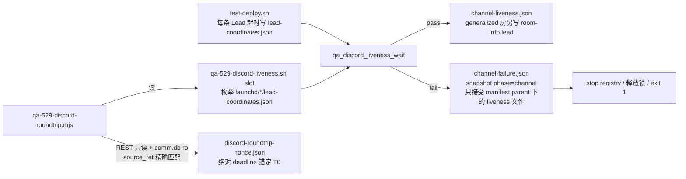

# FLY-1948 slot Lead Discord 通道活连接 — 实施计划

Issue: FLY-1948 (https://linear.app/geoforge3d/issue/FLY-1948/529房缺陷-slot-lead-的-discord-通道适配器无活连接-founderlead-整圈验不通)
日期: 2026-09-14
基于: research.md

**Version**: v1.57.0
**Status**: lead-accepted (v4;Codex R1–R3 吸收,R4 池耗尽未跑,Gemini v4 APPROVED,Lead 裁定 c04d28e5)

## 0. 目标与非目标

**目标**:529 房起 slot Lead 后,房间对「Discord 通道活连接」fail-closed 断言(三件硬证据 + 代际绑定 + 生命周期状态),失败时留可分型、有来源校验的快照;并提供一条 founder→Lead→founder 的 challenge/response 整圈探针,把「N 秒内进会话并可回」变成带绝对 deadline 的证据文件。

**非目标**(明写,Codex 与 QA 都按此判):
- 不改 Discord 插件(fork 仓、`server.ts`、`.mcp.json`、版本号)。
- 不改生产 Lead 的启动行为:`claude-lead.sh` 只多写**分类**日志(C5),不写 pane 原文,不改超时/按键/退出码。
- 不改 Bridge、StateStore、CommDB schema、launchd 生产单元、`qa-slot-env-contract.json` 白名单。
- 不扩大 `room-info.json` 的发布域(它参与 FLY-2211 reown 排除,只在 generalized 房存在)。
- 不把「founder 发消息」自动化:slot 房型下只能由人发,探针负责等待与采证。
- 不押注 8-20 未复现的根因去改拉起链内部(exploration §5.3)。
- 不声称测到「真实入箱时刻」:CommDB 没有这一列,v2 用轮询观察上界代替(§6.2)。

## 1. 假设(实现前逐条核)

| # | 假设 | 核法 |
|---|---|---|
| A1 | slot Lead 的 claude 进程 argv 以 `claude --agent <agentId>` 开头,进程 env 含 `DISCORD_STATE_DIR=<dir>`;适配器从它继承同一 env | 本次实测成立;实现时用 `qa_launchd_process_env_has` 复核 |
| A2 | 适配器当前形状 = `bun <abs>/plugins/cache/<marketplace>/discord/<ver>/server.ts`(reap 库的形状 A) | 本次实测 0.0.7;新库**只**认此形状(§3.1),不 source reap 库 |
| A3 | `gateway-health.log` 每行 `<ISO> <message>`;生命周期文案:`gateway shard <n> ready` / `… resumed; replayed=<k>` / `… reconnecting` / `… disconnected permanently; …` / `reconnect deadline elapsed` | 插件 0.0.7 `gateway-health.ts:66-118` |
| A4 | mailbox 行:`type='discord_chat'`、`source_ref = 'chat:<leadId>:<messageId>'`(`chatDeliveryId`)、`from_agent ∈ {'founder','discord:<authorId>'}`、`created_at` = Discord 消息 ts(**不是**入箱时刻)、`notified_at` 由 Bridge Lead lane 投递成功时写、`delivered_at` 只在 Lead batch ACK 经 protocol ingress 后写;`content` 首行是 `encodeChatDeliveryEnvelope`,可用 `parseChatDeliveryEnvelope` 解出 `chatId` / `replyRoute` / `replyChannelId` | `discord-chat-ingest.ts:133-170`、`chat-delivery-envelope.ts:58,195,201`、`mailbox-queue.ts:1639-1699,1759-1794`、`protocol-ingress.ts:53-75` |
| A5 | 现有 room-info 读者只校验 `schemaVersion === 1` 与既有键 | `qa-generalized-e2e-lib.mjs:140-174`、`scripts/qa/fly2446-two-lead-run.mjs:239-258` |
| A6 | CI 是 ubuntu;`ps`/`lsof`/`/proc` 格式与 macOS 不同 | 新库的**全部**外部观测(ps 快照、lsof、env 探针、pane 捕获、进程 lstart)经注入 seam;不依赖 reap 库的 `_adapter_cwd` |
| A7 | root `package.json` 无 `better-sqlite3`;脚本用 `createRequire(<repo>/packages/teamlead/package.json)` 解析 | `scripts/qa-529-generalized-e2e.mjs:1338-1351` |
| A10 | `flywheel-comm` 的 package exports 含 `./discord-chat-ingest` 但**不含** `./chat-delivery-envelope`;`src/` 直接 import 会 `ERR_MODULE_NOT_FOUND`;529 preflight 只 build config/edge-worker/claude-runner/teamlead,不 build flywheel-comm | `packages/flywheel-comm/package.json` exports;`test-deploy.sh:506-530` |
| A11 | 裸 `ps -o lstart=` 随时区变化且只到秒;repo canonical 用 `TZ=UTC LC_ALL=C`;`launchd/<agentId>/body-status.json.startedAt` 是毫秒 UTC,由 body 启动时写 | `qa-launchd-lead.sh:970-979`;`qa-lead-diagnostics.py:33-37,441` |
| A12 | mirror 模式把 `CHAT_CHANNEL_ID` 改写为共享镜像频道;roundtable 模式**不**改写它,`ROUNDTABLE_CHANNEL_ID` 只作为 cross-dept 频道注入;插件对 bot 作者先查目标 `access.json.allowBots`,不在名单直接丢弃 | `test-deploy.sh:754-762,1010-1052,1234-1258`;插件 `server.ts:1597-1607` |
| A8 | `~/.flywheel/logs/lead-<id>-startup.log` 由 launcher `append`,无 chmod,实测 0644 | `claude-lead.sh:1598-1604`;因此 C5 不得写 pane 原文 |
| A9 | roundtable 顶层入站被插件改路由到 thread,交给 Lead 的 `chat_id` 是 thread id | 插件 `server.ts:1630-1669` |

## 2. 交付物总览



| chunk | 内容 | 文件 |
|---|---|---|
| C1 | 通道活连接库(纯函数,bash 3.2,观测全注入,代际绑定,生命周期状态) | 新 `scripts/lib/qa-discord-liveness.sh` |
| C2 | 每 Lead 坐标文件(含 mode 与 per-mode 探针频道)+ 就绪门接线 + `channel` phase 快照(带来源校验)+ generalized room-info `lead` 字段 + preflight 增 build flywheel-comm | `scripts/test-deploy.sh`、`scripts/lib/qa-launchd-lead.sh`、`scripts/lib/qa-lead-diagnostics.py`、`scripts/lib/qa-room.sh`、`scripts/lib/qa-lead-artifacts.sh` |
| C2b | `parseChatDeliveryEnvelope` 公开 re-export(纯 re-export,零行为变化) | `packages/flywheel-comm/src/discord-chat-ingest.ts` |
| C3 | 独立探针 CLI(坐标来自 C2 的坐标文件,不依赖 room-info) | 新 `scripts/qa-529-discord-liveness.sh` |
| C4 | 整圈探针(challenge/response、绝对 deadline、精确行匹配、回复坐标来自 envelope) | 新 `scripts/qa-529-discord-roundtrip.mjs` |
| C5 | poller `NOT_SEEN` 分类日志(无原文) | `packages/teamlead/scripts/claude-lead.sh` |
| C6 | 路书、房间烟测(逐 Lead)、CI 登记(含 `qa-room-env.test.sh`) | `doc/qa/framework/529-room-playbook.md`、`scripts/qa-fly-1189-room-smoke.sh`、`.github/workflows/ci.yml` |

## 3. C1 — `scripts/lib/qa-discord-liveness.sh`

### 3.1 观测 seam(全部可注入;默认值 = 生产命令)

```bash
FLYWHEEL_QA_PS_SNAPSHOT_CMD    # 默认 ps axww -o pid= -o ppid= -o command=
FLYWHEEL_QA_PS_LSTART_CMD      # 默认 TZ=UTC LC_ALL=C /bin/ps -p <pid> -o lstart=   (与 qa_launchd_process_incarnation 同一写法;秒精度)
FLYWHEEL_QA_LSOF_CMD           # 默认 lsof -nP -iTCP -a -sTCP:ESTABLISHED -p <pid>
FLYWHEEL_QA_ENV_HAS_CMD        # 默认 qa_launchd_process_env_has <pid> DISCORD_STATE_DIR <dir>
FLYWHEEL_QA_PANE_CAPTURE_CMD   # 默认 tmux -S <socket> capture-pane -t '=main:main.%0' -p
FLYWHEEL_QA_LAUNCHD_PID_CMD    # 默认 qa_launchd_lead_pid_exact <launchdLabel>(内部走 FLYWHEEL_QA_LAUNCHCTL);stdout 一个正整数 pid = 命中,空/rc≠0 = 未命中,rc≥2 = 不可用
```

适配器匹配器**内置**于本库(`qa_discord_is_adapter_argv <command>`):只认 argv 第一个 token 为 `bun` 或 `*/bun`,第二个 token 为绝对路径且匹配 `*/plugins/cache/*/discord/*/server.ts`。不 source `reap-orphan-adapters.sh`(它 source 时定义 fallback logger、写全局变量、source kill-ledger,且形状 C 会直接调真实 `lsof` 取 cwd,绕过注入)。兼容范围写死:legacy `bun run --cwd … start` 与裸 `server.ts` 形状**不认**,并在 `reason=adapter_missing` 的 evidence 里附「命中 reap 形状 B/C 但被本库拒绝」的 argv 列表,便于日后发现形状漂移。

### 3.2 接口

```bash
qa_discord_liveness_probe <coordsJson> <sinceIso> <outJson>
#   一次判定;总是写 outJson(0600,.tmp.$$ → mv);exit 0=live,1=not live,2=probe_unavailable,3=not_applicable
qa_discord_liveness_wait  <coordsJson> <sinceIso> <outJson> <timeoutSec>
#   2s 轮询 probe;首个 0 即返回 0;超时返回最后一次 rc;outJson 保留最后一次判定
```

`coordsJson` = C2 写的 `lead-coordinates.json`(§4.1)。`sinceIso` 是**请求**的 since;有效 since 见 §3.3 第 3 步。

### 3.3 判定顺序与 reason(优先级即顺序;合同共 **12** 个 reason + `null`)

1. `coordsJson.carrier != "claude-code"` → `not_applicable` (`live: null`, rc 3)。Codex 载体在这里显式退出,不会落到 `claude_process_missing`。
2. 任一观测 seam 不可用(命令不存在 / rc≥2 / ps 快照输出 >4MiB、其他单次观测输出 >64KiB / 候选数 >32)→ `probe_unavailable`,rc 2。永不当 pass。
3. 找 claude:ps 快照里 argv 前两个 token 为 `claude --agent <agentId>` 且 env `DISCORD_STATE_DIR==<discordStateDir>` 的 pid。0 个 → `claude_process_missing`;>1 → `claude_process_ambiguous`。代际下界(全部 UTC):
   - `claude.startedAt` = `TZ=UTC LC_ALL=C ps -o lstart=` 解析后的**整秒**时刻;不可得 → `probe_unavailable`;
   - `body.startedAt` = 坐标里 `bodyStatusPath`(`launchd/<agentId>/body-status.json`)的毫秒 `startedAt`。**采纳条件**(三方一致,与 `qa-lead-diagnostics.py:body_snapshot` 同判定,但全部经 seam):(i) 该文件为 regular、non-symlink、≤64KB、`schemaVersion==1`;(ii) `carrierPid` == 坐标 `manifestPath`(固定为坐标同目录的 `manifest.json`)里的 `.pid`;(iii) `carrierPid` == `FLYWHEEL_QA_LAUNCHD_PID_CMD <launchdLabel>` 返回的 pid。任一不成立 → 忽略 `body.startedAt`(只降为秒精度,不假绿);launchd seam rc≥2 → `probe_unavailable`。测试:三方一致时采纳;manifest 不符、launchd 不符、symlink/非法文件三种各一例,均不采纳且结果不为 live。
   - **有效 since = max(请求 since, claude.startedAt, body.startedAt)**。
   - 秒精度的处理是 fail-closed 的:gateway 行的 ISO 若落在 `[claude.startedAt, claude.startedAt + 1s)` 这一秒内,视为 **generation-ambiguous**,不作任何证据(既不算 ready 也不算 degraded);ready/resumed 必须满足 `ISO ≥ claude.startedAt + 1s`(适配器要过 `bun install` + login,实测比 claude 晚 ≥1s,不会误伤);高精度 `--since` 显式给出时以它为准。
4. 找适配器:快照里 `qa_discord_is_adapter_argv` 命中且 env `DISCORD_STATE_DIR==<dir>` 的集合 S。
   - S 空:pane 同时含 `WARNING: Loading development channels` 与 `I am using this for local development` → `dev_channels_dialog_parked`;否则 `adapter_missing`。
   - S 中存在 ppid ≠ claudePid → `adapter_orphaned`(附 ppid;ppid==1 单列)。
   - S 中 ppid==claudePid 的**多于一条** → `adapter_process_ambiguous`(重复适配器共用同一 token/网关正是 reap 库描述的连接竞争与入站丢失故障面,「都不是孤儿」不等于安全;evidence 列出全部 pid)。
   - 恰好一条 → adapterPid;其 `lstart`(同一 UTC seam,整秒)必须 ≥ claude.startedAt,否则 `adapter_orphaned`。
   - **适配器代际 cutoff**:`gatewayCutoff = max(有效 since, adapter.startedAt)`。第 6 步的网关证据只认 ISO ≥ gatewayCutoff + 1s 的行;落在 `[adapter.startedAt, adapter.startedAt + 1s)` 的行同样 generation-ambiguous、不作证据。理由:`gateway-health.log` 按 `DISCORD_STATE_DIR` 共享、只追加、新适配器启动不清空,同一 claude 下适配器 A 写过 ready 后退出、B 以新 pid 起来且已有一条 443(REST 也算)时,A 的 ready 仍晚于 claude/body cutoff;不绑到 B 的代际就会拼出假绿。负例:claude pid 不变、旧适配器 ready 在前、新适配器 pid 有 443 无自己的 ready → `gateway_ready_stale`,不得 live。
5. `lsof` 对 adapterPid 无 `:443 (ESTABLISHED)` → `gateway_socket_missing`。443 是**必要非充分**(REST 也走 443),所以第 6 步才是网关真相;evidence 记录条数与对端。
6. 扫 `gateway-health.log` 与 `.log.1`,只看 ISO ≥ gatewayCutoff + 1s 的行,求**最新生命周期状态**。跨轮转的 canonical 合并:
   - writer 轮转 = 删旧 `.log.1` → 当前 log rename 成 `.log.1` → 新当前 log 追加(`gateway-health-files.ts:51-60`),所以 `.log.1` 恒为较老段;
   - 读取顺序固定 **先 `.log.1` 后当前 log**,每个文件 ≤256KB+1 行;读前读后各取一次 `(inode, size)`,任一变化即视为读期间发生轮转,重试最多 3 次,仍不稳定 → `probe_unavailable`;
   - 合并后按解析出的 ISO 升序,ISO 相同时按 `(文件序: .log.1 < 当前, 行序)` 稳定排序,再取最后一条生命周期行为最新状态;
   - 测试两条跨文件用例:`.log.1` 末尾 ready、当前 log 已 reconnecting → `gateway_degraded`;`.log.1` 末尾 reconnecting、当前 log 已 resumed → live。
   逐行规则:
   - 匹配 `gateway shard <n> ready` 或 `gateway shard <n> resumed; replayed=<k>` → state=`ready`,记 `gateway.readyAt`;
   - 匹配 `gateway shard <n> reconnecting`、`… disconnected permanently; …`、`… reconnect deadline elapsed` → state=`degraded`;
   - 其他行忽略。
   - 一行生命周期都没有:log 里存在早于 gatewayCutoff + 1s 的 ready → `gateway_ready_stale`;否则 `gateway_ready_missing`。
   - 最新状态为 `degraded` → `gateway_degraded`(附最后 3 条生命周期行)。
7. 全过 → `live: true, reason: null`。

### 3.4 `channel-liveness.json` schema(v1)

```json
{
  "schemaVersion": 1, "agentId": "flywheel-test-2", "carrier": "claude-code",
  "live": true, "reason": null, "observedAt": "…Z",
  "since": { "requested": "…Z", "effective": "…Z", "claudeStartSecond": "…Z", "bodyStartedAt": "…Z|null", "bodyStartAdopted": true, "gatewayCutoff": "…Z", "ambiguousLinesIgnored": 0, "logSnapshotRetries": 0 },
  "claude": { "pid": 86588, "startedAt": "…Z" },
  "adapter": { "pid": 87270, "ppid": 86588, "startedAt": "…Z", "argv": "bun /…/discord/0.0.7/server.ts", "others": [], "rejectedLegacyShapes": [] },
  "socket": { "established": 2, "peers": ["162.159.138.232:443"] },
  "gateway": { "state": "ready", "readyAt": "…Z", "logPath": "…/gateway-health.log", "lastLifecycle": ["…"] },
  "pollerVerdict": "confirmed",
  "evidence": { "paneTail": ["…"], "gatewayLogTail": ["…"], "startupLogSince": ["…"] }
}
```

- `pollerVerdict` 从 `~/.flywheel/logs/lead-<agentId>-startup.log` 取有效 since 之后最后一条 `dialog-poller-v2:` 行归类(`confirmed | not_seen | send_failed | unverified | pane_gone | no_tmux | none`);只做分型。
- `evidence.*` 每项 ≤40 行、每行 ≤200 字节。脱敏器 `qa_discord_redact_line`:整行替换为 `<redacted>` 当且仅当命中任一:(a) 不区分大小写含 `token|secret|password|authorization|bearer|api[_-]?key`;(b) 含 ≥24 连续 `[A-Za-z0-9_./+=-]` 且其中含数字与字母的串(疑似凭据/JWT/snowflake 组合)。负向测试用 `TEST_BOT_TOKEN_2=MTIz…`、`Bearer xyz`、一段 JWT 三件套证明整行消失。
- 文件 0600、原子写;只写在 `launchd/<agentId>/` 下(与 manifest 同目录)。

## 4. C2 — 房间接线

### 4.1 每 Lead 坐标文件 `launchd/<agentId>/lead-coordinates.json`(新,0600)

由 `qa_slot_start_lead` 在写 manifest 的同一步骤写(`scripts/lib/qa-lead-artifacts.sh` 新增 `qa_lead_write_coordinates`),main 与 extra Lead、claude 与 Codex 载体**都写**,与 generalized / room-info / reown 无关:

```json
{ "schemaVersion": 1, "slot": 2, "agentId": "flywheel-test-2", "carrier": "claude-code",
  "mode": "slot", "startedAt": "2026-09-14T20:24:17Z",
  "discordStateDir": "/tmp/flywheel-test-slot-2/discord-state",
  "socketPath": "/tmp/flywheel-test-slot-2/q/2/sock/….sock",
  "primaryChatChannelId": "1493080993173737583", "mirrorChannelId": null, "roundtableChannelId": null,
  "roundtripChannelId": "1493080993173737583",
  "botUserId": "1493072948683341976", "projectName": "test-slot-2",
  "commDbPath": "/tmp/flywheel-test-slot-2/state/comm/test-slot-2/comm.db",
  "bodyStatusPath": "/tmp/flywheel-test-slot-2/launchd/flywheel-test-2/body-status.json",
  "manifestPath": "/tmp/flywheel-test-slot-2/launchd/flywheel-test-2/manifest.json",
  "launchdLabel": "com.flywheel.qa.lead.slot-2.flywheel-test-2",
  "livenessPath": "/tmp/flywheel-test-slot-2/launchd/flywheel-test-2/channel-liveness.json" }
```

- `mode` / 三个频道字段由 `test-deploy.sh` 用**已解析**的 `MODE`、`CHAT_CHANNEL_ID`(mirror 下已被改写为镜像频道)、`MIRROR_CHANNEL_ID`、`ROUNDTABLE_CHANNEL_ID` 显式传入 writer,不从 ambient env 推断;extra Lead 用它自己那份解析值。
- `roundtripChannelId` 的选择函数写死在 writer:`slot → primaryChatChannelId`;`mirror → mirrorChannelId`(此时与 primary 相同);`roundtable → roundtableChannelId`。C4 只用这个字段;六类坐标夹具除形状外必须断言每种 mode 的**精确**探针频道。

- `botUserId` 来自 slots 文件的 `botAppId`(即 wrapper-v2 传给 Lead 的 `DISCORD_EXPECTED_BOT_USER_ID` 的同源值);**不**从 ambient env 取。
- extra Lead 的 `discordStateDir` 是 `${SLOT_DIR}/extra-leads/slot-N/discord-state`,坐标文件仍在 `${SLOT_DIR}/launchd/<agentId>/`(与其 manifest 同目录)。
- `socketPath` 在 topology verify 之后回填(`qa_launchd_lead_verify` 输出);`launchdLabel` 由 `qa_slot_start_lead` 用它已算出的 label 显式写入,`manifestPath` 固定为同目录 `manifest.json`;Codex 载体 `socketPath`/`bodyStatusPath` 为 `null`。

### 4.2 `scripts/test-deploy.sh`

1. 新旋钮 `--lead-channel-timeout <sec>` / `FLYWHEEL_TEST_LEAD_CHANNEL_TIMEOUT_SEC`,默认 60,范围 1–3600;`qa_room_resolve_lead_channel_timeout`(`scripts/lib/qa-room.sh`)与 lease 旋钮同形,在 preflight 前解析。
2. claude 载体分支,lease 判 alive 之后、`LEAD_READY=true` 之前:

```bash
COORDS="${SLOT_DIR}/launchd/${AGENT_ID}/lead-coordinates.json"
CHANNEL_JSON="${SLOT_DIR}/launchd/${AGENT_ID}/channel-liveness.json"
if qa_discord_liveness_wait "$COORDS" "$(jq -r .startedAt "$COORDS")" "$CHANNEL_JSON" "$LEAD_CHANNEL_TIMEOUT_SEC"; then
  log "Lead ${AGENT_ID} channel live (adapter <pid>, gateway <state> at <readyAt>, established <n>)"
  LEAD_READY=true
else
  LEAD_NOT_READY_PHASE=channel
  qa_launchd_failure_snapshot channel "$LEAD_LAUNCHD_LABEL" "$plist" "$manifest" "$LEAD_LOG" "$wrapper" "$tmux" … || true
fi
```

   失败走**现有**分支(`:1845-1856`):`qa_launchd_stop_registry` → 证据允许时释放锁 → `exit 1`;日志 `ERROR: Lead ${AGENT_ID} not ready: phase=${LEAD_NOT_READY_PHASE} reason=<reason>`。
3. Codex 载体分支:`log "Lead ${AGENT_ID} carrier=codex-app-server: Discord plugin adapter not applicable; channel liveness skipped"`;不写 liveness 文件。
4. `--extra-lead` 循环:每条 claude 载体 extra Lead 跑同一段,失败 → `campaign_abort`。
5. generalized 房的 room-info.json 追加 `lead` 对象(`{agentId, carrier, coordinatesPath, livenessPath}`,`--no-lead` 为 `null`);普通房**不新增** room-info。最终 stdout JSON 追加 `leadCoordinatesPath`(每条 Lead 一项的数组 `leads[]`)。
6. `confirm_dev_channels_prompt` 的 `No dev-channels prompt observed` 文案改为 `dev-channels prompt not observed by room poller (launcher verdict recorded in channel-liveness.json)`,行为不变。

### 4.3 `scripts/lib/qa-launchd-lead.sh` + `qa-lead-diagnostics.py`

- `qa_launchd_failure_snapshot` 接受 phase `channel`;**不**传路径,helper 自行从 `manifest.parent / "channel-liveness.json"` 读取。
- `qa-lead-diagnostics.py snapshot --phase channel`:
  - 文件必须是 `manifest.parent` 下的 regular、non-symlink、≤256KB、owner 可读文件(复用 `safe_path` 与 `validate_runtime_path` 的同级约束);
  - 校验 `schemaVersion==1`、`agentId == manifest.leadId`、`live === false`、`reason ∈ 合同 12 个`、`since.effective` 为 ISO;
  - 合法 → `reason = "channel:<reason>"`,嵌入 `channelLiveness`(只嵌入校验过的字段,不原样嵌任意对象);不合法/缺失 → `reason = "channel:unknown"` + `checks += ["channel_liveness_invalid:<detail>"]`;
  - 写 `channel-failure.json`(与现有 `<phase>-failure.json` 同规则)。
- `qa_slot_report_lead_start_failure` 的 phase 循环加 `channel`;`reason` 正则放宽到 `^[a-z_]+(:[a-z_]+)?$`(合同 12 个 reason 名全部满足)。

### 4.4 不变量

- 断言只读:ps/lsof/文件/pane capture。不 kill、不 send-keys、不写 Lead 目录。
- 通道预算与 lease 预算独立;最坏就绪时长 = 120+60s,路书写明。
- 生产 startup.log 只读。

## 5. C3 — `scripts/qa-529-discord-liveness.sh`

```
用法: scripts/qa-529-discord-liveness.sh <slot> [--agent <agentId>] [--since <iso>] [--timeout <sec>] [--json]
```
- 枚举 `/tmp/flywheel-test-slot-<slot>/launchd/*/lead-coordinates.json`(`--agent` 过滤);对每条 Lead 跑 `qa_discord_liveness_wait`;Codex 载体打印 `N/A (codex-app-server)` 且不影响退出码。
- `--since` 缺省 = 坐标文件 `startedAt`;有效 since 仍按 §3.3 取 max(所以 launchd 拉回后即使不传 `--since`,也不会接受上一代的 ready)。
- 输出含 `applicableCount` / `liveCount`。退出码:0 = applicableCount ≥ 1 且全部 live;1 任一不 live;2 任一 probe_unavailable;3 坐标缺失/不合法;4 该 slot 无任何坐标文件(`--no-lead` 房);5 = applicableCount == 0(只有 Codex 载体,或 `--agent` 指向 Codex Lead)——**永不**用裸 0 表示空集「全活」。
- 覆盖同一 `channel-liveness.json`(最近一次判定);历史由 QA 自拷。
- 坐标测试:ordinary slot、ordinary two-Lead(`--extra-lead`)、mirror、roundtable、Codex 载体、`--no-lead` 六种夹具各一。

## 6. C4 — `scripts/qa-529-discord-roundtrip.mjs`

```
用法: scripts/qa-529-discord-roundtrip.mjs <slot> [--agent <agentId>] [--send-as <TOKEN_ENV>]
        [--author-timeout 600] [--ingest-timeout 10] [--session-timeout 60] [--ack-timeout 120] [--reply-timeout 180] [--poll 2]
```

探针频道一律取坐标的 `roundtripChannelId`(§4.1);roundtable 房的 T0 因此落在 roundtable 父频道,插件把它改路由到 thread 后,回复坐标从 envelope 解出(§6.3 第 5 步)。

### 6.1 协议:challenge / response

- nonce 由探针生成:`[A-Za-z0-9-]{24}`(crypto 随机);`--nonce` 只接受同一 allowlist、长度 16–64,否则 exit 40。文件名 `discord-roundtrip-<nonce>.json` 因此不可能含路径字符。
- 入站正文固定:`[529-rt <nonce>] 请在回复里原样带上 529-rt-ack:<nonce>`。
- T4 合格条件(**全部**成立):作者 id == 坐标 `botUserId`;正文含 `529-rt-ack:<nonce>`;消息位于 §6.3 解出的回复坐标(频道或 thread);`timestamp > T0`。`message_reference.message_id == T0` 作为加分证据记录,不作判据(Lead 的回复工具不一定带 reference)。

### 6.2 时间戳与 deadline(全部绝对,锚定 T0)

| 名 | 来源 | deadline |
|---|---|---|
| T0 | Discord 消息 `timestamp`(REST 只读) | 人工模式:`now + author-timeout`(不计入 SLA);`--send-as`:发送后立刻可得 |
| `ingestObservedAt` | 探针**首次**在 comm.db 观察到匹配行的本机 UTC 时刻;`created_at` 只记录、不当 T1 | `T0 + ingest-timeout`;报告误差 `[0, poll]` |
| T2 | 行的 `notified_at` | `T0 + session-timeout` |
| T3 | 行的 `delivered_at`(Lead ACK 后才有) | `T0 + ack-timeout` |
| T4 | 合格回复的 `timestamp` | `T0 + reply-timeout` |

所有 deadline 用 `T0 + timeout` 的绝对时刻;前一阶段耗尽的时间不重置。测试覆盖:T2 到、T3 永不到;T4 早于 T3(允许,但 T3 仍须在自己的 deadline 内到,否则 exit 33);前序阶段吃掉大部分预算。

### 6.3 步骤

1. 读 `lead-coordinates.json`(`--agent` 缺省 = 该 slot 唯一 claude 载体 Lead,多于一条则要求 `--agent`,否则 exit 41)。**先**校验 `carrier === "claude-code"`,否则 exit 39 `not_applicable`,不发起任何 REST / SQLite 访问(负例:显式 `--agent <codex-lead>` 零网络零 DB)。
2. 再跑 `qa-529-discord-liveness.sh <slot> --agent <id> --json`,非 0 → exit 35 `channel_not_live`。
3. 发消息:
   - 人工:打印 `请以 founder 身份在频道 <roundtripChannelId> 发送:<正文>`;
   - `--send-as <ENV>`:坐标 `mode ∉ {mirror, roundtable}` → exit 36;用该 token `GET /users/@me` 得 senderId,要求 `senderId != botUserId`,否则 exit 37;再做**准入校验**(全部只读):senderId 必须等于 `~/.flywheel/test-slots.json` 某个 slot 的 `botAppId`,且出现在目标 `discordStateDir/access.json` 的 `allowBots`,且 `roundtripChannelId` 在其 `groups` 键中;任一不成立 → exit 43 `send_as_not_allowlisted`(是配置错误,不消耗 ingest SLA;负例:能 POST 但不在 allowBots 的 bot)。通过后 POST 到 `roundtripChannelId`。
4. T0:轮询 `GET /channels/{roundtripChannelId}/messages?limit=50`(slot bot token),找 content 含 `[529-rt <nonce>]` 的消息;记 `id`、`timestamp`、`author.id`。人工模式要求 `author.id == DISCORD_OWNER_USER_ID`(从 `~/.flywheel/.env` 只读该键;缺失 → exit 42,不降级);`--send-as` 要求 `author.id == senderId`。
5. mailbox 行:`better-sqlite3`(`createRequire(<repo>/packages/teamlead/package.json)`,`readonly: true, fileMustExist: true`,`busy_timeout 2000`)查 **精确键**
   `SELECT seq, from_agent, created_at, notified_at, delivered_at, content FROM mailbox WHERE to_agent = ? AND type = 'discord_chat' AND source_ref = ?`,参数 `(agentId, 'chat:'+agentId+':'+T0.id)`。不用 LIKE。
   - 人工模式要求 `from_agent === 'founder'`;`--send-as` 要求 `from_agent === 'discord:'+senderId`。不符 → exit 38 `author_identity_mismatch`(行存在但身份不对,是配置故障不是时延故障)。
   - 用 `parseChatDeliveryEnvelope(content 首行)` 解出 `chatId` / `replyRoute` / `replyChannelId` → 回复坐标 = `replyChannelId ?? chatId`(roundtable 下这就是 thread id)。parser 的**可执行导入合同**:在 `packages/flywheel-comm/src/discord-chat-ingest.ts` 公开 re-export `parseChatDeliveryEnvelope` 与 `ChatDeliveryEnvelopeV1`(该文件已是 package export `./discord-chat-ingest`),C4 经 `createRequire(<repo>/packages/teamlead/package.json)("flywheel-comm/discord-chat-ingest")` 导入;不从 `src/` 直接 import,也不自写解析器。配套:529 preflight 在 `pnpm --filter flywheel-teamlead build` 之前加 `pnpm --filter flywheel-comm build || exit 18`(`test-deploy.sh:506-530` 同一块),CI 的 roundtrip 测试 job 先 build flywheel-comm;测试含「fresh dist 后真实 import + roundtable envelope 解出 thread 目标」。
6. T4:轮询 `GET /channels/{replyTarget}/messages?after=<T0.id>&limit=50`,按 §6.1 判合格;同频道其他 bot 消息、不含 ack 的 Lead 消息一律不算(测试各一例)。
7. 每步原子更新 `<SLOT_DIR>/e2e-evidence/discord-roundtrip-<nonce>.json`(0600);退出码:0 全通过;30 T0 超时(人工没发);31 ingest 超时;32 T2 超时;33 T3 超时;34 T4 超时;35–39、40–43 见上;其余非零 = REST 4xx/5xx(记 status,不记 body)。

### 6.4 不变量

- 只用 slot bot token 读;只在 `--send-as` 时用另一 slot bot 写;绝不用 founder 凭据;token 不进任何输出/文件。
- comm.db 只读;REST 每 `--poll` 秒一次,总请求数 ≤ Σ(timeout/poll)+5。
- `DISCORD_OWNER_USER_ID` 只用于身份**比对**,不作为消息作者。

## 7. C5 — `claude-lead.sh` poller 分类日志(无原文)

`_poll_dev_channels_dialog_v2` 超时分支追加**一行**:

```
dialog-poller-v2: NOT_SEEN classification: lines=<n> blank=<bool> match_warning=<0|1> match_local_dev=<0|1> match_channels_hint=<0|1> banner_channels=<0|1> prompt_caret=<0|1> pane_sha256=<64hex>
```

- 各字段由 `grep -qF` 对最后一次成功 capture 的 pane 文本判定:三句对话框文案各一位、`Channels (experimental)` 横幅一位、提示符 `❯` 一位;`pane_sha256` 用 `shasum -a 256`(缺失则 `-`)。
- 不写任何 pane 原文;不改 `return 0`、超时、按键。
- 测试:现有 dialog 用例追加「超时后 startup.log 含 `NOT_SEEN classification:` 且不含 pane 任何原文行」。
- raw pane 只在 slot 内由 C1 在失败时写进 0600 的 `channel-liveness.json`(经 §3.4 脱敏)。

## 8. C6 — 路书、烟测、CI

- 路书新增 §「Lead 通道活连接与整圈探针」:三件证据 + 代际绑定 + 生命周期;`--lead-channel-timeout`;坐标/liveness/failure 文件位置;探针协议、deadline 表、退出码;slot 模式 founder 腿必须人发的原因;`--no-lead` 房无坐标文件 = 无 Discord 腿。
- `scripts/qa-fly-1189-room-smoke.sh` 第 3 段改为 `scripts/qa-529-discord-liveness.sh <slot>`(逐条 Lead,含 extra Lead),`ok/bad` 按每条 Lead 一行。
- `.github/workflows/ci.yml` 根 shell suite 显式枚举新增:`bash scripts/__tests__/qa-discord-liveness.test.sh`、`bash scripts/__tests__/qa-room-env.test.sh`(现未登记)、`node --test scripts/__tests__/qa-529-discord-roundtrip.test.mjs`;`test-deploy-generalized.test.sh` 的源码断言加 C2 接线。

## 9. 测试(全部离线、观测注入)

| 测试 | 覆盖 |
|---|---|
| `scripts/__tests__/qa-discord-liveness.test.sh`(bash) | 注入 ps/lstart/lsof/env/pane 夹具:live 正例;12 个 reason 逐名各一例(`not_applicable`、`probe_unavailable`、`claude_process_missing`、`claude_process_ambiguous`、`dev_channels_dialog_parked`、`adapter_missing`、`adapter_process_ambiguous`、`adapter_orphaned`、`gateway_socket_missing`、`gateway_ready_missing`、`gateway_ready_stale`、`gateway_degraded`);「两条同代 adapter,其中一条有 socket/ready」→ `adapter_process_ambiguous`;「旧代 ready 与新 claude lstart 同一秒但更早」→ 该行 generation-ambiguous 被忽略,结果 `gateway_ready_missing`(不是 live);「claude 不变、旧适配器 ready、新适配器有 443 无 ready」→ `gateway_ready_stale`;轮转跨文件两例(见 §3.3 第 6 步);读期间轮转 3 次不稳 → `probe_unavailable`;body.startedAt 采纳/三种拒绝各一例;lstart seam 用 `TZ=UTC LC_ALL=C` 并断言不同 TZ 下结果一致;「旧代 ready + 新 pid 未 ready」→ `gateway_ready_stale`;「ready→reconnecting + 无关 443」→ `gateway_degraded`;`resumed` 视为 ready;`.log.1` 轮转文件被扫;legacy 形状 B/C 不认且记入 `rejectedLegacyShapes`;脱敏三例整行消失;候选 >32 → `probe_unavailable`;seam 缺失 → rc 2;≥1000 行/≥300KB 的全机 ps 快照含目标进程 → live;ps >4MiB → probe_unavailable,单进程观测仍限 64KiB |
| `scripts/__tests__/qa-lead-diagnostics.test.mjs` 追加 | `snapshot --phase channel`:合法文件 → `channel:<reason>`;symlink / 越界路径 / agentId 不符 / `live:true` / 未知 reason → `channel:unknown` + validation check |
| `scripts/__tests__/test-deploy-generalized.test.sh` 追加 | 源码含坐标文件写入在 manifest 之后、`qa_discord_liveness_wait` 在 lease 判定之后;`--lead-channel-timeout` 解析;Codex 分支含 `channel liveness skipped`;room-info jq 含 `lead:` 且只在 generalized 块内 |
| `scripts/__tests__/qa-lead-artifacts` 相关(现有 fixture 套件) | `qa_lead_write_coordinates` 字节稳定夹具:claude / codex / extra Lead 三例;六种 mode/房型夹具断言 `roundtripChannelId` 精确值(slot=primary、mirror=mirror、roundtable=roundtable、two-Lead 各自、Codex null、--no-lead 无文件) |
| `scripts/__tests__/qa-529-discord-roundtrip.test.mjs`(node:test) | 临时 sqlite(用 `mailbox-schema.ts` 建表)+ 注入 fetch 与时钟:全通过;T0/ingest/T2/T3/T4 五种超时的退出码与 JSON;T4 早于 T3 且 T3 在 deadline 内 → 0;无关 bot 消息不通过;不含 ack 的 Lead 消息不通过;roundtable thread 回复通过;slot 模式 `--send-as` 拒;sender == slot bot 拒;sender 可 POST 但不在目标 allowBots → 43;显式 `--agent` Codex Lead → 39 且零 fetch 零 sqlite;roundtable 房 T0 在父频道、envelope 给出 thread 回复目标;`from_agent` 不符 → 38;nonce 非法 → 40;fresh `flywheel-comm` dist 真实 import parser;`ingestObservedAt` 用注入时钟且 ≠ `created_at`;token 不出现在任何输出 |
| `scripts/__tests__/qa-room-env.test.sh` 追加 | `qa_room_resolve_lead_channel_timeout` 默认 60、越界拒绝(本 suite 一并登记进 CI) |
| C5 用例 | 见 §7 |

真机验收(QA 节点,不进 CI):
1. `scripts/test-deploy.sh 2 --generalized --stub-runner` → `channel live`;`channel-liveness.json` `live:true`、`gateway.state=ready`;坐标文件存在。
2. `kill -TERM <claude pid>` → launchd 拉回后 `scripts/qa-529-discord-liveness.sh 2` 返回 0,且 `since.gatewayCutoff` ≥ 新适配器的 lstart 整秒、`gateway.readyAt ≥ since.gatewayCutoff + 1s`。
2b. 只杀适配器(`kill -TERM <adapter pid>`,claude 不动;插件 MCP 由 claude 重启)→ 探针在新适配器 ready 前返回非 0(`gateway_ready_stale`),ready 后返回 0。
3. 负对照:`--lead-channel-timeout 5` + 起 Lead 后立刻 `kill` 适配器 → channel 门红,`channel-failure.json` `reason=channel:adapter_missing`,slot 锁释放。
4. 整圈(人工):`scripts/qa-529-discord-roundtrip.mjs 2` → QA 以 founder 身份发探针正文 → JSON 含 T0、`ingestObservedAt`、T2、T3、T4,exit 0;把 `ingestObservedAt−T0`、`T2−T0`、`T4−T0` 贴 issue 作为首个基线。
5. 整圈(自动):mirror 房 `--send-as TEST_BOT_TOKEN_1` → exit 0;roundtable 房同命令 → T0 在 roundtable 父频道、T4 在 thread、exit 0。
6. 8-20 症状的口径:再遇「进程树无适配器」,房间应在 channel 门直接红并附 `channel-failure.json`,而不是 ready 后 5 分钟等不到消息。

## 10. 回滚与边界

- 回滚 = revert 本 PR;不留状态(坐标/liveness 文件随 slot 目录 teardown 删除;startup.log 只多一行分类)。
- 做不到:解释 8-20 根因(证据已不在);slot 房型自动发 founder 消息;测「真实入箱时刻」(无此列,只给轮询上界)。

## 11. 版本

`doc/VERSION` → v1.57.0。里程碑 `engineering/doc/milestones/FLY-1948.md` 由 ship 节点写。

## 12. 修订轨迹(Codex 设计评审)

| 版本 | commit | 评审 | 结果 | 主要吸收 |
|---|---|---|---|---|
| v1 | `edaa8d050` | Codex R1(thread `01a0a1a3-62c6-7982-9c61-273e0e113743`) | CHANGES REQUESTED,8 条(5 HIGH) | `created_at` ≠ 入箱时刻;T4 无因果 / roundtable 走 thread;T3 无 deadline;room-info 只在 generalized 房;生产日志不得写 pane 原文;代际绑定与生命周期状态;快照来源校验;better-sqlite3 / CI 登记 / reap 库不可 source |
| v2 | `576482acf` | Codex R2 | CHANGES REQUESTED,6 条(1 HIGH) | 坐标需带 mode 与 per-mode 探针频道;Codex N/A 不可折叠成 0;`lstart` 时区与秒精度;parser 导入合同 + preflight build flywheel-comm;`--send-as` allowBots 准入;同代多 adapter 判 ambiguous |
| v3 | `654160c95` | Codex R3 | CHANGES REQUESTED,3 条(2 HIGH) | gateway cutoff 绑当前 adapter 代际;轮转日志 canonical 合并;launchd PID 注入 seam 与 body.startedAt 三方 provenance |
| v4 | `5c604b078` | Codex R4 | **未产出**:读到一半撞额度(`usage limit … Sep 21st`) | R3 三条已逐字落实(§3.1 seam、§3.3 第 3/4/6 步、§4.1 坐标、§9 测试) |
| v4 | 同上 | Gemini 独立确认轮(API-key 隔离 HOME,`design-review-gemini-v4.md`) | **APPROVED**,2 条 LOW(`--phase` choices 加 `channel` —— §4.3 已写;`lstart` 解析去空白 + `TZ=UTC LC_ALL=C` —— §3.1 已写) | R3 三条逐项核为已闭合 |

## 13. Lead 裁定记录

- 2026-09-14 runner 报备:ask `427dd581`(三轮未过,拟继续 R4)、ask `ddf438cc`(Codex R4 撞额度,拟 Gemini 确认轮 + leadAcceptance)。
- Gemini 确认轮已 APPROVED(见 §12)。
- Lead 裁定(2026-09-14,question gate 回复,instructionId `c04d28e5-1527-49f9-98d0-db2131dd5b2a`):选 **A**,授权 leadAcceptance。
  - `codexFinalVerdict`: CHANGES_REQUESTED@R3 — 3 items absorbed in v4; R4 not run (pool exhausted); Gemini v4 APPROVED (2 LOW covered)
  - `residue`: implementation PR code review R1 must re-check plan v4 sections touched by R3 items (adapter generation cutoff, rotation log merge order, launchd PID seam)
  - 对实现节点的含义:C1 的 §3.3 第 4/6 步与 §4.1 `manifestPath`/`launchdLabel` 是本计划唯一没有再经 Codex 复核的段落,PR 代码评审第一轮必须对照 v4 逐字核。


## 14. 实现续跑设计复核（2026-09-14）

- gate `75c43ed1-7f62-4b81-9c2f-19ef3d6ef686` 的有效 verdict 为 CHANGES_REQUESTED；完整回执见 `design-review-resume.json`。
- HIGH `ps-snapshot-64kb-seam-cap`：评审实测全机 ps 为 310996 字节/1225 行。将单进程 environ 上限用于全机进程表会确定性拒绝真实房间；§3.3 现按观测类型区分：ps 4MiB，其他观测 64KiB。仍 fail-closed，不新增跳过通道门的开关。
- 对应测试先确认 ≥300KB/1000 行夹具在旧 64KB 上限下失败，再修实现；新增 >4MiB 拒绝夹具。
- candidate 计量口径澄清（实现现状）：精确匹配本 agentId 的 claude 行 + 任意 adapter/legacy 形状行，在 env 过滤前累计，最多 32；其他 agent 的 claude 行不计。不存在把全机所有进程行计作候选的情形。
- CI 重分类与新增 coordinate suite 登记纳入 C6 接线；不新增 warn 模式。其他 MEDIUM/LOW 已报告 Lead，未改变已接受的行为设计。
