# FLY-1956 出站超时与可核回执 — 实施计划
Issue: FLY-1956 (https://linear.app/geoforge3d/issue/FLY-1956/bridge出站-flywheel-comm-出站调用高频-abortedqa-resultstage-setask-nudge)
日期: 2026-09-13
基于: research.md

> **v5(终版,leadAcceptance)** —— 形状由 Lead 裁定(question 12e8d304):stage drain 放 CLI 下一次调用前置,本单**零 Bridge lifecycle 改动**;确定性 harness 是验收门槛,真实 load>30 永不在生产机诱发。Codex design review R1 8 / R2 8 / R3 9 / R4 10 项:R4 由 Lead 批准的确认轮(question 1563d6c7)仍 CHANGES REQUESTED,按 Lead 规则 **只修 R4 阻断级 7 项,advisory 3 项归档到 review.md,不开 R5**。逐条见 §13 与 `review.md`。设计节点交付;不含实现代码。

## 0. 三分钟摘要

**一条原则**:每个关键写操作携带一个**跨进程稳定**的幂等键,并且**先把键原子落盘、再发网络请求**(write-ahead);重试与自证都是「同键重放」;服务端对同键重放的判定**只依赖已持久化的事实**(不碰 worktree / git / gh / activation / runtime),返回的 `applied:true` / `idempotentReplay:true` 就是回执。调用方只有四种终局:`landed`、`refused`(确定性 4xx)、`deferred`(键已落盘,下一次 CLI 调用前置重放)、`unrecorded`(键落盘失败,非零退出,零网络请求)。**不再有「aborted 但不知道落没落」。**

| 块 | 改什么 | 解决症状 |
|---|---|---|
| C1 | `qa-result`:整次调用持有 exec 所有权锁(复用 `withMkdirLock`);锁内核心**不调 `process.exit`**;原子完整 marker 的 write-ahead;重跑复用 `client_request_id`;deadline 覆盖 fetch+body,20 s ×4 | FLY-1867 的 abort→重跑→`replay_payload_mismatch` 链 |
| C2 | `stage set`:**永远先入队、再 flush 队头**(无直发路径);每 exec 有序队列(同一把 `withMkdirLock`);每次 `flywheel-comm` 调用前置 flush;`gate`/`request-review` 以**有效 exec id** 在 publisher 同一把锁内 drain+复扫为空,否则 fail-closed | FLY-1934 的 stage 静默丢 + 门命令超车 |
| C3 | Bridge `/api/workflow/decision`(请求处理器):**receipt replay**(已消费凭证的同键重放只比对持久化 claim 行 + 类型正确的 lead event,校验 durable binding 全集)+ 绑 payload digest 的 singleflight | 重跑在回执前被易变事实 409;legacy admission 无 runtime row;重试放大 |
| C3′ | Bridge `/events` 对 `stage_changed`(请求处理器):事件行与 `session_stage` 投影**同一事务**;StateStore 返回 inserted / duplicate / payload_conflict 三态 + **完整持久化行(热表或归档表)**;duplicate 路径以持久化行为输入可重入重跑 `applyStageEvent`,**每个分支返回 durable settlement,任一未结算即 `applied:false`**(文件保留) | `duplicate:true` ≠ stage 已应用;升级前只插行未投影;transition 后 finalization 前 crash |
| C4 | Bridge 三条 runner 路由的「响应完成前连接关闭」计数进 `/health.outbound_pressure` | 背压不可见 |
| C5 | nudge 200 ms → 1500 ms + 诚实文案;CLI 失败终局打印 `/health.event_loop` + `load1` | 误导性日志 |

**移出本单(follow-up,§14)**:Bridge stage-queue sweeper、终态信号前 per-exec 结算围栏、`gate --stage` 并入队列。本单诚实边界:runner 退出前仍 deferred 的 stage 文件,要等同 exec 的下一次 CLI 调用或 follow-up sweeper;`complete`/`qa-result` 只做前置 flush,不阻塞。

## 1. 目标 / 非目标

**目标**
1. `qa-result` 首投一旦被服务端消费,任何后续重跑(换进程、worktree 已清理、activation 已推进、Bridge 已重启、legacy admission 无 runtime row、同 exec 有 pending stage 文件)都拿到 `idempotentReplay:true`,exit 0;payload 不同仍 `replay_payload_mismatch`。
2. `stage set` 在 Bridge 5–30 s 不响应时不丢:键先落盘、本次落账或由下一次 CLI 调用前置重放;同一 exec 的 stage 顺序不乱;`gate`/`request-review` 不越过在其线性化点之前已发布的 stage。
3. 并发重复的决策请求(同凭证、同 id、同 payload)只跑一遍探测;不同 payload 永不共享成功响应。
4. Bridge 能计数「响应完成前连接关闭」;runner 日志能看到 Bridge 事件循环压力。

**非目标 / 诚实边界**
- **零 Bridge lifecycle 改动**:不新增启动/周期/关闭任务;不在终态信号前阻塞。⇒ `complete`/`qa-result` 与 pending stage 之间的顺序是 best-effort(前置 flush ≤ 3 文件),超车时打印 `STAGE_PENDING_OVERTAKE` 并保留文件。
- **只改显式 `flywheel-comm stage set`**;`gate --stage` 的 best-effort 直发(`gate.ts:191-218, 364-390`)本单不动,列入 follow-up(R4 #10)。
- 不改 `/events` 对非 `stage_changed` 事件的行为;不新增 token / env / schema。
- 不改 Lead inbox loop 轮询节奏、不动 runner-admission、不做压测(FLY-1986/1971);不改 `complete-marker-reconciler`(FLY-172);不做 Bridge 侧 qa-result marker drain。
- 不承诺断电级持久性:承诺的是进程被 kill / 半写 / 并发三个窗口下键不丢。
- 不区分「客户端主动断开」与「服务端销毁连接」(Node 22 上 `res.destroy()` 同样触发 `req.aborted`),只发布 `response_closed_before_finish_total`。
- `applied:true` 的含义(§6):读模型投影已提交,**且每个适用的投影后分支都返回「已持久写入 / 精确重复」**;否则 `applied:false, pending:[…]`,CLI 保留文件下次再放。分支没有逐事件 checkpoint,是靠「重放再跑一遍 + 各分支的 durable/dedupe 判定」收敛。

## 2. 总体流程

```mermaid
sequenceDiagram
    participant R as Runner CLI
    participant M as 本地 marker/队列(mkdir 锁+原子发布)
    participant B as Bridge
    participant S as StateStore
    R->>M: 先原子落盘幂等键(失败⇒UNRECORDED,零请求)
    R->>B: POST(key),deadline 覆盖 fetch+body
    B->>S: 落账(按 key 幂等;stage 投影同事务)
    Note over R,B: 响应可能 5–30 s 不来
    R--xB: abort
    R->>B: 同 key 重放
    B->>S: receipt replay:只比对持久化的 claim/event 行
    B-->>R: applied / idempotentReplay = true
    R->>M: 清 marker,打印 RECEIPT landed
    Note over R,M: 若 R 退出前仍 deferred:同 exec 下一次 flywheel-comm 调用前置 flush(follow-up:Bridge sweeper)
```

## 3. C1 — `qa-result` 跨进程同键重放(客户端)

### 3.1 常量与 deadline

| 常量 | 现值 | 新值 | 依据 |
|---|---|---|---|
| `ATTEMPT_TIMEOUT_MS` | 5000 | **20000** | 覆盖 **fetch + `response.text()` + parse**(现状 `qa-result.ts:709-723` 在 headers 到达后就 `clearTimeout`;改为与 `complete.ts:507-523` 同款,在整个响应处理的 `finally` 里清) |
| `ATTEMPT_COUNT` / `BACKOFF_MS` | 4 / 1,2,4 s | 不变 | |
| 总预算 | 27 s | **87 s** | ≥ 服务端串行上界 **50 s**(HEAD probe 5 s `head-authority.ts:27-31` + toplevel 15 s + remote‖head 15 s `repository-authority.ts:70-87` + gh 15 s `workflow-pr-probe.ts:29`);第 3 次尝试窗口 [43 s, 63 s] 覆盖 50 s |

测试断言 `ATTEMPT_TIMEOUT_MS × ATTEMPT_COUNT + ΣBACKOFF_MS ≥ 50_000`;headers-only 卡住与 body 卡住都在 20 s abort。

### 3.2 所有权锁(整次调用持有,`withMkdirLock`)与 marker(R2 #2 / R3 #2 / R4 #1 / R4 #2)

路径:marker `~/.flywheel/state/qa-result-failed/<execId>.json`(格式追加 `phase`);锁目录 `~/.flywheel/state/qa-result-failed/<execId>.lock/`(**复用 `flywheel-config` 的 `withMkdirLock`**,`packages/config/src/mkdir-lock.ts:304`;`timeoutMs: 60_000`,默认 `retryMs` 50 ms)。不再自造 `wx` 单文件锁:`withMkdirLock` 用原子 `mkdir` + 唯一 `holder.<pid>.<token>` 标记,按 PID + 进程启动时间识别 PID 复用,永不按年龄偷取可证明存活的 owner,按已观察 inode 删除标记、替换者使 `rmdir` fail-closed(`mkdir-lock.ts:185-273`)——R4 #2 的 TOCTOU 与 PID reuse 由该实现覆盖。

**控制流(R4 #1)**:`qaResult()` 拆成 `runQaResultCore(opts): Promise<{exitCode: 0|1|2|3; label: string}>`,在 `withMkdirLock(lockDir, core, {timeoutMs: 60_000})` 内执行;**核心内任何路径不得调用 `process.exit()`**(现有 `:563-595`、`:924-939`、`:1370-1383` 三处直接退出全部改为返回 exitCode);`runQaResult`(`index.ts`)在 `await` 返回后才设置 `process.exitCode`。纯参数校验(status/target/execId 缺失)移到取锁之前。锁获取超时(60 s 内 owner 一直存活)→ `withMkdirLock` 抛出 → 打印 `[qa-result] another qa-result process owns the verdict lock; retry later`,`exitCode 2`,零请求。

```mermaid
stateDiagram-v2
    [*] --> validate: 参数校验(锁外)
    validate --> acquire: withMkdirLock(execId.lock, 60 s)
    acquire --> timeout2: 60 s 内 owner 存活 ⇒ exit 2,零请求
    acquire --> resume: 取得锁 ⇒ 读已有完整 marker 做一致性判定
    resume --> in_flight: 原子发布完整 marker(phase=in_flight);失败 ⇒ UNRECORDED exit 3,零请求
    in_flight --> landed: 2xx ok ⇒ clearMarker ⇒ exit 0
    in_flight --> in_flight: 授权 land-head push:换 id ⇒ 先原子覆写 marker 再 push(同一 tenure)
    in_flight --> exhausted: 4 次耗尽 ⇒ exit 1
    in_flight --> refused: 确定性拒绝 ⇒ exit 1
    landed --> [*]: 锁在 withMkdirLock 返回时释放
    exhausted --> [*]
    refused --> [*]
```



- **owner 路径**:resume 判定(下方)→ 生成/复用 `client_request_id` → `<dir>/.<execId>.<pid>.<uuid>.tmp` 写入(0600)→ `fsync` → `close` → `renameSync` → 才允许第一次 `fetch`。
- **fail-closed**:任何落盘失败 ⇒ `[qa-result] UNRECORDED: marker could not be persisted (<err>); no request was sent` + RECOVERABLE VERDICT 投影,`exitCode 3`,零网络请求。
- 中途 `writeMarker`(授权 push 前、耗尽、确定性失败)同样 temp+fsync+rename,同一 tenure。

**resume 判定**(持锁下)
- marker 含 `recoverable_verdict`:一致 ⇔ `targetExecutionId` 相等 且 `status` 相等 且(双方都带 `prHeadSha` 时)相等。一致 → 复用 `client_request_id` 与 marker 的 `summary`(本次 `--summary` 不同时打印 `marker summary wins (server digest binds it); pass --discard-marker to submit a fresh verdict`);不一致 → **不发送**,`exitCode 1`,打印双方 `(target,status,prHeadSha)` 与 marker 的 `client_request_id`/`phase`/`error`;marker 字节不变。
- marker 无 `recoverable_verdict`(旧格式)→ 改名 `.unreadable-<ts>`,打印一行,按无 marker 处理。
- `--discard-marker`:改名 `<execId>.json.discarded-<ISO ts>`,再走全新 id;永不 unlink 证据。

**输出**:成功 `[qa-result] RECEIPT landed=true replay=<idempotentReplay> claimId=<n> serverSeq=<n>`;耗尽 FAIL-CLOSE 行 + C5 压力行 + `[qa-result] DEFERRED: rerun the same command; client_request_id=<id> is persisted and will be replayed`。

### 3.3 崩溃窗口

| 窗口 | 后果 | 恢复 |
|---|---|---|
| 取锁后、marker 发布前被 kill | 只有 holder 标记 | 下一进程经 `withMkdirLock` 的 dead-holder 判定接管,新 id(服务端无记录,安全) |
| marker 发布后被 kill(任何阶段) | marker + dead holder | 接管 → resume 复用 id |
| 授权换 id:marker 覆写后、push 前被 kill | marker 有新 id | 复用新 id;push 由现有 `authorized_land_head_push_pending` 语义处理 |
| 服务端落账后、收响应前被 kill | 凭证已消费 | 复用 id → C3 receipt replay → `idempotentReplay:true` |
| 2xx 后、`clearMarker` 前被 kill | marker 残留 | 复用 id → replay → 清 marker |
| 两个同 exec 进程并发 | 一个持锁整次 | 另一个等待 ≤ 60 s;超时 exit 2 |
| owner 被 SIGSTOP > 60 s | pid 存活 | contender exit 2,不接管(不产生第二个 id) |
| owner 的 pid 被无关进程复用 | holder 标记带进程启动时间 | `withMkdirLock` 识别为 dead holder,接管 |

## 4. C2 — `stage set`:永远先入队、再 flush(R2 #3 / R3 #1 / R3 #3 / R4 #2 / R4 #3)

### 4.1 常量与响应分类

| 常量 | 值 |
|---|---|
| `ATTEMPT_TIMEOUT_MS` | 2000 → **10000**(覆盖 fetch + body) |
| 本条目尝试数 / 退避 | **3 / [2000, 5000]**(总 37 s);队头更早条目每次 1 次 |

| Bridge 响应 | 分类 | 行为 |
|---|---|---|
| `2xx {ok:true}` | landed | unlink;`Stage: <s>` |
| `2xx {ok:true, duplicate:true, applied:true}` | landed(replay) | unlink;`Stage: <s> (replayed)` |
| `2xx {ok:true, duplicate:true, superseded:true}` | landed(被更新 stage 取代,不回退) | unlink;`Stage: <s> (superseded)` |
| `2xx {ok:true, duplicate:true, applied:false, pending:[…]}` | 投影后分支未结算 | 保留文件,停该 exec;`Stage: <s> (pending: <branches>)` |
| `2xx {ok:true, duplicate:true}` **无 `applied`/`superseded`**(旧 Bridge) | 回执不足 | 保留文件,停该 exec;`Stage: <s> (bridge predates FLY-1956; kept for replay)` |
| `2xx {ok:true, warning}` | 未结算 | 保留文件,按 transient |
| `409 {reason:"stage_event_payload_conflict"}` | refused | 改名 `.rejected-<ts>`,打印(同 `event_id` 异 payload 是本地文件损坏或伪造) |
| `400/401/403/409` | refused | 改名 `.rejected-<ts>`,打印;exit 0 |
| `5xx / 408 / 425 / 429 / abort / 网络错` | transient | 重试;耗尽 → 保留,DEFERRED |

### 4.2 队列与原子发布

- 路径:`~/.flywheel/state/stage-queue/<execId>/<seq 6 位>-<event_id>.json`;内容 = 完整 `/events` body + `queued_at`;**不含 token**。
- **锁**:`~/.flywheel/state/stage-queue/<execId>/.lock/`,同样复用 `withMkdirLock`(`timeoutMs: 10_000`)。publisher、flush、`gate`/`request-review` 的 preflight **都用这一把锁**。取锁超时(活 owner 持锁 > 10 s)→ `UNRECORDED`(`exit 3`,理由 `stage lock held by live owner`),不发布、不发请求。
- **seq**:锁内 `max(目录内所有带 6 位前缀的文件,含 `.rejected-*`/`.unknown-*`/`.unreadable-*`) + 1`。合同:**在同时存续的队列项(含改名文件)中唯一且严格递增,允许空洞;目录完全清空后可从 1 重新开始**(R4 #9,顺序只需对同时存续的项成立)。
- **发布**:temp(`.<seq>.<pid>.<uuid>.tmp`)写入 → `fsync` → `close` → `rename` → 释放锁。失败 ⇒ `[flywheel-comm stage] UNRECORDED: <s> could not be queued (<err>)` + 事件 body 一行 + C5 压力行,`exit 3`。
- **`stage set` = enqueue + flush**:先发布本条;再按 §4.3 flush(更早条目各 1 次,本条 3 次);本条未 landed → `[flywheel-comm stage] DEFERRED: <s> queued (seq=<k>, <n> pending); replayed before the next flywheel-comm command`,exit 0。**没有直发路径**。

### 4.3 CLI 前置 flush 与门命令 preflight(唯一 drainer,Lead 裁定;R4 #3)

- **有效 exec id**:每个命令 wrapper 先解析自己的目标 exec(`gate` 取 `--exec-id`,`index.ts:2114-2147`;`request-review` 取 `opts.execId ?? env`,`request-review.ts:53-62`;`qa-result` 取 `--exec-id ?? env`;其余取 `FLYWHEEL_EXEC_ID`),再调用 `stageQueue.preflight(execId, mode)`;**不再由 `main()` 用全局 env 猜目标**。`main()` 只保留「无 exec 参数的命令用 env」这一条默认。
- **flush 规则**(`mode: "best_effort"`):在该 exec 的锁内按 `seq` 升序逐个 POST(同 `event_id`,10 s,每文件 1 次);landed/superseded → unlink;refused → `.rejected-<ts>` 继续;transient / warning / pending / 裸 duplicate → **停止**;每次 ≤ 3 文件;异常不让主命令失败。
- **fail-closed preflight**(`mode: "fence"`,`gate` 与 `request-review`):在**同一把锁内** flush → 复扫目录 → 为空才算通过,并**持锁至本命令的 durable 写入完成**(`gate` 的 CommDB question 写入 `gate.ts:184-213`;`request-review` 的 intent 写入 + POST `request-review.ts:97-138`)——「队列为空」成为线性化点:之前发布的 stage 必已 landed,之后的 stage 只能排在门之后。复扫非空、目录不可读、文件解析失败、锁超时 → `STAGE_PENDING: <n> stage event(s) not yet settled (oldest seq=<k>, stage=<s>); retry after they drain`,`exit 2`,零副作用。
- **best-effort 命令**:`complete` 与 `qa-result` 前置 flush 后若仍有 pending,打印 `STAGE_PENDING_OVERTAKE: <n> stage event(s) remain queued (oldest seq=<k>, stage=<s>); they will be replayed by the next flywheel-comm call for this execution` 并**继续**。

### 4.4 崩溃窗口

| 窗口 | 恢复 |
|---|---|
| 入队 temp 写到一半被 kill | temp 不在 `seq-*.json` 命名空间,flush 忽略;下次持锁时清理超过 1 h 的 temp |
| 锁持有者被 kill / pid 被复用 | `withMkdirLock` dead-holder 判定接管 |
| 锁持有者 SIGSTOP > 10 s | contender UNRECORDED exit 3(不偷锁,不撞 seq) |
| 首个 POST 发出后、收响应前被 kill | 文件已有 `event_id` → 下次同键重放 → `applied` |
| 2xx 后 `unlink` 前被 kill | 下次同 `event_id` → `duplicate,applied:true` → unlink |
| runner 退出前队列非空 | 同 exec 下一次 CLI 调用;否则 follow-up sweeper(§14) |
| Bridge 在 insertEvent 后、投影前 crash | C3′ 同事务 ⇒ 无此窗口 |
| Bridge 在投影后、某分支 durable 写入前 crash | 下次重放 `applyStageEvent` 该分支再跑;`applied` 只在全部结算后返回 |

### 4.5 与 529 槽位隔离

队列按 `execId` 分目录;flush 只动有效 exec 的目录。无需新增 env。

## 5. C3 — Bridge 决策路由(请求处理器):receipt replay + 绑 payload 的 singleflight

### 5.1 receipt replay(R1 #1 / R2 #1 / R3 #5 / R3 #8 / R4 #7)

新 StateStore 方法 `replayWorkflowDecisionReceipt(input: {credential, clientRequestId, status, summary?, clientHead?}): WorkflowCredentialSubmissionResult | undefined`,**只读**,一个事务内:

```
credential := SELECT * FROM workflow_submission_credential WHERE credential_hash = hash(credential)
if (!credential || credential.consumed_at == null) → return undefined                  // 不是重放
if (credential.consumed_client_request_id !== clientRequestId) → mismatch
claim := getWorkflowClaim(credential.claim_id)
corrupt 条件(任一成立 → credential_receipt_corrupt,零写入):
    !claim
    claim.client_request_id !== clientRequestId
    claim.submission_digest !== credential.consumed_submission_digest
    claim.workflow_run_id !== credential.run_id || claim.node_id !== credential.node_id
    claim.attempt !== credential.attempt || claim.issuer_execution_id !== credential.execution_id
    claim.issuer_node_id !== credential.node_id
    claim.decision_kind !== credential.family                                            // family→predicate 闭集映射,workflow-claims.ts:42-57
    !WORKFLOW_DECISION_FAMILIES[credential.family].includes(claim.predicate)
    credential.decision_capability_id != null && capability(credential.decision_capability_id).claim_id !== claim.id  // authority 绑定
if (predicateClass(claim.predicate) !== status) → mismatch     // pass ⇔ {qa_passed,codex_approved,design_review_approved,founder_approved,qa_exempt};fail ⇔ {qa_failed,design_review_failed}
if (canonicalEvidence(summary) !== canonicalEvidence(claim.evidence)) → mismatch
if (clientHead && clientHead !== claim.subject_digest) → mismatch
rows := SELECT seq, payload FROM lead_events
        WHERE event_id = 'workflow_claim:' || claim.id AND event_type = 'workflow_claim_recorded'   // 类型限定,StateStore.ts:55869-55906
if (rows.length !== 1) → credential_receipt_corrupt
if (payload.workflow_claim_id !== claim.id || payload.workflow_run_id !== claim.workflow_run_id
    || payload.workflow_node_id !== claim.node_id || payload.workflow_attempt !== claim.attempt) → credential_receipt_corrupt
→ {ok:true, claimId: claim.id, serverSeq: claim.server_seq, leadEventSeq: rows[0].seq, idempotentReplay:true}
```

- 路由顺序固定:基础字段校验 → credential lookup → `replayWorkflowDecisionReceipt`;返回 success/mismatch/corrupt 立即响应;**只有 `undefined` 才进入** `resolveEngineDecisionCanonical` 等易变路径。零 git / gh / worktree / activation / runtime / identity resolver 访问,零写入。
- 覆盖 engine 路径与 legacy `admitWorkflowExecution` 路径(无 runtime row)。**无 schema 变更**。

### 5.2 singleflight(R1 #2)

- `createWorkflowDecisionRouter` **closure 内**的 `inflight: Map<string, {digest: string; promise: Promise<Result>}>`。
- 键 = `hashCapabilityToken(credential) + ":" + client_request_id`;值带 `digest = sha256(JSON.stringify({status, summary ?? null, client_pr_head_sha ?? null}))`。
- 命中且 digest 相同 → await 同一 Promise;命中但 digest 不同 → 不合流;未命中 → 新建,`finally` 删除。
- handler 主体抽为 `runDecision(body) → Promise<{status:number; json:unknown}>`;receipt replay 在其内部最前。

## 6. C3′ — `/events` 的 `stage_changed`:同事务投影 + 可重入分支 + durable settlement(R1 #4 / R2 #4 / R2 #7 / R3 #1 / R3 #4 / R3 #7 / R4 #4 / R4 #5 / R4 #6)

### 6.1 StateStore:`insertStageChangedEvent`

```
insertStageChangedEvent(event, stage):
  | { kind: "inserted",         row: PersistedStageEvent }
  | { kind: "duplicate",        row: PersistedStageEvent, source: "hot" | "archived" }
  | { kind: "payload_conflict", row: PersistedStageEvent }
PersistedStageEvent = { id, event_id, execution_id, issue_id, project_name, source, ts, payload }   // 完整 canonical 行
```

- 一个 `db.transaction` 内:先查 `findArchivedTerminalRow(db, "session_events", [event_id])`(`terminal-row-archive.ts:230-247`,返回完整 `row_json`)与热表;命中 → 比较持久化 payload 与请求 payload(`stage`、`plan_path`、`landing_status` 规范化后)相等 → `duplicate`,不等 → `payload_conflict`(路由回 `409 stage_event_payload_conflict`);未命中 → 执行现 `insertEvent` 全部语句 + `patchSessionMetadata(execution_id, {session_stage, stage_updated_at: row.ts, last_activity_at})`(嵌套 transaction = savepoint,`StateStore.ts:661-663`)→ `inserted`。
- `latestStageEvent(execution_id)`:合并热表与归档表(`stage_changed` 属可归档类型且保留 7 天,`terminal-row-archive.ts:4-17`),按 `id` 取最大且 `payload.stage ∈ VALID_STAGES` 的行。

### 6.2 路由:`applyStageEvent(row) → Settlement`

把现有 `stage_changed` 分支(`event-route.ts:2757-3089`)抽成以 **`PersistedStageEvent`**(不是请求 body)为输入的函数,首插与 duplicate 都调用它。返回:

```
Settlement = { branches: Record<BranchName, "settled" | "pending" | "not_applicable">, pending: BranchName[] }
BranchName = "projection" | "display_refresh" | "reconnecting" | "codex_trigger" | "proofshot" | "completed_w2" | "completed_fly324" | "terminal_archive"
```

`applied:true` ⇔ `pending.length === 0`。各分支的 durable 判定:

| 分支 | settled 的证据 | pending 的情形 |
|---|---|---|
| `projection` | 事务内已提交(inserted),或 duplicate 时 `session.session_stage === row.stage && stage_updated_at === row.ts`;若 `latestStageEvent(exec).id !== row.id` → 投影到 latest 行并返回 `superseded`(不算 pending) | — |
| `display_refresh` / `reconnecting` | 幂等调用即 settled | — |
| `codex_trigger` | `insertInstruction` 返回(含 `dedupeId` 命中的精确重复);happy `codex-trigger:<event_id>`,correction `codex-trigger-correction:<event_id>`,manifest 投递沿用 `sourceEventId` 去重 | helper 捕获的 sink 异常(`event-route.ts:375-396, 505-527` 现为 `void`)**必须上浮**为 pending |
| `proofshot` | `cfg.enabled=false` 或 stage ∉ `capture_stages` → not_applicable;否则 **await** `handleProofShotAutoTrigger` 的 sink 回执:顺序改为「以稳定 id `proofshot:<event_id>:<attempt>` 写 sink(同 attempt 的 payload 必须稳定:`outputDir` 由 `<event_id>:<attempt>` 派生而不是随机)→ 再写 `pending` 状态」;`dedupeId` 精确重复算 settled | sink 抛错、`pending` 状态已写但 sink 无该 id(`proofshot-trigger.ts:236-274` 的 pre-write 顺序反转后此形态可判)→ pending;30 min 内 `pending/running` 视为 active 的判定改为「sink 存在该 id」 |
| `completed_w2` | 本次 `applyTransition` 成功并 `await runResumablePostShipFinalization`(`post-ship-finalization.ts:706-716`,返回 report)完成;**或** duplicate 且 `session.status` 已等于本事件的目标状态(「同事件已应用」)→ 仍**重新进入** resumable finalization 并以其 report 判定 | finalization report 未完成 |
| `completed_fly324` | 同上:transition 成功,或 session 已在目标终态 → 重做终结化的幂等部分 | — |
| `terminal_archive` | `terminalArchiveEnqueue.enqueue(issue_id)` 的 admission 结果为 admitted / already(`terminal-thread-archive.ts:378`) | enqueue 抛错 |

- **同事件已应用 vs 非法转移**(R4 #5):duplicate 重放时 `applyTransition` 被 FSM 拒绝,分两类:`session.status === targetStatus(row)` → 视为「同事件已应用」,继续 finalization/archive;否则 → 真正非法/乱序,返回 `superseded`(不回退,不跑 finalization)。
- **payload 来源**:duplicate 路径一律用持久化 `row.payload`(`plan_path`、`landing_status` 等),不用请求 body。
- 响应:inserted → `{ok:true, applied, pending?}`;duplicate → `{ok:true, duplicate:true, applied, pending?, superseded?, latest_event_id?}`;payload_conflict → `409 {ok:false, reason:"stage_event_payload_conflict"}`。
- 其它 event_type 的 duplicate 行为不变。

## 7. C4 / C5 — 断连计数、nudge、压力快照

### 7.1 `OutboundPressureMeter`(新模块 `bridge/outbound-pressure.ts`)

```ts
observe(route: "events" | "workflow_decision" | "lead_inbox_nudge"): RequestHandler
snapshot(): { [route]: { requests_total, finished_total, response_closed_before_finish_total, slow_total, max_finish_ms, last_closed_before_finish_at, last_closed_before_finish_after_ms } }
```

- `res.on("close")` 且 `!res.writableFinished` → `response_closed_before_finish_total++`;`finish` → `finished_total++`,`> 500 ms` → `slow_total++` + `recordSpan("http:<route>", start, end)`;`max_finish_ms` 只由 finish 更新。
- `BridgeAppOptions.eventLoopAttribution` 扩为 `{healthSnapshot; snapshot; recordSpan?}`(`plugin.ts:1429-1432`);挂载 `/events`(`:2496`)、`/api/lead-inbox/nudge`(`:3175`)、`/decision`(`WorkflowDecisionRouterDeps.pressure?`);`/health` 追加 `outbound_pressure`,现有键不变。

### 7.2 nudge

- 默认 `timeoutMs` 200 → **1500**(`lead-inbox-nudge.ts:43`)。
- 文案:非 2xx → `lead inbox doorbell returned <status>; durable queue row retained — a healthy Lead loop retries on its next poll (nominally <=30 s)`;异常 → `lead inbox doorbell not delivered (<message>); durable queue row retained — a healthy Lead loop retries on its next poll (nominally <=30 s)`。

### 7.3 压力快照

`flywheel-comm/src/bridge-pressure-snapshot.ts`:`printBridgePressure(bridgeUrl, tag, log)` → `GET /health`(2 s)+ `os.loadavg()[0]` → `[<tag>] bridge pressure: event_loop p99=<ms> max=<ms> episodes=<n> closed_before_finish(events)=<n> load1=<x>`;不可达 → `health unavailable (<err>) load1=<x>`。只在失败终局调用;永不抛。

## 8. 测试与验收证据

### 8.1 单元/集成测试(vitest)

**flywheel-comm**
- `stage.test.ts`(扩):POST 前队列文件已存在;同 `event_id` 贯穿 3 次;`{duplicate,applied}` → unlink;`{duplicate,superseded}` → unlink;`{duplicate,applied:false,pending}` → 保留;裸 `{duplicate}` → 保留;`ok+warning` → 保留;`409 stage_event_payload_conflict` → `.rejected-*`;`400` → `.rejected-*`;3 次 transient → 保留、exit 0、DEFERRED、压力行;token 不进文件;body 卡住 → 10 s abort;目录不可写 → UNRECORDED exit 3 零 fetch;两步迁移(旧 Bridge warning → 裸 duplicate 仍保留 → 新 Bridge applied 后删除);**全部 landed 清空后再 enqueue 从 1 开始且仍有序**。
- `stage-queue.test.ts`(新):`seq` 在同时存续项中唯一严格递增(`child_process.spawn` 真并行 20 进程);预置已发布文件 → 下一 seq 大于所有;**活 owner 持锁 > 10 s → UNRECORDED,不偷锁**(`withMkdirLock` 注入 `readProcessStartTime`);dead pid / pid 复用 → 接管;flush 顺序;第一个 transient 即停;4xx → `.rejected-*` 继续;单次 ≤ 3;目录/env 缺失 → no-op;损坏文件 → 忽略;flush 抛错不影响主命令。
- `stage-preflight.test.ts`(新):`gate --exec-id X`(env 缺失 / env=Y)只检查 X 的目录;fence 模式:flush → 复扫空 → 持锁写 CommDB;publisher 卡在原子发布前(`beforeRelease`/自定义 seam)与 preflight 竞态 → 断言 gate 不越过线性化点之前已发布的事件;复扫非空 / 目录不可读 / 锁超时 → exit 2 且 CommDB 零新行、零 HTTP;`request-review` 同上(intent 文件零写入、`/review-requests` 零 POST);`complete`/`qa-result` pending → OVERTAKE 行并继续。
- `qa-result.test.ts`(扩):核心内零 `process.exit`(spy 断言);首次 `fetch` 时完整 marker 已存在且本进程持锁;marker 落盘失败 → 零 `fetch`、exitCode 3;锁超时(注入 `now`/`sleep`,owner 存活)→ exitCode 2 零请求;dead holder / pid 复用 → 接管;contender 在 owner 首个 409 后、授权 marker/push 前启动 → 只产生一个新 id、一次 push;并发异 payload → 零 `fetch`、exitCode 1、marker 字节不变;`--discard-marker`;常量关系 ≥ 50 s;headers-only / body-stall 20 s abort。
- `qa-result.process.test.ts`(新,真实子进程):deterministic refusal / exhaustion / UNRECORDED / marker conflict 四例,子进程以预期码退出后 **锁目录不存在或可立即重取**(R4 #1)。
- `lead-inbox-nudge.test.ts`(扩):默认 1500 ms;404 文案含 status。
- `bridge-pressure-snapshot.test.ts`(新):有 `/health` → 一行;不可达 → fallback;永不抛。

**teamlead**
- `StateStore.replayWorkflowDecisionReceipt.test.ts`(新):engine 路径与 legacy `admitWorkflowExecution` 路径消费后 exact replay 200;删除 worktree / 改 HEAD / 推进 activation / 重开 store 后仍 200;删除 projects owner 配置与 session labels 后仍返回同一 `leadEventSeq`;同 id 改 status / summary / head → 409 mismatch;未消费 → `undefined`;corrupt 全集:digest 不等、run/node/attempt/issuer exec/issuer node 不一致、**family 交叉**(qa credential ↔ review claim)、capability 绑定不一致、lead event 缺失 / 多行 / **类型错误(同 id 但 event_type ≠ workflow_claim_recorded)** / payload 不一致 → 均 corrupt 且写 spy = 0。
- `workflow-decision-routes.fastpath.test.ts`(新):replay 期间 `prProbe` 计数 0、git 未调用;consumed credential + 同 exec pending stage 文件 → 仍 200 原回执。
- `workflow-decision-routes.singleflight.test.ts`(新):同 credential+id+digest 两并发 → `prProbe` 1 次、body 相同;同 id 不同 status / summary / head → 不合流;首个 reject 后 map 已清;两 router 实例互不合流。
- `StateStore.insertStageChangedEvent.test.ts`(新):事务内 patch 失败 → 事件行不存在;inserted → 行与 `session_stage`/`stage_updated_at=行 ts` 同时可见;duplicate 返回完整行;**同 id 异 payload → payload_conflict**;**7 天后行已归档 → duplicate(source=archived)且返回归档行**;`latestStageEvent` 覆盖热表 + 归档表(归档旧行被热表新行 supersede)。
- `event-route.stage-apply.test.ts`(新):legacy repair(预置「事件行存在、`session_stage` 未更新」→ 重放 → 投影补齐);同一秒两个 stage(A 已投影、B 只插行 → 重放 B 应用 B;B 后已有 C → 重放 B 得 `superseded` 且 C 不回退);`pr_created` / correction / ProofShot 重放各不产生第二条 instruction;**sink 抛错 → `applied:false, pending:["codex_trigger"]`**;ProofShot 四例(sink 抛错、pending 写后 crash、sink 写后 state 写前 crash、TTL 重试)→ 重放后 sink 恰好一条且最终 settled;**`completed` 在 `applyTransition` 提交后、finalizer 调用前 crash(注入)→ 重放识别「同事件已应用」并 `await runResumablePostShipFinalization` 至 report 完成、archive admission 幂等 → 才 `applied:true`**;非法/乱序 transition → `superseded` 且不跑 finalization;duplicate 路径使用持久化 payload(请求 body 被篡改也不影响)。
- `outbound-pressure.test.ts`(新,Node 22 真实 socket):client abort / server `res.destroy()` / normal finish 三分支 → 前两者只增 `response_closed_before_finish_total`;`max_finish_ms` 只由 finish 更新且单调;>500 ms 触发 `recordSpan`;`/health` 含 `outbound_pressure` 且其它键不变。

### 8.2 验收门槛(确定性 harness,必须过;Lead 裁定)

`flywheel-comm/src/__tests__/fly1956-outbound-drill.test.ts`(fake timers + mock fetch):
1. **stage 8 s 慢响应**:首次 8 s 后 resolve → 单次成功,文件已删。
2. **qa-result 响应丢失,两次请求**:第 1 次 25 s 后 resolve(客户端 20 s abort);第 2 次(t≈21 s)命中服务端合流,t=25 s 得 `idempotentReplay:true` → landed;两次同 id,恰好两次请求。
3. **qa-result 第三窗口**:服务端 t=45 s 落账 → 第 3 次得回执;三次同 id。
4. **stage 30 s 停摆 + kill-after-POST + 下次调用 drain**:首个 POST 发出后进程被「kill」→ 队列文件含原 `event_id`;以同 exec 调任意命令 → 同 `event_id` 重放 → `applied` → 删除。
5. **超车守卫**:队列非空时 `gate --no-block --exec-id X` → exit 2、CommDB 零新行;`complete` → OVERTAKE 行且完成事件照常发出。

### 8.3 真实负载证据(可选,不作门槛;**永不在生产机诱发**)

在 529 隔离槽位 Bridge 上用 `kill -STOP <slot-bridge-pid>` / `-CONT` 制造 8–30 s 停摆,跑 `stage set` 与 `qa-result`,把 stderr、`/health.outbound_pressure` 前后快照贴进 QA 报告;真实 load>30 数据只可由 FLY-1986 Phase-0 只读 collector 在自然负载时段观察 `outbound_pressure` 计数得到。

## 9. 稳定标识与显示标签

| 标识 | 类型 | 说明 |
|---|---|---|
| `client_request_id` | 稳定,跨进程 | marker 持久化;服务端 `consumed_client_request_id` / `workflow_claims.client_request_id` |
| `event_id` | 稳定,跨进程 | 队列文件名与 body;服务端 `session_events.event_id`(热表或归档);`lead_events.event_id = workflow_claim:<claimId>` |
| 队列 `seq` | 同时存续项中唯一、严格递增、允许空洞;清空后可重新从 1 开始 | 锁下由目录内最大前缀 + 1 |
| 锁 | `withMkdirLock` 目录 + `holder.<pid>.<token>` | 只在 dead holder(含 pid 复用)时接管 |
| marker `phase` | `in_flight` / `exhausted` / `refused` | 新字段;旧读者忽略 |
| 终局标签(stderr) | `RECEIPT landed=…` / `DEFERRED` / `refused` / `UNRECORDED` / `STAGE_PENDING` / `STAGE_PENDING_OVERTAKE` | 每次命令恰好一行 |
| 退出码 | 0 landed/deferred/refused(stage)/overtake · 1 refused(qa)/verdict 冲突 · 2 STAGE_PENDING / 锁被活 owner 占用 · 3 UNRECORDED | 新增 2、3;由 wrapper 设 `process.exitCode`,核心不 `exit` |
| Bridge stage 响应键 | `applied` / `pending[]` / `superseded` / `latest_event_id` | 新增;旧客户端忽略 |
| 新 409 reason | `stage_event_payload_conflict` | 同 `event_id` 异 payload |
| `/health.outbound_pressure.<route>` | `events` / `workflow_decision` / `lead_inbox_nudge` | 路由键固定 |
| 触发 `dedupeId` | `codex-trigger:<event_id>` / `codex-trigger-correction:<event_id>` / `proofshot:<event_id>:<attempt>` | 首插与重放同一 id |

## 10. 迁移 / 兼容 / 回滚

- **无 schema 迁移、无新 env、无新 token、零 Bridge lifecycle 改动**。
- 旧 CLI 对新 Bridge:行为不变(`/health` 多一个键;`stage_changed` 响应多 `applied/pending/superseded`;同 id 异 payload 从静默 duplicate 变 409——旧 CLI 只发一次不会触发)。
- 新 CLI 对旧 Bridge:裸 `duplicate` 与 `warning` 都保留文件(回执不足);Bridge 升级后下一次 CLI 调用前置 flush → legacy repair → `applied` → 删除。
- ProofShot `outputDir` 派生规则变更只影响新触发;已存在的随机 outputDir 状态不迁移(重放时按 sink id 判定)。
- 回滚 = revert PR;残留 `stage-queue/`、锁目录、`phase` 对旧 CLI/Bridge 是惰性文件/字段。
- 部署:flywheel-comm dist 随主仓由 updater 发布;Bridge 部分随 restart-services 波次;可独立上线。

## 11. 负面守卫

1. 同 credential 不同 `client_request_id`、或同 id 不同 payload,永不合流、永不自动重试成功。
2. receipt replay 永不访问 git / gh / worktree / activation / runtime / identity resolver,零写入;claim 行、capability、lead event(含类型与 payload)任一与凭证 binding 不一致 → `credential_receipt_corrupt`。
3. `qa-result` 在 marker 不一致、落盘失败、或锁被活 owner 占用时**零网络请求**;锁内核心零 `process.exit`;锁只在 dead holder 时接管。
4. `stage set` 无直发路径;4xx 不重试;裸 duplicate / warning / pending 不删文件;同 id 异 payload 由 Bridge 409 拒绝。
5. flush 永不让主命令失败;单次 ≤ 3 文件 × 10 s;fence preflight 零副作用。
6. 队列文件、marker、锁永不含 `FLYWHEEL_INGEST_TOKEN` / 凭证。
7. `printBridgePressure` 只在失败终局调用;永不抛。
8. `/health` 现有键与类型不变;`stage_changed` 以外的 duplicate 行为不变;不发布无法证明发起方的指标。
9. `applied:true` 只在全部适用分支 settled 后返回;sink 异常永不被吞成 settled。
10. duplicate 的 stage 投影永不回退读模型(按 `session_events.id`,含归档行);非法/乱序 transition 不跑 finalization。
11. 本单不新增任何 Bridge 定时器、启动任务或关闭步骤;不改 `gate --stage`。

## 12. 实施顺序(一个 PR,按 commit 切)

1. C5 nudge + 压力快照(独立)
2. C3′ `insertStageChangedEvent`(三态 + 归档查找)+ `applyStageEvent` 抽取 + Settlement + 三处 `dedupeId` + ProofShot sink 顺序 + completed「同事件已应用」分支
3. C3 `replayWorkflowDecisionReceipt`(corrupt 全集)+ singleflight + `runDecision` 抽取
4. C2 队列模块(`withMkdirLock`/seq/原子发布)+ `stage set` enqueue-then-flush + 各 wrapper 有效 exec preflight + `gate`/`request-review` fence + `complete`/`qa-result` OVERTAKE 行
5. C1 `runQaResultCore`(零 exit)+ `withMkdirLock` 整次锁 + write-ahead + resume + `--discard-marker` + deadline 覆盖 body + 真实子进程测试
6. C4 pressure meter + `/health`
7. §8.2 drill 测试 + `progress.md` 收口 + follow-up 子单(§14)

## 13. Codex 采纳记录

### R1(8/8)
| # | 严重度 | 处置 | 落点 |
|---|---|---|---|
| 1 exact replay 被易变事实挡住 | HIGH | 采纳 → receipt replay | §5.1 |
| 2 singleflight 未绑 payload | HIGH | 采纳 | §5.2 |
| 3 无 guaranteed drainer / 超车 | HIGH | 门命令 fence 采纳;guaranteed drainer 按 Lead 裁定移出 | §4.3, §14 |
| 4 duplicate ≠ 已投影 | HIGH | 采纳 → 同事务 + Settlement | §6 |
| 5 write-ahead 非原子/无互斥 | HIGH | 采纳 | §3.2, §4.2 |
| 6 deadline/上界/harness | MED | 采纳 | §3.1, §8.2 |
| 7 pressure 口径与接线 | MED | 采纳 | §7.1 |
| 8 nudge 文案 | LOW | 采纳 | §7.2 |

### R2(8/8)
| # | 严重度 | 处置 | 落点 |
|---|---|---|---|
| 1 fast path 无法重建 legacy receipt | HIGH | 采纳 (b) | §5.1 |
| 2 `claiming` 占位冲突 | HIGH | 采纳 → 锁与 marker 分离 → `withMkdirLock` | §3.2 |
| 3 stage 非 write-ahead;seq 双发布窗 | HIGH | 采纳 | §4.2 |
| 4 duplicate 错认 applied | HIGH | 采纳 → legacy repair 按 id | §6 |
| 5 终态信号越过 pending stage | HIGH | 按 Lead 裁定移出;OVERTAKE 诚实标注 | §4.3, §14 |
| 6 sweeper 上界/重入/stop | MED | 随 sweeper 移出 | §14 |
| 7 correction 分支重复投递 | MED | 采纳 | §6.2 |
| 8 `client_aborted_total` 不可靠 | MED | 采纳(删除) | §7.1 |

### R3(9 项)
| # | 严重度 | 处置 | 落点 |
|---|---|---|---|
| 1 旧 Bridge 裸 duplicate 误当 applied | HIGH | 采纳 | §4.1, §10 |
| 2 QA 锁过早释放 / 年龄接管矛盾 | HIGH | 采纳 → 整次 tenure(R4 #1 再修 exit 控制流) | §3.2 |
| 3 stage 锁年龄接管撞 seq | HIGH | 采纳 → `withMkdirLock` | §4.2 |
| 4 legacy repair 秒级 ts | HIGH | 采纳:按 `session_events.id` | §6 |
| 5 receipt 被 settle 前置阻断 | HIGH | 采纳:receipt 固定最前 | §5.1 |
| 6 settle 非 linearization fence | HIGH | 随 inline 结算移出;门命令侧的 fence 在 R4 #3 采纳 | §4.3, §14 |
| 7 `applied:true` 未覆盖全部义务 | HIGH | 采纳 → Settlement(R4 #4/#5 再收紧) | §6.2 |
| 8 receipt 补造 lead event | MED | 采纳(R4 #7 再补全) | §5.1 |
| 9 sweeper deadline 合同 | MED | 随 sweeper 移出 | §14 |

### R4(10 项;Lead 规则:只修阻断级,advisory 归档,不开 R5)
| # | 级别 | 处置 | 落点 |
|---|---|---|---|
| 1 `process.exit` 绕过 `finally`,锁不释放 | BLOCKING | 采纳:`runQaResultCore` 返回 exitCode,核心零 exit;真实子进程测试 | §3.2, §8.1 |
| 2 `wx` 单文件锁 TOCTOU / PID 复用 | BLOCKING | 采纳:两处锁都复用 `withMkdirLock` | §3.2, §4.2 |
| 3 门命令查错 exec / 非线性化 fence | BLOCKING | 采纳:wrapper 解析有效 exec;fence 模式同锁 drain+复扫+持锁写入 | §4.3 |
| 4 `applied:true` 无 durable settlement;ProofShot 顺序/内容冲突 | BLOCKING | 采纳:Settlement 逐分支;sink 异常上浮;ProofShot sink-first + `<event_id>:<attempt>` 稳定 id/outputDir | §6.2 |
| 5 `completed` transition 后 finalization 前 crash | BLOCKING | 采纳:「同事件已应用」分支重进 `runResumablePostShipFinalization` + 幂等 archive;非法转移 → superseded | §6.2 |
| 6 `insertStageChangedEvent` 契约不足 / 归档行 | BLOCKING | 采纳:三态 + 完整持久化行(热/归档);latest 覆盖归档 | §6.1 |
| 7 receipt corrupt 校验漏 family / event_type | BLOCKING | 采纳:corrupt 全集 | §5.1 |
| 8 follow-up 需真实 issue id | ADVISORY | 归档 review.md;follow-up 子单标题见 §14,建单交 Lead | §14 |
| 9 seq 唯一性措辞 | ADVISORY | 顺手改措辞(同时存续项中唯一)+ 清空后重 enqueue 测试 | §4.2, §9 |
| 10 `gate --stage` 第二 producer | ADVISORY | 顺手写入非目标 + follow-up 标题 | §1, §14 |

## 14. Follow-up(本单不做;只列子单标题,建单交 Lead)

1. **stage-queue Bridge sweeper + 终态信号 per-exec 结算围栏**(承接 Codex R2 #5/#6、R3 #6/#9、R4 #8):开机 + 60 s 周期 drain(单 inFlight、全局 absolute deadline、`stop()` 与 `store.close` 的 cooperative 合同、未知 exec `.unknown-*`、TTL);`session_completed` / `/decision` 前的 `withSettledStageFence(execId, mutation)`。本单落地后 `STAGE_PENDING_OVERTAKE` 的出现次数是其优先级证据。
2. **`gate --stage` 并入 stage 队列**(R4 #10):让 `gate.ts:364-390` 的 best-effort 直发复用 §4.2 的 enqueue API。
