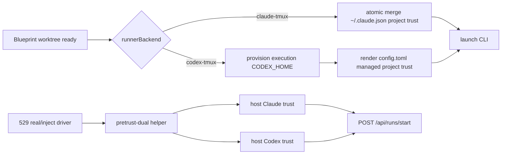

# FLY-1961 双 vendor 工作区信任 — 探索
Issue: FLY-1961 (https://linear.app/geoforge3d/issue/FLY-1961/spawn信任-双-vendor-信任预置新-worktree-的-codex-体出生即卡信任目录提示生产-22-实证)
日期: 2026-08-21
基于: 无

## 问题与成功形状

生产在两个全新 Codex worktree 上 2/2 复现启动即停在目录信任菜单；529 generalized `--real` 房也让 Claude/Codex 各撞过一轮。当前 `scripts/inject-linear-issue.sh` 只向 `~/.claude.json.projects[workspace].hasTrustDialogAccepted` 写入 Claude 信任，而 Codex 实际读取 `$CODEX_HOME/config.toml` 的 `[projects."<workspace>"] trust_level = "trusted"`。两份状态互不相通。

成功不是“看见菜单后自动按 Enter”，而是 CLI 进程启动前信任状态已存在：新 Codex 体零提示进入任务，Claude 同样保持零提示，529 `--real` 的真实 spawn 路径也使用同一预防机制。

## 已锁定的边界与假设

- `Blueprint.runInner()` 已根据 `ctx.runnerBackend` 解析实际 executor，并在 adapter 启动前完成 worktree create/reuse；信任动作必须发生在 `adapter.execute()` 启动 CLI 之前。
- Claude runner 共用机器级 `~/.claude.json`，写入必须与现有 account/profile writer 使用同一 mkdir-lock 形状，且 JSON 损坏时 fail loud、不得覆盖用户状态。
- Codex production runner 使用 execution-scoped `$CODEX_HOME`；信任必须写入该 home，不能只写 host `~/.codex/config.toml`。
- 529 的 legacy injector 与 generalized real driver 是显式治具；它们应在 POST `/api/runs/start` 前双写 host 两侧，并由 teardown 只清理治具自己管理的 Codex 条目。
- 不改变 prompt、sandbox、approval policy、账号轮转、worktree 命名或 ship 生命周期。

## 方案比较

### A. Adapter 启动前按 backend 预置信任（采用）

`Blueprint` 在交给 adapter 的 execution context 上放一个显式 `pretrustWorkspace` 信号。Claude adapter 在任何 tmux window/CLI 启动前原子 merge `~/.claude.json`；Codex adapter 把 canonical cwd 传给 `provisionCodexHome()`，由现有 TOML-aware renderer 给 execution-scoped config 增加受管 trust block。529 两个入口复用 shell helper，在真实 POST 前双写 host 状态。

优点：backend 与状态库一一对应；Codex per-runner home 已存在正确归属；失败发生在 CLI 启动前，可 fail loud；现有无信号的 adapter call 保持 byte-compatible。代价：Claude JSON 与 Codex TOML 各需一个小型、独立的安全 writer。

### B. 在 `WorktreeManager.create()` 内双写全局状态

优点：离“worktree 创建”最近。缺点：`WorktreeManager` 不知道最终 runner backend，也拿不到尚未 provision 的 execution-scoped `$CODEX_HOME`；会无条件污染两侧全局配置，DAG takeover/rebuild 也容易漏写或重复写。拒绝。

### C. 保留现状，轮询 pane 后自动 Enter

优点：代码表面小。缺点：真实 Codex daemon/TUI、headless 与 resident 生命周期没有统一可靠的 pane watcher；它仍然让 run 进入阻塞态，并不能满足“零提示直接开工”。拒绝。

## 目标设计

### Claude writer

- 输入必须是 absolute canonical workspace path。
- 使用 `${FLYWHEEL_CLAUDE_JSON:-~/.claude.json}.lock` mkdir mutex；同现有 shell profile writer 兼容。
- missing/empty 文件可从 `{}` 初始化；invalid JSON、非 object `projects` 或非 object project entry 一律 fail loud、原文件不变。
- same-directory temp + chmod 0600 + atomic rename；已有 `true` 时不重写。

### Codex per-runner renderer

- `RenderCodexHomeConfigOptions` 增加 `trustedProjectPath`，受管 block 可幂等 strip/re-render。
- TOML parser 是语义权威；`projects` 必须是 table。目标 absent 时 append 合法 quoted table；已 trusted 时不加重复 table；目标 existing-but-untrusted/shape drift 时 fail loud。
- placeholder candidate 继续先 parse，再写真实 credential；验证新增 trust 后除目标项目外所有 TOML 语义保持不变。

### 529 治具

- 新增 sourceable/CLI shell helper：`pretrust-dual <future-worktree>` 与 `prune-codex-prefix <slot-prefix>`。
- `inject-linear-issue.sh` 用 helper 替代 Claude-only 写入。
- `qa-529-generalized-e2e.mjs --real` 在 run POST 前按现有 worktree 命名规则预置信任；stub 模式不改 host 信任。
- Codex host config 只删除 helper 自己带 marker 的 slot 条目，不删除用户或 Codex 自己已有的 trusted entry。

## 验证策略

- 单元：Claude 并发 merge、幂等、损坏 fail loud；Codex TOML absent/trusted/drift/非 table、GH_TOKEN/notify/skills 共存与 provision 落盘。
- 集成：Blueprint 明确给真实 vendor adapter 发 `pretrustWorkspace`；两种 adapter 都证明 trust 写发生在 CLI launch 前。
- shell：scratch HOME 跑 dual helper 与 prune，逐字核两侧状态及无关字段保留；legacy injector/generalized real driver 契约断言。
- 回归：claude-runner、edge-worker 定向测试，shell harness，全仓 lint/build/package tests。

## 探索自审

- 无 TBD/TODO/占位符。
- 方案与 issue 指定的“双 vendor、per-runner CODEX_HOME、529 房”逐项一致。
- 明确排除了 prompt auto-ack 与全局 Codex-only 写入这两种不能满足验收的较窄修复。
