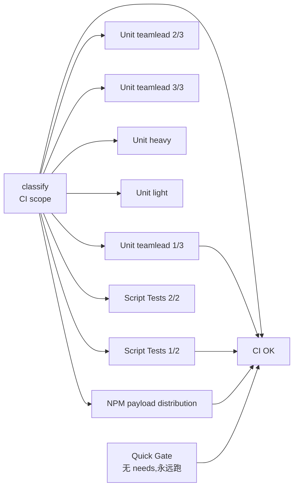

# FLY-1987 GitHub Actions 省钱普查 — 探索

Issue: FLY-1987 (https://linear.app/geoforge3d/issue/FLY-1987/成本research-github-actions-省钱普查用量画像-优化方案缓存裁剪并发自托管-runner-可行性-founder)
日期: 2026-08-22
基于: 无

## 1. 这单在解决什么

Founder 的原话是「充值又双叒被打爆」。所以真正要回答的不是「CI 慢不慢」,
而是**每个月这条 CI 到底在烧多少分钟、烧在谁身上、哪几刀砍下去最省**。

交付物是一页给 founder 的省钱方案(research,不写代码)。

## 2. 边界(先把范围钉死)

**在范围内**
- 用量画像:近 30/90 天 Actions 分钟数,按 workflow / job / 触发源拆。
- 优化清单:按省钱幅度排序,每条标风险。
- 自托管 runner 的可行性判断(省多少 / 风险多大)。
- 不做清单:哪些钱不该省。

**不在范围内**(明确不做,避免自动扩权)
- 换 CI 供应商的商务比价 —— issue 已写明初步不做,要再叫 HL。
- 本单不改任何 workflow 文件。所有优化项是**提案**,落地各自开单。
- billing 修复 founder 已在做,本单不碰。

## 3. 已知的结构事实(读代码得到,非推测)

仓库有 5 个 workflow:

| workflow | 触发 | 备注 |
|---|---|---|
| `ci.yml` CI | `push:[main]` + `pull_request:[main]` | 主力,11 job |
| `ship-on-comment.yml` Ship on :cool: | `issue_comment: created` | **每条评论都起一个 run** |
| `payload-beta-release.yml` | `schedule: 0 */6 * * *` | 每 6 小时一次 |
| `payload-promote.yml` | 手动 | 30 天 0 次 |
| `payload-activation.yml` | 手动 | 30 天 0 次 |

CI 的 job 图:

已经存在的省钱机制(要先查它们有没有真在起作用,而不是重复造):
- `concurrency: ci-${{ github.ref }}` + `cancel-in-progress: true` —— 同分支连推自动取消。
- FLY-1861 `classify` job —— 纯文档改动可跳过 8 个重 job(`no_code`)。
- `pnpm` store 缓存(`actions/setup-node` 的 `cache: pnpm`)。

## 4. 一开始就该怀疑的地方(待数据证伪)

1. **ship-on-comment 是隐形大头**。它 `timeout-minutes: 30`,而且设计上要
   **等**最长 25 分钟的 exact-head CI verdict。等待期间 runner 是在计费的。
   532 次 / 30 天,如果平均等 10 分钟,就是 5000+ 分钟——量级和整条 CI 相当。
   这条如果成立,是本单最反直觉、也最值钱的发现。
2. **cancelled 的 run 也花钱**。30 天 867 次 cancelled(占 33%)。取消止损,
   但已经跑掉的分钟是真花了。要量「取消前平均烧了多少」。
3. **失败重跑**。384 次 failure。失败越晚发现越贵(Script Tests 20 分钟才红)。
4. **`classify` 的实际命中率**。它的省钱效果完全取决于命中率;如果 30 天只
   命中几次,那它是个几乎不生效的机制,而不是「已经优化过了」。
5. **matrix 的固定成本**。5 个 unit shard 各自 checkout + setup-node +
   `pnpm install`。安装成本是 ×5 付的,不是 ×1。分片省的是墙钟,不是账单。

## 5. 需要什么数据才能下结论

| 问题 | 数据源 | 状态 |
|---|---|---|
| 每月账单美元 | `/users/{u}/settings/billing/actions` | ❌ token 缺 `user` scope,**不擅自改 founder 的 token 权限**,改由从分钟数推算 + 请 founder 核对 |
| 每个 run 的计费分钟 | `/actions/runs/{id}/jobs` 逐 job 起止时间 | ✅ 已抓 |
| 谁触发的 | run list 的 `event` / `actor` | ✅ 已抓 |
| classify 命中率 | job 结论里 `skipped` 的比例 | ✅ 可算 |
| 缓存命中率 | job log 里 `Cache restored` | ⚠️ 抽样 |

## 6. 方法上的自警

- **分钟数是我算的,不是账单给的**。GitHub 按每个 job 向上取整到分钟计费,
  我按 `completed_at - started_at` 逐 job 向上取整重算。这是**估算**,
  必须在交付物里标成估算,并给出和真实账单对账的方法。缺 `user` scope 这件事
  要写进交付物,而不是悄悄用一个看起来很确定的数字盖过去。
- **省钱幅度必须是可证伪的**:每条优化写清「省多少分钟/月」和「这个数是怎么
  算出来的」,而不是「显著降低成本」。
