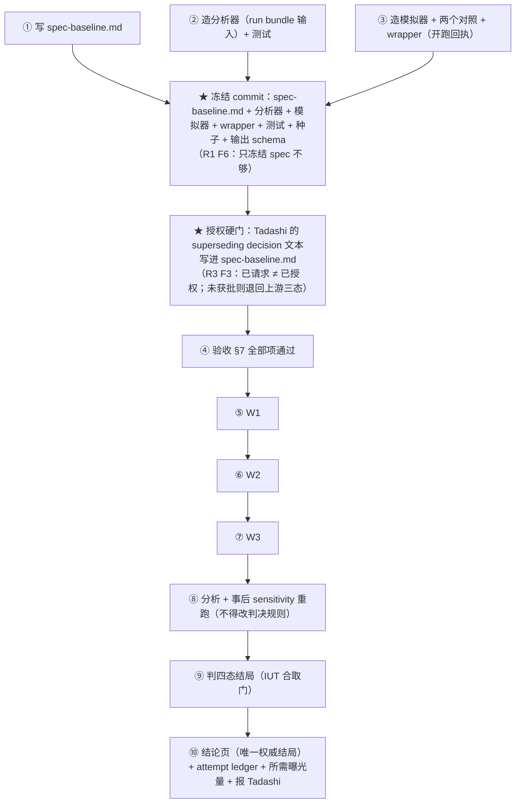

# FLY-2007 容量压测执行 — 实施计划

Issue: FLY-2007 (https://linear.app/geoforge3d/issue/FLY-2007/容量压测执行-fly-1986-方案落地执行阶段-0-基线-1-标定-2-可转移性-3-生产标定产出-runner-放行阈值)
日期: 2026-08-23
基于: exploration.md, research.md

> **v5** —— 已纳入 Codex design review **R1（10）+ R2（6 PARTIAL + 8 新）+ R3（8 新）+ R4（5 PARTIAL + 7 新）**，**全部采纳、零驳回**。逐条见 §9。四轮全文存 `codex-design-review-r{1,2,3,4}.md`。
>
> **R4 独立推导并确认了 v4 的全部错误率分配**（B 的 IUT 允许各聚合门用不同 per-CP 水平；`range_ub` 需 `3×2×G` 个 tail；A 的 `max_c` 正是必须乘 `G` 的原因；`α_A+α_N=0.05` 的 union bound 成立）。它同时算出一件**改变交付形状**的事，见 §0。
>
> **R3 把新判据的数学骨架自己推了一遍并全部验过**：两条不等式正确、Clopper–Pearson 作用的随机变量与单双侧方向正确、门槛网格 Bonferroni 正确、跨窗区间算术正确、七个 headline 数字独立重算全对。R3 不批的原因**不是**要复活 bootstrap，而是这个正确的构造还没闭合成一个**可执行、fail-closed、错误率合同完整、并已取得上游授权**的判据。v4 补的就是这四样。
>
> ⚠ **v3 的核心动作是「删」不是「补」**：R2 抓到 v2 的 bootstrap-t **反演方向写反了**，而且整套 bootstrap 从 IAT 估计到 `se` 到边界退化**全是空的**。按 FLY-1986 §16.1 的既有裁定（「简单 = 净删除」「砍掉源头比无穷尽地修」），v3 **把 bootstrap 整个删掉**，换成一个**精确、无渐近、无数据依赖选择**的判据。R2 的 8 条新发现里有 4 条因此**消失**，不是被补上。

---

## 0. 三分钟摘要

FLY-1986 交了**方案 + 只读采集器**，本单**拿它去跑**。

**审计发现**：方案与采集器之间缺一层 —— 采集器出的 `violation_upper_conservative` 是**点估计**，而判 A/B/N 要的是**置信界**。R1、R2 两轮都对着源码复核，**确认缺口成立**（`qa-fly-1986-load-probe.sh:493-498` vs `FLY-1986/plan.md:200-210`）。

**两次被打掉的方法**：v1 的 deff→Clopper–Pearson（R1）、v2 的 studentized 区块 bootstrap（R2，含**我写反了反演方向**这一条真错）。

**v3 的判据 —— 阈值-计数精确二项界**：用 `p_j ∈ [0,1]` 这个恒真的有界性，把 `b` 夹住：

```
b_ub(c) = c + (1−c)·π_ub(c)        b_lb(c) = c · π_lb(c)
其中 π 是「单元违约率 > c」的概率，K(c) ~ Binomial(J, π)，π 的界用精确二项
```

这**两条矩不等式无条件恒真**；整个判据是「**在假设 A1（单元 iid）下 exact**」—— ⚠ **「exact」这个词全文都带条件**，A1 被显式命名、不假装它成立，失效代价由模拟量化（§5.5）。不依赖正态近似 / bootstrap / 方差估计，在 `b̂ = 0` 或 `1` 处**不退化**。

**一条必须先说的算术（R2 复核确认）**：

> **13 个块本来就认证不了 5%。** 零违约时精确界给 **20.58%**（`α_B/G = 0.01` 下 29.83%）。
> ⚠ **`J ≥ 90` 只是 B 的性能子门**（`ceil(ln0.01/ln0.95)`；J=90 → 4.99%，J=89 → 5.04%）。
> ⚠⚠ **完整的 B 由等价门绑定，不是性能门（R4 Finding 1）**：全干净时 `range_ub = 1 − a^{1/J}`，而等价门每个 CP 用 `α_B/(6G) = 0.001667` ⇒ 要 `< δ = 2.5pp` 需 **`J ≥ 253`**（J=253 → 2.4967%，J=252 → 2.5065%）。
>
> | 子门 | 每 CP 水平 | 全干净所需 J | 每窗曝光 |
> |---|---|---|---|
> | B 性能 | 0.01 | 90 | 7.5 h |
> | **B 等价** | 0.001667 | **253** | **21.1 h** |
> | ⇒ **完整 B** | — | **253** | **21.1 h/窗，三窗 63.2 h** |
>
> ⇒ **上游 §4.4 给阶段 0 的「3 窗 × 60 分」，对完整 B 差约 19 倍。** 这不是本单发明的困难 —— 上游 §17-③ 预告过时长要往上走，只是没算这个数。
> （**600 是 Hoeffding 的数，不是本判据的**；v3 混了两者，R3 Finding 7 抓到。）
> ⇒ **本轮曝光下 B 不可达，这是预先知道并写下来的。** 能拿到的是 **A** 或 **U**，加上一个**预注册的 exposure calculator**（含 δ→曝光 的代价表）—— 而那正是上游 §17-③ 留的空。

**结局是四态且有唯一权威**（§4）：上游把 A 定义为「`b_ub > SLO`」，会把「**没证明好**」误说成「**证明坏**」。

## 1. 交付物

| # | 产物 | 路径 |
|---|---|---|
| 1 | **预注册（冻结点 ①）** —— 含：估计量与全部判决规则、**门槛网格 `C` 与其非事后理由**、**§4.2 全部 α 分配**、A/A 数值协议（§C.11）、IUT 论证、`inference_eligible` 定义、**Tadashi 的 superseding decision 精确文本** | `.../spec-baseline.md` |
| 2 | **分析器**（只读、零依赖 Node ESM） | `scripts/qa-fly-2007-phase0-analyze.mjs` |
| 3 | **模拟器**（敏感性分析，冻结；v3 范围大幅收窄） | `scripts/qa-fly-2007-phase0-simulate.mjs` |
| 3b | **wrapper**（原子写开跑回执，R2 F7） | `scripts/qa-fly-2007-phase0-run-window.sh` |
| 4 | 测试（阳性对照表 + **§5.4 的突变检验**；⚠ **§5.4 是突变条数的唯一权威，其余处只链接不复述**） | `scripts/__tests__/qa-fly-2007-phase0-analyze.test.sh` |
| 5 | run bundle × 每个 attempt | `.../evidence/attempt-<NNN>/{samples,summary}.csv + meta.txt + receipt.json` |
| 6 | 窗口级分析输出 | `.../evidence/analysis-w{1,2,3}.{json,md}` |
| 7 | 敏感性分析结果（含两个对照） | `.../evidence/sensitivity-analysis.md` |
| 8 | **attempt ledger**（机器可审：单调 ID、开跑/终结回执） | `.../evidence/attempt-ledger.jsonl` |
| 9 | **exposure calculator** 输出（all-clean best case `J≥90` / scenario 区间 / 等价门所需曝光，统一 ceiling） | `.../evidence/exposure-required.{json,md}` |
| 10 | **Q0 结论页**（三档 + 唯一权威结局 + §4.2 的 α 分配表 + 所需曝光量） | `.../conclusions-phase0.md` |

⚠ **失败也是产出**（FLY-1986 plan §7-6）。结局 A / N / **U（无法认证）** 照实写就是合格交付。

---

## 2. 步骤（顺序本身是合同）



⚠ **冻结 commit 必须早于第一个 attempt 的 `START` 记录**，逐字对照（验收 §7-1）。
⚠ **授权硬门在冻结之后、W1 之前**（§4.4、§7-1b）。这是本单唯一能证明「没有看过数据再定规则」的东西。
⚠ ②③ 排在 W1 之前，是因为如果分析器在拿到真数据之后才写，我会（哪怕无意地）按已经看见的形状去写它。

## 3. 窗口排期（不含任何绝对时刻 —— R1 Finding 10）

**v1 写死了 12:30 / 16:30 / 19:30，那是错的**：写下它们时距第一个时刻只剩 75 分钟，而冻结前还有整轮返工 + 再评审 + 实现 + 验收。**硬赶等于毁掉冻结点。**

**v2 规则**：

1. **W1 = 以下三件全部落地之后的最早合格时段**：(a) **冻结 commit**；(b) §7 全部验收项通过；(c) ⚠ **授权硬门**（§4.4）；
2. 三窗**不同时段**，各 **30 块 × 300 秒 = 2.5 小时**（`J` 由把握度推导，见 spec §0.2.2）；
3. **≥1 窗在真实 restart 时间戳之后 >4 小时**（从 `/health` 的 `bridge_started_at` 实测，**不从预测的班车时刻算**）；
4. 不得跨当期 launchd 班车时刻（开跑前现读 plist，不用缓存的认识）；
5. 每窗 preflight **实测并记入 ledger**：在服务的 `buildSha`、worker identity、`bridge_started_at`、当期 schedule、`pressure_hold`、`load1`；
6. 班车延迟 / SHA 不符 / 稳定期不足 ⇒ **整体顺延**。

⚠ **`J = 30` 的理由是判别力，不是覆盖率**（spec §0.2.2）。

v1 曾说「J=13 覆盖率不达标、30 是刚好过线的最小值、余量薄」，随后又说「L2 绑定、要 44」。**两者都已撤回** —— 它们是我模拟器一个 bug 的产物（50/50 开局对上平稳估计目标）。修正后**全网格 16 个点在 J=13 就已全过**（最差 g08/L2 下界 0.9606）。

**真实理由**：更多单元 = 更紧的下界 = 更可能真的证出 A。全违约时 A 的下界 J=13 是 **0.1159**、J=30 是 **0.1579**（线是 0.05）。两个都过，但 `b` 若在 0.1 附近，J=13 够不着而 J=30 够得着。买的是**决定性结论的概率**。

**命令形态**（⚠ **不直接调采集器** —— 必须经 wrapper，它先原子写开跑回执，见 §6）：
```
bash scripts/qa-fly-2007-phase0-run-window.sh --window N     # 内部调用：
bash scripts/qa-fly-1986-load-probe.sh \
  --out engineering/doc/FLY-2007-capacity-stress-execution/evidence/attempt-<NNN> \
  --endpoints L1,L2 --block-seconds 300 --blocks 30 \
  --token-env TEAMLEAD_API_TOKEN --expect-build-sha <preflight 实测的 sha>
```

## 4. ★ 结局：先过资格门，再定四态，唯一权威 + 优先级

### 4.0 `inference_eligible` —— 优先级**之前**的唯一 fail-closed 门（R3 Finding 1）

**v3 的洞**：v3 只给 **B** 加了「无不可认证块」，**A 与 N 没有完整性前置**；而优先级是 `A > N > U` ⇒ **拿幸存单元算出来的 A 或 N 会压过 U**。
⚠ 而幸存**不是随机的** —— `unreachable` / 意外重启 / `timer_late` 超限恰恰发生在机器最坏的时候。删掉它们之后，剩下单元上的 `K` **不再是 Binomial(J, π)**，精确性没了。

```
inference_eligible = true  当且仅当，对每个端点、每个窗口：
  ① 该窗恰好 J = 30 个单元，每个 block_valid = true、
     无 no_token / invalid_auth / unreachable、timer_late 占比 ≤ 2%
  ② run 级完整性合同全过（§5.2）
  ③ ledger 无缺号 / 无重复目录 / 无未终结 attempt / 无非法 replacement（§6）
```

- `false` ⇒ **`authoritative_outcome = U`，无条件**，并带 `availability_finding` 标记（⚠ **作废 ≠ 消失**，上游 §9-#15：它本身是一条可用性结论）；
- 此时 `b_ub` / `b_lb` / range **在可计算时仍印出，但一律标 `descriptive_only`**；**不可计算时印 `null` + 具名 `reason`，绝不印一个数**（R4 F2：采集器遇 `invalid_*` / `incomplete_expected` 会把点估计写成 `NA`）；
- ⚠ **资格门必须是覆盖采集器所有终态的 total function（R4 Finding 2）** —— v4 只处理了「有 bundle 但块不合格」，漏了「根本没有 bundle」。逐终态映射见 research §C.5b 的表；**默认分支是 `false` + `reason=unclassified_terminal_state`**，不是「没匹配到就放行」；
- ⚠ **绝不允许**改用幸存 `J` 重算并声称 exact。只有可独立证明的 operator/harness/存储故障能重跑去重新取得**完整 13 单元**（上限 2 次，§6）。

### 4.1 四态

上游 `FLY-1986/plan.md:200-210` 把 **A** 定义为「任一端点 `b_ub > SLO`」。**这会把两件事混起来**：基线真坏 → A（对）；基线其实干净但曝光不够证不了 → **也判 A**（错，把「没证明好」说成「证明坏」）。

| 结局 | 判据（**均以 `inference_eligible = true` 为前提**） | 下一步 |
|---|---|---|
| **B 已认证达标** | 六个分量（2 端点 × 3 窗）**都** `b_ub ≤ SLO`，**且** 等价判定 = `equivalent`，**且** `b_ub` 与 range 程序都过敏感性分析 | 报 Tadashi 请他向 founder 要阶段 1 环境 |
| **A 已认证不达标** | **任一**分量 `b_lb > SLO`（已做 §4.2 的同时性校正），且 `b_lb` 程序过敏感性分析 | **不打高负载**，走上游 §3.1 返场；再入闸判据交 Tadashi 指派 owner（Q6 = FLY-1995），**本单不自任** |
| **N 已证非平稳** | **任一端点** `range_lb > δ`（δ = 2.5pp，**Tadashi 已批**），且 range 程序过敏感性分析 | **不打高负载**，报「基线非平稳」 |
| **U 无法认证** | 以上都证不出，**或资格门不过** | **不放行也不定罪**；**报 exposure calculator 的数** |

### 4.2 完整的错误率分配（R3 Finding 2 + 5；v3 只写了 A 的一半）

| family | 总量 | 形状 | 每个 Clopper–Pearson 的实际水平 |
|---|---|---|---|
| **达标（B）** | `α_B = 0.05` | **交集（IUT）** —— 六个性能门 **且** 等价门都要过 | ⚠ IUT ⇒ **分量之间、性能门与等价门之间都不需要 Bonferroni**。性能：`α_B/G = 0.01`（单侧上界）；等价（`range_ub`）：3 窗 × 2 尾 × G ⇒ `α_B/(6·G) = 0.001667` |
| **不利（A + N）** | `α_adv = 0.05`，**拆 `α_A = 0.025` + `α_N = 0.025`** | **并集** | **A**：6 分量 × G ⇒ `α_A/(6·G) = 0.000833`（单侧下界）<br>**N**：2 端点 ⇒ 每端点 `α_N/2`；端点内 3 窗 × 2 尾 × G ⇒ `α_N/(2·6·G) = 0.000417` |

⚠ **v3 漏了 A 与 N 是两个各自 5% 的 family** —— 并集最多到 10%，`A > N > U` 的优先级**消不掉这个并集**。`α_A + α_N = 0.05` 是**主动选择**，让「唯一权威的不利结局」整体有 95% 保障，而不是把两个各 5% 的 claim 贴一个 95% 标签蒙混。
⚠ **结论 schema 必须印出这张表**（`α_B` / `α_A` / `α_N` / 每个 CP 的实际水平 / `G`），否则读者无法判断某个 95% 标签管的是哪一层。
⚠ **结论页不得把任何未校正的 marginal 95% 下界称为「已认证不达标」。**

### 4.3 唯一权威 + 优先级

- 输出里**只有一个** `authoritative_outcome`；上游字面判决作为 `upstream_literal_outcome` 印出，**显式标注 non-authoritative / compatibility only**；
- **优先级（预注册，仅在资格门通过后适用）**：`A > N > U`；`B` 与它们互斥。A 与 N 同时成立取 A，`flags` 带 `also_non_equivalent`。
  理由：**基线可证地坏的时候先修基线** —— 在坏基线上谈平稳性没有可执行的下一步。
- **冲突处置写死**：若 `authoritative_outcome = U` 而 `upstream_literal_outcome = A`（**本轮曝光下这是最可能出现的组合**），**按 U 走**，并在结论页**点名**这个差异。

### 4.4 ⚠⚠ 授权是一道开跑硬门（R3 Finding 3）

上游 `FLY-1986/plan.md:200-210` **仍然权威地**定义 A = 「任一 `b_ub > SLO`」。**「已请求」不等于「已授权」。**

⇒ 在 **Tadashi 的 superseding decision 的精确文本/回执写进 `spec-baseline.md` 之前**：

- **不得**把上游三态降为兼容字段；
- **不得**开跑 W1（进入冻结范围与 W1 前验收，§7-1b）。

若该决定**未获批**，本计划**退回按上游三态执行**，并在结论页写明其已知缺陷（本轮曝光下上界必然超 5% ⇒ 上游必判 A，而那只说明**没证明好**）。
**已上报**：`ask 9e2c13cf`（随 R2）、`ask a915c761`（随 R3，明确要一句可逐字抄录的裁决）。

## 5. 分析器 / 模拟器 / wrapper

### 5.1 边界

- **只读**：
  - **分析器 / 模拟器**：**不打开任何网络连接、不打开任何数据库**；
  - **wrapper**：⚠ v3 写「无网络」不可执行（R3 F6）；⚠ **v4 只给 `GET /health` 同样不可执行（R4 Finding 3）** —— `/health` **里没有 `pressure_hold`**（采集器用 `sqlite3 -readonly` 查 `fleet_pressure_hold`），worker identity 来自 `lsof`+`ps`，`load1` 来自 `uptime`，班车时刻来自 plist。
    ⇒ **v5：逐字段钉死 authority 的只读 allowlist**（每项都用采集器**同一条**读法，见 research §C.13 的表）：`GET /health` 是**唯一**网络调用；`pressure_hold` 走 `sqlite3 -readonly` **字面文件名**；identity 走 `lsof`+`ps`；`load1` 走 `uptime`；班车时刻走 `plutil -p` 现读。**表外的任何网络 / 任何写方法 / 任何其它 DB 打开一律禁止。**
    ⇒ ⚠ **验收逐字段用「缺失 / unknown / 与采集器不一致」三种突变变红**，不能只 grep URL allowlist；
  - 三者都只写**显式声明**的输出路径。突变测试注入一次越界写 / 一次 allowlist 外的请求 ⇒ 必须变红。
- **零依赖**：Node ESM + 纯 bash wrapper。精确二项用**对数空间 CDF + 对 p 二分**。
- **确定性**：同输入必同输出 —— 复核者拿 run bundle 能算出逐字相同的数（上游 §8 的外包复核模型要求这个）。**v3 删掉 bootstrap 之后，判据里已经没有随机性**；只有模拟器用固定种子 PRNG。

### 5.2 输入 = 不可拆 run bundle + run 级完整性合同（R1 F1 + R2 F1）

`samples.csv + summary.csv + meta.txt + receipt.json`，缺一即拒。

> **为什么**：采集器的**块后**围栏只通过 `summary.csv` 传作废信号，`samples.csv` 的 150 行仍然齐全 ⇒ 只读 samples 会**把已被作废的块重新认证**。

**run 级合同**（v2 只有逐块核对 —— **一个块同时从两份 CSV 消失时会真空通过**）：block ID 集**恰为** `b1..b<meta.blocks>`；每个 `(block, endpoint)` **恰一条** summary 行；tick 集是 `0..expected−1` 的**完整整数集**；计数与点估计与 summary **逐字相符**；`meta.txt` 的 `build_sha` / `bridge_worker_pid` / `bridge_identity` 与开跑回执**一致，不一致即拒**；畸形行 **fail-loud**。

### 5.3 判据（research §C.4）

**唯一判据 = 阈值-计数精确二项界**。门槛网格预注册 `C = {0, 0.02, 0.05, 0.10, 0.20}`（G=5），取 `min`/`max` 时**网格内 Bonferroni**。
**单元 = 300 秒哨兵块，先验固定，J=13/窗**，**不做数据依赖合并**（R2 F5）。假设 **A1（iid 单元）显式命名**，`r₁` 只报不判。

**门槛网格的预注册理由**（Tadashi 要求「非事后的选择理由」）：`0` = 「有没有任何违约」的自然切分；`0.05` = **SLO 本身**，判据要在它上面有分辨力；`0.02` / `0.10` = SLO 上下各一档；`0.20` = 之上第二档，⚠ **它在网格里是因为 pilot 数据显示 `b` 可能很大**（research §C.14 第 6 条已披露），**不是**看了 W1–W3 才加的。大致等比阶梯，把 SLO 夹在中间。

**比较算子（R3 Finding 8）**：一律**严格 `>`**；⚠ **`p_j = c` 可达**（块级比率是 `k/150` / `k/100`，`c=0.02` 时 `3/150`、`c=0.10` 时 `15/150` 恰好相等）⇒ **用整数交叉相乘判定，绝不用浮点比较**，且必须有 tie fixture 与 `>` → `≥` 的突变检验。

**只印不判**：朴素 CP、Kish deff、Hoeffding 单元界、逐块 `p̂_j` / `r₁` / 游程分布。
⚠ v3 说「精确界一致更紧，所以删掉兜底门」—— **那个理由是假的**（R3 Finding 7 反例：J=13、11 块 `p=31/150`、1 块 `1/150`、1 块 0 时阈值界 98.84% vs Hoeffding 51.48%）。**正确理由**：判据只能有一个；选它是因为**有效**（A1 下 exact）且**简单**（可手算、无随机性、边界不退化），**不是因为它支配 Hoeffding**。

### 5.4 阳性对照与突变检验

自检逐行复现 `FLY-1986/plan.md §5.3` 那张**已被独立复核过的**表（`x=0` 闭式 `1−α^(1/n)`）：

| n | 6 | 18 | 36 | 58 | 59 | 90 | 270 | 540 |
|---|---|---|---|---|---|---|---|---|
| 期望 | 39.30% | 15.33% | 7.98% | 5.03% | 4.95% | 3.27% | 1.10% | 0.55% |

再加 v3 判据自己的四个手算点（research §C.4 的实算校验表）。

**突变检验（每条实测能变红）**：

| 注入的突变 | 必须 |
|---|---|
| `timer_late` 从违约计数里排除 | 变红 |
| 精确界的上/下方向弄反 | 变红 |
| 门槛网格的 Bonferroni 去掉 | 变红 |
| **A 的分量间 Bonferroni（÷6）去掉** | 变红 |
| 分析器忽略 `summary.csv` 的作废信号 | 变红 |
| run 级 block ID 集合同时缺一块 | 变红 |
| 畸形行被静默丢弃 | 变红 |
| ledger 缺一个 `attempt_id` 而分析器照跑 | 变红 |
| 分析器写一个未声明的路径 | 变红 |
| **A 的分量间 Bonferroni 与 N 的端点间 Bonferroni 互换 / 去掉** | 变红 |
| **比较算子 `>` 改成 `≥`**（tie fixture 上必红） | 变红 |
| **`p_j > c` 改用浮点比较**（`3/150 > 0.02` 的浮点反例） | 变红 |
| **资格门被绕过**（有一个 `unreachable` 块却仍产出 A/B/N 而非 `descriptive_only`） | 变红 |
| **exposure calculator 不做向上取整** | 变红 |
| （空过绿检验）把阳性对照表整个删掉 | 变红 |

**合计 14 条突变 + 1 条 harness 自身的对照 + 2 条 reference 探针基线。**

⚠ **本节是突变检验的唯一权威**，其余文档只链接、不复述数字（v2/v3 曾在三份文档里分别写 6 / 7 / 10，互相冲突 —— R3 Finding 8；v4 又写 15 而实际 14 —— R5）。**文档合同测试**（§7-9）机械核对这一点。

⚠ **一条被删掉的突变要记在案**：「浮点比较代替整数交叉相乘」是一个 **equivalent mutant** —— 对全部 1255 个可达输入穷举，两种写法**零分歧**，所以没有任何 fixture 能抓到它。它已从表里删除而不是留着变红；整数写法保留为纵深防御（针对未来非二进制门槛如 1/3），但**不再声称有 fixture 证明它必要**。

### 5.5 敏感性分析（research §C.7）

**删掉 bootstrap 之后模拟器只剩一件事**：量化 **A1（iid 单元）失效**对精确程序覆盖率的伤害。

- 冻结：模拟器代码、DGP 族、依赖参数置信集、adversarial 网格（K ≤ 20）、真 `p` 网格、参数提取、拟合优度门、接受规则、种子；
- 校准**只用已永久排除的 pilot 数据**；
- **错误预算**：`α_param + α_MC ≤ 0.05`，预注册各 0.025。每点覆盖率用**精确二项下界**、水平 `1 − α_MC/K`，**所有 K 点同时 ≥ 0.95**。
  ⚠ v2 写「每点 95% 下界 + Bonferroni」是**自相矛盾**的（R2 F6）：Bonferroni 要求每点用 `1 − α_MC/K`，不是仍用 95%；且参数置信集自己也吃 α。
- `M = 20000`，**依据写出来**：`α_MC/K = 0.00125` 时它支持把真覆盖率 ≥ 0.96 的点的精确下界推过 0.95。`M` 与 `K` 印在输出里。
- **两个对照，同一套 MC 判据**：固定的、事先已知会让**朴素 CP 覆盖不足**的 DGP（阳性）；**已知有效**的方法在 iid DGP 上（oracle）。任一异常 ⇒ 本次验证记 **inconclusive**，**不得用同一批数据调完模拟器再宣布通过**。
- **接到结局上（R3 Finding 4 补全 —— v3 漏了 range 程序，且验收可以只靠两个对照正常就过）**，必须**同时**满足，缺一即 **U**：
  1. **拟合优度门 / 参数集合门**通过；
  2. ⚠ **四个 configuration 逐项列出（R4 Finding 5 —— v4 只写「三个程序」，而 `range_ub` 与 `range_lb` 用的是两套不同水平，只验一边也能字面满足）**，各自在**所有 K 个 frozen 网格点**报同时 LCB 与 pass/fail：
     | # | configuration | 每 CP 水平 | 谁消费它 |
     |---|---|---|---|
     | 1 | `b_ub @ B-performance` | `α_B/G = 0.01` | B |
     | 2 | `b_lb @ A` | `α_A/(6G) = 0.000833` | A |
     | 3 | `range_ub @ B-equivalence` | `α_B/(6G) = 0.001667` | B |
     | 4 | `range_lb @ N` | `α_N/(2·6G) = 0.000417` | N |
     **B 只消费 1 与 3，A 只消费 2，N 只消费 4**；不得互相顶替；
  3. **W1–W3 的实测依赖结构落在预注册适用域内**（落在域外 ⇒ 模拟管不到这批数据 ⇒ U）；
  4. 两个对照正常 —— ⚠ **另列**：它们只能证明模拟器没整个失灵，**不能**代替第 2 项。
- ⇒ 声称 **A** 要 #2 过；**B** 要 **#1 与 #3 都**过；**N** 要 #4 过。
- ⚠ **「exact」全文带条件**：只有 §0 的两条矩不等式无条件恒真，整个判据是「**A1 下 exact**」；模拟器只支持**冻结 DGP 族内**的 sensitivity claim，**不能**把未知真实 DGP 变成 exact。

## 6. attempt ledger：机器可审 + crash-safe（R1 F4 + R2 F7 + R3 F6）

**v3 还剩的洞（R3 Finding 6）**：wrapper 被禁止一切网络，却又必须在调采集器前写下实时 `buildSha` / `bridge_started_at` / `pressure_hold` —— **两件事不可兼得**；而且单调 ID 的 JSONL 没有锁、没有两阶段 append、没有 fsync/rename、没有 ledger ↔ 目录的双向对账 ⇒ **并发 wrapper 或 START 之后崩溃会留下无法判别的孤儿**。

**v4 协议**：

| 阶段 | 动作 |
|---|---|
| **收窄禁令** | wrapper 不是「零网络」，而是**明确的 GET allowlist：只允许 `GET /health`**；其余网络 / 任何写方法 / 任何 DB 打开一律禁止，由突变测试钉住 |
| ⚠ **单一分配权威（R4 Finding 4）** | v4 让 `START` append 与建目录成为**两个持久对象**，一次 rename 提交不了两者 ⇒ 两种孤儿，双向 census 只能**发现**、不能**收敛**，一次崩溃可永久毒化 eligibility。**v5：目录本身就是分配权威** —— 原子 `mkdir attempt-NNN`（已存在即失败）即 reservation；**durable 状态写在目录内**（`state.json`，临时文件 + `fsync` + 原子 rename）；**顶层 JSONL 只是可重建 index，不构成第二个真相** |
| **恢复规则（确定性）** | 任何**无 TERMINAL 状态**且**锁未被持有**的 attempt 目录，一律确定性终结为 `aborted` + `reason=crash_before_terminal`，**并计入 ledger**（⚠ 不会消失，上游 §9-#15）⇒ census 永远收敛 |
| **① preflight 之前** | 单写者 OS 锁内原子建目录 + 写 `state=START`（冻结 commit hash、时间） |
| **② preflight 之后、调采集器之前** | append `PREFLIGHT`：`GET /health` 读到的 `buildSha` / `bridge_started_at`、worker identity、`load1`、`pressure_hold` |
| **③ 结束** | append `TERMINAL`：exit code、状态、原因、产物哈希 |
| **双向 census** | ledger 里每个 `attempt_id` 必须有对应目录，每个 `attempt-*` 目录必须有对应记录；任一方向不匹配 ⇒ **fail-closed** |
| **测试必须覆盖** | 并发 wrapper、`START` 后崩溃、`PREFLIGHT` 后崩溃、目录已存在、ledger 缺号、**顶层 index 丢失后能从目录重建**、**崩溃后重启收敛到明确 `aborted` 并继续 census**（⚠ R4 F4：只证明 analyzer 会红**不算** crash-safe） |

**替换策略**（R1 F4，不变）：服务/宿主相关的作废（`unreachable`、意外重启 / identity 变更、`timer_late` 超限）**不得**被替换成 B 的证据 —— 它们使该窗乃至阶段 0 **无法认证**（§4.0 的资格门），并**本身作为可用性结论保留**（上游 §9-#15：作废 ≠ 消失）。**只有**可独立证明的 operator 凭据故障或 harness / 存储故障可重跑，原 attempt 留档，上限 **2 次**。

## 7. 验收

| # | 项 | 方式 |
|---|---|---|
| 1 | **冻结 commit**（`spec-baseline.md` + 分析器 + 模拟器 + wrapper + 测试 + 种子 + 输出 schema + 门槛网格 `C` + §4.2 全部 α 分配）时间戳早于第一个 attempt 的 `START` 记录 | git log vs ledger 逐字对照 |
| **1b** | ⚠ **授权硬门**：Tadashi 对四态结局的 **superseding decision 的精确文本/回执已写进 `spec-baseline.md`**；未获批 ⇒ **不得开跑 W1**，退回按上游三态执行（§4.4） | 人工 + 文本存在性检查 |
| 2 | 分析器自检复现 §5.4 全表（含 n=58/59 临界点）+ §0 判据的四个手算点 + **tie fixture**（`c ∈ {0, 0.02, 0.10}` 上 `p_j = c`）+ `K=0` / `K=J` 边界 | 真跑 |
| 3 | §5.4 **15 条**突变全部变红，阳性对照全绿 | 真跑 |
| 4 | 每个 attempt 的 run bundle 过 §5.2 的 **run 级完整性合同**（不只是逐块核对） | 真跑 |
| **4b** | **资格门可变红，且不得真空通过（R4 Finding 6）**：⚠ `unreachable` 会让采集器把点估计写成 `NA`，下游 loader 本来就会拒 ⇒ 那个 fixture **证明不了门生效**。必须用 **numeric-but-invalid** fixture（`timer_late > 2%`：数值保留、`block_valid=false`），且其余数据构造成**删掉门就必判 A**。删门 ⇒ 红；恢复门 ⇒ `U + reason=timer_late_void` 且所有推断量降级 | 真跑 |
| 5 | 敏感性分析**四项全过**（拟合优度门；`b_ub`/`b_lb`/**range** 三个程序在**所有 K 点**的同时 LCB ≥0.95；W1–W3 落在适用域内；两个对照另列且正常）；`K` / `M` / `α_param` / `α_MC` 印在输出里 | 真跑 |
| 6 | **零写入用机制证**：分析器/模拟器无网络无 DB；**wrapper 只允许 `GET /health`**（allowlist 外的请求必须让测试变红）；只写声明路径；`/health` 三字段只作**环境上下文** | shell 测试 |
| 7 | **ledger crash-safe**：并发 wrapper / `START` 后崩溃 / `PREFLIGHT` 后崩溃 / 目录已存在 / 缺号 / 双向 census 不匹配 —— 各有一条**能变红**的测试 | shell 测试 |
| **7b** | **exposure calculator** 有输出、有验收、有突变（不做 ceiling ⇒ 变红）。输出必须含：**B 性能子门** `J ≥ 90`、**B 等价门** `J ≥ 253`、**完整 B = 两者取大 = 253**（⚠ R4 F1：v4 误把 90 当成完整 B 的答案）、A 方向所需曝光、scenario 区间、**δ → 曝光的代价表**。⚠ 突变：把「完整 B 取两个子门的 max」改成「只看性能门」⇒ 必须变红 | 真跑 |
| 8 | 结论页只有**一个** `authoritative_outcome`，上游字面判决标注 non-authoritative；**印出 §4.2 的 α 分配表**；写明会推翻它的观测 | 人工 |
| 9 | `pnpm lint` 全绿；测试接 CI（挑有余量的 shard；⚠ FLY-1986 §16.4 记载 shard 1 只剩约 65 秒余量） | CI |
| 10 | Codex design review 通过 | `/codex-design-review` |

⚠ 第 5 项最容易假绿，且有**两个**假绿口：① 模拟里两个方法都 100% 覆盖 ⇒ 那是**没造出相关性**，不是方法好；② **只靠两个对照正常就放行** ⇒ 对照证明的是模拟器没失灵，**不是**待用程序有覆盖（R3 Finding 4）。

## 8. 明确不做

- ❌ 不改 `scripts/qa-fly-1986-load-probe.sh` 的采集语义，不改 `FLY-1986-load-stress-knee/` 下任何文件。
- ❌ 不施加任何负载。不跑 L4 / L5，不发 Discord，不打 Linear。
- ❌ 不改生产代码 / 配置 / `.env`；不重启 Bridge；不清 `pressure_hold`（发现置位只上报）。
- ❌ 不做 Q6 机制归因（= FLY-1995）。
- ❌ 不写 `spec-pilot.md` / `spec-stress.md`（冻结点在阶段 1 之前，且上游 §17-②③ 未决）。
- ❌ 不预置阶段 1 环境（Lead 2026-08-23 裁决：环境供给是 Tadashi 的活）。

### 8.1 scope 的诚实说明（R1 Finding 8）

R1 指出：第二台机器 / founder 空窗确实挡住阶段 1/2/3 **立即**执行，但那只能让节点在结局 B 之后进入 **blocked**，**不能自动把标题里明写的阶段 1/2/3 从这张 issue 里删掉**；上游「本轮不做 1/2/3」限定的是 FLY-1986 自己。

⇒ 本计划按 R1 给的**选项 ②**写：**FLY-2007 的 issue scope 保持四个阶段**，本计划是 **phase-gated continuation** —— 阶段 0 出结局后，若为 B 则**状态是 blocked（等环境），不是 done**；环境到位后继续 `spec-pilot` / `spec-stress`、施压脚本与阶段 1/2/3。
⇒ 本 **workflow 节点**以 PR 收尾（节点边界 ≠ issue 边界）。

**Tadashi 已裁（2026-08-23，`ask 4b2088c1`）**：取**选项 ②** —— **FLY-2007 一张单管全部四个阶段，不另立 issue**；阶段 0 出 B 后状态是 **blocked（等环境），不是 done**；**上游 §17-②③ 也留在本单**。此项已不是待裁事项（R2 Finding 8 指出 v2 还写着「待裁」，与该裁决冲突，已改）。

## 9. 评审逐条处置

### 9.1 R1（10 项，全部采纳）

| # | 级别 | R1 的问题 | 处置 |
|---|---|---|---|
| 1 | HIGH | 分析器只读 samples.csv ⇒ 看不见块后围栏作废信号，会把已作废的块重新认证 | 输入改为不可拆 run bundle + 逐块交叉核对（§5.2） |
| 2 | HIGH | deff→CP 无 95% 覆盖保证（Kish 只匹配方差 / 相邻块非独立 / 取整破坏精确性） | 主判据换 studentized 平稳区块 bootstrap，兜底用有限样本有界变量界，deff 降为描述量；**并先把「13 块认证不了 5%」的算术摆出来**（§0、§5.3） |
| 3 | HIGH | C.5 是 fitted-simulator sensitivity check 不是 coverage validation；验收允许 outcome-driven 调模拟器；M=2000 忽略 MC 误差 | 改名、冻结模拟器、校准只用已排除 pilot、M=20000、每点覆盖率下界 + 网格 Bonferroni、固定阳性对照 + oracle 对照、异常记 inconclusive（§5.5） |
| 4 | HIGH | 窗口重排造成幸存者偏差；「第 13 块抵一个 invalid」与 B 判据自相矛盾 | attempt ledger + replacement policy（§6）；删掉第 13 块的余量说法（§3） |
| 5 | HIGH | 等价界理由错（4.0% vs 6.0% 反例）；TOST 未过被错标成 N；跨窗重采样假设独立 | 理由作废并上报 Tadashi 拍板；三态判定；`max−min` 单一统计量；保持时间顺序的联合重采样（research §C.9） |
| 6 | MEDIUM | 不是盲预注册而是 pilot-informed；披露低报；只冻结 spec 不够 | 改称 pilot-informed prospective confirmation，逐条列出 prior artifact 与它影响的每一项设计选择；冻结范围扩到分析器+模拟器+测试+种子+schema（research §C.14、§2） |
| 7 | MEDIUM | 漏了上游冻结点①的 A/A 无害界+把握度；合取门错误率没论证 | `spec-baseline.md` 补 A/A 数值协议 + 「本轮未跑 A/A ⇒ 观察者效应未排除」限定；写死 IUT 论证（research §C.10/§C.11、§4） |
| 8 | MEDIUM | 不该单方面把 FLY-2007 缩成阶段 0 | 采选项 ②：issue scope 不变，计划写成 phase-gated continuation；另立 issue 的问题报 Tadashi（§8.1） |
| 9 | MEDIUM | `/health` 三字段相等不是零写入证明，且与「阶段 0 不挡真实工作」冲突 | 降级为环境上下文；零写入用机制证 + 突变测试（§5.1、§7-6） |
| 10 | MEDIUM | 绝对排期已无余量；「>4h」绑在预测时刻而非真实 restart receipt | 删掉三个绝对时刻，改「冻结+验收通过后的最早合格时段」；>4h 从实测 `bridge_started_at` 算（§3） |

### 9.2 R2 —— R1 残留的 6 项 PARTIAL

| R1 # | R2 判定 | R2 指出还缺什么 | v3 处置 |
|---|---|---|---|
| 1 | PARTIAL | 没钉死 run 级 block ID 集合、每对 `(block,endpoint)` 恰一条 summary；`meta.txt` 一致性只是「记进输出」不是拒绝规则 ⇒ **一个块同时从两份 CSV 消失时逐块核对会真空通过** | §5.2 补 **run 级完整性合同** |
| 2 | PARTIAL | bootstrap 仍不是可执行的有效程序；Hoeffding 单元不满足有限样本前提 | **整个删掉 bootstrap**，换精确二项界（§5.3、research §C.4）；单元先验固定（§C.5） |
| 3 | PARTIAL | 「每点 95% 下界 + Bonferroni」不是已定义的 simultaneous rule；两层错误预算未分配 | §5.5 定 `α_param + α_MC ≤ 0.05`、每点用 `1−α_MC/K`、M 由 K 反推 |
| 4 | PARTIAL | ledger 是人工 Markdown，发现不了被省略的 attempt | §6 改机器可审：原子开跑回执 + 单调 ID + 分析器 fail-closed 消费 |
| 5 | PARTIAL | 文档还写 δ「待拍板」 | **Tadashi 已批（2026-08-23）**，research §C.9 已写实并注明出处 |
| 8 | PARTIAL | 还留着「是否另立 issue 待裁」，与 Lead 已裁冲突 | **Tadashi 已裁：选项②，不拆单，§17-②③ 留本单**，§8.1 已写实 |

### 9.3 R2 新发现（8 项，全部采纳）

| # | 级别 | R2 的问题 | v3 处置 |
|---|---|---|---|
| 1 | HIGH | bootstrap 不是可实现的程序；**bootstrap-t 反演方向写反**；`se`/`se*`/IAT/边界/跨块时间间隙全空 | **删掉整套 bootstrap**（不是修）。换精确二项界，恒真、无渐近、`b̂∈{0,1}` 不退化 ⇒ 本条**消失** |
| 2 | HIGH | A 是六次 5% 检验的并集，无 simultaneous control | §4.1：A 用 `α/(G·6)`；B 用 IUT 不需分量间校正 |
| 3 | HIGH | 四态不互斥、无唯一权威，「两份都报」把冲突交给下游 | §4.2：唯一 `authoritative_outcome` + 优先级 `A > N > U` + 冲突处置写死 + 请 Tadashi 出 superseding decision |
| 4 | HIGH | range test 无可审联合算法；`max−min` 非光滑，tie 处 bootstrap 不一致 | research §C.9：改**区间算术 + 跨窗 Bonferroni**（对窗间依赖免疫）⇒ 联合模型的**需求被取消**而不是被补上 ⇒ 本条**消失** |
| 5 | MEDIUM | 数据依赖 merge 不能把 Hoeffding 变成有限样本界 | §C.5 单元**先验固定**，`r₁` 只报不判；Hoeffding 降为「只印不判」⇒ 本条**消失** |
| 6 | MEDIUM | M=20000 没解决 grid multiplicity；Bonferroni 表述自相矛盾；α 预算未分配 | §5.5 全部改写 |
| 7 | MEDIUM | ledger 无 start receipt，失败 attempt 仍可被省略 | §6 全部改写 |
| 8 | LOW | Hoeffding 最小单元数 599 应为 600 | research §C.3 已改（实数 599.146 → 最小整数 **600**），exposure 输出统一 ceiling |

### 9.4 R3 新发现（8 项，全部采纳）

> ⚠ R3 **验过了新判据的数学骨架**：两条不等式、CP 作用的随机变量与单双侧方向、门槛网格 Bonferroni、跨窗区间算术、七个 headline 数字 —— **全部正确**。以下 8 条讲的是「正确的构造还没闭合成可执行、fail-closed、错误率完整、已获授权的判据」。

| # | 级别 | R3 的问题 | v4 处置 |
|---|---|---|---|
| 1 | HIGH | 固定 `J` 的判据与「不可认证块」状态机冲突：A/N 可用幸存单元算出并压过 U；而 `unreachable`/重启/`timer_late` **不是随机缺失**，删后 `K` 不再是二项 | §4.0 新增 `inference_eligible` **唯一 fail-closed 门，在优先级之上**；不过即无条件 U + `availability_finding`，A/B/N 降为 `descriptive_only`；**禁止用幸存 `J` 重算并声称 exact** |
| 2 | HIGH | 等价/N 的置信程序没写全 tail 分配与端点多重性，会朝危险方向误报 `equivalent`；敏感性也没覆盖 range 程序 | §4.2 写全（3 窗 × 2 尾 × G；N 跨 2 端点；`range_ub` 与 `range_lb` **分属不同 family、水平不同、要算两套区间**）；§5.5 要求 range 程序**按自己的 α 分配**跑模拟 |
| 3 | HIGH | superseding decision 被正确请求，但没成为开跑硬门；「已请求 ≠ 已授权」 | §4.4 + §7-1b：授权文本进冻结范围与 W1 前验收；未获批则**退回上游三态**并写明其缺陷 |
| 4 | MEDIUM | 验收可只靠两个对照正常就过；「exact」被写成无条件 | §5.5 四项全过才行、对照**另列**；全文「exact」改为「**A1 下 exact**」，只有两条矩不等式无条件 |
| 5 | MEDIUM | A 与 N 是两个各 5% 的 family，并集可到 10%，优先级消不掉 | §4.2 定 `α_A + α_N = 0.05`（各 0.025），并要求结论 schema 印出分配表 |
| 6 | MEDIUM | ledger 协议不可执行：wrapper 禁网却要写实时 `buildSha`；无锁 / 无两阶段 / 无 fsync / 无双向对账 | §6 改两阶段 crash-safe 协议；禁令收窄为 **`GET /health` allowlist**；补并发 / 崩溃点 / 双向 census 测试 |
| 7 | MEDIUM | 「所需曝光量」无算法无验收；600 是 Hoeffding 的数；**「精确界一致更紧」是假的**（给了反例） | 600 标注为 descriptive-Hoeffding；§7-7b 要求 **exposure calculator** 有输出/验收/突变；**删掉支配性 claim**，理由改为「有效 + 简单」。⚠ v4 当时把 `J≥90` 当成完整 B 的答案，**那也是错的** —— R4 F1 纠正为 **253**，见 §9.6 |
| 8 | MEDIUM | 三份文档互相冲突（δ/拆单待裁、run bundle 漏 receipt、残留「主+兜底」与 bootstrap、突变数 6/7/10 不一）；tie 边界未进验收 | 三份文档同步（见 §9.5）；突变表统一为 **15 条**且以 §5.4 为唯一权威；§5.3 钉死**整数交叉相乘**比较 + tie fixture + `>`→`≥` 突变 |

### 9.5 三份文档的一致性（R3 Finding 8）

| 冲突点 | 已同步为 |
|---|---|
| δ = 2.5pp、scope 选项② | **已裁决**（Tadashi 2026-08-23），三份文档均写实并注明出处，不再有「待裁」字样 |
| run bundle 件数 | **四件套**：`samples.csv` + `summary.csv` + `meta.txt` + `receipt.json` |
| 判据数量 | **唯一判据**（阈值-计数精确二项界）；无「主 + 兜底」 |
| bootstrap | **已删**；正文只在「历史为什么被删」处出现 |
| 冻结范围 | spec + 分析器 + 模拟器 + **wrapper** + 测试 + 种子 + schema + 门槛网格 + α 分配 + **授权回执** |
| 突变检验条数 | **§5.4 是唯一权威**；⚠ **其余文档只链接、不复述数字**（v4 在 plan §1 写 6、exploration 写 7，与 §5.4 的 15 冲突 —— R4 Finding 7） |
| wrapper 的读权限 | **逐字段 authority 表**（research §C.13），不是「零网络」也不是「只 GET /health」 |
| exposure 的「完整 B」 | **253**（性能门 90 与等价门 253 取大），不是 90 |

⚠ **加一条文档合同测试**（R4 Finding 7 要求）：机械检查这几个字面量/集合在三份文档间不漂移 —— 突变条数只在 §5.4 出现一次、run bundle 恒为四件、wrapper 权限恒为逐字段表、无「零网络」与「一致更紧」的残句。它接 CI，**能变红**。

### 9.6 R4（5 PARTIAL + 7 新，全部采纳）

> ⚠ R4 **独立推导并确认了 v4 的全部错误率分配**：B 的 IUT **允许**各聚合门用不同 per-CP 水平；`range_ub` 需 `3×2×G` 个 atomic tail（不是 `12G`，端点间是合取）；A 的 `max_c` **正是**必须乘 `G` 的原因；`α_A+α_N=0.05` 的 union bound 成立。R3 的 8 项：**3 CLOSED / 5 PARTIAL / 0 NOT CLOSED**。

| # | 级别 | R4 的问题 | v5 处置 |
|---|---|---|---|
| 1 | **HIGH** | **`J≥90` 只认证 B 的性能子门，不是完整 B** —— 等价门每 CP 用 `α_B/(6G)`，要 `range_ub < 2.5pp` 需 **`J≥253`**；calculator 的 scenario/aggregation 也没定义 | §0 与 research §C.3 改写：**完整 B = max(90, 253) = 253 ⇒ 21.1 h/窗、三窗 63.2 h**，即上游给阶段 0 的「3 窗 × 60 分」**差约 19 倍**；附 **δ → 曝光代价表**；§7-7b 加突变（把「取两子门 max」改成「只看性能门」⇒ 必红） |
| 2 | **HIGH** | 资格门**不是 total function** —— 只处理「有 bundle 但块不合格」，漏了 preflight 失败（无 bundle）、`abort`、INT/TERM、`NA` 点估计 | research §C.5b 加**逐终态映射表**，**默认分支 = `false` + `unclassified_terminal_state`**；不可计算时印 `null` + reason，**绝不印一个数** |
| 3 | **HIGH** | wrapper 的 PREFLIGHT 在「只 `GET /health` + 禁 DB」下**不可实现** —— `/health` 没有 `pressure_hold`，identity 靠 `lsof`+`ps`，`load1` 靠 `uptime` | research §C.13 改为**逐字段 authority 表**（每项都用采集器同一条读法）；验收**逐字段**用「缺失 / unknown / 与采集器不一致」三种突变变红，**不能只 grep URL allowlist** |
| 4 | MEDIUM | `START` 与建目录跨两个持久对象 ⇒ 两种孤儿，双向 census 只能发现不能收敛，一次崩溃可永久毒化 eligibility | **目录本身即分配权威**（原子 `mkdir` = reservation，状态写目录内，顶层 JSONL 只是可重建 index）；**确定性恢复规则**：无 TERMINAL 且锁未持有 ⇒ 终结为 `aborted` 并**计入 ledger** ⇒ census 永远收敛 |
| 5 | MEDIUM | 敏感性只写「三个程序」，而 `range_ub` 与 `range_lb` 用两套不同水平 ⇒ 只验一边也能字面满足 | §5.5 改为**四个 configuration 逐项列出**并标明谁消费谁，**不得互相顶替** |
| 6 | MEDIUM | 验收 4b 用 `unreachable` fixture **会真空通过**（采集器写 `NA`，下游本来就拒） | 改用 **numeric-but-invalid** fixture（`timer_late > 2%`），且其余数据构造成**删门必判 A** |
| 7 | MEDIUM | 三份文档仍漂（突变数 6/7/15、bundle 三件 vs 四件、wrapper「零网络」、残留 dominance 句） | 全部同步；**§5.4 是突变条数唯一权威，其余处只链接不复述**；新增**文档合同测试**接 CI，能变红（§9.5） |

## 10. 风险

| # | 风险 | 处置 |
|---|---|---|
| 1 | 窗口跨越班车 ⇒ 采集 `abort` | 开跑前现读 plist；真撞上则整窗进 ledger 并按 §6 判定能否重跑 |
| 2 | 单个 `unreachable` 作废整块 | 预注册 fail-closed；且它**本身是可用性结论**，不许被重排洗掉（§6） |
| 3 | `b̂ ∈ {0,1}` | v3 判据在边界**不退化**，不需要 fallback（这正是它淘汰 bootstrap 的理由之一） |
| 4 | 敏感性分析假绿 | 两个对照 + 异常记 inconclusive + 禁止事后调模拟器（§5.5、§7-5） |
| 5 | 三窗跨数小时，机器状态会变 | 每块前后主体围栏；跨窗差异由三态等价判定显式回答 |
| 6 | 我已看过 pilot 数据 | 已逐条披露并永久排除出主推断（research §C.14） |
| 7 | **本轮曝光下 B 不可达** | **已预先写明并实算**（§0、research §C.3/§C.4）；落 U 时交付「所需曝光量」，这正是上游 §17-③ 留的空 |
| 8 | **假设 A1（单元 iid）不成立** | 显式命名、不假装它成立；由 §5.5 的模拟量化伤害；覆盖率达不到 ⇒ 结局降为 U（fail-closed） |
| 9 | 等价判定本轮几乎必然 `inconclusive`（J=13 时每窗区间宽约 0.3） | **已预先写明**（research §C.9）；它是「所需曝光量」要覆盖的第二个缺口 |
