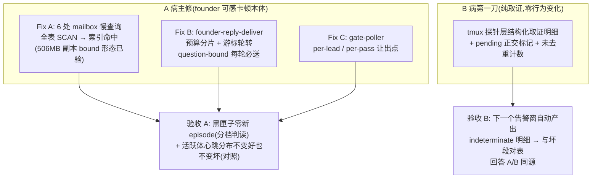

# FLY-2008 gate-poller 挂死事件循环(A 病主修)+ 心跳代写自反告警(B 病第一刀) — 实施计划

Issue: FLY-2008 (https://linear.app/geoforge3d/issue/FLY-2008/容量bug-gate-pollerfounder-reply-deliver-单段-70-秒挂死事件循环-黑匣子-1342z-实捕1995)
日期: 2026-08-23
基于: research.md(§9 机制演进定案;权威推理链在 Linear FLY-2008 comment 树,主评 aa494bf8)

## 0. 机制定案摘要(设计输入,不再重推)

Lead 已在 Linear comment 树把机制定案为**两个独立病**(收据齐全,本 plan 直接采用):

- **A 病(主修面)**:gate-poller 同步周期家族挂事件循环。**慢性病**:黑匣子全天 696 段坏段、逐小时 93–109 段完全平坦、与 founder 活动无关(founder 活动只是调制项)。span 谱系:`gate-poller.tick` n=2276 **max=158s**(主凶);`founder-reply-deliver` n=107 max=145s(每 ~4 分钟一轮、每轮 60–145s,与 founder 是否活跃无关 = 每轮都在做无界工作);`heartbeat.check` n=50 max=73.8s;其余 patrol 家族 26–76s。这是 founder 可感卡顿(Discord 回复慢、routing guard 拒发、chat-send 超时)的本体。
- **B 病(第一刀=取证)**:Bridge 重启幸存会话的心跳由 HeartbeatService **代写**(`HeartbeatService.ts:1257-1275`,FLY-623 "tmux-liveness IS the heartbeat now");adapter 轮询链随旧进程死亡,重启幸存体永久降级为代写族(当前 4/7)。告警触发不是时间戳比较——`emitMonitorLostOnce` 由 `probeSessionLiveness` 返回 `indeterminate` 触发(verdict switch,`minutesSince` 只打印从不比较;**「拉开阈值/周期」的一行级缓解已被撤回令作废,禁止实现**)。判定 A↔B 同源所需的失败证据今天在**探针层内部**就被折成无差别的 `"indeterminate"` 字符串丢弃(`probeRunnerProcessLiveness` 内部 catch;外层 :909-911 的 catch 在生产几乎看不到 tmux 失败——Codex 评审修正了取证位点)。B 病当前唯一该做的:**在探针层加结构化取证明细**(§4),让下一个自然发生的告警窗自动回答「A/B 同源与否」。
- **量的纪律**(comment a68f3c16):9 次/天(去重 episode)与 696 段/天(坏段)**计数单位不可比**,不得当同源先验;未去重的探针失败次数正是第一刀埋点顺手产出的数。

## 1. 目标与非目标

**目标**:
1. **A 病主修**:消除 LeadInboxLoop 每秒级同步全表扫描(profile 实测 CPU 支配项)——六处慢查询全部索引命中;founder-reply-deliver pass **扫描 lane 有界化**(question lane 刻意不设限保投递合同;不再把 tick 拖 60–145s);gate-poller 循环加让出点。
2. **B 病第一刀(仅此,不做其他 B 修法)**:tmux 探针层结构化取证明细(错误类型/是否超时/耗时/时间戳 + pending 正交标记)+ 未去重计数经 /health 暴露,与黑匣子坏段可对表。
3. 验收判据按 Lead 定案:黑匣子同尺分档判读 + **心跳间隔分布按会话类型分开报**(活跃体/停驻代写族),不用「告警归零」。

**非目标 / 禁止项**:
- 🔴 **禁止**实现「阈值/周期拉开」类 B 缓解(撤回令 602e943f:不存在被比较的阈值,属假修);
- B-2b(probe 语义分离/诚实告警文案)、B-2a(链重建)均**不在本单实现**——等第一刀取证回答同源问题后另行裁定(同源 ⇒ 只剩告警可读性修;独立 ⇒ 另行设计);
- 不做数据减肥(FLY-1998)、不动黑匣子仪表(FLY-1995)、不并行化 Discord GET;
- 不加任何新 flag/env(founder 铁律;预算用具名常量)。

## 2. 方案总览



## 3. A 病主修:具体改动

### 3.1 Fix A — flywheel-comm(mailbox 查询计划;全部已在 506MB 生产库副本上 EQP+计时验证)

#### A2/A3/A4 新增三个 partial index(`packages/flywheel-comm/src/mailbox-schema.ts`)

在 `MAILBOX_CORE_SCHEMA` 现有 index 块追加(`CREATE INDEX IF NOT EXISTS`,writer-open 自动应用于存量库;`openReadonly` 不受影响):

```sql
-- FLY-2008 A2: legacy-push 收编 UPDATE 的谓词索引。谓词刻意不含 state 项:
-- 含 state IN (...) 的版本 SQLite partial-index 证明器推不出(实测仍 SCAN)。
CREATE INDEX IF NOT EXISTS mailbox_legacy_adopt
  ON mailbox(to_agent)
  WHERE carrier = 'inbox' AND type = 'instruction'
    AND batch_id IS NULL AND recipient_kind <> 'lead';

-- FLY-2008 A3: getPendingQuestions 的 question 侧索引(NOT EXISTS 侧复用现有
-- mailbox_unique_response covering index)。注:getPendingGatesByRunner /
-- getOpenGatesByRunner 按 from_agent 查,本索引只能给它们无键 partial 扫描
-- (~5.8k question 行,较全表 ~9x 改善);它们在 CLI 路径不在 1Hz 热路,
-- 刻意不为 from_agent 另建索引(范围纪律)。
CREATE INDEX IF NOT EXISTS mailbox_questions_by_recipient
  ON mailbox(to_agent, created_at)
  WHERE type = 'question';

-- FLY-2008 A4: countDeliverable(toAgent) 的可交付计数索引。
CREATE INDEX IF NOT EXISTS mailbox_deliverable_by_agent
  ON mailbox(to_agent)
  WHERE carrier = 'inbox' AND state = 'QUEUED';
```

SQL 文本零改动的查询(A2 的 UPDATE、A3 的 SELECT)靠索引直接翻绿——EQP 实测从 `SCAN mailbox` 变 `SEARCH ... (to_agent=?)`。

> ⚠️ **EQP 探针形态纪律**(对抗评审 BLOCKER 的教训):所有 EQP 验证与守卫测试**必须用 bound-parameter 形态**(`?` 占位,prepare 后取计划),不得用字面量替身——`claim_expires_at <= '字面量' ... LIMIT 10` 与生产的 `<= ? ... LIMIT ?` 会得到**不同的查询计划**(字面量形态曾把 A2b 的 SCAN 误判成 SEARCH)。

#### A2b `releaseExpiredLegacyPushClaims` 第二条 SELECT 的 rowid-order LIMIT 陷阱(对抗评审 BLOCKER,已实锤)

同函数内的过期回收 SELECT(`mailbox-queue.ts:1295-1303`,`... AND claim_expires_at <= ? ORDER BY seq LIMIT ?`)在**生产 bound 形态**下是 `SCAN mailbox`(实测 35ms/call,每 tick 无条件执行):`ORDER BY seq` = rowid 序,planner 偏好免排序的全表扫。修法一行:**`ORDER BY seq` → `ORDER BY +seq`**(一元 `+` 禁用 rowid-order 优化)——bound 形态实测翻成 `SEARCH mailbox_lease_expiry (claim_expires_at<?)` + 对 ~310 行 LEASED 的 temp 排序。语义逐字不变(同一匹配集、同一排序键)。

#### A5 顺带钉住:`claimQueueBatch` 头查询(对抗评审 MAJOR-2)

`claimQueueBatch` 的候选头查询(`mailbox-queue.ts:1148-1175`)今天在生产是裸 `SCAN` + TEMP B-TREE(健康态每 tick 都跑;事发窗 cpuprofile 低估了它——拥堵时 frozen-batch 探测先短路,测量窗偏差)。A4 的 `mailbox_deliverable_by_agent` 落地后它顺带变成小 partial index 扫描(12 行)——这是**受益副作用,必须在 §5.1 守卫里显式钉住**,防止未来索引变更静默回退。

#### A1 `claimBridgeProtocol` 拆 OR(`packages/flywheel-comm/src/mailbox-queue.ts:2233`)

单条 OR SELECT(EQP=SCAN+TEMP B-TREE)拆为两条候选查询,事务内取 `(priority, seq)` 最小者;claim UPDATE 与 fence 语义逐字保留:

```ts
// 分支 1: QUEUED — 命中现有 mailbox_claim_bridge (from_agent=?)
SELECT * FROM mailbox
 WHERE recipient_kind='bridge' AND carrier='inbox'
   AND from_agent=? AND msg_class='protocol' AND state='QUEUED'
   AND (next_retry_at IS NULL OR next_retry_at <= ?)
 ORDER BY priority, seq LIMIT 1
// 分支 2: LEASED 可回收 — 命中现有 mailbox_bridge_reclaim (from_agent=?)
SELECT * FROM mailbox
 WHERE recipient_kind='bridge' AND carrier='inbox'
   AND from_agent=? AND msg_class='protocol' AND state='LEASED'
   AND (claimed_by IS NULL OR claimed_by=? OR claim_expires_at < ?)
   AND (next_retry_at IS NULL OR next_retry_at <= ?)
 ORDER BY priority, seq LIMIT 1
// winner = 两候选按 (priority, seq) 取小(等价于原全局序)
```

等价性:原查询是两互斥分支(state 不同,无重复行)之并上的 `ORDER BY priority, seq LIMIT 1`;两分支各取 top-1 后按同键取小 = 全局 top-1。

#### A4 `countDeliverable` 拆 bound-param OR(`packages/flywheel-comm/src/mailbox-queue.ts:707`)

`(? IS NULL OR to_agent=?)` 在 prepare 时锁死 planner(永远 SCAN)。拆成两条 prepared statement,按 `toAgent` 是否传入选择;谓词逐字不变。

### 3.2 Fix B — founder-reply-deliver 有界化(`packages/teamlead/src/bridge/gate-poller.ts:2114`)

黑匣子实锤该 pass **每 ~4 分钟一轮、每轮 60–145s、与 founder 是否活跃无关** = 每轮都在做无界工作(117 个活 thread × 串行 Discord GET),且 inline `await` 在 `poll()` 主链上把整个 tick 拖停。

#### B1 thread 预算 + 轮转游标

- 具名常量 `FOUNDER_REPLY_SCAN_BUDGET_PER_PASS = 25`(测试可经 `config.founderReplyScanBudget?: number` 注入,默认 25;非 flag)。
- pass 先按现行逻辑组装全量 thread 任务(跨 project × lead 的 `byThread`),再分两档(**预算语义定案,消对抗评审 MAJOR-3 的自相矛盾**):
  1. **question-bound thread(`questions.length > 0`)无条件全部处理**——gate 绑定的 founder 回复保持 ≤60s 时延;
  2. **纯 ingress-scan thread 用独立预算 25**(不与 questioned 抢同一池 ⇒ 扫描类永不饿死),按内存态轮转游标 `founderReplyScanCursor: string | null`。**游标语义精确定义**(Codex R1 MEDIUM-4,防 thread churn 下头部偏favor):任务列表按 threadId 稳定排序;每轮从「第一个 threadId **严格大于**游标值」的位置开始(upper-bound 查找——被删的游标 thread 不回退到 0),只有不存在更大者才回绕到头;**每处理完一个纯扫描 thread 就推进游标**(question-bound 的处理不推进、不计费);预算测试覆盖插入/删除/重启三类扰动。
- **规模数字更正**(评审 MAJOR-3 指出原「12 条 pending questions」量错了谓词——12 是 mailbox QUEUED 行数):`getPendingQuestions` 生产实测 418 行,其中 pass 自己排除 report 类 380 行 + review gate 2 行 ⇒ **有效 question-bound 约 36 问/8 会话** ≪ 预算。单 pass wall = (questioned_threads + 25) × ~0.5s——questioned 是外生量,若 report 排除逻辑回退导致 questioned 暴涨,wall 会跟着涨,§5.2 用超预算用例钉住该边界。
- Bridge 重启游标归零 = 从头轮转,幂等无害(per-thread 消息游标本就持久于 cursorStore)。
- 效果与措辞纪律(Codex R1 MINOR-5):**pass 的有界性是「扫描 lane 有界」,不是绝对 wall 上界**——question lane 刻意不设限以保 ≤60s 投递合同,wall = (questioned + 25) × ~0.5s,questioned 是外生量。今日规模估计:8 questioned + 25 scan ≈ 33 thread ≈ ~15s/pass(**估计值**);纯扫描全量覆盖周期 ≈ ⌈(117−questioned)/25⌉ × 60s ≈ **5 分钟**(诚实边界:无 gate 的 issue thread 里 founder 留言拾取最坏 ~5 分钟;现状实际已是 60–130s+ 且代价是拖死全局)。验收期报告 questioned-thread 数与 pass 时长(§7-1a),question 量回归可见而无需行为变更。

#### B2 资源提升(pass 级)——修正版(对抗评审 MAJOR-4:此前提升的是小头)

- **大头在 deliverer 内部**:`emitFounderReplyDeliveryForThread` 经 `deps.commDbFactory` 默认值 `(p) => new CommDB(p, false)` **每 thread 开一次 writer CommDB**(`founder-reply-deliverer.ts:296, 392`)——每次 open 都跑全量 DDL + migrations + `purgeExpired()`,而生产有 **37,611 行超过 72h retention 的 ACKED**(实测),`purgeExpired → archiveDueFamilies` 每次都有活干(至多 10 个同步归档写事务/次)。修法:**gate-poller 在 pass 级构造 per-project 共享 writer CommDB,以 lease 形态经 deliverer seam 注入**(Codex R2 #2 定稿:deliverer 的传递调用链把 db 交给 `writeTrustedFounderReviewResponse`(要具体 `CommDB`,内部还调 getMessageById / getQuestionsByCheckpoint / getFounderReviewFamily / insertFounderReviewResponseIfGateOpen)与 `tryFounderShipApproval`(`GateResponseDb`)——窄 Pick 门面过不了类型检查也丢运行时行为):**seam 改为 lease `{ db: CommDB; release(): void }`**——默认 lease 自开真连接、`release=close`(逐字节等价现状);pass 注入的 lease 借用共享真连接、`release`=no-op;pass 拥有者在外层 `try/finally` 唯一真 close(抛出路径不得泄漏 better-sqlite3 句柄)。migrations+purge 从每 pass ~117 次降到每 pass × project 数次。共享连接测试必须覆盖 founder-review 与 ship-gate 分支,不只纯扫描。这是 deps seam 的形态变更,非 B3 冻结的「deliverer 内部逻辑」。
- gate-poller 自己的 per-lead `CommDB.openReadonly`(`gate-poller.ts:2131`)同步提升为 per-project 一次(小头,顺带);
- `store.listNonTerminalSessions()` 从 per-lead 提升到 **per-pass 一次**(per-lead 仍走现行 `matchesLead` 过滤,语义逐字保留);
- per-lead 组装循环之间 `await yieldToEventLoop()`。

#### B3 不改的东西(明确)

- pass 仍 inline `await` 在 `poll()` 主链(保序免重入;预算化后单 pass 短);
- `emitFounderReplyDeliveryForThread` **内部逻辑**、cursorStore 语义、dead-letter 重驱、deferred-rebind / action-drain 等兄弟 pass 零改动(B2 只动它的 deps 注入面);
- 5 个 sub-cadence pass 共用同一触发 tick 的现状保留(A 修复后其余 pass 毫秒级)。

### 3.3 Fix C — 让出点(`packages/teamlead/src/bridge/gate-poller.ts`)

- 模块级 helper `const yieldToEventLoop = () => new Promise<void>((r) => setImmediate(r))`;
- 主 poll 的 per-lead 循环(question-relay 外层)每个 lead 之后让出一次;
- founderReplyDeliverPass 的 per-lead 组装循环、per-thread 处理循环各加让出;
- 各 sub-cadence pass 之间各让出一次(把 tick 的长同步串切成段)。
- 不动 LeadInboxLoop 的 tick 结构(A 修复后其同步链 <5ms/tick,再加机制属过度工程)。
- `heartbeat.check` 73.8s span 与心跳链路**零改动**——它的拉长主要是循环饱和的下游,A 修复后由黑匣子复测;若仍长,证据归 B 病取证链继续追(不在本单展开)。

## 4. B 病第一刀:probe 取证(零行为变化)

### 4.1 改动 — 取证 seam 必须下沉到 tmux 探针层(Codex R1 BLOCKER 修正)

**为什么不能只改 HeartbeatService 的 catch**(Codex R1/R2 逐层修正后的定稿机制,已逐条亲核):
- `probeRunnerProcessLiveness`(`tmux-lookup.ts:653-`)**内部**就 catch 了 tmux 失败:超时/抛错被折成字符串 `"indeterminate"`,空输出也是 `"indeterminate"`——外层 `probeSessionLiveness` 的 catch **看不到生产超时**,在那里打 `timedOut` 标签只能测到 mock;
- `:pending` 哨兵在**本路径不会造出 indeterminate 短路**:HeartbeatService 调的 `lookupTmuxTarget` 是封闭 union `found|gone|error`,对任何非空 `tmux_window`(含 `runner-flywheel:pending`)一律返回 `found`(R1 折入时把 `resolveCmuxAttachTarget` 的 `unresolved/pending-target` 分支误认到此函数上,R2 纠正);pending 字符串会被送进真探针,今日结局由真实 pane probe 决定(tmux 报窗口不存在 ⇒ `absent`→verdict `dead`;超时 ⇒ `indeterminate`)。Lead 指出的「`:pending` 提前返回 indeterminate」发生在 `probeTmuxWindowLiveness`(:581)等其他调用面,不在本路径——但**取证必须区分 pending 目标**的要求不变,只是实现位点变了。

**改动形状**:
1. **tmux-lookup 层加结构化明细 sibling API**:`probeRunnerProcessLivenessDetailed(tmuxWindow, runTmux?): Promise<{ liveness: RunnerLiveness; failure?: { stage: "tmux-throw" | "empty-output"; errorType: string; message: string; timedOut: boolean; durationMs: number } }>`——现有 `probeRunnerProcessLiveness` 变成丢弃 `failure` 的薄包装,**四态字符串 API 与全部现有调用方逐字节不变**;现有可选 `runTmux` 注入参数在 detailed 版保留并由包装转发(下层测试走真实现 seam);`timedOut` 从真实 `err`(execFile timeout / ETIMEDOUT)判定,不再靠外层猜。
2. **HeartbeatService 消费明细**:`probeSessionLiveness` 改调 detailed 版,verdict 映射逐字不变;`failure` 存在时经 `recordProbeIndeterminate` 记录(source=`probe_throw`/`probe_unclear`)。`lookup.kind==="error"` 分支记 `lookup_error`。
3. **pending 哨兵 = 正交目标分类,零行为变化**(Codex R2 #1 定稿):当 `found` 的 target 以 `:pending` 结尾时,在**任何**取证记录上并行打 `pendingTarget: true`,并在快照里单列 `pending_sentinel` 计数(对 pending 目标的探测次数,不论最终 verdict)——探测流程与 verdict 映射逐字不变,不加 unresolved 返回/抛出分支,不引入 `invalid_target`(未单独立项)。特征化测试(§5.3-2)钉住 pending 目标在 absence / timeout / 正常三种下层情形的今日 verdict,GREEN 后逐一不变。

**source 标签四类**(Lead 补充判据 2c0ee4f1:确定性来源与间歇性来源绝不能混在一条曲线里;位点按 R2 定稿):

| 维度 | 值 | 触发点 | 性质 |
|---|---|---|---|
| source | `lookup_error` | `lookupTmuxTarget` 返回 `kind:"error"`(CommDB 读失败等) | 视错误而定 |
| source | `probe_throw` | detailed 探针报 `failure.stage="tmux-throw"`(`timedOut` 仅此类有意义) | **间歇性**(A 病嫌疑通路) |
| source | `probe_unclear` | detailed 探针报 `failure.stage="empty-output"` | 间歇性 |
| 正交标记 | `pending_sentinel` | target 以 `:pending` 结尾(spawn 回写未完成的哨兵;每次 spawn 都短暂经过,回写卡死的会话**持续**处于该态)——打在任何记录上 + 快照单列计数(不论 verdict) | **确定性**(结构性) |

同源判定(§4.3)只对**非 pending** 的 `probe_throw` / `probe_unclear` 曲线做——pending 目标是独立的结构病(spawn 回写缺口),混入会污染「探针为什么间歇失败」的答案;`pending_sentinel` 计数若持续非零则指向 spawn 回写路径,另单处理(今日两实例 5f5937b9/906318b3 已由 Lead 手工绑定修复)。

### 4.2 记录去向与 `/health` 接线(Codex R1 MAJOR-2:补生产合成路径)

`recordProbeIndeterminate` = 结构化 `console.warn`(单行 JSON,`[fly2008-probe]` 前缀;episodes.jsonl 侧按时间戳对表)+ 进程内计数器。**不写数据库、不发 Discord、不建新表、不新增周期任务。**

`/health` 暴露的生产合成路径(现状 `livenessHealthProvider` 闭包在 `bridge/plugin.ts` 组装且早于 HeartbeatService 构造,`buildLivenessManifest` 无该输入——需要显式接线):
1. HeartbeatService 新增只读快照 API `probeForensicsSnapshot(): { pending_sentinel: number; lookup_error: number; probe_throw: number; probe_unclear: number; last_at: string | null }`(计数未去重,四键恒在、零值显式);
2. `plugin.ts` 用 late-bound holder(构造后赋值的 `let heartbeatServiceRef`)把快照喂进 `livenessHealthProvider`;
3. `buildLivenessManifest` 增加**纯加性** typed 字段 `probe_forensics`(可选字段,undefined = 服务未起;manifest validator 同步扩展该可选字段——不改 schema_version,消费方均为可选读);
4. 路由测试:真 `buildLivenessManifest` 输出喂进现有 `/health` 探针谓词,断言四键与注入计数一致(§5.3-3 经真实 manifest 路径直到 HTTP 边)。

### 4.3 同源判定表(取证后由后续单执行,本单只交付取证)

| 观测 | 结论 | 后续 |
|---|---|---|
| indeterminate 集中于黑匣子坏段窗内,错误=超时/子进程 | **A/B 同源**,B 无独立修法 | 修 A + B 只剩告警语义可读性修(诚实文案) |
| 与坏段无关,错误=目标查不到/CommDB | B 独立真问题 | 另行设计(B-2b 语义分离候选) |

## 5. TDD 测试计划(RED → GREEN)

### 5.1 flywheel-comm(`packages/flywheel-comm/src/__tests__/mailbox-query-plans.fly2008.test.ts`)

1. **EQP 守卫(先 RED)——覆盖整条 per-tick 语句链,不止四条肇事查询**(对抗评审 MAJOR-2):临时 DB 建满 schema + fixture,对 LeadInboxLoop 每 tick 实际执行的语句集(frozen-batch 探测 / `claimQueueBatch` 头查询 / in-flight 计数 / `reconcileExpiredLeases` / `releaseExpiredLegacyPushClaims` 三条 / `claimBridgeProtocol` 两分支 / `countDeliverable` 两形态 / `claimRunner`)逐条跑 `EXPLAIN QUERY PLAN`,断言无裸 `SCAN mailbox`(允许小 partial index 扫描并逐条点名钉住,如 `claimQueueBatch` 头查询钉在 `mailbox_deliverable_by_agent` 上)。**探针必须用 bound-parameter 形态 prepare**(字面量形态会得到不同计划——本单 BLOCKER 的来历)。阳性对照:对一条故意无索引的查询断言 SCAN(证明尺子能变红)。
2. **A1 行为等价矩阵**:QUEUED(priority 5,seq 早)vs LEASED-expired(priority 1,seq 晚)等多组序,拆分后 claim 结果与旧全局序逐一一致;fence(claimed_by 他人未过期不可抢)、`next_retry_at` 未到期两分支都不取。
3. **A2b 行为等价**:`ORDER BY +seq` 与 `ORDER BY seq` 在多组 fixture 下返回同一 id 集与序;EQP 断言 SEARCH `mailbox_lease_expiry`。
4. **A4 行为等价**:带/不带 toAgent 与旧实现一致(含 next_retry_at 边界)。
5. 既有 mailbox-queue 套件全绿(纯查询形态改写)。

### 5.2 teamlead(`packages/teamlead/src/bridge/__tests__/gate-poller-fly2008-deliver-budget.test.ts`)

1. **预算裁切(独立扫描预算语义)**:40 thread(3 question-bound),scanBudget=10 → 单 pass 恰处理 3 questioned + 10 scan;下一 pass 游标续转不重复,直至回绕;
2. **question-bound 永不受预算影响**:questioned=30,scanBudget=10 → 30 questioned 全处理 + 10 scan(扫描类也不被 questioned 挤饿);
3. **byte-compat**:scan threads ≤ budget 时与现行行为一致(现有 founder-reply-deliverer / gate-poller-fly1041/1099 套件全绿为回归面);
4. **B2 提升(lease 形态)**:spy 断言全 pass 真连接只开 per-project 一次(per-thread lease 借用共享连接、release 为 no-op)、gate-poller 自身 openReadonly = project 数、listNonTerminalSessions = 1/pass;**共享连接覆盖 founder-review 与 ship-gate 分支**(writeTrustedFounderReviewResponse / tryFounderShipApproval 经借用连接跑通,Codex R2 #2);**抛出路径**:模拟 pass 中途抛错,断言共享连接仍被外层 finally 真 close(无句柄泄漏);默认 lease(非 pass 注入)行为与现状逐字节等价。

### 5.3 tmux-lookup + HeartbeatService(既有 harness 内新增)

1. **探针层明细(真下层行为,非 HeartbeatService mock)**:对 `probeRunnerProcessLivenessDetailed` 用真实 runner 注入四类下层情形——execFile 超时(真 timeout 形状的 err)、tmux 绝迹消息、空输出、正常 pane 输出——断言 `liveness` 与现行包装逐一相同、`failure.timedOut/stage` 正确;现有字符串 API 全部调用方零改动(编译面证明);
2. **特征化先行(pending 哨兵)**:RED 特征化测试喂 `tmux_window='runner-flywheel:pending'` 走 `probeSessionLiveness` + 真实调用方路径,钉死今日可观测结局;GREEN 断言:lookup 仍为 `found`、detailed 探针以原样 pending target 被调用、absence/timeout/正常三种下层情形的 verdict 逐一保持既有值、`pending_sentinel` 每次探测恰 +1、任何 failure 记录带 `pendingTarget: true`——**不新增 unresolved 分支**(closed union 不动);
3. **计数器经真实合成路径直到 HTTP 边**(Codex R2 #3):扩展 `packages/teamlead/src/__tests__/bridge.test.ts` 里既有的 late-bound `/health` 测试——provider 走真 `buildLivenessManifest`,断言 HeartbeatService 引用**填充前**(`probe_forensics` 缺席)与**填充后**(四键+`pending_sentinel` 计数=注入数)的 HTTP 响应两态;builder/validator 的字段形状与可选缺席另留单测;
4. 既有 FLY-1282/FLY-1329 probe 套件全绿(byte-compat 断言面)。

### 5.4 全仓门

`pnpm lint` + `pnpm -r build` + `pnpm test:packages:run` + 相关 shell harness(执行节点照 role 合同)。

## 6. 兼容性与风险

| 风险 | 定级 | 处置 |
|---|---|---|
| 新索引首次 CREATE 在 506MB 库一次性扫表(秒级) | 低 | `IF NOT EXISTS`;**首个付账者不保证是 Bridge boot**——部署后第一个 writer-open 可能是某个 runner 的 CLI 命令,在 busy_timeout 5s 下逐条(每条 CREATE 自成隐式事务)等锁建索引(评审 MINOR-6);可接受,如实声明 |
| A1 拆分行为漂移 | 低 | §5.1 等价矩阵 + 互斥分支形式化论证 |
| B1 降低非 gate thread 的 founder 留言拾取时延(最坏 ~5min) | 中(产品可见) | 已写进 founder HTML 诚实边界;gate-bound 不受影响 |
| 游标内存态,重启归零 | 低 | 重扫幂等 no-op |
| B 病取证的日志量 | 低 | 记录只在探针失败/pending 目标时产生;量级由**探测节奏 × 受影响会话**决定(扫描器 ~300s/轮 × 代写族 4 具 ⇒ 全失败上限 ~1,150 条/天;pending 卡死单会话 ~288 条/天),单行 JSON,可承受;若同源,坏段窗内密集正是要的证据(不按 9 次/天去重告警估——那是另一个计数单位,Codex R2 #4) |
| 修完 A 后 B 的告警频率可能自己变(扫描器不再被拖) | 说明 | 这本身就是同源判定表的一行;取证数据在前、修 A 在后同一 PR,坏段窗对表仍可用部署前后账本 |

回滚:纯加性索引(可 DROP)+ 查询形态改写 + gate-poller 局部逻辑 + 纯附加日志;单 PR revert 即回滚,无不可逆项,无 flag。

## 7. 验收标准(Lead 定案口径)

部署后观察 ≥24h(黑匣子与心跳账本都在线,before 基线=2026-08-23 全天账本):

1. **A 病(黑匣子同尺,分档判读)**。**预注册判读口径**(评审 MINOR-9):判据只读 **episode 铸造本身**(max loop delay ≥1s/30s 窗)按天计数对比——慢性病全天平坦(96 段/小时级),日计数天然可比,不需要「同等 founder 活动密度」这类无操作定义的条件;**span 出现与否不是判据**(预算化后的 deliver pass 仍会产生 >500ms 的合法 wall span,它们会出现在其他成因铸出的 episode 里——wall span 是归因辅助,不是病)。分档:
   - 新 episode 日计数归零 ⇒ 单一成因证实;
   - 显著下降非零 ⇒ 机制成立 + 存在第二成因,自动开第二成因调查(不得误读为失败);
   - 无变化 ⇒ 机制假设被削弱,回 profile 重定位。

   1a. **附带观测量**(Codex R1 MINOR-5):验收窗同时报 founder-reply pass 的 questioned-thread 数与单 pass 时长(黑匣子 wall span 即可读出)——question lane 无上界是设计选择,该量回归时要可见。
2. **心跳间隔分布,按会话类型分开报**(合并报会产生第三层误读):
   - **活跃体(有 adapter 链)**:分布=真 runner 信号;**可证伪断言:活跃体永不冻**(出现一条干活中冻住的 session 即推翻机制定案);
   - **停驻代写族**:分布=扫描器健康度指标(修好 A 后它变好看是扫描器变规律,不是 runner 变好——报告必须如此标注)。
3. **B 病第一刀**:下一个自然告警窗(历史 ~9 次/天)产出带 stage/errorType/timedOut/durationMs 的明细,与黑匣子坏段时间戳可对表 ⇒ 同源问题可判。**不以「告警归零」为验收**。
4. FLY-2007 阶段 0 的 before 基线一轮照跑,2008 落地后重跑(排程含义已在该单同步)。

## 7-bis. 对抗评审收敛记录(新鲜上下文 Claude 驳倒式评审,verdict=REFUTED → 已全部折入)

| # | 级别 | 发现 | 折入 |
|---|---|---|---|
| 1 | BLOCKER | `releaseExpiredLegacyPushClaims` 第二条 SELECT 在生产 bound 形态是 SCAN(35ms/tick/lead),research 原「无罪」判决基于字面量形态探针=坏尺 | §3.1 A2b(`ORDER BY +seq`)+ EQP 探针形态纪律 + 守卫覆盖 |
| 2 | MAJOR | 查询清点漏了 `claimQueueBatch` 头查询(今天裸 SCAN,A4 索引顺带治好但无守卫钉住);countDeliverable 频率账错(idle lead 30s 为主) | §3.1 A5 + §5.1 全链守卫;research §10 更正 |
| 3 | MAJOR | B1 预算语义自相矛盾(text vs test);「12 条 pending」量错谓词(实为 418 行含 380 report,有效 ~36 问) | §3.2 B1 独立扫描预算定案 + 数字更正 |
| 4 | MAJOR | B2 提升的是小头;大头=deliverer 每 thread 开 writer CommDB(migrations+purgeExpired,37,611 行过期 ACKED 每次都有活干) | §3.2 B2 修正(deps.commDbFactory 注入 pass 共享连接 + try/finally) |
| 5-9 | MINOR | A3 覆盖声明过宽 / 首个建索引付账者可能是 CLI / 新索引写放大有界(核过) / B2 连接需 finally close / 验收判读口径需预注册 | §3.1 注 / §6 风险表 / §5.2-4 / §7-1 |
| 10-11 | INFO | H5 时延边界核过(45min/10min/30min 常数全 ≫5min 或在豁免 thread 内);A1 等价论证核过 | 无需改动 |

评审通道口径(Lead 裁定):design gate 以**真 Codex 轮**为准;本对抗评审为补充;agy 轮按 founder 禁令作废不引用。

**Codex R1(CHANGES REQUESTED)折入记录**:#1 BLOCKER 取证层不可观测(probeRunnerProcessLiveness 内吞超时)→ §4.1 重写为 tmux-lookup 层 detailed sibling API(注:R1 时对 pending 的「unresolved/TypeError」读法**已被 R2 证伪并取代**——lookupTmuxTarget 是封闭 union,pending 一律 found 进真探针,见 §4.1);#2 MAJOR `/health` 无生产合成路径 → §4.2 快照 API + late-bound holder + 加性 manifest 字段 + 真路径测试;#3 MEDIUM 借用连接所有权 → §3.2 B2 类型收窄接口 + 双层 finally;#4 MEDIUM 游标消失语义 → §3.2 B1 upper-bound 查找 + 每 scan-thread 推进;#5 MINOR 措辞(scan-bounded 非 wall-bounded)→ §3.2/§7-1a。

## 8. 实施顺序(执行节点)

1. RED:§5.1-1 EQP 守卫 + §5.1-2/3 等价基线 + §5.3-1 探针层明细断言 + §5.3-2 pending 特征化 + §5.3-3 /health 两态;
2. GREEN:A2/A3/A4 索引 → A1/A2b/A4 改写 → EQP 翻绿 → B 病取证代码(探针明细 + 快照 + manifest 接线);
3. RED→GREEN:§5.2 预算/游标/提升 → B1/B2/C 实现;
4. 全仓门 + Codex code review(xhigh)→ PR;
5. 部署走班车(FLY-1959);验收窗独立 QA 按 §7 读黑匣子 + 心跳账本(分族口径)。
