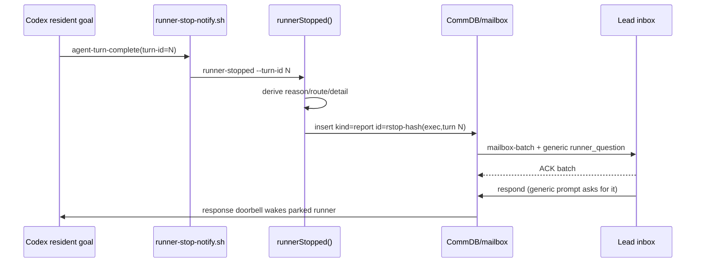

# FLY-2017 RUNNER-STOPPED 改为状态沿申明 — 调研
Issue: FLY-2017 (https://linear.app/geoforge3d/issue/FLY-2017/bridgebug-停驻体-runner-stopped-申明是周期重发不是状态沿触发安静停驻的体每-3-分钟给-lead-灌一条同文)
日期: 2026-08-24
基于: exploration.md

---

## 1. 现有链路



关键文件：

- `scripts/hooks/runner-stop-notify.sh`：Codex `agent-turn-complete` 过滤后，前台写 turn-boundary ingress，再 detached 运行 `runner-stopped` 与 `runner-wake-sweep`。
- `packages/flywheel-comm/src/commands/runner-stopped.ts`：reason precedence、turn hash/idempotency、`kind=report` enqueue。
- `packages/teamlead/src/bridge/question-admission.ts`：把 CommDB question materialize 成 `runner_question` Lead event。
- `packages/teamlead/src/bridge/{mailbox-lead-runtime,commdb-lead-runtime}.ts`：所有 `runner_question` 无条件渲染为 `[ASK]` 并给出 `flywheel-comm respond`。
- `packages/teamlead/src/bridge/bootstrap-generator.ts`：Lead 重启时把所有无 checkpoint 的 pending row 收入 `pendingRunnerQuestions`，包括本不等待答案的 `kind=report`。

## 2. 根因证据

### 2.1 去重是 turn 重放幂等，不是状态沿幂等

`runner-stopped.ts` 当前构造：

```text
turnKey = source : session-or-exec : anchoredTurn
turnHash = sha256(execId \0 turnKey)
questionId = rstop-${turnHash[0..32]}
```

本地 `sent/<turnHash>` marker 与 CommDB deterministic id 都只识别同一个 vendor turn 的重放。quiet-wait 的周期 turn 有全新 `turn-id`，所以每次都得到新 marker、新 qid；随后 derived content 因 active `parked` declaration 未变化而逐字相同。这正好解释 issue 的“约三分钟一条同文”而无需假设模型在轮询。

`packages/flywheel-comm/src/__tests__/runner-stopped.test.ts` 现有测试只覆盖：

- 同一个 `turnId` 重放 → 一条；
- 同一个 `turnId` 重新推导出不同内容 → 保留第一份；
- 无 anchor 的 Claude fallback → 每次唯一。

没有覆盖“不同 turnId、同一 canonical declaration”的状态沿语义。

### 2.2 `kind=report` 只豁免 founder reply binding，没有豁免 respond

`CommDB.insertQuestion(..., {kind: "report"})` 的注释明确：现有唯一差异是 founder-reply candidate exclusion，其他 question semantics 不变。QuestionAdmission 不把 `kind` 放入 HookPayload；两个 Lead runtime 只看 `event_type=runner_question`，因此产生：

```text
[ASK] Runner is asking ...
Reply via: flywheel-comm respond ... rstop-... "your reply"
```

这与 report 的 fire-and-forget 意图矛盾。`respond` 又会沿 ask-marker/runner mailbox wake 管线唤醒 Codex，形成 issue 实测的自激回路。

Lead rules 的 `Runner Question Handling` 进一步要求“一条 runner_question → 一次通知”和收到回答后执行 `respond`，当前也没有 rstop 例外；同一章后部的编号步骤、对比表和“Both reply the same way”会覆盖只加在章首的例外。`runner-messaging-rules.md`、`runner-patrol-rules.md` 也含通用 respond/relay 指令。即使第一批已 ACK，Lead 重启 bootstrap 仍会把未 response 的 row 列为 Pending Runner Question，再次给出 reply action。

`packages/flywheel-comm/src/commands/respond.ts` 目前只有 `founder_review` 和 `approve_to_ship` 的 fail-closed 边界；普通 checkpoint-less row 会进入 `insertGuardedResponse()`，随后 retire ask marker。仅改 prompt 不能保护协议，CLI 必须识别可信 rstop report 并在任何 write/wake side effect 前拒绝。

## 3. 事务与数据模型考察

CommDB 使用 `better-sqlite3`、WAL 与 `busy_timeout=5000`；MailboxQueue 的 enqueue 已在 `.transaction(...).immediate()` 内维护 `mailbox_identity` + `mailbox` 原子插入。CommDB 也广泛使用 nested transaction 原语。

因此最稳妥的状态沿原语位于 CommDB：外层 `BEGIN IMMEDIATE` 先读 `runner_stop_declarations` 当前行，只有 content 变化才调用既有 deterministic insert；插入成功后仅在旧 question 已有 Lead delivery/ACK 证据时退役，再更新 current 行。两个 detached reporter 即使来自不同进程，也会由 SQLite 串行提交。

不应把 `ingressTs` 放进 current-state 排序合同。hook 在 turn boundary 前台记录 ingress，但 detached reporter 稍后才读取 completion breadcrumb、pending question 和 declared state，并据此构造 content。若较新的 ingress reporter 先提交 parked=A，而较旧 ingress reporter 后读到 completion=B，水位会把 B 判 stale；若 caller 把 stale 当同文 duplicate 还会消费 breadcrumb，从未入队的终态将永久丢失。

但仅按 commit 顺序也有残余竞态：旧 leg 可以先完成 content 推导、随后在 `BEGIN IMMEDIATE` 等锁；更新的 leg 后推导却先取得锁并提交，旧 leg 最后会把 current 回退。因此输入增加 `derivedAtMs`，在 canonical content 构造完成后、进入 DB 前立刻捕获。current ledger 保存该值：较小的不同 content 返回独立 `stale/contentMatched=false`；相同 content 无论先后都 duplicate，并把 ledger 的 `derivedAtMs` 单调推进到较大值。毫秒相同的不同推导按实际 transaction 顺序收敛；跨分钟重发与 5s busy window 均有明确顺序。`ingressTs` 继续只服务原有 lower-bound reason 推导。

建议 schema：

```sql
CREATE TABLE IF NOT EXISTS runner_stop_declarations (
  execution_id TEXT PRIMARY KEY,
  content_hash TEXT NOT NULL,
  content TEXT NOT NULL,
  question_id TEXT NOT NULL,
  updated_at TEXT NOT NULL
);
```

不需要历史表；不可变历史已在 mailbox。此表只表示当前电平，mailbox 表示每次状态沿。

## 4. 行为矩阵

| 前一 current | 新推导 | 结果 |
|---|---|---|
| 无 | A | enqueue A，current=A |
| A | A，新 turn | duplicate，不 enqueue |
| A | B，B 更新 | enqueue B；A 已投递才退役，current=B |
| B | A，A 更新 | enqueue A；B 已投递才退役，current=A |
| A | B，但 B 的 `derivedAtMs` 更早 | stale，不 enqueue、不退役、不消费 breadcrumb |
| A | A，同 turn replay | 既有 turn marker/deterministic id duplicate |
| A | B，但 qid 与既有 A 冲突 | 保留既有 A；current 不推进到 B |
| 任意 | DB transaction 失败 | 不更新 current；下次可重试 |

`getPendingQuestions()` 明确排除 `relay_state='terminal_disposed'`，`retireQuestionGuarded()` 已能在 unanswered guard 下同时写 `resolved_at/state/acked_at/expires_at/relay_state/superseded_at/superseded_by`。但它会把可靠队列 row 直接设为 ACKED；若 Lead 尚未收到该沿，QuestionAdmission 会撤销 delivery。因此新沿原语只能在旧 row 已有 `delivered_at` 或 `state='ACKED'` 时复用退役语义。未投递旧沿保留在队列；Lead batch ACK 则在同一 ACK transaction 把可信 rstop 标成 `terminal_disposed`，作为单向 report 的自然消费/退休点。

## 5. Lead 投递面

现有 cutover 主路由 QuestionAdmission 把 question materialize 后交给 LeadInboxLoop；后者的 mailbox-batch header 要求 `ack_batch`，这是可靠投递回执。修复不动这一层。

需要改变的是 materialized model content、CLI 边界与 bootstrap candidate set：

- `question_kind=report + rstop-*`：`[REPORT]`、`Do not respond`、`ACK batch/event only`；
- 其他 `runner_question`：保持 `[ASK]` 与 `respond`；
- gate：保持 checkpoint formatter；
- `respond`：可信 rstop report 直接 fail closed；
- bootstrap：可信 rstop report 不属于 pending question，完全排除；
- `pending` CLI：同样排除可信 rstop，不把 forensic history伪装成待回答项目；
- Lead rules：章内每个通用 response/relay 语句都明确 rstop 是窄例外，避免后文覆盖 renderer 的 no-response 文案。

“可信 rstop”不能只看 `kind`，否则任意普通 report 都会被吞；也不能只看 id/content，避免伪造。live event、bootstrap 与 respond 三个边界都使用完整、未截断输入的同一三项合同：`kind === 'report'`、id 匹配 canonical `rstop-` 形式、content 以 `RUNNER-STOPPED kind=runner_stopped ` 开头。TeamLead wire 只携带 kind；不新增 event family。

这里不新增 event type 或 notifier，符合 FLY-1560 后“收敛既有申明协议、不恢复 watcher/alert family”的边界。

## 6. 风险与防线

1. **错误永久去重**：若 qid 直接改为 content hash，A → B → A 的最后 A 会丢；current-state 账避免该问题。
2. **并发双写**：先查后写若不在同一 immediate transaction，两个 detached process 会都看到 A 之前的状态；必须原子化。
3. **digest collision/实现错误**：同时比较完整 content；hash 只用于诊断与紧凑账面。
4. **旧库首次部署**：无 current row 时允许首条申明，这是必要的可观测 cutover；之后安静。
5. **普通 ask 语义漂移**：special-case 必须同时验证 kind 与 `rstop-*` identity；普通 report/ask 是否也应单向化留独立治理，本单不扩大。
6. **旧沿永久 pending**：report 不再有 response child；下一沿只可 supersede 已投递旧沿，batch ACK 则直接 terminal-dispose 本批可信 rstop；`finalizeSession()` 还需清 current ledger 行。
7. **bootstrap 复发**：若只改 live runtime，Lead 重启仍会要求 respond；generator 必须在复制/截断前用完整 row 排除可信 rstop。
8. **仅靠 prompt 的脆弱性**：即使规则与 renderer 正确，人工复制旧命令仍可能唤醒 Runner；`respond.ts` 必须硬拒绝且测试无副作用。
9. **伪装/误分类**：所有 no-response/filter 分支均要求 kind、canonical id、content signature 三项同时成立；单项或双项 near-match 继续走普通 ask。
10. **锁等待后的旧推导**：current ledger 保存 content 构造后的 `derivedAtMs`；older different writer 返回 `stale` 且 `contentMatched=false`。跨进程测试必须同时覆盖 same-content 与 different-content 两臂。
