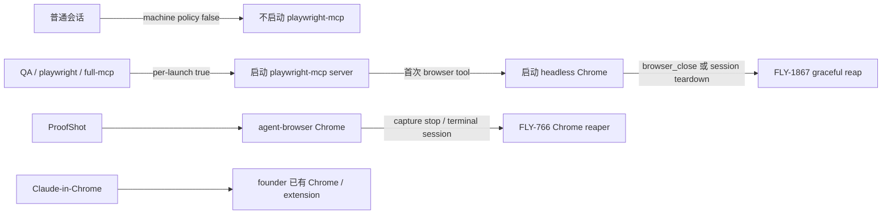

# FLY-2026 浏览器按需启动 — 探索
Issue: FLY-2026 (https://linear.app/geoforge3d/issue/FLY-2026/宿主资源-浏览器按需启动playwright-常驻实例从-59-降到个位数1944-a3-遗留-w5-段)
日期: 2026-08-24
基于: 无

## 0. 一句话

FLY-1867 已经把代码侧的启动与回收器官造好；FLY-2026 的真实缺口是把当前宿主从 `playwright=true / headless 未设` 切到既有 policy，并用真实 QA browser、ProofShot 与 Claude-in-Chrome 路径证明“需要时能起、结束后能收、空闲时为个位数”。

## 1. 来源与当前证据

| 事实 | 当前证据 | 判定 |
|---|---|---|
| FLY-1867 已实现 ordinary default-off、QA/label positive opt-in、headless 与 teardown | PR #904；`scripts/setup-mcp-on-demand.sh`、`packages/config/src/runner-mcp-profile.ts`、`mcp-descendant-reaper.ts`、`chrome-session-reaper.ts` | 已有，不再造第二套 |
| FLY-1944 明确把 W5 留到后续 operational segment | PR #912 / #923 body；`engineering/doc/FLY-1944-host-terminal-chain/` | 本 issue 正是该段 |
| 当前宿主尚未切换 | `scripts/setup-mcp-on-demand.sh check /Users/xiaorongli/.claude/settings.json` 于 2026-08-24 返回 `policy drift: playwrightPlugin, playwrightHeadless` | 未完成 |
| orphan census 能诚实区分 `ok` / `unknown` | `~/.flywheel/state/fly1867/orphan-census.jsonl` 最近健康样本为 `status=ok,candidates=[]`，中间 `ps` 失败会记 `unknown` | 可复用，但它只量 orphan Chrome，不量所有常驻 MCP |
| ProofShot/agent-browser 回收器在线 | `/tmp/flywheel-bridge.log` 当前周期样本为 `scanned=1`、零 error；`chrome-session-reaper.ts` 按 owner/session terminal 收敛 | 可复用 |
| 当前 runner sandbox 看不到宿主进程表 | `ps` / `pgrep` 返回 EPERM；FLY-1867 PR 也记录同一边界 | implement 内不能把“扫不到”冒充为零 |

FLY-1944 曾量到 78 个 live `npm exec @playwright/mcp@latest` 进程；本 issue 描述把目标基线记作 59。两者不是同一时刻的样本，最终文档只把带时间戳的新 census 当验收证据，不拿历史点估计冒充当前值。

## 2. 两级 lazy boundary

关键区分：

- `playwright-mcp server` 目前随插件启用而 eager；Chrome 已经是 first-tool lazy。
- machine policy 的 `plugin=false` 消除普通会话的 server 常驻；QA / `playwright` / `full-mcp` 通过 per-launch settings 恢复能力。
- `PLAYWRIGHT_MCP_HEADLESS=true` 只保护显式 opt-in 的 Playwright Chrome，不改变 Claude-in-Chrome。
- ProofShot 走 `agent-browser`，不是 `playwright@claude-plugins-official`；它由现有 owner marker + terminal-state reaper 回收。

## 3. 验收语义

本 issue 的“空闲态个位数”必须同时量三层，不能只量其中一个：

1. Playwright MCP server 相关进程总数；
2. Playwright Chrome main 与完整 Chrome process tree；
3. ProofShot / agent-browser Chrome main 与完整 process tree。

空闲态指没有正在执行 browser tool / capture 的受管任务，并且上一条真实路径已经完成其公开 close/teardown。活跃 browser 窗口期间允许短暂超过个位数；验收看 close 后的有界收敛，不把“使用中也必须少于九个 OS helper”写成不可能的合同。

桌面回归不用 argv 猜 headless：沿用 FLY-1867 的能力式判据，目标 Chrome main 的 on-screen window 数为 0，并以 founder 自己的正常 Chrome 窗口作阳性对照。

## 4. Assumptions（进入 design review 前显式列出）

1. 当前 issue 已明确“FLY-1867 Done，依赖清了”，因此把原 W5 的 WebGL/screenshot gate 视为已满足；FLY-2026 仍会做真实路径回归，但不重开一套阈值设计。
2. 本段不新增 browser supervisor、idle timer、Chrome classifier 或自动 kill 权威；任何新增机制都必须先证明现有 FLY-1867/766 seam 无法承载。
3. 本段不批量关闭活 runner / Lead，不运行 `restart-services.sh`，也不投 restart ticket。存量进程通过正常 session 结束与既有 reaper 收敛；若验收必须人工重开 founder Terminal，由 Lead 先告知 founder。
4. `~/.claude/settings.json` 是生产宿主配置，不进入 git。仓库交付物应是经过评审的 cutover/verify 合同与代码测试；真实 apply 必须由有宿主权限的 operator 执行并保留 receipt。
5. Claude-in-Chrome 与 Playwright 是两套能力；关闭 Playwright machine default 不能通过 `--no-chrome` 顺手关闭 Claude-in-Chrome。

## 5. 方案方向

### A. 复用既有 writer + 补齐 W5 可审计 cutover（推荐）

以 `setup-mcp-on-demand.sh apply/check/rollback` 作为唯一配置 writer；本 issue 只补缺失的宿主 census/真实路径证据与一次受控 apply receipt。优点是机制最少，直接完成 W5。

### B. 新造 lazy MCP supervisor

不选。FLY-1867 已证明 Chrome 是 first-tool lazy；再造 stdio proxy/supervisor 只会复制生命周期、信号与版本权威。

### C. 全面禁用 browser

不选。会破坏 QA browser、ProofShot 与 Claude-in-Chrome，违背“需要时按需起”的验收。

## 6. 探索结论

实现面应围绕两个窄 tracer bullets：**一个只读、fail-closed 的 idle census**，以及 **ProofShot post-start failure 的直接 cleanup**。宿主切换继续调用既有 `setup-mcp-on-demand.sh`，不再增加第二个 writer；任何验证入口都必须把 `unknown` 当失败，不负责杀进程或重启。真实路径验证由 QA/Lead 在受控会话中完成。
