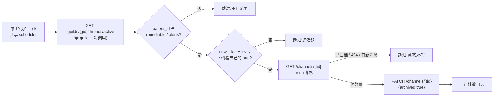

# FLY-2028 thread 过期归档不生效(返工 1435) — 探索
Issue: FLY-2028 (https://linear.app/geoforge3d/issue/FLY-2028/返工1435-thread-过期归档仍然不生效-设置对了但-discord-原生-auto-archive)
日期: 2026-09-02
基于: 无(本 issue 首个文档;上游输入 = issue 正文、FLY-802 `plan.md`/`design-correction.md`、FLY-1435 `research.md`/`plan.md`、FLY-1431 `qa-report.md`、本轮只读真机探针)

## 0. 一句话

**Discord 从来不会替我们把 `archived` 翻成 true;`auto_archive_duration`(下称 aad)只管「已读线程在侧栏停多久」,而 founder 看到的线程几乎全是未读(被 Lead @ 到),被 Discord 未读保护钉在侧栏。** 三次「修好」修的都是出生值(aad=60/1440,现在确实全对),再加人工大扫除;没有任何常驻机制按年龄归档。本单要做的是**让 Discord 自己承诺的那件事真的发生**:Bridge 里加一个小的定时清扫器,只管两个频道,只做一件事 —— 线程静置超过它自己的 aad 就 `PATCH archived:true`。

## 1. 问题到底是什么(把四张单子串起来)

| 单 | 做了什么 | 为什么没解决 founder 的痛 |
|---|---|---|
| FLY-802 | 创建线程时按父频道 default 写 aad;曾实现过 reconciler(commit `d0b7794d7`,565 行 + 598 行测试)但 **founder 07-22 否决「不需要巡检员」后删除** | 归档执行全权交给 Discord 原生 |
| FLY-1431(802 的 QA) | 真机静置 203min,`archived` 始终 false;报告判 PASS,理由是「翻 archived 是平台的事,不是 PR 验收项」 | 验收合同本身把「线程真的消失」排除在外 |
| FLY-1435 | 查实 Discord 2022 年语义变更:aad 只控制客户端侧栏收起;**未读线程被钉住,aad 不生效**;修了 plugin 抢建 4320 与 Cass 无 MANAGE_THREADS 两个洞 | 明确写下「若 founder 想连未读一起强收,那是新的产品决策(她拍了才动)」 |
| FLY-2028(本单) | Annie 08-24:「为什么还是都一直堆在那里?」;issue 证据:74/74 超窗未归档,归档只在 07-31 / 08-14 / 08-24 三个时间点成批发生 | **这就是 1435 留给 founder 拍的那个决策** |

本轮只读探针(2026-09-03T03:10Z,claw-infra-bot 只 GET)再次复现同一形状,细节见 `research.md` §1:

- `#leads-roundtable` 活跃 9 条,aad 全是 60,静置 1.8h ~ 40.8h,**9/9 超窗未归档**;
- `#flywheel-alerts` 活跃 10 条,aad 全是 1440(线程自带值;**频道 default 是 null**,issue 里的「频道 24h」其实是线程值);
- roundtable 已归档线程的 `archive_timestamp` 继续成批出现:08-24T17(53)、08-27T06(29)、08-28T05(7)、08-29T00(5) —— **08-24 之后又扫了三次**,人工大扫除还在继续。

## 2. 根因(不是猜,是官方文档 + 28 天真机)

FLY-1435 `research.md` §E1/E2 已经钉死,本轮复核官方 docs 原文一致:

> "Threads automatically archive after a period of inactivity. As a server approaches the max thread limit this timer will automatically lower, usually not below the `auto_archive_duration`. … The `auto_archive_duration` field previously controlled how long a thread could stay active, but is now repurposed to control how long the thread stays in the channel list."

三个推论:
1. **服务端归档计时器 ≠ aad**,常态值未公开;在我们这种远未逼近线程上限的安静 guild 上实测 28 天不翻(FLY-1435 §E2)。
2. aad 现在只控制**已读**线程从侧栏收起;**未读/被 @ 的线程被 Discord 未读保护钉住**(FLY-1435 §E4 真机 A/B)。FLY-576 合同规定 founder 恒为 roundtable 线程成员且被 @,所以对她来说每条线程都是未读 ⇒ aad 形同虚设。
3. "Activity" = 发消息 / 解档 / 改 aad;读消息、REST GET 都不算 —— 清扫器按 `last_message_id` 时间判静置是安全的。

所以「设置对了但不生效」是**平台行为**,不是配置错、不是权限错、不是 bug 没修到 —— 靠再改任何设置都不会变。**要么接受堆着,要么自己扫。** issue 已经替 founder 选了后者。

## 3. 修向:清扫什么、按什么、谁来扫

### 3.1 候选方案

| # | 方案 | 判定 |
|---|---|---|
| A | **Bridge 内定时清扫器:范围 = Bridge 已知的两个频道 env;阈值 = 线程自己的 aad;写面 = 只 `archived:true`** | **采纳** |
| B | 复活 FLY-802 reconciler 原样:范围 = 全 guild 里「频道 default 非 null」的频道;同时收敛 aad + 归档 | 否决:`#flywheel-alerts` 频道 default 是 null,B 根本扫不到它;任何频道一旦被人设了 default 就静默入围(issue chat 频道的线程归 lifecycle 归档器管,不该被年龄扫);aad 收敛这一半 FLY-1435 已在出生面修完(实测 9/9=60) |
| C | 阈值取父频道 default 而非线程 aad | 否决:两套真相;alerts 频道 default 为 null 时还得再造 fallback;线程 aad 本来就是 Discord 在线程设置里显示、founder 通过频道 default 在出生时定下的值 |
| D | 出生面规避未读钉住(不 @ founder / 不把她加成员) | 否决:违反 FLY-576(founder 恒为成员);未读保护是 Discord 全平台行为 |
| E | Bridge 外 cron / launchd 脚本(就像三次人工大扫除那样) | 否决:又一个要人盯的进程;Bridge 已有共享 scheduler、协作式关机 drain、meta-alert |
| F | 创建线程时起 per-thread 定时器 | 否决:Bridge 重启丢定时器;plugin 抢建的线程绕过 Bridge;guild 级 active 列表一次 GET 就全有 |
| G | 什么都不做,继续人工扫 | 这就是现状,已证明必然复发 |

### 3.2 方案 A 的形状

- **范围**:`FLYWHEEL_ROUNDTABLE_CHANNEL_ID` 与 `FLYWHEEL_UNIFIED_ALERT_CHANNEL_ID`(Bridge 已经用它们建线程),缺哪个就少扫哪个。issue chat 频道、测试频道、任何别的频道零动作。
- **阈值**:线程自身 `thread_metadata.auto_archive_duration`。roundtable 出生 60(FLY-1435),alerts 出生 1440(`AlertChannelHub` fallback,或频道 default 一旦设置就跟随)。founder 想改策略仍然只改 Discord 频道设置,零代码。
- **静置时钟**:`max(snowflake(last_message_id), snowflake(thread.id), archive_timestamp)`,任一非法就不入候选;全空 ⇒ 不归档(宁可晚收不误收)。
- **身份**:claw-infra-bot(`CLAUDE_INFRA_BOT_TOKEN`)。本轮位运算探针:claw 与 Cass 在生产两频道 + `#test-leads-roundtable` / `#test-flywheel-alerts` 都有 MANAGE_THREADS;Tadashi 没有。roundtable 线程属主是 6 个不同 Lead bot,alerts 属主是 alerts-dispatcher —— 只有 MANAGE_THREADS 身份能归档别人的线程。claw 是基础设施身份,Discord 审计日志里归档动作也清楚是「基础设施做的」而不是某个 Lead 人格。
- **写面**:只 `archived:true`。不改名、不改 aad、不发消息、不动 StateStore、不动 Linear。
- **调度**:复用 `startDoneThreadReconcileScheduler`(FLY-1165 的共享 scheduler:boot 延迟、单飞、协作式 stop、drain)。所有参数写常量(间隔 10min、每轮最多 25 条、请求 5s 超时、整轮 60s 期限、条间 500ms)—— **零新 `FLYWHEEL_*` env flag**(名册 `FLAG_EXEMPTIONS` 已冻结,FLY-2101 方向是固化删 flag)。构造条件 = token + guild id + 至少一个频道 env,缺任一 ⇒ 不构造、byte-compat。
- **失败**:429 记 not-before 结束本轮;401/403 结束本轮 + meta-alert(本单的病就是「静默不工作」,权限被人动了必须响);5xx/网络 结束本轮;单条 4xx 计数继续。

### 3.3 时序口径(诚实)

线程从最后一条消息到被归档:**最坏 = aad + 10min + 本轮耗时**。roundtable 最坏约 70 分钟,alerts 最坏约 24h10m。不是「整点 1 小时」。第一次部署后 10 分钟内,存量超窗线程(现在 roundtable 9 条)会被一次扫掉 —— 这是预期行为,不需要另做一次性手动清理。

## 4. 与现有归档机器的边界(谁管什么)

| 机器 | 触发 | 管辖 | 本单关系 |
|---|---|---|---|
| `done-thread-archiver.ts` / `terminal-thread-archive.ts` | issue 关单 / ship | issue chat thread | 不碰;父频道不在范围 |
| `done-thread-reconcile.ts` | 6h 周期,按 Linear Done 双门 | issue chat thread | 只复用它的 scheduler 函数,不改它一字节 |
| `AlertChannelHub.ts` | 告警 recovered / 被新 incident 取代 | alert 线程(按 incident) | 与本单**互补**:Hub 按 incident 生命周期归档,本单按年龄兜底。Hub 往已被扫掉的线程再发「recovered」⇒ Discord 自动解档再由 Hub 归档(官方:发消息自动解档) |
| `issue-display-refresher.ts` | Linear 状态变化 | issue chat thread 名/表情 | 不碰 |
| `RoundtableThreadManager.ts` | 顶层消息 → 建线程 + 收敛 aad/名 | roundtable 线程出生 | 不碰;它保证 aad=60,本单消费这个值 |
| 三次人工大扫除 | Lead 手动 | 两个频道 | 被本单取代 |

Lead 往已归档的 roundtable 线程回帖(reply-in-thread)⇒ Discord 自动解档、线程重新活跃,再静置 1h 后又被扫 —— 这正是 founder 要的「有活动就回来,没活动就收」。

## 5. 未决 / 已问 Lead(非阻塞)

- founder 07-22 红线「不需要巡检员,除了非常 critical 的」 vs 本单 issue 明确要清扫器。按「FLY-2028 issue 本身就是 1435 留给 founder 拍的那个决策」推进;已 `ask` Lead(question `eca066ba`),三个默认假设(claw 身份 / 两频道 env 范围 + 线程 aad 阈值 / 零新 flag)有异议时否决。
- 「已归档但未读」的线程是否真的从侧栏消失 —— 三次人工大扫除的效果就是证据(founder 每次都说「修好了」),QA 再用一张侧栏截图钉死。

## 6. 范围红线

- 不碰 issue chat thread 的任何归档路径、不改 `done-thread-reconcile.ts` 逻辑、不改 `AlertChannelHub` / `RoundtableThreadManager`。
- 不做 aad 收敛、不改名、不发消息、不删消息。
- 不加 env flag、不加 StateStore 表、不加 HTTP 路由。
- 不减少告警产生量(FLY-1386 的事)。
- 不回溯已归档线程、不碰测试频道里的 60+ 条堆积(隔离 slot 没有 claw token ⇒ 清扫器在 slot 天然 dormant,QA 需要时自行注入)。
