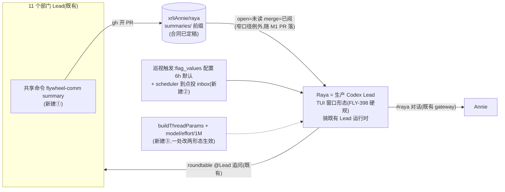

# FLY-2030 实施计划 v2 — Raya = Lead 形态:summary 回流(M1)+ 吸收/追问(M2)
Issue: FLY-2030 (https://linear.app/geoforge3d/issue/FLY-2030/rayav2-大脑状态吸收-追问总管先行权限第一批全给)
日期: 2026-08-28
基于: scope-final.md(v2)· summary-contract.md · lead-summary-rules-draft.md · raya-identity-draft.md · founder-only-authority-exemption-proposal.md(终稿)

> **v1(rev1–rev3,自建会话回路方向)被 founder 2026-08-28 打回,全文在 git 历史;本文件 = v2,按已拍形态「Lead 运行时 + 独立仓」重写。** 已拍口径与最短清单的权威在 scope-final.md §0–§3,本文不复述,只写怎么落。
> 成色:✅ 她/Lead 定的 · 【实核】本机读源码/实测 · ⬜ 工程判断。⚠️ 标 【旋钮】 处等 founder 拍(频率/粒度),变体已在 summary-contract 写死形状,拍完删一个,⛔ 实现不自选。

## 0. 目标 · 非目标 · 授权

- 目标 = Lead 定的两里程碑验收:**M1** 六项目各真产出 ≥1 条 summary PR、总管能列未读、merge 后不再出现;**M2** 对一个真实分岔说出她当场可否掉的话(+ issue 原锚:#raya 真实对话、理由可溯、三指标在跑)。
- 非目标:scope-final §4 全部(每条已标「决定,不是遗漏」)。
- 授权:merge 仍 founder-gated(等 Tadashi 转 approve_to_ship,`verify-approval` 后才 merge;绝不自 merge);**规则例外条款随 M1 PR 落,不提前**(Tadashi 裁定);⛔ 本 plan 通过 design review 前不写码。

## 1. 架构:全是既有件,新建三小块

【实核】TUI 生产形态与 headless 后端**共用同一个 `buildThreadParams`**(`codex-lead-tui-runtime.ts:522` → `codex-lead-runtime.ts:989`),且 TUI 侧「每次 resume 重钉 thread params」(FLY-224)——所以模型钉死改这一个函数,两形态同时生效,resume 也不会丢。

## 2. M1 · summary 回流

| # | 动作 | 落点 | 依据/验收 |
|---|---|---|---|
| M1-a | `summaries/README.md` 落合同逐字稿 | raya 仓(fly-2030 分支) | summary-contract.md §一;前缀 `summaries/` 就此定死 |
| M1-b | `lead-rules-base/summary-inflow.md` 落规则段逐字稿 | flywheel | lead-summary-rules-draft.md §一(含指回例外那段) |
| M1-c | `founder-only-authority.md` 落 Narrow exemption 终稿,条 1 前缀**逐字填 `summaries/`** | flywheel,与 M1-a **成对机械门**(§2.1) | exemption-proposal 终稿 |
| M1-c' | **规则装载接线(R1v2-4 + R2v2-1 + R3v2)**:`summary-inflow.md` 不会被自动发现——同时接 **两条显式 load path**:`scripts/claude-lead.sh` 的枚举 + `scripts/lead-rules-bundle.sh` `compute_lead_rule_bundle`,并更新 `lead-rules-base/README.md` 表与 `lead-rules-bundle.test.ts`。**audience = registry 数据里的显式 assignment,不是公式**(R3v2-1:任何按 role 推导的公式要么排除 Mufasa 得 10 人、要么提前替 founder 选掉 CoS-聚合变体):每个 Lead 行**必填**闭合枚举 `summaryRole ∈ {"producer","aggregator","recipient","exempt"}`——**缺失/未知/类型错 = 两个入口(`ProjectConfig` 与 raw `lead-identity` 解析)都 fail-loud 拒绝**(R3v2-2,⛔ 不用 `!== "recipient"` 这类 fail-open 负比较);一次性数据迁移随 M1 flywheel PR 给全部行赋值(Raya=recipient;CoS=aggregator;infra bot=exempt;部门 Lead=producer;**Mufasa 的值 pending Tadashi 裁定**,ask eb24a018:PRD「11 人」把 companion 算在内 vs 身份系统判 companion,权威冲突不由实现方猜,fixture 人数钉在他答后)。**粒度变体由数据激活,不由公式预选**:变体 A(一 Lead 一条)audience = producer 集;变体 B(按项目聚合)audience = **每项目恰一名作者,由 project 级字段 `summaryAggregatorLeadId` 显式指定**(R4v2-1:「无 aggregator 回落 producer」在 Growth——无 CoS、双 producer——会解出 2-3 个作者,**回落规则废除,无 CoS 项目也必须显式指定,没有任何推导回落**)。**条件化 schema(R5v2-1,选方案 a)**:该字段**仅在变体 B 为 founder 已选定的活动粒度时必填并做跨行校验**(恰一作者/该 Lead 存在于该项目/0 或多个 fail-loud);变体 A 下迁移可整体省略它,**defer(等她真选 B 再定 Growth 归属)因此与迁移/激活兼容,不为用不上的模式硬造数据**;字段一旦出现(任一模式)仍过类型/成员资格校验。Growth 的归属已并入权威问题(ask 2a520a84);两套 fixture 都预先测好(变体 B fixture 必含真实 Growth 名册,断言总数恰 6,且在 Mufasa 两种裁定下都成立),founder 拍哪个切哪个。**单一投影源(R3v2-2)**:谓词结果进 `CanonicalLeadIdentity`(含 digest)与 `identityEnvProjection`,shell 两路只消费投影出的已校验 duty 值,⛔ 不各自重算/默认;Claude 路径查询失败 fail-stop | flywheel | **测试**:两变体 assignment 集正/负 fixture(含 CoS-as-aggregator、**无 CoS 项目也必须显式指定**——真实 Growth 名册、恰 6 断言、缺/空/类型错/非本项目成员的指定四类负测(变体 B 模式下)、infra bot/external/Raya 恒排除、**Raya 任意挂载不含**);负测:非法 `summaryRole`(typo/casing/类型)、投影缺失、config 查询失败、改 duty 值 → canonical digest 变。试点证据 = 被选 Lead 的**有效 bundle/prompt 含该文件**;只 merge 文件不算已激活 |
| M1-d | 共享命令 `flywheel-comm summary` 实现,**作者协议(R1v2-5)**:`summary --file <Lead 亲笔的.md> --project … --period …`——命令只做定名/校验/git+gh 投递,模板可打印 stdout,**Judgment 必须由真实 Lead 写进传入文件**(不再有「空骨架→立即开 PR」的不可执行流);`--dry-run` = **不写 fs/git/gh**,只校验并打印 canonical plan;幂等 key = `{project, author, period}`,同 key 更新同一 open PR,**PR 已 merge 后重跑 = fail-loud 或显式 next-seq 更正**,并发创建 fail-loud | flywheel `packages/flywheel-comm` | **TDD**:校验(前缀/frontmatter/Judgment 非空/可执行拒绝含兜底口径)、幂等三态(open 更新/merged 重跑/并发)、dry-run 零副作用、gh 失败 fail-loud;gh/fs 注入 |
| M1-d' | **merge 时只读 verifier(R1v2-5,豁免的机器可核就落在这)**:复用同一 validator + `gh`,对 PR **当前 head 的完整 diff** 核:每个路径 ∈ `summaries/`、Git mode(拒 100755 的 .md)、命名/frontmatter/Judgment、无 executable/config/build-runtime-affecting 文件(非枚举兜底)、文件列表分页;输出 verified head SHA;**Raya merge 必须 `gh pr merge --match-head-commit <verified-sha>`**(防校验后 head 被推进的 TOCTOU) | flywheel 或 raya 侧小工具(implement 定,不建服务) | **TDD**:verified 后 head 推进 → merge 拒;额外路径/越权 mode/非枚举可执行 → 不合格;分页 |
| M1-e | Raya 身份【M1】段(未读队列纪律 + **merge 前跑 verifier、只用 `--match-head-commit` merge**) | raya 仓 IDENTITY 增段 + operator 0444 副本更新(Lead 执行) | raya-identity-draft.md(已同步) |
| 验收 | 六项目各一条真 summary PR(**真 Lead 发,⛔ 不许我代笔冒充**——试点 Lead 由 Tadashi 指定)→ Raya 列未读 → verifier 过 → `--match-head-commit` merge → 列表消失 | 真实仓 | Lead 定的三条;证据 = PR 链接 + verifier 输出 + merge 记录 |

### 2.1 两仓成对落地与安全顺序(R1v2-1:人工 checklist 不是 same-batch 保证)

- **交付拆成两对 PR**(同一 FLY-2030,不拆 scope):**M1 对** = raya PR(M1-a/e)+ flywheel PR(M1-b/c/c'/d/d');**M2 对**在 M1 验收完、exact-head code review 过之后另开。⛔ 不把 M2 塞进 M1 的 PR。
- **机械门(必过,merge 前跑)**:两张 M1 PR 互链并钉 exact head SHA;门从这两个 head 读三处 canonical prefix——raya `summaries/README.md`、flywheel `founder-only-authority.md` 条 1、summary validator 常量——**机器断言三处均且只均为字节串 `summaries/`**,head 与输出留 PR 证据。
- **merge 顺序**:先 merge raya 的合同/身份(此时豁免尚未存在,机制不可被误用)→ head 未变的前提下再 merge flywheel 的 command/rules/exemption PR;**第二步失败 → 不激活/不重启生产 Lead**,豁免绝不先于它保护的机制生效。
- **registry 数据先行栅栏(R4v2-2:生产 `~/.flywheel/projects.json` 现 16 行零 `summaryRole`,新必填 parser 直接上会打挂 Bridge/Lead 配置加载)**:flywheel PR 只交付 schema + 迁移命令,**生产进程继续跑旧的兼容 parser(旧 parser 容忍新字段存在)**;operator(Lead)在激活前依次:①等 Mufasa/变体 B 权威裁定;②取既有 projects-config 写锁,核对整文件期望 SHA(stale 拒绝),写同目录候选文件、**全部行过两个新入口校验**后原子 rename;③记录迁移回执:post-image SHA + 完整 16 行 assignment 证据 + **canonical summary-assignment 投影摘要**(只含 summaryRole/aggregator 指定的投影,使无关的 model/config 编辑不误伤)。**激活门 = 对「当下」registry 的校验,不是回执存在性(R5v2-2)**:激活新 parser/规则 bundle 或重启任何生产 Lead/Bridge **之前**,对 live 文件跑两个新入口校验,并把其 summary-assignment 投影摘要与回执绑定的摘要比对——**不一致或 parse 失败 = 在停掉任何旧进程之前拒绝激活**;rename 前任何失败旧字节原样保留。**测试**:stale-SHA 拒绝、迁移中断保留旧文件、缺行校验、无回执拒绝激活、**有效回执后删/坏一个 summaryRole → 拒绝**、**有效回执后改 aggregator 指向 → 拒绝**、**无关字段编辑不误伤(投影摘要不变 → 放行)**。

【旋钮】频率/粒度未拍前:M1-d 的 period 语义按变体 A(定时)与 B(收工时)都能用的形状实现(`--period` 显式传入,调度器不在 M1);拍完只改文档一句话与调度配置,不改命令。

## 3. M2 · 吸收 + 追问

| # | 动作 | 落点 | 依据/验收 |
|---|---|---|---|
| M2-a | 模型参数端到端(R1v2-2/-3):**字段链复用既有 `LeadConfig.model`/`effort` + 新增 context-window 字段**(不是三个全新字段——R1v2 实核:`ProjectConfig.ts` 已有 model/effort 且**现拒绝 Codex+effort**、fleet 侧把 Codex model/effort 当只读展示,两处语义都要更新);manifest/launcher env → `parseCodexLeadRuntimeConfig` 的传入链明列;**协议映射按 0.150.1 schema:`params.model` 顶层,effort/window 走 `params.config.{model_reasoning_effort, model_context_window}`**,三者全缺省时**整个省略 `config`** | flywheel:`codex-lead-runtime.ts:989` + `ProjectConfig.ts` 校验 + fleet 展示语义 + launcher 链 | **TDD 次序(R1v2-2 纠正)**:①先加并跑 **GREEN characterization**——对 fake ChildTransport.writes 断言 `thread/start`/`thread/resume` 完整 JSONL frame 的 **exact string 含尾部换行**(覆盖:read-only 无 persona/带 persona/workspace-write cwd/full-access cwd/resume 的 threadId 展开序);②parser 断言三字段缺省时不 materialize 新 own-property、无空 `config`;③配置存在时的 **RED** tests → 实现至 GREEN;④TUI+headless 的 start/resume 四象限;⑤非法 model/effort/window fail-loud。**真机回执**:`model===gpt-5.6-sol` 且 `reasoningEffort===xhigh`;**1M 用 `thread/tokenUsage/updated.modelContextWindow` 实证**,⛔ 不许拿「③ 暂缺」把 1M 验收放空。⚠️ 不碰 config.toml |
| M2-b | 巡视触发(R1v2-6:不是加一行 DB 就可用):cadence 走 **flag registry 全套合同**——registry spec + store-managed identity + **严格正整数/上下界 codec**(invalid write fail-loud,default 6h)+ named call-time accessor + 管理写路径;**定时复用既有 `GatePoller` rider**(gate-poller.ts:675 形态,⛔ 不建新 timer),每 pass 经 accessor 读当前值;**投递复用 `lead_events` + `RuntimeRegistry.enqueueLeadEvent` 的 durable 队列**,cadence slot 生成 deterministic event id,重启重放未结算 delivery | flywheel | **TDD**:hot DB change 下一 pass 生效(无重启)、短↔长 cadence 边界、重复 pass single-flight、journal/enqueue 间崩溃、队列 retry、invalid/overflow、Raya inbox ACK/结算。验收:改一行 DB 值下一轮生效 |
| M2-c | 指标③(R1v2-7:接缝已知,不留「先探」):**在 Raya 的 TUI runtime/proc notification demux 监听 `thread/tokenUsage/updated`**(flywheel TUI demux 已路由该通知,raya `parseContextUsage` 合同已按此 shape 实现),按既有 v1 row 合同 append 到 operator 的 `context-usage.jsonl`,只记 Raya 当前 thread;parse/append 失败留显式 unavailable 证据 | flywheel 或 raya 小接线 | 真机不发该通知时才走已批的「③ 暂缺」分支,⛔ 不拿 voice 行冒充(Tadashi 盯此条) |
| M2-d | Raya 上岗:TUI 窗口形态部署(FLY-398 硬规,Mufasa `run-codex-lead-*-tui-fullaccess.sh` 同款 launcher)+ Lead 注册条目(backend codex-app-server / full-access profile / `CODEX_HOME=~/.flywheel/raya/codex-home` / chatChannel=#raya / `RAYA_BOT_TOKEN` 进 flywheel env)+ roundtable registry `raya.json`(Tadashi 已认领) | flywheel 配置 + 部署 | 挂载位置 implement 定(先例:Mufasa@growth / infra-bots@flywheel);部署重启只走班车或 founder 紧急授权 |
| M2-e | 身份【M2】段落地(快照/沉默信号/开口纪律/追问/语音短语不抢答) | raya 仓 + operator 副本 | raya-identity-draft.md;读状态 = 她自己 shell(A2),无快照代码 |
| 验收 | 她在 #raya 真实对话;一次真实分岔的可否掉追问(理由引 summary/仓证据,可溯);三指标:①② 在跑,③ 接上或如实报缺;thread 回执 model=gpt-5.6-sol 未降级 | 真实使用 | founder 2026-08-27 首要验收 + Lead 定的 M2 验收 |

## 4. 顺序与门

M1 先于 M2(没有 summary 就没有可吸收的东西);每块 RED→GREEN→REFACTOR(GREEN characterization 先于改码,见 M2-a 次序);flywheel 侧全仓门 `pnpm lint + pnpm -r build + pnpm test:packages:run`,raya 侧 `pnpm lint/typecheck/build/test`;**PR 成对(§2.1)**:M1 对(raya + flywheel,互链钉 head,机械门必过,先 raya 后 flywheel)→ M1 六项目真实验收 + exact-head code review → 才开 M2 对;merge founder-gated;里程碑账本 `engineering/doc/milestones/FLY-2030.md` 作最后一张 flywheel PR 的最后一笔。design review gate:rev4 manifest(blob 66a53dbc)起评;每次改 plan 重铸 rev 并按最新 rev 写 JSON。

## 5. 风险(短表)

| 风险 | 处置 |
|---|---|
| allowBots 并入等重启班车 ⇒ 追问/收 summary PR 通知的过渡期 | 不催重启(founder 红线);过渡期口径在 Tadashi 挂起清单里,实现不预设 |
| 旋钮未拍 | 变体已写死形状;实现只做与旋钮无关的部分(M1-d period 显式传入) |
| ③ 接不上 | 如实报缺,不冒充 |
| TUI thread 轮换(turnless self-heal 等既有语义) | 沿用运行时既有行为,不改;身份与 params 每次 resume 重钉(FLY-224 已有) |
| 例外条款前缀漂移 | **§2.1 机械门**(三处字节断言 + exact-head 证据留 PR),不是人工 checklist(R2v2-2) |

## 6. 会过期的结论

| 结论 | as-of | 重核 |
|---|---|---|
| TUI 与 headless 共用 buildThreadParams(tui:522→runtime:989) | 2026-08-28 flywheel main | `rg -n buildThreadParams packages/teamlead/src/lead-backends/codex/` |
| 其余六条 | — | 见 scope-final.md §6(同日实核,含 flag_values / 零 tokenUsage / belle-workspace / 权限已够) |

## 7. Codex design review 处理记录(v2)

(v1 的 R1/R2 记录在 git 历史的旧 plan §16。)

**R1(v2)(2026-08-28,blob 66a53dbc,rev4 manifest b25e6c9a)= CHANGES REQUESTED,7 项,全部采纳:**

| # | 处置 |
|---|---|
| 1 两仓 same-batch 只有人工 checklist | ✅ §2.1:两对 PR、exact-head 互链、三处前缀機械断言门、先 raya 后 flywheel 的安全顺序、第二步失败不激活 |
| 2 byte-identical 断言不严且误标 RED | ✅ M2-a TDD 次序改:GREEN characterization(fake transport 的完整 JSONL frame exact string)先行→parser 不 materialize 断言→配置态才是 RED |
| 3 协议映射与既有 LeadConfig 语义 | ✅ M2-a:复用 model/effort + 新 window 字段;ProjectConfig「拒 Codex+effort」与 fleet 只读展示两处语义更新;映射 `params.model` + `params.config.{model_reasoning_effort,model_context_window}`;缺省整省 `config`;回执核 model+effort,1M 用 tokenUsage.modelContextWindow 实证 |
| 4 rules 文件不会被自动装载 | ✅ M1-c':两条显式 load path(claude-lead.sh + lead-rules-bundle.sh)+ README 表 + bundle test;试点证据 = 有效 bundle 含该文件 |
| 5 命令作者流程/dry-run/merge 门 | ✅ M1-d/d':`--file` 作者协议、dry-run 零 fs/git/gh、幂等 key 三态;merge 时只读 verifier + `gh pr merge --match-head-commit`(TOCTOU);两份草稿文档同步改 |
| 6 cadence 只证了表存在 | ✅ M2-b:flag registry 全套合同 + GatePoller rider(不建 timer)+ lead_events durable 投递 + deterministic event id + 重放;TDD 七项 |
| 7 ③ 接缝其实已知 | ✅ M2-c:直接指定 TUI demux 的 `thread/tokenUsage/updated` 监听 + 既有 parseContextUsage 合同;「暂缺」只作真机不发时的后备 |

**R2(v2)(2026-08-28,blob 5462acb0,rev5 manifest 03d3b801)= CHANGES REQUESTED,2 项,全部采纳;两处 R1 重点(same-batch 机械门 / byte-identical 规格)本轮通过:**

| # | 处置 |
|---|---|
| 1 audience 无 source-backed 判据(infra bot 也落 dept;Raya 挂载后可能自吞义务) | ✅ M1-c':registry-owned 谓词 `hasSummaryDuty`(dept ∧ department≠infra ∧ summaryRole≠recipient)+ 数据归一 + Raya 行标 recipient(不硬编 id);fixture 枚举 11 全集/排除集/Raya 任意挂载;draft 头行改「部门 Lead」 |
| 2 summary-contract 注记仍写「同一 PR」与 §2.1 冲突;§5 风险行仍写 checklist | ✅ 注记 1 改指成对 exact-head PR + 三处字节机械门 + Raya 先 flywheel 后顺序;§5 风险行改指 §2.1 机械证据;前缀/例外措辞/落地时机不动 |

**R3(v2)(2026-08-28,blob 88241a49,rev6 manifest 0a77c114)= CHANGES REQUESTED,2 项,全部采纳(paired-PR 与 authority 文本已闭环):**

| # | 处置 |
|---|---|
| 1 谓词凑不出权威的 11 人集(Mufasa=companion 被排除得 10)且提前替 founder 选掉 CoS-聚合变体 | ✅ M1-c' 改为 **registry 显式 assignment**:闭合枚举 `summaryRole`,变体 A/B 各由数据集激活、两套 fixture 预测;**Mufasa 归属 = 权威冲突,已升级 Tadashi 裁(ask eb24a018)**,fixture 人数钉在他答后,不由实现方猜 |
| 2 `summaryRole` fail-open 负比较、无闭合 schema、无单一投影源 | ✅ 全行必填闭合枚举,两个入口 fail-loud;谓词结果进 CanonicalLeadIdentity(digest)+ identityEnvProjection,shell 两路只消费投影值;负测四类 + digest 变更测试 |

**R4(v2)(2026-08-28,blob 31e085a1,rev7 manifest ff933e05)= CHANGES REQUESTED,2 项,全部采纳(R3 两项确认关闭):**

| # | 处置 |
|---|---|
| 1 变体 B 回落规则在 Growth(无 CoS、双 producer)解出 2-3 作者 | ✅ 回落废除,改 project 级必填 `summaryAggregatorLeadId` + 跨行不变量(恰一/存在于该项目/0 或多 fail-loud);Growth 归属并入权威问题(ask 2a520a84,⚠️ 首发 b5042835 被 shell 吃掉反引号已作废,以更正条为准);变体 B fixture 含真实 Growth 名册、断言总数恰 6 |
| 2 必填字段无「数据先行」栅栏,直接上会打挂生产加载 | ✅ §2.1 新增 registry 迁移栅栏:PR 只交 schema+命令,旧兼容 parser 在生产继续跑;operator 锁+SHA CAS+候选全行校验+原子 rename+迁移回执;无回执不激活不重启;四类负测 |

**R5(v2)(2026-08-28,blob 7308256c,rev8 manifest aaae5f8d)= CHANGES REQUESTED,2 项窄收口,全部采纳(R4 两项确认方向正确):**

| # | 处置 |
|---|---|
| 1 测试栏残留「回落」措辞;字段无条件必填与 defer 选项冲突 | ✅ 选方案 a:`summaryAggregatorLeadId` **仅变体 B 激活时必填+跨行校验**,变体 A 迁移可省略(defer 兼容,不为用不上的模式硬造数据;字段出现则仍过类型/成员校验);测试栏改「无 CoS 项目也必须显式指定」+ 四类指定负测 |
| 2 回执存在 ≠ 激活时新鲜度 | ✅ 回执绑定 canonical summary-assignment 投影摘要;激活门 = 激活前对 live 文件重跑两入口校验 + 投影摘要比对,不一致/parse 失败在停旧进程前拒绝;三类新负测(删角色/改指向拒绝、无关编辑放行) |
