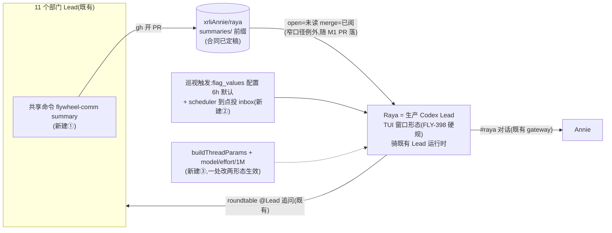

# FLY-2030 实施计划 v2 — Raya = Lead 形态:summary 回流(M1)+ 吸收/追问(M2)
Issue: FLY-2030 (https://linear.app/geoforge3d/issue/FLY-2030/rayav2-大脑状态吸收-追问总管先行权限第一批全给)
日期: 2026-08-28
基于: scope-final.md(v2)· summary-contract.md · lead-summary-rules-draft.md · raya-identity-draft.md · founder-only-authority-exemption-proposal.md(终稿)

> **v1(rev1–rev3,自建会话回路方向)被 founder 2026-08-28 打回,全文在 git 历史;本文件 = v2,按已拍形态「Lead 运行时 + 独立仓」重写。** 已拍口径与最短清单的权威在 scope-final.md §0–§3,本文不复述,只写怎么落。
> 成色:✅ 她/Lead 定的 · 【实核】本机读源码/实测 · ⬜ 工程判断。⚠️ 标 【旋钮】 处等 founder 拍(频率/粒度),变体已在 summary-contract 写死形状,拍完删一个,⛔ 实现不自选。

## 0. 目标 · 非目标 · 授权

- 目标 = Lead 定的两里程碑验收:**M1** 六项目各真产出 ≥1 条 summary PR、总管能列未读、merge 后不再出现;**M2** 对一个真实分岔说出她当场可否掉的话(+ issue 原锚:#raya 真实对话、理由可溯、三指标在跑)。
- 非目标:scope-final §4 全部(每条已标「决定,不是遗漏」)。
- 授权:merge 仍 founder-gated(等 Tadashi 转 approve_to_ship,`verify-approval` 后才 merge;绝不自 merge);**规则例外条款随 M1 PR 落,不提前**(Tadashi 裁定);⛔ 本 plan 通过 design review 前不写码。

## 1. 架构:全是既有件,新建三小块

【实核】TUI 生产形态与 headless 后端**共用同一个 `buildThreadParams`**(`codex-lead-tui-runtime.ts:522` → `codex-lead-runtime.ts:989`),且 TUI 侧「每次 resume 重钉 thread params」(FLY-224)——所以模型钉死改这一个函数,两形态同时生效,resume 也不会丢。

## 2. M1 · summary 回流

| # | 动作 | 落点 | 依据/验收 |
|---|---|---|---|
| M1-a | `summaries/README.md` 落合同逐字稿 | raya 仓(fly-2030 分支) | summary-contract.md §一;前缀 `summaries/` 就此定死 |
| M1-b | `lead-rules-base/summary-inflow.md` 落规则段逐字稿 | flywheel | lead-summary-rules-draft.md §一(含指回例外那段) |
| M1-c | `founder-only-authority.md` 落 Narrow exemption 终稿,条 1 前缀**逐字填 `summaries/`** | flywheel,**与 M1-a/b 同一逻辑批次** | exemption-proposal 终稿;review checklist 必含「两处前缀逐字对拍」 |
| M1-d | 共享命令 `flywheel-comm summary` 实现 | flywheel `packages/flywheel-comm` | 接口合同 = lead-summary-rules-draft §二(骨架/校验 fail-loud/gh 开 PR/同 period 幂等更新同一 PR/dry-run)。**TDD**:RED 先行——路径前缀校验(通过/越界)、frontmatter 齐全、Judgment 非空、可执行文件拒绝(含兜底口径:非枚举内的可执行类型也拒)、同 period 幂等、dry-run 零副作用、gh 失败 fail-loud;gh/fs 注入 |
| M1-e | Raya 身份【M1】段(未读队列纪律 + 只 merge 过两条机器可核条件的 PR) | raya 仓 IDENTITY 增段 + operator 0444 副本更新(Lead 执行) | raya-identity-draft.md |
| 验收 | 六项目各一条真 summary PR(**真 Lead 发,⛔ 不许我代笔冒充**——过渡期哪个 Lead 先试点由 Tadashi 指定)→ Raya `gh pr list` 列出未读 → 她读后 merge → 列表消失 | 真实仓 | Lead 定的三条;证据 = PR 链接 + merge 记录 |

【旋钮】频率/粒度未拍前:M1-d 的 period 语义按变体 A(定时)与 B(收工时)都能用的形状实现(`--period` 显式传入,调度器不在 M1);拍完只改文档一句话与调度配置,不改命令。

## 3. M2 · 吸收 + 追问

| # | 动作 | 落点 | 依据/验收 |
|---|---|---|---|
| M2-a | `buildThreadParams` 增可选 `model / reasoningEffort / contextWindow`(Lead 条目新三个可选字段透传;不传 = 现状逐字节不变) | flywheel `codex-lead-runtime.ts:989` + Lead 配置解析 | 【实核】现只钉 approvalPolicy/sandbox/cwd/baseInstructions;`gpt-5.6-sol` 已是 `CODEX_STANDARD`。**TDD**:不传字段 = 参数对象逐字节相同(RED 断言);传了 = thread/start\|resume 都带;回执核验 model 未被降级。⚠️ PRD §8.6.6.1:1M 只进会话参数,⛔ 不碰 config.toml |
| M2-b | 巡视触发:`flag_values` 注册 cadence 配置(默认 6h,FLY-2100 scope 列)+ scheduler 到点把「巡视」消息投 Raya inbox(既有定时形态) | flywheel | 【实核】表在 StateStore.ts:4548。验收:改一行 DB 值,下一轮生效,无重启 |
| M2-c | 指标③:Raya-Lead 轮次 token usage → raya `context-usage.jsonl` | flywheel 或 raya 小接线 | 【实核】Lead 后端零 tokenUsage 记录 ⇒ implement 先探通知面(TUI/daemon 侧哪里可截);**接不上就如实报「③ 暂缺」**,⛔ 不拿 voice 行冒充(Tadashi 盯此条) |
| M2-d | Raya 上岗:TUI 窗口形态部署(FLY-398 硬规,Mufasa `run-codex-lead-*-tui-fullaccess.sh` 同款 launcher)+ Lead 注册条目(backend codex-app-server / full-access profile / `CODEX_HOME=~/.flywheel/raya/codex-home` / chatChannel=#raya / `RAYA_BOT_TOKEN` 进 flywheel env)+ roundtable registry `raya.json`(Tadashi 已认领) | flywheel 配置 + 部署 | 挂载位置 implement 定(先例:Mufasa@growth / infra-bots@flywheel);部署重启只走班车或 founder 紧急授权 |
| M2-e | 身份【M2】段落地(快照/沉默信号/开口纪律/追问/语音短语不抢答) | raya 仓 + operator 副本 | raya-identity-draft.md;读状态 = 她自己 shell(A2),无快照代码 |
| 验收 | 她在 #raya 真实对话;一次真实分岔的可否掉追问(理由引 summary/仓证据,可溯);三指标:①② 在跑,③ 接上或如实报缺;thread 回执 model=gpt-5.6-sol 未降级 | 真实使用 | founder 2026-08-27 首要验收 + Lead 定的 M2 验收 |

## 4. 顺序与门

M1 先于 M2(没有 summary 就没有可吸收的东西);每块 RED→GREEN→REFACTOR;flywheel 侧全仓门 `pnpm lint + pnpm -r build + pnpm test:packages:run`,raya 侧 `pnpm lint/typecheck/build/test`;每里程碑一轮 Codex code review(exact head);PR:flywheel 一张(M1-b/c/d + M2-a/b/c/d 配置)+ raya 一张(M1-a/e + M2-e),各自 base main;merge founder-gated;里程碑账本 `engineering/doc/milestones/FLY-2030.md` 作 flywheel PR 最后一笔。**design review gate:本 plan 提交后重铸 manifest 再跑 Codex 评审循环(旧 rev3 manifest 钉的是已打回的 blob,作废)。**

## 5. 风险(短表)

| 风险 | 处置 |
|---|---|
| allowBots 并入等重启班车 ⇒ 追问/收 summary PR 通知的过渡期 | 不催重启(founder 红线);过渡期口径在 Tadashi 挂起清单里,实现不预设 |
| 旋钮未拍 | 变体已写死形状;实现只做与旋钮无关的部分(M1-d period 显式传入) |
| ③ 接不上 | 如实报缺,不冒充 |
| TUI thread 轮换(turnless self-heal 等既有语义) | 沿用运行时既有行为,不改;身份与 params 每次 resume 重钉(FLY-224 已有) |
| 例外条款前缀漂移 | review checklist 逐字对拍(两处同批次落) |

## 6. 会过期的结论

| 结论 | as-of | 重核 |
|---|---|---|
| TUI 与 headless 共用 buildThreadParams(tui:522→runtime:989) | 2026-08-28 flywheel main | `rg -n buildThreadParams packages/teamlead/src/lead-backends/codex/` |
| 其余六条 | — | 见 scope-final.md §6(同日实核,含 flag_values / 零 tokenUsage / belle-workspace / 权限已够) |

## 7. Codex design review 处理记录(v2)

(待重进 gate 后逐轮追加。v1 的 R1/R2 记录在 git 历史的旧 plan §16。)
