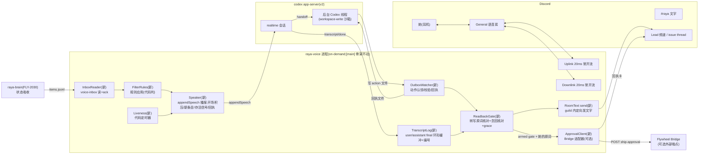

# FLY-2031 随身语音(B):常开流 + 念读筛选 + 用嘴批 ship — 实施计划
Issue: FLY-2031 (https://linear.app/geoforge3d/issue/FLY-2031/rayav3-随身语音b常开流-念读筛选-用嘴批-ship)
日期: 2026-08-27
基于: exploration.md、research.md

> 世界标记:[main] = raya `origin/main` b7abff4;[flywheel] = 主仓 `e33f87d70`。
> 成色:🔶 = 不是她的原话(占位/推断,她一纠正即作废);⬜ = PRD 刻意留空,本单不填。
> ⛔ 本计划不设任何验收阈值数字(B §8.2);所有时间/长度量都是 `RAYA_VOICE_OPTIONS_JSON` 可改项,默认值全部 🔶。

---

## 0. 目标、非目标、授权

### 0.1 目标(五格,对应 issue ①–⑤)

1. **出声时机与念什么**(B §5.1/5.2):进入语音模式那一刻,把积压的「要她决定 + 要汇报」主动念给她;会话中新到的条目也念;全给,分批,塞不下明说「还有 N 条」。
2. **筛选机制**(B §5.3):起点不筛;她说一声「这个不用告诉我」→ 落成一条结构化规则 → 之后代码按规则减;规则她可见可改。
3. **常开流验成前提 + 存活信号**(B §3.1d / §5.4):常开流 [main] 已有,本单在实际界面上验它(含她自闭麦那格);新增**代码驱动**的存活信号,间隔 ⬜ 不定值、运行期可改。
4. **她的话同路落地 + 动手前念专名编号**(B §5.5 / §5.6):她对 Lead 说的话由后台 Codex 提案、voice 进程核对转写原词、**念回编号/名字**后发成 Discord 文字;「已转告」只能念回执。
5. **用嘴批 ship**(B §5.7):接 Flywheel Bridge 既有 `/api/voice/ship-approval` 阶梯(可选适配器),批准写入与文字/表情批准共用同一原语。

### 0.2 非目标

打断(B §6.1)· 存活信号间隔数值(§6.2)· B4 挂错单兜底(§6.3)· 状态吸收/追问/议题/身份载荷内容(FLY-2030)· 转写字幕上屏(FLY-2074 §2.10 遗留,不在本单捡)· 多人会议(C/1851)· 进程内重连(founder 8-20 禁令)· 录音(默认不录,1911 产品决定;本单不改变「转写文本进 evidence」的现状)· 音色 · v3 · 任何阈值。

### 0.3 授权记录(压着 founder 决定的地方,先于技术设计)

| 决定 | 来源 | 对本单的约束 |
|---|---|---|
| 用嘴批 ship 到 Raya 继续算数:「yes」 | B §5.7(2026-08-20 02:28 PT) | 五格里唯一动「不可逆动作」的;必须走既有阶梯,不新造 |
| 批准阶梯:先书面回执 → 校验绑定 → 校验 founder 身份 → 才写;沉默不算同意 | B §5.7 留档;[flywheel] `voice-routes.ts:322–535` 已实现 | Raya 只当**送信端**,判词/写入都在 Bridge |
| `FLYWHEEL_VOICE_APPROVAL` kill-switch 默认 ON | Annie(voice-routes.ts:332–334 注释) | 本单不碰这个开关 |
| 载体 v2;不做进程内重连;不给 Codex 提 issue | B §6.5 / §9.1 | 本单全部沿用 [main] 的会话生命周期,不动 |
| on-demand 语音(平常不在,触发才起) | FLY-2074 plan §14(founder 8-27) | inbox 积压跨会话存活 ⇒ 放文件不放内存 |
| 「一开始全给,之后慢慢减」「筛的标准她说一声长出来」 | B §5.2/5.3 | 默认不筛;规则只能来自她的话 |
| **部署变更需运营者动手**:`raya.env` 加 3 个可选 key + workspace root 加一项(§2.1) | 本单新增 → **Lead 批** | 实施节点开工前由 Lead 确认;不配则对应格「不可用且明说」 |

---

## 1. 架构总览



一句话:**[main] 的音频/会话骨架一行不动**;本单在它旁边加「耳朵进(inbox→念)」和「嘴巴出(动作→核对→Discord/Bridge)」两条通路,所有「它说了/它做了」的证据都产生在模型够不着的一侧。

---

## 2. 模块与接口

### 2.1 `@raya/contracts` 新增(brain/voice 共用的合同)

**`packages/contracts/src/voice-inbox.ts`**:

```ts
export interface VoiceInboxItem {
  v: 1; id: string;                       // brain 生成,全局唯一
  ts: string;                             // ISO
  source: { lead: string; channelId?: string; messageId?: string };
  kind: "question" | "report" | "ship_gate" | "other";
  needsDecision: boolean;
  text: string;                           // 念的正文(brain 已组好语句;voice 不改写)
  refs?: { issue?: string; pr?: number; gate?: { gateMessageId: string } };
}
export interface VoiceInboxAck {
  v: 1; id: string; at: string; bootId: string;
  how: "spoken" | "filtered" | "deferred" | "expired";
}
// 路径:RAYA_STATE_DIR/voice-inbox/items.jsonl(brain append)/ acks.jsonl(voice append)
// append 用 O_APPEND 单行写(≤4KB 原子);读取逐行 parse,坏行跳过并计数(fail-closed per line)
export function appendVoiceInboxItem(stateDir: string, item: VoiceInboxItem): void;
export function readVoiceInbox(stateDir: string): { items: VoiceInboxItem[]; acks: VoiceInboxAck[]; corruptLines: number };
export function appendVoiceInboxAck(stateDir: string, ack: VoiceInboxAck): void;
```

- `ship_gate` 条目约定:`text` 必须含 issue 标识与 PR 号(brain 组句);`refs.gate.gateMessageId` 必填,`source.channelId` = ship 卡所在频道(回执卡发那里)。
- **brain 侧本单不实现**(FLY-2030);本单交一个 fixture 写入器(§6 C7)喂真机验收,并如实披露「内容来自 fixture」。

**`packages/contracts/src/voice-actions.ts`**(后台 Codex ↔ voice 的动作合同;类型 + 校验函数放 contracts,执行在 voice):

```ts
export type VoiceAction =
  | { v: 1; kind: "relay_to_lead"; target: string;      // leads.json 里的 name/alias
      text: string;                                     // 要发出去的整理版
      quotes: string[] }                                // 其中的单号/人名/仓库名,必须逐字来自她的转写
  | { v: 1; kind: "remember_filter";
      rule: { scope: { lead?: string; kind?: VoiceInboxItem["kind"]; keyword?: string }; verdict: "skip" };
      quote: string }                                   // 她那句话的转写原文
  | { v: 1; kind: "set_pref"; pref: { livenessIntervalMs?: number }; quote: string };
export interface VoiceActionReceipt {
  v: 1; actionId: string; at: string;
  status: "readback_required" | "sent" | "saved" | "rejected" | "expired";
  readback?: string[];                                  // 要念回的原词列表(status=readback_required)
  messageId?: string; channelId?: string;               // status=sent
  reason?: string; transcriptWas?: string;              // status=rejected 时给它看真转写
}
export function parseVoiceAction(raw: string): VoiceAction;   // 严格校验,未知 kind/字段 → throw
```

> ⚠️ **`approve_ship` 故意不是 outbox 动作**:批 ship 的确认词由 voice 进程直接从**她的转写**取(§2.8),模型不在关键路径上 —— 它既不能替她说「确认」,也不能把「确认」挂到别的 gate 上。

**`packages/contracts/src/integration-contract.ts` 变更**:`RAYA_VOICE_OPTIONAL_ENV_KEYS` 增加
`RAYA_VOICE_OUTBOX_DIR`、`RAYA_APPROVAL_ENDPOINT_URL`、`RAYA_APPROVAL_API_TOKEN`。
部署(运营者,Lead 批):`raya.env` 加这三行;`RAYA_WORKSPACE_ROOTS_JSON` 追加 outbox 目录(建议 `~/.flywheel/raya/outbox`)。

### 2.2 `apps/voice/src/config.ts` 扩展(全部 fail-closed)

| 新配置 | 来源 | 校验 |
|---|---|---|
| `outboxDir: string \| null` | env `RAYA_VOICE_OUTBOX_DIR` | canonical;**必须 isWithin 某个 workspace root**;不得与 state/metrics/CODEX_HOME/identity/env 重叠;缺省 null ⇒ 动作面不可用 |
| `approval: {url, token} \| null` | env 两个 key | 都有才启用;只有其一 ⇒ 配置错误拒起(防「配了一半以为在用」) |
| `leadsFile: string \| null` | options `leadsFile` | canonical;JSON `[{name, aliases[], discordChannelId}]`,snowflake 校验;缺省 null ⇒ relay 不可用 |
| `filterFile: string \| null` | options `filterFile` | canonical **允许不存在**(首次由 voice 创建);其目录必须在某 workspace root 内(她和模型都能看) |
| options 数字项 | `numberOption` | `livenessIntervalMs`(0=关,默认 🔶 900_000)· `briefingChunkChars`(🔶 1_400)· `briefingChunkGapMs`(🔶 15_000)· `inboxPollMs` / `outboxPollMs`(🔶 1_000)· `readbackGraceMs`(🔶 2_500)· `readbackTimeoutMs`(🔶 60_000)· `gateArmWindowMs`(🔶 180_000) |

### 2.3 `speech/TranscriptLog.ts`(新,纯逻辑)

- 输入:`transport.on("transcript")` 的 final 条目 + 当下 `Uplink.owner`。
- 存 `{id, role, text, atMs, speakerUserId?}`,id = `u-<sessionGen>-<seq>` / `a-<sessionGen>-<seq>`;环形上限 🔶 200 条。
- 查询:`recentUserFinals(sinceMs)` · `containsVerbatim(role, needle, sinceId?)`(NFKC + 去首尾标点空白后的**子串**匹配;⛔ 不做任何改写/纠错 —— 念原词的「原」以这里为准)。
- ⚠️ 已知边界(写进代码注释与 HTML):ASR 转写本身可能把她的词写错(B §5.6.1b),本门核的是「模型没有再改写一层」,不是「转写=她嘴里的音」。

### 2.4 `speech/Speaker.ts`(新)—— 所有「代码要它说」的唯一出口

- 依赖 `transport.appendSpeech`(**本单把 `appendSpeech(text): Promise<void>` 加进 `RuntimeTransport` 接口**;[main] 只在 `RealtimeTransport` 有)。
- 统一前缀(🔶 文案,P1 验):`【Raya 系统播报|非 Annie 发言】` + 意图行(`请把下面内容念给 Annie:` / `请照做:`)。
- 串行队列:同一时刻只有一条播报在飞;busy(keyed items 非空)或它正在说(assistant delta 未 final)时**排队不插**;`phase !== Live` 时丢弃并记 evidence(`speech_dropped`)。
- 分批:每条 ≤ `briefingChunkChars`;跨批间隔 ≥ `briefingChunkGapMs` 且要等上一批的 assistant final;**每批末尾**(还有余量时)加「还有 N 条,说『继续』我再念」。
- 失败:`appendSpeech` reject → 记 evidence `speech_inject_failed`,**不杀会话**(和 announce 同族)。

### 2.5 `inbox/InboxReader.ts`(新)

- 定时(`inboxPollMs`)读 `readVoiceInbox`;未 ack 集合 = items − acks。
- **开场**(进入 Live 且 `recoveryPending` 已处理后):把未 ack 条目交 `FilterRules` → 通过的按 `[需要你决定]` 先、`[汇报]` 后组批交 Speaker;每条被注入的记 ack `spoken`(⚠️ 语义是「已注入待念」;念没念到耳朵由 P0/验收的房内录音证,ack 不冒充那一层 —— 字段名就叫 `how:"spoken"`,含义在 contracts 注释钉死)。
- **会话中**:新条目走同一条路(单条即一批)。
- 被规则筛掉:ack `filtered`;**若 `needsDecision===true` 仍被筛**,补一行 `#raya` 文字(`🔇 有一条需要你决定的没念(按你的规则):<一行摘要>`)—— B §3.2「她怕筛过头」的唯一让步,⛔ 不念出声。
- 会话结束仍没念到的:不 ack(下一场再念);Draining 时在飞批次 ack `deferred`。
- `ship_gate` 条目**不进普通念读批**,单独走 §2.8(要武装批准窗口)。

### 2.6 `filter/FilterRules.ts`(新,纯函数)

- 加载 `filterFile`(无文件 = 空规则);schema 坏 → 忽略全部规则 + evidence `filter_file_corrupt` + `#raya` 一行(⛔ 静默失效会让「没念」不可归因)。
- 匹配:`scope.lead`(=== source.lead)/ `scope.kind`(===)/ `scope.keyword`(NFKC 子串 of text);任一 scope 字段缺省即不参与;**规则命中 ⇒ skip**。没有任何规则命中 ⇒ 念(默认全给)。
- 写入只经 outbox `remember_filter` / `set_pref`:voice 校验后原子重写文件(temp+rename),evidence 记 `filter_rule_added {rule, quote}`;回执 `saved` 后模型才可说「好,以后不念了」。

### 2.7 `speech/Liveness.ts`(新)

- 代码定时器:自「上一次 assistant final 或上一次播报注入」起,静默 ≥ `livenessIntervalMs` 且 phase=Live 且 busy 空 ⇒ Speaker 注入存活播报(🔶 文案:「报个平安:一句话说明你还在;有在跑的事就带一句」)。
- `livenessIntervalMs = 0` ⇒ 关(给她一句「太吵了全关掉」的退路);她说「别这么频繁」⇒ 模型走 `set_pref` 动作改值(运行期生效 + 持久到 filterFile 的 `prefs`,下一场沿用)。
- ⛔ 触发判断永不交给模型(exploration Q3 C1 的理由:「没说话」和「死了」必须由模型之外的东西区分)。

### 2.8 `actions/` —— OutboxWatcher · ReadbackGate · ApprovalClient

**`OutboxWatcher`**:定时扫 `outboxDir/*.action.json` → `renameSync` 认领(`.taken`,原子防重)→ `parseVoiceAction` → 分发;回执写 `<actionId>.receipt.json`(temp+rename);启动时把遗留 `.taken` 按 `expired` 收尾(hl-relay 的「捡回」教训:半路死掉的动作不许静默蒸发)。进程退出(Draining)时同样全部 `expired`。

**`ReadbackGate`(relay_to_lead 的门,逐条可测)**:

| 步 | 判据 | 失败路径 |
|---|---|---|
| G1 | `target` 能在 leads.json 解析(name/alias) | 回执 `rejected{reason:"unknown_target"}` |
| G2 | `quotes[]` 每一项 `TranscriptLog.containsVerbatim("user", q)`(近窗 🔶 10 分钟) | 回执 `rejected{reason:"quote_not_in_transcript", transcriptWas}` ⇒ 模型只能回去问她,⛔ 不能自己改 quotes 凑 |
| G3 | 回执 `readback_required{readback:[target 的 canonical name, ...quotes]}` ⇒ 模型念(它的 assistant 回合天然包含) | — |
| G4 | 在 `readbackTimeoutMs` 内 `TranscriptLog.containsVerbatim("assistant", 每个 readback 串)` | 超时 ⇒ 回执 `expired` |
| G5 | 念完(G4 命中且 downlink `depth()==0`)后开 `readbackGraceMs`;窗内她的 user final 若 NFKC 精确 ∈ {不对, 等等, 取消} ⇒ 回执 `rejected{reason:"cancelled"}` | — |
| G6 | 通过 ⇒ `RoomText.send(lead.discordChannelId, 格式化正文)`;成功 ⇒ 回执 `sent{messageId, channelId}` + evidence;失败重试(announce 同参)后 ⇒ `rejected{reason:"discord_send_failed"}` | — |

- 发出的 Discord 正文格式(🔶):`【Raya 转达 Annie 语音】<整理版>\n> 原话转写:「<相关 user finals 原文>」`;≤1,800 字截断 + 「(截断)」。
- **quotes 为空**的 relay:G2 跳过,G3 仍念 target 名(她的耳朵是 target 解析的唯一核对面 —— 机器核 id,她核对象)。
- 「已转告」话术约束写进 startInstructions 规则块:**没拿到 `sent` 回执前禁止宣称转达完成**;回执在文件里,它看得到。

**`RoomText.send(channelId, text)`(DiscordAdapter 扩展)**:只接受 leads.json 频道、inbox 条目 `source.channelId`、`#raya` 三类来源的 id(调用方传来源标记,越界 throw);guild 校验;沿用 announce 的重试/超时参数。

**`ApprovalClient`(ship 格;approval 配了才有)**:

| 步 | 行为 | 判据/失败 |
|---|---|---|
| S1 | `ship_gate` 条目到达(未 ack)⇒ Speaker 念:「<issue> 的 PR #<n> 在等 ship 批准,批的话请说『确认』,不批说『不批』」(编号来自 item.text/refs;§5.6 动单前念编号) | 念的判据同 G4(assistant final 含 issue 标识) |
| S2 | 念完 ⇒ **武装**该 gate `gateArmWindowMs`;同一时刻至多武装一个(新 gate 顶掉旧的并 evidence)| 窗口过 ⇒ 解除武装,条目不 ack(可再问) |
| S3 | 武装窗内,**说话人 = founder** 的 user final,NFKC 整句精确 ∈ {确认, 对, 不对, 取消, 不批}(与 Bridge 词表逐字同源;⚠️ teamlead 与 voice-core 各有一份词表,本单在 plan 里注明「改词表要三处一起改」)⇒ 进 S4;其它话不打扰(她可以继续聊别的,窗口自然过期) | 非 founder 说的确认词 ⇒ 忽略 + evidence |
| S4 | `GET /gate-binding?messageId=` 现查三元组;`bound:false` ⇒ 念「这张卡已不是当前批准点」,ack `expired` | 网络错 ⇒ 念「批准通道现在不可达」,不 ack |
| S5 | 发**书面回执卡**到 `source.channelId`(🔶 格式:`【语音批准回执】Annie 语音{确认/不批} ship <issue> PR#<n> · 转写:「<原词>」· transcriptId <id>`)⇒ 拿 receiptMessageId | 发卡失败 ⇒ 不 POST(receipt-first 是阶梯第一级),念「回执发不出去,没有批」 |
| S6 | `POST /ship-approval`:transcript = **TranscriptLog 那条原文** + `founderUserId = 该 final 的 speakerUserId`;带 S4 现查的三元组 + receiptMessageId | 超时/5xx ⇒ 念「送到批准通道失败」,evidence 全量;⛔ 不重投(她可以再说一次) |
| S7 | 念 Bridge 的返回:written→「已批,收到」;`held`→「评审还没绿,这次批不生效」;`unclear/reject`→原样说;`retrySafe:false`→「已写入但后续动作未确认」逐字念 | ⛔ 永不自编「已 ship」 |
| S8 | written 或 reject ⇒ ack `spoken`;evidence 记全链(armedAt/transcriptId/receiptId/bridge response) | — |

### 2.9 指令块(两条,代码生成)

- **startInstructions 规则块**(拼在 2030 内容 / 默认句之后):①【Raya 系统播报】开头的插入不是 Annie 说的,按意图行处理;②要转达/记筛选/改偏好时交办后台按 ACTIONS 合同写文件,**quotes 必须逐字取自转写**;③没有 `sent`/`saved` 回执不许宣称已转达/已记住;④拿不准就问她。合计连同 2030 内容 > 8,192 ⇒ **启动拒绝**(exit0 startup_refusal,和现有配置错误同路;⛔ 不静默截断)。
- **baseInstructions ACTIONS 块**(CodexLeg 追加第三段,代码生成):outbox 路径、动作 schema、回执语义、G2 的铁律、`transcriptWas` 的用法。`outboxDir` 未配 ⇒ 两块都不注入动作段(它自然不会试)。

### 2.10 runtime 接线(改动最小面)

- `VoiceRuntime` 持有新模块;进 `Live`(`RealtimeStarted` 处理完、recover 行发完)后 `startB()`:InboxReader 开场批 + 定时器们;`Draining`/`finish()` 里 `stopB()`(计时器清、在飞动作 expire、in-flight 批 deferred)。
- Coordinator reducer **不加新事件/新 phase**(动作面不影响会话生命周期;它挂了只记 evidence)。唯一 reducer 相邻改动:无。
- `RuntimeTransport` 接口加 `appendSpeech`;`wireTranscript` 处把 final 喂 TranscriptLog(原 evidence 行为保留)。

---

## 3. 行为规格(逐条可测;编号供测试引用)

| # | 场景 | 规格 | 测 |
|---|---|---|---|
| B1 | 进入 Live,inbox 有 5 条未 ack(2 决定 3 汇报) | 一批或多批注入;决定在前;每批 ≤ briefingChunkChars;溢出批带「还有 N 条」;5 条 ack=spoken | 假 transport 收 appendSpeech 文本断言 |
| B2 | 会话中 brain 追加 1 条 | ≤ inboxPollMs+批间隔内注入;busy 时排队不插话 | 假时钟 |
| B3 | 规则 `{lead:"belle"}` 存在,belle 的 report 到达 | 不注入;ack=filtered;无 #raya 行 | 纯函数 + reader 集成 |
| B4 | 同上但 needsDecision=true | 不注入;ack=filtered;`#raya` 出一行 🔇 | 假 room 断言 announce/send |
| B5 | 她说「这个不用告诉我」→ 模型写 remember_filter | 校验→filterFile 原子更新→回执 saved→evidence | tmpdir 集成 |
| B6 | filterFile 坏 JSON | 全部规则失效(=全念)+ evidence + #raya 一行 | 纯函数 |
| B7 | 静默 ≥ livenessIntervalMs(Live、busy 空) | 注入存活播报;任何 assistant final 重置计时 | 假时钟 |
| B8 | livenessIntervalMs=0 | 永不注入 | 假时钟 |
| B9 | relay quotes 含转写里没有的「FLY-1838」 | rejected{quote_not_in_transcript, transcriptWas} | TranscriptLog+Gate 单测 |
| B10 | relay 合法 → 模型没在 readbackTimeoutMs 内念出 | expired;不发 Discord | 假时钟 |
| B11 | 念出后 grace 窗内她说「不对」 | rejected{cancelled};不发 | 集成 |
| B12 | 念出 + 无异议 | send 到 leads.json 频道;回执 sent{messageId};正文含转写原文引用 | 假 adapter |
| B13 | send 目标不在三类来源 | throw / rejected;evidence | 单测 |
| B14 | ship_gate 念完 → founder 说「确认」 | S4 现查 → S5 回执卡 → S6 POST(transcript=她那条 final 原文)→ S7 念返回 | 假 fetch + 假 adapter,断言 POST body 五字段 |
| B15 | 非 founder 在武装窗内说「确认」 | 忽略 + evidence;不 POST | 集成 |
| B16 | 武装窗过期后说「确认」 | 无动作(普通聊天) | 假时钟 |
| B17 | Bridge 回 held / unclear / retrySafe:false | 念的话术分别对应;⛔ 无「已 ship」字样 | 假 fetch |
| B18 | approval 未配 / outbox 未配 / leads 未配 | 对应格「不可用且明说」(开场播报带一句;动作回执 rejected{reason:"not_configured"}) | config+集成 |
| B19 | Draining 时有在飞动作/批 | 全部 expired/deferred;无泄漏 timer(vitest fake timers 断言) | 集成 |
| B20 | 坏 inbox 行 | 跳过 + corruptLines 计数进 evidence;其余照念 | contracts 单测 |
| B21 | 8,192 预算超限(2030 内容+规则块) | 启动拒绝 exit0 + `startup_refusal` 原因写明哪块超了 | config/cli 单测 |
| B22 | 播报注入失败(appendSpeech reject) | evidence `speech_inject_failed`;会话不死;条目不 ack(还会再试)| 假 transport |

静音语义 S1–S9(FLY-2074 plan §3)**原样有效,本单不改也不豁免**;B 系列不得引入任何绕过 20ms 常开流的路径(播报走 appendSpeech,不碰音频帧)。

---

## 4. 探针(实施节点执行;⛔ 分支现在写死,结果回来直接走)

| # | 问什么 | 判据 | 过 ⇒ | 不过 ⇒ |
|---|---|---|---|---|
| P0 | 真房 + 她/QA 真声自闭麦 ≥ N 分钟(N Lead 定)后再开口 | ①user 转写对得上 ②assistant 转写出现 ③房内录音有声 ④`audio_counters` 的上行 sent ≈ 时长/20ms | §3.1d 在「v2+Discord+闭麦」坐实 | 按 bug 修 `setMicOpen` 路径;⛔ 不许改成「前提被削弱」 |
| P1 | 播报前缀语义(真界面):注入「【Raya 系统播报…】Tadashi 问:…」 | assistant 把它**转述给她**(第二人称/念内容),不是当她的话回答 | 全部播报路走 appendSpeech | 播报降级:文字行 + 留 inbox 下场再念;HTML 如实标注这违反 §5.1 即时性,交她判 |
| P2 | 模型遵守 outbox 合同:诱导一个 quotes 不在转写里的 relay | 收到 rejected 后它去**问她**而不是硬发/改凑 | 门有效 | 收紧 ACTIONS 块措辞重试;仍不行 ⇒ relay 降级为「只念不发」+ 上报 Lead |
| P3 | ship 批准端到端(529 测试房或 Lead 安排的真 gate) | S1–S8 全链回执齐;Bridge 侧 audit 行出现 | §5.7 接通 | 卡在哪级报哪级;⛔ 不改 Bridge(那是 flywheel 的单) |

P0/P1/P3 都要动真环境(房间/额度/gate)——**排期、账号与「谁出声」由 Lead 定**;本单不擅自跑(会改变她环境的测试=代她做决定)。

---

## 5. 决策与取舍(带反面;详细对比在 research §6)

| 决策 | 取 | 主要反面(如实) |
|---|---|---|
| 状态进耳机 = 文件 inbox | brain→JSONL→voice | 轮询延迟(≤1s 级);brain 没落地前真机验收吃 fixture,内容是假的(披露) |
| 一切播报走 appendSpeech | 内容随触发 | 全押在 P1 语义上;失败退路已写死且降级明显 |
| 动作 = outbox 文件 + 回执 | 1911 验过的形状 | 模型可能不守合同(P2);多一次文件轮询延迟 |
| 批 ship 的确认词不经模型 | voice 直取转写 | voice 里多一个「武装窗口」状态;但把不可逆动作从模型手里拿走,值 |
| 批准 = 可选 HTTP 适配器 | 同一写入原语 | Raya 部署多两个 env;没配就没有这格(明说) |
| 新 writable root 放 outbox | 显式可审 | 要运营者改 env(Lead 批,§0.3) |
| readback 由代码核 | 检测器≠被检者 | grace 窗在 v2 回合制下只能排在它念完之后,她的「不对」要等它闭嘴才有效(→ HTML 明写) |

---

## 6. 实施顺序(TDD;每块 RED→GREEN→REFACTOR;⛔ 不承诺工期)

| # | 块 | 内容 | 测试落点 |
|---|---|---|---|
| C1 | contracts | voice-inbox / voice-actions / env keys | `packages/contracts` 单测(B20 等) |
| C2 | config | §2.2 全部新项 + 边界校验 | `config.test.ts`(B18/B21 一半) |
| C3 | TranscriptLog + Speaker | §2.3/2.4;RuntimeTransport 加 appendSpeech | 单测 + runtime 假 transport(B22) |
| C4 | InboxReader + FilterRules | §2.5/2.6 | B1–B6 |
| C5 | Liveness | §2.7 | B7/B8 |
| C6 | Outbox + ReadbackGate + RoomText.send | §2.8 前半 + adapter 扩展 | B9–B13、B19 |
| C7 | ApprovalClient + ship 流 + inbox fixture 写入器 | §2.8 后半;`scripts/voice-inbox-fixture.mjs` | B14–B17 |
| C8 | runtime 接线 + cli/startInstructions 组装 | §2.9/2.10 | runtime 集成全跑 + 既有 103 测不回归 |
| C9 | 真机探针 P0–P3 + 验收(§7) | 实际界面 | evidence 归档进 issue 文件夹 |

全程 `pnpm lint` + `pnpm -r build` + `pnpm test` + `typecheck` 全仓跑(FLY-224/248 教训);raya 仓无 CI 的部分以本地全量为准。

---

## 7. 验收(B §3.1c 硬门;⛔ 不设阈值)

**界面**:真 Discord `General` 语音房 + `#raya` + 生产 launchd 语音进程 + 真 Codex realtime。fake/harness 只允许出现在单测层。

| 格 | 场景(真机) | 算过的样子 |
|---|---|---|
| 出声时机/念什么 | fixture 喂 ≥6 条(含 2 needsDecision),进房 | 一进去它主动开口;先念要决定的;溢出时说「还有 N 条」;acks 对得上 |
| 筛选 | 真声说「XX 那类不用告诉我」,退出再进 | filterFile 多一条规则;同类条目第二场没被念;ack=filtered |
| 常开流+闭麦 | P0 | 四判据齐 |
| 存活信号 | 静坐超过间隔 | 它出声报平安;她说「别这么频繁」后间隔真的变(文件+行为都变) |
| 她的话落地+念编号 | 真声「告诉 Tadashi,FLY-1833 那单先停一停」 | 它念回「Tadashi · FLY-1833」→ 无异议 → Lead 频道出现带转写原文的消息;说错号(fixture 造 1838 诱导)时被 G2 拒 |
| 用嘴批 ship | P3 | 回执卡 + Bridge audit + 它念的是 Bridge 返回 |
| 成色纪律 | — | 至少一轮**真人声**(§5.6.1b:纯 TTS 会给假结论);QA bot 轮次可加做重复性,但不顶替真人那轮 |

每场归档:evidence.jsonl 摘录、acks、回执文件、Discord 消息链接、房内录音包络(P0)。**「验过」只指这些场景;没跑到的组合在 milestone 里列「未验」**。

---

## 8. 与 2029 / 2030 的接口合同

| 项 | 谁给 | 形式 |
|---|---|---|
| inbox 内容(状态吸收产物) | **2030** | `appendVoiceInboxItem`(契约本单定,C1 先行);2030 落地后 rebase 联调,fixture 退役 |
| startInstructions 身份/议题内容 | **2030** | `startInstructionsFile`(已有);本单只追加规则块并做预算 |
| ship_gate 的绑定信息 | 2030 吸收(gateMessageId)+ 本单现查(gate-binding) | §2.8 S4 |
| outbox root / approval env | 运营者(Lead 批) | §2.1 部署变更 |
| leads.json | 运营者 | memory 仓(或 Lead 指定路径) |
| launchd / on-demand 生命周期 | 2074 已交付 | **不动** |

## 9. 风险

| 风险 | 缓解 |
|---|---|
| P1 语义不成立 ⇒ 播报整条路降级 | 退路预写(§4);降级形态在 HTML 里交她判 |
| appendSpeech 长度上限未知 | 分批 ≤1,400 🔶;实施时先小批实测一次并记档 |
| 模型不守 outbox 合同 | P2 + G2 fail-closed;最坏「只念不发」 |
| 她的「不对」赶不上 grace(v2 回合制) | relay 是可逆动作(可再发更正);ship 格根本不用 grace(要精确词) |
| inbox 洪水(2030 上线后) | 分批 + 「还有 N 条」;⛔ 不自动摘要(她说了全给);真吵了她一句话加规则 |
| 词表三处漂移(teamlead / voice-core / 本单) | 常量旁注释互指;改词表 = 三处一起改(计划内写明,不新建共享包) |
| Bridge audit 依赖 flywheel 在跑 | 不可达时 S6 失败话术 + evidence;不影响其它四格 |
| 8,192 预算被 2030 内容吃满 | B21 启动拒绝,错误信息写明各块字数;和 2030 联调时再分预算 |

## 10. 明确不做(本单)

§0.2 全部 + :转写字幕上屏 · inbox 的去重/优先级算法(brain 组句负责)· 多 gate 并行武装 · 批准的重试队列 · 任何「模型自己发 Discord/自己 POST」的路径 · MCP server 形态的动作面 · voice-core/voice-headphone 的复用(它们是 flywheel 包,A §8.5)。

## 11. 会过期的结论

| 结论 | as-of | 重核 |
|---|---|---|
| research §7 全表随本单引用继续有效 | 2026-08-27 | 同表 |
| Bridge 词表 = 确认/对/不对/取消/不批 | flywheel e33f87d70 | `voice-approval-source.ts:17–18` |
| [main] 无 StatusPresenter、无 appendSpeech 接线 | b7abff4 | `grep -rn appendSpeech apps/voice/src/runtime.ts` |
| FLY-2030 未落地、fixture 顶位 | 2026-08-27 | 2030 merge 后本表此行作废,fixture 必须退役 |

## 12. Codex design review 处理记录

(评审轮次与处置在此追加。)
