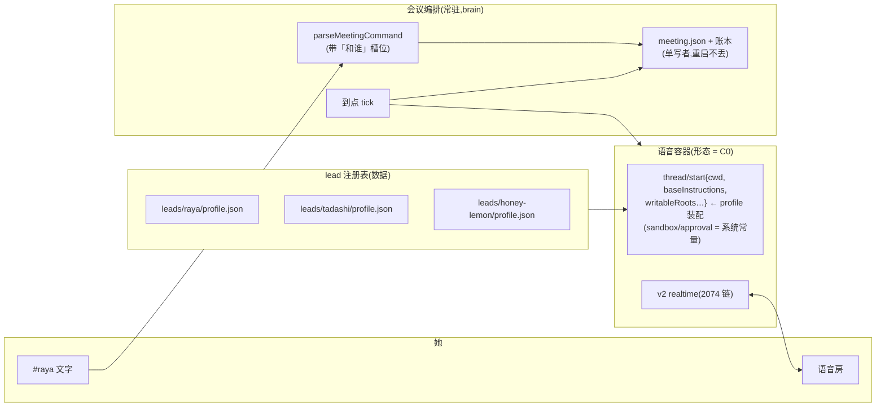

# FLY-2032 会议模式(C):骨架 + 会里交互 — 实施计划(重做 v2)
Issue: FLY-2032 (https://linear.app/geoforge3d/issue/FLY-2032/rayav4-会议模式c骨架-会里交互codex-原生先行)
日期: 2026-08-28
基于: research.md(重做 v2)

**Status**: approved（design review 已通过；2026-08-28 founder C0/C1 与双通知决策已并入实现合同）
**重做依据**: founder kickback 2026-08-28(exploration §0 逐字)——上一版把「一场会只有一个 AI」(约束)和「那个 AI 是 Raya」(身份)焊死;本版 actor model 重定为 **leadId 参数化**。
**实现落点**: raya 仓(kickback #5 保留「独立 raya 仓」),分支 `fly-2032-raya-meeting` @ `ba9165f`(**4 个 parked commits**:3 个实现提交 + 1 个 Lead rescue commit〔封存原未提交的 1046 行在飞产物〕,工作区干净;实现节点按本计划决定捡用/重写);PR 目标 raya `main`。本 flywheel 仓只放设计文档、founder HTML、里程碑。
**本节点交付**: exploration / research / plan / founder HTML(含 C0 对照表)+ 形态 S / 探照灯 / 双通知实现与验收。
**自包含声明**: 本文是唯一运行规范;⛔ 不引用旧版 plan(head `f33e2628d`)作为合同 —— 旧版仅在 §9 取舍登记里被点名。

---

## 0. 目标、非目标、授权

### 0.1 目标(验收方向;数值不填 —— PRD §8.2)

| # | 她要的 | 本单交出的能力 | 出处 |
|---|---|---|---|
| G1 | 一句话把会约好,**约的时候说清和谁** | `安排会议 12:30 和 Tadashi 聊 X` ⇒ 回执含 lead、时间、议题、时长(默认 30)，并在共享面写一张固定 schema 排会卡、真 `@` Tadashi、开 thread；同一消息同时完成共享公告与 Tadashi 会话通知 | kickback;R-4/R-2b;founder 双通知硬要求;Lead 安全裁定 |
| G2 | 到点她进房时**那个 lead** 已经在;链接点一下就进 | 到点起语音容器(或附着,视 C0)→「(lead 名)正在进房」→ 进房后发「我已进房+链接」 | R-5/R-10/R-57 |
| G3 | 她忘了才提醒她一嘴,**提醒人 = 要跟她开会的那个 lead** | 至多一次,带链接,状态行以该 lead 落名 | R-6/R-7/R-8 |
| G4 | 会里像开会:那个 lead 带节奏 / 动东西前念名字 / 要想先说一声(R-14 她原话「要说一句『我想一下』」)/ 结束前口头总结 | 逐字通道喂身份+议题+规矩(⚠️ R-14 是**喂的话**,不是机制,见 §1.4 边界);R-13 核对器(探照灯,档位 = founder 决定 C1,见 §0.4) | R-11/13/14/17 |
| G5 | 她说结束并退出,对面跟着退,不留在房里等 | she-left grace / `结束会议` / 2097 语音退出 ⇒ ended、容器 exit0(或会话收束,视 C0) | R-15/R-39 |
| G6 | 没聊完能约下一次并接上 | `继续上一场` ⇒ `continuesFrom`;不可变存档给 2033 | R-16 |
| G7 | **换一个 lead,一切照常** —— 身份是数据不是代码 | 同一套代码零 diff,换 leadId 再开一场,全程走通 | kickback #4 |

### 0.2 非目标(各归其单)

语音链路本身(2074)· 简报内容 / Lead memory 装载策略 / 追问(2030)· slash 与语音说一句即退(2097)· 每场一 issue / notes / HTML / action items(2033)· 念读筛选 / 用嘴批 ship(2031)· 多人多 lead 同房(v1 deferred,她定)· 打断(v2 不存在,她知情选择)· 每 lead 一个 Discord bot 账号(§4 Q6 诚实边界,她要再立)· roundtable 手发排会消息的识别 / 解析 / 接管 · 任何阈值数字 · production plist / 生产目录 / 生产 env 的永久改动。

### 0.3 落点事实

raya `origin/main@b7abff4`;codex 钉死 **0.150.1**,源码事实读自 tag `rust-v0.150.1`(research §1);实现前按当时 `origin/main` 再核 `apps/voice/src/{runtime,config,cli}.ts`、`session/Coordinator.ts`、`codex/RealtimeTransport.ts`、`apps/brain/src/voice-mode.ts`。

### 0.4 Founder 决策（2026-08-28，已拍板）

- **C0 = 形态 S（按会派生）**。Founder 原话：「可能会是形态 S。主要是现在的大多数 Lead 还是用 Claude Code,那它们不管怎么样,都是需要一个新的语音容器进程,但是它会需要有 Lead 的身份记忆和能力」。按 §3 S 列展开；发现硬伤时列代价/回报回报 Lead，⛔ 不擅自改道。
- **C1 = 探照灯**。Founder 原话：「探照灯就够了」。R-13 只核对、落证据并显示，不拦截动作。
- **新增双通知硬要求 + Lead 安全裁定**：任何成功排会必须同时产出共享公告与被点名 Lead 的会话通知。实现为共享频道里的**同一条**机器可读 `meeting_schedule:v1` 卡：显式 `allowed_mentions.users=[profile.discordUserId]` 打真 `@`，并从卡开 thread；Discord `requireMention` ingress 负责把它送进 Lead 会话。两条本地 route receipt 绑定同一 Discord message id，thread 单列 receipt。⛔ 不新增 Bridge enqueue endpoint、不直写 `comm.db`。给 Annie 的私聊/原频道回执不计作任一路。
- **Founder 终裁：只留一个工程入口**：founder 对 Raya 发送精确排会命令 → Raya 发上述卡并开 thread。Founder 在 roundtable 手发消息不属于会议系统输入：不识别、不解析、不接管，只按普通聊天处理；本单不实现第二入口。
- Lead 裁定沿用:验收房 = voice-test-1(`1542708566417211423`,`316aff4a`);⛔ 不改 production plist/生产目录/生产 env General 行。
- 🔶 标记的判断(不带「和谁」不默认 Raya、会议 grace 值、开场触发形态)写进 founder HTML 让她能否。

---

## 1. 新 actor model:一场会 = (她, 一个 lead, 一个议题)



### 1.1 Meeting schema(与身份维度相关的增改;完整字段实现节点按此扩)

```ts
export interface Meeting {
  schemaVersion: 2;
  id: string;                 // UUID
  leadId: string;             // 🔴 新:和谁开会 —— profile 目录名;⛔ 无默认值
  topic: string;
  scheduledAt: string; durationMinutes: number;   // default 30(R-2b)
  requestedBy: string;        // 发起者:她的 snowflake 或 leadId(R-4 Lead 也可发起)
  status: MeetingStatus;      // scheduled|starting|live|interrupted|ended|cancelled|missed
  continuesFrom?: string;     // 只续 ended(R-16)
  // 回执/终局/中断字段:C0 拍板后按所选拓扑重推(§9:旧骨架为检查清单非合同)
}
```

校验 fail-closed:leadId 必须能解析到一份合法 profile;时间/枚举/不可变字段照 PRD 纪律(损坏 throw 不吞)。**至多一场活动会**(主会议房串行是内在的,§43)。

### 1.2 lead profile 合同(声明式;本单交 schema + 校验,profile 内容 = 部署输入)

```
RAYA_STATE_DIR/leads/<leadId>/profile.json
{ "schemaVersion": 1,
  "leadId": "tadashi",
  "discordUserId": "<Discord snowflake>",          // 真 @ 路由;部署输入
  "displayName": "Tadashi",
  "aliases": ["tadashi", "塔达西", "塔达士"],      // 命令匹配 + 转写变体
  "workspaceCwd": "/abs/path",                     // thread cwd(能力/AGENTS 语境)
  "identityPath": "/abs/path/IDENTITY.md",         // Agent File(R-55)
  "memoryPaths": ["/abs/path/MEMORY.md"],          // 记忆来源(R-54;2030 摘录进简报)
  "voice": null,                                   // 音色(B4 等她挑;null=默认)
  "writableRoots": ["/abs/path"]                   // 它的「地盘」= R-40 能力边界的 profile 半边;
                                                   // sandbox 档位是系统常量 workspace-write,⛔ 不进 profile(R2 #2)
}
```

- **能力归属写死(R1 #5)**:`approvalPolicy: "never"`、network access、model/effort 是**会议系统常量**(沿 `packages/contracts/src/codex-session.ts` 现约,⛔ 不进 profile);profile 只供 **cwd / writableRoots / 身份 / 记忆 / 音色** —— 即「它以谁的现场和地盘干活」,不含「审批与联网档位」。
- **loader 保留既有 fail-closed 不变量(R1 #5)**:沿 `apps/voice/src/config.ts` 现约 —— 路径 realpath 归一、`cwd ∈ writableRoots`、workspace 与 CODEX_HOME / env / metrics / state / identity **不重叠**;identityPath 缺/坏 ⇒ 拒绝 schedule 并回执,⛔ 不静默用空身份。
- **唯一真源(R1 #6)**:运行时真源 = `RAYA_STATE_DIR/leads/`,**本单只交 schema + 校验 + 测试 fixture**;真 profile 的 provisioning(含验收用的三份)是**部署输入** —— 验收合同的准备步骤由 Lead materialize 到 acceptance state dir,生产 provisioning 走部署授权。⛔ 不承诺「随 PR 入库生产 profile」,不建 profile 服务/watcher。
- **名字唯一性(R1 #8)**:registry 加载时对归一化(NFKC+小写+去空格)后的 displayName+aliases 做**全局唯一**校验,冲突 ⇒ 整册 fail-closed,⛔ 不按枚举顺序取先到者。
- ⚠️ 边界:哪个 lead 放哪些 memory 文件、Claude lead 的 memory 摘录策略归 2030/运维,不是本单代码。

### 1.3 命令语法(精确、trim、全角归一,⛔ 不做模糊 NLP)

```
安排会议 现在 和 <lead> 聊 <议题> [时长 N] [继续上一场]
安排会议 [明天] HH:MM 和 <lead> 聊 <议题> [时长 N] [继续上一场]
取消会议 / 结束会议
含「会议」但不匹配 ⇒ hint:「要安排会议请发:安排会议 12:30 和 <谁> 聊 <议题>(可选 时长 45 / 继续上一场);可选的 lead:<displayName 列表>」
```

- `<lead>` 按 aliases 精确匹配(NFKC + 小写 + 去空格);匹配不到 ⇒ 回执列出可选 lead,⛔ 不猜、不默认。
- 🔶 「不带『和谁』不默认 Raya」是我的判断(默认值 = 悄悄硬绑),HTML 让她能否。
- `scheduleMeeting({leadId, …})` API 同时给 2030(Lead 发起)/ 2097(语音发起)。

### 1.4 身份装配(逐字通道;R-53/54/55/56 × R-51)

```
[身份]   identityPath 原文(它是谁、口吻)
[会议头] 「这是你(<displayName>)和 Annie 的预定 {N} 分钟会议,议题《{topic}》{,续上一场}」
[简报]   meetings/<id>/briefing.md(2030 写;preparedAt+validUntil 必填,缺/坏/过期 ⇒ 弃用+披露+R-50 兜底)
[规矩]   ① 你是主持人:开场说今天聊什么,中途拉回议题,快到点提一句(不强切)
         ② 动某张单/某个人/某个仓库前,把你【听到的】号或名字原样念一遍再动;其余不念
         ③ 要查东西或想几秒,先说你要做什么;⛔ 不说结果
         ④ 她说结束,先两三句口头总结再散会
         ⑤ 以【系统提示】开头的文字是管线送的,照做不复述
装配顺序 身份→会议头→简报→规矩;上限 8,192 估算 token(research §1.5,⚠️ 是 est-token 不是字符)
预算次序 先算【固定段】(身份+会议头+规矩):固定段已超限 ⇒ 拒绝这场会并回执披露(fail-closed,
         ⛔ 不静默裁身份/规矩);有余量才按段从简报尾部裁,裁了必披露(R1 #7)
口径统一 装配器用与 0.150.1 同口径的估算器(UTF-8 bytes/4);**删除**现有 seam 里
         `RealtimeTransport.ts` 的 `string.length > 8192` 字符门(口径错且报错单位是 chars,R1 #7)
```

- **R-14「我想一下」的边界(R1 #1)**:规矩③是她的原话要求(④-3;PRD §21 将其升为 indicator 的最小实现),按本单口径「先验证原生,不足才补」处理 —— **它是喂给它的一句话,不是机制**;真会量它做不做(交办前有无先出声);不做 ⇒ ⛔ **不补任何语音机制**,由等待音(她 8-24 认定已满足听觉刚需)+ 文字状态行(事件流派生,R-31)兜。⛔ 它先说的话只许说「我要做什么」,不许说结果(R-32;§26「早开口/乱开口同源」边界)。⚠️ 与被 v2 拿掉的 v3「先应一声」(自动应答机制)不是一件事,⛔ 本单不造任何自动应答。
- 开场触发:她进房 ⇒ 注入一句系统口吻(v2 不先开口,8/8 静)。**首选 `appendText role=developer`**(0.150.1 新通道,不冒充她;行为待 P-N2),不行退 `appendSpeech`。
- 状态行落名:所有会议状态行带 `(displayName)` 前缀 —— R-7「提醒人 = 要跟她开会的那个」由此兑现。

---

## 2. 会议编排(共同层,不随 C0 变)

- **常驻编排者 = raya brain**(已常驻、已持有 #raya gateway):命令解析、meeting.json 单写、到点 tick(≤15s)、终局与账本。⛔ 不新增常驻服务。
- **排会双通知（单消息、双腿）**：schedule 编排向共享 Lead channel 写 `meeting_schedule:v1` 固定卡，卡内真 `@ profile.discordUserId` 并开 thread；共享公告 route 与目标 Lead 会话 route 共用 Discord message id，thread 有独立 id，三者原子写入本地 receipt 后才给发起者成功回执。Discord message 用 `meeting.id` 派生 nonce 幂等；失败时会议保留为待通知，tick 只补未闭合交付。入口只有 founder→Raya 精确命令；roundtable 手发消息不进入本编排器。
- **账本**(kickback #5 保留「持久会议账本」):`meeting.json`(当前场快照,brain 单写)+ `meeting-events.jsonl`(追加)+ `meetings/<id>/meeting.json` 终局存档(不可变;「上一场」= ended 中 endedAt 最大,⛔ 不续 cancelled/missed)。
- **结束语义**:she-left 过**会议 grace**(🔶 产品值,默认 120s,HTML 让她定)/ `结束会议` / 2097 语音退出(位置预留)⇒ ended;时长到⛔不强切(R-18);链路断/进程死 = interrupted(活动状态),恢复动作随 C0 拓扑定。
- **R-13 探照灯**(档位 = C1):动手信号(`commandExecution` item/started · `handoff_request` itemAdded)出现时,取其前最近 user/assistant 转写比对标识符(FLY-\d+ / #\d+ / owner/repo / profile aliases 整词),落 `readback_check{matched|mismatched|absent, raw+norm}` + 状态行一句;**念的必须对照转写原文**(PRD §5.3 完整性要求);对解析错是盲的(§7.7,如实标)。
- 指示器只从事件流派生(R-31);状态行跟对话流走(R-38);等待音沿 2074(R-46 运行时开关不在本单)。

## 3. C0:进程形态对照表与拍板结果

**拍板结果：形态 S。** 对照表保留为决策依据；实现只展开 S，不实现 R。

> 事实出处:research §1(0.150.1 源码逐行)、§2(生产实测)。「代价」列如实写,不配平。

| 维度 | **形态 R:常驻·附着 lead 本体**(会议挂到该 lead 已在跑的 Codex 进程/thread 上) | **形态 S:按会派生**(到点起一个语音容器进程,按 profile 装配身份,散会 exit) |
|---|---|---|
| 一句话 | 「和 lead **本人**开会」 | 「和**带装的 lead 分身**开会」 |
| 覆盖哪些 lead | **只覆盖 Codex 常驻 lead**(现役 16 中约 2,as-of 08-19);Claude lead(Honey Lemon/Tadashi 现状)**没有可附着的本体**。🔴 **⇒ 选 R 时她必须同时裁一件事**:指定的 Claude lead 怎样获得可附着的 Codex 本体(换引擎 = Q-10,零证据未验)。**没有这道附加裁决,本单在 C0=R 下 BLOCKED,验收 A2(Claude lead 那场)⛔ 不得降格或换对象**(R1 #2)。⚠️「先只对 Codex lead 开放」**不是**解除 BLOCKED 的路径 —— 那是对「任何 lead」这个产品口径本身的更改,若她想走那条,是另一次范围变更,不在本单内(R2 #1) | **任何 lead**(身份是喂进去的;Claude lead 一样成立) |
| 它「记得」什么 | 本体 thread 活历史自动进启动上下文(Current Thread 1,200 tok)+ 本体 CODEX_HOME 近期工作(Recent Work 2,200 tok)——**最像「本人」** | fresh thread:Current Thread 空;身份/记忆全靠会前简报喂(R-51 主路径本来就是这个)。⚠️ **thread store 的 Recent Work 只含各 thread 的首条用户消息**(`realtime_context.rs:539-565`),纯语音会议不给下一场留内容 ⇒ **续会内容两形态都只认显式简报与会议存档**,⛔ 不许把「历史会议自动成为记忆」当 S 的收益(R1 #3) |
| 会中断电失忆 | **同病**:纯语音轮两形态都不落盘(research §1.4),都靠我们的 evidence transcript 兜 | 同左 |
| 会上「立刻执行」(R-40) | 交办落在 lead 本体 thread:**本人动手**,以它的真实工作现场与权限 | 交办落在容器 thread:**分身动手**,以 profile 给的 cwd/沙箱权限 ⇒ ⚠️ 正好落在她 §40 机制二选一(她「会偏向立刻执行」但**指向留空**)——选形态 ≈ 顺带选了这一格,要让她看见 |
| 事故半径 | 会里事故(挂死/额度打穿/误操作)**直接伤 lead 本体**(它还在干活、在管别的事;Q-11 总管被占的另一面) | **进程故障隔离**:容器死,lead 本体进程无恙。⚠️ **但工作区副作用与账号额度不隔离**:profile 指向同一真实 repo 时误写照样永久落盘;共享账号的额度照样被打穿(R1 #3) |
| 资源 | 每个常驻 Codex 进程 RSS 89–181MB(实测 n=3);**已在付的**(那些 lead 本来就常驻)—— 但 Claude lead 若为此换 Codex 常驻 = 新增 | 会议期间一个容器进程;散会归零;冷启动时延**未量化**(P-N1,⛔ 不编数) |
| auth/CODEX_HOME | 复用本体,无新增并发写 | **v1 裁决:复用 Raya home**(见下);显式接受 auth.json 并发写与 Recent Work 串味风险 |
| 工程改动面 | 要改造每个 lead 的宿主(codex-lead-runtime / TUI 形态)接语音腿;**触碰生产 lead 运行时** | 沿 2074 已批准的按需容器合同(marker + kickstart + exit0),改动圈在 raya 仓 |
| 已验程度 | ⬜ 对活 thread 起 realtime 从未试过(P-N6) | ✅ 同形链路 2074 真跑通(n=1,r6);差的是身份参数化(P-N3) |

**CODEX_HOME 最终裁决(2026-08-28)**:

> v1 走 **(B) 复用 Raya home**,但作为**显式接受的风险**记进 plan(决定不做隔离,非遗漏)。

理由:生产 voice(2074)已继承 `RAYA_CODEX_HOME`,会议按会派生的短生命周期是同级增量;独立 home 要么要求一次新登录,要么复制活 `auth.json`,后者反而可能触发 `refresh_token_reused` 互斥事故。v1 的目标是会议骨架 + 会内交互,home 隔离属于后续硬化,不是地基。

明确接受两条已知风险:

1. **`auth.json` 并发写**:Raya 本体与会议容器若同时刷新 token,共享文件无锁、非原子写可能互相覆盖(research §1.2)。
2. **Recent Work 串味**:会议 fresh thread 的 Recent Work 会读取同一 `RAYA_CODEX_HOME` 的近期 thread store,可能把非本会议工作带进启动上下文(research §1.5–1.6)。这不是会议记忆合同,会议连续性仍只认显式 briefing + archive。

**升级触发器**:生产或验收只要观测到上述任一风险,立即单独立项「独立 meeting CODEX_HOME + provisioning 合同」;不得用复制活 `auth.json` 充当隔离方案。

**⛔ 不许发生的读法**:「S 已验所以选 S」—— 已验程度是事实不是推荐;R 的「本人感」是她可能最在意的价值,表里如实保留。

## 4. 验收(kickback #4:证明 Annie ↔ 任一 Lead)

### 4.1 A —— 真会两场(验收门;房 = voice-test-1)

**同一套代码、零 diff,只换命令里的名字**:

```
A1  安排会议 现在 和 Raya 聊 <议题A>        → 发起→入场→会里(R-11/13/14)→结束 全程
A2  安排会议 现在 和 <她指定的 Claude lead> 聊 <议题B>  → 同一脚本重跑
断言  两场之间 git diff = 空;差异只在 leads/<id>/profile.json 与命令文本
      两场各自:回执带对 lead 名 → 进房行 → 链接行 → 开场点议题 → R-13 核对行 → 🏁 终局行
      终局形状按 C0 分支(R1 #2):S = 容器进程 exit0;R = realtime 会话收束 且 lead 本体进程仍健康
逐条「量到的数 + n=1」;不成立 ⇒ 回她(PRD §5.7)
```

🔴 **A2 不可降格(R1 #2)**:若 C0=R 而「Claude lead 的可附着本体」未获她的附加裁决,本单 BLOCKED —— ⛔ 不许把 A2 换成第二个 Codex lead 或悄悄迁移 Claude lead 来「让验收过」。

验收部署切换/恢复合同沿旧版 §8.1 的纪律**重推**(同 label 临时 plist、acceptance env 0600、恢复后 sha256 对账、清理敏感文件两段回滚)—— 全部 Lead 执行;⚠️ 若 C0 选 R,部署形状按所选宿主重写(交实现节点,合同骨架同)。

### 4.2 B —— 自动化回归(QA bot;同一次部署)

QA bot 跑 A1 的自动化版(合成语音含 FLY-2032)⇒ 断言链同 A1(终局形状同样按 C0 分支,⛔ 不硬写 exit0)+ 存档 ended;撤权 = 退场恢复生产部署本身,⛔ 不留常驻。

### 4.3 不变量(单元测试守住)

- 至多一场活动会;leadId 无 profile ⇒ schedule 拒绝;registry 归一化名字冲突 ⇒ 整册 fail-closed(R1 #8)。
- **身份来自 profile 的主验收 = 行为断言**(R1 #8):同一套代码分别装配 raya 与 Claude-lead 两份 profile,断言所有 identity-bearing 输出(逐字通道正文、状态行落名、回执)逐项来自所选 profile;另保留一次**大小写不敏感**的身份常量 inventory 仅作静态审计(⛔ 不作为正确性证明 —— literal grep 会漏 `"Raya"`、又会被 `@raya/contracts` 等合法命名空间逼出宽豁免)。
- 状态行全部带 lead 落名;固定段超限拒会必披露,裁简报必披露(R1 #7)。
- `ended` ⇔ `endReason`;时长到不强切;「上一场」只认 ended。
- 核对行只从落盘 `readback_check` 派生;念的对照转写原文。

## 5. 与并行单的接口

| 单 | 合同 |
|---|---|
| 2030 | 写 `meetings/<id>/briefing.md`,**元数据合同定死(R1 #8)**:文件前两行必须是 `preparedAt: <ISO-8601>` 与 `validUntil: <ISO-8601>`(逐行精确解析,缺/坏/过期 ⇒ 弃用+披露+R-50 兜底);内容按 meeting.leadId 备该 lead 的记忆摘录(R-54 装载策略归它);调 `scheduleMeeting({leadId,…})`;读快照/存档/账本 |
| 2097 | 复用 `parseMeetingCommand`(带「和谁」槽位);语音退出 ⇒ `endReason:"voice-stop"` 预留 |
| 2033 | 读 `meetings/<id>/meeting.json` 存档(含 leadId)+ 会议窗口 transcript evidence |
| 2074 | 只加事件/动作与身份参数化;无会议路径 trace 级零差(以现有 runtime.test.ts 基线复跑) |

## 6. 实施顺序(TDD;⛔ 不承诺工期;**N3 之后的形态层等 C0**)

| 块 | 内容 | 依赖 |
|---|---|---|
| N0 | ✅ founder 双门已决：C0=S、C1=探照灯；协议探针 **P-N2** | — |
| N1 | contracts:Meeting schema v2(leadId)+ profile 合同 + 校验(能力归属/不重叠/名字唯一)+ 存档/「上一场」 | — |
| N2 | brain:`parseMeetingCommand`(和谁槽位 + aliases 解析)+ `scheduleMeeting` API + 回执 | N1 |
| N3 | brain:到点 tick + **拓扑无关**的账本原语(当前快照、事件追加、存档读)——⛔ **终局序列不在此**(它随拓扑,R1 #4) | N1 |
| N4 | 身份装配器:profile → 逐字通道(同口径估算器、固定段 fail-closed、裁简报+披露;**删除旧字符门**)+ 状态行落名 + 双 profile 行为断言 | N1 |
| N5† | 形态 S 接线：容器身份参数化 + P-N3 + **P-N1 冷启动埋点**；共享排会卡 + 真 `@` + thread（同消息双腿） | C0=S |
| N6† | 终局序列 + 中断/恢复语义按所选拓扑重推(旧骨架当检查清单,§9)| C0 |
| N7 | R-13 核对器 + 接线(档位按 C1 落)| N5、C1 |
| N8 | 状态行/证据快照测试(**形态相关断言随 N5/N6 分支,⛔ 不提前统一**);门禁 `pnpm lint/typecheck/build/test` 全绿 | — |
| N9 | 真机:§4 A 两场 + B(voice-test-1;终局断言按 C0 分支)| N5-N8 |

† C0 未拍板前,实现节点只做 N1-N4/N8 的拓扑无关部分;⛔ 不预做任一形态层、不预做终局序列、不预埋任何单形态探针(R1 #4)。

## 7. 决策与取舍(带反面)

| # | 决定 | 反面 / 被否的替代 |
|---|---|---|
| D1 | lead = profile 数据文件,⛔ 不是代码分支 | 否:每 lead 一个子类/一份配置代码(重走硬绑老路) |
| D2 | 命令必须显式「和谁」,无默认 lead 🔶 | 反面:她每次多说三个字;默认 Raya 会复活「特指」——她能否 |
| D3 ✅ | Founder 选 C0=S；按会派生容器装载目标 Lead 的身份、记忆和能力 | R 只保留决策记录，不实现 |
| D4 | 编排者留在 raya brain(不新增常驻) | 否:独立 meeting 服务(部件+1,违反「平常不需要它在」) |
| D5 | 身份装配走逐字通道,超限裁简报不裁身份 | 反面:极长身份文件会吃掉简报预算 —— 披露给 2030 调 |
| D6 ✅ | Founder 选 R-13 探照灯：核对/显示/留证但不拦 | 闸门未选，不实现 |
| D7 | Discord bot 账号 v1 单一,身份靠落名+语音自称+音色 🔶 | 反面:房里成员列表显示的还是 raya bot —— 她要真 bot 名再立单 |

## 8. 风险

| 风险 | 处置 |
|---|---|
| 形态 S 的 profile cwd/身份/能力装载有硬伤 | 跑 P-N3；若失败，列清代价/回报回报 Lead，⛔ 不擅自改道 |
| Claude lead 的 identity/memory 文件质量参差 | profile 校验 fail-closed + 装配披露;内容归 2030/运维 |
| `appendText role=developer` 在 v2 行为未知 | P-N2 探针;退 appendSpeech(旧方案) |
| 换 lead 后 cwd/沙箱覆写有坑 | P-N3 逐项验;不行退每 lead 独立进程配置,如实回报 |
| 2097/2030 并行改 brain gateway | handler 串接;rebase 人工合 |
| 真 Discord flakiness(2074 六轮 1/6) | 验收记「这一场」,三态如实写 |

## 9. 旧设计取舍登记(Lead 边界 ①;详表在 exploration §4)

弃:无 leadId 的 schema/语法/单一身份装配/单场验收。重定推导:两进程文件合同骨架(fold/Held/clear-hold/终局序列 —— **C0 后按新拓扑重推,旧七轮评审结论作检查清单不作合同**)、R-13 核对器规格、验收切换合同。保留:PRD 纪律引用、0.150.1 事实(本轮已升级为源码级)。分支上 **4 个 parked commits**(第 4 个 = Lead rescue commit `ba9165f`,封存原未提交 1046 行;工作区干净)**停驻**,实现节点对照新 plan 决定捡用/重写。

## 10. 明确不做(本单)

多人/多 lead 同房 · 打断 · 每 lead 独立 bot 账号 · Linear issue/notes/HTML 产物 · slash · 简报内容 · 等待音运行时开关 · 自动结束 · 阈值 · production plist/目录/env 永久改动 · Q-10(全员换 Codex)的裁决 —— C0 对照表只**呈现**它的牵连,不替她答。

## 11. 会过期的结论

| 结论 | as-of | 重核 |
|---|---|---|
| 源码事实 = rust-v0.150.1;生产二进制同版 | 2026-08-28 | `codex --version` |
| leads 16 中 2 走 codex-app-server | 2026-08-19 ⚠️ | `~/.flywheel/projects.json` |
| 常驻 app-server RSS 89–181MB(n=3) | 2026-08-28 | `ps aux` |
| 验收房 = voice-test-1;分支停驻状态 | 2026-08-27/28 | Lead 新指令为准 |

## 12. Codex design review 处理记录

| 轮 | verdict | 处理 |
|---|---|---|
| R2(2026-08-28) | CHANGES REQUESTED(1 HIGH + 1 MEDIUM) | **全部接受(两条都是删除)**:#1 从 C0=R 附加裁决的可满足路径中删除「先只对 Codex lead 开放」(它解除不了 BLOCKED —— 那是对 any-lead 产品口径的更改,若走 = 另一次范围变更,已如实标注);#2 profile 删 `sandbox.mode` 只留 `writableRoots`(sandbox 档位是系统常量,消除重复真源);连带把 §1 图与 exploration 草图同句更正。R-14 push-back 被 R2 采纳关闭 |
| R1(2026-08-28) | CHANGES REQUESTED(5 HIGH + 3 MEDIUM + 1 LOW) | **#2-#9 全部接受**:#2 C0=R 需附加 founder 裁决否则 BLOCKED、A2 不得降格、终局断言按形态分支;#3 删「Recent Work=上几场会」过度承诺(thread store 只含首条用户消息)、事故半径拆「进程隔离 vs 工作区/额度不隔离」;#4 终局序列移出 N3 归 N6、P-N1 仅 C0=S、N8/N9 断言随形态分支;#5 能力归属写死(approval/network=系统常量,profile 只供现场与地盘)+ loader 保留 realpath/cwd∈roots/不重叠不变量;#6 profile 真源唯一化(本单交 schema,provisioning=部署输入,删「随 PR 入库」);#7 估算器同口径(bytes/4)、删旧字符门、固定段超限 fail-closed;#8 briefing 前两行元数据合同、aliases 全局唯一、grep 门禁降为静态审计、主验收改双 profile 行为断言;#9 停驻台账更正为 4 parked commits(rescue `ba9165f`)。**#1 部分接受**:规矩③保留(R-14 是她的原话要求④-3,PRD §21 升为 indicator 最小实现,属本单「先验证原生」范围)—— 接受的部分:显式写明它是喂的话不是机制、不成立⛔不补语音机制由等待音+文字状态行兜、R-32/§26 边界、与被 v2 拿掉的 v3 自动「先应一声」不是一件事 |
