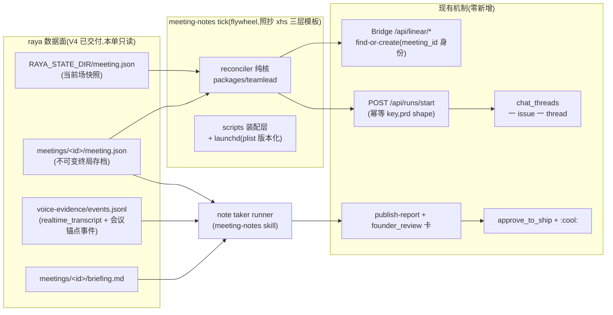

# FLY-2033 会议产物与闭环(C):每场一单 + notes 落 thread + 复用互动卡 — 实施计划
Issue: FLY-2033 (https://linear.app/geoforge3d/issue/FLY-2033/rayav5-会议产物与闭环c每场一单-notes-落-thread-复用互动卡)
日期: 2026-08-29
基于: exploration.md、research.md

> 世界标记:[raya] = raya `origin/main` 36be7e6(FLY-2032 会议骨架已并入);[flywheel] = 本 worktree base `d4e08f4a5`。
> **Status**: codex-approved(R6 APPROVED,2026-08-29;R1-R5 反馈全部并入,处理记录见 §11)
> 成色标记:🔶 = 默认值/我的判断(可改配置或她一句话即换),不是她的要求。

---

## 0. 一句话与硬约束

**一场会结束后,自动出现完整留痕链:每场会一张 Linear issue(排会时立项)→ note taker(标准 runner)会后读转写出 notes → notes 以可互动 HTML 卡落在该 issue 的 Discord thread → 她逐条批 action items、跟卡 iterate → finalize 成 doc 走 PR + Ship Card → 她 approve 进 main → issue 结。**

**Attempt 2 纠偏(覆盖旧 report):**会议模式按每场 `leadId` 参数化,不是 Raya 专属。Raya/meeting runtime 只表示编排与证据数据面;模块不 import Linear/Bridge 不等于给 Raya 设知识边界。`dispatch.leadId` 是会后 note taker 的执行 owner,不是参会者过滤器。QA 必须在 ship 前开一场真会拿到 issue-number Discord thread + note-taker 最终 HTML 卡 + founder 意见被消费的真实证据;「激活后再验」不再是可接受路径。

硬约束(出处见 exploration §1,全部核到 PRD 最新修订):

- R-42/43:留痕**无条件 + 自动触发**,⛔ 不做开关、不许要人按。
- R-59(她定,标注【暂时】):note taker **不在场,会后读转写**。
- R-45:⛔ 不做快慢车道、⛔ 不判断有无 action item、**永远在那条 thread 里跟她 iterate**、节奏由她定。
- R-23:总结不需要她互动;action items 需要她**逐条**互动(要不要做)。
- R-26(修订后):她不审 notes,但**要等她 approve**(哪怕只是点一下);门在 action item 与最终 ship 上。
- R-27:互动卡**复用现有形状**(分节/每节可留言/一键汇总复制),⛔ 不新造评论机制。
- 她砍掉的(⛔ 不复活):新 DAG 节点 / 专门 meeting-planner agent;快慢车道(R-44 划掉件)。
- R-30:没有 action items ⇒ 同一条链,卡上只出 notes。

## 1. 架构:flywheel 侧只读消费 meeting 数据面,零上游会议 runtime 改动



**为什么是 tick 不是事件推送**:① FLY-2032 plan §5 的接口合同就把 2033 定义为 raya 账本的**读者**;② raya 仓零 Linear/flywheel 依赖,反向推送要给 raya 发 token、加 HTTP 客户端、处理 Bridge 宕机 —— 三个新故障面换来的只是几分钟时延;③ flywheel 仓已有同形模板(xhs learning tick:launchd wrapper + 装配层 + 纯决策核),这是第二个实例,不是新轮子;④ 存档不可变(`archiveMeeting` 重写不一致即 throw)⇒ 轮询无竞态,天然幂等友好。代价(如实):会一结束到 note taker 开工有 tick 间隔 + runner 冷启动的分钟级延迟 —— 写进 founder HTML 诚实边界。

## 2. 受信配置(单一真源,tick 与 runner 共用)

新文件 `.flywheel/meeting-notes.yaml`(**随仓版本化,是受信输入;⛔ Linear issue body 永远不是路径 authority** —— R1 #4):

```yaml
meetingStateDir: /abs/path         # 当前物理值可指向 ~/.flywheel/raya/data/state;严格 realpath 校验
linear: { team: FLY, project: Flywheel, meetingLabel: meeting, departmentLabel: Flywheel-Product }
dispatch: { taskCategory: prd, leadId: flywheel-product-lead }
tickIntervalSeconds: 120           # 🔶
```

- department label 精确值 = **`Flywheel-Product`**(仓内 spawn-gating 现值,`.lead/flywheel-product-lead/identity.md:240-249`);它必须预先存在且唯一。`meeting` 是本管线固定拥有的 team-scoped label,并用固定 description `FLY-2033 canonical meeting issue label` 锁住 identity。仅当本地会议历史为空且扫描零错误时,scheduler 才允许通过 Linear SDK 创建这个固定 label;已有任一存档、扫描错误、同 marker 被改名、返回 identity 不一致或重复命中都 fail-close。这样 label 被改名/删除时不会换新 label 后把历史 issue 全部漏掉、批量重开。
- **preflight(每次 tick 启动时 fail-loud 重验,R2 #4)**:先完整扫描受信会议历史,再验证 FLY team 可解析、project Flywheel 唯一命中、`meeting` canonical identity 唯一(只在真首次 bootstrap 时 resolve-or-create)、`Flywheel-Product` label 存在且唯一、`flywheel-product-lead` 收养含 `prd`。任一不成立 ⇒ 本轮 tick 拒绝执行 + alert,⛔ 不带病跑。

- tick 与 note taker runner **都从这里取 canonical `meetingStateDir`**;一切具体路径(存档/事件/简报)由代码从该根派生。key 与语义保持 Lead-neutral,物理路径可以继续落在 raya service 目录。
- issue body 只携带 `meeting_id` 与人读展示信息;runner 对 body 里的展示信息只做交叉核对,**不一致 ⇒ 拒绝 + alert**。
- 路径校验:realpath containment(必须落在 canonical 根下)、regular file、no-symlink、存档内 `id === meeting_id`、严格 schema 校验;YAML 安全解析(拒重复 key)。负测覆盖 `/`、`..`、symlink、被编辑的 body。

## 3. 组件与合同

### 3.1 meeting-notes reconciler(新,唯一的新增自动化)

三层照抄 xhs 模板:

| 层 | 文件 | 职责 |
|---|---|---|
| 纯决策核 | `packages/teamlead/src/meeting-notes-scheduler.ts` | 输入 = 扫描到的会议集合 + 对账观察(issue 存在性/marker/receipt);输出 = 动作列表。**无 IO,DI 可单测** |
| 装配层 | `scripts/meeting-notes-scheduler.ts` | 读 `~/.flywheel/.env` + `.flywheel/meeting-notes.yaml`;扫 RAYA_STATE_DIR;执行动作 |
| launchd | `scripts/meeting-notes-tick.sh` + `scripts/launchd/com.flywheel.meeting-notes.plist`(**版本化入仓**,R1 #8;⛔ 无 enable 开关 —— R-42)| mkdir 原子锁防重入;安装/回滚/重启后健康检查写进 plist 注释与 README 段 |

**每场会的唯一机器身份 = `meeting.id`(UUID)**(R1 #3)。⛔ title 不是身份:

- find:按 `team=FLY + label=meeting` 经 `@linear/sdk` **完整分页遍历**(R2 #1:`GET /api/linear/issues` 的 250 clamp/`truncated` 单页语义不可用作存在性证明),每 tick 装载一次 meeting_id 索引;解析各 description trigger 块的 `meeting_id`,**精确匹配**。
- **任何一页 truncated/不可读 ⇒ 该 tick 的存在性判定为 unknown → fail-closed + alert,⛔ 不当 0 处理**。
- 0 → create;1 → 用它;**>1(含跨页分裂的重复)或 trigger 块与存档不一致 → fail-closed + alert,⛔ 不挑第一张**。
- title 只是人读:`[meeting] <scheduledAt 本地时刻> <leadId> × Annie · <topic>`(全部取自**不可变**字段;⛔ 不用 profile displayName —— 改名会漂移)。
- 测试:唯一命中在第 250 条之外、首页成功后续页失败、重复匹配跨页分裂。

**reconcile 规则**(每场会按观察对账,每个副作用独立收敛 —— R1 #2):

| 观察到 | 动作 |
|---|---|
| 当前快照 scheduled/starting/live/interrupted,无 issue | create issue(R-20:排会即立项,≤1 tick 延迟) |
| 存档 ended,无 issue | create issue(兜「安排会议 现在」秒级走完的场) |
| 存档 ended,有 issue,dispatch 未收敛 | `POST /api/runs/start`,**幂等 key = `meeting-notes:v1:<meetingId>`**(路由已有持久 idempotencyKey 语义):202 LAUNCH_PENDING ⇒ 下轮同 key 续收敛;replay 200/terminal 409 ⇒ 只修回执,**绝不新派**。成功后补一条人读回执 comment `[meeting-notes-dispatched] meeting_id=<id>`(**只是回执,⛔ 不是幂等权威** —— 权威是 start key) |
| 存档 missed/cancelled | 三个副作用**各自独立对账补齐**:①issue 存在;②终局说明 comment(人读回执);③issue state → Canceled。任一步崩溃,下轮只补缺的那步 |
| 存档损坏 / schema 不符 / find 歧义 / preflight 失败 / 全局索引失败 | **fail-loud**:跳过该场(或本轮)+ `scripts/lead-alert.sh` 发 alert。**告警合同(R2 #3 / R3 #2 / R4 #2,穷举注册面 + 钉死取值)**:新 kind `meeting_notes_failed` 要同时落齐 —— ① `lead-alert.sh:172-205` shell 闭集白名单;② `kind-contract.ts` 的 `KIND_CONTRACTS` **穷举 Record**(Bridge 启动即校验),条目**按现有 API 形状钉死(R5 #1)**:`{ owner: "claude", arc: "human_by_design", remediationRef: "按 signature 里的 failureClass 定位(schema=raya 存档损坏 / identity=issue 歧义 / linear·bridge=依赖不可用 / config=preflight);恢复依赖健康即可,幂等 tick 自行收敛,无需手工补状态" }` —— `KindOwner` 是合同属类联合(`"claude"|"codex"|…`,kind-contract.ts:39-54),⛔ 不是 Lead ID;kind→Claude infra bot 的落点由现有 `resolveTicketOwner` 映射(ticket-owner-map.ts:100-115)解析,**发射端另行指定** `lead-alert.sh --lead claude-infra-bot-lead`;③ `alert-kind-copy.ts` 的 `titleFor(kind)`/`bodyFor(kind,_pane)` **不接收动态参数**(alert-kind-copy.ts:16/:281)⇒ 只登记**静态穷举兜底文案**(title「会议留痕管线故障」等),**动态内容(subject/failureClass/经净化的 detail)由 shell 调用的 `--title`/`--body` 提供**,⛔ 不为本单改共享 copy API 签名;以上取值各配一条聚焦断言(KindContract 精确值、静态兜底文案、shell 动态参数、owner-map parity);④ 既有 shell↔Bridge parity 测试。**signature = `<subject>:<failureClass>:<YYYYMMDD founder 本地日>`**:subject = meeting UUID(有具体会议时)/ `preflight`(config·routing 类)/ `linear-index`(全局分页类)—— 全局失败没有 meetingId 也必须能构造 signature;failureClass ∈ {schema, identity, linear, bridge, config}。同类同日去重、次日重报、不同类互不吞。alert 失败本身非零退出;⛔ 只写本地日志不算已告警(R1 #8)。测试:`--strict-delivery` 真值、claims.db 同日去重、次日再报、同一 meeting 两类失败两条 claim、**全局 subject(preflight / linear-index)去重与次日再报**、spill/drain |

故障注入测试(纯核 + 装配层):每个外部副作用前/后崩溃、HTTP 成功但响应丢失、202→200、Bridge 重启、run 已 terminal 后重放、Linear/Bridge 连续失败必达 alert。

### 3.2 派单形态:`prd` shape(R1 #1)

`taskCategory: prd`、`leadId: flywheel-product-lead`、department label = product 部门 label。理由:

- `menus/shapes/prd.yaml` = 单 producer 节点(role pm)→ founder_gate,**`founderReview: true`** —— note taker 的「出卡 → 她 iterate → approve」正是这个能力;`generic` shape 没有 founderReview,`question-admission` 会永久拒绝其 founder_review question(workflow-menu.test.ts:446-464 锁死)。
- flywheel-product-lead 已收养 `[prd, design, prototype]`;pm-executor 本就是「founder 面文档产物 + 互动 HTML + iterate」的执行器,与 note taker 职责同形。
- ⛔ 不为本单全局打开 `generic.founderReview`(改变所有 generic run 的语义);⛔ 不新增 DAG 节点(她砍的)。若实现中发现 pm-executor 语义硬冲突,回 Lead 要一个最小窄作用域 menu 裁决,⛔ 不擅自改。

### 3.3 note taker(prd runner + 新 skill)

新文件 `.claude/skills/meeting-notes/SKILL.md`(flywheel 仓,随 PR 入库)。runner 流程:

1. 读 issue body 取 `meeting_id`;从 `.flywheel/meeting-notes.yaml` 取 canonical `meetingStateDir`;按 §2 校验派生路径;body 展示信息与存档交叉核对,不一致拒绝。
2. 读存档 + `briefing.md`(前两行元数据合同,坏/缺 ⇒ 弃用并披露)+ **确定性锚点切转写**(§3.5)。
3. 写 notes:`doc/meetings/<YYYY-MM-DD>-<leadId>-<meeting_id 前 8 位>/notes.md` —— 要点摘要(R-19,⛔ 不逐字)+ action items(每条:内容 / 出处转写 ts / 状态=待她批)。
4. 出互动卡(§3.4),commit,`publish-report --publish-only` 拿 URL。
5. HTML 必须与 `notes.md` 一起落 `doc/meetings/.../meeting-notes.html` 并提交;`publish-report --publish-only` 只取 hosted URL;随后 `flywheel-comm gate founder_review --hosted-url <url> --artifact <html>` 校验 exact `HEAD` 的 clean HTML ⇒ Bridge 把 📝 卡投进该 issue thread(thread 由派单时 DirectEventSink 自动建;UUID+identifier 双 key 走 FLY-270 规范化,⛔ 不自建 thread)。**notes 落 thread(R-24b)= note taker 触发的这张带 HTML URL 的卡落在 `[FLY-<issue number>]` thread,notes 全文在卡里一击可达。**
6. **iterate 的真实两步协议(R1 #5,照现有机制写死,⛔ 不改 classifier)**:
   - 她在卡上逐条选 + 留言 → 点「一键汇总复制」→ **粘回 thread**(自由发言)⇒ 现有 founder_reply 链把原文交给 Lead ⇒ **Lead 用 `flywheel-comm send` 原样转给 runner**(`respond` 被明令禁答 founder_review,⛔ 不用);
   - 本轮 gate 的解除只认她对**当前卡**的显式 verdict:reply-to 卡「打回」(或 design:/implement:/qa: 前缀)= kickback;「approve」/✅ = 通过。**只贴汇总不写 verdict ⇒ gate 保持开放**(她还没批完,这是正确语义)。
   - kickback 后:runner 按收到的汇总原文修订 notes + 卡 → **新 commit、新发布(新 URL)、新一轮 gate、新卡**;旧卡不复用。卡文案与 SKILL.md 把这两步写给她看(现有 📝 卡文案本就包含「汇总贴回 + 打回怎么给」的引导)。
7. 她 approve ⇒ finalize:notes.md 落每条 action item 处置(要做/不做/她的意见原文),commit;开 docs-only PR;CI green 后 `gate approve_to_ship --no-block` + `complete --route needs_review`。
8. 她在 Ship Card ✅ ⇒ 唤醒 → `verify-approval --pr-head` 全绿 → `:cool:` merge(唯一 merge 路径)→ issue Done ⇒ R-24/R-25/R-41 四步闭合。

**超时恢复合同(R1 #7,全部走现有机制)**:founder_review 阻塞 gate 48h fail-close ⇒ runner 以 blocked 收束,Lead 收 `gate_timed_out`。恢复 = **Lead 决定何时**再派一个 note-taker 续轮 run:同一 issue、同一分支(committed notes/HTML 就是恢复点,progress ledger 有游标),start key 带轮次 `meeting-notes:v1:<meetingId>:resume<N>`(⛔ 不复用初始 key —— 初始 key 的 terminal replay 语义是「绝不新派」);续轮 runner 重发布(hosted 7 天过期无碍,卡由模板+notes 再生,新 URL 新 gate 新卡)。全程同一 issue、不重复初始派单、不代批、不弃单、内容零丢失(都在分支上)。

### 3.4 互动卡(R-27 复用,内容差异不是机制差异)

抄 `FLY-2032/founder-design.template.html:186-283` 的整段 script,只改 PREFIX/MARKER;新增的只有**节内控件**:

- 节 1「讨论总结」:正文 + textarea(可留言但不要求 —— R-23)。
- **每条 action item 一节**:内容 + 三态快选(**要做 / 不做 / 有意见**,button 组,选中态写 localStorage)+ textarea。汇总文本逐条带态:`■ AI-1〔要做〕<留言>`。
- 底部汇总卡:marker 首行 `【页面意见汇总】FLY-<会议issue号>`;1800 字分块每块重复 marker;clipboard → execCommand 双兜底;「贴回 thread 我才收得到」如实提示(⛔ 不许承诺自动回流)。
- 单 `<script nonce="__CSP_NONCE__">`、全 addEventListener、转写/议题等派生文本一律 HTML-escape、运行时只走 textContent/value、⛔ 自带 CSP meta、零外部依赖、Apple-light。
- 组装脚本抄 `FLY-1693/build-report.py` 三断言;交付前 `verify-report --expect '【页面意见汇总】FLY-<号>'`。

三态快选是现有卡形状内的**内容**扩展(仍是「分节 + 节内留言 + 一键汇总」),不引入任何新回传机制;此判定写进 founder HTML 让她能否。

### 3.5 转写窗口:归属由「单写者串行化不变量」证明(R1 #6 / R2 #2 / R3 #1)

**归属判据 ⛔ 不用 generation**(R3 #1 证伪:session 代是进程内计数器,跨进程重启重用数值,任何「G_before 黑名单」既能误杀本会转写、也拦不住首次出现的无关代)。真正的不变量是**源码强制的语音进程互斥**(research §1.2 逐行钉死):

- [raya] `cli.ts:227-230`:`claimPidFile` 在 assemble runtime / 创建 EvidenceLog / `runtime.boot()` **之前**;claim 失败 ⇒ `startup_refused` 退出,零 evidence 写入。
- [raya] `store.ts:144-165` + `:125-142`:已有 pid 存活且 `ps` 验明是 raya voice 进程 ⇒ 拒绝 claim(`pid_owner_alive`,ps 出错 fail-closed);会议容器与普通语音模式共用同一 pid file ⇒ **互斥**。
- [raya] `evidence.ts:12-17`:同步 `appendFileSync` ⇒ 进程死后无迟到写入。

⚠️ 互斥只证「无并发写者」,**不证跨崩溃的属主连续性**(R4 #1:会议容器不净死后,一个**普通**语音进程可以接管 pid 并在 `endedAt` 前写转写与 `voice_exit`,不留任何标记 —— 该路径真实存在:supervisor down 时普通语音会**覆写** meeting request,[raya] voice-mode.ts:228-236)。⇒ **`voice_exit` 整个退出合同**;连续性由第二组源码事实证明:

- [raya] cli.ts:174-190:`run` boot 必须存在 voice-mode request,否则 `voice_mode_not_requested` 退出、零写入;
- [raya] cli.ts:69-77 + meeting-context.ts:20-35:assemble 先解析 meeting 上下文 —— request 携带本 meetingId 时,成功 boot 的进程**必然是本会议容器**(mismatch/非法状态 throw ⇒ cli.ts:233-241 写 `startup_refusal` 后退出,可见标记);
- [raya] runtime.ts:349-357:会议容器在 StartCodex 时**先写 `meeting_container_starting` 再起 realtime** ⇒ 容器的转写永远出现在自己的锚点之后;
- [raya] `meetings/<id>/voice-signal.json`(meeting.ts:517-520;runtime.ts:855-868 `recordMeetingSignal` 带 `bootId`):**只有本会议的容器会写**,普通语音进程零写入。

**连续性定理(fixture 锁死)**:设最终 signal 状态 ∈ {ended, interrupted},时刻 T。写它的必是本会议某容器 ⇒ 该容器在 T 时刻存活 ⇒(pid 互斥)(其起锚 S_k, T] 内无任何其他进程可写账本 ⇒ **[S_k, T] 内的一切账本事件都属于该会议容器**,其中 S_k = T 之前最近的 `meeting_container_live{meetingId==<id>}` 且 (S_k, T] 内无其他 `meeting_container_starting`。规则:

1. **纳入窗 = [S_k, min(T, 存档 `endedAt`)]** 内的 `realtime_transcript`;T 与 endedAt 之间的尾部 ⇒ 排除 + 披露。
2. **最终 signal 不可用**(缺失 / 状态停在 ready·live —— 容器被 SIGKILL 等不净死的形状)⇒ **fail-closed:零转写** + notes 披露「容器未净退,归属不可证」+ alert(failureClass=schema);⛔ 不用 endedAt 兜、不猜。
3. **更早的 span**(容器崩溃重启:T 所在 span 之前的 `meeting_container_*` 片段)⇒ 归属不可证(死亡与重启之间可能有隐形普通接管)⇒ **排除 + 披露**。
4. generation 只作 notes 出处元数据,⛔ 不作归属判据;`voice_exit` ⛔ 不出现在规则里。
5. 无法唯一归属的边界文本(同 ts、乱序/坏 ts、JSONL 截断尾行)⇒ **排除 + 披露**。
6. fixture(含 R4 反例回归):**会议容器不净死 → 普通语音接管写转写并 voice_exit、全部早于 endedAt ⇒ 接管者事件必须全数被排除**(此时最终 signal 停在 live ⇒ 规则 2 兜住);净退(signal ended)全量纳入;transport 先断(signal interrupted@T1)⇒ 窗止于 T1;容器重启两 span ⇒ 早 span 排除;进程重启 generation 重用不影响归属;同时双起被拒零写入;截断尾行、零转写。
7. **若实现时上述任一源码事实在 [raya] 现码上不成立**(pid 互斥、request 路由、锚先于转写、signal 只归会议容器)⇒ **fail-closed 停手,回 Lead 裁接口缺口**(可能需要 raya 侧给转写补 meeting/process epoch —— 对「零 raya 改动」目标的正式变更),⛔ 不擅自造归属启发式。

「她 iterate 能纠」只作为残余风险的兜底陈述,⛔ 不作为切片正确性的缓解手段 —— 她不审 notes,错误归因不能指望她抓。

### 3.6 数据流小结(谁写谁读)

| 数据 | 写者 | 读者(本单) |
|---|---|---|
| meeting.json / meetings/<id>/* | raya brain/voice(V4) | tick、note taker(**只读**;⛔ 不往 raya 数据面写任何文件) |
| voice-evidence/events.jsonl | raya voice | note taker(只读,锚点切片) |
| Linear issue + 回执 comments | tick(经 SDK/proxy) | tick(对账)、runner、Lead |
| chat_threads / thread 消息 | Bridge 现有机制 | — |
| doc/meetings/<...>/notes.md + 卡 | note taker runner | 归档(R-25) |
| .flywheel/meeting-notes.yaml | 本 PR(受信配置) | tick、runner |

## 4. 实施块(TDD;⛔ 不承诺工期)

| 块 | 内容 | 依赖 |
|---|---|---|
| N0 | 钉住路由合同:materialize `prd + flywheel-product-lead` 的 snapshot 单测(founderReview 能力在位)+ **routing preflight 实装**(§2:team/project/department label/收养全通;`meeting` label 用固定 description 锁 identity,只在零历史零扫描错误的首次 bootstrap 创建;改名/删除/重复/错误 identity 拒绝) | — |
| N1 | 纯决策核(reconcile 规则表全量 vitest:create/dispatch 收敛/terminal 三副作用独立对账/损坏 fail-loud/身份 0-1-多与分页 unknown;**窗口纯函数 = §3.5 属主连续性合同**:净退全纳、signal 不可用零转写、早 span 排除、普通接管回归、generation 仅出处断言) | — |
| N2 | 装配层 + tick 脚本 + **版本化 plist**(mkdir 锁、env+受信配置装载、**完整分页** find-or-create、runs/start 幂等 key、`meeting_notes_failed` kind 扩枚举 + lead-alert 接线)+ 故障注入测试 | **N0**、N1 |
| N3 | `.claude/skills/meeting-notes/SKILL.md` + 卡模板 + 组装脚本(三断言)+ 模板单测(marker/nonce/escape/三态序列化断言)+ 路径校验负测 | — |
| N4 | 全仓门禁:`pnpm lint` + `pnpm -r build` + `pnpm test:packages:run` + 新增 `scripts/__tests__/meeting-notes-tick.test.sh`(锁、缺 env/配置 fail-loud、preflight 拒跑、空目录 no-op、alert 必达) | N1-N3 |
| N5 | **ship 前 QA 真会硬门槛**(§5;implement 完成不等于验收) | **N0 preflight 全绿** + N1-N4 + `meetingStateDir` 指向已部署 V4 state;QA 可 one-shot 跑 tick,不以 launchd 已安装为前提;真会 PASS 后才允许安装常驻 plist/进入 founder ship gate |

## 5. 验收(issue 原文:一场真实会议产出 issue+notes+会后卡全链;founder 在卡上能留意见并被消费)

```
A  真会一场(voice-test-1 或她的真会,由 Lead 安排):
   排会 → ≤1 tick 内 Linear 出现 [meeting] issue(带 dept label,trigger 块含 meeting_id)
   会结束 → 存档出现 → tick 以幂等 key 派 note taker → issue thread 自动出现(FLY-270 canonical,恰 1 条)
   → thread 出现 📝 卡(hosted 卡含 notes + 逐条 action items 三态)
   → 她逐条选 + 留言 + 汇总粘回 thread → Lead send 转 runner(断言:只贴汇总,gate 仍开放)
   → 她 reply-to 卡「打回」→ runner 修订 → 新 commit/新 URL/新卡(断言:差异可见,旧卡未复用)
   → 她 approve → PR + Ship Card → 她 ✅ → verify-approval → :cool: → merge
   → doc/meetings/<...> 进 main;issue Done
   QA 证据必须同时记录:①Linear issue identifier;②Discord `[FLY-<issue number>]` thread id/截图;
   ③note-taker run/exec id;④thread 内 📝 founder-review message id/截图与最终 meeting-notes.html hosted URL;
   ⑤founder 原始意见 message id;⑥runner 消费后新 commit/新卡的差异。逐条记「量到的事实 + n=1」。
   任一环不成立 ⇒ QA FAIL、保持 PR draft/ship hold,⛔ 用单测或「激活后补」降格代替
B  幂等回归:同一场会连跑 3 个 tick ⇒ issue 恰 1 张、runs/start 恰 1 次实际派单、thread 恰 1 条;
   cancel 后同一分钟重排新会 ⇒ 两张 issue 各归各(meeting_id 身份);profile 改名 ⇒ 身份不漂移
C  终局回归:cancelled 与 missed 各一场(注入假存档于隔离 state dir)⇒ issue 留痕 + Canceled,零 runner;
   人为在三副作用之间打断 ⇒ 下轮只补缺步
D  超时演练:founder_review 超时 ⇒ blocked 收束 + Lead 告警;Lead 续轮派单 ⇒ 同一 issue 恢复,无重复初始派单
```

## 6. 风险(如实,不配平)

| 风险 | 处置 |
|---|---|
| 转写质量(PRD §13 语料) | note taker 只写「真说出口的」;引用带 ts 出处;不猜 |
| 锚点事件缺失(容器崩在 live 前) | 无转写路径:notes 写明,同一条链继续(R-30 同族) |
| 她的批复是自然语言,runner 可能错读 | 修订稿必然再过她一眼(新一轮卡),错读不出门;approve 才 finalize |
| hosted 卡 7 天过期 | 归档真身 = repo notes.md(R-25);卡由模板+notes 再生,续轮新 URL |
| pm-executor 语义与 note taker 有摩擦 | SKILL.md + issue body 明确任务;硬冲突回 Lead 要窄作用域 menu 裁决,⛔ 不擅自改 menu |
| RAYA_STATE_DIR 布局漂移(raya 侧重构) | 只依赖 FLY-2032 plan §5 明文接口;tick/runner schema 校验 fail-loud;§10 会过期结论登记 |
| Linear/Bridge 长时间不可用 | reconciler 天然重试;连续失败走 lead-alert(claims.db 去重,一天一报);⛔ 不静默 |

## 7. 决策与取舍(带反面)

| # | 决定 | 反面 / 被否的替代 |
|---|---|---|
| D1 | flywheel 侧 tick 只读 raya 数据面,零 raya 改动 | 否:raya brain 推送(新 token/新 HTTP 客户端/Bridge 宕机面;换来的只是分钟级时延) |
| D2 | 每场一单:meeting_id 为唯一身份 find-or-create;runs/start 持久幂等 key 为派单权威 | 否:排会时同步建单(glaw 的「立项失败=会不开」语义对她的会不可接受);否:title 查重/marker comment 当权威(R1 #2/#3 打掉) |
| D3 | note taker = prd shape 标准 runner + skill,⛔ 无新角色/新 DAG 节点 | 否:generic(无 founderReview 能力,核心环节走不通);否:全局开 generic.founderReview(改所有 generic run 语义);否:专门节点(她砍的) |
| D4 | iterate 用现有 founder_review 卡 + 两步回流(汇总粘贴→Lead send;verdict 只认 reply-to 卡) | 否:页面自动回传(放宽 CSP connect-src = 新安全面 + Blueprint 红线);否:让汇总自动当打回(改 classifier = 新机制) |
| D5 | 三态快选做进现有卡形状,不加评论后端 | 否:结构化审批 API(新机制,违 R-27) |
| D6 | notes 归档在 `doc/meetings/`(flywheel 仓),docs-only PR | 否:归 raya 仓(Linear/PR/门禁都在 flywheel;会议内容是公司记录不是 raya 代码) |
| D7 | missed/cancelled 也建单留痕后 Canceled,三副作用独立对账 | 否:只对 ended 建单(违 R-42/R-20) |
| D8 | 受信配置 `.flywheel/meeting-notes.yaml` 为路径唯一真源 | 否:issue body 带路径(同源自证,任意文件读 + 托管外泄面,R1 #4 打掉) |

## 8. 明确不做(本单)

排会/会中/语音链路(2032/2074/2097)· 简报内容(2030)· 念读筛选/用嘴批 ship(2031)· 会上立刻执行(R-40,2032 域)· 为「接下来做什么」自动开 follow-up issue(她在 thread 里定)· notes 质量评审门(她不审 notes)· 多场并发会议 · 页面自动回传 / classifier 改动 · 任何 raya 仓改动 · 全局 menu 能力改动。

## 9. 将来项(登记不做)

按会议 leadId 映射部门/Lead 的派单;若分钟级延迟被她点名,再评估 raya 侧推送(届时才引入 token/HTTP 面)。

## 10. 会过期的结论

| 结论 | as-of | 重核 |
|---|---|---|
| raya main 含 FLY-2032 骨架;存档/事件路径与锚点事件形状如 research §1 | 2026-08-29(36be7e6) | 实现前重读 `packages/contracts/src/meeting.ts`、`apps/voice/src/runtime.ts` |
| `prd` shape founderReview:true;flywheel-product-lead 收养 prd | 2026-08-29 | `menus/shapes/prd.yaml`、`.flywheel/menus/adoption.yaml` |
| runs/start 持久 idempotencyKey/202/replay 语义 | 2026-08-29 | `runs-route.ts:1280-1301, 2647-2674, 3259-3368` |
| ingest tier 无 deliver 权限;reports 7 天过期 | 2026-08-29 | `publish-report.ts` / `report-registry.ts` |
| RAYA_STATE_DIR 生产路径 | 部署输入 | Lead 部署时落进 `.flywheel/meeting-notes.yaml` |

## 11. Codex design review 处理记录

| 轮 | verdict | 处理 |
|---|---|---|
| R1(2026-08-29) | CHANGES REQUESTED(5 HIGH + 3 MEDIUM) | **全部接受**:#1 generic 无 founderReview ⇒ 改 `prd + flywheel-product-lead + product label`(§3.2;拒绝全局开 generic.founderReview 与新节点);#2 幂等权威改为 runs/start 持久 key `meeting-notes:v1:<id>`,202/replay 收敛,marker 降为人读回执,terminal 三副作用独立对账 + 故障注入测试(§3.1);#3 身份改为 meeting_id 精确匹配,0/1/>1 显式,fail-closed,title 仅人读且只用不可变字段(§3.1);#4 新增受信配置 `.flywheel/meeting-notes.yaml` 为路径唯一真源,body 只带 meeting_id,负测覆盖(§2);#5 回流协议改写为两步真实 UX(汇总→Lead send;verdict 只认 reply-to 卡),删 respond,验收断言三行为(§3.3 步 6、§5A);#6 窗口改确定性锚点(meeting_container_live 含 meetingId),排除+披露,fixture 锁死,删「她 iterate 纠」作缓解(§3.5);#7 超时恢复写成可执行合同(blocked 收束 → Lead 续轮 key `:resume<N>`,同 issue 同分支恢复,§3.3 末);#8 plist 版本化入仓 + lead-alert.sh 真通道 + alert 必达测试(§3.1/N2) |
| R2(2026-08-29) | CHANGES REQUESTED(2 HIGH + 2 MEDIUM) | **全部接受**:#1 有界扫描不能证明不存在 ⇒ 改完整分页遍历 + truncated/不可读页 = unknown fail-closed + 三个分页测试(§3.1);#2 generation 未被使用且 voice_exit 无作用域 ⇒ 重核 raya 事件形状并回写 research §1.2(含 file:line),窗口规则改「meetingId 锚 + 存档 endedAt 上界 + generation 基线排除 + ⛔ voice_exit 不作锚」,fixture 补五类(§3.5);#3 告警合同落地为可执行:扩 `meeting_notes_failed` kind + parity 测试,signature = `<meetingId>:<failureClass>:<日>`,同日去重/次日再报/分类不吞 + 五项脚本级测试(§3.1);#4 label 定值 `Flywheel-Product`、`meeting` label 由 Lead 部署时建、preflight 装机+每 tick fail-loud、N2/N5 依赖 N0(§2/§4) |
| R3(2026-08-29) | CHANGES REQUESTED(1 HIGH + 2 MEDIUM) | **全部接受**:#1 G_before 黑名单被证伪(session 代跨进程重用)⇒ 回 raya 源码找到**更强的排他性不变量**并逐行钉死(`claimPidFile` 先于一切 evidence 写入、`pid_owner_alive` fail-closed、同步 append ⇒ 单写者串行化):归属改由串行化证明,voice_exit 因此可归属为终锚,generation 彻底退出归属判据;补 R3 三个反例 fixture;若实现时不变量不成立 ⇒ fail-closed 回 Lead 裁接口缺口(§3.5、research §1.2);#2 告警注册面穷举(`KIND_CONTRACTS` owner/ARC/remediation、`alert-kind-copy` 渲染、shell 兜底文案、parity 测试),signature 主语改 `<subject>`(meeting UUID / preflight / linear-index),补全局 subject 测试(§3.1);#3 research §5 Q-D/Q-E 行与 §4 待核清单已按最终决定改写并标注 supersede 链(research §4/§5) |
| R4(2026-08-29) | CHANGES REQUESTED(1 HIGH + 2 MEDIUM) | **全部接受**:#1 串行化不证跨崩溃连续性(不净死后普通语音可无标记接管 —— 且实查 voice-mode.ts:228-236 证实该路径真实)⇒ `voice_exit` 整体退出合同,连续性改由「voice-signal.json 单归属 + request 路由 + 锚先于转写 + pid 互斥」四条源码事实推出定理:[S_k, T] 全归会议容器;signal 不可用 ⇒ 零转写 fail-closed;早 span 排除;补 R4 反例回归 fixture;research §1.2 两处 voice_exit 表述已调和(§3.5、research §1.2);#2 KIND_CONTRACTS 取值钉死(owner=claude-infra-bot-lead、arc=human_by_design、remediation/标题/正文/兜底文案全文 + 聚焦断言)(§3.1);#3 N1 行残留的「generation 基线」措辞删除,改为 §3.5 属主连续性合同 + 五类 fixture(§4 N1) |
| R5(2026-08-29) | CHANGES REQUESTED(1 MEDIUM) | **接受**:R4 #2 我钉的取值与现有 API 形状不符 ⇒ 改为 `{ owner: "claude", arc: "human_by_design", remediationRef: … }`(KindOwner 是属类联合不是 Lead ID;落点由 resolveTicketOwner 解析,发射端 `--lead claude-infra-bot-lead` 另行指定);`titleFor/bodyFor` 无动态参数 ⇒ 静态穷举兜底文案 + 动态内容走 shell `--title/--body`,⛔ 不改共享 copy API;四项聚焦断言(§3.1) |
