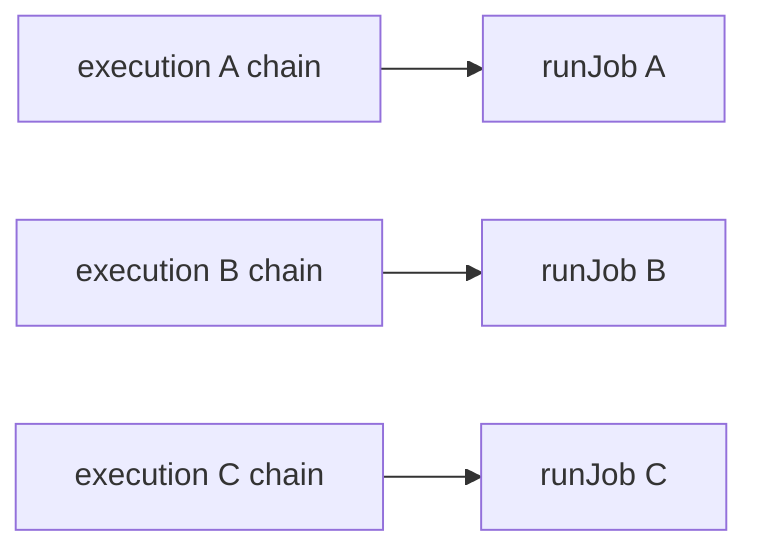

# FLY-2037 去掉 reviewer 全局 slot — 实施计划
Issue: FLY-2037 (https://linear.app/geoforge3d/issue/FLY-2037/bridgereview-去掉全局-reviewer-slot-上限founder-直令废-reviewrequestcoordinator)
日期: 2026-08-24
基于: research.md

## 1. 目标状态

不同 execution 不再汇入 coordinator-wide slot pool；每条 execution chain 内仍一次只运行一个 job。

## 2. 范围

修改：

- `packages/teamlead/src/bridge/review-request-coordinator.ts`
- `packages/teamlead/src/bridge/__tests__/review-request-coordinator.test.ts`
- `packages/teamlead/src/bridge/plugin.ts`（§7.1 wiring 注释）
- 本文件夹的过程文档与进度账

明确不改：

- `StateStore` schema/job 状态机
- gate/request API 与 `flywheel-comm request-review`
- reviewer subprocess、timeout、模型或 effort
- fail-close、same requestId retry、outbox、boot redrive
- 429/容量 admission/config/env

## 3. TDD 顺序

### 3.1 RED：锁定新的吞吐语义

在 `review-request-coordinator.test.ts` 增加调度测试：

1. 建立 10 个不同 execution、10 个 open design gate、10 个不会立即完成的 review round。
2. 依次 `accept()` 十个 request。
3. 在任何 round 完成前断言 `started === 10`。
4. 旧实现默认全局并发 2，因此该断言必须 RED；10 个同时开始也能抓住常见的“只把 cap 调大”伪修复。
5. 释放全部 round，断言十份 job 都完成，证明不是空过绿。

### 3.2 characterization：锁定必须保留的语义

- 同 execution 接受两个 request：第一个未完成时 `started === 1`；释放后第二个才开始并最终完成。
- 把旧 slot-waiter shutdown 测试改成 per-execution chain shutdown：两个 request 必须使用同一个 execution 的两个 open design gate；第一个 job 运行时 `stop()`，释放后第二个尚未开始的 job不得启动。
- 补 boot redrive 调度测试：不同 execution 的 redrivable job 全部立即开始；同 execution 的 redrivable job 仍串行。

### 3.3 GREEN：净删除全局 semaphore

在 `review-request-coordinator.ts`：

1. 删除 `ReviewCoordinatorDeps.maxConcurrent`。
2. 删除 `maxConcurrent`、`active`、`waiters` 字段及构造赋值。
3. `stop()` 只设置 `stopped = true`。
4. `enqueue()` 保留 per-execution chain 与异常 fail-close，直接 `await runJob(requestId)`。
5. 删除 `acquireSlot()` / `releaseSlot()`。
6. 更新文件头 Scheduling 注释，明确“serial per execution; no coordinator-wide concurrency ceiling”；把 `enqueue()` 中“AFTER the slot wait”的旧 R13 注释改成 predecessor chain 完成与 shutdown 的真实关系。

在 `plugin.ts`：

- 更新 FLY-1188 §7.1 wiring 注释，同步注明 FLY-2037 后只有 per-execution 串行，没有全局 slot 上限。

### 3.4 REFACTOR：只删残余，不扩范围

- `rg` 确认 production/test TypeScript 中没有 `maxConcurrent`、slot waiter、`global concurrency 2` 残余。
- 不抽新 helper，不增加依赖，不引入新配置。

## 4. 验证矩阵

| 要求 | 证明 |
|---|---|
| 去掉全局上限，而非调大 | 代码中 semaphore/参数/默认值 grep-zero；10 execution 同时开始测试 |
| 同 execution 串行 | 两 request characterization test |
| 清理 waiters/排队逻辑与测试 | 字段/方法/旧测试名 grep-zero；stop 改测 execution chain |
| §7.1 注释同步 | coordinator 文件头 + plugin wiring 注释 |
| gate/fail-close 不变 | 既有 coordinator 全文件 suite |
| boot redrive 调度符合新语义 | 多个 redrivable job 的跨 execution 并发 + 同 execution 串行测试 |
| package 无回归 | `pnpm --filter flywheel-teamlead test:run src/bridge/__tests__/review-request-coordinator.test.ts`，再 TeamLead package suite |
| 全仓无回归 | `pnpm lint`、`pnpm -r build`、`pnpm test:packages:run` |

若 canonical aggregate 受宿主 GUI、固定 timeout 或生产负载边界影响，只能在核实失败签名、与本分支关系及隔离复跑后披露；不得把未通过的 aggregate 报成全绿。

## 5. 提交与交接

1. 提交 RED test 证据（可以与 GREEN 同一最终 commit，但保留命令输出）。
2. 完成实现、focused/full gates。
3. `stage set code_review` 后按 Codex author 协议开 `review_code` gate、`request-review`、轮询 verdict；CHANGES 则修复并开新 request。
4. push feature branch，创建非 draft PR；PR body 写明 Founder 直令、净删除范围、测试证据及明确未做的容量机制。最坏 boot fan-out 明确写成 N 个 reviewer process，其中 N 是不同 execution 的 redrivable job 数；不在本单另设 N 的上限。
5. 不请求 ship、不 merge、不部署/重启；执行 `complete --route needs_review --pr <number>`。

## 6. 会过期的结论

| 结论 | as-of | 重核方式 |
|---|---|---|
| 目标文件与测试路径如上 | 2026-08-24 `88c3df6b9` | `rg --files packages/teamlead/src/bridge | rg 'review-request-coordinator'` |
| 全仓 canonical commands 是 lint/build/package aggregate | 2026-08-24 | 阅读当前 runner role 与 root `package.json` scripts |
| 本节点只交 needs_review，不 dispatch QA/ship | 2026-08-24 implement activation epoch 1 | `flywheel-comm turn` 与本次动态任务文本 |
