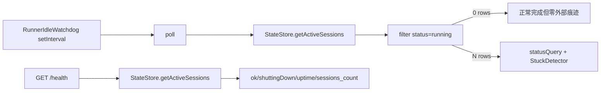

# FLY-204 看门狗健康可观测性 — 调研
Issue: FLY-204 (https://linear.app/geoforge3d/issue/FLY-204/bridge-watchdog-observability-idle-heartbeat-health-exposure-fly-195)
日期: 2026-08-30
基于: exploration.md

## 调研结论

推荐沿用 Bridge 的 late-bound holder 模式，把 `RunnerIdleWatchdog` 自己维护的内存快照只读暴露到 `/health.watchdog`。该改动无需新 timer、数据库、metrics SDK 或日志节流器；成功空轮明确记录 count 0，即可直接闭合 FLY-195 QA 的“健康空闲和循环冻死同痕迹”缺口。

## 当前数据流



`/health.sessions_count` 是所有 active session 的数量，不等于 watchdog 本轮真正检查的 running 数；它不能替代 `activeRunningSessions`。

## 所有权与接线模式

### 快照 owner

快照应由 `RunnerIdleWatchdog` 持有，因为只有它知道：

- timer 是否实际 armed；
- poll 是否处于 in-flight；
- 哪次 callback 真正完成；
- 顶层 session read 是否成功；
- 该轮过滤后的 running 数。

如果 `/health` 自己重新查询 StateStore，只能重算“现在有多少 session”，不能证明 watchdog loop 曾经推进。

### Bridge 接线

`createBridgeApp()` 在 `startBridge()` 早段创建，而 watchdog 在 listen、通知器、detector 等依赖就绪后创建。项目已有多个同型 late-bound holder：

- `shutdownStateHolder`：`/health` 读、`close()` 写；
- `stuckDetectorHolder`：router 读、post-listen detector 写；
- `reconnectHolder`：event/watchdog 读、HeartbeatService 写。

因此新增 `idleWatchdogHealthHolder.current` 是现有模式的直接复用。holder 只依赖一个窄 provider interface（`health(): IdleWatchdogHealth`），避免 `/health` 耦合 watchdog 内部实现。

## 字段语义

| 字段 | 类型 | 语义 |
|---|---|---|
| `timerRunning` | boolean | `start()` 已 armed 且尚未 `stop()`；不等同于“上一轮成功” |
| `pollIntervalMs` | number | 实际解析后的 cadence；消费者据此判断时间戳是否 stale |
| `pollInProgress` | boolean | 当前有一轮真实 poll in-flight；重叠 tick 不创建第二轮 |
| `lastPollAt` | ISO string \| null | 最近一轮真实 poll 结束的 wall-clock；重叠 skip 不刷新 |
| `lastPollResult` | `ok` \| `error` \| null | 顶层 session 枚举/循环 containment 的结果；不泄露异常文本 |
| `activeRunningSessions` | number \| null | 最近成功枚举后过滤出的 running 数；error 时为 null，空闲成功为 0 |

返回快照时必须构造新对象，不能把可变内部引用交给 HTTP 层或测试调用方。

## 生命周期与失败语义

### 首轮前

`start()` 当前不立即 poll，且默认 cadence 为 3,600,000ms。保持该行为以避免在启动路径引入新的 tmux/DB 负载或告警时序。`timerRunning=true` + `lastPollAt=null` + cadence 足以表达“已 armed，尚未到首轮”。

### 成功空轮

`getActiveSessions()` 成功、filter 得 0，轮次仍是 `ok`；`lastPollAt` 必须刷新，`activeRunningSessions=0`。这是本 issue 的核心回归场景。

### 顶层错误

现有 containment 会记录 warning 并尝试 `recoverFromCorruption()`。本改动保留该流程，只在 `finally` 将本轮标成 `error`、计数置 null、刷新结束时间。这样能区分“callback 活着但数据源坏”与“callback 不再运行”。

### 单 session 错误

`checkSession()` 自己 containment；该轮顶层仍完成。现有日志/事件负责 session 级诊断，本 health 快照不扩张成 per-session metrics。

### 重叠 tick

`if (polling) return` 必须维持；跳过的 tick 不刷新 `lastPollAt`。否则一个永不 resolve 的 poll 会被后续 interval callback 反复伪装成健康 heartbeat。

### shutdown

`close()` 先将顶层 `shuttingDown=true`，随后 `idleWatchdog.stop()`；health 若在 teardown 窗口仍可请求，会看到顶层 draining 事实，watchdog provider 最终显示 `timerRunning=false`。不需要额外 dispose 状态。

## API 兼容性

现有消费者只读取 `ok`、`shuttingDown` 或 `sessions_count`，其余多为 `curl -sf` reachability。新增嵌套字段是 additive；不改变状态码、顶层 `ok` 或既有字段类型。

Standalone `createBridgeApp()` 没有 holder 时返回固定未接线快照：

```json
{
  "timerRunning": false,
  "pollIntervalMs": null,
  "pollInProgress": false,
  "lastPollAt": null,
  "lastPollResult": null,
  "activeRunningSessions": null
}
```

固定对象形状比 `watchdog: null` 更利于运维脚本直接读字段，也能让已有 standalone route tests 覆盖契约。

## 测试策略

1. `runner-idle-watchdog.test.ts`：先写 empty-running failing test，要求一次 `pollOnce()` 后记录 `ok`、count 0、新时间戳。
2. 同文件：写顶层 store error failing test，要求 `error`、count null、containment 不 reject。
3. 同文件：扩展/新增 in-flight test，要求进行中为 true、重叠 tick 不刷新完成时间、resolve 后写完成快照。
4. `bridge.test.ts`：写 holder contract failing test，要求 `/health.watchdog` 逐字段透传；无 holder 时固定未接线形状。
5. build/typecheck/focused tests 后，再跑用户指定的全仓 gates。

## 基线证据

- `pnpm -r build`：exit 0。
- `pnpm exec vitest run src/__tests__/runner-idle-watchdog.test.ts src/__tests__/bridge.test.ts`（`packages/teamlead`）：2 files、48 tests 全绿。
- 一次误用 package script 的全 TeamLead suite 显示 2,892 tests 通过；失败集中于未 build 的 workspace dist、sandbox host path 和本机 npm cache 权限。build 后 focused baseline 全绿，说明目标测试面本身干净。

## 不采用项

- 不加默认日志 heartbeat：日志不可作为确定性健康 API。
- 不把 StuckDetector episode count 纳入本期：它对“running 集合为空仍 poll”没有增量证明，且会扩大 detector API。
- 不持久化时间戳：该指标描述当前 Bridge 进程内 loop，重启后归零是正确语义。
- 不更改 cadence 或立即首 poll：属于行为/负载调整，不是可观测性补丁。
