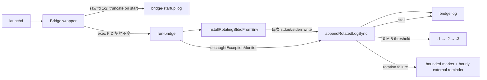

# FLY-2049 Bridge 日志轮转真运行 — 探索
Issue: FLY-2049 (https://linear.app/geoforge3d/issue/FLY-2049/infra日志-bridge-日志轮转未生效部署后-bridge-日志-94106mb-持续增长无任何轮转产物-查根因并让轮转真跑起来)
日期: 2026-08-25
基于: 无

## 1. 问题与边界

本单主对象是 `/tmp/flywheel-bridge.log`：找到 8 月 24 日部署后仍不轮转的根因，并让 Bridge 在线时用真实阈值触发产物、主文件回落、后续日志继续写入。FLY-1995 已修过的日志洪水源头不在本单内。

顺带审计两份大日志，但不预设它们必须复用同一实现：

- `/tmp/flywheel-cmux-watcher.log`：纯 Bash watcher，存在 launchd 与脚本内双重长 FD；
- `/tmp/flywheel-lead-flywheel-codex-infra-bot-lead.log`：Codex TUI Lead 的 launchd stdout/stderr，stdout 还承担交互/runtime 语义。

implement 节点不会重启生产 Bridge；正向验收用隔离 Node producer 故意灌过小阈值。生产上线后的同形证据由正常 updater 窗口完成。

## 2. 生产证据（2026-08-25 13:32–13:33 PT）

| 文件 | 大小 | 轮转产物 | open FD |
|---|---:|---|---|
| `/tmp/flywheel-bridge.log` | 110,803,290 B（106 MiB） | 无 `.1/.gz` | Bridge 及其子 Node 进程共同持有 inode `564088186` |
| `/tmp/flywheel-cmux-watcher.log` | 72,147,288 B（69 MiB） | 无 | launchd watcher 与脚本内重定向共同持有 inode `564088214` |
| `/tmp/flywheel-lead-flywheel-codex-infra-bot-lead.log` | 16,839,565 B（16 MiB） | 无 | launchd job 的 stdout/stderr 指向同一路径 |

`launchctl print gui/501/com.flywheel.bridge` 证明 canonical job 在线，`StandardOutPath` 与 `StandardErrorPath` 都直接指向 `/tmp/flywheel-bridge.log`。cmux watcher 与 infra-bot Lead plist 也是相同表象，但三者的 producer/runtime 并不相同。

## 3. 根因链

### 3.1 FLY-1887 已部署，但没有覆盖 Bridge 主日志

FLY-1887（commit `3c41a16f7`）在部署 SHA `9d322f602` 之前进入 main。它新增的是“每次 append 都重新打开文件”的 rename helper。`scripts/lib/flywheel-log.sh` 文件头明确排除 launchd `StandardOutPath` / `StandardErrorPath` 持有的长期 FD。

全仓 call-site audit 证明：Bridge wrapper、cmux watcher、infra-bot launcher 从未调用主日志轮转；Bridge 内的 `rotateLogIfNeeded` 只覆盖 event-loop episode JSONL。8 月 24 日部署带上了相邻能力，但没有给 `/tmp/flywheel-bridge.log` 配置任何轮转 owner。

### 3.2 把 timer 接上 rename helper 会制造假轮转

隔离复现中，在线 producer 先打开 `bridge.log`，外部 helper 把它 rename 成 `.1`，producer 再写。结果后续字节仍进入旧 inode `.1`，主路径消失。Unix open-FD 语义决定了 timer/newsyslog 式 rename 不会让现有 Node FD 自动 reopen。

因此正确问题不是“何时调用 rename”，而是**如何让高流量正常日志不再通过长期文件 FD 写入**。

## 4. 方案比较

### A. Node stream sidecar + pipe（设计审查后放弃）

R1 设计曾建议 producer stdout/stderr 接 pipe，由单一 sidecar 同步落盘。它能在测试中串行 rotate，但引入四类新风险：

1. macOS 上 Node stdout 到 pipe 是异步路径，`process.exit()`/崩溃尾部可能来不及排空；
2. sidecar 启动、死亡、孤儿回收需要新的 lifecycle 与 owner lock；
3. cmux stable-bin 闭包若缺 Node/sidecar 会 fail-closed 拉倒 watcher；
4. `daily-standup.sh`、`r4-window.sh` 两条直启路径会绕过 sidecar，破坏单写者假设。

这些不是测试补丁能消掉的偶发问题，所以不继续沿用。

### B. Bridge 入口内同步短 FD writer（采用）

Bridge 进程启动后立即替换自己的 `process.stdout.write` / `process.stderr.write`：每次写调用现有 rotation core 的 strict short-FD append，短暂 open → 必要时 rotate → append → close。launch wrapper 在进入 Node 前用单个 `>` 把原始 fd 1/2 指向 raw-startup capture；每次 Bridge 启动都会先截断，只保留最后一次启动/module/V8/native 诊断，不跨 crash-loop 累积。

Node 默认的 uncaught stack 不经过 patched `process.stderr.write`。因此 entry 同时安装 `uncaughtExceptionMonitor`：在 Node 打印 raw stack 并退出前，先把同一 stack 同步写进 bounded 主日志。attempt 2 将日志层统一改为可用性 fail-open：unsafe generation 先改名为 `.corrupt.<pid>.<ts>` 再继续轮转；2× stall 只停 rotation、主日志继续 short-FD append；其它 setup/write failure 降级到原始 stream。所有失败只更新固定大小 state marker，绝不阻止或杀死 Bridge。

这条路保留 Node/file stdout 的同步故障语义，不创建 pipe，不把环境或 stdout 劫持泄漏给 Bridge 启动的 Codex/Claude 子进程，也不需要常驻 sidecar owner。

### C. stop → rename → start

FLY-1998 已安全实现离线 surgery：job absent、端口释放、零 open FD 后才 rename。它适合一次性处置，但每次轮转都要 Bridge 下线，不能作为持续在线机制。

### D. live copytruncate

copy 与 truncate 之间的写入可能丢失/重复；旧 offset 继续写还可能产生 sparse/NUL。无法满足逐字节正向证据，拒绝采用。

## 5. 所有 Bridge 入口的处理

| 入口 | 当前问题 | 设计处置 |
|---|---|---|
| `flywheel-bridge-wrapper.sh` | canonical launchd FD 长持主日志 | 导出主日志/raw-startup/错误 marker；Node exec 前用 `>` 截断并接 raw capture |
| `daily-standup.sh` | down 时直接 `nohup node/tsx >> bridge.log` | 使用同一三个绝对默认路径；nohup raw fd 用 `>` 接 raw capture |
| `scripts/r4/r4-window.sh` | trial 直接写生产主日志，且按旧行号 stormwatch | trial 改用独立临时日志，不参与生产主日志 owner；stormwatch 读 trial log |
| 手工 `npx tsx scripts/run-bridge.ts` | 终端/测试用途 | 没有显式 env 时保持终端 stdout，不暗写 `/tmp` |

## 6. side-log 审计结论

cmux watcher 与 infra-bot Lead **需要有界日志**，但不应在本单强行复用 Bridge writer：

- cmux 是 Bash producer，且 stable-bin/无 Node 闭包是已有可用性合同；把 Node writer 塞进去会重演 FLY-1577 类部署缺字节故障。
- infra-bot TUI 的 Node 子进程 stdout 带交互/协议语义；全局替换或继承 preload 有劫持子进程 stdout 的风险。

本 PR 只修 Bridge。两份 side log 的体积、FD 与建议后续方向写入调研和 Lead 报告，避免把“同目录”误当成“同生命周期”。

## 7. 验收形态

自动正向证据必须同时证明：

1. 同一 Node producer PID 在 `.1` 出现前后存活；
2. active 文件体积回落，`.1` 存在；
3. 按 `.3 → .2 → .1 → active` 拼接后与输入逐字节一致；
4. 轮转后 sentinel 落在 active；
5. producer 对主日志与 `.1` 都没有长期 open FD；
6. wrapper、daily-standup、R4 三条非测试入口不再 `>> /tmp/flywheel-bridge.log`；
7. module/tsx/V8/native 启动错误保留在每次启动截断的 raw-startup capture，uncaught stack 也同步进入 bounded 主日志；
8. unsafe generation 会被 recoverable quarantine；陈旧目录/普通文件锁会回收；rotation stall 会停轮转、持续告警且 Bridge 仍在线；
9. packaged 与 monorepo 的 node/tsx seam 都保持原启动命令。

## 8. 会过期的结论

| 结论 | as-of | 过期条件 | 重核命令 |
|---|---|---|---|
| Bridge 主日志 110,803,290 B、无代际文件 | 2026-08-25 13:32 PT | 任何部署/人工处置 | `ls -lh /tmp/flywheel-bridge.log*` |
| Bridge job stdout/stderr 直接指主日志 | 2026-08-25 13:33 PT | plist 重装/服务改造 | `launchctl print gui/$(id -u)/com.flywheel.bridge` |
| production/daily/R4 是三条主日志直写入口 | commit `fe795ecbe` | 启动链变化 | `rg -n '/tmp/flywheel-bridge.log|run-bridge' scripts` |
| FLY-1887 helper 不适用于现有 open FD | commit `fe795ecbe` | helper 语义变化 | `sed -n '1,12p' scripts/lib/flywheel-log.sh` + open-FD harness |
