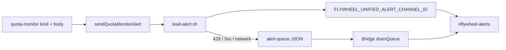
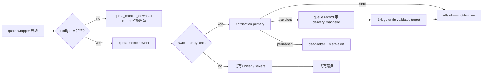

# FLY-2051 Claude 切号通知按 kind 改道 — 探索
Issue: FLY-2051 (https://linear.app/geoforge3d/issue/FLY-2051/quota-monitor路由-claude-切号通知改发-flywheel-notification切号家族-per-kind)
日期: 2026-08-25
基于: 无

## Founder 指令与边界

Founder 要求 Claude 切号消息不再落 `#flywheel-alerts`，改发她会看的
`#flywheel-notification`。本单只改变三个 quota-monitor kind 的完整投递链：

- `account_switched`
- `account_switch_degraded`
- `quota_switch_confirmation`

`FLYWHEEL_UNIFIED_ALERT_CHANNEL_ID` 继续作为其余告警的全局默认值；通道 id 只从已有
`FLYWHEEL_NOTIFY_CHANNEL` 读取，代码与测试不写生产 snowflake。

## 现有链路与第一版设计失效点

第一版只计划在 `sendQuotaMonitorAlert` 的 child env 覆盖 unified channel。R1 design review
指出它没有覆盖四条真实边：

1. `account_switched` / `account_switch_degraded` 是直接发送，不进 durable outbox；notify env
   缺失时 early `config_error` 会直接丢消息。
2. shell transient queue record 不保存目标 channel，Bridge drain 会回落到 alerts。
3. `account_switch_degraded` 的 severe secondary 未来可能重新指向 unified alerts。
4. alert-dispatch sender 在 notification 的 View/Send 权限必须先取证，不能只假设。

这些不是“多做可靠性优化”，而是原始路由要求的完整成立域。目标必须覆盖首次 POST、transient
重投、permanent failure、配置启动与 severe secondary，而不是只让 happy-path unit test 变绿。

## 修订目标链路

## 已证事实

- quota wrapper 会 source `~/.flywheel/.env` 并导出变量；daemon 重启后能读取 notify 配置。
- 2026-08-25 只读核对：unified 与 notify 已配置，severe secondary 未配置。
- alert-dispatch bot 的 Discord guild/channel permission 计算结果为：目标频道可 View 且可 Send。
  取证使用 `/users/@me`、channel、guild member、roles 与 permission overwrites 的只读 API，未发消息。
- `account_switched` body 已包含 `from->to`、切前 5h/7d、切后 5h/7d；路由层无需重组。
- `quota_switch_confirmation` 已走 durable outbox；另外两个 target kind 是 fire-and-forget。
- `lead-alert.sh` 对 401/403/404 会写 dead-letter 并触发 meta-alert；对 transient 会写 queue。

## 约束与决策

1. **不回退 alerts**：switch-family primary 缺 notify 配置时不能继承 unified。改在 daemon 启动边界
   做非空校验并即时 `quota_monitor_down` fail-loud，然后拒绝启动；运行期不再存在“环境缺失但继续
   切号”的静默窗口。
2. **目标 channel 随 transient 记录**：仅 switch-family shell queue JSON 增加
   `deliveryChannelId`；其他 kind 的记录字节形状与 drain 默认不变。Bridge 对该字段做 snowflake
   校验，非法值 fail-close dead-letter，合法值按原 target 重投。
3. **sender 不切换**：继续使用 alert-dispatch identity；只读权限核对已证明它能在 notification
   View/Send。实现后还要从本地 build 走真 shell/Discord 做受控落点验证。
4. **不允许 severe 漏回 alerts**：notify kind 的 secondary 若等于 actual primary 或 global unified
   均跳过；独立 non-unified severe channel 仍保留既有双投能力。
5. **落点不改变治理语义**：`account_switch_degraded` 继续是 severe manual ticket，notification 中
   保留既有 ticket header/thread/ARC；不能为了视觉更轻而把需要 human disposition 的事件降级。
6. **mention 维持既有策略**：`account_switched` / `account_switch_degraded` 继续 mention founder；
   `quota_switch_confirmation` 继续 non-mention。“保留”按“不扩大 mention 面”理解；若产品意图是
   confirmation 也 ping，只需独立修改 routing boolean，不与本单路由实现耦合。
7. **字段逐字透传**：title/body/signature/strict-delivery args 不变。

## 验收观察面

- TypeScript child boundary：target family 的 resolved primary 是 notify；`quota_no_target` 仍是
  alerts；account switch mention/body literal 完整。
- Shell transient boundary：target queue record 带 notification target，non-target 不带。
- Bridge drain boundary：合法 target 回 notification；非法 target 不投任意 channel。
- Wrapper boundary：notify 缺失立即 fail-loud、monitor 不 exec；正常配置按旧方式 exec。
- 真 Discord：本地 build 发一条带 QA 标识的 `account_switched` 到 notification 并回读 mention/body；
  发一条无告警语义的 `quota_blocked_recovered` 到 alerts 作阴性对照并回读落点。所有 claims、
  queue、dead-letter、meta state 都钉到一次性 scratch；task 的显式 mention 验收授权只覆盖这一条。
- Hermetic daemon E2E：显式注入 scratch notify channel，继续观察 switched + confirmation alerts。

## 不在本单范围

- 不改 live `.env`、全局 unified channel 或生产 token。
- 不即时 restart/deploy；正常生效等待 00:00/12:00 班车重启 quota-monitor。
- 不改变非 switch-family kind 的 channel、mention、ticket 或 severe 规则。
- 不删除受控 Discord QA 消息；它们作为落点证据留存，除非另有删除授权。
