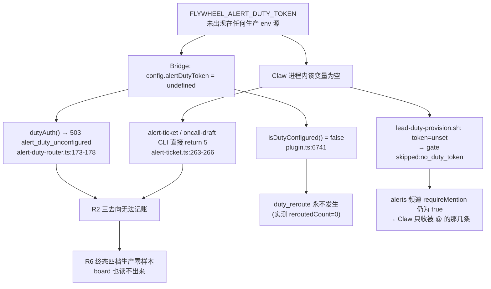
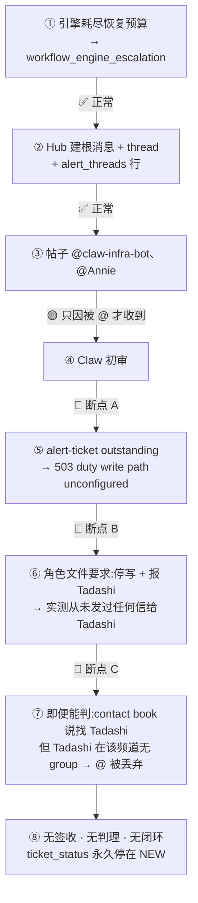

# FLY-2073 Alerts 值守机制 — PRD 2060 逐条对账

Issue: FLY-2719 (https://linear.app/geoforge3d/issue/FLY-2719)
日期: 2026-09-18
基于: `product/doc/FLY-2060-alerts-duty/prd.md` v3;生产账本 `~/.flywheel/teamlead.db`、`~/.flywheel/comm/flywheel/comm.db`;实测于 2026-09-18 03:45Z–04:15Z

---

## 0. 一句话

**机制的代码全在,电没通。** 四个子单(2075/2076/2077/2386)交付的代码、角色合同、
两本册子都在仓库里并已 merge 到 main;但生产环境缺一个环境变量
`FLYWHEEL_ALERT_DUTY_TOKEN`,它是 duty 写路径的唯一凭据。缺它 ⇒ Claw 的**第一条启动命令
就报错**,ack / handoff / resolve / board 全部 503,频道准入门跳过,两本册子的回填闭环无法触发。

PRD §1.3 当时的实测是「497 条工单,`acked_at` 有值的 0 条」。**今天重新查:928 条,仍然 0 条。**
再加上 FLY-2386 新开的信箱车道:duty 车道 476 条,`acked_at` 有值的也是 **0 条**。

> ⇒ founder 说「2073 标 Done 说明根本没做成功」是**准确的**。
> 更精确的说法是:**建成了,但从未通电,所以从未运行过一次。**

---

## 1. 根因:一个环境变量



### 1.1 证据(生产实测)

| 探针 | 结果 |
|---|---|
| `grep FLYWHEEL_ALERT_DUTY_TOKEN ~/.flywheel/.env` | **0 命中** |
| `grep … ~/.flywheel/env-claude-infra-bot.env`(Claw 专属 wrapper env) | **0 命中**(该文件只有 1 个键) |
| `~/.flywheel/manifests/flywheel-claude-infra-bot-lead.json` 的 `launchEnvironment` | 无该键 |
| `node packages/teamlead/dist/alert-duty-seat-cli.js --lead-id claude-infra-bot-lead --project flywheel`(已 source 生产 `.env`) | `{"isDutySeat":true,"alertChannelId":"1518793447165661254","dispatcherBotUserId":"1524831623164596265","dutyWritePath":"unconfigured","ledgerWriteErrors":0,"reroutedCount":0}` |
| `flywheel-comm alert-ticket outstanding --json --limit 5` | `alert-ticket: duty write path unconfigured on Bridge (FLYWHEEL_ALERT_DUTY_TOKEN)` |
| `flywheel-comm alert-ticket board --json` | 同上 |
| `flywheel-comm oncall-draft list` | `owed=- pending=0 landed=0` |
| `flag_values` 表 `alert_system` | `true`(告警管道本身是 ON 的,不是被热开关关掉) |

### 1.2 代码位置

- `packages/teamlead/src/bridge/plugin.ts:6741` — `isDutyConfigured: () => Boolean(config.alertDutyToken)`
- `packages/teamlead/src/bridge/alert-duty-router.ts:173-178` — 无 token ⇒ `503 alert_duty_unconfigured`
- `packages/teamlead/src/bridge/alert-duty-router.ts:426` — `dutyWritePath: "configured"` 只在有 token 时返回
- `packages/flywheel-comm/src/commands/alert-ticket.ts:36-37, 259, 263-266` — CLI 侧同一凭据,缺失即 `return 5`
- `packages/teamlead/scripts/claude-lead.sh:3302-3305` — 启动时 source `lead-duty-provision.sh`(接线是对的)
- `packages/teamlead/scripts/lead-duty-provision.sh:70, 77-79` — `token_status != set` ⇒ `skipped:no_duty_token`,**直接 return,不再跑频道准入门**
- `packages/teamlead/scripts/lead-body.sh:183-186` — 设计意图是「`.env` 是舰队级来源,除 Claw 外全部擦除」;**但 `.env` 里本来就没有这个值**

> **这不是代码 bug,是部署缺口。** 每一段代码都按设计 fail-closed 了,而且喊得很响——
> 只是没有人在听(见 §5 G7)。

---

## 2. PRD 需求逐条对账

| # | 需求 | 判定 | 证据 |
|---|---|---|---|
| **R1** | 值守席位唯一 = Claw,对**整条队列**负责,写进角色文件 | **部分** | 角色文件已写死(`.lead/claude-infra-bot-lead/identity.md:9-13`「唯一常设值守席位」「Cass 完全退出值守」)。信箱车道确实全量投给它(近 24h 163 封 `infra_alert`)。**但 Discord 侧仍是逐条点名制**:`~/.claude/channels/discord-claude-infra-bot-lead/access.json` 的 alerts 频道组仍是 `{"requireMention": true, "allowFrom": []}`(文件 mtime 2026-09-07) |
| **R2** | 初审三去向,没有第四种,不许什么都不做 | **未做(不可执行)** | 三去向的记账动作 `ack`/`handoff --reason contact_book`/`handoff --reason no_entry` 全部经 `alert-ticket` CLI → Bridge `/duty`,生产实测 503。账本上:`alert_threads` 928 行 **acked=0**;`alert_mailbox_ledger` duty 车道 476 行 **acked=0**。**一次都没发生过** |
| **R3** | contact book 存在、查不到兜底 @Tadashi、兜底后必须回填 | **部分** | 册子在 `doc/oncall/contact-book.md`,99 类,格式合规。近 7 天实际触发的 14 个 kind 里 **12 个在册**。**缺 2 个**:`orphan_pane`、`ship_judgment_observation_unavailable` ⇒「新类别上线前必须在册」这条**没有闸门**。**回填链路整条不可达**:`oncall-draft` 用同一个 token,`owed=-`(读不出来)、`pending=0`、`landed=0` |
| **R4** | on-call runbook,解决后立刻写,读者是 Infra bot | **近乎未做** | `doc/oncall/runbooks/` 只有 `_template.md` + 3 篇底稿(`bridge_abnormal_exit` / `cmux_cleanup` / `mailbox_dead_letter`)。**这 3 篇覆盖近 7 天 duty 车道实际触发的 13 个 kind 中的 0 个。** `git log -- doc/oncall/` 只有 2 次提交,都是当初的交付提交(2026-08-27 FLY-2077、2026-09-07 FLY-2386),**11 天零增长** |
| **R5** | 被 @ 的 Lead 进 thread 接手并主动同步进展 | **未做** | 前置条件(被 @ 必达)不成立,见 R7。账本里没有任何 handoff 记录可供追踪(`handoff_reason` 全空,除自动盖的 `direct_owner`/`duty_fallback`) |
| **R6** | 每件事必须有明确结论;「没解决」是合法可见终态 | **未做(不可观测)** | FLY-2386 定义的四档 `unreviewed / in_duty / handed_off / resolved_in_window` 在生产**零样本**:`alert_threads` 自 2026-08-27 起 427 行全是 `NEW`;duty 信箱 476 行全是 `NEW`。唯一能看四档的入口 `alert-ticket board` 也需要同一 token ⇒ **现在没有任何人、任何角色能看到「未解决清单」** |
| **R7** | 所有 Lead 可被 @ 到,不被 @ 不用管,被 @ 必达 | **未做(原单 FLY-2078 已取消)** | 扫全部 19 份 `~/.claude/channels/discord-*/access.json`:**只有 Claw 一家在 alerts 频道 `1518793447165661254` 有 group**,其余 18 个(含 Tadashi `flywheel-eng-lead`)`groups` 里**根本没有这个频道**。按 gate 语义「无 group → drop」,在 alerts 频道 @ 任何一个 Lead 都会被静默丢弃 |
| **R8** | 问为什么会发生;是代码问题就开单 | **未做** | 没有任何生产实例走完过主线,根因线自然无从触发。仓库里没有由值守产生的根因单 |

### §8.3「什么算做完」八条

| # | 判据 | 结论 |
|---|---|---|
| 1 | 有明确值守席位,对整条队列负责 | 🟡 席位有、合同有;Discord 侧仍是点名制 |
| 2 | 每条告警都落到一个明确去向 | 🔴 0 条落到过任何去向 |
| 3 | 两本册子真实存在**并且在长** | 🟡 存在;**11 天没长过**;回填链路不可达 |
| 4 | runbook 条目是通用处置,不写死本机 | 🟢 现有 3 篇全查:`/Users/`、`xiaorongli`、`MacBook-Pro` 字面量命中数各为 **0** |
| 5 | 被 @ 的人接手后 thread 里看得到进展 | 🔴 @ 送不到 |
| 6 | 每件事有明确结论 | 🔴 零终态样本,且无人能查 |
| 7 | Lead 不被 @ 收不到、被 @ 必达 | 🔴 前半成立(收不到),后半不成立 |
| 8 | 判定为代码问题的有单去修 | 🔴 未触发 |

**8 条里 1 条绿、2 条黄、5 条红。**

---

## 3. 子单交付物现状

| 子单 | 交付物 | 仍在生效? | 说明 |
|---|---|---|---|
| **FLY-2075** 恢复告警 Hub 主链 | 双路由:普通告警只写 durable mailbox;仅显式 mention / 可注入 founder id 的 `workflow_engine_escalation` 走 Hub 建 thread + `alert_threads` | ✅ **生效** | 账本实测吻合:自 2026-09-07 起 `alert_threads` **只有** `workflow_engine_escalation`(259 行);普通告警全在 `alert_mailbox_ledger` |
| **FLY-2076** Claw 全队列值守 + 热开关 | 角色合同三去向、duty API/CLI、`alert_system` store-managed flag | 🟡 **半生效** | 角色文件 ✅ 在 `main`;`alert_system=true` ✅;**duty API/CLI 在生产不可用**(无 token);频道准入门从未执行 |
| **FLY-2077** 两本册子入册系统 | `doc/oncall/README.md` + `contact-book.md`(99 类)+ `_template.md` + 3 篇底稿 | 🟡 **半生效** | 文件在、格式合规;**没有在长**(11 天零提交);「新类别上线前在册」无闸门 |
| **FLY-2078** R7 被 @ 必达 | — | ❌ **已取消,零交付** | 见下方缺口分析 |
| **FLY-2386** 值守三件收口 | 两车道统一终态、路由分档、`oncall-draft`/`alert-ticket` 回填闭环、统一 board | 🟡 **代码在,生产不可达** | 表结构 `alert_mailbox_ledger` ✅ 已建并在写;**四档终态零样本、board 503、receipt 全零** |

### 3.1 FLY-2078 取消留下的缺口(founder 专门问的)

FLY-2078 原范围 = PRD **R7**(被 @ 必达)+ **R5**(接手后同步进展)的前置条件。
落地手段本来是把核心房那套 mention gate(FLY-898 `apply-core-room-mention-gate.sh`)
扩到 alerts 频道 —— 见 `engineering/doc/FLY-2076-claw-duty-seat/plan.md:23`
「P2 FLY-2078 R7:被 @ 的 Lead 必达 | 未开 | ②/③ 只留痕不必达」。

取消后留下的实测缺口:

1. **18 个 Lead 在 alerts 频道零 group** —— 包括 contact book 里 ~90% 行指向的 Tadashi。
   ⇒ R2 去向 ②(@ 负责人)和 ③(兜底 @Tadashi)**即使能记账,Discord 那一半也是空投**。
2. **R5 整条落空** —— 没有人会进 thread,自然谈不上「主动同步进展」。
3. **PRD §8.1 第 5、8 号问题原样保留** —— 「接手之后没有可见的进展同步」「Lead 要么全看要么看不到」。

> FLY-2076 的计划里把这写成了**显式依赖**:在 2078 落地前,②/③「只是留痕,不是必达」。
> 现在连留痕也做不到(无 token),所以是**两层都空**。

---

## 4. Claw InfraBot 到底有没有在上岗

### 4.1 进程:在跑,形态是「私有前台 tmux server」

| 观察 | 值 |
|---|---|
| launchd | `com.flywheel.lead.flywheel-claude-infra-bot-lead` → pid **2313**,exit code 0 |
| tmux server | pid 2313,`tmux -D -S ~/.flywheel/sock/fw-flywheel-claude-infr-a64677d0f712ca3b.sock` |
| lead-body | pid 2621,`lead-body.sh ~/.flywheel/manifests/flywheel-claude-infra-bot-lead.json` |
| Claude 子进程 | pid **25960**,`--agent claude-infra-bot-lead --model claude-sonnet-5 --effort high`,12:02 起 |
| 启动日志 | `[wrapper-v2] 12:01:49 Starting flywheel/claude-infra-bot-lead as a private foreground tmux server` |
| Bridge liveness | `w2_delivery_loop` 里 `claude-infra-bot-lead` = `fresh` |

**⇒ 它是活的,不是挂了。**

### 4.2 cmux 看不到它 —— 但这不是 Claw 独有的

需要纠正问题里的前提:

- `~/.flywheel/sock/` 下有 **13 个** per-lead 私有 socket,**每一个 Claude Lead 都是同一形态**
  (Tadashi、Cass、Honey Lemon、Belle、Rafiki… 全部)。
- 默认 tmux server(`tmux ls`)里**一个 Lead 都没有**,只有 runner 的 `cmux-FLY-*` session
  和 `flywheel` / `runner-flywheel`。
- `/tmp/flywheel-cmux-sync.log` 末尾持续输出 `[trigger_cmux_refresh] no lead refs to refresh (rc=0)`
  ⇒ **cmux 侧注册了 0 个 lead ref。**
- 代码里存在把隔离 socket 接进 cmux 的通路(`FLYWHEEL_CMUX_VIEW_HELPER_BIN` /
  `build_attach_command`,见 `scripts/test-cmux-sync.sh:3079-3120`),所以这是**注册缺口,不是能力缺口**。

> ⚠️ 我**没有验证** FLY-2643 的原文(该 issue 在 Linear,本机仓库零引用,Linear MCP 本次
> 会话 401 连不上)。所以我不写「与 FLY-2643 冲突」,只写实测事实:
> **所有 Claude Lead 在 cmux 里都不可见,Claw 不是特例。**
> 这一条属于 Lead 部署形态议题,PRD 2060 §5 明确不覆盖它。

### 4.3 最近 24h 它处理了什么

| 观察 | 数字 |
|---|---|
| 投到 Claw 信箱的 `infra_alert`(近 24h) | **163 封**,全部 `state=ACKED` |
| 投到 Claw 的 `discord_chat`(近 24h) | 49 封 |
| Claw 发出的信(全期) | **812 封,收件人只有 `bridge`**(投递回执),**从未给任何 Lead 发过信** |
| duty 账本上 Claw 的处置动作 | **0**(ack 0 / handoff 0 / resolve 0) |
| 对 `workflow_engine_escalation` 的初审 | **0 次**(533 条历史工单,acked=0;自 09-07 的 259 条,acked=0) |

> **重要口径区分**:`mailbox.state=ACKED` 是**投递层的「已送达/已读」**,不是 PRD 的「签收」。
> 另外 `alert_mailbox_ledger` 里有 103 行 `acked_at` 非空,**全部是插入时自动盖的**
> (`StateStore.ts:19519-19556`:`route_class` 为 `direct_owner` 或 `duty_fallback` 时
> 直接写 `acked_at = datetime('now')`、`ticket_status='ESCALATED'`)。
> 这些是**绕过值守直投 Lead** 的行,**不是任何人签收的证据**。
> 真正的值守车道(`route_class='duty'`,476 行)**acked 恒为 0**。

**⇒ Claw 在读,但一次也没能「落账」。它的工作不留任何痕迹。**

---

## 5. 今天 03:11Z 那一条:按 PRD 应该发生什么 / 实际断在哪

### 5.1 事实

今天(2026-09-18)`alert_threads` 共进 11 条,**全部是 `workflow_engine_escalation`**:

```
02:56:45  unlaunched_rollback:dabc18e4…:implement
02:56:48  unlaunched_rollback:666701c5…:implement
03:11:08  retry_limit:3f9a62c4…:implement:1:4:1   ← founder 看到的这条
03:11:09  retry_limit:a6ed8551…:implement:1:4:1
03:11:11  retry_limit:b4b09ab2…:implement:1:4:1
03:11:13  retry_limit:dc0c18ed…:implement:1:4:1
03:11:45  retry_limit:005878fc…:implement:1:4:1
03:12:32  reown-exhausted:62c160f4…
03:12:33  land_partial:986c9c22…:land
03:23:19  reown-exhausted:36d4718f…
03:34:37  land_partial:070bd942…:land
```

03:11:08 那条完整行:

| 字段 | 值 |
|---|---|
| `event_id` | `retry_limit:3f9a62c4-7986-4429-a5e3-82f42aefe5a9:implement:1:4:1` |
| `lead_id` | `flywheel-eng-lead` |
| `owner_ref` | `infra_bot:claude` |
| `ticket_status` | **`NEW`** |
| `thread_id` / `root_message_id` | `1550343390472970255` |
| `channel_id` | `1518793447165661254`(#flywheel-alerts) |
| `acked_at` / `resolved_at` / `handoff_reason` | **全空** |
| `attempt_count` | 0 |

事件本身 = 工作流引擎 dead-exec 恢复预算耗尽(`[workflow-engine] workflow engine dead-exec
recovery held for …: retry_limit_exceeded`,`packages/teamlead/src/LeadAlertNotifier.ts:117-121`)。
这类日量稳定在 ~11–49/天(近 14 天),**累计 259 条自 09-07 起,acked 全 0**。

### 5.2 逐环拆解



**按 PRD 应该发生的**:Claw 初审 → 查 contact book 命中 `workflow_engine_escalation → Tadashi`
→ 走去向 ②,在 thread 里发 🧭 留痕并 `alert-ticket handoff --to flywheel-eng-lead --reason contact_book`
→ Tadashi 收到 @ 进 thread 接手并同步进展 → 解决/未解决都有明确终态。

**实际断点(按发生顺序)**:

| 断点 | 位置 | 后果 |
|---|---|---|
| **A** | duty 写路径无凭据 | 三去向一个都记不下来;Claw 的第一条启动命令就失败 |
| **B** | 失败没有上报 | 角色文件第 58 行要求「停止 duty 写并把配置缺口报给 Tadashi」,**实测 Claw 全期只给 `bridge` 发过信**。⇒ 这是一个**静默失败**:系统 fail-closed 了,但没人知道 |
| **C** | Tadashi 在 alerts 频道无 group | 即使 A、B 都修好,去向 ②/③ 的 Discord 那一半仍然空投(FLY-2078 取消的那部分) |

> **补充一条口径**:帖子 @Annie 不是 PRD 设计的升级动作。按 FLY-2075 的双路由合同,
> **「能注入合法 canonical founder id」本身就是 `workflow_engine_escalation` 进 Hub 的准入条件**。
> 所以 @Annie 是**通道的前提**,不是「值守判定需要 founder 介入」的结果。
> 在当前状态下,**founder 是这条链上唯一实际收得到消息的人** —— 这正是 PRD §1 要消除的那个形状。

---

## 6. 缺口清单

| ID | 缺什么 | PRD 条目 | 建议归属 | 大小 | 备注 |
|---|---|---|---|---|---|
| **G1** | 生产 `FLYWHEEL_ALERT_DUTY_TOKEN` 未配置 —— duty 写路径全线 503 | R1 R2 R3 R4 R6 | **新单(最高优先)** | **XS**(配置)+ **S**(启动断言) | 单点。修它之前,下面 G2/G6 自动不成立 |
| **G2** | Claw 在 alerts 频道 `requireMention: true`,Discord 侧仍是逐条点名制 | R1 R7 | 随 G1(门被 token 挡住) | **XS** | 但需独立断言:不能只靠「token 有了门就会跑」 |
| **G3** | 18 个 Lead(含 Tadashi)在 alerts 频道零 group ⇒ 被 @ 必达不成立;R5 整条落空 | **R5 R7** | **重开 FLY-2078 或新单** | **M** | 这是 2078 取消留下的**主要缺口** |
| **G4** | runbook 只有 3 篇,覆盖近 7 天 13 个活跃 kind 的 **0** 个;11 天零增长 | R4 §8.3(3) | **新单** | **M**(且是持续性工作) | 「解决后立刻写」在零次解决的前提下无从发生;G1 修好后才有增量来源 |
| **G5** | 「新类别上线前必须在册」没有闸门 —— 实测 2 个活跃 kind 不在册(`orphan_pane`、`ship_judgment_observation_unavailable`) | R3 | **新单** | **S** | 建议做成 CI 检查:告警 kind 联合 ↔ contact book 表行的双向差集 |
| **G6** | 没有任何角色能看到「未解决清单」(`board` 同样需要 token);四档终态生产零样本 | R6 | 随 G1 | **XS** | founder 「不定期查看未解决 thread」这条现在无入口 |
| **G7** | 值守的失败是**静默**的 —— Claw 未按角色文件第 58 行上报配置缺口 | R2 R1 | **新单** | **S** | 建议:duty 座位启动自检失败 ⇒ 由 Bridge 直接发一条 meta-alert,不依赖 Claw 自己开口 |
| **G8** | `workflow_engine_escalation` 只走 thread 车道、不进 Claw 的 durable mailbox ⇒ 对它的可见性 100% 依赖 Discord mention + 频道门 | R1 R2 | **新单** | **S** | 与 G2 同源但不同修法:是否该让升级类也落 mailbox,是个产品决定 |
| **G9** | 直投 Lead 的行在**插入时自动盖 `acked_at`**,与「值守签收」同名不同义 | R6 / 账本口径 | **新单** | **XS** | 会污染未来任何「签收率」读数;建议拆成两列或加 `ack_source` |
| **G10** | 所有 Claude Lead 在 cmux 零 ref(不止 Claw) | **不属 2060**(§5 边界外) | **归 FLY-2643 族** | **S** | 能力已存在(view helper),缺的是注册 |

### 建议的最小启动顺序

1. **G1**(配 token + 重起 Claw)—— 一次配置动作让 G2/G6 一起活过来,并让 G4 开始有增量来源。
2. **G7**(让静默失败变响)—— 防止同一形状再悄悄躺 11 天。
3. **G3**(重开 2078)—— 没有它,②/③ 永远只是留痕。
4. **G5 / G9 / G8** —— 小修,可并行。

---

## 7. 我没有验证到的(摊开说)

1. **Discord 频道历史我读不到。** 本机 `teamlead.db` 的 `messages` 表是空的,CommDB 里只有信箱。
   所以「Claw 有没有在 thread 里发过 🧭 留痕」**我未验证**。
   但这不影响结论:即使它发过帖,`ack`/`handoff`/`resolve` 都会 503,**R2 的记账、R6 的终态
   仍然不可能完成**;而角色文件第 5 步写死「先发帖再记账,记账 = 完成」。
2. **FLY-2643 的原文我没读到。** 该 issue 在 Linear,本机仓库零引用,本次会话 Linear MCP
   返回 401。所以我只陈述实测形态(所有 Claude Lead 都在私有 socket、cmux 零 ref),
   **不断言「与 FLY-2643 冲突」**。
3. **子单的 Linear 状态我没核。** 我核的是**仓库里的交付物和生产账本**,不是 issue 的
   Done/Canceled 标记。FLY-2078「已取消」这一条我取自
   `engineering/doc/FLY-2386-alerts-closure-trio/exploration.md:63`(「FLY-2078(R7 原单)已 Canceled,
   仓库里零引用」),并用 `git log --all --grep` + 目录扫描独立复核了「零交付」。
4. **`FLYWHEEL_ALERT_DUTY_TOKEN` 是「从未配置过」还是「配过后被移除」,我没有诊断。**
   我只能证当下四个 env 源都没有它。`~/.flywheel/.env.bak-*` 里有 30+ 个历史快照可供追溯,本次未做。
5. **`dispatcherBotUserId` 已在 Claw 的 `allowBots` 里**(`1524831623164596265`),说明 access.json
   曾被某条路径写过 allowBots 但没写 `requireMention=false`。**这个不一致我没有追根**——
   可能是历史手工配置,也可能是 gate 的部分执行。
6. **我全程只读。** 没有改任何生产配置、没有动任何 Lead 进程、没有发任何 Discord 消息、
   没有对 duty API 做过任何写调用。
