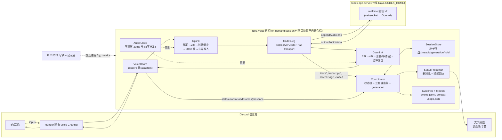

# FLY-2074 Raya 实时语音流水线正经重写 — 实施计划
Issue: FLY-2074 (https://linear.app/geoforge3d/issue/FLY-2074/raya语音通道-实时语音流水线按-prd-正经重写常开连接音频流断流重连语义原型权宜不带-自-fly-2029-拆出)
日期: 2026-08-27
基于: research.md

**Status**: **QA implement@5 rework 已实现,等待 fresh exact-head review**。Raya `b782260ffd3a74a3fd233d246e41a9723c1d88f7` 已通过 lint/build/typecheck 与 183 tests;此前 `9487b19` / 174 tests / exact-head APPROVED 已过期,不得再作 ship 证据。六轮 Discord E2E 的用户可见成功率是 **1/6**,3 轮硬超时;完整证据见 `evidence/discord-rounds.json` 与 r1–r6 JSONL。kickstart zero-exit/no-launch 三态语义与披露 guard 已闭合;新的 reviewVerdict 以提交后冻结 head 的外部 gate record 为准。§14 是最新批准合同;与 §§0–13 冲突处以 §14 为准。
**实现落点**: Raya 独立仓(FLY-2029 建)内的语音管线模块;本 flywheel 仓只放设计文档与 founder HTML。
**本节点交付**:C0 协议探针 + C0.5 复审后的 Raya `apps/voice` 实现、验证、PR;exploration / research / plan / founder HTML 随事实持续更新。

---

## 0. 目标、非目标、假设、授权

### 0.1 目标(验收方向,数值故意不填 —— B §8.2)

| # | 她要的 | 本单要交出的能力 |
|---|---|---|
| G1 | 她请求进入语音模式后它才出现 | `#raya` 受权文字触发 → launchd kickstart → bot 连接唯一现有 Voice Channel;平常 voice 进程与 bot 都不在房 |
| G2 | 她长时间安静链路不断 | 上下行 20ms 常开流;C0 P6 先证 v2 同会话 ≥30 分钟,实现后再用 **v2 + Discord 半小时静默**实测(P-6c′) |
| G3 | 她说话它听清、它说话她不卡 | 上行帧账本不变量(每个 tick 有 append 或带原因的 drop);`player.missedFrames` gauge 与 Idle 次数为尺子 |
| G4 | 断了要说一句,而且会回来 | 三腿失效检测 + 文字频道「断线一行」(带投递回执)+ **按 §0.4 授权版本恢复** |
| G5 | 同一次语音模式内连续对话有上下文;结束后再开不冒充记得 | **P2 已证 `thread/resume` 无 rollout**:最后授权人离房过 grace 或文字命令结束语音模式后 exit0;下一次 trigger 是 fresh start,恢复/重启行必须写「记得:否」 |
| G6 | 它慢可以,但她要知道它在干活 | 等待音 B 叠帧混音(keyed busy);状态行跟着对话流 |
| G7 | 试用期能查到「实际 context 用量」 | **P5 已证真实 backend Codex turn 会产生 `thread/tokenUsage/updated`**,现有 `parseContextUsage` 可直接写实际值。纯 realtime 音频回复没有 backend turn,不产生 context 用量、也不写 unavailable；只有已观察到 backend `turn/completed`、经有界 settle 仍无可解析 usage 时,才落精确 `metrics_unavailable` evidence,绝不造数 |

### 0.2 非目标(各归其单)

它说什么 / 身份载荷 / 议题内容 / 二次进房回灌摘要的内容(2030)· 念读筛选、转达 Lead、用嘴批 ship、micGate 的触发方式(2031)· 多 Lead 同房 / 会议产物(2032/2033)· v3 传输实现(FLY-2021 解了再做)· **打断**(§6 D6)· 存活信号的间隔与内容(等她用起来)· 权限/审批策略内容(2029;管线只透传)。

### 0.3 落点事实(FLY-2029 骨架 2026-08-26 已落地 —— Lead 指令 `8f544a54`;C0 探针在 `~/.flywheel/raya/code` **HEAD `daf35d9`** 上运行,contracts last-touch = `b8ee5f6`;当前 foundation 随后仅前进 brain preflight 测试,contracts 未变。下列接口已逐项重核;实施生产代码前仍按当时 foundation HEAD 再对一次)

| # | 事实 | 出处 |
|---|---|---|
| F1 | Raya 仓 = `xrliAnnie/raya`,本地 `~/.flywheel/raya/code`;**Node ≥ 22 · TS ESM · pnpm@10.13.1 workspace · Vitest 3.2.7 · Biome 2.1.4** | 仓根 `package.json` |
| F2 | 布局 `apps/brain` + `packages/contracts`;**语音管线落 `apps/voice`,独立进程、独立 launchd job**;可执行入口 **`apps/voice/dist/cli.js run`** | README「Voice integration seam」;`scripts/install-launchd.mjs` 的 voice job 块(`b8ee5f6` 约 41-44 行;行号会漂,以 label `com.xrli.raya.voice` 定位) |
| F3 | **`@raya/contracts` 是共享合同,消费不重定义**:`RAYA_VOICE_ENTRYPOINT`(= `apps/voice/dist/cli.js`)/ `RAYA_VOICE_REQUIRED_ENV_KEYS`(**14 个**,含按需授权边界 `RAYA_DISCORD_TEXT_CHANNEL_ID` / `RAYA_FOUNDER_DISCORD_USER_ID`)/ `RAYA_VOICE_OPTIONAL_ENV_KEYS`(**3 个**)/ `RAYA_METRICS_PATHS` / `isRayaVoiceProcessCommand` / `buildInitializeParams` / `buildThreadStartParams` / `buildThreadResumeParams` / `assertSessionOnlyCodexConfig` / `assertThreadReceipt` / `parseContextUsage` | `packages/contracts/src/{integration-contract,codex-session,metrics}.ts` |
| F3′ | **launchd plist 的 `EnvironmentVariables` 只有 `RAYA_ENV_FILE`**,不展开文件内容;brain 靠 `loadRuntimeEnv()`(定义在 `apps/brain/src/env.ts`,由 `cli.ts` 消费/再导出)读文件后 `{...fromFile, ...processEnv}` 合并。brain 的 preflight 给 Codex 子进程的 env 是**allowlist**(`CODEX_HOME/HOME/PATH/SHELL/TMPDIR`);brain 的 `parseConfig` 做绝对路径 / 存在性 / cwd-in-root / 敏感目录不重叠校验;brain 的 pidfile 有 claim(拒活 pid、替死 pid)/ release(只删自己的字节)语义 | `apps/brain/src/cli.ts`、`apps/brain/src/launchd.ts`、brain preflight/parseConfig(Codex R6 核) |
| F4 | 大脑是 Codex:`RAYA_MODEL=gpt-5.6-sol`、`RAYA_REASONING_EFFORT=xhigh`、`RAYA_CONTEXT_WINDOW=1_050_000` **只在会话参数里给**;`assertSessionOnlyCodexConfig` 扫 `config.toml` **全部行(任意 section,含引号 key)**,出现 `model` / `model_context_window` / `model_reasoning_effort` 即抛;**管线不假设 Claude 大脑** | `codex-session.ts` @ `b8ee5f6` |
| F4′ | **`RAYA_IDENTITY_FILE` 必须在每个 writable workspace root 之外**(session 不能改写自己的 constitution)—— brain `parseConfig` 把它列进 canonical sensitive paths;**`RAYA_MEMORY_FILE` 刻意可写**(独立版本化的 memory 仓),⛔ 不要误加进敏感集合 | README:24-27;`apps/brain/src/config.ts:111-138` |
| F5 | codex 二进制与家目录由 `RAYA_CODEX_BIN` / `RAYA_CODEX_HOME` 钉;voice 与 brain **共享这个 ChatGPT-subscription home**。单独 `RAYA_VOICE_CODEX_HOME` 已评估并延后:空 home + voice key 能开 realtime,但 delegated `/v1/responses` 会 401,除非 `codex login --with-api-key`(会改 carrier/ledger)。秘密只在 operator 提供的 `RAYA_ENV_FILE`(不得有 group/other 权限),不进仓。brain Codex child 不收 voice key;voice Codex child 只额外收 `OPENAI_API_KEY=RAYA_OPENAI_API_KEY`,绝不收 bot/Discord secret | P5 separate-home probes;Lead question `1f7d2be9` |
| F6 | 当前 voice plist 的 **`KeepAlive.Crashed=true` 不足以覆盖本单计划的普通非零退出**,这是 C0.5 HIGH。实现时只把 voice job 改为 **`KeepAlive={SuccessfulExit:false}` + `ThrottleInterval=60`**;brain job 保持原样。voice `exit 0`=有意不拉起(启动配置/auth 错误);运行中断流 `exit 1`=请 launchd 拉起;不承诺秒数。大脑侧 `VoiceDownTracker` 按 `run/voice.pid` + `ps command` 身份采样,只有命令同时匹配 `RAYA_VOICE_ENTRYPOINT` 与 `run` 才算 alive,连续 3 次 miss 才发 `voice_down` | C0.5 review `launchd-crashed-only-wont-restart-clean-exit`;R3 review `stale-pid-reuse-silently-parks-voice-and-fakes-alive`;Lead 指令 `1e6233c5` |
| F7 | **C0 新事实**:当前隔离 `RAYA_CODEX_HOME` 为 `auth_mode=chatgpt`,且 child env 不带 `OPENAI_API_KEY`;0.149.1 与 PoC 0.148.0 都在 `thread/realtime/start` 返回 `realtime conversation requires API key auth`。旧 v2 阳性证据中,有该字段的八场全部 `openaiApiKeyPresent=true`,没有 v2 no-key 阳性对照 | research §7;Raya `probes/evidence/P2-*` |
| F8 | **Lead C0.5 裁定**:brain 保持 ChatGPT-subscription carrier;本单向 `@raya/contracts` additive 增加 `RAYA_OPENAI_API_KEY`,只由 `apps/voice` 映射成 child 的 `OPENAI_API_KEY`;已 provision 进 0600 `raya.env`;PR 明写合同变化 | question gate `34e3b58f-fd3b-4fa7-bdb9-332c3e6a0852` |
| F9 | **C0 P3/P4**:10 分钟内 appendAudio 27,898/27,898 回执,末 1,000 个 RTT median/p95=1ms,max=4ms;20/20 次 `account/rateLimits/read` 心跳成功;三次问答正常。usage 通知 0 次,两次 usage read 都全 null | research §7.5;Raya `probes/evidence/P3-P4-voice-key/` |
| F10 | **P5 修正 usage 结论**:纯 realtime 回复不产生 backend turn,所以 P3/P4 的 usage 全空是「不适用」而非 G7 缺口。强制委托 backend Codex 后出现 4 次 `thread/tokenUsage/updated`,payload 可由 `parseContextUsage` 消费;但 actual `modelContextWindow=828400` 与请求合同 `RAYA_CONTEXT_WINDOW=1_050_000` 不同,必须另落 `context_window_mismatch`,不得报成 1M 已验证。只有 backend turn 完成后仍无 usage 才写 exact unavailable evidence | Raya `probes/evidence/P5-busy/`;research §7.6 |
| F11 | **C0 P6**:同一 realtime session 跑满 1,800,000ms;82,316 audio writes/acks,0 error,0 outstanding,0 closed;voice heartbeat 60/60、同一共享 `RAYA_CODEX_HOME` 的 brain-like app-server check 60/60;首尾问答正确 | Raya `probes/evidence/P6-lifetime-concurrency/`;research §7.7 |

**授权边界已闭合**:8-20 禁令约束进程内 rejoin/restart loop;Lead 明确保留 launchd 基线拉起,但 P2 证实只能 fresh start,所以 founder-facing 合同是「断流后回来但不记得」。

### 0.4 🔴 授权记录 —— 「重连」这个词压着一条 founder 决定,本节先于一切技术设计

| 记录 | 出处 | 内容 |
|---|---|---|
| founder 决定 2026-08-20 | PRD B §9.1(`prd.md:2697-2705`)· PRD C(`prd.md:2667-2672`)· 1911 `decisions.md:1476` | **「否掉我们自己做掉线重连」—— ⛔ 不许写成待办,也不许写成候选方案**;理由按 §0.2c 未入库 |
| 决定的上下文(事实,不是理由) | 1911 `decisions.md:1420-1480` | 那一节在查 v3 33–35 秒硬切与「空闲超时」假说;同一节另一条决定是「不给 Codex 提 issue」 |
| 本单标题 2026-08-26 | FLY-2074 issue(Lead 拆单) | 「常开连接/音频流/**断流重连语义**」 |
| 是否有更晚的 founder 原话覆盖 8-20 决定 | 我在 PRD A/B/C、1911、FLY-1451/2029/2074 的 description 与 comment 里**零命中** | ⇒ **未找到覆盖依据** |
| 已问 Lead | flywheel-comm 问题 `81ff8d86`(2026-08-26,非阻塞) | ① 标题里「断流重连」是 founder 原话还是拆单措辞;② 若是原话给日期/出处 |
| **Lead 裁定 2026-08-26**(问题 `81ff8d86` 回复,原文摘录) | flywheel-comm | ① 「断流重连语义」是 **Lead 拆单时的措辞,不是 founder 原话**;**不存在** founder 对进程内重连的授权;**8-20 决定继续有效**;Lead 将把 FLY-2074 标题改为「断流语义」。② 按保守版实现:检测 + 文字频道一行 + 持久化 threadId + 非 0 退出;2029 外层守护(launchd)重启进程,`thread/resume` 恢复记忆;⛔ 进程内 rejoin / 重起会话的自愈循环不做。③ 记入本节:**「进程内重连已被 founder 2026-08-20 否决(PRD B §9.1 / PRD C / 1911 decisions.md:1476);外层守护重启 + resume 不是进程内重连,作为基线进程模型处理,并在 founder HTML 里标为【假设】供她划掉」**。⛔ 不要自行拿掉「回来」,要把它作为假设摆出来。 |
| **P2 实测后的 Lead 修正**(问题 `e5f3815f`,指令 `1e6233c5`) | flywheel-comm | Evidence wins:`thread/resume` 因 no rollout 不可用。外层拉起后必须 `thread/start(fresh)` + `realtime/start`;恢复行固定「记得:否」。仍做「回来」,但 PR 与 founder HTML 必须直说 **「断流后回来但不记得」**。 |

**⇒ 本计划按【保守版】写(Lead 已裁定)**:

```
断流语义(做)   三条腿的失效【检测】+ 文字频道【断线一行】(带投递回执)+ 持久化 threadId + 非 0 退出
恢复(不由本进程做)  voice 专属 launchd KeepAlive.SuccessfulExit=false(按 ThrottleInterval 节流)重启本进程 → Booting → 进房 → thread/start(fresh) → realtime/start
                    ⇒ 她的体感:「断了它说了一句,过一会儿自己回来了,但上一段没记住」—— P2 实测 resume 无 rollout;靠【进程重启】回来,不是进程内重连;⛔ 不承诺秒数
⛔ 不做              进程内 rejoin()/同 thread 重起会话/重起 codex 子进程 的任何自愈循环
```

⚠️ 两个诚实边界:① 「外层守护重启 + fresh start 带回来」是 Lead 明确采用的**基线进程模型**,不算进程内重连;但 P2 已证明它**不会保留上一段记忆**,因此所有恢复文案固定写「记得:否」。② 本版**不预写**任何进程内重连的表(那正是她禁止的「候选方案」)。

---

## 1. 架构总览



**一句话(§14 前的旧基线,已被 founder 2026-08-27 覆盖)**:原方案是一个常驻进程;新方案只在一次 on-demand 语音模式内维持两条 20ms 常开流,最后授权人离房或文字 stop 后 clean exit,下一次 trigger fresh start 并诚实写「记得:否」。

---

## 2. 模块与接口(Raya 仓 `apps/voice/src/`;合同来自 `@raya/contracts`)

> 纪律:所有外部依赖(Discord、子进程、定时器、文件系统)通过接口注入,**核心逻辑不 import discord.js / child_process / fs**;状态机、节拍、混音、协调器全部在 vitest 里用假时钟测。合同(env key、metrics 行、session 参数)**只从 `@raya/contracts` import,不在本包重定义**(Lead 指令 `8f544a54`)。

### 2.1 `config.ts` —— 边界校验,fail-closed

```ts
import { RAYA_VOICE_REQUIRED_ENV_KEYS, RAYA_VOICE_OPTIONAL_ENV_KEYS, RAYA_METRICS_PATHS, assertSessionOnlyCodexConfig } from "@raya/contracts";
export interface VoiceConfig {
  env: Record<(typeof RAYA_VOICE_REQUIRED_ENV_KEYS)[number], string> & Partial<Record<(typeof RAYA_VOICE_OPTIONAL_ENV_KEYS)[number], string>>;
  //  必填(合同):RAYA_CODEX_BIN · RAYA_CODEX_HOME · RAYA_CODEX_CWD · RAYA_WORKSPACE_ROOTS_JSON · RAYA_IDENTITY_FILE · RAYA_MEMORY_FILE · RAYA_OPENAI_API_KEY
  //             RAYA_DISCORD_GUILD_ID · RAYA_DISCORD_VOICE_CHANNEL_ID · RAYA_FOUNDER_DISCORD_USER_ID · RAYA_BOT_TOKEN · RAYA_METRICS_DIR · RAYA_STATE_DIR
  //  可选(合同):RAYA_DISCORD_TEXT_CHANNEL_ID(缺 = 状态行只落 evidence,走 R7)· RAYA_SESSION_TRIGGER_USER_IDS_JSON(除 founder 外还算「真人」的用户)· RAYA_VOICE_QA_ALLOW_USER_IDS_JSON(受控 QA escape hatch)· RAYA_VOICE_OPTIONS_JSON(voice 运行参数)
  discord: { allowUserIds: string[] /* QA 注入,来自共享合同的可选 RAYA_VOICE_QA_ALLOW_USER_IDS_JSON */;
             player: { maxMissedFrames: number /* 默认 250 = 5s,flywheel FLY-967 同款 */; noSubscriber: "pause" | "play" } };
  realtime: { version: "v2"; voice: string /* 默认 marin */; startInstructionsFile?: string };
  lifecycle: { keepCodexAliveWhenEmpty: true /* P2 无 rollout,首版固定永不收 codex 进程 */; humanPresenceGraceMs: number };
  audio: { frameMs: 20; uplinkPrebufFrames: 3; uplinkMaxQueueFrames: 12; downlinkTargetFrames: 5;
           bed: { enabled: boolean; kind: "boxB"; minBusyMs: number } };
  recovery: { announceRetry: { times: number; gapMs: number }; fatalDrainMs: number;
              crashLoop: { window: number; maxRestarts: number } /* 由 SessionStore.restartHistory 判 */ };
  heartbeat: { everyMs: number; timeoutMs: number; missesToDown: number };
  paths: { metricsDir: string /* = RAYA_METRICS_DIR */; contextUsageFile: string /* metricsDir/RAYA_METRICS_PATHS.contextUsage */;
           pidFile: string /* metricsDir/RAYA_METRICS_PATHS.voicePid */; stateFile: string /* RAYA_STATE_DIR/voice-session.json */; evidenceDir: string /* RAYA_STATE_DIR/voice-evidence */ };
}
export function loadRuntimeEnv(processEnv: NodeJS.ProcessEnv, fsSeam): NodeJS.ProcessEnv; // ① RAYA_ENV_FILE【必填】:缺 ⇒ 抛;文件必须存在且 (mode & 0o077) === 0(0600/0400 等都可,拒绝任何 group/other 权限);解析 KEY=VALUE 后 {...fromFile, ...processEnv}(显式 process env 覆盖文件值)—— 与 brain `apps/brain/src/env.ts` 同形,但把权限谓词提升进 @raya/contracts 后由两边共同消费
export function loadConfig(env: NodeJS.ProcessEnv): VoiceConfig;   // ② 纯函数:合同 key 缺任一 ⇒ 抛;RAYA_STATE_DIR 对 voice 明确必填(brain 缺省时则由 RAYA_HOME 派生 `$RAYA_HOME/data/state`);路径校验同 brain parseConfig:绝对路径 / 存在 / RAYA_CODEX_CWD ⊂ 某个 writable root / 【重叠检查 = workspace roots 与 cwd 对每一个 canonical 敏感路径(env-file、RAYA_STATE_DIR、RAYA_METRICS_DIR、RAYA_CODEX_HOME、**RAYA_IDENTITY_FILE**)做双向 containment;`RAYA_MEMORY_FILE` 刻意不在敏感集合(F4′)】—— ⛔ 不是比父目录;启动时 assertSessionOnlyCodexConfig(RAYA_CODEX_HOME)
export function codexChildEnv(cfg: VoiceConfig, processEnv): CodexChildEnv;  // ③ voice 子进程 env 是【allowlist】:{ CODEX_HOME: RAYA_CODEX_HOME, OPENAI_API_KEY: RAYA_OPENAI_API_KEY, HOME, PATH, SHELL, TMPDIR } —— 类型上不可接收完整 runtime env;brain 的 child env 不变且不含 key
export const CODEX_ARGV = ["--enable","realtime_conversation","app-server","--strict-config"] as const; // ④ 固定 argv;--strict-config 让未知 config.toml 字段 fail-closed(brain preflight 同款,Codex R7-2)
```
- **C0.5 auth gate 已答**:Lead 选择 additive voice-only `RAYA_OPENAI_API_KEY`;不改共享 `RAYA_CODEX_HOME` 的 ChatGPT auth,不把 key 传给 brain。`RAYA_VOICE_CODEX_HOME` 已实测后延后:空 home + voice key 能起 realtime,但 delegated backend turn 401;API-key login 虽能过,却改变 carrier/ledger,不由本单决定。P6 用共享 home 双 app-server 跑满 30 分钟后才放行实施。
- `RAYA_LOG_DIR` 不在 voice 合同里,因为 voice 不自己选择日志路径:`scripts/install-launchd.mjs` 在渲染 brain/voice 两张 plist **之前**必经 brain `runtimeDirectoryPaths + parseConfig`,由那里 canonicalize `logDir` 并拒绝与 workspace/cwd 重叠;C1 给 installer 加一条「logDir 重叠时两张 plist 都不写」测试。voice 单独 `preflight` 不重复验证一个它不消费的 key。
- `run` 与 `preflight` **走同一个装配入口**(① → ② → ③ → ④);C1 测试:「进程环境只有 `RAYA_ENV_FILE` 也能启动」「显式 process env 覆盖文件值」「缺 `RAYA_ENV_FILE` / `RAYA_OPENAI_API_KEY` / voice 必填的 `RAYA_STATE_DIR` 拒起」「env-file 0600/0400 通过、0640/0604 拒起」「安全兄弟目录通过、真实重叠拒起(含 identity 文件落在 writable root 内这一负例;memory 文件在 root 内是正例)」「fake spawner 精确收到 `OPENAI_API_KEY=RAYA_OPENAI_API_KEY`,同时 child env 里没有 `RAYA_BOT_TOKEN` / `RAYA_ENV_FILE` / 任一 `RAYA_DISCORD_*`」「brain child env 继续不含 key」「run 与 preflight 的完整 argv逐项等于 `CODEX_ARGV`」。
- voice 运行旋钮(realtime / lifecycle / audio / recovery / heartbeat)走共享合同的可选 `RAYA_VOICE_OPTIONS_JSON`(JSON 字符串);默认值写在 config.ts 里并有注释。⛔ 任何绝对路径默认值。
- 秘密(`RAYA_BOT_TOKEN`)只存在于 operator 的 `RAYA_ENV_FILE`(无 group/other 权限)→ ① 读入进程 → 只给 Discord 客户端;⛔ 不进 Codex 子进程、不进 evidence、不进状态行;⛔ 不再引入 `TOKEN_ENV` 间接层(旧 D9 撤销:合同已定形状)。

### 2.2 `codex/AppServerClient.ts` —— JSON-RPC over stdio,带有界写入

```ts
export interface ProcessSpawner { spawn(bin: string, args: string[], env: Record<string,string>): ChildLike; }
export class AppServerClient {
  constructor(deps: { spawner: ProcessSpawner; env: CodexChildEnv /* allowlist 类型,不是 Record<string,string> */; log: Log; timers: Timers });
  start(expectedProcessGeneration: number): Promise<void>;   // spawn + initialize/initialized;generation 由 Coordinator 给,client 只绑定不生成
  request<T>(method: string, params: unknown, timeoutMs: number): Promise<RpcResult<T>>; // 控制面:每条有 waiter,超时必 reject,进程退出时全部 reject
  /** 热路径写入,不建 waiter。Node Writable 合同:write() 返回 false 表示【这一块已被接受进内部缓冲】,只是之后应等 drain。
   *  所以状态机是:未阻塞 → write();返回 true ⇒ "written";返回 false ⇒ "written:need-drain"(这一帧【已写入】,进入 blocked);
   *  blocked 期间 ⇒ 不调用 write(),返回 "not-written:backpressure";'drain' 事件 ⇒ 解除 blocked;进程/stdin 关闭 ⇒ "not-written:closed"。 */
  writeHot(line: string): "written" | "written:need-drain" | "not-written:backpressure" | "not-written:closed";
  onDrain(cb: () => void): () => void;
  onNotification(cb: (m: RpcNotification) => void): () => void;
  onServerRequest(cb: (req: RpcRequest) => void): () => void; // approvalPolicy 固定 never;任何 server request 都是 protocol violation,不留审批 seam
  onExit(cb: (code: number|null, signal: string|null, boundProcessGeneration: number) => void): () => void; // 回传【创建时绑定】的 gen,不读可变当前值
  stop(expectedProcessGeneration: number): Promise<void>;   // stdin.end → 宽限 → SIGKILL;之后所有 pending reject
}
```
- 控制面(`request`)与热路径(`writeHot`)分开:**热路径绝不创建 30s waiter**(PoC 每帧一个 waiter,回执不到时可挂 ~1,500 个)。
- 账本语义跟着 Writable 合同走:触发 highWaterMark 的那一帧**记 sent 且只写一次**;blocked 期间的帧**一次也不写**、记 `dropped:backpressure`;drain 后从当前帧继续。测试分别证明这两点(Codex R2-1)。
- `EPIPE` / `closed` 由 `writeHot` 返回值与 `onExit` 表达;stderr 剥 ANSI 落 evidence;非 JSON 行记 `parseError`。

### 2.3 `codex/RealtimeTransport.ts` —— 传输边界(v2 实现,v3 留接口)

```ts
export interface RealtimeTransport {
  start(threadId: string, opts: { voice: string; startInstructions: string }, expectedSessionGeneration: number): Promise<void>; // generation 由 Coordinator 在发 action 前分配;transport 只回传同一值,不自己造
  appendAudio(frame: Frame24kMono, expectedSessionGeneration: number): "sent" | "sent:need-drain" | "dropped:backpressure" | "dropped:stale-generation" | "dropped:closed";
  appendSpeech(text: string): Promise<void>;
  on(ev: "outputAudio", cb: (chunk: { pcm: Buffer; sampleRate: number; channels: number; samplesPerChannel: number|null }, gen: number) => void): () => void;
  on(ev: "transcript", cb: (t: { role: "user"|"assistant"; text: string; final: boolean }, gen: number) => void): () => void;
  on(ev: "closed", cb: (reason: string|null, gen: number) => void): () => void;
  on(ev: "error", cb: (message: string, gen: number) => void): () => void;
  on(ev: "ackObserved", cb: (rttMs: number) => void): () => void; // P3 已证有回执;只作信息量,⛔ 不是恢复触发器
}
export class V2WebSocketTransport implements RealtimeTransport { /* 走 AppServerClient.writeHot */ }
// V3WebRtcTransport:只留 interface + TODO(FLY-2021);不实现、不引 werift
```
- `startInstructions` > 8,192 ⇒ 启动前抛错,不截断。
- **输出格式 fail-closed**:v2 chunk 必须是 `sampleRate=24000, numChannels=1`;`samplesPerChannel=null` 时由 `pcm.byteLength / (channels * 2)` 推导且必须为正整数,非 null 时必须与字节数一致;否则记 `protocolViolation` 并按 realtime 腿 down 处理(⛔ 不做通用重采样)。
- voice 名先对 schema enum(`RealtimeVoice`)与 v2 表校验;配错会话不建且不报错(1911 坑 3),必须前置拦。
- appendAudio 回执:P3 已证每帧有 result。只用一个有界 pending ring(100 个 id)记 RTT,满了驱逐最旧、**不等待**;回执缺失/变慢只丢失该观测,不阻塞音频也不触发恢复。

### 2.4 `codex/CodexLeg.ts` —— 线程 + 会话

```ts
export class CodexLeg {
  openThread(expectedProcessGeneration: number): Promise<{ threadId: string }>;
  //   参数 = @raya/contracts 的 buildThreadStartParams({ cwd: RAYA_CODEX_CWD, writableRoots: RAYA_WORKSPACE_ROOTS_JSON, baseInstructions: RAYA_IDENTITY_FILE + RAYA_MEMORY_FILE 拼接 });
  //   握手用 buildInitializeParams();thread 回执过 assertThreadReceipt(模型/沙箱/可写根不符 ⇒ 抛,进程不起)。⛔ 本包不自己写 model/effort/1M
  startRealtime(startInstructions: string, expectedSessionGeneration: number): Promise<void>; // 回执与 started 通知都带同一个 expected gen;⛔ 不由 CodexLeg 分配 generation
  stop(expectedProcessGeneration: number): Promise<void>;                                     // 有序停:Coordinator 先把腿标 absent(expectedStop),再调它;之后到来的 closed/exit 带该 gen ⇒ 不算 down
  onItem(cb: (e: { kind: "started"|"completed"; itemId: string; type: "commandExecution"|"reasoning"|"agentMessage"; phase?: "commentary"|"final_answer"; text?: string }, gen: number) => void): () => void;
  onTokenUsage(cb: (u: TokenUsageSample) => void): () => void;   // 见 §2.11 backend-turn 语义
  heartbeat(): Promise<"ok" | "timeout">;                          // account/rateLimits/read(P4 定)
}
```

### 2.5 `discord/VoiceRoom.ts` —— Discord 腿(注入 seams;真实 adapter 是唯一 import discord.js 的文件)

```ts
// generation 规矩(Codex R3-1):所有创建边界都【接收】Coordinator 分配的 expected generation,回调回传【创建时绑定】的同一个值;
// ⛔ 没有任何 effect/adapter 接口返回「新 generation」;装配层不得从可变的 current state 临时取标签。
export interface VoiceConnHandle { status(): string; onStateChange(cb: (from: string, to: string, boundConnectionGeneration: number) => void): () => void; onError(cb: (err: Error, boundConnectionGeneration: number) => void): () => void; destroy(): void; }
export interface PlayerHandle { play(rawPcm48kStereo: Readable, expectedResourceGeneration: number): void;
  state(): { status: "idle"|"buffering"|"playing"|"autopaused"|"paused"; missedFramesGauge: number|null; playbackMs: number|null; boundResourceGeneration: number|null };
  onIdle(cb: (boundResourceGeneration: number) => void): () => void; onError(cb: (err: Error, boundResourceGeneration: number) => void): () => void; }
export interface ReceiverHandle {
  onSpeakingStart(cb: (userId: string) => void): () => void;
  onSpeakingEnd(cb: (userId: string) => void): () => void;                   // ← 带 userId
  subscribeOpus(userId: string, expectedConnectionGeneration: number): Readable; // Manual end;绑定到该 connection gen
  destroySubscription(userId: string): void; destroyAll(boundConnectionGeneration: number): void; }
export class VoiceRoom { join(expectedConnectionGeneration: number): Promise<void>; conn(): VoiceConnHandle; player(): PlayerHandle; receiver(): ReceiverHandle; presence(): PresenceHandle; }
export interface PresenceHandle {
  /** join Ready 前从 guild.voiceStates 枚举房内占位并逐个解析(cache miss → 单成员 REST fetch);解析失败 fail-closed 不算人 */
  snapshotHumans(): Promise<string[]>;
  /** voiceStateUpdate 按 user 串行(慢 REST 解析不许把 join/leave 乱序);未解析成员绝不默认为 bot 也绝不默认为人 */
  onChange(cb: (delta: { userId: string; isBot: boolean; from: string|null; to: string|null }) => void): () => void;
  onSelfMute(cb: (userId: string, muted: boolean) => void): () => void;
  resolveIsBot(userId: string): Promise<boolean>;                               // cache → REST;失败抛
}
```
- 收音只放行 **已解析为人** 的用户或 QA allowlist;未知身份**当轮 fail-closed** 并触发一次 REST 解析(flywheel `discordWiring.ts:537-545,576-613,625-647` 的已验修法,按模式重写)。
- v1 上行明确只允许**一个说话人占有**同一条 realtime 音轨:first `speakingStart` 的已授权真人成为 owner,直到该人的 `speakingEnd` 才释放;期间其他真人的包不进同一个 JitterBuffer,每帧计 `dropped:other-speaker`。不做多路混音,避免两个人的 PCM 被伪装成一位说话者。
- Manual 订阅在 connection generation 更换或成员离房时**显式 destroy**;⛔ 不复用旧 receiver stream。
- 真实 adapter 显式设置并记录 `createAudioPlayer({behaviors:{maxMissedFrames, noSubscriber}})`(`discordWiring.ts:188-198` 的 FLY-967 教训:默认 5 帧 = 100ms 就把 Raw 流杀成一个「咕」)。

### 2.6 `audio/` —— 纯函数与热路径(单位:`sampleFrames`;24k 单声道 1 帧 = 480 sampleFrames = 960 B;48k 立体声 1 帧 = 960 sampleFrames = 3,840 B)

| 文件 | 职责 | 合同 / 测法 |
|---|---|---|
| `AudioClock.ts` | 按绝对时刻排程的 20ms 节拍;**每个到期 tick 要么 `fire`,要么以原因记 `dropped`/`rebased`;⛔ 不补发历史 tick**;卡顿后重对表 | 假时钟注入 250ms 卡顿:之后 1 个 tick 内恢复当前时刻,账本里有 12–13 条 `dropped:stall`;长期 fire 速率 = 50/s(±0);上行丢的是旧帧,不是新帧 |
| `Resample.ts` | `Downmix48to24`(L/R 平均 + 2:1 平均低通,有状态)、`Up24to48Stereo`(线性插值,有状态);**只这两条**(§2.3 fail-closed) | 分块 vs 整块字节一致;正弦往返只当回归尺子 |
| `JitterBuffer.ts` | 上行:攒 `prebufFrames` 才放,放空回静音;上限 `uplinkMaxQueueFrames`,超出丢**最旧**并计 `droppedFrames:overflow` | 在给定 jitter 包络(±40ms)内不产生句中空白;真实丢包 = 计数可见 |
| `FrameQueue.ts` | 下行:任意长度 PCM → 定长帧;`depth()`;`flush()`(D6 留的能力) | 定长切分正确;flush 后深度 0 |
| `Mixer.ts` | 写帧时叠加 bed(gain 60ms 收敛;队列有话 → target 0);饱和裁剪 | 有话时 ≤3 帧内 gain <1e-3;无话时 bed 出现 |
| `Bed.ts` | boxB 连续取样函数(移植取样公式,不带轮换/开关文件) | 有界、无 NaN、连续 |
| `Silence.ts` | 全零 PCM 帧常量(24k 单 / 48k 立体) | — |

### 2.7 `pipeline/Uplink.ts` / `pipeline/Downlink.ts`

```
Uplink(每 tick,带 sessionGeneration):
  取 JitterBuffer 一帧(或静音)→ transport.appendAudio(frame, gen)
  返回 "sent:need-drain" ⇒ 该帧【已写入】记 sent,之后进入 blocked;blocked 期间返回 "dropped:backpressure" ⇒ 该帧丢弃、记 backpressureMs 累计;drain 后从【当前】帧继续(⛔ 不重放积压)
  micGate 关 ⇒ 输入全部丢弃,仍送静音
  账本不变量:每个 tick 恰有一条 {sent | dropped:<reason>} 记录
Downlink(每 tick,带 resourceGeneration):
  while player 缓冲深度 < target: 取 FrameQueue 一帧(或静音 48k 立体声)→ Mixer.overlayBed → 写入当前 resource 流
  player 进 Idle(resourceGeneration 匹配)⇒ 若 producer 可供帧则 play(新流)并记 playerIdleRecovered;1 分钟内 ≥3 次 ⇒ 视为 Discord 腿 down
  每 tick 采样 missedFramesGauge 的 max 落 30s 账
```

### 2.8 `session/Coordinator.ts` —— 核心(纯函数 reducer + 动作)

```ts
interface Health { discord: "up"|"down"; codexProcess: "up"|"down"|"absent"; realtime: "up"|"down"|"absent"; }
interface Gen { process: number; session: number; connection: number; resource: number; }
interface Pending { process?: number; session?: number; connection?: number; resource?: number; } // 「正在启动」的 next generation(只有显式 start 转移能安装)
interface ExpectedStop { process?: number; session?: number; }                                    // 「正在有序停止」的 generation(requested close/exit 不算 down)
interface State { phase: Phase; health: Health; gen: Gen; pending: Pending; expectedStop: ExpectedStop; humans: Set<string>;
                  busy: Map<string /*itemId@gen*/, string /*why*/>; threadId: string|null; hold: Hold|null; activeRun: { bootId: string; startedAt: string }; }
type Phase = "Booting" | "RoomIdle" | "Warming" | "Live" | "Cooling" | "Draining" | "Held";
reduce(state, event): { state; actions: Action[] }
// generation 所有权(Codex R2-4):只有 Coordinator 分配;发 StartCodex/StartRealtime/PlayResource 时先 pending.X = gen.X + 1 并把它放进 action;
// effect(transport/leg/adapter)只能回传同一值。稳定态事件要求 gen === 当前;started/ready 类事件要求 gen === pending.X 才把它安装为当前;
// gen < 当前 ⇒ stale 无动作;gen > pending ⇒ 记 unexpectedGeneration 并无动作(⛔ 不接受未来值);
// started 通知可能早于 start 的 RPC 回执到达 —— 两者都只认 pending 值,顺序无关。
```

```mermaid
stateDiagram-v2
  [*] --> Booting
  Booting --> RoomIdle: Discord Ready(bot 在房,下行静音流已起;SessionStore 已读)
  Booting --> Held: SessionStore.hold 有效(余额/额度/崩溃循环)→ 在房、不起 codex、只发一行;所有 hold 只由 operator clear-hold 清除
  RoomIdle --> Warming: 有真人进房 → StartCodex(fresh)
  Warming --> Live: realtime started(threadId 已原子落盘,再宣布 Live)
  Warming --> Draining: 起不来(检测到即退出,不在进程内重试)
  Live --> Live: listening ⇄ busy ⇄ speaking(子状态;只影响等待音/状态行)
  Live --> Cooling: 最后一名授权人离房
  Cooling --> Live: 真人回来
  Cooling --> Draining: presence grace 到期 → 清 voice-mode.requested → 发「我下线了」
  Live --> Draining: 任一腿 down / protocolViolation / 心跳连续超时
  Cooling --> Draining: 同上
  Draining --> [*]: clean stop 清 marker/停 Codex/exit0;运行腿故障落盘 pending 后 exit1(外层守护 fresh 拉起)
  Held --> RoomIdle: operator clear-hold 清除 store.hold;真人在则接着 Warming;若仍耗尽,由正常启动路径再次进入 Held
```

Booting 的第一件事(任何外部依赖启动之前):`SessionStore.commit({activeRun:{bootId, startedAt}})`;若读到**上一次未结算的 activeRun** ⇒ 记一条 `restartHistory:{reason:"unclean-exit"}`(SIGKILL / abort / 断电,死前不可能发断线行),裁剪窗口外历史,再登记本次,并把 `pendingRecoveryNotice = {reason:"unclean-exit"|"planned-restart:<leg>"}` **持久化**(⛔ 此时不发任何「已恢复」)。有序退出(SIGTERM / Draining)写 clean receipt 并清 activeRun(Codex R2-2)。

**恢复声明 = 一个 durable outbox(Codex R3-2 / R4-1,⛔ 不许提前、不许漏、不许冷启动误发)**:
```
谁写 pending
  受控 Draining(R1/R3/R4/R5)  → 退出前【同一次原子 commit】写 restartHistory + pendingRecoveryNotice{reason:"planned-restart:<leg>"},
                                然后才清 activeRun、exit(顺序:commit(pending+history) → commit(activeRun=null, lastCleanExit) → exit)
  硬崩(R8)                   → 下一次 Boot 读到未结算 activeRun 时写 pendingRecoveryNotice{reason:"unclean-exit"}
  首次冷启动 / 正常空房后再 Warming → pending 为空,⛔ 什么都不写

谁读 pending、何时发、何时清
  进入 Held                      → announce(hold 行);pending 保留(等下次 Live)
  进入 RoomIdle 且房里无人        → 若 pending 非空:最多 announce("语音进程已重启,会话待有人进房后恢复", "status");⛔ 不清 pending
  Warming → Live 成功            → 【仅当 pending 非空】:在 realtime started + threadId commit 之后 announce("✅ 已回来(记得:否)", "recover");
                                   拿到终态投递回执(sent | failed 且重试用尽)并记 evidence 后,才 commit(pending=null)
                                   pending 为空 ⇒ 只进入正常 Live,不发任何 recover 行
  Warming → Draining(start 失败)       → ⛔ 绝不出现 recover 行;走 disconnect 行 + 退出(pending 保留,叠加新的 planned-restart 原因)
```

事件:`DiscordReady(gen) / DiscordDown(reason,gen) / HumansChanged / SelfMute / CodexStarted(gen) / CodexExited(gen) / RealtimeStarted(gen) / RealtimeClosed(reason,gen) / RealtimeError(gen) / ProtocolViolation(gen) / HeartbeatMiss(n) / ItemStarted|Completed(itemId,gen) / TurnFinal(gen) / Transcript / PlayerIdle(resourceGen) / BalanceDepleted / HoldCleared / Sigterm / Tick`。
动作:`StartCodex(expectedGen) / StopCodex(expectedGen) / StartRealtime(expectedGen) / PlayResource(expectedGen) / Announce(line, kind: disconnect|recover|offline|hold) / Caption / BedOn|BedOff / Persist(store patch) / RecordEvidence / Drain(exitCode)`。
- **有序停止的 fencing**:SIGTERM 或最新 on-demand 合同的 presence-grace/文字 stop 先 `expectedStop.{session,process} = 当前 gen` 并把腿标 `absent`,再发 `StopCodex`;随后到来的 `RealtimeClosed/CodexExited` 若 gen ∈ expectedStop ⇒ 记 `plannedStop`,⛔ 不触发 fault Drain。clean stop 清 marker、发 offline、exit0,launchd 不重拉。

- **Busy = keyed(P5 已有真协议证据)**:`item/started` 以 `itemId@gen` 建 key(`reasoning` / `agentMessage` / `commandExecution` 等),对应 `item/completed` 删 key;`thread/realtime/itemAdded` 的 assistant / `function_call` `in_progress` 是兼容 fallback,分别在 transcript done / matching `function_call_output.call_id` 清掉;`turn/completed` / final / `RealtimeClosed` / `CodexExited` **清空**。等待音只看 `busy.size > 0 && 持续 ≥ minBusyMs`;unknown item type 仍 keyed,不静默漏信号。
- **generation fencing**:每个 timer/回调/start 回执带发起时的 gen;reducer 对 `gen < state.gen.*` 的事件返回空动作并记 `staleEvent`。
- **并发故障**:health 是集合,不是单一 Degraded;Draining 只进不出;两腿同时 down 只触发一次 Drain。

### 2.9 `session/SessionStore.ts` —— 持久化(原子写)

```ts
interface StoredSession { schemaVersion: 1; codexHome: string; threadId: string|null; processGeneration: number;
  activeRun: { bootId: string; startedAt: string } | null;          // 启动最先写;有序退出清空;下次启动读到非空 = 上次硬崩(R2-2)
  pendingRecoveryNotice: { reason: string; since: string } | null;  // 待发的「已回来」行;只在 Warming→Live 后发并清(R3-2)
  lastCleanExit: { bootId: string; at: string; reason: "sigterm"|"planned-restart"|"held" } | null;
  lastLiveAt: string|null; lastAnnouncedAt: string|null;
  restartHistory: { at: string; reason: "planned-restart:<leg>"|"unclean-exit"|"balance"|"crash-loop" }[];
  hold: { reason: "balance"|"crash-loop"|"manual"; note: string } | null; }
class SessionStore { load(): StoredSession /* 缺 = 初始;schemaVersion 不认 = 重命名旧文件 + 初始 */; commit(patch): Promise<void> /* 写临时文件 → fsync → rename */; }
```
- `threadId` 只在 **`thread/start` 成功且 realtime started 后、宣布 Live 前** 落盘,作为 evidence/session anchor;下一进程读到旧 id 记 `threadIdNotResumable`,不调用 `thread/resume`(P2=`no rollout found`)。
- `restartHistory` 用来判崩溃循环(`recovery.crashLoop`):窗口内条数 **≥ `maxRestarts`**(含 `unclean-exit`)⇒ 进程起来直接进 `Held(crash-loop)`,只发一行、等人工(边界与 R6 同一个:≥)。
- 所有 `hold` 都只能由下面的真实 operator producer 清除。原因是 hold 路径按 `SuccessfulExit=false` 合同以 exit 0 停住,进程内没有仍可存活的可信定时器;保留一个永远不可达的 `HoldExpired` 会把未实现能力伪装成已实现。若清除后仍耗尽,由正常 Warming → R5 再次进入 Held。`clear-hold` 不清 crash-window 历史,窗口未过时可立即再次进入 hold。
- **`HoldCleared` 的 producer 不是手改 JSON**:`cli.js clear-hold` 原子写 `RAYA_STATE_DIR/clear-hold.request` marker,再读取 pidfile；live voice pid 存在则发 `SIGHUP`,没有 live pid 则 marker 留给下次 boot。resident voice 的 SIGHUP handler / 下次 boot 只在看到 marker 时 dispatch `HoldCleared`;先原子 commit `hold=null`,成功后才删 marker。marker 让 CLI 与 resident 不会互相覆盖 SessionStore,重复执行幂等。C1 测 live/stale pid、commit 前崩溃 marker 保留、commit 后删除、无 hold no-op。
- ⛔ 没有「摘要回灌」:**P2 已不通**。最新 on-demand 合同在最后授权人离房过 grace 或文字 stop 后 clean exit0;下一次语音模式以及异常重拉都 fresh start,README/里程碑与 founder HTML 明写「记得:否」。摘要若将来要做,由 2030 产出带出处的 durable capsule,本单不发明。

### 2.10 `status/StatusPresenter.ts` —— 新消息 + 投递回执

```ts
announce(line: string, kind: "disconnect"|"recover"|"offline"|"hold"|"status"): Promise<{ attempted: true; result: "sent"|"failed"; messageId?: string; error?: string }>;
caption(role, text): void;   // 字幕 fire-and-forget,失败只记日志
```
- 状态行 = **新消息跟着流走**;1s 内合并抖动、连续相同行去重;字幕按 turn 一条(`final`)。
- `disconnect/recover/offline/hold` **四类**都走同一个有界重试(`announceRetry`,默认 3×1s);结果写 evidence(`attempted/sent/failed`);`recover` 行是 G4 的可见证据,一次瞬时 REST 失败不许让它消失(Codex R2-5);重试用尽 ⇒ **终态 `failed` 回执 + durable evidence,到此为止**(R7:当前没有已交付的第二通知面,⛔ 不写「走外层告警」)。
- 三态文案槽位:`🎙 listening` / `⏳ <它自己的 commentary 原句>` / `🗣 正在回答` / `⚠️ 语音断线:<腿>,正在重启` / `✅ 已回来(记得:否)` / `⛔ 语音下线:<原因>,等人工` / `⚠️ 语音不可用:平台余额/额度(不是掉线)`。

### 2.11 `evidence/` 与 `metrics/`

- `EvidenceLog`:`events.jsonl`;每 30s 一条 `account`:player 状态 / `missedFramesGauge` 本窗 max / Idle 次数 / `playbackMs`(按 resourceGeneration)/ 上下行 tick 账(`sent|dropped:<reason>` 计数)/ 静音帧比 / 心跳 RTT / 背压累计 ms;会话锚(started/closed/durationMs);所有 Announce 回执。⛔ 不许 `ok`/`outcome` 类自证字段。
- `MetricsWriter`(三指标 ③,按 **backend turn** 归因;**行格式是合同**;同时 import `RAYA_CONTEXT_WINDOW`):
  - `thread/tokenUsage/updated` 存在 ⇒ `parseContextUsage(ts, rpcNotification.params)`(`@raya/contracts`;传 params,不传整个 envelope)得 `{v:1, ts, threadId, turnId, totalTokens, modelContextWindow}` → 追加到 **`RAYA_METRICS_DIR/context-usage.jsonl`**;解析抛错 ⇒ 记 evidence `metrics_parse_error`,不写坏行。P5 已证明委托 backend Codex 工作时真实产生该通知;峰值由 brain 派生,本包不写 peak
  - 纯 realtime 音频问答没有 `turn/started|completed`,即没有 backend Codex context 消耗:这是 **not_applicable**,既不写 context-usage 行,也不写 unavailable / 状态行
  - 观察到 backend `turn/completed{turnId}` 后,按 turnId 等待一个有界 settle 窗口；若没有同 turn 的可解析 tokenUsage,才落 `{metric:"context_usage", status:"metrics_unavailable", source:"codex_app_server", evidence:{threadId,turnId,turnCompleted:true,tokenUsageUpdatedCount:0}}`。`account/usage/read` 的估算/null 不混进合同文件,只作调试 evidence
  - 可解析 usage 的 `modelContextWindow !== RAYA_CONTEXT_WINDOW` 时,实际行仍按服务端值写(不篡改),另落 `{kind:"context_window_mismatch", requested:1050000, actual:828400, threadId, turnId}` evidence。P5 当前就是此态;这证明 usage 面可用,**不证明 1M 已兑现**。是否改合同/receipt 校验归 FLY-2029,本单先保证差额看得见
  - 进程内存(三指标 ①)由 2029 的记录器按 **`RAYA_METRICS_DIR/run/voice.pid`**(`RAYA_METRICS_PATHS.voicePid`)采;本包只负责启动时原子写 pid、退出时删

### 2.12 `apps/voice/src/cli.ts` → `apps/voice/dist/cli.js run`(合同入口)

子命令:`run`(常驻)· `preflight`(同一装配入口:loadRuntimeEnv → loadConfig → codexChildEnv → assertSessionOnlyCodexConfig + 二进制存在 + 频道可见,不进房)· `clear-hold`(只写 marker + 可选 SIGHUP)。装配 + 信号(SIGTERM:`announce("我下线了", "offline")` 有界 drain → StopCodex 有序 → 清 activeRun → release pid → exit 0)。`run` 的启动配置/auth 错误记录后 exit 0(launchd 不循环);运行中三腿 fatal / protocol violation 有界 drain 后 exit 1(launchd 拉起);手工 `preflight` 仍用非零表达失败。⛔ 无 RUN_MIN;⛔ 无 pkill。installer 只把 voice job 改为 `KeepAlive={SuccessfulExit:false}` + `ThrottleInterval=60`;brain plist 字节不变。

**`run/voice.pid` 的 claim / reclaim / release 协议(Codex R6-3 / R7-1 / R3 pid-reuse HIGH;字节仍只有 pid,owner 身份由共享命令谓词核)**:
```
wire format  文件内容 = 十进制 PID + 换行,**别的什么都没有**(brain `runtime.ts::readPid()` 对整个文件 Number(),JSON/对象会变 NaN → voicePid=0 → 假 voice_down);bootId 只进 SessionStore/evidence,⛔ 不进这个文件
claim        读现有 pid 文件,用 `/bin/ps -p <pid> -o command=` + 共享 `isRayaVoiceProcessCommand` 核 owner:命令匹配 `apps/voice/dist/cli.js ... run` ⇒ 启动期拒起(exit 0,evidence pid_owner_alive);pid 已死或虽活着但命令不匹配 ⇒ 视为陈旧/复用并原子替换为 `${process.pid}\n`;检查器异常则 fail-closed 拒起,避免两个真 voice 重叠
release      只在文件内容逐字节等于自己的 `${process.pid}\n` 时删除;否则不动(别人已接管)
硬崩         kill -9 后文件残留旧 pid ⇒ 下次启动若 pid 已死直接替换;若号码被无关活进程复用,命令身份不匹配也替换 ⇒ 不会永久停机
```
C1 测四例(全部在 voice 包内,⛔ 不 import brain 私有源码):stale(死 pid 被替换)/ live(活 pid 拒起且 CLI exit0)/ ownership(别人的字节不删)/ **原始字节精确等于 `${pid}\n`**。真实消费者兼容性放在 C9:真 brain + 真 plist 路径下,新 pid 写入、进程可见后的资源采样断言 `voiceAlive=true` 且其后无伪 `voice_down`。若要单测级共享解析器,先由 2029 把 PID codec 提升进 `@raya/contracts`。C9 ⑥⑪ 的真 `kill -9` 必须经真实 voice plist 跑。

---

## 3. 静音语义规格(逐条可测)

| # | 场景 | 规格 | 测 |
|---|---|---|---|
| S1 | 她不说话 | 每 tick 一帧 24k 全零 `sent`;账本无 unexplained gap | 假 transport:60s 账本 3,000 条,每条 `sent` 或带原因 |
| S2 | 它不说话 | 下行缓冲维持 target 深度,静音填充;player 不 Idle | 假 player 拉 50/s,`missedFramesGauge` 恒 0,Idle 0 次 |
| S3 | 她 Discord 自闭麦 | receiver 无包 ⇒ 同 S1;不当断线 | SelfMute 不产生 Announce |
| S4 | micGate 关(触发归 2031) | 输入丢弃 + S1;状态行 `🔇`(槽位) | 输入不到 transport |
| S5 | 它在忙 | keyed busy 非空且持续 ≥ `minBusyMs` ⇒ BedOn;开口 / final / 对应 completed 清空 ⇒ BedOff,gain 60ms 归零 | reducer + Mixer 单测;重叠 reasoning+command、丢 completed(由 final 兜)|
| S6 | 它在等她答 | busy 空 ⇒ 不响 | assistant final 后无 BedOn |
| S7 | 房里没人 | 下行静音继续;codex 按 lifecycle | Cooling/RoomIdle 期间下行账本继续 |
| S8 | 任一腿 down | 另一腿静音流不停直到 Drain 完成 | reducer 单测 |
| S9 | 等待音响着时她说话 | 上行不经混音;转写仍对 | C9 真房用例 |

## 4. 断流语义规格(保守版,§0.4)

| # | 腿 | 检测 | 动作序列 | 她看到 |
|---|---|---|---|---|
| R1 | Discord | 状态离开 ready(4014 被踢/移频道 / WebSocketClose / EndpointRemoved)超过 settle 5s 未自行回 ready;`error`;Idle ≥3 次/分钟 | Announce(disconnect,带回执)→ **Persist(restartHistory + pendingRecoveryNotice:"planned-restart:discord",同一原子 commit)** → 清 activeRun → Drain(exit 1) | `⚠️ 语音断线:Discord,正在重启` →(重启后 fresh Warming→Live)`✅ 已回来(记得:否)` |
| R2 | Discord | player Idle(resourceGen 匹配)且 producer 可供帧 | play 新流;记 `playerIdleRecovered`;不 Announce | 无 |
| R3 | codex 进程 | `exit`;心跳连续 `missesToDown` 次超时 | 同 R1(pending 原因 `planned-restart:codex`,exit 1) | `⚠️ 语音断线:大脑进程,正在重启` → `✅ 已回来…` |
| R4 | realtime | `closed(reason≠requested)` / `error` / `protocolViolation` | mid-session 通知没有权威 structured 余额码,按同 R1 处理(pending 原因 `planned-restart:realtime`,exit 1);只有 start 的 structured refusal 才进入 R5 | `⚠️ 语音断线:会话,正在重启` → `✅ 已回来…` |
| R5 | 余额/额度 | realtime start 的 structured RPC error 明确为余额/额度耗尽;自由文本或歧义错误默认走可重启失败 | Persist(hold: balance)→ Announce(hold)→ StopCodex→ exit 0;launchd 不拉起,只等 operator `clear-hold` + 显式 retry | `⚠️ 语音不可用:平台余额/额度,等人工` |
| R6 | 崩溃循环 | `restartHistory` 窗口内 ≥ maxRestarts(含 `unclean-exit`) | 重启后直接 `Held(crash-loop)` | `⛔ 语音下线:连续 N 次重启失败,等人工` |
| R8 | 硬崩(SIGKILL / abort / 断电) | 下次启动读到未结算的 `activeRun` | 记 `unclean-exit` + 持久化 `pendingRecoveryNotice` → 正常走 Booting(或 R6 进 Held);房里无人只发「进程已重启,会话待有人进房后恢复」(status);**只有 fresh Warming→Live 成功后**才发 recover 行 | `✅ 上次语音进程意外退出,现已回来(记得:否)` —— 出现即代表新 realtime 已 started、新 threadId 已落盘 |
| R7 | 文字腿本身不可达 | Announce 回执 `failed`(重试用尽) | evidence 记 `attempted/failed`,**到此为止**:当前**没有**已交付的第二通知面(brain 的 `VoiceDownTracker` 按 pid + 命令身份采样、连续 3 次 miss 才报、且发到**同一个**文字频道,不是独立兜底;evidence reader 不存在)。⛔ 合同不写「她看到」,也不写「走外层告警」。若 G4 必须有独立兜底 ⇒ 另立实施前置(读 evidence、投独立可达面、有 owner 与 E2E),不在本单假装有 | (看不到) |

进程处于 `Held` 时收到腿故障只更新 health 并写 `heldLegDown` evidence,不追加 `restartHistory`、不发「正在重启」、不 exit 1。operator `clear-hold` 时若 Discord 已 down,当前进程保留 marker 与 store hold,先以 `held` clean-settle `activeRun`,再 exit 1 交给 launchd;fresh boot 按 `beginRun → consumeClearHold(marker)` 顺序让这次明确 operator 请求覆盖刚按 crash history 重建的 hold,随后建 fresh 连接,不会在已毁连接上 Warming 并误报 Live。历史仍保留,之后若再次失败且窗口未过可重新进入 R6。

「回来」= 外层守护重启 → Booting → RoomIdle → 有人则 Warming(fresh thread)→ Live → **此时才发 `✅ 已回来(记得:否)` 行**(R1/R3/R4 的 recover 行同样只在 Live 后发;start 失败绝不出现 recover-sent)。这条是 Lead 明确采用的基线拉起,不是进程内重连。

---

## 5. 探针(C0;结果决定分支;每条按原样存档到 Raya 仓 `probes/evidence/`)

| # | 问什么 | 怎么跑(对真 codex 二进制,不进 Discord) | 判据 | 决定 |
|---|---|---|---|---|
| **P2** | 重起进程 + `thread/resume {threadId}` + `realtime/start`:能起、且它记得上一次说过的一句(逐字通道不喂) | 两次进程;第二次问「我上次让你记住的词是什么」 | started + 转写含那个词 | G5:resume 路 vs 「codex 不收」路 |
| **P3** | ① 纯 realtime 回复是否有 `thread/tokenUsage/updated`;② `account/usage/read {threadId}` 返回什么;③ `appendAudio` 有回执吗、RTT 多少;④ stdin `write()` 会不会返回 false | 一场 3 分钟带两次问答,全量通知落盘;人为压 100 帧/秒看背压 | 计数/返回体/回执 | 纯 realtime usage 语义;§2.3 回执 ring |
| **P4** | 心跳 RPC(`account/rateLimits/read`)在 realtime 期间可用且不干扰音频 | 每 30s 一次 × 10 分钟 | 回执有;转写不受影响 | R3 检测手段 |
| **P5** | realtime 委托 backend Codex 工作时,busy item 与实际 context usage 是否出现 | 强制一次工具/后台任务;记录 `item/*`、`turn/*`、`thread/tokenUsage/updated` | started/completed 对称;usage payload 可过 `parseContextUsage` | G6/G7 阳性合同 |
| **P6** | 同一 realtime session ≥30 分钟是否存活;共享 `RAYA_CODEX_HOME` 同时跑 voice 与 brain-like app-server 是否冲突 | 50fps audio + 30s heartbeat/双侧 check + 首尾问答 | ✅ 1,800,000ms;82,316 writes/acks;0 closed/error/outstanding;60/60 + 60/60 checks;首尾回答正确 | C0.5 lifetime/shared-home 放行 |
| **launchd** | `SuccessfulExit=false` 是否把运行中崩溃的 voice job 拉起,exit0 是否保持停止 | 真 `com.xrli.raya.voice` LaunchAgent;记录 RunAtLoad 首启、kickstart、旧/新 PID 与 fresh recovery 状态行 | **founder rework 必须真注册并留原始证据**;managed bootstrap 若仍 EIO 5,由 Lead 的非沙箱 shell 只执行精确 bootstrap 命令,runner 随后完成其余观测 | F6 supervisor 合同 |
| **P-6c′** | v2 + Discord 半小时静默后仍能对话(上行静音账、player Idle 0、静默后问答转写) | founder 选定的现有 Voice Channel;真实参与者/受控耳朵留收发证据,不新建频道 | 三条全过 | G2;不过则 R-2 不成立,回产品 |

(原 P1「同 thread 二次 realtime/start」已删:没有终止旧会话的 API,`thread/unsubscribe` 只是退订通知(`notLoaded|notSubscribed|unsubscribed`),不能伪造关闭;保守版也不需要它。)

**C0 最终结果(2026-08-26)**:P2 第一进程 realtime started 并回答;第二进程 `thread/resume` 稳定 `no rollout found`,所以空房不收 Codex、进程重启只 fresh。P3/P4 跑满 10 分钟:27,898 次 appendAudio 全回执、20 次心跳全成功、三次问答正常;纯 realtime usage 全空。P5 强制 delegated backend turn,观察到对称 busy items、4 次 tokenUsage 通知与 `modelContextWindow=828400`,修正 G7 为可交付。单独空 home + voice key 的 delegated turn 401,所以 Lead 选择 shared home;P6 跑满 30 分钟,82,316 audio writes/acks、0 closed/error/outstanding、voice/brain checks 各 60/60,首尾问答正确。launchd fixture direct 证明 exit1 → fresh started/「回来但不记得」→ exit0;真 bootstrap 按 Lead 裁定留 C9 Lead shell。证据原件与摘要见 research §7 / Raya `probes/evidence/README.md`。

---

## 6. 决策与取舍(带反面)

| # | 决定 | 反面 / 代价 |
|---|---|---|
| D1 | 独立进程、独立包、不依赖 flywheel 源码 | presenter / supervisor 模式要自己写一份(≈300 行) |
| D2 | **按需分层**:只有 brain 的轻量文字触发器常驻;voice + Discord + Codex realtime 只在 `voice-mode.requested` 存在时运行;最后授权人离房过 grace 或文字 stop 后 clean exit0 | 再次进入有冷启动延迟;但平常不占语音房/连接,兑现 founder 8-27 决定 |
| D3 | 每次新语音模式与异常重拉都是 fresh thread;⛔ 不发明摘要、不调用必失败的 `thread/resume` | 跨模式不保留会话记忆,recover/新模式状态固定「记得:否」 |
| D4 | v2 实现,v3 只留接口;输出格式 fail-closed 24k 单声道 | v2 被弃时要做 v3;非 24k 输出会被当违约(看得见) |
| **D5 保守恢复:检测 + 说一句 + 落盘 + exit1,由 voice 专属 `SuccessfulExit=false` 守护拉起**(Lead 2026-08-26 裁定,§0.4) | 受 launchd 节流,恢复比进程内重连更慢且**不承诺时长**;flapping 靠崩溃循环判定收口;回来是 fresh thread,固定「记得:否」 |
| **D6 不做打断** | 她裁「困难就算了」;v2 本地半打断会造成「她没听到的那段它以为说过了」。留 `flushDownlink()` 能力,不接触发器 | 她自发要过打断;这条是我判的,HTML 里让她能否 |
| D7 | 状态行 = 新消息跟着流走;等待音 boxB 叠帧 | 频道会长;她已选这个 |
| D8 | 验收用尺子与账本不变量,不用阈值 | 需要第二只 bot 耳朵 + 静音负对照(AN1) |
| D9(撤销) | ~~`RAYA_DISCORD_TOKEN_ENV` 间接引用~~ → 按合同直接读 `RAYA_BOT_TOKEN`(来自 0600 的 `RAYA_ENV_FILE`) | 合同已定形状;不在本包另起一套 |
| D10 | 热路径无 waiter、有界背压、丢旧保新;回执只进 100-id 观测 ring | P3 的 100fps burst 没触发本机 highWaterMark,不能当「永不背压」证明;极端堵塞时她的一小段话会丢 —— 但会被计数,而不是变成越来越长的延迟 |

---

## 7. 实施顺序(TDD;每块 RED→GREEN→REFACTOR;⛔ 不承诺工期)

| 块 | 内容 | 测试 | 完成判据 |
|---|---|---|---|
| **C0** | 探针 P2 / P3 / P4 / P5 / P6 + launchd fixture | — | 记忆、音频/心跳、backend usage/busy、≥30m 同会话+共享 home 并发都有实测;launchd fixture direct + plist lint 通过,renderer 是 C1 TDD,live registration 按 Lead 裁定留 C9 Lead shell |
| **C0.5** | 按 C0 结果 + §0.4 Lead 回复**修订本计划** → 新 design review gate | — | APPROVED |
| C1 | `config.ts` + `SessionStore` + `EvidenceLog/MetricsWriter` + `bin` 骨架 | 缺配置 fail-closed;env mode 位谓词;原子写;schemaVersion 不认 → 改名重来;**activeRun 先于任何外部依赖落盘;读到未结算 activeRun ⇒ unclean-exit + pending;有序退出前 restartHistory+pending 同一次 commit,再清 activeRun**;clear-hold marker 的 live/stale/崩溃幂等;`run` config/auth exit0 与 runtime fatal exit1 | 进程能起、干净退出、pidfile、state/marker 文件 |
| C2 | `session/Coordinator`(reducer)| **表驱动**:全部转移 + 双腿同时 down + 乱序恢复 + 旧 start 晚到 + **started 通知早于 start 回执** + **Cooling 持续空房不 StopCodex** + **SIGTERM 有序停 child 不触发 Drain** + 未来 gen 拒收 + 连续 commentary + 丢 completed + stale gen + HoldCleared + Held founder-facing hold 行 + **旧实例回调(exit/Idle/stateChange 带旧 bound gen)在新实例安装后到达 ⇒ 只产生 staleEvent、无动作**(C4/C5 各再加一条同形跨层用例) | 100% 转移覆盖 |
| C3 | `audio/*` | 纯函数单测(假时钟卡顿账本、分块一致、jitter 包络、溢出丢旧) | 覆盖 ≥ 90% |
| C4 | `AppServerClient`(控制面/热路径分离)+ `V2WebSocketTransport` + `CodexLeg` | 集成:**假 app-server**(stdio JSON-RPC,回放 1911/P5 事件流;可注入慢/无回执、小 highWaterMark 逼 `write` 返回 false、余额耗尽回执、非 24k chunk);**「触发 highWaterMark 的帧只写一次」与「blocked 期间一帧不写」两条分别断言**;fake spawner 断言 argv === `CODEX_ARGV`,child env 只有 allowlist 且 voice key 映射正确/无 bot secret;server request 按 protocol violation 处理 | 握手/start/appendAudio 账/backend usage+busy/closed/violation 派生正确 |
| C5 | `VoiceRoom` handles + 真实 adapters | handles 假实现单测(cache miss → REST、串行、订阅 destroy、player behaviors 记录);真 Discord 冒烟(测试房):进房 Ready + **下行静音流 5 分钟 Idle 0 次** | 进房 + 静音流 |
| C6 | `Uplink` / `Downlink` 接 C3+C4+C5 | 假 player 50/s + 假 transport 账本;背压路径;双真人重叠说话时 first-speaker ownership、其他帧全为 `dropped:other-speaker`,owner end 后才可换人 | S1/S2/S7 + 账本不变量 |
| C7 | 断流语义(检测 → Announce 回执 → Persist → Drain)+ `StatusPresenter` | 假时钟:R1–R8 每条一组;Fatal 的有界 drain;**recover 行第一次失败后成功 / 重试用尽 ⇒ 终态 `failed` 回执落 evidence(不断言任何外层告警)** 两条 | R1–R8 |
| C8 | 装配 + 生命周期(Warming/Cooling/Held) | 集成:假三腿;**「fresh start 失败绝不出现 recover-sent」**、**「recover 回执晚于 realtime started + SessionStore commit」**、**「planned Drain → fresh 重启 → Live 恰一条 recover(记得:否)」**、**「冷启动 → Live 零条 recover」**、**「空房 Cooling→同进程 Live 不 StopCodex/零 recover」**、**「pending 只在终态回执后清」** 六条顺序断言 | Phase 转移与落盘顺序(threadId 先落盘再 Live 再 recover 行再清 pending) |
| C9 | 端到端(founder 选定的现有 Voice Channel;不新建语音频道) | ① 静音负对照;② 一问一答波形 + 逐字;③ **v2 + Discord 真房半小时**(P-6c′,区别于 C0 P6);④ 移出频道 → launchd fresh 回来 + 断线/回来两行,回来行「记得:否」;⑤ `kill -9` codex 子进程 → whole voice exit1 → fresh 回来且明确「记得:否」;⑥ **真 `kill -9` 整个 raya-voice**(经 voice 专属 `SuccessfulExit=false` plist)→ 重启后有「上次意外退出,现已回来(记得:否)」行;新 pid 后 brain `voiceAlive=true`,其后无伪 `voice_down`;⑥′ 把残留 `voice.pid` 写成一个无关活进程的 pid → voice 必须回收并启动,brain 必须先报 false 而不是误报 alive;⑦ 慢/无 append 回执不拖延迟;⑧ 她启动前已在房的第一句可听;⑨ 未知 bot 不回灌;⑩ 等待音响着时她说话转写仍对;⑪ 连续真 `kill -9` 至 ≥ maxRestarts → `Held(crash-loop)` 一行;⑫ `clear-hold` → resident SIGHUP → Live | evidence 原件 + 卡片 |
| C10 | README(三档读法)+ 过期表 + 里程碑文件 | — | — |

---

## 8. 验收(尺子与不变量;⛔ 不设阈值)

| 尺子 / 不变量 | 取自 | 用来判 |
|---|---|---|
| 上行账本不变量:每个 AudioClock tick 恰一条 `sent | dropped:<reason>`,无 unexplained gap | Uplink 账本 | 常开流真的常开;丢帧都有原因 |
| 上行 fire 速率(记录,不设线) | AudioClock | 方向:与 1911 逐字对的臂(≥47.9)同量级;⛔ 不是验收线(B §8.2) |
| `missedFramesGauge` 窗口 max、Idle 次数、`playerIdleRecovered` 次数 | player 自己的账 | 断音 |
| 房里波形(第二只 bot 耳朵)+ 静音负对照 | AN1 方法 | 真有声音出去;首声时刻 |
| 转写逐字 | transcript final | 听对了 |
| 会话锚 durationMs;重启→Live 用时;`✅ 已回来` 行的 `sent` 回执 | evidence | 断流语义真的跑了、她真的看到了 |
| `context-usage.jsonl` 每行通过 `parseContextUsage` 往返校验(只有 backend Codex turn 真给实测时才存在) | MetricsWriter + P5 | G7 有可查实际数据 |
| backend `turn/completed` 后无同 turn usage 才有 exact `metrics_unavailable`;纯 realtime reply 无此行 | EvidenceLog | G7 成色标清,不把 not-applicable 伪报成不可得 |
| 峰值 = brain `pnpm raya metrics summary` 从 `context-usage.jsonl` 派生 | 2029 | 本包不写 peak |

**必须出现过一次的难例**:被移出频道、codex 子进程 kill -9、整个进程 kill -9、余额耗尽假回执、慢/无回执、双腿同时 down —— C7/C9 都要真跑到。

---

## 9. 与 FLY-2029 的接口合同(**已落地:`@raya/contracts`,2026-08-26 核过**)

| 项 | 谁给 | 形式(合同原文) |
|---|---|---|
| Discord:bot token、guild、语音频道、founder 用户 id、(可选)文字频道、(可选)额外触发用户 | 2029 | `RAYA_BOT_TOKEN`(在 `RAYA_ENV_FILE` 0600 里)、`RAYA_DISCORD_GUILD_ID`、`RAYA_DISCORD_VOICE_CHANNEL_ID`、`RAYA_FOUNDER_DISCORD_USER_ID`、`RAYA_DISCORD_TEXT_CHANNEL_ID?`、`RAYA_SESSION_TRIGGER_USER_IDS_JSON?` |
| realtime 平台 key(只给 voice) | 本单 additive contract/operator provision | `RAYA_OPENAI_API_KEY` 在 0600 env-file;`apps/voice` 映射为其 Codex child 的 `OPENAI_API_KEY`;brain child 永不接收 |
| codex 二进制、共享 ChatGPT-subscription 家目录、工作目录、可写根 | 2029 | `RAYA_CODEX_BIN`、`RAYA_CODEX_HOME`、`RAYA_CODEX_CWD`、`RAYA_WORKSPACE_ROOTS_JSON`;`RAYA_VOICE_CODEX_HOME` 已评估并延后(F5),不加合同 |
| thread/start 参数(model / effort / 1M / sandbox / approvalPolicy) | `@raya/contracts` | 管线用 `buildThreadStartParams` / `buildInitializeParams` / `assertThreadReceipt` / `assertSessionOnlyCodexConfig`;foundation 的 `buildThreadResumeParams` 保留但本包不调用(P2 无 rollout) |
| 身份与记忆文本(baseInstructions 原料) | 2029 路径 / 2030 内容 | `RAYA_IDENTITY_FILE`、`RAYA_MEMORY_FILE` |
| 逐字开场指令(realtimeStartInstructions) | 2030(内容) | 共享可选 env key `RAYA_VOICE_OPTIONS_JSON` 里的 `realtime.startInstructionsFile`,每次 start 读一次,>8,192 拒起 |
| 三指标 ③ | 本单按 backend turn 写、2029 读 | 收到真 token-usage 通知就写 `RAYA_METRICS_DIR/context-usage.jsonl`,行 = `parseContextUsage()` 输出;P5 已给阳性证据;纯 realtime reply 不适用,backend turn completed 后缺 usage 才落 unavailable evidence(§2.11) |
| 进程内存(三指标 ①) | 2029 读 | `RAYA_METRICS_DIR/run/voice.pid` |
| 会话记录 / 证据 | 本单 | `RAYA_STATE_DIR/voice-session.json`、`RAYA_STATE_DIR/voice-evidence/events.jsonl` |
| 守护/重启(F6) | 本单修改 2029 installer 的 **voice job only**:`KeepAlive={SuccessfulExit:false}` + `ThrottleInterval=60`;brain job 不变 | 运行期 fatal Drain exit1 → 拉起;启动配置/auth 错误 exit0 → 不循环;`Held` 常驻不退出 |
| 进程级 down 通知 | 2029 大脑 `VoiceDownTracker`(按 pid + `ps command` 身份采样,3 次 miss 才报,发同一文字频道) | 共享 `isRayaVoiceProcessCommand` 同时供 voice pid claim 与 brain sampler 使用,防 pid 复用造成静默停机 + 假 alive;与本单的断线行**不是**同一层,也**不是**文字腿失败的兜底(R7 已诚实收窄);本单不依赖它 |
| 可执行入口常量 | `@raya/contracts` | `RAYA_VOICE_ENTRYPOINT` = `apps/voice/dist/cli.js`(launchd 渲染用) |
| 运行期 env 展开 | 本单 CLI(同形复制 brain `loadRuntimeEnv`)→ 建议提升进 contracts | `RAYA_ENV_FILE` → `{...fromFile, ...processEnv}` |

---

## 10. 风险

| 风险 | 缓解 |
|---|---|
| §0.4 授权判定改变 R1–R7 | 检测 / Announce / Store / Drain 四段不变;只有「回来」那一格随判定增删 |
| v2 被上游弃用(alpha 已弃) | 钉二进制版本;传输边界;升版前重跑 P3 |
| 没有「只收会话」的 API + P2 无 rollout | 最新 on-demand 合同直接结束整个 voice 进程:清 marker、停 Codex、exit0;下一次 trigger fresh start,诚实写「记得:否」 |
| Node 25 IP-discovery 前科 | 生产钉 Node 22;异步掉线被 R1 看见 |
| 余额耗尽被吞成正常关闭 | 当前没有实测可识别的 structured 拒绝形状;`closed`/自由文本不当真,按 R4 外层重启并最终由 R6 止损。R5 的明确 RPC 429 分支仅是防御性条件分支,不宣称已由真实余额耗尽探针证明 |
| Discord 腿半小时静默零数据 | P-6c′ 必做 |
| realtime app-server 会话寿命未知 | C0 P6 在同一 realtime session ≥30 分钟、持续 50fps audio + heartbeat + 问答;实现后 C9 再跑 Discord 全链 |
| shared `RAYA_CODEX_HOME` 同时起两个 app-server 有并发风险 | C0 P6 同时跑 voice + brain-like app-server;失败就停下报告,不私自切 API-key home |
| 等待音盖住它听她说话 | Mixer 只在下行叠;S9 真房用例 |
| 与 2029 的仓结构不一致 | **已消除**:骨架落地,合同从 `@raya/contracts` import(§0.3 F1–F6) |
| 文字腿不可达时她看不到断线行 | R7:终态 failed 回执 + durable evidence;合同不写「她看到」;**独立第二通知面当前不存在**,要就另立前置 |
| launchd 只注入 `RAYA_ENV_FILE`;当前 `Crashed=true` 不拉起普通 exit1 | CLI 边界 loadRuntimeEnv;voice job 单独改 `SuccessfulExit=false`;C0 fixture direct + plist lint、C1 renderer、C9 Lead shell 真 bootstrap 三层验(managed runner 注册 job 固定 EIO 5) |
| token 泄进 Codex 子进程 | `CodexChildEnv` allowlist 类型 + fake spawner 断言(§2.1 / C4) |
| `kill -9` 后 pid 文件残留或号码被无关进程复用 / brain 读错 pid | pid + 命令身份的 claim/reclaim/release 与 sampler 共用 `isRayaVoiceProcessCommand`;contracts/voice/brain 单测 + C9 ⑥/⑥′ 真 plist E2E |
| Raya 基线在本单评审期间持续前进(`6dd14b8` → `81c611e` → `b8ee5f6` → `daf35d9`;其后 foundation 还有 brain test-only 提交) | §0.3 写 as-of;§12 的重核命令;实施前按当时 foundation HEAD 重对 §2.1/§2.11/§9 |

## 11. 明确不做(本单)

进程内 rejoin / 重起会话 / 重起子进程的自愈循环(§0.4)· 打断(D6)· v3 · 摘要回灌 · micGate 触发 · 存活信号内容与间隔 · 音色分配 · Lead relay · 多 Lead 同房 · 权限策略内容 · 任何阈值数字 · 通用重采样。

## 12. 会过期的结论

见 `research.md` §6;本文新增:

| 结论 | as-of | 重核 |
|---|---|---|
| §0.4 授权:无进程内 reconnect;外层 launchd fresh 回来,固定「记得:否」 | 2026-08-27 founder rework 覆盖“真注册留后续”的旧边界,但不覆盖 8-20 禁令 | founder 新决定若覆盖恢复语义才重核 |
| FLY-2074 标题将由 Lead 改为「断流语义」 | 2026-08-26 Lead 回复 | Linear 查标题 |
| 接口合同 §9 = `@raya/contracts` last-touch `b8ee5f6`;C0 probe HEAD `daf35d9` | 2026-08-26 逐项核过 | `git -C ~/.flywheel/raya/code log -1 -- packages/contracts apps/brain/src/config.ts README.md` 有合同提交就重核 §0.3/§2.1/§2.11/§9 |
| P2:跨进程 resume=`no rollout found`;P3/P4:纯 realtime 音频/心跳通过;P5:backend turn 有 busy + tokenUsage 阳性;P6:≥30m lifetime/shared-home 并发 | 2026-08-26,C0 evidence | Codex 升版/协议变化后重跑 `probes/p2-resume.mjs`、`p3-p4-runtime.mjs`、`p5-busy.mjs`、`p6-lifetime-concurrency.mjs` |
| `account/usage/read` 是 schema 里的方法名(不是 `account/tokenUsage/read`) | 0.149.1 | `grep -o '"account/usage/read"' <schema>/ClientRequest.json` |
| P5 actual `modelContextWindow=828400`,请求合同为 `RAYA_CONTEXT_WINDOW=1050000`;可解析但 1M 未兑现 | 2026-08-26,P5 evidence / contracts `f73d4eb` | 重跑 P5,比较最后一条 `thread/tokenUsage/updated.params.tokenUsage.modelContextWindow` 与 `packages/contracts/src/codex-session.ts::RAYA_CONTEXT_WINDOW` |

## 13. Codex design review 处理记录

| 轮 | 条目 | 处置 |
|---|---|---|
| R1-1 | 三腿自动重连撞 founder 8-20 决定,无覆盖依据 | ✅ 接受:新增 §0.4 授权记录;计划改保守版(检测+说一句+落盘+退出,外层重启);进程内自愈循环全部移除;已问 Lead |
| R1-2 | P1 用 unsubscribe 伪造关闭;R4 无终止语义 | ✅ 接受:删 P1;realtime 异常 = 进程级处置(保守版下即退出) |
| R1-3 | G7 兜底方法名错、语义是估算 | ✅ 接受:改 `account/usage/read`;三态埋点;research 过期表补 |
| R1-4 | appendAudio 无背压合同 | ✅ 接受:控制面/热路径分离;`writeHot` 看返回值;无 waiter;丢旧保新;回执只做有界 ring 且不作触发器 |
| R1-5 | 记忆无持久化;摘要无生产者 | ✅ 接受:`SessionStore` 原子落盘 + CODEX_HOME 绑定;删摘要回灌;P2 不通首版固定不收进程 |
| R1-6 | 单一 Degraded、无 generation fencing、Busy 丢 identity | ✅ 接受:health 集合 + 四种 generation + keyed busy;表驱动用例加双腿/乱序/晚到 |
| R1-7 | receiver/presence seam 丢首句与回声修法 | ✅ 接受:`onSpeakingEnd(userId)`;异步解析 + 预取 + 串行;fail-closed;订阅按 generation 销毁 |
| R1-8 | missedFrames 是连续 gauge;behaviors 未配置 | ✅ 接受:config 显式 `maxMissedFrames/noSubscriber`;gauge 按 tick 采 max;resource generation;Idle 恢复有界 |
| R1-9 | AudioClock 合同自相矛盾;输出格式未闭合 | ✅ 接受:不补发、丢旧重对表、账本记原因;输出 fail-closed 24k 单声道;单位统一 sampleFrames |
| R1-10 | 放弃时无投递回执 | ✅ 接受:Announce 返回回执 + 有界重试 + 有界 drain;R7 明写外层告警 |
| R1-11 | 顺序与验收口径 | ✅ 接受:C0 → C0.5 修订 gate → store/coordinator 先行;C4 判据移 C5;删 47.5 绿线;账本不变量;C9 加 8 个难例 |
| R2-1 | `write(false)` 表示已接受,不是没写;账本会错记 | ✅ 接受:`writeHot` 四态(written / written:need-drain / not-written:backpressure / not-written:closed);触发 HWM 的帧记 sent 只写一次;blocked 期间一帧不写;C4 两条断言 |
| R2-2 | SIGKILL 不经 Draining,崩溃循环到不了 Held | ✅ 接受:`activeRun` 启动最先落盘、有序退出清空;未结算 ⇒ `unclean-exit` 入 restartHistory;新增 R8「上次意外退出」行;C9 ⑥⑪ 改为真 SIGKILL |
| R2-3 | 余额 Held 无复查通道 | ⚠️ 实现时按 exit0/`SuccessfulExit=false` 终态收口:Held 进程不会存活,所以删除不可达 `HoldExpired` / `ArmHoldTimer` / `until`;所有 hold 均 founder-facing announce 后停住,只由 operator `clear-hold` + 显式 retry 清除。继续保留定时器形状会把不存在的能力写成已交付。 |
| R2-4 | generation 所有权矛盾 | ✅ 接受:只由 Coordinator 分配、action 带 expected、effect 回传同值;`pending` 安装规则;拒收未来 gen;`expectedStop` fencing;C2 加三个顺序用例 |
| R2-5 | recover 行不在重试集合;两处文字漂移 | ✅ 接受:四类 announce 同一重试路径;C7 两条用例;D5 改为「Lead 已裁定」;崩溃循环边界统一为 ≥ |
| R3-1 | generation 规矩未传播到 AppServerClient / PlayerHandle / VoiceRoom.join | ✅ 接受:`start(expectedProcessGen)`、`join(expectedConnectionGen)`、`play(stream, expectedResourceGen): void`、`subscribeOpus(userId, expectedConnectionGen)`;`onExit/onStateChange/onIdle/onError` 回传创建时绑定值;删掉所有返回「新 generation」的接口;C2/C4/C5 各加跨层 stale 回调用例 |
| R3-2 | R8 在 resume/started 前就宣称「已恢复/记得」 | ✅ 接受:硬崩回执只持久化为 `pendingRecoveryNotice`;Held 发 hold 行;RoomIdle 无人只发「进程已重启,待有人进房后恢复」;`✅ 已回来` 只在 Warming→Live、threadId 已提交、resume|fresh 成色已知后发;C8 两条顺序断言 |
| R4-1 | planned restart 未写 pending;Warming→Live 未以 pending 门控 ⇒ 漏发/冷启动误发 | ✅ 接受:R1/R3/R4/R5 在 Draining 里把 restartHistory + pendingRecoveryNotice 作同一原子 commit,再清 activeRun、exit;R8 只在下一 boot 为硬崩写 pending;Warming→Live 仅 pending 非空才发 recover,终态回执后才清;C1/C8 加「planned Drain→Live 恰一条」「冷启动零条」「空房再 Warming 零条」「终态回执后才清」断言 |
| R5 | APPROVED(2026-08-26 Round 5) | — |
| 后置对齐(非 Codex 发现) | FLY-2029 骨架落地(Lead 指令 `8f544a54`):仓/工具链/布局/合同成为事实 | §0.3 假设→事实 F1–F6;§2.1 config 改为消费 `@raya/contracts` 的 env key;§2.4 session 参数改用合同 builders;§2.11 metrics 改写 `context-usage.jsonl`(合同行)且估算不入该文件;§2.12 入口改 `apps/voice/dist/cli.js run`;§9 重写;D9 撤销。**行为设计(状态机 / 静音 / 断流 / 音频)一字未动**;请 Codex 复核这一版(Round 6,新线程,它实跑了 raya 仓测试) |
| R6-1 | launchd 只给 `RAYA_ENV_FILE`,`loadConfig(env)` 会 fail-closed | ✅ 接受:CLI 边界 `loadRuntimeEnv`(同形 brain,`{...fromFile, ...processEnv}`)→ 纯 `loadConfig`;run/preflight 同一入口;C1 两条测试;提议 loader 提升进 contracts |
| R6-2 | 「秘密不传子进程」只是声明;writable roots 无敏感目录校验 | ✅ 接受:`CodexChildEnv` allowlist 类型(CODEX_HOME/HOME/PATH/SHELL/TMPDIR)+ 固定启动参数;路径校验同 brain parseConfig(绝对/存在/cwd-in-root/敏感目录不重叠);C1/C4 fake spawner 断言 + 敏感 root 负例 |
| R6-3 | pid 无 claim/reclaim 协议;「几秒后」承诺时长 | ✅ 接受:§2.12 claim/reclaim/release 协议 + 三例测试;C9 ⑥⑪ 经真 plist;§0.4 改「按 launchd 节流后」,`KeepAlive.Crashed` / `ThrottleInterval=60` 记为部署事实 |
| R6-4 | R7 把 `VoiceDownTracker` 写成不存在的细粒度外层告警 | ✅ 接受:R7 收窄为「终态 failed 回执 + durable evidence,无第二通知面」;删 C7 伪外层告警断言;§9/§10 改写 |
| R6-5 | `metrics.jsonl` 旧名残留;§8 要求合同没有的 `source/peak`;`parseContextUsage` 入参;缺 `RAYA_VOICE_ENTRYPOINT`;HEAD 写错 | ✅ 接受:G7/图/§8 改 `context-usage.jsonl`;§8 拆实测行 / 估算 evidence / brain 派生峰值;`parseContextUsage(ts, rpcNotification.params)`;F3 补 `RAYA_VOICE_ENTRYPOINT`;§0.3 写「repo HEAD 81c611e / contracts last-touch 6dd14b8」 |
| R7-1 | `{pid, bootId}` 会让 brain `readPid()` 得 NaN → 永久假 `voice_down` | ✅ 接受:wire format 固定为十进制 PID + 换行;bootId 只进 SessionStore;C1 加「brain readPid 读回本 pid、voiceAlive=true」合同测试;C9 断言无伪 voice_down |
| R7-2 | 固定 argv 缺 `--strict-config` | ✅ 接受:`CODEX_ARGV = [--enable, realtime_conversation, app-server, --strict-config]`;C1/C4 对 run/preflight 完整 argv 逐项断言 |
| R7-3 | `RAYA_ENV_FILE` 写成可选;非 0600 未拒;重叠检查按父目录会误拒兄弟目录 | ✅ 接受:env-file 必填 + 存在 + 恰 0600;重叠 = 与每个 canonical 敏感路径双向 containment;C1 加四类边界测试 |
| R7-4 | D5「多几秒」与「不承诺时长」矛盾;§9 KeepAlive 写法不精确 | ✅ 接受:D5 改「受节流、不承诺时长」;§9 写 `KeepAlive.Crashed=true + ThrottleInterval=60` |
| R8-1 | 基线前进到 `b8ee5f6`:漏 `RAYA_IDENTITY_FILE` 敏感隔离;F4 语义过期 | ✅ 接受:§0.3 provenance 改 as-of `b8ee5f6` 并标「评审期间前进三次,C0.5 重对」;F4 改全行扫描 + 引号 key;新增 F4′;§2.1 敏感集合加 identity(memory 刻意不加)+ 负例;§12 重核命令扩到 config.ts/README |
| R8-2 | C1「用 brain readPid 读回」不可实现(私有函数,且 voice 禁 import brain) | ✅ 接受:C1 改断言原始字节 `${pid}\n`;消费者兼容放 C9 真 brain + plist;PID codec 提升进 contracts 已向 2029 提议 |
| R8-3 | C9 ⑥ / §10 未传播新验收与测试集合 | ✅ 接受:C9 ⑥ 加 `voiceAlive=true` / 无伪 `voice_down`;§10 改引用 §2.1/§2.12 的测试集合,不再写数量;§10 加「基线持续前进」风险 |
| R9 | APPROVED(2026-08-26,FLY-2029 foundation 对齐版) | — |
| C0.5-R1 HIGH | `KeepAlive.Crashed=true` 不覆盖本进程计划的普通 exit1 | ✅ 接受:F6/§0.4/§2.12/§7/§9/C9 全部改成 **voice job only** `KeepAlive={SuccessfulExit:false}`;brain plist 不动;启动配置/auth error exit0,运行期 fatal exit1。Lead question `e44df615`:C0 fixture direct + plist/renderer 后开 gate,真注册由 C9 Lead shell 执行 |
| C0.5-R1 MEDIUM | 同一个 uplink JitterBuffer 会混入多说话人 | ✅ 接受:v1 first-speaker ownership 到 owner speakingEnd;其他人的帧 `dropped:other-speaker`;C6 测重叠与换 owner |
| C0.5-R1 MEDIUM | realtime session 最长只证 10 分钟 | ✅ 接受:C0 P6 在同一 session 跑 ≥30 分钟,持续 50fps audio、heartbeats、问答;C9 另保留 Discord 真房半小时 |
| C0.5-R1 MEDIUM | `HoldCleared` 无 producer | ✅ 接受:新增 `clear-hold` marker + SIGHUP producer,commit hold 后才删 marker,live/stale/crash 均幂等 |
| C0.5-R1 MEDIUM | shared `CODEX_HOME` 并发未证;单独 home 未决 | ✅ 实测空 home + voice key 的 realtime 可开,但 delegated `/v1/responses` 401;API-key login 会改变 ledger。Lead 选 shared home,P6 同跑 voice + brain-like app-server;失败必须报告,不私切 carrier |
| C0.5-R1 MEDIUM | voice/brain 的 `RAYA_STATE_DIR` 和 env mode 语义漂移 | ✅ voice 明确 required;README 写差异;env 权限谓词改 `(mode & 0o077)===0`,拟提升 shared helper |
| C0.5-R1 MEDIUM/LOW | busy 无阳性事件;语义名/类型/审批 seam 漂移 | ✅ P5 已证 item/turn/tokenUsage 事件;改 `keepCodexAliveWhenEmpty`;`samplesPerChannel:number|null`;删 `onApproval` 与审批测试;unknown server request fail-closed |
| C0.5-R2 advisory | runtime fatal 仍混用 exit2–5;live pid 启动冲突 exit6 会在新 KeepAlive 下循环 | ✅ §4 全部 runtime fatal 统一 exit1,腿信息留在 durable reason;config/auth/live pid 启动拒起统一 exit0;preflight 手工命令保留非零 |
| C0.5-R2 advisory | P5 actual context window 828400 与请求 1050000 不同 | ✅ 合同行保留 actual;另落 `context_window_mismatch{requested,actual}`;§12 加过期项;不再声称 1M 已验证 |
| C0.5-R2 advisory | logDir / launchd 披露 / brain stateDir 三处措辞 | ✅ logDir 明确由 installer 的 brain parseConfig 在两张 plist 前验证;§5 明写 launchd 侧未实测;stateDir 更正为从 `RAYA_HOME/data/state` 派生 |

## 14. Founder 2026-08-27 rework —— 真 Discord + on-demand launchd(最新批准合同)

### 14.1 决定与现场事实

Founder 先把两项“等部署/等邀请”改为本单完成判据:「真 Discord 链路没在真机跑过,Launch 注册也没做,这些东西没有做完的话就不算做完呀」「它不一定需要一个专门的语音频道,而是可以用我们现有的 Voice Channel」。bot 邀请完成后她又明确推翻 24h 常驻:「这个语音通道并不需要一直在线,它只有在我们需要的时候才需要出现。比如说,我可能在 Raya 的 channel 里面跟他说‘现在我们进入语音模式’,这个时候才需要把语音 agent 拉起来,平常是不需要它在的。」

现场只读结果:目标 guild 只有一个现有 GuildVoice `General`(`1485787273193853170`),env 已指向它;`#raya`(`1542079099928059987`)是文字/状态频道。bot 已由 founder 用精确 URL `https://discord.com/oauth2/authorize?client_id=1542068543645024257&permissions=36703232&scope=bot&guild_id=1485787271192907816&disable_guild_select=true` 邀请入 guild(founder `done` receipt:`1542408908239536138`,2026-08-27T05:42:20Z);有效权限逐项验证为 `ViewChannel + SendMessages + Connect + Speak + UseVAD`(`36703232`),不请求 `ManageChannels` 或全权限。Lead 对增量设计的 gate `28634e2e-c866-4fc0-9f52-df88ce73762e` 已 APPROVED。

### 14.2 架构与数据流

采用**brain 持有轻量文字触发器**的方案,不采用 REST polling(延迟/限流/历史权限/游标复杂),也不让 voice 进程常驻等命令(违反「平常不需要它在」):

1. 已常驻的 `apps/brain` 新增一个最小 Discord Gateway client,只订阅 `Guilds + GuildMessages + MessageContent`;Application 当前已有 `GATEWAY_MESSAGE_CONTENT_LIMITED` flag。`RAYA_DISCORD_TEXT_CHANNEL_ID` 从 optional 提升为本 on-demand 合同的 required boundary;处理器只接受配置 guild、配置 `#raya`、founder / `RAYA_SESSION_TRIGGER_USER_IDS_JSON` allowlist、非 bot 消息。
2. start 只接受两个明确短语:`进入语音模式` 与 founder 原话 `现在我们进入语音模式`;trim 后精确匹配,不做模糊 NLP。处理器先原子写 owner-private `RAYA_STATE_DIR/voice-mode.requested`,再用 `launchctl print` 观察 job:已健康回「已在语音模式」;不健康才执行 `/bin/launchctl kickstart -p gui/<uid>/com.xrli.raya.voice`(**无 `-k`**,不杀已运行会话),随后再次观察。只有出现 running + pid 才回 `🎙️ 正在进入语音模式`;zero-exit/no launch 回 `⚠️ 已请求语音模式，但语音进程仍未运行`,marker 保留并进入既有 requested-but-down 可见面。
3. voice plist 改为 `RunAtLoad=false + KeepAlive.SuccessfulExit=false + ThrottleInterval=60`:bootstrap 只注册;显式 start 后运行期 exit1 才被 fresh 拉起;exit0 保持停止。voice `run` 启动时若 `voice-mode.requested` 不存在就直接 exit0,兜住“正常结束清 marker 与实际 exit 之间又崩一次”造成的多余 relaunch。brain plist 的 RunAtLoad/KeepAlive 字节不变。plist 仍只注入 `RAYA_ENV_FILE`,不展开 secret。
4. voice 启动后直接加入唯一现有 `General`;冷启动 DiscordReady 且不是 recovery/hold 时发 `✅ 已进入语音模式，已连接现有 Voice Channel`。房内同一次 session 仍使用已审两条 20ms 常开流、静音语义、generation fencing 与三腿 fatal→exit1 语义。
5. clean stop 有两条,Lead 已批准 either-path:①最后一名授权人离开 `General` 且既有 `humanPresenceGraceMs` 到期;② founder/allowlist 在 `#raya` trim 后精确发 `退出语音模式`。两条都先清 `voice-mode.requested`,再 SIGTERM/协调器 drain,发 `我下线了`,停 Codex,清 active run/pid,exit0;launchd 不拉起。多人同房时一人离开不结束;start 后尚无人进房则继续等待,可用 stop 命令取消,本轮不发明未批准的 idle timeout。
6. `voice-mode.requested` 是 supervisor desired-state 合同:显式 start 写;正常结束清;运行腿 crash exit1 保留。brain 的 `VoiceDownTracker` 只有 marker 存在时才把 `voiceAlive=false` 算 outage,避免 on-demand 正常 stopped 状态被误报;crash 拉回后仍能报 recovered。配置/auth 启动拒绝 exit0 时 marker 保留,因此仍会被 brain 看成一次 requested-but-down 故障,不会静默吞掉。

### 14.3 错误、安全与幂等

- Gateway login/handler 失败不能终止 brain 的资源采样;错误进既有 metrics/error 面。消息处理串行化,重复 start 先观察到 healthy 后诚实回“已在语音模式”,不 kickstart/restart;重复 stop 在已停止时回“当前未在语音模式”,不发无关 signal。kickstart 抛错或 zero-exit/no launch 都保留 requested marker并回不同失败状态,使 requested-but-down 进入既有 outage 可见面,而不是静默回滚用户意图。
- launchctl 只用固定 label `com.xrli.raya.voice` 和当前 uid,消息内容永不进入 argv/shell;用 `execFile`,不用 shell。marker 采用 temp + rename 原子写、0600;清除幂等。
- bot/self/未知用户/错误 guild/错误 channel/相似但非精确短语全部忽略。OAuth 保持最小权限;不新增频道,不新增 slash-command scope。
- crash recovery仍是 fresh thread/realtime,状态行固定「记得:否」;不引入进程内 reconnect,不覆盖 founder 8-20 禁令。

### 14.4 TDD 与真机验收

RED→GREEN 分四块:①纯 `parseVoiceModeCommand` + guild/channel/author/bot allowlist;②注入式 `VoiceModeTrigger` 串行 start/stop、marker 顺序、launchctl argv、错误隔离;③ renderer 断言 brain RunAtLoad 保持 true、voice false 且 `SuccessfulExit=false`;④ Coordinator 的 last-authorized-human→announce/clear/stop/exit0 与 cold-ready 状态行,以及 tracker 在 expected=false 时不报 down、expected=true 时仍按三次 miss 报 down/recovered。

真机必须留下:精确 OAuth URL 与 invite receipt;唯一现有 Voice Channel 列表;真实 voice-state;真实人声 receiver→uplink→realtime 与回答→downlink→Discord 耳朵;`#raya` message receipt;production plist `RunAtLoad=false`;bootstrap 后 stopped;文字 start/kickstart 后 PID;真 `kill -9` 后新 PID + fresh「记得:否」;最后离房或文字 stop 后 exit0 且不重拉。缺任一真实参与者/耳朵证据时保持 pending,不得用 mock/preflight 代替。

最终增量证据(2026-08-27):

- **代码与审查**:旧 `9487b19` / 174 tests / gate `e6771f8d-1d4f-4f77-af30-e943ce04a927` 只是历史证据,已随 head 前进失效。foundation no-rewrite merge 后的 `7ca0b751` review `9aa4dd4d-f304-4ffc-8184-c9069e41afeb` 返回 CHANGES_REQUESTED,要求披露六轮与重锚。本次 kickstart 三态落在 Raya exact head `b782260ffd3a74a3fd233d246e41a9723c1d88f7`,通过 lint/build/typecheck 与 contracts 22 + brain 58 + voice 103 = **183 tests**。Flywheel 文档 final head 由 milestone 最后一笔 commit 形成;两仓 push 后再注册 fresh exact-head gate,其外部 record 是唯一审批证据,gate 期间不再 commit(含 progress)。
- **launchd 真注册与恢复**:production brain/voice plist 都从 `~/Library/LaunchAgents` 真注册。voice bootstrap 后 stopped,证明 `RunAtLoad=false`;marker + kickstart 得到 `pid=57192 / runs=2`;真 `SIGKILL` 后由 `KeepAlive.SuccessfulExit=false` fresh 拉起 `pid=13352 / runs=3`,`last terminating signal=9`,marker 保留。换入 clean-exit 修复后 fresh relaunch 看到 marker absent,exit0 且 stopped;最终真实 E2E 结束时 `runs=8 / last exit code=0 / state=not running / no pid`,marker absent,没有再拉起。
- **真 Discord 链路(六轮完整披露)**:同一 voice runtime `67bd68c@07:19:33Z` 上,07:29:37Z–07:42:06Z 连续六次 trigger。r1 text reply 20s timeout(ack 27.6s);r2 harness passed 但 572 包/1716 bytes=每包 3 bytes 纯 Opus silence,无 transcript/回答(ack 31.6s);r3/r4 都是 realtime ready 120s timeout;r5 harness passed 但测量点 959 包仅 129 非静音、peak 2107,只有 bed/wait audio,无 assistantTranscript/回答;r6 才是唯一完整一问一答,保留 receipt `1542438894472138852` / `1542438902722334770`、内部 `sent=1423 / voice=258`、独立 ear `5325` 包/`2425` 非静音/peak `32768`。用户可见成功率 **1/6**,3 轮硬超时。Lead 07:27 口述 runs=4,六次 trigger 后最终 runs=8 ⇒ 两次 trigger 没产生新 launch;无 `-k` kickstart 可 zero-exit/no launch 的机制由代码与 launchctl 文档确认并匹配现象,但把两次缺失 launch 特指为 r3/r4 只是 inference,不是直接测量。原件与 hash 见 `evidence/discord-rounds.json` + `discord-r1..r6.jsonl`。
- **crash-relaunch 可证明边界**:`Lead 2026-08-27 00:01 PT hand-verified crash-relaunch (57192->13352, runs 2->3); logs since truncated by restart, not re-derivable; a fresh in-General re-run is deferred to a founder-approved window, NOT run to avoid surprising her.`
- **QA 安全收口**:QA bot 必须同时在 text trigger 与 voice QA 两个 allowlist,且 Raya 自己的 bot id 永远拒绝。验收后两条临时 QA env allowlist 已从 0600 production env 删除并重载 brain;正常配置仍通过 voice preflight。

**merge-time landing checklist(本节点不执行 merge)**:Raya PR #2 merge 后,先从稳定的 `~/.flywheel/raya/code` checkout build 并重新运行 `node scripts/install-launchd.mjs --env ~/.flywheel/raya/raya.env`,确认两张 plist 的 `ProgramArguments` 已离开 `worktrees/raya-FLY-2074`;再 bootout/bootstrap/print 验证 brain running、voice stopped,最后才删除 feature worktree。不得先删 worktree,否则当前已注册 plist 的入口会悬空。

早先 C0 的同 realtime ≥30 分钟与共享 home 并发证据仍有效,本增量没有重跑。Discord 侧 30 分钟静默 soak **尚未执行、数据点为 0**,必须与上述 1/6 flakiness 紧邻披露;不得把 Codex-side P6 或唯一 r6 pass 写成它已经通过。

若代码 head 变化,重跑 owning package tests + Raya lint/build/typecheck,开新的 target-repo exact-head code review;Flywheel 文档 head 变化则重跑相关 doc/HTML guard 与 exact-head review。最终只更新既有两张 PR 并 `complete --route needs_review`,不 merge/ship。
