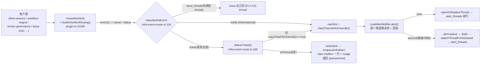

# FLY-2075 告警主管道断流 — 调研
Issue: FLY-2075 (https://linear.app/geoforge3d/issue/FLY-2075/2073账管-告警主管道断流hub-饿死诊断-修复alert-threads-08-21-后零新行)
日期: 2026-08-26
基于: exploration.md

> ⚠️ **2026-08-26 07:12Z 之后读者先看这条**:本文 §2(A1/A2 开关形态)与 §4(横幅带 channel-copy 状态)已被 founder 暂定裁定取代——不双发、只发 Discord、**删旋钮不留旋钮**。它们保留为审计上下文;拆除面的机制盘点见 §8,实施以 `plan.md` v3 为准。§1(管道形状)、§3(重开频道会带回什么,含 §3.2 v2 更正)、§5–§7 仍有效。

> 本文回答一个问题:**如果 founder 选 exploration.md §5 的选项 A(重新打开频道腿),用什么机制打开、会带回什么、怎么验**。选项 B / C 不在本文展开(B 是传输层重写,C 是 Epic 换地基,都不是本单的实现)。

## 1. 现有管道的精确形状(改动只落在这里)



**唯一的闸**:`deliverTicket()` 里的 `copyTicketToChannel()`(`infra-event-router.ts:171`),生产上它 = `shouldCopyInfraAlertToChannel()`(`infra-alert-mailbox.ts:15-19`),而该函数只认 `process.env.FLYWHEEL_ALERT_COPY_TO_CHANNEL === "1"`。闸后面的一切(Hub、notifier、限速、队列回放、thread、账本、T2 升级、auto-repair)都是 08-14 之前每天在跑的代码,08-15 起一行没改过(`git log --since 08-13 -- AlertChannelHub.ts` 只有 #836 自己与两处无关 fix)。

## 2. 两种打开方式

| | **A1 改运维配置** | **A2 改代码默认值(推荐)** |
|---|---|---|
| 做法 | `~/.flywheel/.env` 追加 `FLYWHEEL_ALERT_COPY_TO_CHANNEL=1`;下一班 Bridge 重启生效 | `shouldCopyInfraAlertToChannel()`:unset / `"1"` → ON,`"0"` → OFF;`truth.ts:596` 描述改为 default-on;PR 合入后随正常班车部署 |
| 代码改动 | 0 | ~10 行 + 测试 |
| 谁来动手 | runner 不能改 founder 机器上的生产配置 ⇒ Lead / founder 手工改;不进 git | PR 流程,codex review,CI |
| 仓库是否如实 | 否:`truth.ts` 仍写「default-off (FLY-1764)」,生产却 ON;flag 治理周扫(FLY-1831)看不到这条差异 | 是:默认值 = founder 现行裁定,`.env` 只留「关」的紧急开关 |
| QA 隔离房 | 每个房要自己设 env 才能复现 | 自动继承 |
| 失败类别 | **正是本案的失败类别**:行为取决于一个仓库外、日志里看不见的开关,下一次「怎么频道又没货」还得从零查 | 靠 §4 的 boot 横幅把路由状态打进日志,一眼可见 |
| 副作用 | 只影响生产 Bridge | 也影响**没有**统一频道的 Bridge(QA 房 / 未配置环境):copy 会打到 raw notifier → `no-channel` dead-letter → `fireMetaAlert` → **osascript 桌面通知**(`MetaAlertNotifier.ts:10`)。⇒ 必须加一道 guard:**只有 Hub 真的构造出来(`alertHub` 存在)才允许抄送**;且 guard / `=0` 只挡新副本——限速时已写进 `alert-queue/` 的副本文件 drain 时不认开关(`drainQueue` 不读 env),所以还要给副本打来源标记并在 drain 时抑制(plan T7) |

**选 A2**,附带 guard。A1 作为 A2 部署前的临时手段也不建议——两套真相并存会让后面的人不知道哪个在起作用。

## 3. 打开之后会带回什么(全部是 08-14 之前的既有行为,不是新东西)

### 3.1 频道日量

以 mailbox 主腿近 7 天的 distinct `collapse_key` 为估计(≈ Hub 的 correlation-key episode):83 ~ 98/天(08-19 ~ 08-23),08-24 205、08-25 307(`cmux_watcher_stalled` 自身在涨)。08-14 之前频道实测 `alert_threads` 20 ~ 35 行/天——差距来自 (a) `cmux_watcher_stalled` 是 08-23 才出现的新 kind,(b) Hub 的 correlation key 含 `sessionKey`,与 mailbox 的 collapse_key 粒度不同。诚实区间:**每天几十到三百条根消息**。

限速:`FLYWHEEL_ALERT_RATE_PER_MIN=20`(生产 env 已设)→ 超出的进 `~/.flywheel/alert-queue/`(cap 500 条 / 3 天,`LeadAlertNotifier.ts:717-718`),drain 回放时同样开 thread(`attachDeliveredAlertLifecycles`)。

### 3.2 开 thread 当场发生的事(会 @founder;v2 更正)

> v1 把这一段写成「5 分钟无人认领后 T2 升级」——**写轻了**(Codex R1 指出,已核代码)。真实顺序如下。

`AlertChannelHub.openOrReplaceThread`(`AlertChannelHub.ts:466-582`)在 thread 开出来的**同一时刻**跑 `AutoRepairBot.repair()`(plugin.ts 在 Hub 存在时始终注入 bot):

- `none_escalate` 类(经 Router 的有 `zombie_session_backlog`、`inbox_loop_stalled`、`stale_approved_ship_dead`)→ `postByDesignEscalation` **当场 @founder** + `ESCALATED`;
- 有 ARC 的 kind **有条件地** `attempted` → `REPAIRING`:`bridge_abnormal_exit` 恒 attempted;`swap_pressure_high` 三态;`infra_bot_down` 需 job label;`tmux_server_lost` 需 metadata 且 `migrated ≥ casualties` 且 `leadsFailed = 0`(`AutoRepairBot.ts:162-189`);`usage_limit` 的账号切换在 FLY-1456 后永久拆除(`attachAccountSwitch` 恒 false),生产上恒 `needs_human`。条件不满足一律 `needs_human`。之后 `reconcile()` 每 tick 复核,超时 / 重试耗尽才 T2 @founder;
- **其余所有 ticket kind** → `repair()` 默认分支 `needs_human`(`AutoRepairBot.ts:221-227`)→ **当场** thread 内 `<@founder>` + `ESCALATED`;
- 只有 swap 的既有 hold 场景走 `no_action` → `MONITORING`,零 mention。

`reconcile()` 的 T2(`decideTicketEscalation`,`NEW` + owner 已配置 + 5 分钟无 ACK → escalate;`REPAIRING/ACK` 超时 → escalate)是**第二层**,对已经当场 ESCALATED 的行不再动作。

改道前账本(`alert_threads` 08-05 ~ 08-14,151 行):**needs_human + ESCALATED 136**、needs_human 无状态 11、attempted 2、needs_human 后 RESOLVED 2。PRD §1.3 的「0/497 ACK、425 ESCALATED」就是这个机制两个月的累计。

**量级**:打开频道腿 = 每个新 episode 一次即时 @Annie;按 §3.1 的 83 ~ 307 episode/天估,**每天几十到三百次**,直到值守席位(Epic R1/R2)把认领做出来。此外 `onTicketEscalated`(同 kind 7 天 ≥3 次 ESCALATED 自动建 eng issue)与 `escalateToIssueThread`(issue 绑定的 ticket 改在 issue thread 里 @founder)一并复活。要不要在席位就位前先静音这条 @,是 Epic 的另一张单(改升级策略),不在本单改——但 founder 可以在拍板时直接点名要。

### 3.3 claw 双收

同一 eventId:mailbox 一行(即时 nudge)+ 频道根消息里的 🎫 owner @(`enrich()` 已经把 owner 算进 payload)。1764 ② 反对的正是这个。它的另一面:频道 thread 是 PRD R5/R6 要的**公共记录**(被 @ 的 Lead 进 thread、进展同步、archive / 挂着可见),mailbox 行做不了这些。两者用途不同,但 claw 的上下文里确实会出现两次。

### 3.4 不会带回的

- `mailbox_dead_letter` 告警仍走 `plugin.ts:9137` 直连 raw notifier(根消息、无 thread)——1764 明确「现状即可」,且它在 kind-contract 里是 `none_escalate`,若改经 Hub 会每天多 ~20 条入账即 @founder。**本单不动**,记为 Epic 的已知缺口(PRD §1.4 里它占 22%)。
- shell 路径 `no-token` 死信(`cmux_cleanup` 等)= FLY-2062。

## 4. 让「路由状态」可见(本案误诊的直接修补)

现在 boot 只打 `[Bridge] FLY-368 AlertChannelHub ON (...)`。issue 快诊据此判「Hub ON 却零活动 = 饿死」。改法:横幅由一个纯函数生成,同时说明 ticket 路由:

```
[Bridge] FLY-368 AlertChannelHub ON (unified channel=…, auto-repair=ON) ticket-route=owner-mailbox(claude-infra-bot-lead) channel-copy=ON
```

`channel-copy=OFF (FLYWHEEL_ALERT_COPY_TO_CHANNEL=0)` / `channel-copy=OFF (hub absent)` 两种关法都要打出原因。另在 `deliverTicket()` 里,copy 结果为 `skipped` / `deadLettered` /(非 sent 非 queued)时打一行 `[infra-alert-router] channel copy not delivered …`——今天这条腿失败是**完全静默**的(`primary` 照返,copy 结果被丢弃)。两处都是日志,不是告警,不触红线。

## 5. 现有测试基础(RED 从哪里长)

- `packages/teamlead/src/bridge/__tests__/infra-alert-wiring.test.ts:142`「does not emit a Discord copy … unless the switch is enabled」——目前用 mock `rawSink` 只断言**调没调**;`makeSink()` fixture 已经是真 `StateStore`。
- `infra-alert-mailbox.test.ts:11-19` 断言 `"0"` → false、`"1"` → true;**没有** unset 的用例(A2 要改的正是 unset 的语义)。
- `packages/teamlead/src/__tests__/AlertChannelHub.test.ts:50-80` 有 fake `discord.createThreadFromMessage` + 真 store 的 Hub fixture,可直接复用做「Router(copy ON)→ 真 Hub → `alert_threads` 有行」的端到端断言。
- `scripts/__tests__/check-flag-truth.test.sh` + `scripts/check-flag-truth.ts`:改 `truth.ts` 描述后必须过。

## 6. 验收怎么落到「一条真实告警」

生产 Bridge 没有告警注入 HTTP 路由(`grep '"/api/…alert…"' plugin.ts` 为空),也不该为验收加一个。但不需要注入:ticket 类 episode 基线 83 ~ 307/天(§3.1),部署后**一小时内**必有真实告警走完整链。证据三件套(都在部署后由 QA / implement runner 采):

1. bridge log:新横幅 `channel-copy=ON`;
2. `sqlite3 ~/.flywheel/teamlead.db "select opened_at,event_type,thread_id from alert_threads where opened_at > '<部署时刻>' order by opened_at desc limit 5"` 有行,且同一 `event_id` 在 `alert_delivery_receipts` 为 `sent`、在 comm.db `mailbox` 为 `infra_alert`(证明双腿都在);
3. Claude-in-Chrome 截 `#flywheel-alerts` 里该根消息 + thread。

部署时点 = PR 合入后的下一班 00:00 / 12:00 本地班车(`com.flywheel.updater.plist`),runner 不投重启票(FLY-1959)。

## 7. 会过期的结论(as-of 2026-08-26 07:xx Z)

| 结论 | 重核命令 | 何时作废 |
|---|---|---|
| `shouldCopyInfraAlertToChannel` 只认 `"1"` | `git log -S 'copyToChannelEnv] === "1"' -- packages/teamlead/src/bridge/infra-alert-mailbox.ts` | 本单实现合入后 |
| 经 Router 且 none_escalate 的 kind = 上列 3 个 | 对 kind-contract.ts 的 `none_escalate` 集合逐个 grep 产源接的 sink(`leadAlertNotifier.alert` 直连 vs `routedAlertSink`) | 任一 kind 合同或产源接线改动 |
| 生产 `FLYWHEEL_ALERT_RATE_PER_MIN=20` | `ps -wwE -p $(lsof -tiTCP:9876 -sTCP:LISTEN) \| tr ' ' '\n' \| grep RATE_PER_MIN` | `.env` 改动 + 重启 |
| 频道日量估计 83~307 | exploration.md §3.2 的 distinct collapse_key 查询 | 每天都变;`cmux_watcher_stalled` 涨势未知 |

## 8. v3 机制盘点:单车道拆除面(2026-08-26 07:xx Z)

裁定「不双发,只发 Discord」在代码上 = 把 FLY-1764 Flow 2 的最后一公里**拆回** FLY-927 的形状(ticket 分支直接进 Hub),再把 Hub 里所有自动 @founder 的路径删掉。盘点(全部已 grep 核实):

| 面 | 落点 | 其他消费者(决定能不能删) |
|---|---|---|
| Router ticket → mailbox | `plugin.ts:10351-10360`、`infra-event-router.ts:139-141,167-178`、`infra-alert-wiring.ts:48-50,127,153,168-169` | 无 —— 可删 |
| `enqueueInfraAlert` | `lead-inbox-runtime.ts:485` | **有**:`plugin.ts:5150`(workflow source fallback)、`:7419` / `:7491`(flag-scan 告警)—— **保留** |
| `FLYWHEEL_ALERT_COPY_TO_CHANNEL` | `infra-alert-mailbox.ts:9-19`、`truth.ts:596` | 无(`.env` 无此项;flag 治理测试不引用)—— 删 + `RETIRED_FLAGS` 墓碑 |
| Hub 自动 @founder | `AlertChannelHub.ts:468-489`(by-design)、`:516-582`(needs_human)、`:819-906`(reconcile escalate)、`:907-965`(`escalateTicket`)、`:617-664`(文案)、`:665`(`founderId`,仅 3 处内部用) | `escalateToIssueThread` 接线 `plugin.ts:10271-10321`(`getFounderPaged`/`recordFounderPaged` 仅此处用);`onTicketEscalated` 接线 `:10322`→`runbook-gap.ts`(`FLEET_ESCALATION_COPY` 仅它与 `fleetEscalationLine` 用;测试 `escalation-chain.test.ts`、`AlertChannelHub.contract-escalate.test.ts`) |
| `decideTicketEscalation` 的 `"escalate"` | `ticket-escalation.ts:88-125` | 仅 Hub 用 —— 改为 `none`/`retry` 两值 |
| 根消息 🎫 owner @ | `infra-alert-wiring.ts` `enrich()` → `LeadAlertNotifier.ts:1720-1730` `allowed_mentions` | 保留:单车道下 claw 被叫到的唯一机械 |
| 测试改动面 | `AlertChannelHub.test.ts`(847 行,founder 相关 30 处)、`contract-escalate`(213)、`alert-ticket-lifecycle`(406)、`ticket-escalation`(145)、`infra-alert-wiring`(340,`ticketSink` 16 处) | 只改期望不删用例;`infra-alert-mailbox.test.ts` 整删 |

**最大反面**(C2):2076 上线前,频道里的 ticket 没有任何自动读者——claw 的 mailbox 唤醒没了、@founder 没了,只剩根消息里对 claw Discord 用户的 @;claw 的运行时是否因此醒来是 FLY-2076 的范围。这一条必须由 founder 明确接受或裁定 2076 先行。
