# FLY-2076 Claw 值守席位 — 探索
Issue: FLY-2076 (https://linear.app/geoforge3d/issue/FLY-2076/2073值守-claw-infrabot-值守上岗对整条队列负责-初审三去向宁转勿吞)
日期: 2026-08-26
基于: 无

> **世界标注**:本文数据全部为 **[生产现状]**(本机 `~/.flywheel/` 与 `~/.claude/`,测于 2026-08-26 07:30~07:50Z;生产 Bridge pid 32160,`/health` 未核 buildSha)。代码引用为本分支 `flywheel-FLY-2076`(= `main@b889c4b6f`)。FLY-2075 的结论引自其分支 `origin/flywheel-FLY-2075@265974c4c` 与 Tadashi 2026-08-26 07:26Z 的 issue comment。

## 0. 一句话

Claw 今天**每条工单都签收、几乎每条都「Standing by」**:近 7 天 5,034 次 mailbox 签收、208 次「Standing by」、0 次提到 runbook。PRD R2 说「没有第四种去向」,**第四种去向正是它现在的常态**。本单要做的不是让它「看见」(它已经看见了),而是把「看见之后必须落到 ①/②/③ 之一并留痕」变成它的角色合同,并把接入点从将被拆掉的信箱腿换到频道腿。

## 1. 口径先立住

| 词 | 指什么 | 不指什么 |
|---|---|---|
| **签收(mailbox ACK)** | `comm.db` `mailbox.state='ACKED'`:Claw 的会话收到了这批信 | 不是「认领来处理」 |
| **认领(ticket ACK)** | `teamlead.db` `alert_threads.ticket_status='ACK'` + `acked_at`:值守宣布「这条我看过、我来落去向」 | PRD §1.3 数「0/497」数的就是这本 |
| **去向** | R2 的 ①自己解决 / ②查册 @人 / ③兜底 @Tadashi | 「签收后什么都不做」不是去向 |
| **留痕** | 在该工单的 Discord thread 里有 Claw 的一条处置帖 + 账本状态与之一致 | 会话 transcript、私有频道自言自语都不算 |

## 2. 现状事实(逐条带证据)

### 2.1 角色文件:合同就是「不点名不动」

`.lead/claude-infra-bot-lead/identity.md`(与 `~/.claude/agents/claude-infra-bot-lead.md` 逐字节相同,`diff` 为空):

- 「**只**响应:① Alerts 里**显式 @你**的工单帖(mention-gate 放行)② 私有频道里 Annie 的直接指令」
- 铁律:「**一条工单只有一个 owner**:没被 @ 的工单你不动手」
- 升级出口:「修不掉才 @Annie(T2 = 重试 2 次或 5 分钟)」

⇒ 三条合在一起,就是 PRD §1.2 点名的那句「逐条点名制」。**本单改的是这三条**;其余(谁都不救自己 / 不开 Runner / 不碰产品代码 / notify 铁律)保留。

### 2.2 告警现在怎么到 Claw:走信箱,不走频道(FLY-1764 Flow 2)

- `plugin.ts:10353`:Router 的 ticket 分支 → `leadInboxRuntime.enqueueInfraAlert("claude-infra-bot-lead", payload)`;频道副本只在 `FLYWHEEL_ALERT_COPY_TO_CHANNEL === "1"` 时抄送(`infra-alert-mailbox.ts:15-19`),生产 `.env` 无此变量。
- `comm.db` `mailbox WHERE to_agent='claude-infra-bot-lead' AND source_kind='infra_alert'` 近 7 天(07:40Z):

| kind | 行数 | 其中 DEAD(`lease_expired_unacked`) |
|---|---|---|
| `cmux_watcher_stalled` | 289 | 30 |
| `workflow_engine_escalation` | 216 | 27 |
| `zombie_session_backlog` | 205 | 39 |
| `review_advisory_pass` | 185 | 26 |
| `external_merge_suspect` | 65 | 6 |
| `bridge_abnormal_exit` | 17 | 2 |
| `runner_login_expired` | 11 | 4 |
| `inbox_loop_stalled` / `tui_window_lost` / `bridge_boot_stale_checkout` | 11 / 10 / 3 | 0 |
| **合计** | **~1,012** | **134** |

- Claw 最后一条**来自频道**的信(`source_kind='discord_chat'`,chat_id = 统一告警频道 `1518793447165661254`)停在 **2026-08-14T21:58:56Z** —— 与 FLY-2075 定位的改道时刻(#836 合入 22:19Z)吻合。08-15 起频道里没有 ticket 根消息,自然也没有 @Claw。

### 2.3 Claw 收到之后干了什么(近 7 天会话 transcript,`~/.claude/projects/-Users-xiaorongli--flywheel-lead-workspace-claude-infra-bot-lead/*.jsonl`,mtime < 7d)

| 计数 | 数字 | 读法 |
|---|---|---|
| `flywheel_inbox_ack_batch` 调用 | **5,034** | 每批都签收 |
| assistant 文本里「Standing by」 | **208** | 签收后不动 |
| 「no action needed」 | 65 | 判定「不归我」 |
| 「outside my (toolset/lanes)」 | 22 | 判定「我没工具」 |
| 提到「runbook」 | **0** | 没有任何沉淀动作 |
| `discord reply` 调用 | 65(其中 **64 条 chat_id = 统一告警频道**) | 它**有权**、也确实在告警频道发帖 |
| `<@founder>` / 「@Annie」 | 11 | 升级出口仍是 founder |

两条原话(transcript 最新文件):

> 「Batch acked. This is an `info`-severity status post (review advisory pass, …, no mention of me, not auth/runner/notify-related) — no action needed per my mandate. Standing by.」
> 「Acked and triaged. Summary: `cmux_watcher_stalled` (severe, affected=flywheel-cos-lead) is a host-daemon watchdog issue outside my toolset … Standing by.」

⇒ **它按现行合同执行得很准确** —— 问题不在执行,在合同。第二条尤其典型:severe、判定「不是我的」、然后**没有转给任何人**。这正是 R2 要禁掉的「吞」。

### 2.4 接入门控现状(Discord 插件 `gate()`)

运行时插件 `~/.claude/plugins/cache/flywheel-plugins/discord/0.0.4/server.ts`:

- `messageCreate`(:1515-1522):自己的消息直接丢;**bot 作者**必须在本 Lead `access.json` 的 `allowBots` 里才进 `gate()`。
- `gate()`(:712-829):按 **频道 id** 查 `access.groups[channelId]`;**thread 继承父频道的策略**(`msg.channel.isThread() ? parentId : channelId`);无 group → `drop`;`allowFrom` 非空且不含发送者 → `drop`;`requireMention ?? true` 且未被 @(真 `<@id>` / 回复自己 / 名字模式)→ `drop`;否则 `deliver`。
- `deliver` 之后:插件 hook → `flywheel-comm chat-ingest`(`chat-receipt-runtime.ts:756`)→ `comm.db` `mailbox` 一行 `discord_chat` → Lead inbox loop → `ClaudeLeadDeliveryAdapter.deliverBatch`(写 inbox 文件 + nudge)→ Claw 会话以 `<channel chat_id=… message_id=… user_id=… ts=…>` 包络收到。

Claw 的 `~/.claude/channels/discord-claude-infra-bot-lead/access.json`:

```json
"groups": {
  "1524885436848410705": { "requireMention": false, "allowFrom": ["<founder>"] },   // 私有 #claude-infra-bot
  "1518793447165661254": { "requireMention": true,  "allowFrom": [] }               // 统一告警频道
},
"allowBots": [ "1524831623164596265" /* dispatcher */, "1523219324561522831", … 19 个 ]
```

⇒ **让 Claw「看到每条消息」,机制上只差一个布尔值**:告警频道那组的 `requireMention` 从 `true` 翻成 `false`。dispatcher bot(告警根消息的作者)已在 `allowBots`;thread 里的跟帖按继承规则一并送达。**这条管道 08-14 之前每天都在跑**(§2.2 的 discord_chat 行就是它送的),不是新东西。

**同一张表的另一面**(直接影响 ②/③):

| Lead | 告警频道 group | `allowBots` 含 dispatcher |
|---|---|---|
| flywheel-eng-lead(Tadashi) | **无** | 否 |
| flywheel-cos-lead(Cass) | **无** | 否 |
| flywheel-product-lead | **无** | 否 |

⇒ **今天在告警频道 @Tadashi,他的插件在 `gate()` 第一步就丢掉**(无 group → drop)。这是 PRD R7「被 @ 必达」= FLY-2078 的活;本单不做,但本单的 ②/③ 去向**在 2078 落地前只是「留痕」,不是「必达」**。§6 会把这条写成显式依赖。

### 2.5 认领账本:写入口只有一个,而且不是给值守用的

- `alert_threads` 列(`StateStore.ts:54296+`):`correlation_key / event_id / thread_id / root_message_id / channel_id / lead_id / event_type / repair_status / opened_at / resolved_at / ticket_status / owner_ref / attempt_count / first_seen_at / acked_at`。
- `setTicketStatus(ck, status)`(`:11080`):`ACK` 时 `acked_at` **只盖一次**(first claim wins)。调用者:`AlertChannelHub`(ESCALATED / REPAIRING / MONITORING / RESOLVED,`:472/506/547/571/710/885/944`)与 `plugin.ts:10147`(**唯一** ACK 写入点 = rescue 路由的 `ackTicket`,仅 `login_expired` / `runner_login_expired` 两种 kind)。
- 查找:按 `event_id`(`getActiveAlertThreadByEventId`)、按 `(leadId, type)`;**没有**按 `root_message_id` / `thread_id` 的查找 —— 而 Claw 从频道拿到的是 `message_id`,不是 `event_id`(根消息文本里没有 eventId)。
- 🎫 行状态 edit-in-place:`AlertChannelHub.updateRootTicketStatus`(`:590-608`),正则替换 `· 状态 <X>`,best-effort。
- 没有任何 HTTP 路由 / CLI 让一个 Lead 主动写 `ACK` / `RESOLVED` / `owner_ref`。

⇒ **值守要落账,必须新开一个写入口**(路由 + CLI),并补一个按 `root_message_id`/`thread_id` 的查找。这是本单唯一需要动 Bridge 代码的地方(§5)。

### 2.6 FLY-2075 的方向(本单接入前提;以 Tadashi 07:26Z comment 为准)

Tadashi 在 FLY-2076 的 comment(2026-08-26T07:26:48Z)逐条:

1. founder 07:12Z 初裁「**不双发,只发 Discord**」(待一字确认)→ 2075 改为**频道单腿、撤信箱腿**;本单按「频道」设计,信箱腿视为将被删除;若 founder 早晨改口,只换接入点那一节。
2. Hub 的即时 @founder + ESCALATED 升级路**将被砍掉**(2075 同 PR)→ 本单 R2 三去向是**唯一**升级路径,不再有系统自动 @Annie。
3. Claw 当前:进程活、信箱持续签收(近 31h 360 收 / 353 签),**签收之后无处置账**。
4. 与 2077 并行:册子落点以 2077 定的仓内路径为准。
5. ⛔ 不新增告警层;⛔ 不设指标 / hard limit;⛔ 不做噪音判定。

2075 分支的设计页 v3(`FLY-2075-design.template.html`)把「C2 没有自动读者的窗口」列为 founder 拍板点 2,并写明「**claw 的运行时会不会因为频道 @ 醒来、去看整条队列,是 FLY-2076 的事**」。

⚠️ 2075 分支上的 `plan.md` 仍是 v2(A2 = 频道副本默认 ON,commit 00:28 PT),**早于** 07:12Z 的裁定;两者矛盾时以 comment 为准。本单不依赖「双发」还是「单腿」—— 只要求「ticket 根消息在频道里、Hub 开 thread、不自动 @founder」这三点,两种形态都满足。

### 2.7 与 Cass 的边界:她事实上已经不在值守位上

| PRD Q3 的担心 | 实测 |
|---|---|
| 「Cass 现在还是自动修复的执行身份」 | `AutoRepairBot` 是 Bridge 进程内代码(`bridge/AutoRepairBot.ts`),不是任何 Lead;告警发送身份是专用 dispatcher(`FLYWHEEL_ALERT_SENDER_TOKEN_ENV` 已设,spec §6「CASS 过渡态已裁掉」) |
| Cass 在看告警频道? | `.lead/flywheel-cos-lead/identity.md` 对 `alert` 零命中(`grep -i`);她的 `access.json` **没有**告警频道 group ⇒ 插件层就收不到 |
| 需要「移交」什么? | 没有运行时动作可移交。剩下的只是**把「Cass 不值守」写成字**(她的角色文件 + R7)—— 属 FLY-2078 |

⇒ 本单对 Cass 的处置 = 在设计与 Claw 角色文件里**明写**「值守席位唯一 = Claw;Cass 不看告警频道、不被 @ 不进」,不改 Cass 的文件。

### 2.8 两本册子:不存在

`git ls-files | grep -iE "oncall|contact-book"` 为空;FLY-2077 未开分支(`git branch -r` 无 2077)。2077 描述建议落点 `doc/oncall/`。本单只能定义 Claw **怎么用**册子(查什么键、查不到怎么办、解决后写什么),文件格式与路径以 2077 为准 —— 本单给出一个**最小接口假设**,2077 若改路径只换一行。

### 2.9 Claw 手里已有的工具(决定「① 职权内」的边界)

`.mcp.json`:`flywheel-inbox`(签收)、`flywheel-terminal`(`runner_terminal_status` / `capture` / `list` —— **只看得见 Runner 会话**,看不见 Lead / 宿主 daemon)、`gbrain`、`linear-api`(HTTP,可建 issue)、Discord 插件(`reply` / `react` / `edit_message` / `fetch_messages(≤100)`)、`Bash`(近 7 天 3,986 次)。启动环境有 `FLYWHEEL_DIR`(`flywheel-lead-wrapper-v2.sh:67`,默认 `~/Dev/flywheel`)⇒ 仓内册子可通过 `$FLYWHEEL_DIR/…` 定位,不写死路径(R4.0)。

治理:角色文件末尾附 founder-only-authority bundle,「infra 自愈 carve-out」= 工单 ARC(nudge / respawn / Codex 侧 relogin),**仅限有未决 confirmed 工单、证据先行、T2 后停手**。⇒ 「不许装懂」不是新约束,是把 carve-out 的边界从「@ 到我的工单」扩到「我初审的每一条」。

## 3. 本单要回答的七个问题

| # | 问题 | 出处 |
|---|---|---|
| A | Claw 怎样看到每条消息(接入点) | issue「设计段要回答的」① |
| B | 三去向怎么落账、怎么留痕(认领写哪、thread 帖长什么样) | R2 / §8.3 #1 #2 |
| C | 「不许装懂」的边界怎么写成可执行的 allow / deny | R2 |
| D | 「压不过来必须主动说」:什么算堆积信号、喊给谁、怎么不变成指标 | §6 |
| E | R8 根因线:什么时候开单、开给谁、怎么不重复开 | R8 |
| F | Cass 的边界 | Q3 |
| G | 与 2075 / 2077 / 2078 的先后与依赖 | issue「与 FLY-2075 的关系」 |

## 4. 问题 A:接入机制四个选项

| 选项 | 机制 | 复用什么 | 反面 | 判 |
|---|---|---|---|---|
| **A · 翻插件门控**(推荐) | Claw `access.json` 告警频道 group `requireMention:false`;其余不动 | 08-14 之前每天在跑的整条管道(插件 → `chat-ingest` → mailbox → inbox loop → 会话);thread 跟帖按继承规则一起来 | ① 量:频道日量几十到三百根消息 + thread 跟帖,全部进 Claw 上下文(它今天已在信箱里收同量级,§2.2);② **回环风险**(FLY-220):看得见一切 ≠ 回一切,角色文件必须写死「只在工单 thread 里回、一条一帖」;③ 配置在仓库外(`~/.claude/channels/…`),要有幂等的落地脚本 + 启动自检,否则下次重装又回到 `true` | **选** |
| B · Bridge 侧 REST 轮询,再投 Claw 信箱 | 仿 Codex Lead 的 `RestPollDiscordInboundSource` 为 Claw 加一个频道轮询器,写 `infra_alert` 类行 | mailbox 唤醒机械 | 新代码、第二条 Discord 入口、且与 2075「撤信箱 ticket 腿」方向相反;等于新增一层 | ⛔ |
| C · Claw 自己 `fetch_messages` 轮询 | 定时(cron / loop)拉最近 ≤100 条,自己比对 | 插件既有工具 | 需要外部唤醒;≤100 条上限,爆发期漏;空转烧 token;不是推送 | 不做主路;**留作启动/断线后的补扫**(§4.1) |
| D · 保留信箱腿(Flow 2 现状) | 不改接入,只改角色文件 | 现有 `infra_alert` 行 | 与 founder 07:12Z 裁定相反;2075 正在拆;且信箱行没有 thread 可留痕 | 仅作「founder 改口」时的回退:此时 §5 的落账写入口改为按 `event_id` 查(信箱行带 `source_ref=eventId`),角色文件不变 |

### 4.1 选项 A 的三块拼图

1. **门控翻转的落地方式**:不手改。仿 `packages/teamlead/scripts/apply-core-room-mention-gate.sh`(FLY-898,原子写 + 备份 + 幂等 + fail-closed + 不创建 group)写一个反向的 `apply-alert-duty-gate.sh`:对**一个** Lead 的**一个**已存在 group 把 `requireMention` 置 `false`、`allowFrom` 置 `[]`。启动时在 `claude-lead.sh:2962-2979`(现有 `roundtable-allowbots-cli` 调用点旁)调用;目标 Lead 由 projects.json 决定(§5.4)。
2. **补扫**:Claw 启动 / 会话重开时(`SessionStart` hook 已有 `session-start-adopt-inflight.sh`)用 `fetch_messages(channel=告警频道, limit=100)` 拉最近根消息,对比「🎫 … 状态 NEW 且 thread 里没有我的处置帖」的条目 → 按 §5 走一遍。这是**兜住 2075 C2 窗口与自己离线窗口**的唯一办法,不是主路。
3. **回环护栏**(角色文件):只在**工单 thread** 里发处置帖;一条工单**一帖定去向**(后续进展另帖,但不复述);绝不回 dispatcher 的根消息本身、绝不回自己的帖、绝不在根频道闲聊;信箱死信通报等「旁路」根消息(无 thread)同样走三去向,处置帖以 `reply_to` 挂在该根消息下。

## 5. 问题 B:三去向怎么落账、怎么留痕

> ⚠️ 本节是首轮思路,**写入口的具体设计已被 research.md §2 / plan.md v3 取代**:回执按 episode 独立建账(`alert_threads` 是 active-mapping,不能挂列)、留痕帖由 Bridge 代发并对账、`/duty` 独立路由 + 专用 token。下文保留为审计上下文,数字与代码引用仍有效。

### 5.1 状态机(在 2075 砍掉自动升级之后)

```mermaid
stateDiagram-v2
    [*] --> NEW: Hub 开 thread(2075 后不再自动改状态)
    NEW --> ACK: Claw 初审帖 = 认领(每条必经,三去向共用)
    ACK --> REPAIRING: ① 职权内动手(有 runbook 条目 / carve-out 内)
    REPAIRING --> RESOLVED: ① 修好 + 验证 + runbook 写入
    REPAIRING --> ESCALATED: ① 失败 → 转 ② 或 ③
    ACK --> ESCALATED: ② @册上负责人 / ③ @Tadashi(owner_ref = 目标 Lead)
    ESCALATED --> RESOLVED: 接手方在 thread 宣告解决(2078 R6)
    ESCALATED --> ESCALATED: 未解决,挂着可见(2078 R6;不静默关)
```



`ESCALATED` 在这里的含义从「无人认领超时」变成「**值守已转出,球在 owner_ref**」。这是复用既有枚举、不加新状态的最小改法;代价是它与 PRD §1.3 里「425 条 ESCALATED」的旧语义同名 —— 写进 spec §5 的守卫段即可(2075 已在删旧语义的产生源)。**这一条请 Tadashi 拍**(工程裁定,不是 founder 级)。

### 5.2 落账写入口(本单唯一的 Bridge 改动)

- 路由:`POST /api/alert-tickets/transition`,body `{ rootMessageId | threadId | eventId, action: "ack" | "repairing" | "resolve" | "handoff", to?: leadId, note?: string }`;鉴权同现有 Lead CLI(bearer `TEAMLEAD_API_TOKEN`);**actor 必须 = 值守席位 Lead**(§5.4 的配置),否则 403。
- 服务端:按 `root_message_id` / `thread_id` / `event_id` 找活跃行(新增 `getActiveAlertThreadByRootMessageId`)→ `setTicketStatus` + `owner_ref`(handoff 时写目标 leadId)→ 复用 `AlertChannelHub.updateRootTicketStatus` 重渲染 🎫 行 → 返回 `{ correlationKey, eventType, status }`。找不到行(旁路根消息 / 历史行)→ `404 ticket_not_found`,**不报错给频道**,Claw 照样在 thread 留痕(账本缺行是 2075/2078 的已知缺口)。
- CLI:`flywheel-comm alert-ticket --message-id <id> --action ack|repairing|resolve|handoff [--to <leadId>] [--note "…"]`,`FLYWHEEL_LEAD_ID` 已在 Claw 的 MCP env 里。Claw 近 7 天 3,986 次 Bash,CLI 是它最自然的手。
- ⛔ 不做:让 Hub 解析 thread 文本猜状态(自由文本不可靠);把写入口做成 MCP 工具(改 `.mcp.json` 要重启 Claw 会话,且 CLI 已够)。

### 5.3 thread 处置帖的固定形状(留痕 = 可机器核对)

每条工单**恰一帖**定去向,首行固定:

```
🧭 值守初审 · <kind> · 去向 ①自己解决 | ②转 @<Lead> | ③兜底 @Tadashi
看到什么:<一两句现象>
查了什么:<读了哪些日志/状态;只读>
为什么这个去向:<runbook 命中 / 册上查到 X / 册上没有>
根因线(R8):<代码或配置问题 → 已开 FLY-xxxx | 判不清,已知到 <步骤>>
```

①的后续:`✅ 已解决 · 验证:<怎么确认> · runbook:<路径或「已追加」>`;失败:`↪ 转 ②/③`。②③的后续由接手方写(2078)。验收就核这两样:thread 里有 🧭 帖;账本 `ticket_status`/`owner_ref`/`acked_at` 与帖子一致。

### 5.4 「值守席位是谁」写在哪

projects.json 里 Claw 已有 `department: "infra"`、`alertChannel`;`INFRA_ALERT_LAST_MILE_ROUTE.ownerLeadId = "claude-infra-bot-lead"` 在代码里写死。2075 拆信箱腿后这个常量失去用途 —— 建议改名为 `ALERT_DUTY_SEAT = { leadId: "claude-infra-bot-lead" }`,由 §4.1 的门控脚本、§5.2 的 actor 校验、启动横幅三处共用(**一个真相源**)。不新增 projects.json 字段(席位唯一,不需要配置面)。

## 6. 问题 G:先后与依赖(诚实写)

| 依赖 | 对本单的影响 | 没它时本单能交付什么 |
|---|---|---|
| **2075**(频道单腿 + 砍自动 @founder) | 接入点 A 的前提:频道里要有 ticket 根消息与 thread | 角色文件、门控脚本、落账路由都能先合;**验收(一条真实告警走完 ①/②/③)只能在 2075 部署后采** |
| **2078**(R7 被 @ 必达) | ②/③ 的「@ 对方」今天在插件层被丢(§2.4) | ② ③ 只留痕、不必达;**①(自己解决)不依赖 2078,可独立验收** |
| **2077**(册子) | ② 查 contact book、① 写 runbook 的落点 | 用 §2.8 的最小接口假设先写角色文件;2077 合入后只改路径一行 |

⇒ 验收顺序建议:先用 ① 完成一次完整处置(2075 后第一条有 runbook 条目 / carve-out 内的真实告警,例如 `bridge_abnormal_exit`);② ③ 的「必达」部分明标「待 2078」。

## 7. 问题 C / D / E / F 的探索结论(细节进 research.md)

- **C 不装懂**:按「动作是否改变系统状态」切,不按 kind 切。只读永远允许;改状态只在 (a) runbook 有该 kind 条目 **且** (b) 在 carve-out 内 时允许;二者缺一 → ②/③。
- **D 堆积信号**:Claw 自己看得见的只有两样 —— 「上一批还没落完去向,下一批已到」(会话内可数)与「启动补扫发现 NEW 且无我帖的根消息」。喊 = 在告警频道**一帖** @Tadashi 说明积压形状(kind 分布、最早一条时间)+ 「我先按到达顺序处理,severe 优先」;**不设阈值、不设 SLA**,喊过之后清空前不重复喊。
- **E 根因线**:每帖必带「根因线」一行;判定代码/配置问题 → 用 `linear-api` 建单(team FLY / project Flywheel / 标题带 kind / 正文贴 thread 链接与防复发思路),建前先搜同 kind 未关闭单避免重复;判不清 → 只写已知到哪一步。2075 删掉的「同 kind 7 天 ≥3 次自动建单」由这一行**人工**接替。
- **F Cass**:§2.7 —— 事实上已退出;本单只在 Claw 角色文件与设计里明写席位唯一,Cass 文件归 2078。

## 8. 风险与反面

| 风险 | 说明 | 处置 |
|---|---|---|
| 看得见一切 → 回一切(FLY-220 回环) | 门控翻转后 thread 跟帖也进 Claw | 角色文件回帖纪律 + 启动横幅自检;实现阶段用真频道观察 24h |
| 上下文被灌满(FLY-1764 §1.2 的教训) | 每天几十到三百根消息 + 跟帖 | Claw 今天已在信箱里收同量级且 ACK 延迟 0.5 min;真正的减量在第 2 层(PRD §5),本单不碰 |
| 门控在仓库外,重装/重建后回到 `true` | `access.json` 是插件私有状态 | 启动脚本幂等落地 + 启动横幅打印当前值;两处一致才算「值守在线」 |
| 账本缺行(旁路根消息、2075 C2 窗口) | 落账 404 | thread 帖仍是真相流;404 记日志不告警 |
| ②③ 不必达(2078 前) | 插件层丢 @ | 明标依赖;① 独立验收 |
| Claw 把「转出」当成新的「Standing by」 | ②③ 只是换个说法不动手 | 帖子格式强制「查了什么 / 为什么这个去向」;册上查不到才许 ③ |

## 9. 会过期的结论(as-of 2026-08-26 07:50Z)

| 结论 | 重核命令 | 何时作废 |
|---|---|---|
| Claw 告警频道 group `requireMention:true` | `jq '.groups["1518793447165661254"]' ~/.claude/channels/discord-claude-infra-bot-lead/access.json` | 门控脚本落地后 |
| Tadashi / Cass / HL 无告警频道 group | 同上换目录 | 2078 落地后 |
| 近 7 天信箱 `infra_alert` ≈1,012 行 / 134 DEAD | `sqlite3 ~/.flywheel/comm/flywheel/comm.db "select count(*),sum(state='DEAD') from mailbox where to_agent='claude-infra-bot-lead' and source_kind='infra_alert' and created_at>=strftime('%Y-%m-%dT%H:%M:%fZ','now','-7 days')"` | 2075 拆信箱腿后归零 |
| Claw 近 7 天「Standing by」208 次 / runbook 0 次 | `jq -r 'select(.type=="assistant")|.message.content[]?|select(.type=="text")|.text' <transcripts> \| grep -c "Standing by"` | 角色文件换版后应趋零 |
| ACK 唯一写入点 = rescue 路由 | `grep -n 'setTicketStatus(.*"ACK")' packages/teamlead/src/bridge/plugin.ts` | 本单路由合入后 |
| 2075 方向 = 频道单腿 + 砍自动 @founder | FLY-2075 最新 comment / 分支 plan.md 版本号 | founder 一字确认或改口 |
