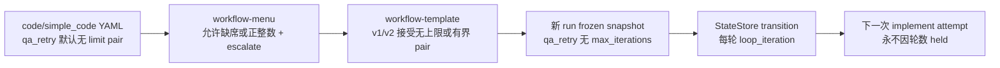

# FLY-2094 取消 QA 循环上限 — 调研
Issue: FLY-2094 (https://linear.app/geoforge3d/issue/FLY-2094/founder-直令-取消-qa实现循环上限删-codesimple-code-模板的-maxiterationsonlimit菜单校验qa)
日期: 2026-08-27
基于: exploration.md

## 1. 审计范围与结论

本调研沿新 run 的真实数据流审计：内建 YAML → menu parser/shape invariant → manifest parser → frozen snapshot → transition engine → operator rework HTTP 边界。结论是取消 QA cap 需要同时改四层；只删 YAML 会在 menu parser 或 manifest parser 立即失败，只删 shape 校验则运行时会返回 `loop_limit_missing`。

目标数据流为：

## 2. 声明层

### 2.1 内建 shape

`menus/shapes/code.yaml` 的 `qa_retry` 当前带 3/`escalate`，`simple_code.yaml` 带 10/`escalate`。两个 `founder_rework` 已经通过省略 limit pair 表达无上限。QA loop 应与此同构：只保留 `id/from/to/loopWhen/exitWhen`。

### 2.2 `workflow-menu.ts`

当前有两层限制：

1. 通用 `parseMenuShape` 在 `loopWhen !== founder_feedback_kickback` 且缺少上限时直接报错。
2. shape invariant 对 `code` 要求 `qaLoop.maxIterations === 3`，对 `simple_code` 要求 `=== 10` 且 `onLimit === escalate`。

应删除第一层按 loop 类型强制有界的分支，同时保留“两个字段必须成对出现”与正整数/`escalate` 校验；第二层删除 3/10 的精确数值约束，不新增“必须无上限”约束。这样默认 YAML 无 cap，而模板仍可明确声明任意正整数 cap。

错误文案应删掉 `max-3` / `max-10`，只描述 topology 与 founder-rework 的既有无上限 invariant，不再声称 QA 上限是 shape identity 的一部分。

### 2.3 `workflow-template.ts`

v1 与 v2 manifest parser 各有一份同构的限制：非-founder loop 缺 limit pair 即拒绝。menu seed 编译最终调用 `validateWorkflowManifest`，所以这两处必须同步改成：

- 缺两个字段：合法，表示无上限；
- 两个字段齐全：合法有界 loop，继续校验正整数与 `escalate`；
- 只缺其中一个：非法。

这同时满足新内建 QA 无上限与旧 frozen/custom 有界 manifest 的兼容要求。已有带 3/10 的 fixture 必须继续通过，证明解析零变化。

## 3. 运行时

### 3.1 新无上限 QA loop

`commitWorkflowTransitionTx` 当前先算 `loopIteration`，随后对非-founder loop 缺 limit pair 返回 `loop_limit_missing`。删除这个拒绝分支后，超限判断必须显式收窄为“`max_iterations` 与 `on_limit` 都存在且 `loopIteration > max_iterations`”。

无上限路径随后使用既有通用逻辑：

- 写 `node_completed`；
- 写 `loop_iteration`，payload 通过现有条件展开只含 `{ iteration }`；
- 创建下一次 implement attempt / rework request；
- 不写 `loop_limit_escalated`；
- 不修改 run 为 `held`。

因此无需增加任何新状态、事件或告警。

### 3.2 自定义有界 loop 与 frozen manifest

显式存在 `max_iterations`/`on_limit` 的 loop 继续走原通用超限实现：超过上限时写 `loop_limit_escalated` 并 held。`workflowLoopIterationCount` 仍统计 `loop_iteration` 与历史 `loop_limit_escalated`，避免改变旧 run 的计数投影。

这条保留路径不再是 `code`/`simple_code` 的内建 QA 行为，但仍服务 frozen/custom manifest，所以 event kind、查询与 transition 分支不能全删。

## 4. 保留 FLY-1707 有界-loop 出口

FLY-1707 为 `loop_limit_escalated` held run 增加了闭式人工续跑合同，仓库内由以下结构完整承载：

- `WorkflowLoopLimitEscalationAck` 类型；
- `openOperatorRework` 入参、boundary validation、idempotency payload 比较；
- 最新 hold 查询中的 `loop_limit_escalated` + `heldLoopLimit` 白名单；
- hold receipt uid/digest/decision 校验；
- authority context 与 operator receipt 中的 `escalationAck`；
- `/api/runs/:runId/rework` 对 `escalationAck` 的 HTTP 解析与转发；
- StateStore 与 route 的专用测试。

最新 founder scope 明确允许模板继续声明 cap。因此这些结构不是要删除的 dead code：显式有界 template 达到上限时仍需要既有 held→ack→operator rework 路径。本单对上述类型、StateStore 校验、HTTP 字段、receipt 与测试全部零改动。

## 5. TDD 验证矩阵

| 需求 | RED 测试 | GREEN 证据 |
| --- | --- | --- |
| 新 shape 无上限 | 更新 `workflow-menu.test.ts` 对 code/simple_code loop 的精确断言 | menu 与编译 manifest 都无 limit pair |
| cap 可声明 | 在复制的两个 YAML 分别给 `qa_retry` 加不同正整数 limit pair | menu 接受并原样编译成 manifest；半对/非正整数仍拒绝 |
| manifest 双态兼容 | v1/v2 分别断言无上限 QA/review loop 合法、半对非法、有界 fixture 仍合法 | `workflow-template.test.ts` 通过 |
| 第 4、5 轮继续 | 用 `compiledCodeEngineRun` 连续完成 implement→QA fail 至少 5 轮 | 每轮返回下一 implement attempt，run 始终 active |
| payload 无 max | 精确读取 `loop_iteration` 事件 | payload 只有 `iteration`，无 `maxIterations` |
| 不触发旧停机 | 同一高轮次测试统计事件 | `loop_limit_escalated` 为 0 |
| 保留 FLY-1707 出口 | 保留 ack 正向、stale/digest/replay 测试 | declared-cap manifest 超限后仍可按原合同续跑 |
| frozen/custom 保持 | 保留旧 max-3 transition 超限测试与旧 snapshot parse fixture | 第 4 轮 custom/legacy 仍可 held，旧字节可解析 |

## 6. 风险与控制

1. **只改 menu 不改 manifest parser**：seed import 失败。控制：v1/v2 parser 都有无上限 QA 正例。
2. **条件判断用非空断言掩盖 `undefined`**：当前 JS 比较会偶然得到 `false`，但合同不清。控制：超限分支显式要求 limit pair 存在。
3. **误删通用 bounded loop 或恢复出口**：破坏 frozen/custom。控制：保留旧 max-3 超限、ack 续跑测试与旧 fixture。
4. **把默认无 cap 错写成禁止声明 cap**：违背最新 scope。控制：menu 与 manifest 都增加 declared-cap 正例。
5. **新增观测层**：违反 founder 指令。控制：实现 diff 不增加 alert/event kind；高轮次沿用 `loop_iteration`。

## 7. 会过期的结论

| 结论 | as-of | 重核命令 |
| --- | --- | --- |
| menu parser 与 manifest v1/v2 各有一处按 loop type 强制有界 | `dedf2aed5` | `git log -S 'required for ${loopWhen}' -- packages/teamlead/src/workflow-menu.ts packages/teamlead/src/workflow-template.ts` |
| runtime 以 `loop_limit_missing` 拒绝无上限 QA | `dedf2aed5` | `git log -S 'loop_limit_missing' -- packages/teamlead/src/StateStore.ts` |
| FLY-1707 出口横跨 StateStore type/method 与 runs route且需保留 | `dedf2aed5` | `git log -S 'WorkflowLoopLimitEscalationAck' -- packages/teamlead/src/StateStore.ts && git log -S 'escalationAckBody' -- packages/teamlead/src/bridge/runs-route.ts` |
| 通用超限事件仍服务旧有界 manifest | `dedf2aed5` | `rg -n "loop_limit_escalated|max_iterations" packages/teamlead/src/{StateStore.ts,workflow-template.ts} packages/teamlead/src/__tests__` |
