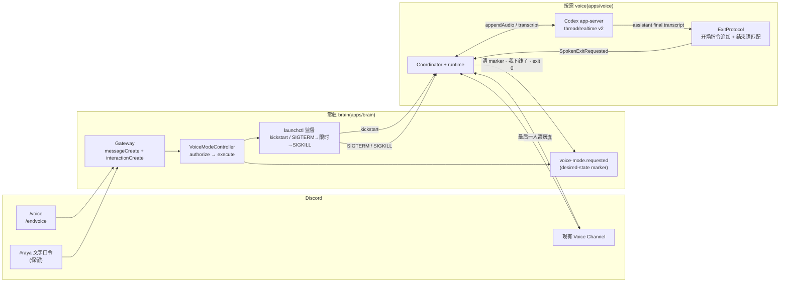

# FLY-2097 进/退语音模式的命令化 — 实施计划
Issue: FLY-2097 (https://linear.app/geoforge3d/issue/FLY-2097/raya语音-ux-进退语音模式的命令化进slash-command退自然语音说一句即退模型-tool-call-slash-兜底)
日期: 2026-08-27
基于: research.md(上游:exploration.md;协议 / Discord / 代码缝的事实全部以 research.md 为准)

**Status**: codex-approved(2026-08-27,5 轮;QA 返工方案 2026-08-28 APPROVED,见 §13)
**代码仓**: raya(`~/.flywheel/raya/worktrees/raya-FLY-2097`,分支 `fly-2097-raya-voice-ux`,base `origin/main` = `b7abff4`,PR 目标 raya `main`)
**文档仓**: flywheel(本文件夹;ship 时新建 `engineering/doc/milestones/FLY-2097.md`,不碰 `CLAUDE.md`)

## 0. 目标、非目标、假设、授权

### 0.1 目标(= issue 验收,逐条可真机核)

| # | 目标 | 真机怎么看见 |
|---|---|---|
| G1 | **slash 进入**:allowlist 用户在 guild 里用 `/voice` → 效果与文字口令完全相同 | 从 stopped、无 hold / recovery 的干净验收态启动:先见 brain 回话「🎙️ 正在进入语音模式」,再见 voice `DiscordReady` 公告「✅ 已进入语音模式，已连接现有 Voice Channel」;`launchctl print gui/<uid>/com.xrli.raya.voice` 出现 running + pid;bot 进验收房 `voice-test-3` |
| G2 | **自然退出**:语音里说「OK 我现在要退出了」这类明确意图 → 实时模型说结束语 → voice 干净拆除(清 marker、发下线一行、停 Codex、exit 0、不重拉),且她**听完**结束语 | evidence:assistant final transcript 命中、`spoken_exit_detected`、`voice_exit{code:0, reason:"spoken-exit"}`;launchctl `last exit code = 0`、60 s 后 `runs` 不变;marker 不存在 |
| G3 | **不误退**:「我不想退出这个话题」类的话照常聊;拿不准时先问一句 | 同一场:说反例句 → 无 `spoken_exit_detected`,session 仍 Live |
| G4 | **逃生门**:voice 健康 / 腿死 / **进程卡死** 三种状态下,`/endvoice` 与文字口令都能退,且回话如实(§6 V5 六格矩阵逐格核) | `kill -STOP <voice pid>` 后 `/endvoice` → 「正在退出」→ 超时 → SIGKILL 收敛(job 回到 not running)→ 「⚠️ 未响应,已强制结束」;launchd 重拉后 `run` 无 marker exit 0 |
| G5 | **兼容**:三句文字口令原样保留;near-miss 提示同时指向 slash | 文字「进入语音模式」仍可进;「帮我进入语音模式吧」回新提示 |
| G6 | **真机验收**留下证据(§6),unit test 只守回归 | 私有 QA 目录留原始音频/派生物；PR 只提交脱敏文字摘要与计数 |

### 0.2 非目标(各归其单 / 明确不做)

- 开场指令的**内容**(人设、议题)→ FLY-2030;本单只**追加**一段固定退出协议。
- 后台 dynamic tool `end_voice_session` → 不做(research §1.3–1.4:延迟十几秒起、多两个机制);探针配方留在 research §6 P3。
- `thread/realtime/stop` → 不用(现有 StopCodex 已是干净拆除)。
- 一条开关式命令、子命令、英文别名、localization、全局命令 → 不做(exploration Q1)。
- 打断、记忆恢复、v3、语音管道稳定性(1/6)→ 2074 / 2021 既定边界。
- installer / plist / contracts → 不改。

### 0.3 假设(每条带验法)

| # | 假设 | 验法 | 若假 |
|---|---|---|---|
| A1 | 实时语音模型(v2, `marin`)能照 `thread/realtime/start.prompt` 只说固定结束语 | research §8 阳性对照已证该通道改变模型行为；§6 仍跑真声 n≥5 | 阳性对照失败即 FAIL，不进入 S1；slash 与文字兜底照常 |
| A2 | bot 在 guild 已有 `applications.commands` | **已验**:PUT `[]` → 200(research §2.1) | 重邀 URL 加 scope(需 founder) |
| A3 | FLY-2030 尚未改 `apps/voice/src/cli.ts:startInstructions()` | `git log origin/main..fly-2030-raya-brain` | rebase,退出协议段仍以「追加」方式接在 2030 内容之后 |
| A4 | discord.js 14.26.4 的 `interactionCreate` 不需要新增 intent | 实施第一步跑一次真注册 + 真点击 | 加 intent(仍在最小集内) |
| A5 | 事件循环卡死可用 `kill -STOP` 稳定复现 | POSIX:SIGSTOP 不可捕获,JS handler 不会跑 | — |

### 0.4 授权记录

- founder 2026-08-27 15:11/15:17 PT:方案一,进=slash、退=自然语音+slash/文字兜底(issue 文本)✅。
- Lead 2026-08-27 17:20 PT:raya 仓独立 worktree;与 2030/2031/2032 并行;取消「等 batch 清完」的排期限制 ✅。
- **founder 已定命令名**(2026-08-27 页面批注,Lead 指令 `e648135f-acd8-44c9-a215-caa9c88a60b3`):进入 `/voice`,退出 `/endvoice`;自然语音退出不变。选择 `/endvoice` 而不是 `/voice end`,因为它是单层直接命令,手机上输入 `/e` 即可补全,不需再选一层 subcommand。
- **显式设计约束**:面向 founder 手机输入的 slash 命令必须**短、优先英文、单层即可完成关键动作**;以后新增命令不得默认回到长中文名或多层选择。
- **仍可一句话调整**(均为单处常量,改动不影响结构):① 退出确认策略(默认「明确直接退、含糊先问」);② 下线一行文案(默认「我下线了(语音退出)」)。

## 1. 架构总览



三道退出门,各自独立于「要退出的那个东西是否健康」:

| 门 | 谁执行 | 依赖什么活着 |
|---|---|---|
| ① 语音里说一句 | voice(实时模型判意图 → 管道匹配结束语) | voice 进程 + realtime 腿 |
| ② `/endvoice` / 文字「退出语音模式」 | brain(SIGTERM → 限时 → SIGKILL) | brain 进程(voice 可以死、可以卡) |
| ③ 离开 Voice Channel(2074 既有) | voice(HumanLeft + grace) | voice 进程 + Discord 腿 |

## 2. 模块与接口

### 2.1 brain `apps/brain/src/voice-mode.ts`

```ts
// 单处常量,founder 改名只动这里
export const VOICE_SLASH_COMMANDS = {
  start: { name: "voice", description: "进入语音模式：Raya 加入现有 Voice Channel" },
  stop:  { name: "endvoice", description: "退出语音模式（语音卡住时也能用的逃生门）" },
} as const;
export function slashCommandData(): ChatInputApplicationCommandData[]; // 两条,guild scope 不发 dmPermission,defaultMemberPermissions:"0"
// VoiceModeHandleResult 新增变体:"start_blocked_unsettled" | "stop_forced" | "stop_force_failed"

export interface VoiceModeActor { guildId: string | null; channelId: string | null; userId: string; isBot: boolean }
export type VoiceModeSource = "text" | "slash";

export class VoiceModeController {
  handle(message: VoiceModeMessage): Promise<VoiceModeHandleResult>;            // 文字:authorize(需 #raya)→ parse → execute
  handleInteraction(i: VoiceModeInteraction): Promise<VoiceModeHandleResult>;   // slash:authorize(guild 内任一频道)→ 映射 → execute
  private execute(command: "start" | "stop", actor: VoiceModeActor, reply: Reply): Promise<VoiceModeHandleResult>; // 两条入口共用
}

export interface VoiceModeInteraction {
  commandName: string; guildId: string | null; channelId: string | null;
  user: { id: string; bot: boolean };
  deferReply(): Promise<unknown>; editReply(content: string): Promise<unknown>; followUp(content: string): Promise<unknown>;
  replyEphemeral(content: string): Promise<unknown>;
}

export interface VoiceSupervisor {
  status(): Promise<"running" | "stopped">;                             // launchctl print 一次,running = state running + pid
  start(): Promise<VoiceStartResult>;
  stop(): Promise<"signaled" | "forced" | "force_failed" | "absent">;   // forced = SIGKILL 后 job 回到 not running;force_failed = 未收敛
}
```

行为合同:

| 情形 | 文字口令 | slash |
|---|---|---|
| 鉴权 | 现状不变:配置 guild + 配置 `#raya` + allowlist + 非 bot(QA allowlist 例外)+ 不是 Raya 自己 | `defaultMemberPermissions:"0"` 让 picker 默认只向管理员可见;运行时仍以配置 guild + allowlist + 非 bot(QA allowlist 例外)+ 不是 Raya 自己为最终边界;**不限频道**(逃生门不该要求先切到 `#raya`) |
| 未授权 | 忽略(现状) | `replyEphemeral("这个命令只有 Raya 的主人能用")`(3 s 内必须应答,否则 Discord 显示「应用无响应」) |
| 未知命令名 | — | 忽略 |
| start | 回话不变 + 新增拒绝态(见下「fail-closed 推导」):「🎙️ 正在进入语音模式」/「已在语音模式」/「⚠️ 已请求语音模式，但语音进程仍未运行」/「⚠️ 语音模式启动失败：…」/「⚠️ 语音进程正在退出或未收敛…」 | `editReply()` 同左一套回话 |
| stop | 清 marker(幂等)后**无条件**走梯子(不做 status gate,见下):「正在退出语音模式」/ `absent` →「当前未在语音模式」;**新增**:`forced` → 追加「⚠️ 语音进程未响应，已强制结束」;连续两次仍 `force_failed` / launchctl timeout → 明说「退出未完成、未确认已停止」 | `editReply("正在退出语音模式")` 与实际 stop 并行起步;即使回话失败也必须执行 stop;按结果 `followUp` 同左 |
| near-miss 提示 | 「要进语音模式请发：进入语音模式，或用 /voice」 | — |
| **ACK 与排队** | 整条消息处理入共享 `queue`(现状) | **ACK 不排队,动作排队**:静态鉴权(guild / allowlist / bot)与 `deferReply()` / ephemeral 拒绝在共享 queue **之外**立即执行;`deferReply()` 失败 → `onError`,**不入队**。只有 `execute()`(marker / launchctl / 最终回话)进入与文字口令共享的串行 queue —— 前一个 stop 占住队列 30 s 时,后来的 slash 已经 defer,不会「应用无响应」;其动作仍排队(避免旧进程 drain 时 kickstart) |

`createLaunchctlVoiceSupervisor(uid, run, options?)` 的 `stop()`(返回 `"signaled" | "forced" | "force_failed" | "absent"`):

```
先尝试 `print` 取 evidence(结果不作为 stop gate;失败也不能阻断逃生梯子)
→ kill SIGTERM → 每 1 s `print`,最多 stopGraceMs(默认 30,000;voice 最坏 drain ≈ announce 3×(5 s+1 s) + codex stop 2 s ≈ 20 s)
   → job 不再 running / 3 / 113 ⇒ "signaled"
   → `print` 抛错 / 超时 ⇒ 状态未知,继续轮询;grace 到期仍必达 SIGKILL
→ 超时仍 running ⇒ kill SIGKILL → 每 1 s `print`,最多 forceSettleMs(默认 10,000)
   → 收敛判据 = **job 已不在 running**(⛔ 「oldPid 消失」不够:KeepAlive 对 signal-exit 会先 rebound 一个新 pid,它因 marker 已清会很快 exit 0;若在它退出前就返回,排队的 start 会把 rebound pid 误读成 already_healthy,而它随即退出,留下「marker 在、job 停了、用户被告知已在语音模式」)⇒ "forced"
   → forceSettleMs 内 job 仍 running(旧 pid 或 rebound pid)⇒ "force_failed"(⛔ 不许回「已强制结束」)
```
只对固定 label `gui/<uid>/com.xrli.raya.voice` 操作,`execFile`,消息内容永不进 argv。每次 `launchctl` 调用有 5 s 硬超时(`SIGKILL` child + Promise deadline),不会永久占住共享 queue;stop 的 evidence / 收敛 `print` 失败按「未知、未收敛」处理,保证 SIGTERM→SIGKILL 阶梯不中断;`sleep` / 时钟注入以便测试。`"forced" / "force_failed"` 返回前 queue 不释放。

**fail-closed 不靠任何内存 / 持久 flag**(R3:flag 过不了 brain 重启),且**不把两次观察当原子**(R4:`status()` 快照与 marker 写/清之间,launchd 的 KeepAlive rebound 可以异步插进来;共享 queue 只串行 Discord 命令,冻结不了 launchd):

- **stop(两个入口同;desired-state-first,无 status gate)**:尝试清 marker 后**不论清理或 Discord 初始回话是否失败**,都执行 `supervisor.stop()` 全梯子(SIGTERM→限时→SIGKILL→收敛)。清 marker 首次失败会在第一轮 stop 后重试;一旦清理恢复,再跑一轮 stop 防 rebound。kill throw / `force_failed` 也自动重试一轮;连续失败才回「退出未完成、未确认已停止」。首个 evidence `print` 及后续收敛 `print` 均不准阻断 signal:失败视为未知,继续到下一阶段;SIGTERM 本身返回 3/113 才是 `absent`;`signaled` / `forced` 才能宣告已停止。中间插进来的 rebound 两种走向都收敛:它读到 marker absent 会自行 exit 0;还在跑就被梯子如实停掉。
- **start**:先 `status()`:
  - `running` 且 marker **存在** → 回「已在语音模式」(真健康,不 kickstart)。
  - `running` 且 marker **不存在** → **拒绝**:不写 marker、不 kickstart,回「⚠️ 语音进程正在退出或未收敛，请稍后再试或先用 /endvoice」。(该状态只来自正常 drain 中的旧实例或 SIGKILL 未收敛的卡死实例;顺带修掉现状「对 draining 实例回 already_healthy」的同形潜在 bug。)
  - `stopped` → 写 marker → **本分支永不回 `already_healthy`**(刚观察到 stopped,此刻任何「已在跑」都可能是 pre-marker rebound——它读了 absent、马上 exit 0,归因给本命令就是 R2 的误报)→ **有界启动重试**:至多 `startAttempts`(默认 2)次 [`kickstart -p` → 连续 2 次、间隔 1 s 的 `print` 都是 running 且 pid 稳定 ⇒ `launched`];`kickstart` 瞬时失败也消耗一次 attempt 后继续,观察期 pid 消失 / 翻转同样进入下一次尝试(新实例此时读到的 marker 已是 present,会成为真会话);用尽 ⇒ `requested_but_down`(落入既有 outage 可见面,回话如实)。

`startVoiceModeGateway(token, controller, options)`:
- 新 seam `options.registerCommands?: (client, guildId) => Promise<void>`,默认实现在 `clientReady` 后 `fetch({guildId})`,只对本单两条命令差量 `create` / `edit`;不删除、不覆盖同 app 的其他 guild command;
- 失败只走 `onError`(log),**文字口令不受影响**;
- 挂 `interactionCreate` → `isChatInputCommand()` → 适配成 `VoiceModeInteraction` → `controller.handleInteraction()`;
- `VoiceModeGatewayClient` 结构类型加 `on("interactionCreate")`、`once("clientReady")`、`application`;测试沿用假 client 注入。

### 2.2 voice `apps/voice/src/session/ExitProtocol.ts`(新文件)

```ts
export const EXIT_SENTENCE = "好，退出语音模式。";          // 让模型说的那句
export const EXIT_PROTOCOL_CLAUSE = `
【退出语音的规则】
- 用户明确表示要结束或退出语音（例如「我要退出了」「先到这里」「结束语音」「我们下次再聊」）时，你只回答这一句，不加任何别的内容：「${EXIT_SENTENCE}」
- 用户的话里有「退出」「结束」等字眼但意思不是要结束语音（例如「我不想退出这个话题」）时，照常回答，不要说那句话。
- 拿不准时，先问「要退出语音吗？」，用户确认后再说那句话。
- 除了上面的情况，任何时候都不要说出「退出语音模式」这几个字。
`.trim();

export function composeStartInstructions(base: string, enabled: boolean): string; // enabled ? `${base}\n\n${CLAUSE}` : base;长度仍由 transport 的 8,192 检查兜底
export function normalizeTranscript(text: string): string;  // NFKC → 去 Unicode P/S/Z 类字符 → 小写
export function isSpokenExit(assistantFinalText: string): boolean;
```

`isSpokenExit` = 归一化后匹配 **整句**:
```
^(好|好的|好吧|行|ok|okay|嗯|那|那我|那我们|我们|现在)*退出语音模式(再见|拜拜|下次见|回头见|回头聊)?$
```
只看 **assistant · final · 当前 session generation**。反例必须不命中:「退出语音模式的方法是…」「要退出语音吗」「退出语音模式之后你还记得吗」「我不想退出这个话题」、user 角色的同句、非 final delta。

### 2.3 voice `session/Coordinator.ts`

新增事件与动作:

```ts
| { type: "SpokenExitRequested"; sessionGeneration: number }
```
reducer:`phase ∉ {Live, Cooling}` 或 `sessionGeneration ≠ gen.session` → 只记 `RecordEvidence(staleEvent/unexpectedGeneration)`;否则与 `Sigterm` 同形:phase → Draining、busy.clear、expectedStop、动作 `[ClearVoiceModeRequest, Announce("我下线了(语音退出)", offline), StopCodex, Exit{code:0, reason:"spoken-exit", settleAs:"spoken-exit"}]`。
`Exit.settleAs` 扩成 `"held" | "spoken-exit"`。clean-exit reason 抽成一个共享类型 `CleanExitReason = "sigterm" | "planned-restart" | "held" | "spoken-exit"`,三处同步:`store.ts:27` 的 `StoredSession.lastCleanExit.reason`、`lifecycle.ts:101-105` `settleCleanExit()` 的参数、`runtime.ts:424-433` 把 `settleAs` 传给 `settleCleanExit` 的调用点(否则 typecheck 失败)。`lifecycle.test.ts` 断言 spoken exit:清 `activeRun`、写 `lastCleanExit.reason="spoken-exit"`、**不**追加 `restartHistory`。

### 2.4 voice `runtime.ts`

`wireTransport` 两处接线:

1. `outputAudio` 回调(现有)加一行:`generation === state.gen.session` 时记 `lastOutputAudioAt = now`(stale generation 不记)。
2. transcript 回调:
```
final && role==="assistant" && generation===state.gen.session && config.spokenExit.enabled && isSpokenExit(text)
  → evidence {kind:"spoken_exit_detected", generation}
  → scheduleSpokenExit(generation)   // 每个 session generation 只调度一次
```

`scheduleSpokenExit` 用**安静窗**(⛔ 不假设 transcript/done 一定晚于最后一个 audio delta——协议无此保证),并以**命中时刻为下界**(⛔ 否则 `lastOutputAudioAt` 未初始化或来自同代上一段回答时,第一次 poll 就会立即退出,结束语音频一毫秒 grace 都拿不到):

```
matchedAt   = 命中时刻(generation-scoped;可注入的单调毫秒时钟)
quietSince  = max(matchedAt, lastOutputAudioAt ?? matchedAt)   // 每个当前代 outputAudio 都更新 lastOutputAudioAt
每 100 ms 检查:downlink.depth() === 0  &&  (now − quietSince) ≥ graceMs
```

满足即 `send({type:"SpokenExitRequested", sessionGeneration})` —— 命中后**至少**等满一个完整 graceMs。当前 generation 的尾音会**重置**这个窗口(推迟退出,让她听完);stale generation 的音频不影响;新 session generation 重置全部状态。总上限 `drainTimeoutMs`(默认 5,000):到点无论安静窗是否满足都发事件并记 `{kind:"spoken_exit_grace_capped", depth}` —— 退出不许被音频流挂起,极端情况下的截音落在证据里。期间 `terminated` / phase 已 Draining → 放弃并记 `spoken_exit_cancelled`。定时器 `unref`,`finish()` 里清掉。
`graceMs`(默认 1,500)同时充当 PassThrough 缓冲(目标 5 帧 = 100 ms)+ Discord 播放延迟的余量;若真机 V3 出现截音,优先探 `thread/realtime/item/completed` 能否作更硬的 response fence(research §6 P4),不在本轮加机制。

### 2.5 voice `config.ts` / `cli.ts`

`RAYA_VOICE_OPTIONS_JSON` 新可选键:`spokenExitEnabled`(boolean,默认 true)、`spokenExitGraceMs`(非负整数,默认 1500)、`spokenExitDrainTimeoutMs`(正整数,默认 5000,且必须 `>= spokenExitGraceMs`)→ `config.spokenExit = {enabled, graceMs, drainTimeoutMs}`。
`cli.ts:startInstructions()` → `composeStartInstructions(base, config.spokenExit.enabled)`;`VoiceRuntimeConfig` 加 `spokenExit`。

### 2.6 Realtime 指令注入(QA 返工后)

`V2WebSocketTransport.start()` 仍不接 dynamic tool，也仍把 server request 当协议违规；唯一协议改动是把组合后的 `startInstructions` 从已证无效的 `realtimeStartInstructions` 字段移到已通过行为阳性对照的 `prompt` 字段。请求必须**不再发送** `realtimeStartInstructions`，也不依赖 `baseInstructions/includeStartupContext`。`packages/contracts`、`installer.ts` / plist、`AppServerClient`、音频热路径不改。

## 3. 数据 / 状态模型

```mermaid
classDiagram
  class SlashCommand { +name: "voice" | "endvoice" +description +defaultMemberPermissions="0" }
  class VoiceModeActor { +guildId +channelId +userId +isBot }
  class VoiceModeController { +handle(message) +handleInteraction(i) -execute(cmd, actor, reply) -queue }
  class VoiceSupervisor { +status() running|stopped +start() launched|already_healthy|requested_but_down +stop() signaled|forced|force_failed|absent }
  class Marker { voice-mode.requested {requestedAt, requestedBy} 0600 原子写 }
  class ExitProtocol { +EXIT_SENTENCE +EXIT_PROTOCOL_CLAUSE +composeStartInstructions() +isSpokenExit() }
  class Coordinator { phase: Live→Draining event SpokenExitRequested{sessionGeneration} actions: Clear·Announce·StopCodex·Exit(0,"spoken-exit") }
  class Evidence { spoken_exit_detected spoken_exit_cancelled voice_exit{reason:"spoken-exit"} }
  SlashCommand --> VoiceModeController : interactionCreate
  VoiceModeController --> VoiceSupervisor
  VoiceModeController --> Marker
  ExitProtocol --> Coordinator : SpokenExitRequested
  Coordinator --> Marker : clear
  Coordinator --> Evidence
```

## 4. 错误路径、安全、幂等

| 情形 | 处理 |
|---|---|
| slash 注册失败(403 / 网络) | `onError` 记一行;brain 不退出;文字口令照常;下一次 brain 重启再试 |
| interaction 3 s 内未应答 | `deferReply()` 在共享 queue **之外**立即执行(§2.1),不被前序 stop 拖住;deferReply 本身失败 → `onError`,**不入队**,结果 `ignored` |
| 未授权用户点命令 | ephemeral 拒绝(队列外);不写 marker、不碰 launchctl |
| Discord 初始 stop 回话失败 | 回话错误不阻断 effect;仍清 marker + 跑 stop 梯子;若已确认退出则 gateway 记录回话错误,不把它误报成 stop effect 失败 |
| marker 清理失败 | 仍先跑 stop;清理重试成功后再跑第二轮 stop 防 launchd rebound;仍失败则明确回「退出未完成、语音可能重新启动、未确认已退出」 |
| launchctl 调用卡住 / 抛错 | 单调用 5 s 硬超时;evidence / 收敛 `print` 失败视为未知且不阻断 SIGTERM→SIGKILL;kill 失败或最终不收敛时 controller 自动重试一次 stop 梯子;仍失败则明确回「退出未完成、未确认语音已停止」 |
| `forced`(SIGKILL) | 只对固定 label;**先证收敛再回话**:job 回到 not running(含 rebound 实例退出)才回「已强制结束」;marker 已清 ⇒ rebound `run` 立即 exit 0(现状合同)。之后的 `/voice`:marker 先写 → kickstart,正常起新 session |
| `force_failed` | forceSettleMs 内 job 仍 running:如实回「未能确认,请人工检查」。之后**无需任何 flag**:下一条 stop 无条件重试全梯子;下一条 start 因「running 且 marker 不存在」被拒绝、不写 marker(§2.1 推导;brain 重启也不改变行为) |
| 结束语命中但 phase 已 Draining / generation 过期 | reducer 记 evidence、不重复拆 |
| 同一 session 两次命中 | 只调度一次 |
| grace 期间 LegDown | LegDown 先把 phase 变 Draining ⇒ 调度到期时放弃,记 `spoken_exit_cancelled` |
| `base + clause > 8,192` | `parseVoiceConfig` 读取配置文件并校验**组合后**长度,run 映射为 config refusal exit 0、preflight 为 78,在启动 runtime 前 fail fast;transport 同一共享常量保留第二道 Raya 边界校验 |
| 用户文本 / 转写进入 shell | 不可能:launchctl argv 全是常量;匹配只在内存;回话文案是常量(错误信息沿现状) |
| Raya 自己的 bot id | 沿现状:两个 allowlist 都拒 |

## 5. TDD 分块(RED → GREEN → REFACTOR;⛔ 不承诺工期)

| 块 | 测什么(RED 先写) | 文件 |
|---|---|---|
| T1 | `slashCommandData()` 精确 guild payload(两条名、描述、`defaultMemberPermissions:"0"`;不发 guild command 上恒为 `null` 的 `dmPermission`);`parseVoiceModeCommand` 不变;hint 新文案 | `brain/voice-mode.test.ts` |
| T2 | `handleInteraction`:未授权 → ephemeral 且 supervisor 不被调;未知命令 → ignored;start/stop → `deferReply` 在 supervisor 之前、`editReply` 文案;**队列外 ACK**:前一个任务用未 resolve 的 promise 占住 queue 时,第二个 slash 的 `deferReply` 已发生而 supervisor 尚未被调;text/slash 的「正在退出语音模式」都在 30 s 轮询开始前可见;`deferReply` reject → 不入队;**fail-closed 推导(含模拟 brain 重启:新建 controller)**:job running + marker absent 时,stop 仍无条件调用 supervisor 全梯子;start 不写 marker、不 kickstart、回「正在退出或未收敛」而**不是** already_healthy;job stopped + marker present 时,stop 清 marker、梯子回 absent →「当前未在语音模式」;**rebound interleaving**:(i) stop 清 marker 后、梯子前注入 rebound-running → supervisor.stop 仍被调用且结果如实;(ii) start 的 stopped 分支注入 pre-marker rebound(观察期 flap)→ 绝不回 already_healthy,第二次 kickstart 后 pid 稳定 → launched;flap 用尽 → requested_but_down | 同上 |
| T3 | gateway:`clientReady` 后 `registerCommands` 收到精确 payload + guildId;注册抛错 → `onError`,随后 messageCreate 仍能 start;`interactionCreate` 接线 | 同上 |
| T4 | supervisor `stop()`:print 一直 running(同 pid)→ grace 后 argv 出现 `kill SIGKILL` → print 序列 `oldPid → 新 pid(rebound)→ not running` 时**只在 not running 后**返回 `forced`(rebound 仍 running 时继续轮询,不返回);初次 evidence print 抛错仍发送 SIGTERM;grace poll 持续抛错仍升级 SIGKILL;SIGKILL 后到 forceSettleMs 仍 running / 不可观测→ `force_failed` 且**无**「已强制结束」回话;第 2 次 print 即 not running → `signaled` 且无 SIGKILL;首个 kill 返回 113 → `absent`;kickstart 首次瞬时失败会消耗 attempt 并重试;sleep / 时钟注入 | 同上 |
| T5 | `ExitProtocol`:正例(标准句、带语气词、带中/英标点、带「再见」尾)/ 反例(解释句、问句、带后缀、user 角色);`composeStartInstructions` 只追加一次、disabled 不追加 | `voice/session/ExitProtocol.test.ts` |
| T6 | Coordinator `SpokenExitRequested`:Live → 精确动作序列与 `Exit{0,"spoken-exit"}`;Draining / 错 generation / RoomIdle → 只有 evidence | `Coordinator.test.ts` |
| T7 | runtime(假时钟):assistant final 命中 → 安静窗满足(depth 0 且 `now−quietSince ≥ graceMs`)→ marker 清、announce 文案、codex.stop、completion 0;**命中时无本轮音频 / 只有很旧的同代音频 → 仍从 `matchedAt` 起等满完整 grace,不许第一次 poll 就退**;grace 中又到当前代尾音 → 窗口重置、不提前退;stale-generation 音频 → 不影响当前窗口;到 drainTimeoutMs 上限 → 仍退出并记 `spoken_exit_grace_capped`;user 同句 → 无;delta → 无;grace 中 LegDown → 无二次 exit,记 cancelled | `runtime.test.ts` |
| T8 | config:三个新键默认值、非法值及 `drainTimeoutMs < graceMs` 拒绝;`CleanExitReason` 三处同步(store / lifecycle / runtime)通过 typecheck;`lifecycle.test.ts`:spoken exit 清 `activeRun`、写 `lastCleanExit.reason="spoken-exit"`、不追加 restartHistory | `config.test.ts` / `store.test.ts` / `lifecycle.test.ts` |
| T9(QA 返工) | RED 先断言 `thread/realtime/start` 请求含 `prompt: startInstructions`，且**不含** `realtimeStartInstructions`;仍拒绝 >8,192 字符；preflight 同样走 `prompt` | `voice/codex/RealtimeTransport.test.ts` / `preflight.ts` |

全仓门(raya):`pnpm lint` + `pnpm typecheck` + `pnpm build` + `pnpm test`(contracts + brain + voice 全跑,不只改动包)。flywheel 仓只有文档 + milestone:`pnpm lint` + 相关 `scripts/__tests__/*.test.sh` 文档守卫。

## 6. 真机验收(缺任一项保持 pending,⛔ 不用 mock 代替)

原始音频、Discord/OpenAI 派生物、完整 wire 与运行日志只留 `~/.flywheel/raya/qa/FLY-2097/` 私有 QA 目录，不入 git。QA 负责在报告中提交脱敏后的 transcript、计数、时间戳、head、命令与判定摘要；提交前扫描 `Bot <token>`、`sk-`、Discord token 形状及绝对敏感路径，并在报告写明扫描结果。音频不入仓。

**验收房固定为 `voice-test-3`(GuildVoice id `1542709028742893699`)** —— founder 确认的三个 voice-test 验收房之一,无权限限制(Lead 2026-08-27 指令 `3f2420f4`)。验收运行用**独立验收 env**:`RAYA_DISCORD_VOICE_CHANNEL_ID=1542709028742893699`(其余 key 同生产合同),⛔ 不改生产 `raya.env`、不动生产 `General`。

**eligible trial 定义**(语义门只在 eligible 样本上判):同一当前 session generation 内,evidence 里同时有完整的 user final transcript、assistant final transcript,且下行音频可听(独立耳朵或她本人确认)。管道自身失败(realtime 没起来、没有转写——2074 已披露 1/6 形状)**留在总尝试分母里单独披露**,不算语义门的分母,也不许拿它顶替 eligible 样本 —— eligible 样本不足就继续加场次。

**语义门(硬门,不达即 FAIL,不是「记个比例」)**:

进入 S1 前先跑**机制阳性对照**：在隔离 ephemeral session 的 `prompt` 放入“不论用户语言都只用英文回答”，启动后先留一个观察窗，断言输入前没有自发 assistant final、没有 `spoken_exit_detected`；再用中文 `appendSpeech` 提问，assistant final 必须是英文。失败则直接 FAIL 并留 app-server request + transcript 证据，不再消耗 S1 样本。该探针绕过 STT，只证注入通道，不替代真声语义门。

| 门 | 样本 | 通过标准 |
|---|---|---|
| S1 明确退出 | 5 个明确句(如「我要退出了」「先到这里」) | 5/5 恰好各拆除一次(evidence `spoken_exit_detected` + `voice_exit{0,"spoken-exit"}`) |
| S2 意图相反 | 3 个反例句(如「我不想退出这个话题」) | 0/3 误退,session 仍 Live |
| S3 含糊未确认 | 3 个含糊句,其中确认问句后答「不是」 | 0/3 误退;模型有问确认(转写可见)记为符合预期 |

| # | 步骤 | 留什么 |
|---|---|---|
| V1 | brain 重启后 `GET /applications/{app}/guilds/{guild}/commands` 列出两条命令;`#raya` 输入 `/` 看到补全 | curl 输出(去 token)+ 截图 |
| V2 | 从 stopped、无 hold / recovery 的干净验收态:`/voice` → brain 回话「🎙️ 正在进入语音模式」→ voice 公告「✅ 已进入语音模式，已连接现有 Voice Channel」→`launchctl print` running+pid → bot 进验收房 `voice-test-3` | print 输出、两条 message id |
| V3 | 语音里说「OK 我现在要退出了」→ **听完**「好，退出语音模式。」(不截音)→ bot 离房 →「我下线了(语音退出)」 | evidence jsonl(user/assistant final、`spoken_exit_detected`、无 `spoken_exit_grace_capped`、`voice_exit`)、print(`last exit code = 0`,60 s 后 runs 不变)、marker 不存在 |
| V4 | S1/S2/S3 全部样本(多场执行) | 每场的转写、有无 `spoken_exit_detected`、语义门计数,以及总尝试 vs eligible 的分母披露 |
| V5 | **逃生门矩阵 {slash, 文字} × {健康, 腿死, 卡死} 六格全跑**(与 G4 一致):健康 = 正常 stop;腿死 = **`kill -STOP` codex 子进程**(不触发 `onExit`,心跳 ~60 s 才判死 ⇒ 稳定的「腿不响应、voice 事件循环还活着」窗口;⛔ 不用 `kill -9`——它立刻触发 LegDown→exit 1,测的是恢复竞态不是逃生门)后立即发 stop;卡死 = `kill -STOP $(cat run/voice.pid)` 后发 stop → 「正在退出语音模式」→ ~30 s → SIGKILL 收敛(job 回到 not running)→「⚠️ 语音进程未响应，已强制结束」 | 每格:证据绑定**发命令时刻的 voice pid**、print(含 pid 变化 / `last terminating signal`)、回话 message、marker 状态;腿死格要求 clean exit 0、marker absent、stop 之前没有先出现 `voice_exit{code:1}`;卡死格必须证明「警告发出前 job 已回到 not running」 |
| V6 | 文字「进入语音模式」仍能进;「帮我进入语音模式吧」回新提示 | message |

## 7. 决策与取舍(带反面)

| 决定 | 反面(代价) |
|---|---|
| 口头合同而非后台 tool | 依赖模型照说固定句;遵从率只能真机量(P1),不遵从时靠兜底;founder 听到的「tool call」在实现上是「实时模型用一句固定话当工具」,要讲明 |
| 整句严格匹配 | 模型多说半句(「好，退出语音模式，我们下次聊！」)会漏匹配 → 只能靠兜底;可接受的漏比误退便宜(误退 = 丢这轮对话)|
| 明确直接退、含糊先问 | 模型判「明确」的边界由它定;founder 若不放心可切「一律先问」(指令一句话) |
| slash 不限频道 | 回话会落在她按命令的那个频道;状态行仍在 `#raya` |
| SIGKILL 升级默认 30 s | 卡死时逃生要等 30 s;太短会杀掉正在正常 drain 的 voice(announce 重试最坏 ≈ 18 s)。V5 卡死格会量出真实 drain 时长,再决定要不要收紧(forceSettleMs 默认 10 s 同理) |
| 结束语后 1.5 s grace | 多等 1.5 s 才断;不等则结束语可能被截 |

## 8. 风险

| 风险 | 缓解 |
|---|---|
| 模型在解释语境里说出结束语(尽管指令禁止)→ 误退丢对话 | 整句匹配 + 指令「任何时候都不要说这几个字」;真机 V4 专门试;若发生,再考虑 exploration Q2-D 的双门(先量再加)|
| 2030 同期改 `cli.ts` / 开场指令文件 | 本单只追加常量段,冲突面一个函数;以 main 为准 rebase |
| discord.js API 名字(`clientReady` vs `ready`、`MessageFlags.Ephemeral`)| 钉 14.26.4,T3 用类型编译兜;实施第一步真注册一次 |
| 生产 plist 仍指向 `worktrees/raya-FLY-2074` | 部署时必须重跑 `install-launchd`(2074 landing checklist);本单 milestone 写明 |
| 语音管道本身 1/6 成功率(2074 披露) | 不是本单能改;验收时多试几轮并如实记 n/N,不把管道失败算成本单失败,也不反过来 |

## 9. 明确不做(本单)

dynamic tool 路径、`thread/realtime/stop`、开关式 / 子命令 / 英文别名 / localization / 全局命令、slash 限频道、打断、记忆、installer / plist / contracts 改动、brain 重启机制。

## 10. 会过期的结论

| 结论 | as-of | 重核 |
|---|---|---|
| research §7 全部条目 | 2026-08-27 | 见 research §7 |
| clean-exit reason 联合分布在 `store.ts:27` 与 `lifecycle.ts:101-105` 两处(尚无共享类型) | raya `b7abff4` | `grep -rn '"sigterm" \| "planned-restart"' apps/voice/src/` |
| voice announce 最坏耗时 ≈ 3×(5 s + 1 s) | `config.ts` 默认 `announceRetryTimes=3`、`fatalDrainMs=5000`、`announceRetryGapMs=1000` | `grep -n announceRetry apps/voice/src/config.ts` |
| `thread/realtime/start.prompt` 是唯一实测可达的合同通道；`realtimeStartInstructions` 与 startup context 两路阳性对照均失败 | Codex 0.150.1，2026-08-28 | `$RAYA_CODEX_BIN --version`;按 research §8 用同版 transport 复跑英文阳性对照 + 输入前静默断言；binary path / symlink 变化即触发重核 |

## 11. 交付物

- raya PR(base `main`):代码 + tests;README「On-demand voice runtime」一段补 slash 与自然退出。原始 QA 证据不入仓。
- flywheel PR(base `main`):本文件夹(exploration / research / plan / qa-report / founder-design.html / diagrams / progress)+ 脱敏 QA 摘要 + 最后一个 commit 刷新 `engineering/doc/milestones/FLY-2097.md`。
- 不 merge、不 ship;merge 后部署仍走 `install-launchd` + 班车。

## 12. Codex design review 处理记录

### Round 1(2026-08-27,CHANGES REQUESTED,6 条)

| # | finding | 处置 | 落点 |
|---|---|---|---|
| 1 | slash ACK 会被共享串行队列(stop 最长 30 s)拖过 Discord 3 s 时限 | **接受**:ACK(鉴权 + deferReply / ephemeral)移出 queue,只有 `execute()` 入队;deferReply 失败不入队 | §2.1「ACK 与排队」、§4、T2 |
| 2 | `transcript/done + depth()===0` 证明不了结束语已播完(尾音可在 grace 中到达且不重置窗口) | **接受**:改为安静窗(depth===0 且当前代无音频 ≥ graceMs,尾音重置窗口;上限到点仍退出并记 `spoken_exit_grace_capped`) | §2.4、T7 |
| 3 | SIGKILL 后立即返回 `forced`,无收敛证明;后续 start 可能撞旧 pid | **接受**:stop 先记 oldPid;SIGKILL 后有界轮询收敛才 `forced`;否则 `force_failed` 且不回「已强制结束」(R2 又收紧一轮,见下) | §2.1、§4、T4、V5 |
| 4 | `spoken-exit` 未贯穿 `lifecycle.ts` 的 clean-exit reason 联合,typecheck 会挂 | **接受**:抽共享 `CleanExitReason`,store / lifecycle / runtime 三处同步;`lifecycle.test.ts` 入 T8 | §2.3、T8 |
| 5 | 真机验收无通过阈值;逃生门矩阵不全 | **接受**:定义 eligible trial + 语义硬门(S1 5/5、S2 0/3、S3 0/3;管道失败单独披露);V5 补成 {slash,文字}×{健康,腿死,卡死} 六格 | §6、G4 |
| 6 | `clause_length` evidence 是无 producer 的文字合同 | **接受(取删除方案)**:删除该承诺,沿现有 StartFailed 错误信息 | §4 |

### Round 2(2026-08-27,CHANGES REQUESTED,3 条)

| # | finding | 处置 | 落点 |
|---|---|---|---|
| 1 | 「oldPid 消失」仍不足以判 forced(rebound pid 会被排队 start 误读成 already_healthy 后随即退出);`force_failed` 无可执行的重试 / start fence | **接受**:forced 收敛判据改为「job 回到 not running」;`force_failed` 进入 fail-closed 态(后续 start 不写 marker、后续 stop 跳过 marker-absent 短路真正重试,收敛清 flag);class diagram 补 `force_failed` | §2.1、§4、T2、T4 |
| 2 | 安静窗没有以命中时刻为下界,`lastOutputAudioAt` 未初始化 / 旧回答时间戳会让第一次 poll 就退 | **接受**:`quietSince = max(matchedAt, lastOutputAudioAt ?? matchedAt)`,generation-scoped,单调时钟注入;T7 加「命中时无本轮音频仍等满完整 grace」 | §2.4、T7 |
| 3 | 腿死格用 `kill -9` codex 子进程会立刻触发 LegDown→exit 1,与 stop 竞速,非确定 | **接受**:腿死注入改为 `kill -STOP` codex 子进程(不触发 onExit,心跳 ~60 s 才判死,窗口稳定);证据绑定发令时 voice pid,要求 clean exit 0 且 stop 前无 `voice_exit{1}` | §6 V5 |

### Round 3(2026-08-27,CHANGES REQUESTED,1 条)

| # | finding | 处置 | 落点 |
|---|---|---|---|
| 1 | `force_failed` 的内存 flag 过不了 brain 重启:重启后 start-first 会把旧卡死 job 误报 already_healthy,stop-first 被 marker-absent 短路放过 | **接受(取「无新状态机」方案,净删一个机制)**:删掉内存 flag;stop / start 每次从 `status()` + marker **实时推导**——stop 永远按真实 job 状态走全梯子(删除 marker-absent 短路);start 在「running 且 marker 不存在」时拒绝且不写 marker(顺带修掉现状对 draining 实例回 already_healthy 的同形潜在 bug);supervisor 新增只读 `status()` | §2.1、§4、T2 |

### Round 4(2026-08-27,CHANGES REQUESTED,1 条)

| # | finding | 处置 | 落点 |
|---|---|---|---|
| 1 | `status()`+marker 两次观察不是原子:launchd rebound 可插在中间——start 会把 pre-marker rebound 误归因成 already_healthy(它随即 exit 0),stop 会在 status=stopped 后清 marker 却漏停插进来的新实例 | **接受**:stop 改 desired-state-first(清 marker → **无条件**梯子,删掉 stop 侧 status gate——又净删一个观察);start 的 stopped 分支**永不回 already_healthy**,改为有界 kickstart-观察重试(pid 连续稳定才 launched,flap 换下一次尝试,用尽 → requested_but_down);class diagram 补 `status()`;T2 补两条 rebound interleaving 用例 | §2.1、§4、T2、§3 |

### Round 5(2026-08-27,**APPROVED**,1 条 advisory)

| # | finding | 处置 |
|---|---|---|
| 1 | [ADVISORY] 新控制流下 supervisor 层 `start()` 的 `already_healthy` 分支已无合法 caller | **接受**:实施时 repo sweep 确认无其他消费者后,从 `VoiceStartResult` union 删除该分支,只保留 controller 层的 `already_started`(不阻塞批准) |

### 设计定稿后的修订记录(post-approval)

| 日期 | 修订 | 来源 | 复核 |
|---|---|---|---|
| 2026-08-27 | §6 验收房从「现有 General」钉为 `voice-test-3`(独立验收 env 指它;不改任何机制) | Lead 指令 `3f2420f4` + 问题 `02a6a1d6` 答复「写进 plan 验收判据,用独立 env 指它」 | Codex R6 **APPROVED**(blob `ab2dea49`) |

### Round 6(2026-08-27,**APPROVED**,post-approval 修订复核 + 1 条 advisory)

| # | finding | 处置 |
|---|---|---|
| 1 | [ADVISORY] 验收证据须(不含密钥地)记录固定 launchd label 与独立验收 env 的临时绑定方式,若临时改绑生产 label,teardown 必须恢复并验证原生产 plist/env 路径后才可宣告 V1–V6 完成 | **接受**:并入 §6 验收证据要求,交实施/QA 节点执行 |

> 附:评审期间 Codex 曾在 raya worktree 写入 417 行未经要求的 RED 测试(与本 plan T1/T2 对应);已存为 `appendix-codex-red-tests.patch` 供实施节点选用,worktree 已恢复干净。该 patch 保留的是 founder 定名**之前**的中文 slash 名称,只可参考测试形状,不可按当前设计原样应用;当前权威名称是 `/voice` / `/endvoice`。该行为与其各轮「两个工作树均未修改」的自述不符,已向 Lead 披露。

## 13. QA 返工方案(2026-08-28，design/code review 均 APPROVED)

### 13.1 触发

QA 在 candidate `46b5b6b` 上测得 S1 0/5，并用 251 条 wire 消息证明 `realtimeStartInstructions` 从未进入 OpenAI Realtime 模型上下文；详见 `qa-report.md` §2。`baseInstructions + includeStartupContext=true` 的返工阳性对照也失败。只有 `thread/realtime/start.prompt` 在相同控制变量下改变了模型行为，且绕过 STT 的 `appendSpeech` 设计小样本为明确意图 3/3 哨兵、反例 0/1 哨兵、话题含糊 0/1 哨兵(research §8)；它不抬高真声 5/5 门的预期。

### 13.2 最小代码改动

1. 先改 `RealtimeTransport.test.ts`：期望 start RPC 精确含 `prompt: "简短回答。"`，并断言 params 不含 `realtimeStartInstructions`。
2. `V2WebSocketTransport.start()` 只把现有 `options.startInstructions` 映射为 `prompt`；语音、版本、transport、generation、超时与 8,192 边界均不变。
3. `runVoicePreflight()` 继续通过同一个 transport API 注入 preflight 指令；复核它不自发产出 assistant 回话，并记录改道前后的耗时/usage，不另开协议分支。
4. O1 文案小修：`requested_but_down` 只陈述观测事实，并给 founder 可操作的条件提示——「已请求，但暂未观测到语音进程运行；若刚强制结束过，请约 1 分钟后再确认。」不声称代码已辨认出 launchd 冷却，不延长启动预算、不改 supervisor 状态机；补精确文案测试，交 QA 复核该格用户可见文案。
5. brain 只改上条 start 回话常量；`createLaunchctlVoiceSupervisor`、slash ACK/注册、stop 逃生梯子及其文案全部不动。voice 的 ExitProtocol 匹配器、Coordinator、安静窗、marker、clean-exit 合同也不动。
6. 保留 `startInstructions` / `composeStartInstructions` / `MAX_REALTIME_START_INSTRUCTIONS_CHARS` 名称：它们描述「Realtime 会话启动时使用的指令」而非 wire 字段名；全量重命名与本次一字段修复无关。发送点测试负责证明 wire 上只有 `prompt`、没有死字段。

### 13.3 验证与返工边界

- 代码门：目标 RED→GREEN 后跑 raya `pnpm lint && pnpm typecheck && pnpm build && pnpm test`。
- 机制门：QA 先复跑英文阳性对照，再重跑真声 S1/S2/S3；S1 仍须 5/5。
- 判定门：现有 `isSpokenExit()` 继续用 NFKC + 标点/空白归一化后的**整句 envelope**，容忍既定语气前缀与告别后缀；不退化为原串精确相等，也不放宽成危险子串命中。
- 返工若 `prompt` 阳性对照失败，不回退到用户转写关键词匹配；重新研究 Codex 协议或走 Lead 问题门。
- `prompt` 是 Codex 0.150.1 当前 schema 下唯一实测可达通道；不为未来 direct `session.update` / custom tools 留 TODO。升级 Codex 后按 research §8 重跑判别实验再决定是否改道。
- milestone 与 progress 在新 Raya head、测试数、code review verdict 均确定后再刷新；Raya PR 仍为 #3，Flywheel 文档 PR 仍为 #973。

### 13.4 Rework design review Round 1(2026-08-28，APPROVED)

Review question `da702ea6-ce7f-4859-a624-1f0c0e4eb2c8`，`reviewVerdict=APPROVED`。MEDIUM/LOW advisories 均不阻塞；本计划已吸收：Codex 漂移重核表、证据脱敏边界、纯观测 O1 文案、输入前静默断言、STT 边界说明、preflight 影响与命名取舍。其余实现按 §13.2 进入 TDD。

### 13.5 Rework code review Round 1(2026-08-28，APPROVED)

Review question `135e6638-1a97-4dd1-88ba-3bb0d6585976`，精确 reviewed head raya `4a67508a86f2b12ee010f643fc4780901b8670fc`，`reviewVerdict=APPROVED`。四条 MEDIUM/LOW advisory 均不阻塞本次返工：stop 成功但 initial reply 失败时缺少 follow-up 回执、start 的 launchctl status 异常可能不保留 desired-state marker、`force_failed` 二次完整梯子会放大最坏退出延迟、spoken-exit near miss 缺少独立 evidence row。已按 runner 合同原样报 Lead，由 Lead 决定 merge 后 follow-up；本单不扩大 Raya 变更面。
