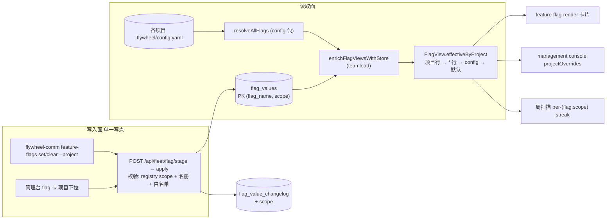

# FLY-2100 flag_values 加范围列(逐项目 flag 存值) — 实施计划

Issue: FLY-2100 (https://linear.app/geoforge3d/issue/FLY-2100/flaga地基-flag-values-加范围列全项目-项目名逐项目-名册-scope-生效-解析顺序-项目默认-管理台按项目读-db)
日期: 2026-08-27
基于: research.md

## 0. 范围与假设

**做**(Batch 1 / A 单,无依赖;C 单依赖本单):
1. `flag_values` / `flag_value_changelog` / `flag_scan_state` 加 `scope` 列
   (`'*'`=全项目,projectName=逐项目),`flag_values` / `flag_scan_state` PK 扩为
   `(flag_name, scope)`,存量行迁 `'*'`。
2. registry 的 `scope: bridge_global | project` 生效为写入约束(bridge_global 拒项目行 400)。
3. 解析顺序 项目行 → `*` 行 → config.yaml(本单 byte-compat 双读)→ registry 默认;
   `FlagView.effectiveByProject` 经 DB 叠加计算。
4. 管理台 flag 卡「按项目」行读 DB + 「项目」下拉设值/清值;CLI `feature-flags set/clear`
   带 `--project`(缺省 `'*'`;`apply` 保留为 `set` 别名)。
5. changelog / 审计带 scope;周扫描对逐项目 flag 按 (flag, scope) 计稳定 streak。

**不做**:不新增任何 flag;不删 config.yaml key 或其读路径(C 单);不动 env flag 存值面
(B1/B2);不动任何运行时消费点(Blueprint / scheduler 仍读 config.yaml);不给新
management console 加写路径(其显示自动跟上,写指路 CLI)。

**关键假设**(实现前如与 Epic FLY-2099 定案冲突,以 Epic 为准并上报):
- A1. 逐项目可写白名单 `PROJECT_STORE_MANAGED_FLAGS` =
  `{doc_flow, pipeline_dag, pipeline_work_kind, proofshot, xiaohongshu_learning}`
  (排除理由见 research §2;验收只硬性要求 doc_flow 可写 + mailbox_queue 被拒)。
- A2. scoped 行「写时才建、set 写显式值、clear 即删行」;6 个 global env flag 的 `'*'`
  行语义逐字节不变。
- A3. 本单存在「管理台显示 DB 值、runtime 仍按 config.yaml」的分歧窗口,管理台以黄标
  明示,不掩盖(C 单收口)。

## 1. 数据流(目标态)

## 2. 实施步骤(TDD;每步 RED → GREEN)

### Step 1 — config 包:策略 + 纯解析(无 SQLite 依赖)
- `store-policy.ts`:加 `PROJECT_STORE_MANAGED_FLAGS`;`getFlagStoreCodec` 覆盖 5 个
  project flag(按 polarity 复用 optIn/defaultOn codec);新增
  `validateProjectStoreEnrollment()`(成员形状校验:project + bool + 非 governance +
  非 dormant + 非 readonly + configKey 无 `[]`/`*` + 有 codec);
  `validateFlagAuthoringPolicy` 216-219 的 project_config 禁令改为「必须入
  PROJECT_STORE_MANAGED_FLAGS」。
- `resolve.ts`:`FlagEffectiveByProject` 加可选 `via`;新增纯函数
  `resolveScopedEffective`(项目行 → `*` 行 → configRow 兜底)。`resolveFlag` 本身不变。
- 测试:`feature-flags-store-policy.test.ts` 扩(白名单形状、authoring gate 新口径);
  新 `feature-flags-scoped-resolve.test.ts`(三级顺序、项目行压 `*` 行、`*` 行遮蔽
  config、无行回落 config、config 缺回落默认、via 标注)。

### Step 2 — StateStore:迁移 + CRUD
- `migrateFlagValueStore`:幂等 rebuild(research §1.1;事务内);changelog
  `addColumnIfMissing` scope + 新索引;`migrateFlagRetirementScan` 同款 rebuild
  `flag_scan_state`。
- `ensureFlagValueRows`:身份断言扩(`'*'` 行 ∈ STORE∪PROJECT 集;非 `'*'` 行 ∈
  PROJECT 集);seed/recovery 仍只管 6 个 global 行;SQL 补 scope。
- `applyFlagValueChange(args + scope)`:global 路径逐字节不变;project 路径支持
  expectedRevision=0 的 INSERT、CAS UPDATE、clear=DELETE + changelog(to_effective=
  调用方传入的回落值);`getFlagValueRow(name, scope)`、`listFlagValueRows(name)`。
- 测试:`StateStore.flag-value-store.test.ts` 扩 —— 旧库(无 scope 列 + 6 行)开新
  StateStore 后:PK=(flag_name,scope)、6 行 scope='*'、changelog 保留、二次启动幂等;
  INSERT/UPDATE/DELETE 路径 + CAS 竞争(stale_revision)+ 身份断言拒未知组合。

### Step 3 — flag-routes:scope 写入约束
- `FlagStoreCanonical` + `scope`/`op`;`handleFlagStage` 校验链(research §4.1:
  bridge_global+项目行→400;project flag 必须 ∈ 白名单;scope ∈ {'*'}∪名册;
  clear 忽略 to);`handleFlagApply` 重复服务端校验后透传。
- plugin.ts 挂载处把 `projectNames: () => managementProjects.map(p=>p.projectName)`
  注入 flagRouteDeps。
- 测试(flag-routes 测试文件):`mailbox_queue` + project=flywheel → 400;
  `doc_flow` + project=flywheel set on → 行 (doc_flow, flywheel, raw "1");
  `doc_flow` + project='*' set off → 行 (doc_flow, '*', raw "0");unknown project →
  400 带名册;`checkpoint_enabled`/`ponytail`/`xiaohongshu_auto_create` 任意 scoped
  写 → 400;clear 删行 + changelog to_effective=回落值;bypass → 409;stage 后行被
  第三方改 revision → apply 409。

### Step 4 — enrich 叠加 + 卡片渲染
- `enrichFlagViewsWithStore(views, runtime, projectNames?)`:project 白名单 flag 在
  ready 模式重算 `effectiveByProject`(调 `resolveScopedEffective`),打
  `projectStoreManaged: true`;DB≠config 的行标注;bypass 不叠。
- `feature-flag-render.ts`:项目行 via 小标 + 分歧黄标(「runtime 按 config.yaml,
  C 单切换」);`projectStoreManaged` 卡加「项目」`<select data-ffp-scope>` +
  值 `<select data-ffp-value>`(on/off/清除);phone 报告脚本
  (feature-flag-report-html.ts)把变化拼成 `feature-flags set/clear … --project …`
  命令行;console 页脚本(FleetConsole 接线处)POST 带 project/op。
- management-existing-writers.ts:project override 的 readonly reason 文案指路 CLI。
- 测试:flag-store-runtime.test 扩(叠加顺序、bypass 回落、非白名单不叠);
  render 测试断言 via 标 / 黄标 / 下拉 markup / phone 命令行拼串。

### Step 5 — CLI set/clear
- `feature-flags set|clear`(research §4.2;`apply` 别名保留);usage 写清两种
  `--project` 语义差异。
- 测试:CLI 测试扩 —— set/clear 组包(body 带 project/op)、clear 必带 --project、
  别名兼容、非 0 退出码传递。

### Step 6 — 周扫描 per-scope
- `FlagScanState` + scope;`computeFlagScan` 逐 scope 推进(research §6;候选仍
  flag 级 min-over-scopes,anchor 语义不变);StateStore upsert 冲突键改
  `(flag_name, scope)`;扫描报告对 project flag 附 per-scope 稳定天数行。
- 测试:`feature-flags-scan.test.ts` 扩 —— 项目 A 变值不重置项目 B streak;
  min-over-scopes 触发时机与旧向量 canonical 等价(同输入序列对拍);名册 mismatch
  仍整 flag indeterminate;旧 state 迁移后 scope='*' 行接续 streak(global flag
  不因迁移重置)。

### Step 7 — 全仓自验 + 真 Bridge 验收
- `pnpm lint` + `pnpm -r build` + `pnpm test:packages:run`(全仓,FLY-224/248 教训)。
- 真 Bridge(隔离 HOME,勿用生产 9876;记忆:sandbox 跑 restart-services 会杀生产
  Bridge,必须 export BRIDGE_URL 到空闲端口):
  - `doc_flow` 写 `--project flywheel --to on` + `--project '*' --to off` →
    `GET /api/fleet/flag-report.html` 与 snapshot 中 flywheel=ON、其余项目=OFF
    (`*` 行遮蔽 config),via 标正确;
  - `mailbox_queue --project flywheel` → 400;
  - clear flywheel 行 → 回落 `*` 行;clear `*` 行 → 回落 config;
  - 管理台截图(浅色)附 QA 报告。

## 3. 验收 ↔ 步骤映射

| 验收项 | 步骤 |
|---|---|
| PK 迁移单测 | Step 2 |
| scope 名册校验 | Step 3 |
| bridge_global 拒项目行(mailbox_queue) | Step 3 |
| 三级取值顺序 | Step 1(纯函数)+ Step 4(叠加) |
| 双读回落 | Step 1/4 |
| 真 Bridge doc_flow 一致性 + 管理台截图 | Step 7 |
| changelog/审计带 scope | Step 2/3 |
| 周扫描 (flag, scope) 稳定天数 | Step 6 |

## 4. 风险与回滚

- **迁移风险**:rebuild 在事务内,失败即回滚整库不动;哨兵幂等,重启重试安全。
  逃生:`FLYWHEEL_FLAG_STORE=0`(bypass)让 Bridge 完全绕开 flag store 起动
  (现有机制,不新增)。
- **显示/行为分歧窗口**(假设 A3):黄标明示;QA 报告如实写「runtime 行为未变」。
- **回滚**:本单纯加性(新列默认 '*'、新子命令、旧路径 byte-compat);revert PR 即回滚,
  已写入的 scoped 行在回滚后不被旧代码读(旧代码按 flag_name 单行读会因 PK 变化报错 ——
  故回滚须整 PR revert 含迁移,或接受 bypass 模式过渡)。此点在 PR body 注明。
- **孤儿行**(项目移出名册):不参与解析、不显示、留审计;不自动删。

## 5. 交付物

- 代码 + 测试(Step 1-6),全仓门禁绿(Step 7)。
- QA 报告含管理台浅色截图 + 真 Bridge 验收记录。
- milestone 新文件 `engineering/doc/milestones/FLY-2100.md`(PR 最后一 commit,
  不碰 CLAUDE.md)。
