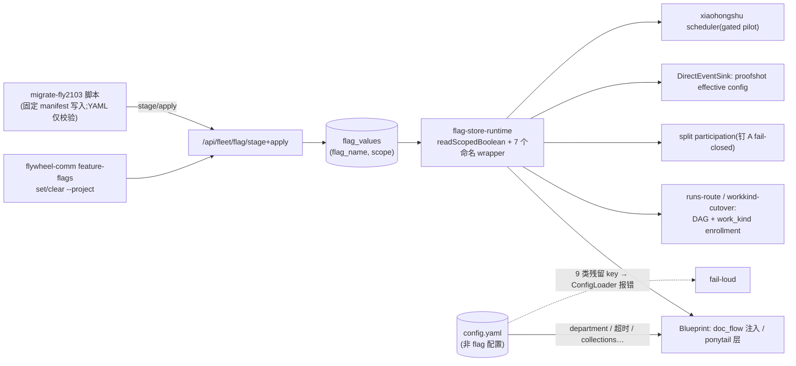
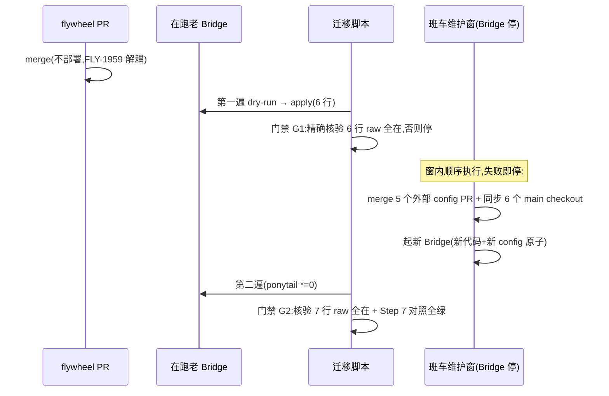

# FLY-2103 config.yaml flag 退役(Batch C) — 实施计划
Issue: FLY-2103 (https://linear.app/geoforge3d/issue/FLY-2103/flagcconfigyaml-退役-9-个-project-config-flag-处置checkpointsenabled)
日期: 2026-08-28
基于: research.md(9 flag 读点归宿逐个实查;exploration.md 四条裁决 D1-D5)

**Status**: draft
**Branch**: flywheel-FLY-2103(已在);PR base = main

## 0. 范围与裁决(定稿,详证据见 exploration/research)

**做**:
1. **固化删(2)**:`checkpoint_enabled`(声明即启用)、`xiaohongshu_auto_create`(写死 true)——
   registry spec 直删、无 tombstone(FLY-2101 D1 先例)、`LEGACY_UNMANAGED_BASELINE` 9→7。
2. **迁 DB 运行时真源(7)**:doc_flow / pipeline_dag / pipeline_work_kind / proofshot /
   xiaohongshu_learning / ponytail / skill_framework_split_participation ——
   `PROJECT_STORE_MANAGED_FLAGS` 5→7;全部读点改 **call-time store lookup**(项目行 → `*` 行 →
   registry default);删 A 单 config 回落路(`runtimeDivergence` 黄标一族)。
3. **一次性迁移脚本**(幂等、默认 dry-run,写侧走 Bridge stage/apply,读侧 raw yaml + 只读快照)。
4. **config.yaml**:6 个项目删 9 类 key(flywheel 在本 PR;5 个外部 repo 各一 PR);ConfigLoader
   对残留 key 逐 key fail-loud 报错。

**关键裁决**(评审重点,可否决):
- **D1/P2**:ponytail 激活 call-time store 读(`*`=false 行为中立,ponytail.ts:116 字节等价已证),
  spec 删 `dormant`、readonly→conversational;授权门一字不改。FLY-615 per-issue 路不动。
- **D2**:split_participation readonly→conversational(config 杠杆死后 CLI 是唯一杠杆);fail-closed
  钉 A 合同保留。
- **D3**:pipeline_dag registry default false→true(polarity default_on)—— 对齐 FLY-1981 运行时
  「absent=DAG-on」真相;否则 5 个项目 DAG enrollment 静默关闭。显示层 5 项目 false→true 是
  修正显示谎言,行为零变化。
- **D5**:7 个迁移 spec 保留 `source: "project_config"` + `configKey`(名册身份/拒绝信息锚点),
  readSites 全改 delegated flag-store-runtime 命名 wrapper。

**不做**:不动 6 个 global env store flag;不动 checkpoints 超时/agents/roles/linear 等非 flag config;
不动 FLY-615 per-issue ponytail label 路;不动 skill_framework_mode(FLY-1834 结账时连 split 一起删);
不给 scheduler 脚本装 plist;不改 flag 级退役扫描语义(spec 删除走既有 departure 机制)。

## 1. 目标数据流

## 2. 实施步骤(TDD:每步 RED → GREEN;全程 progress.md 记账)

### Step 1 — config 包:registry / store-policy / resolve(纯函数层先行)
- registry.ts:删 checkpoint_enabled、xiaohongshu_auto_create 两条 spec;pipeline_dag
  `polarity: default_on, default: true`;ponytail 删 `dormant`、note 改写;ponytail + split
  `toggleable: "conversational"`;7 条 spec readSites → delegated
  (`resolverModule: flag-store-runtime.ts`,resolverSymbol 一 flag 一名,见 Step 2)。
- store-policy.ts:`PROJECT_STORE_MANAGED_FLAGS` +ponytail +skill_framework_split_participation;
  `LEGACY_UNMANAGED_BASELINE` 删两个固化名(9→7,FLY-2101 先例;7 个迁移名保留 —— FLY-2100 先例,
  baseline 是历史 maximum ledger,成员迁 store 后条目惰性)。授权门与 codec 映射**零改动**
  (新成员按 polarity 落入现有 optIn/defaultOn codec;门的 project 分支对改后 spec 如实通过 ——
  RED 先证:改 spec 前门必红,改后必绿)。
- resolve.ts:删 `FlagResolveCtx.projectConfigs` / `resolveConfigValue` / project 分支 config 遍历 /
  `runtimeConfigValue|runtimeConfigError|runtimeDivergence`;`resolveScopedEffective` configRow 参数
  → `default` 兜底(项目行 → `*` 行 → registry default,`via: "default"`);dormant 分支与 `getByPath`
  零引用则删(dead-code 清单列 PR body)。
- 测试:授权门双向(RED:ponytail 未改 spec 入集必红;GREEN:改后过);三级取值(项目行压 `*`、
  `*` 压 default、无行落 default);pipeline_dag 翻转后 default=true;resolve 不再接受/需要
  projectConfigs(编译期)。

### Step 2 — flag-store-runtime:scoped 运行时读族
- 新增 `readScopedBoolean(runtime, name, projectName)`:断言 `PROJECT_STORE_MANAGED_FLAGS.has(name)`;
  `getFlagValueRow(name, projectName)` → `getFlagValueRow(name, "*")` → registry default;有行则
  codec.parse({hasOverride:true, raw})。**不吞错**:store 抛错向上抛,fail-closed 语义由各读点定
  (与 global readBoolean 同纪律)。
- 7 个命名 wrapper(与 registry resolverSymbol 一一绑定):`storeDocFlowEnabled` /
  `storePipelineDagEnabled` / `storePipelineWorkKindEnabled` / `storeProofshotEnabled` /
  `storeXiaohongshuLearningEnabled` / `storePonytailEnabled` / `storeSkillFrameworkSplitParticipation`
  —— 全部 `(runtime, projectName)` 签名。
- `enrichFlagViewsWithStore`:configRow 兜底删(names 必须来自 projectNames 入参),
  runtimeDivergence 数据删;scopedStore / valueClocks 逻辑不动。
- 测试:三级取值经 wrapper;无行 default(含 pipeline_dag=true);enrich 不再产出黄标字段(编译期+
  运行期);store 抛错上抛。

### Step 3 — 读点逐个切换(每个读点独立 RED→GREEN)
1. **Blueprint doc_flow**:构造参数 `docFlowConfig` 同位改为
   `docFlowDept?: { default_department?: string }` + 尾部新增 `docFlowEnabled?: () => boolean`
   (positional ctor,新参加尾);:1991 条件改 `this.docFlowEnabled?.() === true`;department 缺失
   warn-skip 路保留。run-infra 组 closure(flagStore 缺席 → undefined → 注入关,fail-closed)。
2. **Blueprint checkpoint**::2294 `if (!cpConfig.enabled) continue;` 删;`CheckpointConfig.enabled` 删。
   测试:声明即启用;(shape 变化)无 enabled 的声明 checkpoint 也启用。
3. **pipeline enrollment(全部四个调用面,Codex R1 #3)**:pipeline-config-source.ts 重写为
   store 版 `readPipelineEnrollment(flagStore, projectName): WorkKindConfigResult`
   (`work_kind_requires_dag` 组合校验保留)。调用面逐个换 + 各自回归用例:
   - runs-route.ts:2116(fresh master dispatch,`loadWorkKindConfigStrict`);
   - **runs-route.ts:1895(active DAG recovery,`loadPipelineConfigByProject([proj])`)**——漏改会把
     恢复中的 DAG run 置 held;store 版必须同时服务 recovery 路径,签名带可注入 reader 供测试;
   - workkind-cutover.ts:784(`readFly1436ActivationEvidence` 的 preflight)——同样注入 reader,
     保住 cutover preflight 的可测性;
   - `reconcileDefaultDagCategoryBindings`(boot)。
   四处全绿后 yaml 解析路 + `loadPipelineConfigByProject` 才删(零引用复核列 PR body)。
   测试:无行 → dag on / work_kind off;行组合 dag=0+wk=1 → 拒;项目行压 `*` 行;store 错 →
   fail-closed;**active recovery 在 store 版下恢复(不 held)**。
4. **split participation**:skill-framework-participation.ts 整删;run-infra:1077 改传
   `(projectName) => storeSkillFrameworkSplitParticipation(flagStore, projectName)`;Blueprint catch →
   钉 A + warn 合同不动(现测试改造为 store 注入形)。
5. **proofshot(authoring 形状与 runtime 形状拆开,Codex R1 #4)**:`ProofShotConfig.enabled`
   目前同时是 YAML authoring 类型、`DEFAULT_PROOFSHOT_CONFIG`、`persistProofShotConfig` 持久化
   形状、和 proofshot-trigger.ts:208-223 的 kill-switch 读点 —— **runtime/session 形状的
   `enabled` 保留**(session_params 已持久化数据 + trigger 门控不动)。只动 authoring 侧:
   ConfigLoader 拒 YAML 的 `skills.proofshot.enabled` key;DirectEventSink 构造尾部加
   `proofshotEnabled?: (projectName) => boolean`,emitStarted 组装 effective config 时 `enabled`
   取 store call-time 值再持久化。测试:持久化的是 store 值;trigger 仍按持久化值门控;
   不靠删共享字段后的编译错误来发现语义缺口。
6. **ponytail**:run-infra 删 dormant 注释块(:1011-1018),传
   `() => (storePonytailEnabled(flagStore, projectName) ? { enabled: true } : undefined)`;
   Blueprint :859 参数同位改 reader,:1040 调用处 `this.ponytailProjectLayer?.()`。
   测试:`*`=0 行 ≡ undefined(对拍 resolvePonytail 全分支);项目行=1 时 project 层生效。
7. **xiaohongshu(独立进程的 store 接线定死,Codex R2 #3)**:scheduler:102 改 deps 注入
   `learningEnabled(projectName)`;:168 `autoCreate: true`;「store-on 但 collections 空」显式
   日志跳过。scripts/xiaohongshu-scheduler.ts(Bridge 外独立进程,gated pilot 不装 plist)的
   取值路径**固定为既有 readonly 正门**:
   `StateStore.openForMaintenance(TEAMLEAD_DB_PATH ?? ~/.flywheel/teamlead.db, {readonly:true})`
   打开**一次**,构造只读 runtime 供 `storeXiaohongshuLearningEnabled` 使用,`finally` 关闭;
   不退回 ConfigLoader,不新增写路径。入口级测试:raw 0/1;DB 打不开 → 整轮非零退出报错;
   某项目读取抛错 → 只跳过该项目(隔离保持)。
8. **render/管理台/扫描的 flag-authority 解耦(Codex R1 #3 后半)**:feature-flag-render.ts
   黄标段删;management-existing-writers 对 config 的 projectOverrides 显示按编译错误收敛(仅
   flag 部分;非 flag 的 config 显示不动);**scan.ts:166-205 不再把 config parse error 纳入
   project flag 状态**(DB 是唯一 flag source,config 错误属项目健康面不属 flag 面);
   **plugin.ts:4746-4764 `flagScanSourceLoader` 不再以 `ffConfigCache.get()` 成败决定 project
   flag clocks**(缓存的非 flag 用途保留)。各补回归用例:config 读失败时 project flag clock
   照常 ready。

**Step 3 失败语义表(Codex R1 #5 —— `readScopedBoolean` 抛错不吞,由各调用点本地 catch)**:

| 调用点 | store 抛错时行为 | 测试 |
|---|---|---|
| doc_flow(Blueprint 注入) | 注入关 + console.warn(**本地 catch,不让 Blueprint 组装整体失败**) | store-throw → prompt 无 DOC-FLOW 块 + warn |
| ponytail(Blueprint) | 项目层 undefined + warn;**只有真 `PonytailLabelConflictError` 才报 conflict**(现 :1008-1053 catch 会把 reader 异常误报 PONYTAIL_CONFLICT,收窄 catch) | store-throw → 非 conflict、per-issue 路照常 |
| pipeline(readPipelineEnrollment) | `{workKind:false, dag:false}` + warn(对齐今天非 ENOENT 读错) | store-throw → held/off |
| split participation | 钉 A + warn(合同不变) | store-throw → A 臂 |
| proofshot(DirectEventSink) | enabled=false 持久化 + warn | store-throw → off |
| xiaohongshu(planner) | **跳过该项目** + warn(保住逐项目隔离,不中断整轮) | store-throw → 其余项目照常计划 |

每行至少一条 store-throw 测试;不引入新抽象/状态机。

### Step 4 — ConfigLoader:9 类 key 拒绝(fail-loud)
- 逐 key `throw`,错误信息统一形状:
  `"<key> was retired (FLY-2103): per-project flags live in the flag store — delete this key; see flywheel-comm feature-flags"`。
  覆盖:`checkpoints.<name>.enabled`、`doc_flow.enabled`、`pipeline` 块(整块)、`skill_framework` 块
  (整块)、`ponytail` 块(整块)、`skills.proofshot.enabled`、`xiaohongshu_learning.enabled`、
  `collections[].auto_create`。
- doc_flow 块 present → `default_department` 必填(原条件随 enabled 死)。
- types.ts 按 research §3 收缩;`PonytailConfig` 移出 config 类型面(resolver 运行时类型保留)。
- 测试:9 key 各一条 RED(残留 → 精确报错);合法新形状 config(现 6 项目删 key 后的真实文件形)
  全绿;`xiaohongshu_learning` 无 enabled + 有 collections 合法。

### Step 5 — 迁移脚本 `scripts/migrate-fly2103-project-flags.ts`(Codex R1 #2 重设计)
- **写入目标 = 本票据固化的有限 manifest,不从 YAML 现推**(YAML 删 key 后第二遍就失去恢复
  来源):首遍 6 行 —— doc_flow {flywheel, joycon-typeless, personal-assistant, tidal-echo}="1"、
  pipeline_dag flywheel="1"、pipeline_work_kind flywheel="1";第二遍 1 行 —— ponytail `*`="0"。
  manifest 以常量写死在脚本里。
- **两个显式 phase,不可混淆(Codex R2 #1)**:同一脚本 `--phase pre-cutover|post-deploy` 必选。
  - `pre-cutover`:必须找到全部 6 个 config 文件,并**双向**核对完整 legacy 台账 —— 不止正向命中
    manifest(doc_flow×4 / dag / work_kind 现值),还包括「所有已声明 checkpoint 仍带
    `enabled: true`」与「由六项目旧行为推导出的非默认行集合 == manifest」;缺文件 / 缺预期旧
    key / 出现额外旧值 → 非零退出(G1 前置)。通过后产出 **G1 receipt 文件**(行集 + config
    摘要 + 时间戳)。
  - `post-deploy`:才允许旧 key 不存在;**必须以 `--receipt` 引用首遍产出的 G1 receipt**,否则拒跑。
  - RED 测试:「首遍误用 post 形态」「后遍误用 pre 形态」都必须非零退出。一次性脚本参数 +
    产物,不增加运行时机制。
- **幂等判定 = 精确读 raw 行**:`StateStore.openForMaintenance(dbPath, {readonly:true})`
  (StateStore.ts:1717 一带,better-sqlite3 WAL 只读打开是 sanctioned 路径)逐行读:
  行存在且 raw 相同 → no-op(**不重放 stage/apply** —— `applyScopedFlagValueChange` 同值重放
  仍会涨 revision/changelog);行存在但 raw 不同 → **非零退出**(现场被人改过,不静默覆盖);
  行缺失 → Bridge `stage → apply` 写入。
- **actor 保持既有 `"bridge-local-operator"`**(flag-routes.ts:65 canonical 只收这个,不扩机制);
  票据身份进必填 reason:`"FLY-2103 config.yaml flag migration"`。
- 首遍时老 Bridge 对 ponytail 行的 400 拒绝 = **预期结果,报告并继续**;除此之外任何读/写/校验
  失败 → 非零退出,**阻止后续删配置动作**。
- `--dry-run`(默认)输出 manifest×现状对照全表;`--apply` 才动。测试:manifest 对照纯函数单测
  (fixture 行/缺行/异值三态);幂等(同值 no-op 不产生 changelog);异值非零退出;拒绝续跑。

### Step 6 — config.yaml 删 key
- flywheel(本 PR):删 `doc_flow.enabled` / `pipeline` 块 / 4 个 checkpoint 的 `enabled: true`。
- 5 个外部 repo 各一 PR(实施节点开,PR 号列入本单 PR body):
  GeoForge3D / growth(各 3 checkpoint enabled);joycon-typeless / personal-assistant
  (doc_flow.enabled + 3 checkpoint);tidal-echo(doc_flow.enabled + 2 checkpoint)。
- 每个外部 PR body 注明:merge 时机 = G1 过后、班车维护窗内(§3 时序硬门禁)。

### Step 7 — 验收:隔离真 Bridge 前后对照 + rg(绑定 commit/config/DB manifest,Codex R1 #6)
- 配方复用 FLY-2100 Step 7(独立 HOME/TEAMLEAD_DB_PATH/TEAMLEAD_PORT/FLYWHEEL_BRIDGE_URL/隔离
  projects.json + 6 项目 fixture;禁 restart-services.sh;收尾杀进程验端口)。
- **对照两臂显式绑定**:前臂 = 老 commit(main@merge-base)+ 现 config fixture + 空 DB;
  后臂 = 本分支 commit + 删 key config fixture + **固定 DB manifest**(Step 5 的 7 行);
  QA 报告记录两臂的 commit sha 与 manifest 内容。
- 可观察结果逐项对照(不只 resolver 快照):doc_flow 注入(4 开 2 关,prompt 里 DOC-FLOW 块
  有/无)、fresh DAG dispatch、**active DAG recovery(恢复不 held)**、flywheel work_kind on、
  ProofShot session_params 持久化值、ponytail resolver 全分支 OFF、split participation、
  xhs planner。已知显示差仅 pipeline_dag 5 项目 false→true(D3,QA 报告如实标注)。
- rg 验收(issue 原串)读点层零命中(名册数据 registry/truth 与测试 fixture 除外,逐条列出残余并
  说明);ConfigLoader 9 条报错测试绿。

### Step 8 — 全仓门禁 + 评审 + PR
- `pnpm lint` + `pnpm -r build` + `pnpm test:packages:run`(全仓,FLY-224/248 教训;注意
  失败即停会吞 teamlead 整包 —— 逐包核对照跑)。
- codex-code-review(`codex:rescue`)循环至 approved。
- PR 最后一 commit:`engineering/doc/milestones/FLY-2103.md`(新文件,不碰 CLAUDE.md)+
  本文件夹 docs 随分支走。PR body:消费者清单、dead-code 清单、部署时序、外部 PR 列表、
  显示差说明。

## 3. 部署时序(运维合同 = 硬门禁,写进 PR body;Codex R1 #6)

硬门禁(不再是「尽量紧贴」,Codex R1 #6 + R2 #2):
- **G1(删任何 config key 之前)**:第一遍结束后以 `openForMaintenance(readonly)` +
  `listScopedFlagValueRows()` 对 **7 个 flag 做 exact-set 校验:行集必须恰好等于 manifest 的
  6 行** —— 缺行 / 异值 / **任何额外 name/scope/raw 行**(例如预存的 `proofshot/*=1`、
  `doc_flow/geoforge3d=1`:今天只影响显示,切换后会成为运行时 authority)都 → 停,人工裁决,
  不静默覆盖,**不得 merge 任何 config PR**。
- **配置切换收进班车维护窗**:Bridge 停机期间才 merge 外部 config PR 并同步 6 个 main
  checkout(git pull),然后起新 Bridge —— 「老代码读到删 key 后的 config」的窗口收敛为 0
  (老 Bridge 停机,无 dispatch)。窗内任何一步失败 → 停在原地回起老 Bridge + 老 config
  (此时行只有老白名单可接受的 5-flag 成员,老二进制启动无碍)。
- **G2(放行前)**:新 Bridge 起来后第二遍(`--phase post-deploy --receipt <G1 receipt>`)补
  ponytail `*`=0,对 7 个 flag **exact-set 校验:行集恰好等于最终 7 行**(额外行同样停)+
  Step 7 对照快照全绿(fresh run、active DAG recovery、DOC-FLOW prompt、ProofShot
  session_params、ponytail resolver、split、xhs planner 的可观察结果);任何缺行、异值、额外行、
  第二遍未完成 → 不放行,QA 报告如实记 FAIL。测试补 extra-project-row / extra-star-row 两个
  RED case。

## 4. 验收 ↔ 步骤映射

| 验收项 | 步骤 |
|---|---|
| 迁移前后 6 项目行为零变化(真 Bridge 对照) | Step 7 |
| rg 读点层零命中 | Step 1(readSites delegated)+ Step 3(逐读点)+ Step 7(核验) |
| ConfigLoader 残留 key 报错测试 | Step 4 |
| 迁移脚本幂等 + dry-run | Step 5 |
| 6 项目 config.yaml 删 key(PR 列表) | Step 6 |

## 5. 风险与回滚

- **迁移行缺失风险**(部署了新代码但没跑脚本):doc_flow 4 项目注入静默关。防线:§3 的
  G1(exact-set,删 config 前)与 G2(exact-set,放行前)双门禁 + Step 7 对照是发布门。
- **回滚 fence(Codex R1 #1 —— 初稿「旧代码忽略新行」是错的)**:老二进制的
  `ensureFlagValueRows` 启动即断言全部行身份(StateStore.ts:4919-4935),ponytail /
  split 的行会让**老二进制启动失败**,不是被忽略。降级只有两条路,按序执行:
  ① **先以 `openForMaintenance(readonly)` 枚举 ponytail / split 的全部 scope 行**(Codex R2
  #4):全部属于 `*` / 当前 roster → 用**新二进制**经 CLI `feature-flags clear` 逐行清,复核为空
  后才允许回滚老二进制 + 恢复 config key(revert 外部 repo);**发现 orphan scope(项目已退役出
  roster)→ 禁止降级** —— flag-routes 的 stage/apply 都拒非 roster scope(:187-195,:398-415),
  CLI 清不掉它,老二进制照样 boot failure;只能临时恢复该项目的 roster 身份后经新 Bridge 清理,
  或走 roll-forward / DB 恢复路径。不新增绕过 route 的维护写器。② 若老二进制已回滚到起不来的
  状态,只能前滚回新二进制或走经验证的 DB 恢复流程。**回滚演练测试**:老白名单 + 新身份行 →
  `ensureFlagValueRows` 必抛;**orphan-scope case**:非 roster 项目行存在时 CLI clear 400、
  降级路径判定「禁止」(RED 固定这两个事实,防 runbook 再建立在错误假设上)。无 DDL 变更,无 FLY-2100 那类
  forward-only 降级问题 —— 但行身份 fence 使降级同样是「先清行再回」的有序动作。
- **扫描面**:2 个 spec 删除走 flag 级 departure 既有机制(FLY-2104 per-scope 账本自行修剪);
  不需本单动扫描代码 —— 全仓测试若揭示扫描 fixture 引用被删 flag,按测试 fixture 更新处置。
- **skill_framework_split 过渡**:本单只挪存值面;FLY-1834 结账删除时连 store 行、wrapper、spec
  一起走(已在该单范围注记)。
