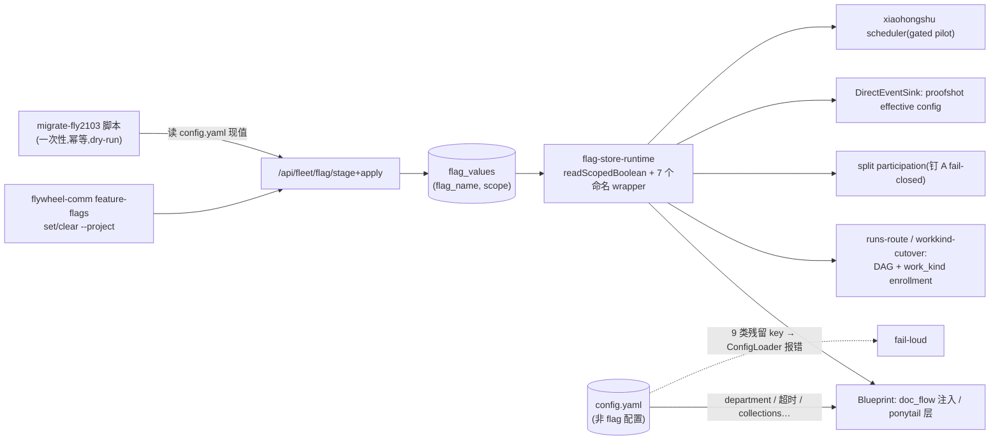

# FLY-2103 config.yaml flag 退役(Batch C) — 实施计划
Issue: FLY-2103 (https://linear.app/geoforge3d/issue/FLY-2103/flagcconfigyaml-退役-9-个-project-config-flag-处置checkpointsenabled)
日期: 2026-08-28
基于: research.md(9 flag 读点归宿逐个实查;exploration.md 四条裁决 D1-D5)

**Status**: draft
**Branch**: flywheel-FLY-2103(已在);PR base = main

## 0. 范围与裁决(定稿,详证据见 exploration/research)

**做**:
1. **固化删(2)**:`checkpoint_enabled`(声明即启用)、`xiaohongshu_auto_create`(写死 true)——
   registry spec 直删、无 tombstone(FLY-2101 D1 先例)、`LEGACY_UNMANAGED_BASELINE` 9→7。
2. **迁 DB 运行时真源(7)**:doc_flow / pipeline_dag / pipeline_work_kind / proofshot /
   xiaohongshu_learning / ponytail / skill_framework_split_participation ——
   `PROJECT_STORE_MANAGED_FLAGS` 5→7;全部读点改 **call-time store lookup**(项目行 → `*` 行 →
   registry default);删 A 单 config 回落路(`runtimeDivergence` 黄标一族)。
3. **一次性迁移脚本**(幂等、默认 dry-run,写侧走 Bridge stage/apply,读侧 raw yaml + 只读快照)。
4. **config.yaml**:6 个项目删 9 类 key(flywheel 在本 PR;5 个外部 repo 各一 PR);ConfigLoader
   对残留 key 逐 key fail-loud 报错。

**关键裁决**(评审重点,可否决):
- **D1/P2**:ponytail 激活 call-time store 读(`*`=false 行为中立,ponytail.ts:116 字节等价已证),
  spec 删 `dormant`、readonly→conversational;授权门一字不改。FLY-615 per-issue 路不动。
- **D2**:split_participation readonly→conversational(config 杠杆死后 CLI 是唯一杠杆);fail-closed
  钉 A 合同保留。
- **D3**:pipeline_dag registry default false→true(polarity default_on)—— 对齐 FLY-1981 运行时
  「absent=DAG-on」真相;否则 5 个项目 DAG enrollment 静默关闭。显示层 5 项目 false→true 是
  修正显示谎言,行为零变化。
- **D5**:7 个迁移 spec 保留 `source: "project_config"` + `configKey`(名册身份/拒绝信息锚点),
  readSites 全改 delegated flag-store-runtime 命名 wrapper。

**不做**:不动 6 个 global env store flag;不动 checkpoints 超时/agents/roles/linear 等非 flag config;
不动 FLY-615 per-issue ponytail label 路;不动 skill_framework_mode(FLY-1834 结账时连 split 一起删);
不给 scheduler 脚本装 plist;不改 flag 级退役扫描语义(spec 删除走既有 departure 机制)。

## 1. 目标数据流



## 2. 实施步骤(TDD:每步 RED → GREEN;全程 progress.md 记账)

### Step 1 — config 包:registry / store-policy / resolve(纯函数层先行)
- registry.ts:删 checkpoint_enabled、xiaohongshu_auto_create 两条 spec;pipeline_dag
  `polarity: default_on, default: true`;ponytail 删 `dormant`、note 改写;ponytail + split
  `toggleable: "conversational"`;7 条 spec readSites → delegated
  (`resolverModule: flag-store-runtime.ts`,resolverSymbol 一 flag 一名,见 Step 2)。
- store-policy.ts:`PROJECT_STORE_MANAGED_FLAGS` +ponytail +skill_framework_split_participation;
  `LEGACY_UNMANAGED_BASELINE` 删两个固化名(9→7,FLY-2101 先例;7 个迁移名保留 —— FLY-2100 先例,
  baseline 是历史 maximum ledger,成员迁 store 后条目惰性)。授权门与 codec 映射**零改动**
  (新成员按 polarity 落入现有 optIn/defaultOn codec;门的 project 分支对改后 spec 如实通过 ——
  RED 先证:改 spec 前门必红,改后必绿)。
- resolve.ts:删 `FlagResolveCtx.projectConfigs` / `resolveConfigValue` / project 分支 config 遍历 /
  `runtimeConfigValue|runtimeConfigError|runtimeDivergence`;`resolveScopedEffective` configRow 参数
  → `default` 兜底(项目行 → `*` 行 → registry default,`via: "default"`);dormant 分支与 `getByPath`
  零引用则删(dead-code 清单列 PR body)。
- 测试:授权门双向(RED:ponytail 未改 spec 入集必红;GREEN:改后过);三级取值(项目行压 `*`、
  `*` 压 default、无行落 default);pipeline_dag 翻转后 default=true;resolve 不再接受/需要
  projectConfigs(编译期)。

### Step 2 — flag-store-runtime:scoped 运行时读族
- 新增 `readScopedBoolean(runtime, name, projectName)`:断言 `PROJECT_STORE_MANAGED_FLAGS.has(name)`;
  `getFlagValueRow(name, projectName)` → `getFlagValueRow(name, "*")` → registry default;有行则
  codec.parse({hasOverride:true, raw})。**不吞错**:store 抛错向上抛,fail-closed 语义由各读点定
  (与 global readBoolean 同纪律)。
- 7 个命名 wrapper(与 registry resolverSymbol 一一绑定):`storeDocFlowEnabled` /
  `storePipelineDagEnabled` / `storePipelineWorkKindEnabled` / `storeProofshotEnabled` /
  `storeXiaohongshuLearningEnabled` / `storePonytailEnabled` / `storeSkillFrameworkSplitParticipation`
  —— 全部 `(runtime, projectName)` 签名。
- `enrichFlagViewsWithStore`:configRow 兜底删(names 必须来自 projectNames 入参),
  runtimeDivergence 数据删;scopedStore / valueClocks 逻辑不动。
- 测试:三级取值经 wrapper;无行 default(含 pipeline_dag=true);enrich 不再产出黄标字段(编译期+
  运行期);store 抛错上抛。

### Step 3 — 读点逐个切换(每个读点独立 RED→GREEN)
1. **Blueprint doc_flow**:构造参数 `docFlowConfig` 同位改为
   `docFlowDept?: { default_department?: string }` + 尾部新增 `docFlowEnabled?: () => boolean`
   (positional ctor,新参加尾);:1991 条件改 `this.docFlowEnabled?.() === true`;department 缺失
   warn-skip 路保留。run-infra 组 closure(flagStore 缺席 → undefined → 注入关,fail-closed)。
2. **Blueprint checkpoint**::2294 `if (!cpConfig.enabled) continue;` 删;`CheckpointConfig.enabled` 删。
   测试:声明即启用;(shape 变化)无 enabled 的声明 checkpoint 也启用。
3. **pipeline enrollment**:pipeline-config-source.ts 重写为 store 版
   `readPipelineEnrollment(flagStore, projectName): WorkKindConfigResult`
   (`work_kind_requires_dag` 组合校验保留;store 抛错 → `{workKind:false, dag:false}` + warn,对齐
   今天非 ENOENT 读错);runs-route.ts:2116、workkind-cutover.ts:784、
   `reconcileDefaultDagCategoryBindings` 三处换调用;yaml 解析路 + `loadPipelineConfigByProject` 删
   (消费者 rg 复核,零引用才删)。测试:无行 → dag on / work_kind off;行组合 dag=0+wk=1 → 拒;
   项目行压 `*` 行;store 错 → fail-closed。
4. **split participation**:skill-framework-participation.ts 整删;run-infra:1077 改传
   `(projectName) => storeSkillFrameworkSplitParticipation(flagStore, projectName)`;Blueprint catch →
   钉 A + warn 合同不动(现测试改造为 store 注入形)。
5. **proofshot**:DirectEventSink 构造尾部加 `proofshotEnabled?: (projectName) => boolean`;
   emitStarted 持久化 effective config 时 enabled 取 store(reader 缺席/抛错 → false,fail-closed);
   SkillsConfig proofshot `enabled` 字段删、proofshot-defaults 同步。
6. **ponytail**:run-infra 删 dormant 注释块(:1011-1018),传
   `() => (storePonytailEnabled(flagStore, projectName) ? { enabled: true } : undefined)`;
   Blueprint :859 参数同位改 reader,:1040 调用处 `this.ponytailProjectLayer?.()`。
   测试:`*`=0 行 ≡ undefined(对拍 resolvePonytail 全分支);项目行=1 时 project 层生效。
7. **xiaohongshu**:scheduler:102 改 deps 注入 `learningEnabled(projectName)`;:168 `autoCreate: true`;
   「store-on 但 collections 空」显式日志跳过;scripts/xiaohongshu-scheduler.ts 入口接注入
   (只读取值;gated pilot,不装 plist)。
8. **render/管理台**:feature-flag-render.ts 黄标段删;management-existing-writers 对 config 的
   projectOverrides 显示按编译错误收敛(仅 flag 部分;非 flag 的 config 显示不动)。

### Step 4 — ConfigLoader:9 类 key 拒绝(fail-loud)
- 逐 key `throw`,错误信息统一形状:
  `"<key> was retired (FLY-2103): per-project flags live in the flag store — delete this key; see flywheel-comm feature-flags"`。
  覆盖:`checkpoints.<name>.enabled`、`doc_flow.enabled`、`pipeline` 块(整块)、`skill_framework` 块
  (整块)、`ponytail` 块(整块)、`skills.proofshot.enabled`、`xiaohongshu_learning.enabled`、
  `collections[].auto_create`。
- doc_flow 块 present → `default_department` 必填(原条件随 enabled 死)。
- types.ts 按 research §3 收缩;`PonytailConfig` 移出 config 类型面(resolver 运行时类型保留)。
- 测试:9 key 各一条 RED(残留 → 精确报错);合法新形状 config(现 6 项目删 key 后的真实文件形)
  全绿;`xiaohongshu_learning` 无 enabled + 有 collections 合法。

### Step 5 — 迁移脚本 `scripts/migrate-fly2103-project-flags.ts`
- 读:projects.json + 各项目 config.yaml **raw yaml parse**(新 ConfigLoader 会拒 key,不能用)+
  现有行只读快照(幂等判定)。
- 写:逐行 Bridge `stage → apply`(fence 走现有 CAS),actor `migration:FLY-2103`;已有同值行 skip。
- 写集:doc_flow {flywheel, joycon-typeless, personal-assistant, tidal-echo}="1";
  pipeline_dag flywheel="1";pipeline_work_kind flywheel="1";ponytail `*`="0"(老 Bridge 白名单会拒
  → 脚本对 per-flag 拒绝**报告并继续**,部署新代码后重跑第二遍补上;同一脚本幂等两遍)。
- `--dry-run`(默认)输出将写/将跳过全表;`--apply` 才动。测试:计划构造纯函数单测
  (输入 config fixture → 期望写集);幂等(同值行 skip);拒绝续跑。

### Step 6 — config.yaml 删 key
- flywheel(本 PR):删 `doc_flow.enabled` / `pipeline` 块 / 4 个 checkpoint 的 `enabled: true`。
- 5 个外部 repo 各一 PR(实施节点开,PR 号列入本单 PR body):
  GeoForge3D / growth(各 3 checkpoint enabled);joycon-typeless / personal-assistant
  (doc_flow.enabled + 3 checkpoint);tidal-echo(doc_flow.enabled + 2 checkpoint)。
- 每个外部 PR body 注明:merge 时机 = flywheel PR merge + 迁移第一遍之后、班车之前(§4 时序)。

### Step 7 — 验收:隔离真 Bridge 前后对照 + rg
- 配方复用 FLY-2100 Step 7(独立 HOME/TEAMLEAD_DB_PATH/TEAMLEAD_PORT/FLYWHEEL_BRIDGE_URL/隔离
  projects.json + 6 项目 fixture;禁 restart-services.sh;收尾杀进程验端口)。
- 前:老代码 + 现 config → 逐项目快照(doc_flow 注入证据、DAG enrollment、work_kind、其余 flag)。
- 后:新代码 + 脚本 seeded 行 + 删 key config → 同快照对照:doc_flow 4 开 2 关、DAG 6 全 on、
  flywheel work_kind on、ponytail 全 OFF、其余默认。已知显示差仅 pipeline_dag 5 项目 false→true
  (D3,QA 报告如实标注)。
- rg 验收(issue 原串)读点层零命中(名册数据 registry/truth 与测试 fixture 除外,逐条列出残余并
  说明);ConfigLoader 9 条报错测试绿。

### Step 8 — 全仓门禁 + 评审 + PR
- `pnpm lint` + `pnpm -r build` + `pnpm test:packages:run`(全仓,FLY-224/248 教训;注意
  失败即停会吞 teamlead 整包 —— 逐包核对照跑)。
- codex-code-review(`codex:rescue`)循环至 approved。
- PR 最后一 commit:`engineering/doc/milestones/FLY-2103.md`(新文件,不碰 CLAUDE.md)+
  本文件夹 docs 随分支走。PR body:消费者清单、dead-code 清单、部署时序、外部 PR 列表、
  显示差说明。

## 3. 部署时序(运维合同,写进 PR body)

```mermaid
sequenceDiagram
  participant PR as flywheel PR
  participant B as 在跑老 Bridge
  participant S as 迁移脚本
  participant EXT as 5 个外部 config PR
  participant D as 00:00/12:00 班车
  PR->>PR: merge(不部署,FLY-1959 解耦)
  S->>B: 第一遍 dry-run → apply(6 行;ponytail 被拒→报告继续)
  EXT->>EXT: 紧贴班车 merge
  D->>D: 部署:新代码 + flywheel 新 config 原子落地
  S->>B: 第二遍(补 ponytail *=0;其余 skip)
  Note over D: 验收对照快照 + QA 报告
```
已知窗口(如实,PR body 列):外部 config merge → 班车之间,若 flywheel main checkout 被 pull 且
老 Bridge dispatch,`work_kind` 强制掉回 false(仅 flywheel、仅窗口内、非崩溃);老代码在窗口内
意外重启 + 外部 config 已删 key → 该项目 doc_flow 注入窗口内掉线。压缩手段:外部 PR 紧贴班车。

## 4. 验收 ↔ 步骤映射

| 验收项 | 步骤 |
|---|---|
| 迁移前后 6 项目行为零变化(真 Bridge 对照) | Step 7 |
| rg 读点层零命中 | Step 1(readSites delegated)+ Step 3(逐读点)+ Step 7(核验) |
| ConfigLoader 残留 key 报错测试 | Step 4 |
| 迁移脚本幂等 + dry-run | Step 5 |
| 6 项目 config.yaml 删 key(PR 列表) | Step 6 |

## 5. 风险与回滚

- **迁移行缺失风险**(部署了新代码但没跑脚本):doc_flow 4 项目注入静默关。防线:Step 7 对照是
  发布门;部署时序把「第一遍脚本」放 merge 后立即执行;新 Bridge 启动日志打印 scoped 行计数供
  QA 核对。
- **回滚**:行为回滚 = revert flywheel PR + 恢复 config key(外部 repo revert);flag_values 行无害
  (旧代码只认 5 个白名单成员的行,ponytail/split 行被忽略;changelog append-only 留审计)。
  无 DDL 变更,无 FLY-2100 那类 forward-only 降级问题。
- **扫描面**:2 个 spec 删除走 flag 级 departure 既有机制(FLY-2104 per-scope 账本自行修剪);
  不需本单动扫描代码 —— 全仓测试若揭示扫描 fixture 引用被删 flag,按测试 fixture 更新处置。
- **skill_framework_split 过渡**:本单只挪存值面;FLY-1834 结账删除时连 store 行、wrapper、spec
  一起走(已在该单范围注记)。
