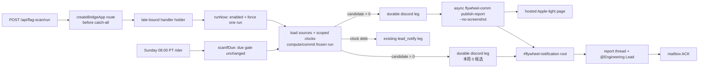

# FLY-2104 周扫描改投通知频道 — 实施计划
Issue: FLY-2104 (https://linear.app/geoforge3d/issue/FLY-2104/flage扫描-周扫描裁决页改发-discordflywheel-notification不再建-linear-单)
日期: 2026-08-27
基于: research.md

## 0. 交付合同

本单完成以下三条并一起验证：

1. `POST /api/flag-scan/run` 在 catch-all 前可达；`{}` 强制真实运行，`{dryRun:true}` 零写预览；Sunday 08:00 PT `scanIfDue()` 逻辑不变。
2. 新周扫描不创建 Linear issue。有候选时，完整 HTML 通过 canonical `publish-report` 投到 `FLYWHEEL_NOTIFY_CHANNEL`；零候选时同频道发一行“本周 0 候选”。
3. 候选资格优先消费 store `value_last_changed`；ready NULL从首次登记计时，no-clock保留两次扫描并取登记/观测的较晚起点；project flag 按全部 `(flag, scope)` 评估，当前 `*` 行兼容、future scope 行自动生效。

红线：扫描永不自动删 flag；不新增告警系统；不改 live env；不部署/重启/merge；不把失败回退到 Core 或 Linear。

## 1. 目标架构

> `diagram-design` 在当前 runtime 不可用；下图按其最小流程意图手写 Mermaid，仅表达 load-bearing 关系。



核心不变量：founder-visible 成功只由 notification channel 的 `discord` leg 结算；候选腿只有在 root、thread、handoff与 mailbox ACK 都有 durable evidence后 done；run token marker 是收养/去重键；Linear 不再是任何新 run 的 prerequisite 或 side effect。

## 2. TDD Slice A — 路由先红后绿

### 2.1 RED

新增 `packages/teamlead/src/__tests__/flag-scan-route-mount.test.ts`（若现有 mount harness 更近则合并）：

- 构造 `createBridgeApp()` + `flagScanRouteHolder.current` test handler；当前 source baseline的 `POST /api/flag-scan/run` 断言 404，保存 RED 输出；
- 预期 GREEN：正确 Bearer + loopback Host + `{}` → 200，spy 只命中 `runNow`；`{dryRun:true}` → dryRun；非法 body → 400；holder 未 ready → 503；非 loopback → 403；无 master token → 503。
- disabled scanner的 manual POST返回 200 `{status:'disabled'}` 且 0 compute/commit/effect；跨 generation CAS `lost_race`返回 409，不以假 200满足验收。

### 2.2 GREEN

`packages/teamlead/src/bridge/plugin.ts`：

1. `BridgeAppOptions` 增 `flagScanRoute?: { current?: express.RequestHandler }`。
2. `startBridge()` 在 `createBridgeApp()` 前创建 holder并传入。
3. `createBridgeApp()` 在 catch-all 前注册 auth-required `POST /api/flag-scan/run`；固定 outer route 只做 credential guard，late handler做 Host/body/scanner validation。
4. scanner 装配完成后设置 `holder.current`；删除 `startBridge()` 后段的 `app.post` 死注册。
5. `createFlagRetirementScanner()` API 增 `runNow()`：先检查 `enabled()`；disabled直接返回；enabled时先恢复 pending，无 pending才 `compute(false)`；不读 due slot。`scanIfDue()` 的 Sunday判定不改。
6. scanner内部以同一 promise single-flight串行 `runNow()`、`scanIfDue()`、`recoverPending()`；StateStore CAS继续覆盖跨进程/旧 generation race。handler只把真实 commit/recovery结果映射200，`lost_race`映射409。

测试同时证明在已存在最新 completed run且未到周日时：`runNow()` 新增一 run row并执行一次可见 effect，紧接的 `scanIfDue()` 返回 `not_due`；同实例并发 manual/tick不双 commit；定时路径的 PST/PDT case 原样通过。

## 3. TDD Slice B — store clock DTO 与纯逻辑

### 3.1 StateStore clock reader RED

扩 `packages/teamlead/src/__tests__/StateStore.flag-value-store.test.ts`：

- current schema 返回 `scopeKey='*'`；
- `value_last_changed` number 原样；NULL 保留；
- `firstRegisteredAt` 取最早 changelog `changed_at`，同值 set 后不移动；
- 用 test migration 建带 scope 的 future fixture，exact rows按 `(flag, scope)` 返回；
- 仅一张表带 scope、duplicate identity、缺 seed → fail loud。

### 3.2 Reader GREEN

`packages/teamlead/src/StateStore.ts` 增只读 `listFlagValueClocks()`：

- `PRAGMA table_info(flag_values)` 与 changelog capability 一次判定；
- current schema query投影 `'*' AS scope_key`；future schema按 scope join/aggregate；
- 参数化/静态 SQL两条明确分支，不拼用户输入；
- 返回 `{flagName, scopeKey, valueLastChanged, firstRegisteredAt}`；不写 schema、不改 A 单表。

### 3.3 DTO wiring GREEN

`packages/config/src/feature-flags/resolve.ts`：新增 exported secret-free `FlagValueClock` 与 `FlagView.valueClocks?`。

`packages/teamlead/src/bridge/flag-store-runtime.ts`：

- `enrichFlagViewsWithStore()` ready 模式把该 flag 的 clock rows挂到 view；
- bypass/degraded/unmanaged 提供 no-clock fallback metadata，不制造可信 `valueLastChanged`；
- 当前 singular `valueLastChanged/clockReadiness` 暂保留兼容现有 console/tests，scan 只读新 rows。

### 3.4 Pure scan RED/GREEN

扩 `packages/config/src/__tests__/feature-flags-scan.test.ts`：

1. global `valueLastChanged=now-6d` 不候选；`-7d` 候选，不再要求两次周样本。
2. NULL + `firstRegisteredAt=-7d` 候选；`-6d` 不候选。
3. no-clock + 300d seed +昨天观测翻转：不候选；须两次同值扫描且 POST-advance `advanced.streakStartedAt`非空，再以 `max(firstRegisteredAt, advanced.streakStartedAt)` 满7d后才候选，同时 reason/diagnostic标 fallback。
4. future/负数/重复 scope/项目覆盖缺口 → noClock，不候选。
5. project `A=8d,B=2d` 不候选；`A=8d,B=7d` 候选，`stableForMs=7d`。
6. exact project scope 优先于 `*`；没有 exact 时显式 `*` fallback；roster错误继续 fail closed。
7. legacy no store rows保持原两采/7d行为，防未纳管 flag 全部消失。

`packages/config/src/feature-flags/scan.ts` 实现 helper：

- canonical sample 仍是值真相；
- `resolveStableSince(spec, view, advanced, now, expectedProjects)` 只决定时钟；no-clock必须先判 `advanced.streakSamples >= 2 && advanced.streakStartedAt !== null`，避免 stale previous与 `Math.max(..., null)` epoch footgun；
- ready managed clock path不再使用 `streakSamples >= 2`；no-clock/legacy path保留两采样门槛，门槛通过后 stable-since只取 `firstRegisteredAt有效 ? max(firstRegisteredAt, advanced.streakStartedAt) : advanced.streakStartedAt`；
- project返回所有 scope 的 stable-since并取 `Math.max(stableSince)`，稳定时长=`now-max`；
- no-clock reason带 scope，但不泄露 secret/raw。

## 4. TDD Slice C — 退役 Linear，收敛 durable legs

### 4.1 RED

扩 `StateStore.flag-retirement-scan.test.ts` 与 `bridge/__tests__/flag-retirement-scan.test.ts`：

- candidate >0：required legs恰 `['discord']`（有 debt 则再 `lead_notify`），`createLinearBatch` 0 调用；
- candidate=0：仍欠 `discord`，最终 body包含“本周 0 候选”；不调用 report；
- candidate + report success：discord evidence含 hosted URL/message ID；
- candidate + ambiguous：visibility fence 前不重发，reconcile found后 done，missing后只重试一次；
- historical pending linear/report：两腿变 degraded，Linear effect 0 调用，discord可 claim；
- ask_count沿用现有 commit-time increment；pending阻止更多 run，root+thread+ACK完成后保留。partial evidence必须使用既有 `rootMessageId` + `threadId`，使24h/cross-slot时 root/thread已可见但 ACK未到仍判 founder surface delivered、不回滚；确无这两个 key时既有 stalled settlement先 `alertFailure` 再回滚。

### 4.2 GREEN

`packages/teamlead/src/StateStore.ts`：

- 保留 `FlagScanLeg` historical union与DDL；
- `claimFlagScanLeg('discord')` 只要求“存在的 historical linear/report legs已经 done/degraded”，不要求它们存在；
- 必要时增通用 `settleRetiredFlagScanLeg()`，CAS把 pending/claimed/ambiguous旧腿转 degraded并清 lease/fence；只允许 `linear|report`，evidence固定 FLY-2104 retirement。

`packages/teamlead/src/bridge/flag-retirement-scan.ts`：

- `owedLegs()` 始终含 `discord`，按 debt追加 `lead_notify`；不写 linear/report。
- 删除新 run 的 Linear body/title/依赖渲染；`renderFlagScanLinearBody` 若无其他消费者则删除并用 `rg` 证明零引用。
- `attemptLeg(linear|report)` 只结算历史腿，不调用外部 effects。
- `attemptLeg(discord)`：有候选调用 `publishReport`，再幂等创建 report thread、发送 Engineering handoff并等 mailbox ACK；零候选调用 `postDiscord` 一行且不建 thread。
- `renderFlagScanReport` 保留现有安全 escaping、CSP nonce、comment/copy fallback；hero把“连续两次采样”改成 store-clock truthful copy。
- `FlagRetirementScanEffects` 删除 Linear create/reconcile；`publishReport`/thread/handoff result的 ambiguous语义纳入 visible fence。唯一 visible leg不允许 effect-degraded完成；只有 notification root + thread + handoff ACK evidence结算 done。失败进入 retry；仅现有 stalled settlement可在告警后终结/回滚。
- visible effect throw的 catch在 `markFlagScanLegAmbiguous` 后显式 `await deps.alertFailure(...)`（alert自身失败不覆盖 durable ambiguous状态）；测试断言首次 identity/config失败即告警，不依赖5分钟 reconcile或24h stalled路径。

## 5. TDD Slice D — canonical publish-report 到 notification

### 5.1 Production effect RED

重写就近 `flag-retirement-production.test.ts` cases：

- candidate/zero/reconcile每次调用都重新执行 `resolveInfraNotifyIdentity()`；缺 `CLAUDE_INFRA_BOT_TOKEN` 或 `FLYWHEEL_NOTIFY_CHANNEL` 任一个、或 flag-scan本地判 channel非 snowflake，都抛错→visible leg ambiguous→scanner显式 `alertFailure`，0 child/Discord I/O，禁止 legacy token fallback；补 env后下次 retry无需重启；
- resolved handoff owner不再要求 project generalChannel等于 Core，只要求唯一 Engineering Lead与 mailbox target；
- configured notify channel + candidate：child argv必须是 `node <comm> publish-report --html <unique> --project <project> --title <run-marker-title> --channel <notify> --no-screenshot`；绝不出现 Linear API或 Core channel；
- child env显式包含 loopback Bridge URL与 master token，不打印 token；HTML temp dir最后删除；
- envelope `delivered:true`只证明 root可见；将返回 message id写入既有 `rootMessageId`，随后用同一 infra token在 root下建 thread、@Engineering Lead、等待 mailbox ACK才 done；evidence沿用 `threadId`/`handoffMessageId`/`inboxDeliveryId`，可追加 `reportUrl`/`reportId`；重复 reconcile幂等补齐缺失步骤；
- child强制 `--no-screenshot`，timeout < leg lease；timeout kill后验证0 Chrome session可归因于本 run，temp dir仍清理；`delivered:false`/timeout/parse error → ambiguous，绝不 effect-degraded；
- identity missing/blank/channel非法 → scanner仍构造且 manual route仍ready；effect fail loud，0 child/Discord fallback，run保持可恢复 pending；
- zero path向 notification POST一行，带 exact run marker；
- reconcile只分页 notification channel并按 exact marker收养 root，然后检查/补齐 thread、handoff与 ACK。

### 5.2 Production effect GREEN

`packages/teamlead/src/bridge/flag-retirement-production.ts`：

1. 删除 `LinearClient`、governance label、create/find Linear batch和 Core root实现；保留并改造 thread/handoff/mailbox消费链；`rg` 确认周扫描生产路径零 `createIssue`。
2. 新 options接受 `env?: NodeJS.ProcessEnv`/`resolveNotifyIdentity?: () => InfraNotifyIdentity | undefined`、`commCliPath`、handoff owner、`runPublishReport?`/`execFile?`、`tmpRoot?`、`timeoutMs?`；不接受 boot-snapshot identity。生产默认 resolver在每个 effect/reconcile调用时读 `process.env`。
3. call-time `resolveInfraNotifyIdentity()`保持共享 non-empty P-identity原语；flag-scan effect拿到 identity后本地校验 channel snowflake，不修改 `infra-notify.ts`、不影响其他 consumers、不 fallback `config.discordBotToken`。每次 effect/reconcile都用 infra token `/users/@me`取得 actual sender id并重新读取 Engineering access，断言同时含 `groups[notifyChannelId]` 与 `allowBots.includes(senderId)`；只有 notification channel真实 POST probe root→create thread→send in thread可按 notify channel/sender/Engineering id/access path fingerprint缓存21天，access assertions绝不缓存。
4. candidate `publishReport`：`mkdtemp` + write HTML + async child（强制 `--no-screenshot`）+ parse stdout最后一个唯一 envelope + finally recoverable cleanup；timeout < `FLAG_SCAN_LEASE_MS`，fake-delay测试覆盖边界。
5. title用醒目的 `🚩 本周 Flag 裁决 · N 个候选（请留/清）`并含 machine marker（不把 token藏在 URL）；standard deliver消息因此可权威 reconcile。`--no-screenshot`是明确接受的运行时 tradeoff：延续当前生产 link-only能力，避免 Bridge browser lifetime；醒目标题、候选数、紧随其后的活跃 thread共同降低通知流中漏看风险，QA截图不冒充生产附件。用返回 `rootMessageId` 创建 thread，页面文案与 handoff都指向该 thread；mailbox ACK后才完成腿。
6. zero `postDiscord`复用同一个 infra token与 automated-message marker，content恰一行人话 + machine marker（Discord视觉仍一行；marker可放同一行尾部），不建 thread。
7. no-clock `notifyLead`/failure alert继续既有 mailbox，不新建 notifier。

`packages/teamlead/src/bridge/plugin.ts` 注入：

- scanner无条件按 owner/feature能力构造；不以 boot-time infra identity缺失为 skip条件；
- effects默认用 call-time `resolveInfraNotifyIdentity(process.env)`；
- `commCliPath: join(flagScanRepoRoot, 'packages/flywheel-comm/dist/index.js')`；
- reportBaseUrl/master token保留供 child env。

若 build/install形态证明 dist CLI 不在 repo root，则以 `FLYWHEEL_COMM_CLI`/package resolution建立唯一 resolver并补测试；不得 fallback raw publish。

## 6. 页面与浏览器验证

### 静态/DOM测试

在 scanner renderer tests断言：

- `color-scheme:light`、浅背景与高对比输入；
- 每 candidate有 `select.verdict` + `textarea.reason`；所有 flag/description/value/provenance经过 HTML escape；
- localStorage key含 report pathname + flag card identity；页面一 flag一张卡，因此不制造不存在的 project-card隔离合同；
- copy success显示“已复制，请贴回本报告消息下的 thread”；clipboard拒绝时 fallback textarea出现且状态不假报成功；
- CSP nonce placeholder保留，HTML <512 KiB。

### 真浏览器 fixture

生成含 global + 两 project scope、恶意 HTML字符、多个 candidates的生产 renderer fixture。独立 QA用真 browser：

1. 打开 hosted page并截图全页；
2. 逐卡填 verdict/批注，reload后仍在；
3. 验 clipboard success内容含 identity/digest/reason，并指向 report thread；
4. deny clipboard，验证 fallback textarea已选中且 failure copy truthful；
5. 量页面高度并按现有 founder report规约控制预览。

实现节点若可安全使用本地 Playwright，只做 fixture级验证；真实 Discord与 founder登录态留独立 QA，不冒用 founder身份。

## 7. 验证矩阵

### Targeted

```bash
pnpm --filter flywheel-config exec vitest run src/__tests__/feature-flags-scan.test.ts
pnpm --filter flywheel-teamlead exec vitest run \
  src/__tests__/StateStore.flag-value-store.test.ts \
  src/__tests__/StateStore.flag-retirement-scan.test.ts \
  src/__tests__/flag-scan-route-mount.test.ts \
  src/bridge/__tests__/flag-store-runtime.test.ts \
  src/bridge/__tests__/flag-retirement-scan.test.ts \
  src/bridge/__tests__/flag-retirement-production.test.ts
```

### Full repo hard gates

```bash
pnpm lint
pnpm -r build
pnpm test:packages:run
```

另跑本单新增的任何 `scripts/__tests__/*.test.sh`。保留 aggregate原始输出；如果宿主负载导致并发失败，单 worker复验只作归因，不冒充 aggregate green。

### Acceptance evidence

| 要求 | 权威证据 |
| --- | --- |
| manual POST 200 +真跑 | enabled clean fixture的 HTTP 200 +新增 run row + publish/zero effect spy；另证 disabled 200但0 run/effect、`lost_race`=409，不能用任一 200单独判 PASS |
| Sunday path不变 | PST/PDT slot tests + due/non-due scanner tests |
| notification真实落点 | QA回读 Discord notify channel/root id + hosted URL；真实 preflight证明 `groups[notify]`、`allowBots[sender]`、root/thread/in-thread权限 |
| 裁决消费链 | candidate run evidence含既有 `rootMessageId`/`threadId`/`handoffMessageId`/`inboxDeliveryId`且 ACK后 done；页面复制文案指向该 thread；ACK pending的 stalled settlement仍认 founder surface、不误回滚 ask |
| notification identity | candidate/zero/reconcile call-time同一 P-identity，snowflake仅 flag-scan本地校验；缺失/非法=0 I/O + ambiguous + 首次 effect catch显式 `alertFailure`，补 env后无需重启可恢复；无 legacy fallback/其他 consumer blast radius |
| Linear不再创建 | production effect零 Linear dependency + run-token Linear查询/spy 0 create |
| HTML可用 | 真浏览器 screenshot + persistence/copy success/failure记录 |
| value clock | pure boundary tests + StateStore current/future schema fixtures |
| 不自动删 | registry/store mutation before/after snapshot与静态无 delete/retire call |

## 8. 实施顺序与提交

1. 提交当前 exploration/research/plan，走 design review到 APPROVED。
2. Slice A RED commit/记录 → GREEN/refactor。
3. Slice B RED → GREEN；先 clock reader，再 pure compute/wiring。
4. Slice C RED → GREEN；新腿集合 + legacy rollout。
5. Slice D RED → GREEN；canonical publish-report production effect。
6. 页面 DOM/本地 browser验证、targeted/full gates。
7. **operator prerequisite（Tadashi/值班 operator，非 Runner live mutation）**：在 QA真实扫描/ship前，Engineering Lead `access.json` 增 `groups[FLYWHEEL_NOTIFY_CHANNEL]` 与实际 Claude Infra Bot sender id到 `allowBots`；Runner read-only重核并跑 notification permission probe，未满足则通过 `ask --report` 明确回报，不把 mock green冒充生产 ready。
8. `stage set code_review`，按 contract开 `review_code` gate + `request-review`，CHANGES则新 gate循环。
9. 最后一个 commit新增 `engineering/doc/milestones/FLY-2104.md`，格式遵守 milestones README；不碰 CLAUDE.md。
10. push feature branch，开非 draft PR；不请求 ship、不 merge。
11. `complete --route needs_review --pr <NUMBER>`。

进度每一意义步骤通过 `flywheel-comm progress` 维护；checkpoint前检查 Lead inbox并按完整 instruction id回报。

## 9. 会过期的结论

| as-of | 当前结论 | 续接重核命令 |
| --- | --- | --- |
| 2026-08-27 source baseline `e33f87d70`（其后仅 docs/progress commits） | catch-all先于 startBridge flag route | `git diff --quiet e33f87d70 -- packages/teamlead packages/config; rg -n "Catch-all 404|/api/flag-scan/run" packages/teamlead/src/bridge/plugin.ts` |
| 2026-08-27 | `flag_values` 无 scope列 | `rg -n "CREATE TABLE IF NOT EXISTS flag_values" packages/teamlead/src/StateStore.ts` + `PRAGMA table_info` fixture |
| 2026-08-27 | scanner effect仍 import LinearClient并 createIssue | `rg -n "LinearClient|createIssue" packages/teamlead/src/bridge/flag-retirement-production.ts` |
| 2026-08-27 | notify channel配置名=`FLYWHEEL_NOTIFY_CHANNEL` | `rg -n "FLYWHEEL_NOTIFY_CHANNEL" packages scripts` |
| 2026-08-27 | production Engineering access的现有代码合同仍检查 Core group + CoS sender；notification group + Infra sender是本单 pre-ship operator prerequisite | `sed -n '370,570p' packages/teamlead/src/bridge/flag-retirement-production.ts` + live read-only preflight |
| 2026-08-27 | publish-report canonical流程=publish→optional ProofShot→deliver，支持 `--no-screenshot` | `sed -n '1,300p' packages/flywheel-comm/src/commands/publish-report.ts` |

任一结论变化时先更新本 plan并重走 design review；不要靠旧行号判断。

## 10. 文件清单（预期）

| 文件 | 变化 |
| --- | --- |
| `packages/config/src/feature-flags/resolve.ts` | scoped clock DTO |
| `packages/config/src/feature-flags/scan.ts` | store clock eligibility + scope aggregation |
| `packages/config/src/__tests__/feature-flags-scan.test.ts` | clock/scope RED-GREEN matrix |
| `packages/teamlead/src/StateStore.ts` | capability-aware clock reader + historical leg settlement/dependencies |
| `packages/teamlead/src/__tests__/StateStore.flag-value-store.test.ts` | current/future schema clock fixtures |
| `packages/teamlead/src/__tests__/StateStore.flag-retirement-scan.test.ts` | new legs + rollout |
| `packages/teamlead/src/bridge/flag-store-runtime.ts` | clock DTO wiring |
| `packages/teamlead/src/bridge/__tests__/flag-store-runtime.test.ts` | ready/no-clock wiring tests |
| `packages/teamlead/src/bridge/flag-retirement-scan.ts` | runNow、render、leg convergence |
| `packages/teamlead/src/bridge/flag-retirement-production.ts` | remove Linear/Core root；call-time infra identity + notification membership/permission preflight + canonical publish-report + report thread/ACK + zero line；evidence沿用 existing keys |
| `packages/teamlead/src/bridge/plugin.ts` | route holder before 404 + production options |
| `packages/teamlead/src/__tests__/flag-scan-route-mount.test.ts` | route reachability/real invocation |
| `packages/teamlead/src/bridge/__tests__/flag-retirement-*.test.ts` | output/recovery/production delivery |
| `engineering/doc/FLY-2104-weekly-flag-scan/*` | full docs、progress、QA evidence as produced |
| `engineering/doc/milestones/FLY-2104.md` | PR last commit only |

若实现能删除比清单更多的旧 Linear/Core专用代码，应先用 `rg` 证明新不可达；属于本次输出路径的死代码可随改删除，不做无关 cleanup。
