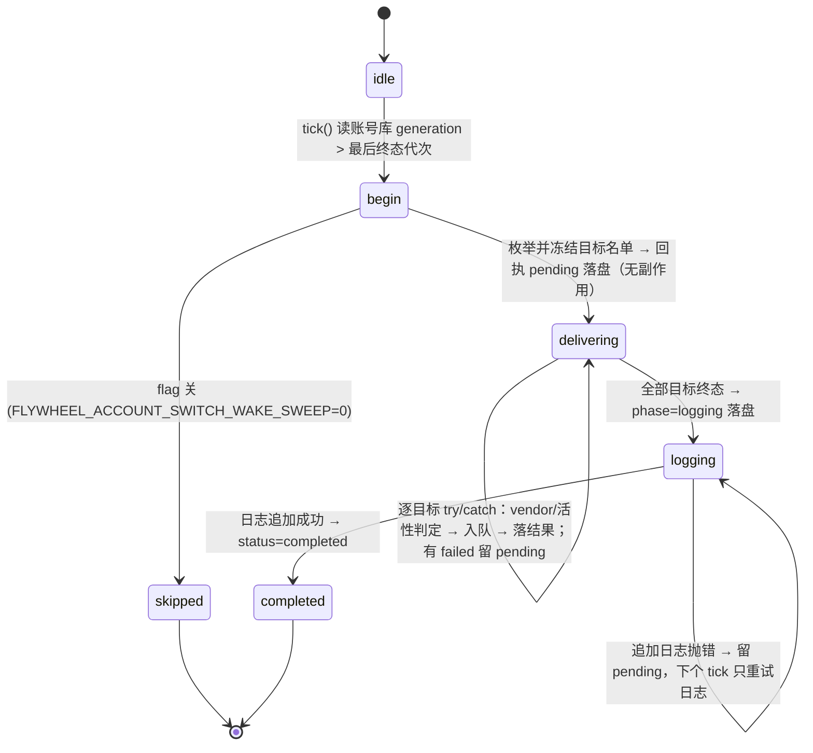

# FLY-2109 切号后唤醒活体 — 实施计划
Issue: FLY-2109 (https://linear.app/geoforge3d/issue/FLY-2109/病根-切号后活着的-runner-不接新账号旧号周额度打满即全体静默只能人眼发现-8)
日期: 2026-10-01
基于: research.md

版本: v1.56.0（暂定，ship 时取空号）· 状态: draft（待 Codex design review）

## 0. 一句话

Bridge 里新增一个**按账号库代次消费**的唤醒器 `account-switch-wake.ts`：账号库 `generation` 每前进一次（= 一次真切号），
就枚举正在跑的 Claude runner 与 Claude Lead，用现有信箱通道各投一条固定唤醒消息（三层幂等），逐目标结果落 StateStore 回执表，
并追加一行 JSON 到切号日志。两处 `onSwitchSuccess` 钩子只当门铃立刻触发一次，30s poll 搭车做崩溃补投。不另造通道、不改切号逻辑。

## 1. 为什么这样做（方案对比）

| 方案 | 结论 |
|---|---|
| A. 两个 `onSwitchSuccess` 钩子里直接枚举投信 | 拒绝单独采用：钩子的 `attempted` 含 noop 重复触发；切号已提交但唤醒未投时 Bridge 崩溃即丢；两处各写一份 |
| **B. 代次消费器（钩子 = 门铃，poll = 补投，回执表 = 真源）** | 采用：真切号判定靠 `generation` 前进，noop/失败不前进自然不投；崩溃后重放；一份逻辑覆盖两入口；零新 timer |
| C. 守护进程 / bash CLI 自己投 | 拒绝：本仓无守护进程；bash 不持 StateStore / CommDB / Lead runtime |
| D. 复用 revive scan `tmux send-keys` | 拒绝：本仓无；派单明确走信箱 |

派单四条约束的落点：① 每个活体一条固定消息、幂等（§2.3）；② 写切号日志（§3.4）；③ 只唤醒（§7 不改）；④ 同 `flywheel-comm send` 一路（§3.1 runner 投递 = `send.ts` 的 ①④⑤）。

## 2. 不变量与状态机



1. **只有代次前进才投。** `generation` 仅由 `switch-executor.commitSwitch` 推进；`noop_already_switched` / `failed` / `no_account` 不推进 → 不投。账号库不存在（自愈关）→ `readStore` 返回 `generation:0` → 永不前进 → 静默。
2. **一代次一张回执**（`account_switch_wake_receipts.generation` 主键）。tick 的入口判定：`generation > max(generation where status in ('completed','skipped'))` 且没有同代次 pending → begin；有 pending → replay。连续多次切号（g5、g6）只处理最新代次 g6，g5 若还 pending 直接标 `superseded`（旧号已不再是活号，再投 g5 的文案会误导）。
3. **目标名单冻结**：第一次尝试时一次性枚举、连同每个目标的确定性 id 写进 `outcome_json` 后才开始任何副作用；重放只处理名单中非终态目标，不重新枚举。
4. **逐目标处理顺序**：先只读查入队证据（runner：CommDB 按 id 查 `messages` 行存在；Lead：`store.isLeadEventDelivered(leadId,eventId)`）→ 有证据 `already_enqueued` → 再判 flag 关 `skipped_flag_off` → vendor → 活性 → 入队。读证据失败 → `failed`（可重试），绝不当「未投」。
5. **逐目标隔离**：每个目标独立 try/catch；`failed` 带 `error` + `attempts`，同目标连续 20 次失败 → `gave_up`（终态）。StateStore 自身写失败 → 整个 tick 抛出、回执保持 pending（下个 tick 重来）。
6. **日志阶段独立冻结**：全部目标终态后 `phase=logging` 落盘，此后重放只追加日志。追加失败留 pending；「追加后、completed 前」崩溃 → 重放再追加一行（同 generation 的重复行可识别，接受）。
7. **单飞**：进程内 `inFlight` 布尔；钩子触发与 poll 触发并发时后者直接返回（下个 poll 再来）。
8. **结果词止于「已入队」**：`enqueued` 不宣称送达/复工。送达可用 `flywheel-comm message-status <id>` 查；复工靠 runner 自己的 DONE 回执与 pane。
9. **跳过类回执**（`skipped:flag_off`、`superseded`）没唤醒任何体，日志尽力而为，失败只 `console.warn`，不留 pending。

### 2.3 幂等（三层，任一层单独都足够「重复投无副作用」）

| 层 | 键 | 机制 |
|---|---|---|
| 回执表 | `generation` | 同代次 completed 后 tick 不再进入 |
| CommDB `messages` | `account-switch-wake:g<gen>:<exec>` | `insertInstructionWithId` = `INSERT OR IGNORE` |
| 收件箱 sidecar | `metadata.flywheelId` = 同上 | `ClaudeCodeAdapter` 跳过已终结的 id |
| Lead `lead_events` | `(lead_id, account-switch-wake:g<gen>:<leadId>)` | `UNIQUE` → 同 seq → 同 flywheelId → sidecar 去重 |

## 3. 改动

### 3.1 新文件 `packages/teamlead/src/bridge/account-switch-wake.ts`

```ts
export const ACCOUNT_SWITCH_WAKE_FLAG = "FLYWHEEL_ACCOUNT_SWITCH_WAKE_SWEEP";
export const MAX_TARGET_ATTEMPTS = 20;
export const wakeText = (to: string) => `【账号切换】额度已切到新账号 \`${to}\`，请接着做刚才的事。`;
export const runnerWakeId = (gen: number, exec: string) => `account-switch-wake:g${gen}:${exec}`;
export const leadWakeId   = (gen: number, leadId: string) => `account-switch-wake:g${gen}:${leadId}`;

export interface AccountSwitchWakeDeps {
  store: Pick<StateStore, "getRunningSessions" | "insertEvent" | "appendLeadEvent" | "markLeadEventDelivered"
                        | "isLeadEventDelivered" | "getAccountSwitchWakeCursor" | "getPendingAccountSwitchWake"
                        | "upsertAccountSwitchWakeReceipt" | "markAccountSwitchWakeSuperseded">;
  readAccountStore: () => { generation: number; activeAccount: string | null; from?: string | null };   // 缺省 readStore(defaultStorePath())
  listClaudeLeads: () => Array<{ projectName: string; leadId: string }>;                                 // snapshot().projects 过滤 isPaneBasedLeadBackend
  getLeadRuntime: (leadId: string) => Pick<LeadRuntime, "deliver"> | undefined;                          // registry.getForLead
  leadWindowExists: (projectName: string, leadId: string) => Promise<boolean>;                           // locateLeadWindow !== null
  openCommDb: (projectName: string) => Pick<CommDB, "getSession" | "insertInstructionWithId" | "markInstructionDelivered" | "hasMessage" | "close">;
  probeRunnerPane: (projectName: string, executionId: string) => Promise<"alive" | "dead" | "unknown">;   // getTmuxTargetFromCommDb + probeRunnerProcessLiveness
  wakeRunner: typeof wakeRunnerMailbox;
  appendSwitchLog?: (record: AccountSwitchWakeLogRecord) => void;                                        // VITEST 下 plugin 不接
  env: NodeJS.ProcessEnv; now: () => number; log: (msg: string) => void;
}

export function createAccountSwitchWake(deps): { tick(): Promise<TickResult> }
export function appendAccountSwitchWakeLog(record, env): void      // §3.4
```

`tick()` 按 §2 状态机实现。目标结果枚举：
`planned | enqueued | already_enqueued | skipped_flag_off | skipped_vendor | skipped_pane_dead | skipped_no_mailbox | skipped_backend_commdb | skipped_runtime_missing | skipped_window_absent | failed | gave_up`。

**runner 分支**（每目标）：`db = openCommDb(project)`；证据 `db.hasMessage(id)`（新增只读方法，`SELECT 1 FROM messages WHERE id=?`）；
`db.getSession(exec)?.vendor !== "claude-code"` → `skipped_vendor`；`probeRunnerPane` 为 `dead` → `skipped_pane_dead`（`unknown` 照投）；
`db.insertInstructionWithId(id, "bridge", exec, text)`；`wakeRunner({db, execId, fromAgent:"bridge", content:"[lead-instruction "+id+"]\n"+text, metadata:{flywheelId:id, execId, kind:"account_switch_wake"}, backend:"claude-code"})`；
`ok` → `markInstructionDelivered(id)` + `store.insertEvent({event_id:id, event_type:"account_switch_wake", source:"bridge.account-switch-wake", payload:{generation,from,to}})`（event_id 唯一 → 幂等）→ `enqueued`；
`skippedReason` `no_session_lead` → `skipped_no_mailbox`，`backend_commdb` → `skipped_backend_commdb`（审计行已落，回滚模式由 hook 读 CommDB）；其它 → `failed`。每目标 `finally db.close()`。

**Lead 分支**（每目标）：证据 `store.isLeadEventDelivered(leadId, eventId)` → `already_enqueued`；`getLeadRuntime` 缺 → `skipped_runtime_missing`；
`!leadWindowExists` → `skipped_window_absent`；`seq = appendLeadEvent(leadId, eventId, "account_switch_wake", JSON.stringify(payload), "account-switch:g<gen>")`；
`deliver({seq, event:payload, sessionKey, leadId, timestamp})`；`delivered` → `markLeadEventDelivered(seq)` → `enqueued`；否则 `failed(error)`。
`payload = {event_type:"account_switch_wake", execution_id:"", issue_id:"", project_name, summary:text}`（通用渲染 → Lead 看到 `[Event #n] account_switch_wake` + `Summary: …`）。
**不**把 `account_switch_wake` 加进 `RETRYABLE_LEAD_EVENT_TYPES`。

### 3.2 `packages/teamlead/src/StateStore.ts`

新表（跟随现有 `CREATE TABLE IF NOT EXISTS` 迁移惯例）：

```sql
CREATE TABLE IF NOT EXISTS account_switch_wake_receipts (
  generation INTEGER PRIMARY KEY, status TEXT NOT NULL, phase TEXT NOT NULL DEFAULT 'delivering',
  trigger_from TEXT, trigger_to TEXT, outcome_json TEXT NOT NULL DEFAULT '{}',
  created_at TEXT NOT NULL DEFAULT (datetime('now')), completed_at TEXT)
```

方法：`getAccountSwitchWakeCursor(): number`（终态最大代次）、`getPendingAccountSwitchWake(): Receipt | undefined`、
`upsertAccountSwitchWakeReceipt(r)`（pending 期间保存进度；`completed`/`skipped` 时写 `completed_at`；已终态行不可再改 → 返回 false）、
`markAccountSwitchWakeSuperseded(generation)`。

### 3.3 `packages/flywheel-comm/src/db.ts`

新增只读 `hasMessage(id: string): boolean`。不改表、不改 `send.ts`。

### 3.4 日志追加器（`account-switch-wake.ts` 导出 `appendAccountSwitchWakeLog`）

路径 `env.FLYWHEEL_QUOTA_LOG_PATH?.trim() || ~/.flywheel/logs/quota-monitor.log`；`openSync(path, O_WRONLY|O_APPEND|O_CREAT|O_NOFOLLOW, 0o600)`，
单次 `writeSync` 一整行，短写抛错，`finally closeSync`。行：
`{"ts","component":"flywheel-bridge","level":"info","event":"account_switch_wake","generation","from","to","status":"completed"|"skipped:flag_off"|"superseded","counts":{…},"targets":[{kind,project,execution_id|lead_id,instruction_id,result,error?,attempts}]}`。
与守护进程 `quota_poll` 行同形（`ts/component/level/event`），同一文件 → 「outcome 旁边」。

### 3.5 `packages/teamlead/src/bridge/plugin.ts`

在 `accountSwitchRepair` 门内（`:7159` 之后）构造 `accountSwitchWake = createAccountSwitchWake({...生产 deps})`，`appendSwitchLog` 在 `process.env.VITEST` 下不接。
- `:7437-7439` 与 `:8164-8168` 两处 `onSwitchSuccess` 体内，在 `postSwitchRescueSweep()` 之后追加 `await accountSwitchWake?.tick()`（各自 try/catch，互不影响；`onSwitchSuccess` 签名不变）。
- `onPollComplete`（`:8111`）里 fleet sensors 之后加一段 `try { await accountSwitchWake?.tick() } catch { warn }`（零新 timer）。
- Bridge 启动时（registry 建好后）调一次 `tick()` 做崩溃补投。
`listClaudeLeads` = `fleetConfigProvider.snapshot().projects.flatMap(p => p.leads.filter(l => isPaneBasedLeadBackend(l.backend)).map(l => ({projectName:p.name, leadId:l.agentId})))`。
`probeRunnerPane`：`getTmuxTargetFromCommDb` `gone` → `dead`；`found` → `probeRunnerProcessLiveness` 的 `dead_pin|absent` → `dead`，`alive` → `alive`，其余 → `unknown`。

### 3.6 `packages/config/src/feature-flags/registry.ts`

新增 `account_switch_wake_sweep`：`kill_switch` / env `FLYWHEEL_ACCOUNT_SWITCH_WAKE_SWEEP` / `default_on` / `default:true` /
readSite `packages/teamlead/src/bridge/account-switch-wake.ts` `createAccountSwitchWake.tick` `call_time` `env-param` / `toggleable:"direct"` /
`directToggleProof:"resolve.direct-toggle.test:account_switch_wake_sweep live-observe"`。文案：「切号成功后把正在跑的 Claude runner / Lead 叫醒（信箱投一条固定消息）；=0 关掉 = 回到切号后活体静默等 reset」。

### 3.7 文档

`engineering/doc/milestones/FLY-2109.md`（里程碑一行）+ 本文件夹 `implementation.md`（实现体填）。

## 4. 测试（TDD，先红后绿）

`packages/teamlead/src/bridge/__tests__/account-switch-wake.test.ts`（`StateStore.create(":memory:")` + 临时目录真 CommDB + 假 `wakeRunner` / `deliver`，仿 `runner-wake-no-transport.test.ts` 与 `send-mailbox.test.ts`）：
1. 代次前进（g0→g1）+ 2 个 running claude-code runner + 1 个 Claude Lead → 每个恰 1 条（id 精确）、文案精确、回执 completed、`targets` 三项 `enqueued`、`session_events` 有 `account_switch_wake`、Lead `lead_events` delivered；declared state **未**被清。
2. 切号失败形态：代次不前进（`generation` 不变）→ 0 条、无回执；账号库不存在 → 0 条、无回执、无日志。
3. 重复触发：同代次连续 tick ×5（钩子 + poll）→ 每目标仍 1 条；回执只一张；`wakeRunner` 调用次数 = 目标数。
4. vendor：`codex` / `none` / NULL / 行缺失 → `skipped_vendor`，0 条；`adapter_type` 非 claude 但 vendor claude-code → 照投（vendor 为准）。
5. 活性：`probeRunnerPane` 返回 `dead` → `skipped_pane_dead`；`unknown` → 照投。
6. Lead：Codex backend Lead 不在名单；runtime 缺 → `skipped_runtime_missing`；窗口不存在 → `skipped_window_absent`；`deliver` 失败 → `failed`、下个 tick 重试、成功后 `enqueued` 且 `appendLeadEvent` 返回同 seq（不双写）。
7. 逐目标隔离：P1 的 CommDB 打不开 → P2 runner 与 Lead 照投、回执 pending、P1 `failed`；恢复后下个 tick 只补 P1；连续 20 次失败 → `gave_up` 进日志阶段并 completed。
8. 崩溃重放：在「投信后、保存结果前」让 `upsertAccountSwitchWakeReceipt` 抛错 → 关闭重开 StateStore（同一 sqlite 文件）→ 重放：已投目标由证据认回 `already_enqueued`、0 条新信、名单完整；期间新起的 running 体不在名单。
9. flag：`=0` 且尚未落名单 → `skipped:flag_off`，重开不补发；投信中途 `=0` → 未结算目标先查证据，无证据记 `skipped_flag_off`，已投结果保留。
10. 连续切号：g1 pending 时账号库到 g2 → g1 `superseded`、g2 正常投（文案是 g2 的新号）。
11. 日志：`appendSwitchLog` 抛错 → pending `phase:logging`、0 条新信；恢复后只追加日志、completed；记录含 generation/from/to/counts/targets；跳过类回执日志失败不阻塞。
12. `wakeRunner` 返回 `no_session_lead` → `skipped_no_mailbox`；`backend_commdb` → `skipped_backend_commdb` 且 CommDB 审计行存在。

其它：
- `StateStore.account-switch-wake.test.ts`：pending 可更新、终态不可更新、cursor 取终态最大代次、superseded。
- `flywheel-comm db.test`：`hasMessage` 真/假。
- 日志追加器：临时文件一行合法 JSON、拒绝 symlink（`O_NOFOLLOW` 抛错）、`FLYWHEEL_QUOTA_LOG_PATH` 覆盖、父目录缺失抛错。
- `account-switch-route.test.ts` / watchdog 测试：`onSwitchSuccess` 行为不变（签名不变，现有用例照过）。
- `config` 包：registry 新条目 + drift 测试（readSite 文件含 env 名）+ `resolve.direct-toggle.test` live-observe。
- 回归：`runner-wake*.test.ts`、`send-*.test.ts`、`mailbox-lead-runtime.test.ts` 不受影响（未改它们的被测代码）。

本机只跑相关测试（上述文件 + `git grep` 新 literal：`account-switch-wake`、`account_switch_wake`、`FLYWHEEL_ACCOUNT_SWITCH_WAKE_SWEEP`、`hasMessage`、`account_switch_wake_receipts`），不跑全量。

## 5. 验收（真机 / QA 房）

1. QA 房 Bridge 启动 env 必须带 `FLYWHEEL_CLAUDE_ACCOUNTS_PATH=<房内>/claude-accounts.json` 与 `FLYWHEEL_QUOTA_LOG_PATH=<房内>/quota-monitor.log`；起房前后对比生产 `~/.flywheel/claude-accounts.json` mtime 不变、生产 `~/.flywheel/logs/quota-monitor.log` 行数不变。
2. 房内造「旧号额度打满、体停在 hit your limit」→ 通过 `/api/account-switch` 或看门狗切号 → 1 分钟内体自己用新号继续（pane 状态栏账号变了）→ 房内 `quota-monitor.log` 新增一行 `account_switch_wake`，`targets` 列出该体 `enqueued`；该体给 Lead 回了一条 `DONE: [lead-instruction account-switch-wake:g<n>:<exec>]`。
3. Lead 窗口收到 `[Event #n] account_switch_wake`。
4. 重复 POST 同一 pending（noop）→ 日志不新增、信不重投。
5. 529 e2e flow 跑一遍（改了运行中流程）。

## 6. 风险与回滚

| 风险 | 处理 |
|---|---|
| 唤醒一个新号也打满的体 → 它再撞墙 | 结果词止于 enqueued；不改额度判定；真机验收观察一次即可 |
| DONE 回执给 Lead 造成 N 条噪音 | 与 Lead 手动 `send` 完全同形；N = 活体数，一次切号一轮，可接受；Lead 由此核对「谁醒了」 |
| `locateLeadWindow` 在非 tmux 部署返回 null → Lead 永远 `skipped_window_absent` | 与现有 LeadWatchdog 对 Lead 窗口的假设一致（Claude Lead = pane 型） |
| 日志目录不存在 | 留 pending 重试；QA 房由 env 指到房内已存在目录 |
| 回滚 | `FLYWHEEL_ACCOUNT_SWITCH_WAKE_SWEEP=0`（direct toggle，无需重启）；或 revert PR。新表无人读时无害 |

## 7. 不改

`switch-executor.ts`、`account-switch-repair.ts`、`account-switch-watchdog.ts`（签名与返回形状）、`rescue.ts` login_expired sweep、
额度判定、Codex / Antigravity / Kimi 路径、`send.ts`、CommDB schema、`RETRYABLE_LEAD_EVENT_TYPES`、bash `flywheel-claude-profile`。
不结束 / 不替换体、不手动切号。
