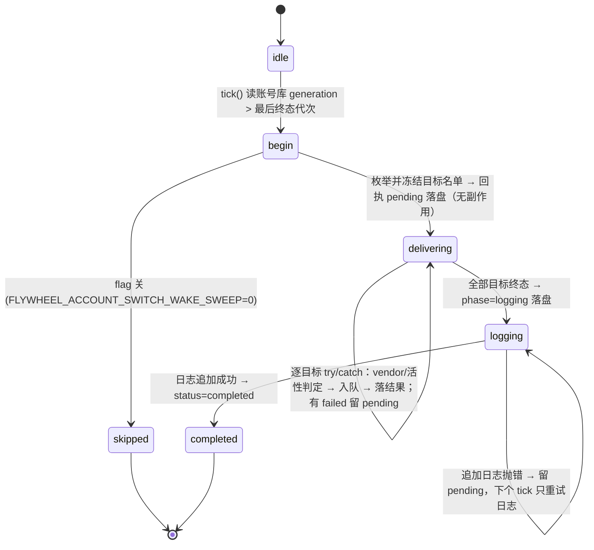

# FLY-2109 切号后唤醒活体 — 实施计划
Issue: FLY-2109 (https://linear.app/geoforge3d/issue/FLY-2109/病根-切号后活着的-runner-不接新账号旧号周额度打满即全体静默只能人眼发现-8)
日期: 2026-10-01
基于: research.md

版本: v1.56.0（暂定，ship 时取空号）· 状态: draft R3（Codex design review R1 3H/6M/1L + R2 2H/5M 全部采纳）

修订 R3 要点：资格复核覆盖「审计已落但无投递证据」的每次重试；目标三态 planned / audited / evidenced 统一 superseded 与失败规则；QA 用真正的 fake profile fixture 脚本；`snapshot().projects`；活性探测改从本 consumer 打开的同一 CommDB 取 `tmux_window`（遵守 `FLYWHEEL_COMM_ROOT/DIR`）；`backend_commdb` 不写 delivered 证据；去掉 `fromHint`，`from` 恒为 null/unknown；runner 写信箱改「先验后写」、Lead 加 `probeDelivered` 认回 main 已写但 sidecar 未 finalize 的写入。

修订 R2 要点：runner 投递证据改为「`delivered_at` 已落」而非 CommDB 行存在；runner 写信箱复用 `MailboxTransport.writeVerified`（pending sidecar 不算成功）；每次不可撤回投递前复核代次 / flag / running / vendor；superseded 只取消未开始目标并保留日志义务；`from` 可空带来源；Lead 筛选用 `effectiveLeadBackend`（含 legacy）；D6 排除自动唤醒行；生产 deps 契约逐项改为真实签名；验收隔离补全 pending / lock / CommDB / StateStore / 收件箱 / profile bin fixture，真凭证切换验收单列为 founder 安排项。

## 0. 一句话

Bridge 里新增一个**按账号库代次消费**的唤醒器 `account-switch-wake.ts`：账号库 `generation` 每前进一次（= 一次真切号），
就枚举正在跑的 Claude runner 与 Claude Lead，用现有信箱通道各投一条固定唤醒消息（三层幂等），逐目标结果落 StateStore 回执表，
并追加一行 JSON 到切号日志。两处 `onSwitchSuccess` 钩子只当门铃立刻触发一次，30s poll 搭车做崩溃补投。不另造通道、不改切号逻辑。

## 1. 为什么这样做（方案对比）

| 方案 | 结论 |
|---|---|
| A. 两个 `onSwitchSuccess` 钩子里直接枚举投信 | 拒绝单独采用：钩子的 `attempted` 含 noop 重复触发；切号已提交但唤醒未投时 Bridge 崩溃即丢；两处各写一份 |
| **B. 代次消费器（钩子 = 门铃，poll = 补投，回执表 = 真源）** | 采用：真切号判定靠 `generation` 前进，noop/失败不前进自然不投；崩溃后重放；一份逻辑覆盖两入口；零新 timer |
| C. 守护进程 / bash CLI 自己投 | 拒绝：本仓无守护进程；bash 不持 StateStore / CommDB / Lead runtime |
| D. 复用 revive scan `tmux send-keys` | 拒绝：本仓无；派单明确走信箱 |

派单四条约束的落点：① 每个活体一条固定消息、幂等（§2.3）；② 写切号日志（§3.4）；③ 只唤醒（§7 不改）；④ 同 `flywheel-comm send` 一路（§3.1 runner 投递 = `send.ts` 的 ①④⑤）。

## 2. 不变量与状态机



1. **只有代次前进才投。** `generation` 仅由 `switch-executor.commitSwitch` 推进；`noop_already_switched` / `failed` / `no_account` 不推进 → 不投。账号库不存在（自愈关）→ `readStore` 返回 `generation:0` → 永不前进 → 静默。
2. **一代次一张回执**（`account_switch_wake_receipts.generation` 主键）。tick 的入口判定：`generation > max(generation where status in ('completed','skipped'))` 且没有同代次 pending → begin；有 pending → replay。连续多次切号（g5、g6）优先处理最新代次 g6；g5 若还 pending 按 §2.5 处理（未开始目标 `superseded`，已有结果保留并记日志）。
3. **目标名单冻结**：第一次尝试时一次性枚举、连同每个目标的确定性 id 写进 `outcome_json` 后才开始任何副作用；重放只处理名单中非终态目标，不重新枚举。
4. **逐目标处理顺序**：先只读查**投递证据**（runner：CommDB `getMessageById(id)?.delivered_at != null`；Lead：`store.isLeadEventDelivered(leadId,eventId)`）→ 有证据 `already_enqueued`（仍幂等补写 `session_events`）→ 否则按 §2.4 复核资格 → 入队。有审计行但无证据 → 视为「未投完」，用同一 id 重试写信箱。读证据失败 → `failed`（可重试），绝不当「未投」。
5. **逐目标隔离**：每个目标独立 try/catch；`failed` 带 `error` + `attempts`，同目标连续 20 次失败 → `gave_up`（终态）。StateStore 自身写失败 → 整个 tick 抛出、回执保持 pending（下个 tick 重来）。
6. **日志阶段独立冻结**：全部目标终态后 `phase=logging` 落盘，此后重放只追加日志。追加失败留 pending；「追加后、completed 前」崩溃 → 重放再追加一行（同 generation 的重复行可识别，接受）。
7. **单飞**：进程内 `inFlight` 布尔；钩子触发与 poll 触发并发时后者直接返回（下个 poll 再来）。
8. **结果词止于「已入队」**：`enqueued` = 审计行 + 信箱 verified 写 + `delivered_at` 已落，不宣称复工。事后核查（本仓无 `message-status` 命令）：审计 `sqlite3 ~/.flywheel/comm/<project>/comm.db "select id,delivered_at,read_at from messages where id like 'account-switch-wake:g<N>:%'"`；收件箱 `<CLAUDE_CONFIG_DIR>/teams/<leadId>/inboxes/runner-<exec8>.json(.flywheel.jsonl)` 里同 id；复工靠 runner 的 DONE 回执与 pane。
9. **零副作用回执**（`skipped:flag_off`、零已开始目标的 `superseded`）日志尽力而为，失败只 `console.warn`，不留 pending；有任何已开始目标的回执必须走 `logging` 阶段。

### 2.3 幂等与证据（各层职责不同，不互相替代）

| 层 | 键 | 保证的是 |
|---|---|---|
| 回执表 | `generation` | 同代次终态后 tick 不再进入；pending 名单冻结 |
| CommDB `messages` | `account-switch-wake:g<gen>:<exec>` | **审计行**去重（`INSERT OR IGNORE`）。行存在 ≠ 已进信箱 |
| CommDB `delivered_at` | 同 id | **runner 投递证据**：只在 `writeVerified` 成功后由 `markInstructionDelivered` 写入 |
| 收件箱 sidecar | `metadata.flywheelId` = 同 id | transport 层重试去重：`finalized:true` 的重写被跳过；`finalized:false`（<60s pending、main 可能为空）会被 `writeVerified` 的 verify 抓出并抛错 → 本目标 `failed` 重试。**sidecar 不覆盖**「main 已写、sidecar pending 过期（>60s）」窗口——codec 恢复时会删旧 pending 再追加一条（`ClaudeMailboxCodec.ts:435-446,552`），所以本 consumer 在每次写之前先用 `verifyLastWrite` 认回已有写入（§3.1a） |
| Lead `lead_events` | `(lead_id, account-switch-wake:g<gen>:<leadId>)` | 同 seq → 同 flywheelId；**Lead 投递证据** = `delivered_at`（`isLeadEventDelivered`） |
| runner 协议 | `[lead-instruction <id>]` | 消费侧幂等：同 id 的 DONE 回执只算一次 |

结论：「不漏投」由证据层（`delivered_at` / `lead_events.delivered_at`）保证——有审计行但无投递证据 → 按 §2.4 复核后用同一个 id 重试；「不重投」由「先验后写」（§3.1a：sidecar finalized 或 main 里已有 (from, content) 匹配 → 直接认回，不再写）+ sidecar 去重 + verify 共同保证。`[lead-instruction id]` 的 DONE 去重只是消费侧的最后一道，不代替信箱去重。

**目标三态**（贯穿 §2.4 / §2.5）：`planned`（未开始）→ `audited`（审计行已落 / `appendLeadEvent` 已返回 seq，但无投递证据）→ `evidenced`（`delivered_at` / `lead_events.delivered_at` 已落）。只有 `evidenced` 的目标才允许「只补标记 / 事件 / 日志」；`audited` 的每一次信箱写入重试都要重新过资格复核。

### 2.4 投递前资格复核（R1#6）

名单冻结只固定**候选身份**。每个目标在异步准备（探 pane / 打开 CommDB）之后、**每一次**准备发起信箱写入之前（首次写入，以及 `audited` 状态下的每次重试），重新核对：
① 账号库当前 `generation` 仍等于本回执代次（否则本代次剩余未开始目标记 `superseded`，已有结果保留，进入日志阶段；最新代次由下一个 tick 处理）；
② flag 实时值（`=0` → `skipped_flag_off`）；③ runner：StateStore `getSession(exec).status === 'running'` 且 CommDB `vendor === 'claude-code'`（否则 `skipped_not_running` / `skipped_vendor`）；
④ Lead：`effectiveLeadBackend` 仍为 claude-code（否则 `skipped_vendor`）。审计行 / seq 已存在**不是授权**：复核不过就记对应 `skipped_*`（审计行留作无害审计）。只有 `evidenced` 目标免复核，后续只补标记 / 事件 / 日志。真正已发出的异步写由 §3.1a 的先验认回收尾。

### 2.5 superseded 的确切语义（R1#8）

新代次到来时旧回执：无投递证据的目标（`planned` / `audited` / `failed`）→ `superseded`；`evidenced` 及其它终态结果保留（`evidenced` 但附带动作未完成的继续补完）；若存在任何已开始的目标，旧回执仍走 `logging` 阶段把日志写出（日志里 `status:"superseded"` + 逐目标结果）；只有**零个已开始目标**的旧回执才是「零副作用跳过」，日志尽力而为。旧代次的日志补写不阻塞最新代次投递（tick 先处理最新代次，再补旧代次日志）。cursor = 终态（completed / skipped / superseded）最大代次。有日志义务的回执在日志成功前保持 pending（可恢复），终态后 `upsert` 拒绝更新。

### 2.6 `from` 的来源（R1#9、R2#6）

账号库只存 `generation / activeAccount / accounts`，没有旧账号；`notifySuccess.from` 不带 generation，route 的 `disposition` 是请求局部变量、钩子是无参调用，watchdog 回调还会先 await post——没有任何可靠的「这次 from 属于哪一代」绑定。因此**不引入 fromHint / 共享缓存**：两处钩子继续无参 `tick()`，回执与日志恒为 `"from":null, "from_source":"unknown"`（显式写出，不省略）。founder 可见的 A→B 已由现有 Alerts 帖子 / notify digest 承载（`notifySuccess`）。文案只用 `to`（= `activeAccount`）。

## 3. 改动

### 3.1 新文件 `packages/teamlead/src/bridge/account-switch-wake.ts`

```ts
export const ACCOUNT_SWITCH_WAKE_FLAG = "FLYWHEEL_ACCOUNT_SWITCH_WAKE_SWEEP";
export const MAX_TARGET_ATTEMPTS = 20;
export const wakeText = (to: string) => `【账号切换】额度已切到新账号 \`${to}\`，请接着做刚才的事。`;
export const runnerWakeId = (gen: number, exec: string) => `account-switch-wake:g${gen}:${exec}`;
export const leadWakeId   = (gen: number, leadId: string) => `account-switch-wake:g${gen}:${leadId}`;

export interface AccountSwitchWakeDeps {
  store: StateStore;                                   // getRunningSessions / getSession / insertEvent / appendLeadEvent / markLeadEventDelivered / isLeadEventDelivered + §3.2 新方法
  readAccountStore: () => AccountStore;                // 缺省 () => readStore(defaultStorePath())
  listClaudeLeads: () => Array<{ projectName: string; leadId: string }>;   // §3.5：effectiveLeadBackend(lead.backend, defaultLegacyBackendOf(project)).backend === "claude-code"
  getLeadRuntime: (leadId: string) => Pick<LeadRuntime, "deliver"> | undefined;   // registry.getForLead
  leadWindowExists: (projectName: string, leadId: string) => Promise<boolean>;    // (await locateLeadWindow(p, l)) !== null
  openCommDb: (projectName: string) => CommDB;         // 完整 CommDB（wakeRunnerMailbox 需要）；new CommDB(commDbPathForProject(p))
  probeRunnerPane: (tmuxWindow: string) => Promise<"alive" | "dead" | "unknown">;   // 只探测；tmux_window 来自本 consumer 已打开的同一 CommDB
  wakeRunner: typeof wakeRunnerMailbox;
  runnerTransportFactory: (backend: "claude-code" | "codex") => Pick<IAgentTeamTransport, "write">;   // §3.1a 先验后写包装
  appendSwitchLog?: (record: AccountSwitchWakeLogRecord) => void;   // VITEST 下 plugin 不接
  env: NodeJS.ProcessEnv; now: () => number; log: (msg: string) => void;
}

export function createAccountSwitchWake(deps): { tick(): Promise<TickResult> }
export function appendAccountSwitchWakeLog(record, env): void      // §3.4
```

`tick()` 按 §2 状态机实现。目标结果枚举：
`planned | enqueued | already_enqueued | skipped_flag_off | skipped_vendor | skipped_not_running | skipped_pane_dead | skipped_no_mailbox | skipped_backend_commdb | skipped_runtime_missing | skipped_window_absent | superseded | failed | gave_up`。

#### 3.1a runner 投递：先验后写（R1#1、R1#2、R2#7）

`wakeRunnerMailbox` 把 `transport.write()` 的返回值丢掉并直接 `ok:true`（`wake.ts:99-112`）；codec 对 <60s 的 pending sidecar 返回 `finalized:false`（main 可能为空）；而「main 已写、sidecar pending 过期」时 codec 会删旧 pending 再追加一条（`ClaudeMailboxCodec.ts:184-196,435-446`），`writeVerified` 是先写后验、拦不住这条重复。所以通过现有 `transportFactory` 接缝注入**先验后写**包装：

```ts
runnerTransportFactory = (backend) => {
  const adapter = AgentTeamTransportFactory.forBackend(backend);
  const mt = new MailboxTransport(adapter);
  return { write: async (a) => {
    try { await adapter.verifyLastWrite({ leadName: a.leadName, recipient: a.recipient, expected: a.payload });
          return { idempotent: true, finalized: true, wroteAt: Date.now() }; }      // sidecar finalized 或 main 已含 (from, content) → 认回，不写
    catch (e) { if (!(e instanceof MailboxWriteError && e.code === "verify_mismatch")) throw e; }
    await mt.writeVerified(a);                                                        // 真写 + 回读核对；pending<60s 的假成功会在 verify 抛错
    return { idempotent: false, wroteAt: Date.now() };
  } };
};
```

`verifyLastWrite`（`ClaudeCodeAdapter.ts:165-195`）先查 sidecar finalized，否则扫 main 全部条目匹配 `(from, content)`——本功能的 content 按 id 确定，所以能认回自己的写入。`send.ts` / `wake.ts` 既有行为不变。

**Lead 路径同一窗口**：`MailboxLeadRuntime.deliver` 直接 `writeVerified`，同样拦不住。为此 `mailbox-lead-runtime.ts` 新增可选方法 `probeDelivered(envelope): Promise<boolean>`（用自己的 `formatEnvelope` + `buildFlywheelId` 调 `verifyLastWrite`，不抛 → true；`verify_mismatch` → false；其它错误 → 抛出 → 目标 `failed`），`LeadRuntime` 接口上声明为可选；consumer 在 `deliver` 前调用，true → 直接 `markLeadEventDelivered` + `already_enqueued`。`CommDBLeadRuntime` 不实现（commdb 回滚模式：crash 在 `insertInstruction` 后、`markLeadEventDelivered` 前会多一条 Lead 指令——明确接受的回滚模式边界，写进 §6）。

**runner 分支**（每目标，顺序固定）：
1. 证据：`db = openCommDb(project)`；`db.getMessageById(id)?.delivered_at` 非空 → `evidenced` → 跳到第 6 步。
2. 异步准备：`sess = db.getSession(exec)`；无行或无 `tmux_window` → `skipped_pane_dead`；`probeRunnerPane(sess.tmux_window)`（`dead` → `skipped_pane_dead`；`unknown` 照投）。**不**用 `lookupTmuxTarget`（它硬编码 `~/.flywheel/comm`，`tmux-lookup.ts:172-179`，无视 `FLYWHEEL_COMM_ROOT/DIR` 覆盖，会把房内活体判死）——投递与活性查询同源于同一个 CommDB。
3. §2.4 复核（首次与每次 `audited` 重试都做）：代次 / flag / `store.getSession(exec).status==='running'` / `sess.vendor==='claude-code'`。
4. 审计行：`db.insertInstructionWithId(id, "bridge", exec, text)`（返回 false = 行已在，继续）→ 目标进入 `audited`。
5. 写信箱：`wakeRunner({ db, execId: exec, fromAgent:"bridge", content:"[lead-instruction "+id+"]\n"+text, metadata:{flywheelId:id, execId:exec, kind:"account_switch_wake"}, backend:"claude-code", transportFactory: runnerTransportFactory })`；
   `ok` → `db.markInstructionDelivered(id)`（= 证据，`evidenced`）→ `enqueued`；`skippedReason` `no_session_lead` → `skipped_no_mailbox`；`backend_commdb` → `skipped_backend_commdb`（**终态、不写 delivered**：该分支没有调 transport 也没有 hook 确认，`wake.ts:63-64`；审计行留着，重放时无证据且仍是 commdb 模式 → 同样 `skipped_backend_commdb`，不会升级成 `already_enqueued`）；其它 → `failed`。
6. 附带动作（幂等）：`store.insertEvent({ event_id:id, execution_id:exec, issue_id: 名单里冻结的 issue_id, project_name, event_type:"account_switch_wake", source:"bridge.account-switch-wake", payload:{generation, to} })`（`event_id UNIQUE` → 重复返回 false 即可）。失败 → 本目标 `failed`，重放时第 1 步证据认回后只重做第 6 步。
每目标 `finally db.close()`。崩溃窗口覆盖：insert 后 wake 前（无证据 → 复核 → 先验：无写入 → 写）；main 已写 sidecar 未 finalize（无证据 → 复核 → 先验：main 匹配 → 认回、不重写 → mark）；wake 后 mark 前（sidecar finalized → 认回 → mark）；mark 后 event 前（证据有 → 只补事件）。

**Lead 分支**（每目标）：证据 `store.isLeadEventDelivered(leadId, eventId)` → `already_enqueued`；`getLeadRuntime` 缺 → `skipped_runtime_missing`；
`!leadWindowExists` → `skipped_window_absent`；§2.4 复核；`seq = appendLeadEvent(leadId, eventId, "account_switch_wake", JSON.stringify(payload), "account-switch:g<gen>")`（目标进入 `audited`）；
`runtime.probeDelivered?.(envelope)` 为 true → `markLeadEventDelivered(seq)` → `already_enqueued`；否则 `deliver(envelope)`；`delivered` → `markLeadEventDelivered(seq)` → `enqueued`；否则 `failed(error)`。`audited` 重试同样先复核再 probe 再 deliver。
`payload = {event_type:"account_switch_wake", execution_id:"", issue_id:"", project_name, summary:text}`（通用渲染 → `[Event #n] account_switch_wake` + `Summary: …`；flywheelId 形如 `<leadId>-<seq>-`，execution_id 为空串）。
**不**把 `account_switch_wake` 加进 `RETRYABLE_LEAD_EVENT_TYPES`。

### 3.2 `packages/teamlead/src/StateStore.ts`

新表（跟随现有 `CREATE TABLE IF NOT EXISTS` 迁移惯例）：

```sql
CREATE TABLE IF NOT EXISTS account_switch_wake_receipts (
  generation INTEGER PRIMARY KEY, status TEXT NOT NULL, phase TEXT NOT NULL DEFAULT 'delivering',
  trigger_from TEXT, trigger_to TEXT, outcome_json TEXT NOT NULL DEFAULT '{}',
  created_at TEXT NOT NULL DEFAULT (datetime('now')), completed_at TEXT)
```

列 `trigger_from TEXT NULL` + `from_source TEXT NOT NULL DEFAULT 'unknown'`（§2.6）。
方法：`getAccountSwitchWakeCursor(): number`（终态 `completed|skipped|superseded` 最大代次）、`listPendingAccountSwitchWakes(): Receipt[]`（按代次升序）、
`upsertAccountSwitchWakeReceipt(r)`（pending 期间保存进度；终态时写 `completed_at`；已终态行不可再改 → 返回 false）。superseded 不是单独方法，而是回执 `status:'superseded'` + 保留的 `outcome_json`。

### 3.3 `packages/flywheel-comm/src/db.ts`

不新增方法：证据查询用现有 `getMessageById(id)`（返回含 `delivered_at` 的行）。不改表、不改 `send.ts`。

### 3.3a `packages/teamlead/src/bridge/mailbox-lead-runtime.ts` + `lead-runtime.ts`（R2#7）

`LeadRuntime` 接口新增可选 `probeDelivered?(envelope: LeadEventEnvelope): Promise<boolean>`；`MailboxLeadRuntime` 实现（§3.1a）；`CommDBLeadRuntime` 不实现。现有 `deliver` / `formatEnvelope` 字节不变。

### 3.3b `packages/teamlead/src/bridge/detection-gap-scan.ts`（R1#5）

D6 `delivery_unconsumed` 的 SQL 加一条排除：`AND id NOT LIKE 'account-switch-wake:%'`。理由：这是 Bridge 自动扇出的 advisory 唤醒，mailbox 模式下 runner 侧没有可靠 ack（`send.ts:89-95` 说明 `read_at` 故意不更新），一次切号就会让每个健康 runner 30 分钟后被报 `delivery_unconsumed`。普通 Lead 指令照旧检测（阳性对照测试保留）。不在入队时伪造 `read_at`。

### 3.4 日志追加器（`account-switch-wake.ts` 导出 `appendAccountSwitchWakeLog`）

路径 `env.FLYWHEEL_QUOTA_LOG_PATH?.trim() || ~/.flywheel/logs/quota-monitor.log`；`openSync(path, O_WRONLY|O_APPEND|O_CREAT|O_NOFOLLOW, 0o600)`，
单次 `writeSync` 一整行，短写抛错，`finally closeSync`。行：
`{"ts","component":"flywheel-bridge","level":"info","event":"account_switch_wake","generation","from","to","status":"completed"|"skipped:flag_off"|"superseded","counts":{…},"targets":[{kind,project,execution_id|lead_id,instruction_id,result,error?,attempts}]}`。
与守护进程 `quota_poll` 行同形（`ts/component/level/event`），同一文件 → 「outcome 旁边」。

### 3.5 `packages/teamlead/src/bridge/plugin.ts`

在 `accountSwitchRepair` 门内（`:7159` 之后）构造 `accountSwitchWake = createAccountSwitchWake({...生产 deps})`，`appendSwitchLog` 在 `process.env.VITEST` 下不接。
- `:7437-7439` 与 `:8164-8168` 两处 `onSwitchSuccess` 体内，在 `postSwitchRescueSweep()` 之后追加 `await accountSwitchWake?.tick()`（各自 try/catch，互不影响；`onSwitchSuccess` 签名不变）。
- `onPollComplete`（`:8111`）里 fleet sensors 之后加一段 `try { await accountSwitchWake?.tick() } catch { warn }`（零新 timer）。
- Bridge 启动时（registry 建好后）调一次 `tick()` 做崩溃补投。
`listClaudeLeads` = `fleetConfigProvider.snapshot().projects.flatMap(p => p.leads.filter(l => effectiveLeadBackend(l.backend, defaultLegacyBackendOf(p)).backend === "claude-code").map(l => ({projectName: p.projectName, leadId: l.agentId})))`（`snapshot()` 返回 `{ projects: ProjectEntry[], state }`（`fleet-data.ts:547-549`），`ProjectEntry` 字段是 `projectName`；legacy 来源 = 项目 `.flywheel/config.yaml` `roles.lead.backend` 或 `FLYWHEEL_LEAD_BACKEND`，`fleet-data.ts:611-627`）。每次 tick 现算，pending 重放时按 §2.4 复核。
`probeRunnerPane(tmuxWindow)` = `probeRunnerProcessLiveness(tmuxWindow)` 的 `dead_pin|absent` → `dead`，`alive` → `alive`，`indeterminate` → `unknown`（CommDB 读错误在 consumer 内已映射为 `failed` 重试）。
两处钩子体内在 `postSwitchRescueSweep()` 之后 `await accountSwitchWake?.tick()`（无参）。
新增一个装配测试 `account-switch-wake.plugin-deps.test.ts`：用真实 `StateStore(':memory:')` + 临时 `CommDB` + 真实 `ProjectEntry` 形状调用 plugin 导出的 `buildAccountSwitchWakeDeps(...)`（从 plugin.ts 抽出的纯装配函数），`snapshot` 用真实 `ConfigSnapshotProvider` 或严格同类型 stub（`{projects, state}`），断言类型通过 `tsc`、`listClaudeLeads` 正确、且目标只存在于 `FLYWHEEL_COMM_DIR` 覆盖目录时活性探测**不访问** HOME 下的 CommDB。

### 3.6 `packages/config/src/feature-flags/registry.ts`

新增 `account_switch_wake_sweep`：`kill_switch` / env `FLYWHEEL_ACCOUNT_SWITCH_WAKE_SWEEP` / `default_on` / `default:true` /
readSite `packages/teamlead/src/bridge/account-switch-wake.ts` `createAccountSwitchWake.tick` `call_time` `env-param` / `toggleable:"direct"` /
`directToggleProof:"feature-flags-direct-toggle.test:account_switch_wake_sweep live-observe"`（现有文件 `packages/config/src/__tests__/feature-flags-direct-toggle.test.ts` 遍历所有 direct flag；另在 consumer 测试里证明同一个 consumer 实例在 `process.env` 变化后下一个 tick 观察到）。文案：「切号成功后把正在跑的 Claude runner / Lead 叫醒（信箱投一条固定消息）；=0 关掉 = 回到切号后活体静默等 reset」。

### 3.7 文档

`engineering/doc/milestones/FLY-2109.md`（里程碑一行）+ 本文件夹 `implementation.md`（实现体填）。

## 4. 测试（TDD，先红后绿）

`packages/teamlead/src/bridge/__tests__/account-switch-wake.test.ts`（`StateStore.create(":memory:")` + 临时目录真 CommDB + 假 `wakeRunner` / `deliver`，仿 `runner-wake-no-transport.test.ts` 与 `send-mailbox.test.ts`）：
1. 代次前进（g0→g1）+ 2 个 running claude-code runner + 1 个 Claude Lead → 每个恰 1 条（id 精确）、文案精确、回执 completed、`targets` 三项 `enqueued`、`session_events` 有 `account_switch_wake`、Lead `lead_events` delivered；declared state **未**被清。
2. 切号失败形态：代次不前进（`generation` 不变）→ 0 条、无回执；账号库不存在 → 0 条、无回执、无日志。
3. 重复触发：同代次连续 tick ×5（钩子 + poll）→ 每目标仍 1 条；回执只一张；`wakeRunner` 调用次数 = 目标数。
4. vendor：`codex` / `none` / NULL / 行缺失 → `skipped_vendor`，0 条；`adapter_type` 非 claude 但 vendor claude-code → 照投（vendor 为准）。
5. 活性：`probeRunnerPane` 返回 `dead` → `skipped_pane_dead`；`unknown` → 照投。
6. Lead：Codex backend Lead 不在名单；runtime 缺 → `skipped_runtime_missing`；窗口不存在 → `skipped_window_absent`；`deliver` 失败 → `failed`、下个 tick 重试、成功后 `enqueued` 且 `appendLeadEvent` 返回同 seq（不双写）。
7. 逐目标隔离：P1 的 CommDB 打不开 → P2 runner 与 Lead 照投、回执 pending、P1 `failed`；恢复后下个 tick 只补 P1；连续 20 次失败 → `gave_up` 进日志阶段并 completed。
8. 崩溃重放：在「投信后、保存结果前」让 `upsertAccountSwitchWakeReceipt` 抛错 → 关闭重开 StateStore（同一 sqlite 文件）→ 重放：已投目标由证据认回 `already_enqueued`、0 条新信、名单完整；期间新起的 running 体不在名单。
9. flag：`=0` 且尚未落名单 → `skipped:flag_off`，重开不补发；投信中途 `=0` → 未结算目标先查证据，无证据记 `skipped_flag_off`，已投结果保留。
10. 连续切号：g1 pending 时账号库到 g2 → g1 `superseded`、g2 正常投（文案是 g2 的新号）。
11. 日志：`appendSwitchLog` 抛错 → pending `phase:logging`、0 条新信；恢复后只追加日志、completed；记录含 generation/from/to/counts/targets；跳过类回执日志失败不阻塞。
12. `wakeRunner` 返回 `no_session_lead` → `skipped_no_mailbox`；`backend_commdb` → `skipped_backend_commdb`：审计行存在、**`delivered_at` 为空**、transport 未被调用；回执保存失败后重放 → 仍 `skipped_backend_commdb`，不会变 `already_enqueued`。
13. **崩溃窗口 ×4（R1#1、R2#7）**：(a) 审计行已插、wake 前抛错 → 重放用同 id 真正写入收件箱（断言收件箱 JSON 里有该 id，不只断审计行）；(b) wake 成功、`markInstructionDelivered` 前抛错 → 重放 sidecar `finalized:true` → 先验认回 → 标 delivered，收件箱恰 1 条；(c) delivered 已标、`insertEvent` 抛错 → 重放 `already_enqueued` 且补写事件；(d) **main 已含该确定性消息、sidecar pending 已过期（>60s）、`delivered_at` 为空** → 重放先验命中 main → 不重写、标 delivered，收件箱仍恰 1 条。Lead 同样 4 窗口（`probeDelivered` 认回）。
14. **pending sidecar（R1#2）**：真实 `ClaudeCodeAdapter` + 临时 `CLAUDE_CONFIG_DIR`：预置 <60s 的 pending sidecar 条目而 main 为空 → 本轮 `failed`（`verify_mismatch`），不标 delivered；sidecar 过期（>60s）后重放 → 写入成功；已 finalized 的条目重放 → 跳过 verify、不双写。
15. **投递中资格复核（R1#6、R2#1）**：用 deferred Promise 卡住 `probeRunnerPane`，期间 (a) 账号库推进到 g2 → 恢复后旧目标不发新信、本回执 `superseded`（已投结果保留）、下个 tick 投 g2；(b) flag 置 0 → `skipped_flag_off`；(c) session 变 completed → `skipped_not_running`；(d) 两个 tick 并发 → 第二个直接返回。**`audited` 重试复核**：审计行已落、main 为空后重启，分别 (e) 关 flag → `skipped_flag_off`、(f) 推进 g2 → `superseded`、(g) session completed → `skipped_not_running`、(h) Lead 改成 codex → `skipped_vendor`——四种都**不写信箱**，审计行 / seq 保留。
16. **Lead 后端判定（R1#7）**：显式 claude-code 覆盖 legacy codex → 投；未显式 + legacy codex（config.yaml / `FLYWHEEL_LEAD_BACKEND`）→ 不投；纯默认 → 投；pending 重放期间 Lead 改成 codex → `skipped_vendor`。
17. **superseded（R1#8、R2#1）**：g1 R1 `evidenced` / R2 `audited` 或 `failed` 时到 g2 → R2 `superseded`（无证据）、R1 结果保留、g1 走 logging 写出 `status:"superseded"` 日志；g1 停在 logging 失败时到 g2 → g2 先投、g1 日志随后补写；superseded 日志失败 + 重启 → 重放继续补日志。
18. **from（R1#9、R2#6）**：钩子路径 / poll 路径 / 首次启动 g>0 / 跨多代次 / 两次切号回调交错 / noop 回调 → 一律 `from:null, from_source:"unknown"`，JSON 行显式含 `"from":null`；文案只含 `to`。
19. **D6（R1#5）**：`detection-gap-scan` 测试：自动唤醒行 delivered 31 分钟未读 → 无 `delivery_unconsumed`；普通 Lead 指令同条件 → 有（阳性对照）。
20. **flag 实时（R1#10）**：同一 consumer 实例，`process.env` 置 0 后下一个 tick 观察到 `skipped_flag_off`，置回 1 后恢复。

其它：
- `StateStore.account-switch-wake.test.ts`：pending 可更新、终态不可更新、cursor 取终态最大代次、superseded。
- 日志追加器：临时文件一行合法 JSON、拒绝 symlink（`O_NOFOLLOW` 抛错）、`FLYWHEEL_QUOTA_LOG_PATH` 覆盖、父目录缺失抛错。
- `account-switch-route.test.ts` / watchdog 测试：`onSwitchSuccess` 行为不变（签名不变，现有用例照过）。
- `account-switch-wake.plugin-deps.test.ts`：真实 deps 装配（§3.5），杜绝 `p.name` / `snapshot()` 形状 / `insertEvent` 缺列这类接口不匹配；活性探测不触 HOME CommDB。
- `mailbox-lead-runtime.test.ts` 增 `probeDelivered`：sidecar finalized → true；main 匹配 / sidecar pending 过期 → true；都无 → false；其它 I/O 错误 → 抛。
- `config` 包：registry 新条目 + drift 测试（readSite 文件含 env 名）+ `resolve.direct-toggle.test` live-observe。
- 回归：`runner-wake*.test.ts`、`send-*.test.ts`、`mailbox-lead-runtime.test.ts` 不受影响（未改它们的被测代码）。

实施顺序（R1 建议）：先锁定 §2.3–§2.6 投递/恢复契约并写 13–18 的故障测试 → StateStore 回执表 → consumer → 真实 plugin deps 装配 + D6 + flag → 按 §5 验收。
本机只跑相关测试（上述文件 + `git grep` 新 literal：`account-switch-wake`、`account_switch_wake`、`FLYWHEEL_ACCOUNT_SWITCH_WAKE_SWEEP`、`account_switch_wake_receipts`、`runnerTransportFactory`），不跑全量。

## 5. 验收（真机 / QA 房）

### 5.1 本机 / 测试房验收（隔离集，R1#3）

两个路径重定向不够：账号池文件存在时 plugin 会装配**真实** `flywheel-claude-profile` CLI，它默认读写生产 profiles、机器 Keychain item、`.active`、`~/.claude.json`；pending store 也有自己的生产默认路径。测试房 Bridge 必须同时设：

| 资源 | env | 说明 |
|---|---|---|
| 账号库 | `FLYWHEEL_CLAUDE_ACCOUNTS_PATH` | 已有读点 |
| 账号锁 | `FLYWHEEL_CLAUDE_ACCOUNTS_LOCK` | 已有读点 |
| pending 切号单 | `FLYWHEEL_ACCOUNT_PENDING_PATH` | 已有读点（`pending-store.ts:49-53`） |
| 切号日志 | `FLYWHEEL_QUOTA_LOG_PATH` | 本单新读点 |
| profile CLI | `FLYWHEEL_CLAUDE_PROFILE_BIN` = **新增 fixture 脚本** `packages/teamlead/src/__tests__/fixtures/fake-claude-profile.sh` 的绝对路径：只支持 `use <name>`（把 `<name>` 写进 `$FLYWHEEL_FAKE_PROFILE_STATE` 指定的房内 `.active` 文件，退出 0）和 `status`（输出 `Active profile: <name>`）；不碰 Keychain / `~/.claude.json` / 生产 profiles。注意现有 `claude-profile-cli.integration.test.ts` 的 `PROFILE_BIN` 是**真实脚本**（靠临时 profiles + fake security/freshness 隔离），不是 fake，本计划不复用它 | 已有读点（`claude-profile-cli.ts:53-56`） |
| CommDB | `FLYWHEEL_COMM_DIR`（并**清除** `FLYWHEEL_COMM_ROOT`，它优先级更高，`commdb-path.ts:19-24`） | 已有 |
| 收件箱 | `CLAUDE_CONFIG_DIR` | 已有 |
| StateStore | 房内 Bridge 自带 | 已有 |

验收步骤：
0. 起房前先证明：`FLYWHEEL_CLAUDE_PROFILE_BIN` 指向 fixture、`$FLYWHEEL_FAKE_PROFILE_STATE` 与其它 8 个路径都落在房目录（打印并 `realpath` 校验）。mtime 比对只是事后复核。
1. 起房前后对比：生产 `~/.flywheel/claude-accounts.json`、`account-switch-pending.json`、`~/.claude.json` mtime 不变；生产 `quota-monitor.log` 行数不变；`security find-generic-password` 对应 Keychain item 的修改时间不变。
2. 房内起 1 个 Claude runner + Lead，`POST /api/account-switch`（走 fake profile bin）→ 1 分钟内 runner 收件箱出现 `account-switch-wake:g<n>:<exec>`、runner 给 Lead 回 DONE、Lead 窗口收到 `[Event #n] account_switch_wake`、房内日志多一行 `account_switch_wake` 且 `targets` 列出该体 `enqueued`。
3. 重复 POST 同一 pending（noop）→ 日志不新增、收件箱不新增。
4. 单测：切号成功→每个活体恰一条；失败→不投；重复→幂等；崩溃→重放不重复（§4 13–18）。
5. 529 e2e flow 跑一遍（改了运行中流程）。

### 5.2 真凭证切换验收（单列，founder 安排）

「旧号额度墙 → 切号 → 体用新号继续」依赖**机器级** Claude 登录（Keychain 共用），QA 房无法在不动生产凭证的前提下模拟。这一步与 QA@1 的结论一致：由 founder 决定甲（隔离脚本 + 诚实边界）或乙（整机 personal1→business 真切一次，QA 只观察活体是否 1 分钟内接上新号），本计划不把 fake-bin 通过当作真 token 刷新通过。

## 6. 风险与回滚

| 风险 | 处理 |
|---|---|
| 唤醒一个新号也打满的体 → 它再撞墙 | 结果词止于 enqueued；不改额度判定；真机验收观察一次即可 |
| 信箱 verified 写在 Lead 收件箱锁争用下偶发 `verify_mismatch` | 目标 `failed` 下个 tick 重试（≤20 次），与 LeadRuntime 现有行为一致 |
| DONE 回执给 Lead 造成 N 条噪音 | 与 Lead 手动 `send` 完全同形；N = 活体数，一次切号一轮，可接受；Lead 由此核对「谁醒了」 |
| `locateLeadWindow` 在非 tmux 部署返回 null → Lead 永远 `skipped_window_absent` | 与现有 LeadWatchdog 对 Lead 窗口的假设一致（Claude Lead = pane 型） |
| 日志目录不存在 | 留 pending 重试；QA 房由 env 指到房内已存在目录 |
| commdb 回滚模式（`FLYWHEEL_COMM_BACKEND=commdb`）下 Lead 投递崩溃窗口 | `CommDBLeadRuntime.insertInstruction` 无 id 幂等，crash 在 insert 后、`markLeadEventDelivered` 前会多一条 Lead 指令；接受（回滚模式本身即非常态），runner 侧该模式只落审计行 |
| 回滚 | `FLYWHEEL_ACCOUNT_SWITCH_WAKE_SWEEP=0`（direct toggle，无需重启）；或 revert PR。新表无人读时无害 |

## 7. 不改

`switch-executor.ts`、`account-switch-repair.ts`、`account-switch-watchdog.ts`（签名与返回形状）、`rescue.ts` login_expired sweep、
额度判定、Codex / Antigravity / Kimi 路径、`send.ts`、`wake.ts`、CommDB schema、`RETRYABLE_LEAD_EVENT_TYPES`、bash `flywheel-claude-profile`。`detection-gap-scan.ts` 只加一条 id 前缀排除（§3.3b）；`lead-runtime.ts` / `mailbox-lead-runtime.ts` 只加一个可选 `probeDelivered`（§3.3a）。
不结束 / 不替换体、不手动切号。
