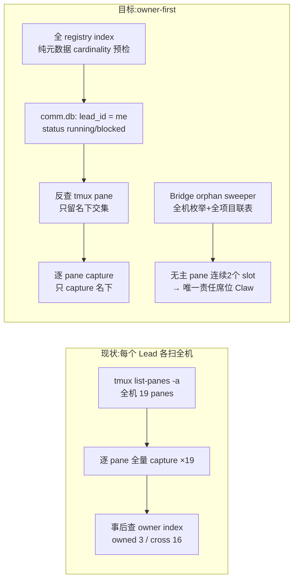

# FLY-2118 Lead 巡检可见面收窄 — 实施计划

Issue: FLY-2118 (https://linear.app/geoforge3d/issue/FLY-2118/巡检制度-lead-巡检只应看见自己名下的-runner-现在是每个-lead-各扫全机)
日期: 2026-08-28
基于: research.md

**Status**: codex-approved(R3 APPROVED,3 轮);2026-08-28 founder/Lead 实施期裁定已并入(见 §7)

---

## 0. 一句话

把 Lead 巡检的可见面从「整机扫描后按 owner 过滤」翻转为「从自己名下的 owner index 出发
反查 pane」;无主 pane 的兜底移交给 Bridge 侧 orphan sweeper(告警 → alert 面,
唯一责任席位=`claude-infra-bot-lead`/Claw);`runner-patrol-rules.md` §0 范围合同与 Claw
身份规则同 PR 改写。病根自动去重按 founder 裁定从本单删除,维持现行人工判重。

## 1. Goals / Non-goals

**Goals**
1. Lead 巡检报告与 capture 面只含自己名下 Runner pane(验收 1/2)。
2. 无主 pane 仍被发现,唯一责任人确定(Bridge sweeper →
   `claude-infra-bot-lead`/Claw),可做阴性对照(验收 3)。
3. 规则文件与实现一致,无「规则说整机、实现只扫自己」的裂缝(验收 4)。

**Non-goals(明确不做)**
- 不动 STEP 5 的整仓 PR/CI 快照(项目级真相,2 个 REST 调用,无 pane 属性)。
- 不动巡检频率、六步骨架、FINDING-GATE 完成门结构、founder-only 硬边界。
- 不做 FLY-271/368 的自动恢复引擎;sweeper 只做「枚举 + 联表 + 告警」,不处置。
- 不迁移 FLY-2072 历史 comment / 历史类别子 issue,不改步骤 A(补账/停手)的语义。
- **不做病根自动去重**:不新增 `class_key` Bridge 路由/ledger/并发状态机,步骤 B
  保持现行人工判重。此项是 founder 2026-08-28 实施期明确砍掉的 scope。
- 不新增 outbox/转发子系统:STEP 3/4 无法归属的 finding 以 UNAVAILABLE 显式失败,
  不虚构「sweeper 会接住」的通道。

## 2. 设计总览

数据流不变的部分:六步报告骨架、continuity sidecar(停滞半边)、FINDING 行格式、
步骤 A 补账配方、UNAVAILABLE 出口、FINDING-GATE。

## 3. 工作分解

### WP1 — 快照脚本:owned-scope 枚举(`scripts/lead-patrol-snapshot.sh`)

1. **全 registry cardinality 预检(保留既有防线)**:现行脚本对同一 live target 被多条
   active session 声明会报 `SESSION_TARGET_AMBIGUOUS`(L363-370;
   `lead-patrol-snapshot.test.sh:382-397` 钉住)。owner-first 化**不得**丢掉这道防线:
   仍读取全 registry 的 owner index(纯元数据,与今日 `run_comm_index` 相同,零 capture),
   对**我名下**的每个 target 检查 ownership cardinality;同一 target 出现多个非空 owner
   claim → fail closed:STEP 2 `UNAVAILABLE(structural: session_target_ambiguous)`,
   该 target **任何一方都不 capture**。
2. **OWNED_TARGETS**:从本项目 comm.db 读
   `lead_id = '$LEAD_ID' AND status IN ('running','blocked') AND tmux_window NOT LIKE '%:pending'`。
   comm.db 不可读 → `UNAVAILABLE(…: owner_index_incomplete)`(现语义沿用);
   「绑定窗口 + lead_id 空」显式判 `UNAVAILABLE(structural: owner_index_incomplete)`
   (R1 防御),不静默归无主。
3. **STEP 1 改口径**:`tmux list-panes -a` 仍在脚本内部执行一次(单次进程、纯元数据),
   `RUNNER_PANES := 全机 canonical panes ∩ OWNED_TARGETS`。报告 STEP 1 段只写名下
   roster ↔ live pane 双向对账:index 有 pane 无 → `MISSING_PANE` finding;
   pane 有 index 无 → 不进入本报告(sweeper 职责)。`tmux list-windows -a` 原文段删除。
4. **STEP 2 改集合**:capture/哈希/判据循环体不变,只跑交集内 pane;`owner=` 恒为
   `owned`;`cross-boundary|foreign-registry` 分支删除(`unknown` 仅保留给 cardinality
   歧义 pane 的 fail-closed 行,与既有测试语义一致)。
5. **continuity sidecar**:保留停滞半边;`unclaimed` orphan 计数半边删除(移交 WP3)。
6. **兼容合同**(R6):六步骨架、`pane_count=N`+N 行 `PANE_EVIDENCE`、`REPORT_PATH`、
   FINDING-GATE 可解析性全部保留 —— 旧规则 Lead(重启前)消费新报告不撞完成门。

**测试**(`scripts/__tests__/lead-patrol-snapshot.test.sh` 扩展;harness 已有
`TMUX_CALL_LOG` 机制):
- 双 Lead 各跑一次:按 call log 断言每个 pane 的 `capture-pane` 次数恰为 1 且
  调用方 = owner(验收 1)。
- 别家健康 pane:断言本 Lead 报告全文不含其 pane id/target(验收 2)。
- **歧义测试改强**:两个不同 Lead 声明同一 target → 双方各自报
  `session_target_ambiguous` 结构错误,且该 target capture 次数为 0。
- 名下 index 行无 pane → `MISSING_PANE`;绑定窗口 lead_id 空 → `owner_index_incomplete`。
- 更新 `fly369-patrol-rule.test.ts` 中钉住整机/cross-boundary 口径的既有断言。

### WP2 — STEP 3/4:归属物化 + fail-closed(同文件)

**边界事实**:STEP 3/4 的 `sessions` 是 StateStore 表(**无 lead_id**);owner 事实在
comm.sessions(脚本 `run_sql` 已 `ATTACH ... AS comm`)。归属不能靠散落的 inner join
(会静默吞掉 null/missing/歧义)。

1. **归属物化 CTE**(一处定义、各类 finding 共用),candidate set 分层取,
   **cardinality 只在选中的 cohort 内算**(全历史 distinct 计数会把正常 Lead 交接
   —— 历史 completed=lead-a、当前 running=lead-b —— 永久判成歧义,禁止):
   1. execution 级精确行:`comm.sessions.execution_id → lead_id` 命中即归属;
   2. 否则看该 issue **当前** `running|blocked` 行:恰一个 distinct 非空 lead →
      归属;多个 → 歧义;
   3. 无当前行 → 取最大 `started_at` cohort 的 owner,并只在该 cohort 内计并列
      cardinality(并列不同 owner → 歧义)。
   所有 join 用 **LEFT JOIN**。
2. **过滤语义**:`attributed_lead = '$LEAD_ID'` 的行进本报告;
   `attributed_lead` 为其他 Lead 的行不进本报告;
   归属为 NULL 或上述歧义 → 该 STEP 整体
   `UNAVAILABLE(structural: owner_attribution_incomplete)`,报告只写
   **聚合原因与计数**,不泄露别家 identifier。不声称有其他通道接住 —— 显式失败
   就是通道(UNAVAILABLE 建单流程既存)。
3. **逐类修正**:`DEAD_LETTER_PENDING` 增加 `d.project_name = '$PROJECT_NAME'` 且
   `d.lead_id = '$LEAD_ID'`;`MAILBOX_STALE`/`WAKE_UNACKED`/TURN 类/
   `NODE_SESSION_NOT_LIVE`/`VERDICT_HEAD_MISMATCH` 全部改经归属 CTE。

**测试**:双 Lead 数据分属断言;lead_id 为 null;execution 缺行;
**历史 lead-a → 当前 lead-b 正常归 b**;两个当前 owner → 歧义;最大 `started_at`
并列不同 owner → 歧义;跨项目 dead-letter 不串账;
`owner_attribution_incomplete` 触发时不含别家 identifier。

### WP3 — Bridge orphan-pane sweeper(新文件 `packages/teamlead/src/bridge/patrol-orphan-sweeper.ts`)

1. **枚举与分类**(平移脚本 L363-389 语义):`tmux list-panes -a` → canonical 口径 →
   以 `runner-` 后缀解析项目名:registry 外 → foreign-registry 豁免;registry 内 +
   该项目 comm.db 只读联查无 `running|blocked` match → unclaimed。
2. **sweep 状态机**(StateStore migration:新表 `patrol_orphan_watch(target TEXT
   PRIMARY KEY, pane_fingerprint, first_seen_at, streak, last_slot_start,
   interval_ms, last_alert_at)` + accessors):
   - **interval 按项目取**:`effectivePatrolIntervalMs(projectConfig, globalConfig)`
     实际是 per-project(项目配置 hot-read),不存在「全局 interval」;每个 target
     以其解析出的项目的 effective interval 计算
     `slot_start = floor(nowMs / interval) * interval`,并把 `interval_ms` 持久化在
     episode 行里 —— interval 运行时变化 → episode 重置(旧 `last_slot_start`
     失去可比性)。
	 - **pane identity fingerprint**:`list-panes` 同时取 `#{pane_id}`、
	   `#{pane_pid}` 与 `#{session_created}` 作为 fingerprint;同名 target 若 fingerprint 变化(tmux
     server 重建 / target 复用)→ episode 重置,不继承旧 streak。
   - **连续性判据**:仅当 `current_slot_start == last_slot_start + interval_ms`
     才允许 `streak+1`;跨过 slot(包括因读取失败跳过的 slot)→ streak 从 1 重启。
     GatePoller rider 每分钟被调,同 slot 重复调用零效果(`last_slot_start` 幂等)。
   - **完整读取前置**:registry 与**全部**相关 comm.db 读取成功才允许推进任何 streak;
     任一读取失败(busy/schema/缺库)→ 本 slot 不推进、发 owner-index-incomplete
     failure 告警(带冷却),绝不把「读不到」解释成「无 match」;该 slot 视为
     「跨过」,打断连续性。
   - 本 slot 不再 unclaimed(被认领 / 变 foreign / pane 消失)→ 立即清除该 target 的
     episode 行。
   - `streak >= 2` → 发告警,`last_alert_at` 冷却 30 分钟(复用现有 cooldown 模式)。
   - Bridge 同 slot 重启:表落 StateStore,`last_slot_start` 幂等保证同 slot 不双计。
   - **成功回执(供部署探针与 QA 用)**:每个完成的 slot 打一行精确 success log
     (含 slot_start、registry/comm.db 完整读取结果、canonical pane 数、unclaimed 数)
     —— 零 orphan 的健康机器也有可验收信号,不依赖 watch 表有行。
3. **告警面(kind contract 全量落实)**:新增 `orphan_pane` 进
   `LeadAlertNotifier.ts` 的 `ALERT_EVENT_TYPES` 封闭联合 + `bridge/kind-contract.ts`
   的 exhaustive owner/ARC 映射 + ticket-owner map →
   **Claw(`claude-infra-bot-lead`)**;
   `severity: "severe"`、`projectName: FLEET_ALERT_PROJECT`。测试断言 **notifier 最终
   payload 的 owner 解析结果**,不只断言 callback 被调。
4. **调度**:GatePoller 第二个 rider(独立单飞 guard,仿 `createLeadPatrolTickPass`)。
5. **不处置**:sweeper 永不 kill/send-keys/写 CommDB;只读 tmux 元数据 + 只读 comm.db
   + 写自己的 watch 表 + 发告警。

**测试**(`patrol-orphan-sweeper.test.ts`,注入式):连续两 slot → 恰一条告警;单 slot /
同 slot 重复调用 → 不告警;foreign-registry → 永不;恢复/消失 → episode 清除;
fingerprint 变化(tmux server / 同 target 重建)→ 从零计;同 slot 重启幂等;
tmux/DB 失败 → 不推进 + incomplete 告警 + 连续性打断;**漏一 slot → streak 重启**;
**per-project 不同 interval 各自成立**;**interval hot change → episode 重置**;
冷却后重告警;成功回执 log 行含 slot 与读取结果;StateStore migration 持久化测试。
**阴性对照(共享 fixture 两态端到端)**:同一 fixture(含一个无主 pane + 双 Lead
snapshot 各跑一遍)下:(a) 全部 Lead 报告不含该 pane 且 sweeper 关 → 全系统零上报;
(b) sweeper 开 → 恰一条告警。以此证明兜底真的由 sweeper 独家承担(验收 3)。

### WP4 — 规则文件 + Claw 身份规则改写

与 WP1-3 同 PR 原子提交:

1. **§0 范围合同**(L38-44)改为:检测范围 = **你名下 Runner pane**(owner index
   反查;comm.sessions.lead_id 为 scope 权威;Bridge tick 名册仍是待核声明,两账不一致
   = finding)+ 当前项目主仓外部真相。无主 pane 由 Bridge orphan sweeper 兜底,
   唯一责任席位为 `claude-infra-bot-lead`(Claw)。处置权限一句不变。
2. STEP 1/2 文本随 WP1 口径改:owner 取值域收敛(`owned` + 歧义 fail-closed);
   跨界判据、foreign-registry 分支、L271-275 round-table 跨界聚合上报段删除。
3. 步骤 B 的人工 `class_key` 判重、FLY-2072 子 issue 写入与 receipt 合同**字节级
   保持现状**;本单不引入自动去重服务。
4. Claw 的 `.lead/claude-infra-bot-lead/identity.md` 增加 `orphan_pane` 独家兜底职责:
   它消费 sweeper 告警并按 Alerts 固定流程处置/转交;其他 Lead 不再为 orphan 扫全机。
5. 六步结构、步骤 A/B、UNAVAILABLE 出口、FINDING-GATE、附录 A/B 不动。
6. **规则 pin 测试**只重钉 §0 / STEP 1/2 的 owned 范围与 Claw 独家兜底锚点;
   `fly369-patrol-rule.test.ts` 现有 Step B 人工判重与 receipt 断言保留。

### WP5 — 验收证据(QA 节点执行)

| 验收 | 证据形式 |
|---|---|
| 1 同 pane 只被 owner capture 一次 | hermetic:`TMUX_CALL_LOG` 计数断言。真机:临时 PATH-shim tmux logging wrapper(`bounded-run.sh` 不记录子命令,不能拿它当计数器)包住双 Lead 各一轮 snapshot,数 `capture-pane` 行 |
| 2 别家健康 runner 不出现 | 报告全文 grep 阴性断言(hermetic + 真机) |
| 3 无主 pane 有人报 + 阴性对照 | WP3 共享 fixture 两态端到端;真机造无主 pane 观察 alerts |
| 4 规则与实现一致 | 规则 diff、Claw identity diff 与脚本 diff 同 PR;review 比对 §0 与 STEP 1/2 行为 |

## 4. 发布 runbook 与回滚(不新增机制,按既有部署班车执行)

「单 PR 原子」只保证代码原子,不保证运行时原子:`converge-flywheel-bin` symlink 使
snapshot 内容在 main fast-forward 后**立即**变化,而规则/Bridge 随重启生效。为消除
「新脚本旧 Bridge」「无人兜底」窗口,部署窗口按以下顺序(全部为既有操作,写入 PR body
供操作者执行):

1. **排空 Lead patrol**:部署窗口开始时暂不投递新 patrol_tick(既有 deploy 班车本就
   重启 Leads;操作上 = 先停 Leads,天然停 tick 消费)。
2. main fast-forward + StateStore migration(随 Bridge 启动自动跑)。
3. 启动 Bridge,health check;等到 sweeper 首个完成 slot 的**成功回执 log 行**
   (WP3.2 定义,含 slot_start 与 registry/comm.db 完整读取结果 —— 零 orphan 的健康
   机器也会打这一行)。
4. 重启 Leads(新规则 bundle 装配)。
5. **回滚**:反向顺序 —— 停 Leads → revert + 主仓回退(symlink 内容随之回旧)→
   Bridge 回旧版启动 → 起 Leads。`patrol_orphan_watch` 为纯新增表,回滚不需数据迁移。

此顺序下不存在「旧规则 Lead 跑新脚本」窗口(Leads 最后起),WP1.6 的兼容合同仍保留
作为深度防御(异常时序下不撞完成门)。

## 5. 风险与开放问题

1. **lead_id 覆盖依赖单点**:scope 权威押在 comm.sessions.lead_id;R1 实测 13 库零缺失
   + 脚本/CTE 双层 fail-closed。未来新增不带 leadId 的注册路径的失败形状 = 显式
   UNAVAILABLE,不是静默漏看。
2. **sweeper 依赖 Bridge 存活**:Bridge 停机期间无 orphan 兜底 —— 与现状 patrol_tick
   一致,Bridge 停机有独立告警面。
3. **病根重复记账仍可能发生**:founder 已明确不做自动去重;保留现行人工判重是接受的
   剩余风险,不得在本单私自补回服务端 `class_key` 状态机。

## 6. 实施顺序(后继 implement 节点)

WP3(Bridge,TS)→ WP1/WP2(脚本)→ WP4(规则 + Claw identity,依赖 WP1-3
定稿口径)→ WP5(QA 证据)。TDD:每个 WP 先写红测试。全仓门:
`pnpm lint` + `pnpm -r build` + `pnpm test:packages:run` + shell 测试套件。

## 7. 设计评审记录

- R1(Codex,xhigh,2026-08-28):CHANGES REQUESTED,6 条 —— ① 保留
  SESSION_TARGET_AMBIGUOUS 防线;② STEP 3/4 归属需物化 CTE + fail-closed,DEAD_LETTER
  加 project 约束,撤销「sweeper 接住 unattributable」;③ ledger 不能承诺跨 Linear
  exactly-once → marker 为真相、ledger 为索引 + reconcile + replay receipt + cutover
  策略;④ sweeper 需 slot 化状态机与完整读取前置;⑤ orphan_pane 进 kind-contract、
  路由不进 GEMINI_SCOPED_REACHABLE、服务端算 key;⑥ 部署 runbook 消除无人兜底窗口、
  阴性对照做成两态端到端、真机计数用 logging wrapper。全部采纳,已并入上文。
- R2(Codex,xhigh,resume,2026-08-28):CHANGES REQUESTED,5 条 —— ① occurrence
  receipt 状态机唯一化(首次 marker 在 description/receipt=child UUID,再次在
  comment/receipt=comment UUID;N 由 distinct markers 推导并幂等校准);②
  tokenAuthMiddleware 无 token 时 no-op → 未配置 token 固定 503 + 请求 schema 全量
  合同;③ interval 是 per-project 且 hot-read → slot 按项目算 + pane fingerprint +
  连续性判据 + 漏 slot 重启;④ 全历史 cardinality 会把 Lead 交接判歧义 → cohort
  分层归属;⑤ 部署探针改为真成功信号(sweeper 成功回执行 + authenticated Linear
  exact-read),`fly369-patrol-rule.test.ts:355-390` 旧 pin 整段重钉。全部采纳。
- R3(Codex,xhigh,resume,2026-08-28):**APPROVED**(绑定 commit `2172d1527` 的
  plan 内容;本行与 Status 翻转是唯一后置 diff)。附一条**实现期防御**(不阻塞):
  `bodyFields` 为自由文本而 occurrence N 由机器 marker 推导 —— 实现时服务端只解析
  自己渲染的保留 metadata 行,并拒绝/编码自由文本中的 `class_key:` /
  `patrol-finding:` 保留前缀,加 marker-injection 单测;key 计算只用
  errorCode/guardKey 两字段,请求体以 WP4.4 五字段 schema 为准。
- **Founder/Lead 实施期裁定**(2026-08-28 22:11Z,
  `[lead-instruction f93ac1ac-a0f0-4139-a582-87528b6defa1]`):① owner index 继续使用
  Bridge 既有 runner 启动归属账,不新造名册;② orphan sweeper 的唯一责任席位明确为
  `claude-infra-bot-lead`/Claw,Claw identity 同 PR 改写;③ 病根自动去重整块删除,
  步骤 B 维持人工判重。此裁定覆盖 R1-R3 中所有 `class_key` 自动化段落;上文工作包已
  按最终裁定重排为 WP1-5。
