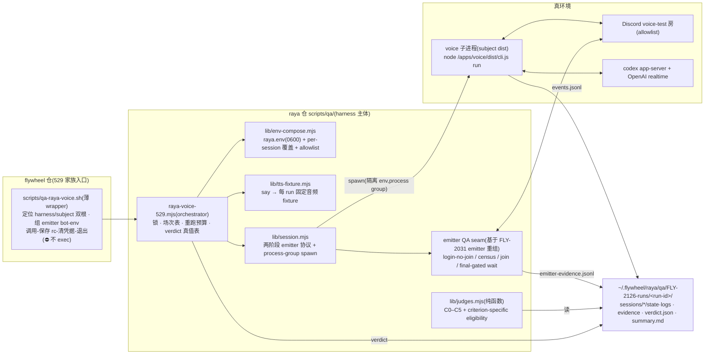

# FLY-2126 Raya 语音链路 529 房标准场景 — 实施计划

Issue: FLY-2126 (https://linear.app/geoforge3d/issue/FLY-2126/rayae2e-把-raya-语音链路做成-529-房标准场景真-voice-进程tts-注入判据脚本化)
日期: 2026-08-28
基于: exploration.md、research.md

> 世界标记:[raya-2097] = raya `4a67508`;[raya-2031] = raya `raya-FLY-2031` worktree;[fw] = flywheel main `5ec16b227`。
> 本计划描述的是 **QA 基础设施**(测量工具),不改任何 raya 产品代码 —— 「别为了让尺子量得到而改被量的产物」。
> v2(Codex design review R1 后):criterion-specific eligibility、两阶段 emitter 协议、生产身份占用防护、harness/subject 双根、fail-closed 生命周期、删三处无消费者的通用化。
> v3(R2 后):S4.5 realtime Live receipt(`voice-session.json`)、标准路径改用专用 QA 语音身份(生产身份降级为危险 opt-in)、锁 owner 语义 + orphan group 回收、launchctl 措辞收敛为「零 mutation」。
> v4(R3 后):双 bot 身份链贯通 wrapper(`--voice-bot <n>` 第二组凭据 + 不同 slot/id 强制)、preflight botId 交叉核对、voice QA 身份 S-pre 全 guild 空闲检查、B13 改 owner 语义与 B29 合一。

---

## 0. 目标、非目标、授权边界

### 0.1 目标

529 房新增标准场景 **`raya-voice`**:一条命令 → 隔离拉起真 voice 进程 + 真 Discord 语音房 + TTS 逐场注入 + 判据脚本化 → 证据包 + `verdict.json`。判据五项(issue 点名,全部继承 FLY-2097 已真机验证的人工判据)+ 一项结构性前置:

| # | 判据 | 门 |
|---|---|---|
| C0 | 指令腿阳性对照(前置) | 英文-only 指令下 assistant final 零 CJK;**失败 ⇒ 整 run INSTRUMENT_FAIL,语义判据一个不跑** |
| C1 | spoken-exit 逐字 | 5/5:逐字哨兵 + `spoken_exit_detected` + `voice_exit{0,"spoken-exit"}` + detect→exit ∈ [graceMs, drainTimeoutMs] + 零 grace_capped/cancelled + marker 清除 |
| C2 | 误退 0 | 反例 3 + 含糊 3:零误退;含糊场确认问句只记录(advisory) |
| C3 | 静默窗 | 默认 40s:零 transcript、零检测、无自发退出(窗后 teardown 的 `last-human-left` 是预期事件) |
| C4 | 委托后台 | canary nonce(只在 workspace 文件里)出现在归一化 assistant final 中 |
| C5 | 身份自称 | assistant final 含「Raya」;「我是 Codex」类自称记 advisory 不作门 |

### 0.2 非目标

- brain→launchctl 固定 label 链路(slash / 文字口令 / marker kickstart / 逃生梯)—— FLY-2097 attempt 1 已真机全过;需要生产 label 改绑,是另一个场景。
- founder 听感 / 真人声轮次(FLY-2031 §5.6.1b 成色纪律)—— 本场景是 TTS 回归自动化,**不顶替真人声验收**,verdict 里永久带此标注。
- ship-approval(P3 / Bridge)· 多说话人 · 打断 · 存活信号等 FLY-2030/2031 行为(那些单各自的 QA 自己扩展场次表)。
- 不改 raya 产品代码;不新增产品侧可测性钩子。
- v1 不做(R1-6,无第二消费者不通用化):`--config` 外置场次表 · OpenAI TTS 分支 · 跨 run 共享 TTS 缓存。

### 0.3 授权与风险边界(⛔ 不声称「结构性零生产风险」—— R1-3)

| 项 | 本场景 | 依据 |
|---|---|---|
| 生产 launchd | **零 mutation**:不读写 `~/Library/LaunchAgents/`,不做任何 launchctl 变更;仅验收期允许 read-only `launchctl print` 取证 | Q6;R2-4 |
| 生产 raya.env | 只读(0600 校验后读凭据),永不写 | P1b 配方 |
| **voice 进程的 Discord 身份(R2-2)** | **标准路径 = 专用 QA 语音身份**:`RAYA_BOT_TOKEN` 覆盖为独立 QA bot token(`--voice-bot-env`/`--voice-bot-id`;来源:既有 `TEST_BOT_TOKEN_N` 池中与 emitter 不同的一只,或专建 Raya QA bot —— 运营者一次性确认 guild 成员资格 + QA 房 Connect/Speak 权限)。⇒ 生产 Raya 身份**结构性不被触碰**:生产 brain 在 run 中途 kickstart 生产 voice 也互不干扰(两个身份两个 voice state)。**生产身份模式降级为危险 opt-in** `--allow-production-identity`:非标准、要求人工在场窗口,保留 S-pre 空闲证明 + 全程守卫;无人值守/标准场景一律拒绝 | R2-2 |
| 房间 | **allowlist 而非 denylist**:目标房必须 ∈ 固定 QA 房清单(voice-test-2 `1542708795720081408`、voice-test-3 `1542709028742893699`;默认 voice-test-3);非 allowlist 一律拒起 | R1-3 |
| Lead 审批 | 不需要每次审批;仅一次性部署确认(QA 语音身份的房间权限,§7);共享资源见 §7 | Q1/Q6 |

---

## 1. 架构总览



一场判据会话 = 一次 voice 进程生命周期(research §1.5)。judge 与采集解耦(「检测器 ≠ 被检者」),不给产品加钩子。

## 2. 模块与接口

### 2.0 双根模型(R1-4:harness ≠ subject)

- **harness root** = 长期存在的 raya checkout(wrapper 默认 `~/.flywheel/raya/code`,`--harness-root` 可覆盖;不依赖 issue worktree 生命周期)。
- **subject root** = 被测 build(`--subject-root`,必填,不默认 main)。voice 子进程、`cli.js preflight`、以及**判据常量**都取自 subject:judge 运行期动态 import `<subject>/apps/voice/dist/session/ExitProtocol.js` 读哨兵 `EXIT_SENTENCE` —— 历史 head(如 `46b5b6b`)没有 harness 代码也能被测,且哨兵永远是 subject 自己的合同(⛔ 不用 harness 侧的常量顶替)。
- verdict 记录:`harnessHead/harnessDirty`、`subjectHead/subjectDirty`(`git rev-parse` + `git status --porcelain`)、subject dist 内容哈希(`apps/voice/dist/**` 排序后 sha256)、contract version、场次表版本。校准流程(§6)在 clean exact-head worktree 里**先 build 再跑**。

### 2.1 [raya 仓] `scripts/qa/raya-voice-529.mjs`(orchestrator,新)

```
node scripts/qa/raya-voice-529.mjs
  --subject-root <abs path>       # 被测 worktree(必填;核 apps/voice/dist/cli.js 存在)
  --emitter-bot-env <abs path>    # emitter 的 DISCORD_BOT_TOKEN 文件(0600;emitter 既有校验)
  --emitter-bot-id <snowflake>
  --voice-bot-env <abs path>      # voice 进程 QA 身份的 token 文件(0600;标准路径必填,R2-2)
  --voice-bot-id <snowflake>      # 该 QA 身份的 user id(readiness census 观察它)
  [--allow-production-identity]   # 危险 opt-in:voice 用生产 RAYA_BOT_TOKEN;要求人工在场窗口;
                                  #   与 --voice-bot-env 互斥;保留 S-pre 空闲证明 + 全程守卫
  [--channel-id <snowflake>]      # 必须 ∈ QA 房 allowlist;默认 voice-test-3
  [--criteria all|c0,c1,...]      # 默认 all;c0 永远隐式包含且先跑
  [--run-id <slug>]               # ^[a-z0-9][a-z0-9-]{2,63}$;默认 <UTC 时间戳>-<subject short sha>
  [--retry-budget <n>]            # 每场 INSTRUMENT_FAIL 重跑预算,默认 1
  [--session-timeout-ms <n>]      # 单场墙钟上限,默认 180000
  --contract-version              # 打印机读合同版本号后退出(wrapper 握手用,精确比较,不解析 --help)
```

职责与不变式:
- **锁(owner 语义,R2-3)**:`~/.flywheel/raya/qa/.raya-voice-529.lock` mkdir 原子锁;receipt 记 **owner = orchestrator** 的 `{pid, pidStartTime}`(身份对 = pid+启动时刻,防 pid 复用)、run-id,voice 子进程起来后追加 `{voicePid, voicePgid, subjectCliPath}`。陈旧判定:**owner 死即 stale**(⛔ 不等被管进程自灭 —— detached voice group 在 orchestrator 被 SIGKILL 后可能仍活着占房)。回收流程:核 owner 身份对确认已死 → 对 receipt 里的 voice pgid 做**归属验证**(存活进程的命令行须含 receipt 记录的 subject cli 路径;验证不了/receipt 残缺 ⇒ **fail loud 保留锁,绝不猜杀**)→ TERM→有界等待→KILL 整组 → 确认组消失 → 删锁。拿不到锁 ⇒ 退出码 75,零资源接触。
- **run 目录**:`~/.flywheel/raya/qa/FLY-2126-runs/<run-id>/` —— run-id 过 slug 校验 + canonical containment;目录 **exclusive create**(已存在 ⇒ 78 拒起,⛔ 不复用旧目录,旧 evidence 不许混进新 judge)。TTS fixture 每 run 生成在 run 目录内(R1-6:无共享缓存)。
- **前置(拿资源前全部完成,任一不过 ⇒ 78)**:subject dist 存在;`RAYA_VOICE_REQUIRED_ENV_KEYS` **加 `RAYA_ENV_FILE`** 组合完备;channel ∈ allowlist;emitter bot-env 0600;跑 subject `cli.js preflight`(组合 env)并解析其机读 receipt(config 级 fail-closed 前置,R1-2/R1-5),**所有 run 一律要求 `receipt.ready === true && receipt.discord.botId === --voice-bot-id` 精确相等,且 `receipt.discord.voiceChannelId` = 选定的 allowlist 房**(R3-1/R4-1;receipt 嵌套形状为 `{ready, discord:{botId, voiceChannelId}, codex}`,已核 [raya-2097] `preflight.ts:97–102` + `cli.ts:187–194` —— token 传错/复制错在这里被抓,不许降级成 S3 超时);`voiceBotId !== emitterBotId` fail-closed;emitter 登录态房间 census(§2.3 S-pre)。
- **顺序**:C0 先;C0 非 PASS ⇒ 立即封盘,语义场次全部 `skipped`。
- **重跑纪律**:仅 INSTRUMENT_FAIL 可重跑,预算显式;eligible 的 FAIL 永不重跑;所有 attempt 全量进 verdict。
- **overall 真值表(R1-1)**:
  1. C0 非 PASS ⇒ `INSTRUMENT_FAIL(instruction_leg_dead)`;
  2. 否则存在 eligible FAIL ⇒ `FAIL`(同时 `complete:false` 标注是否有场次因 INSTRUMENT_FAIL 耗尽而缺数据);
  3. 否则存在耗尽预算的 INSTRUMENT_FAIL ⇒ `INSTRUMENT_FAIL`;
  4. 否则全部选中判据 PASS ⇒ `PASS`。
- **退出码**:0 = PASS;1 = FAIL;20 = INSTRUMENT_FAIL;64 = 参数错;75 = 锁冲突;78 = 前置校验失败。

### 2.2 [raya 仓] `scripts/qa/lib/env-compose.mjs`(纯函数 + 少量 IO,新)

- 读 `~/.flywheel/raya/raya.env`:强制 `(mode & 0o077) === 0`(P1b 配方,复用 c0-lib 解析);
- per-session 覆盖:`RAYA_STATE_DIR/METRICS_DIR/LOG_DIR` → 场次目录;`RAYA_DISCORD_VOICE_CHANNEL_ID` = `RAYA_DISCORD_TEXT_CHANNEL_ID` = allowlist 内目标房;`RAYA_CODEX_CWD` → subject root;`RAYA_WORKSPACE_ROOTS_JSON` → `[subjectRoot, 场次 workspace]`;`RAYA_VOICE_QA_ALLOW_USER_IDS_JSON` → `[emitterBotId]`;`RAYA_VOICE_OPTIONS_JSON` → 场次注入(C0 场加 `startInstructionsFile` 指向英文-only 对照文件);`RAYA_ENV_FILE` 显式设置;**`RAYA_BOT_TOKEN` → QA 语音身份 token**(标准路径,R2-2;`--allow-production-identity` 时才沿用生产值);其余(含 `RAYA_OPENAI_API_KEY`、`RAYA_CODEX_HOME`、founder id)沿用生产值。
- **fail-closed**:channel ∉ allowlist ⇒ throw;subject dist 缺失 ⇒ throw(提示先 build);组合 env 缺任一必需 key(含 `RAYA_ENV_FILE`)⇒ throw。
- token 纪律:任何日志/verdict/summary 不出现 token 字符;verdict 只记 `tokenConfigured:true`。

### 2.3 [raya 仓] `scripts/qa/lib/session.mjs` + emitter QA seam(R1-2:两阶段协议)

emitter seam(把 [raya-2031] `c9-voice-emitter.mjs` 的进程内原语重组为可分阶段调用的 QA 库;⛔ 不改产品代码,只动 QA 侧):
- 阶段 A `login()`:Discord client ready,**不 join**;
- `census(channelId)`:目标房当前成员集合 + 指定 bot id 的**全 guild voice state**(在哪个房/不在房;标准路径查本场 voice QA 身份,opt-in 模式还查生产 Raya bot);
- 阶段 B `join(channelId)` / `playFixture(path)` / `waitAssistantSettled()` / `leave()`。

单场协议(输入:场次规格 {criterion, fixtureAudio|silenceMs, responseTimeoutMs, envOverrides}):

| 步 | 动作 | 失败路径 |
|---|---|---|
| S-pre | emitter `login` → `census`:目标房成员必须为空集;**本场 voice 身份不在本 guild 任何语音房**(标准路径也查 —— 池子里的 TEST bot 可能正被别的 QA harness 占用,R3-1);`--allow-production-identity` 模式下额外要求生产 Raya bot 全 guild 空闲(R1-3) | 任一不满足 ⇒ 本场不 spawn;run 级 78 拒起(首场)或 INSTRUMENT_FAIL(中途出现) |
| S1 | 建场次目录(exclusive);写 marker;C4 场写 canary 到场次 workspace | IO 错 ⇒ INSTRUMENT_FAIL |
| S2 | `spawn(node, [<subject>/apps/voice/dist/cli.js, "run"], {env, detached:true})` 成独立 **process group**;stdout/stderr → logs/ | spawn 错 ⇒ INSTRUMENT_FAIL |
| S3 | **readiness ≠ exit code**(R1-5:`run` 对 refusal 按 launchd 语义返 0):判 Discord 就绪 = census 观察到**本场 voice 身份的精确 bot id** 进入目标房(≤60s);同时解析 child stdout 的机读 status 行,出现 `voice_mode_not_requested`/`ready:false` ⇒ 立即 INSTRUMENT_FAIL(refusal,不是超时) | 超时/refusal ⇒ INSTRUMENT_FAIL |
| S4 | emitter `join`,**保持 self-muted**(在 Raya 之后进房 —— `snapshotHumans()` 滤所有 bot、allowlist 只在 **join edge** 生效,先进房的 emitter 对 Raya 不可见,已核 [raya-2097] `VoiceRoom.ts:160–181`、`runtime.ts:500`) | join 错 ⇒ INSTRUMENT_FAIL |
| **S4.5** | **realtime Live receipt(R2-1)**:有界等待本场独占 state 目录出现 `voice-session.json` 且其 `threadId/processGeneration/lastLiveAt` 证明**本次 boot** 已 Live(`PersistThread` 在 `RealtimeStarted` 后原子写入,已核 [raya-2097] `config.ts:404`、`runtime.ts:401–405`、`Coordinator.ts:309`)—— Discord 入房 ≠ realtime 就绪,emitter join 才触发 StartCodex→openThread→startRealtime,此前播音会打在未建成的 uplink 上;**C3 的观测窗起点 receipt 也从这里起算**(⛔ 不许把 realtime 启动时间算进静默窗,也不许在 realtime 未 Live 时凭 child 存活判 C3 绿) | 超时 ⇒ INSTRUMENT_FAIL |
| S5 | unmute 后播 fixture(或静默驻留 silenceMs);**响应完成门 = subject evidence 里出现本代(generation 匹配)的 assistant final**,再等下行音频 settle(`waitForRayaAudio` 首包即返,只作「有声」证据不作完成门,已核 emitter lib `wait()`);C1 场不设完成门,等产品自行退出 | responseTimeout 到而无 final ⇒ 按 eligibility 判 |
| S6 | emitter `leave` → 等 voice 子进程退出(≤ session-timeout;超时 ⇒ SIGTERM → 有界等待 → SIGKILL **整个 pgid**,覆盖 Codex 后代进程) | 强杀 ⇒ INSTRUMENT_FAIL |
| S7 | 收集 evidence(**严格 JSONL 解析**:残行/截断/未知关键事件 ⇒ INSTRUMENT_FAIL,R1-5)→ judge | — |
| 守卫 | 全程 census 监听:目标房出现非 {本场 voice 身份, emitter} 成员,或本场 voice 身份的 voice state 移出目标房 ⇒ 立即 INSTRUMENT_FAIL 并终止本场(R1-3) | — |

- **teardown 不变式**:SIGINT/SIGTERM handler + finally(⛔ 不依赖 `process.on("exit")` 做异步清理,R1-5):子进程组必死(SIGTERM → 有界等待 → SIGKILL pgid)、emitter 必 destroy、锁按 receipt 释放;场次目录保留(即证据)。

### 2.4 [raya 仓] `scripts/qa/lib/judges.mjs`(纯函数,新)

```ts
// criterion-specific eligibility(R1-1)
eligInteractive(events, emitterEvidence)  // C0/C1/C2/C4/C5:user final≥1 + assistant final≥1 + 下行包>0(FLY-2097 三腿)
eligSilence(sessionReceipts)              // C3:S4.5 Live receipt(voice-session.json 证本 boot 已 Live)+ emitter 全窗连接 receipt
                                          //     + voice child 全窗存活 + 窗起止 receipt 齐;观测窗自 S4.5 起算(R2-1)
judgeControl(events)                      // C0: 游标后 assistant final 零 CJK
judgeSpokenExit(events, {graceMs, drainTimeoutMs, markerAbsent, exitSentence}) // C1 单场;exitSentence 来自 subject dist 动态 import
judgeNoExit(events)                       // C2 单场(+确认问句 advisory 抽取)
judgeSilence(events, {windowMs})          // C3:窗内零 transcript/检测/自发退出;窗后 last-human-left 为预期
judgeDelegate(events, {nonce})            // C4: NFKC + 去空白/标点/全半角归一化后 containment
judgeIdentity(events)                     // C5(+「我是 Codex」advisory)
```
- 输入只有磁盘 evidence + 场次 receipt,零进程内探针;**禁引 Codex wire 日志计数**(FLY-2097 §B 更正,写进模块头注释与测试)。
- 逐字匹配 NFKC;哨兵串运行期取自 **subject** 的编译产物(§2.0),⛔ 不复制字面量、不 import harness 自己的副本。

### 2.5 [raya 仓] 场次表(固定、版本化,R1-6)

`scripts/qa/raya-voice-529.sentences.mjs`:S1 五句 / S2 三句 / S3 三句逐字继承 FLY-2097 attempt 2;C4 提问模板 + nonce 生成(4 位数字 + 双字 CJK 词);C5 问句;C0 英文对照指令与提问。带 `SENTENCE_SET_VERSION` 常量进 verdict。⛔ v1 无外置 `--config`(出现第二个真实消费者再提取)。

### 2.6 [fw 仓] `scripts/qa-raya-voice.sh`(薄 wrapper,新)

- 职责:①解析 `--subject-root`(必填)与直通参数,解析 harness root(默认约定 + `--harness-root`);②**双 bot 凭据(R3-1)**:`--emitter-bot <n>`(默认 1)与 `--voice-bot <m>`(默认 2)各自从 `~/.flywheel/test-slots.json` 的 `tokenEnvVar` + bot id 解析,再只从 `~/.flywheel/.env` 读取选中的两个值并落成**两份** 0600 临时文件;整份 env 不导给 harness,wrapper-owned identity flags 不接受透传覆盖;`n === m` 或解析出的两个 bot id 相同 ⇒ **在任何 Discord 登录/spawn 之前** 64 拒绝(同一 bot 两个角色会共享一个 voice state);③握手:`node <harness>/scripts/qa/raya-voice-529.mjs --contract-version` 输出与 wrapper 内置版本**精确比较**,不识 ⇒ 78;④**调用 harness、保存退出码、同步删除两份临时凭据文件(成功/失败/信号路径都删)、再以保存的码退出 —— ⛔ 不 `exec`**(exec 替换 shell 后 EXIT trap 不会跑,0600 token 文件会残留;R1-5 已用最小 bash 复现证实)。
- 不复制任何判据/编排逻辑。
- 529 家族登记:`engineering/doc/FLY-2126-raya-voice-529-scenario/scenario.md` 一页(用途/一条命令/退出码/资源占用/房间约定)。

## 3. 行为规格(逐条可测)

| # | 场景 | 规格 | 测 |
|---|---|---|---|
| B1 | C0 PASS 路径 | 英文 final ⇒ control PASS,语义场次继续 | judges 单测(fixture) |
| B2 | C0 FAIL | 中文 final ⇒ overall=INSTRUMENT_FAIL(instruction_leg_dead),语义场次 skipped,退出码 20 | orchestrator 单测(假 session 层) |
| B3 | C1 全过形状 | 哨兵逐字 + detected + exit{0,spoken-exit} + 延迟窗内 + 零 capped/cancelled + marker 清除 ⇒ 场 PASS | judges 单测(FLY-2097 S1 真形状 fixture) |
| B4 | C1 缺哨兵/缺事件 | 任一缺 ⇒ 场 FAIL(不重跑) | judges 单测 |
| B5 | C1 延迟出窗 | detect→exit < graceMs 或 > drainTimeoutMs ⇒ FAIL | judges 单测 |
| B6 | C2 误退 | 出现 `spoken_exit_detected` ⇒ FAIL | judges 单测 |
| B7 | C2 含糊场确认问句 | 只落 advisory,不影响门 | judges 单测 |
| B8 | C3 静默窗破 | 窗内任何 transcript/检测/自发退出 ⇒ FAIL;窗后 last-human-left 不算破 | judges 单测 |
| B9 | C4 nonce | 归一化含 nonce(全半角/空白变体命中)⇒ PASS;不含 ⇒ FAIL | judges 单测 |
| B10 | C5 | final 含 Raya ⇒ PASS;「我是 Codex」⇒ advisory 置位 | judges 单测 |
| B11 | 交互场 eligibility 缺腿 | 任一腿缺 ⇒ INSTRUMENT_FAIL;预算内重跑一次;两个 attempt 均进 verdict | orchestrator 单测 |
| B12 | eligible FAIL 不重跑 | eligible + FAIL ⇒ 直接记,预算不消耗 | orchestrator 单测 |
| B13 | 锁冲突(owner 语义,与 B29 同一合同) | owner 活 ⇒ 第二实例 75 零资源接触;owner 死 ⇒ 进入 §2.1 receipt-scoped recovery(orphan/残缺/身份不符的细分全在 B29,⛔ 不存在「等全部 pid 死」的旧条件) | 集成(tmp HOME) |
| B14 | 房 allowlist | channel ∉ allowlist ⇒ 78 拒起(含生产房与任意其他房) | env-compose 单测 |
| B15 | subject dist 缺失 | ⇒ 78 + build 提示 | env-compose 单测 |
| B16 | env 权限 | raya.env 或 bot-env group/other 可读 ⇒ 拒起;组合 env 缺 `RAYA_ENV_FILE` ⇒ 拒起 | env-compose 单测 |
| B17 | 子进程卡死/强杀 | timeout ⇒ TERM→等待→KILL pgid(Codex 后代同死);判 INSTRUMENT_FAIL;锁与连接仍释放 | 集成(假 voice 脚本带子进程) |
| B18 | overall 真值表 | §2.1 四则逐条 + 混合结果(FAIL 与耗尽 INSTRUMENT_FAIL 并存 ⇒ FAIL+complete:false;重跑后 PASS 场次的聚合) | orchestrator 单测 |
| B19 | token 纪律 | 全部产物 grep 不到 token 字符;wrapper 成功/失败/信号路径后**两份**临时 bot-env 均不残留 | 集成断言 + [fw] bash 测试 |
| B20 | refusal-exit-0 | 假 voice 输出 `voice_mode_not_requested` 后 exit 0 ⇒ 判 INSTRUMENT_FAIL(refusal),⛔ 不判 ready、不判 PASS | 集成(假 voice 脚本) |
| B21 | wrapper 握手/双 bot | contract-version 不匹配 ⇒ 78;TEST_BOT_TOKEN 缺 ⇒ 非零且不打印 token;`--emitter-bot` 与 `--voice-bot` 同 slot 或同 bot id ⇒ 64(登录前) | [fw] bash harness 测试 |
| B22 | run 目录独占 | run-id 非法 slug ⇒ 64;目录已存在 ⇒ 78;旧 evidence 不可能进新 judge | orchestrator 单测 |
| B23 | 坏 JSONL | 残行/截断 ⇒ 该场 INSTRUMENT_FAIL(⛔ 不静默跳行) | judges 单测 |
| B24 | 房间守卫 | 第三成员进房 / 本场 voice 身份移出目标房 ⇒ 本场立即 INSTRUMENT_FAIL 终止 | 集成(假 census 流) |
| B25 | voice 身份模式 | 标准路径缺 `--voice-bot-env` ⇒ 64;`--allow-production-identity` 与 `--voice-bot-env` 互斥;preflight 门用**与真实 CLI 同形的嵌套 receipt fixture** —— `receipt.discord.botId` match/mismatch/missing-discord 三格(mismatch/missing ⇒ 78,⛔ 不降级成 S3 超时,⛔ 不用扁平 mock 造假绿);S-pre 本场 voice 身份在其他语音房(被别的 harness 占用)⇒ 拒 spawn;opt-in 模式生产 Raya bot 不空闲 ⇒ 拒 spawn(首场 78 / 中途 INSTRUMENT_FAIL) | 单测 + 集成(假 census) |
| B26 | 双根 | 哨兵取自 subject dist(改 subject 哨兵 ⇒ judge 跟随);verdict 含 harness/subject 双 head + dirty + dist hash | 单测 + 集成 |
| B27 | 信号 teardown | SIGINT/SIGTERM 到达 orchestrator ⇒ 子进程组死、emitter destroy、锁释放、已收 evidence 保留 | 集成 |
| B28 | warm-up race(R2-1) | Discord 已入房但 StartCodex 被人为延迟/永不完成 ⇒ S4.5 超时判 INSTRUMENT_FAIL;⛔ 不播音、C3 不起算、不 vacuous PASS | 集成(假 voice 脚本延迟写 voice-session.json) |
| B29 | orphan group 回收(R2-3) | SIGKILL orchestrator、假 voice + 孙进程仍活 ⇒ 下一实例判 stale(owner 死)、按 receipt 归属验证后 TERM→KILL 整组、组消失才删锁;receipt 残缺 / pid 身份对不上 ⇒ fail loud 保留锁不猜杀(三格分测) | 集成(tmp HOME) |

## 4. 决策与取舍(带反面)

| # | 决策 | 取 | 主要反面(如实) |
|---|---|---|---|
| Q1 | 隔离形态:独立于生产 launchd(不改绑) | 零审批、零 launchd mutation(R3-3) | 覆盖不了 brain→kickstart 链路(已划非目标) |
| Q2 | harness 主体在 raya 仓 + fw 薄入口;**harness/subject 双根**(R1-4) | 判据常量取自 subject dist(历史 head 可测,哨兵不漂移);语音重依赖不进 fw | 双仓 PR;双根概念多一个 CLI 参数;wrapper↔harness 用机读 contract-version 精确握手兜漂移 |
| Q3 | judge = 离线读 evidence 纯函数 + criterion-specific eligibility(R1-1) | 可单测、可复判、不碰产品;C3 不再被三腿门判死 | C3 的 eligibility 依赖场次 receipt(harness 自记),receipt 生成本身要测(B27/B24) |
| Q4 | 三态 verdict + 显式重跑预算 + overall 真值表 | harness 坏 ≠ 产品 FAIL;重跑不洗绿;混合结果有确定读法 | INSTRUMENT_FAIL 场次消耗真额度;预算默认 1 保守 |
| Q5 | 自验收 = 正/阴对照 build(clean exact-head worktree 先 build 再跑) | `4a67508` 应全绿(对齐人工 QA);`46b5b6b` 应 C0 红(尺子区分腿死 vs 行为错) | 阴对照消耗一场会话额度(仅 C0,可接受) |
| **Q6** | **进程形态:直接 spawn 子进程(process group),不走 launchd QA label** | 每场干净生命周期;`ThrottleInterval=60` 假失败(FLY-2097 O1)整类消失;KeepAlive 自动重启不污染场次账;pgid 强杀覆盖 Codex 后代 | **偏离 issue 字面「隔离 plist/env」**:plist 的 env 配方全额保留(§2.2),丢掉的只有 launchd 壳。判据全在 realtime 语义层,进程监督者不在测量路径上;launchd 生命周期若未来要测,是 brain 链路场景的事。此偏离在 founder HTML 关键取舍里明示 |
| Q7 | 房 allowlist(voice-test-2/3)+ 默认 voice-test-3 | 非 QA 房结构性到不了;与 FLY-2031 验收房错开 | 新增 QA 房要改 allowlist 常量(一行,可接受;比 denylist 漏网强,R1-3) |
| Q8 | TTS 只用 `say`,每 run 固定 fixture(R1-6) | 零成本零网络零共享状态;attempt 2 已证 say 可达 5/5 | 人声接近度低于 OpenAI TTS;真人声始终不在本场景(非目标);要 OpenAI 分支等第二个真实消费者 |
| Q9 | `RAYA_CODEX_HOME` 沿用生产值 | Codex auth 在那里;两轮 QA 先例一致 | QA 会话写生产 codex-home 的日志/线程账(共享资源,§7 明示);隔离它需要重 auth,收益不抵 |
| Q10 | **标准路径 = 专用 QA 语音身份**;生产身份 = 危险 opt-in(R2-2) | 生产身份结构性不被触碰:S-pre 快照挡不住 run 中途生产 brain kickstart 生产 voice(两条进程链不共享锁),守卫只能事后报警 —— 事后守卫不配承担互斥语义,标准/无人值守场景必须结构性隔离 | 一次性部署确认(QA bot 的 guild 成员资格 + QA 房语音权限;可直接用既有 TEST_BOT_TOKEN 池的另一只,零新建);opt-in 路径保留给「必须以生产身份复现」的罕见场合,要求人工在场 |

## 5. 实施顺序(TDD;RED→GREEN→REFACTOR;⛔ 不承诺工期)

| # | 块 | 仓 | 测试落点 |
|---|---|---|---|
| **G0** | **emitter 依赖硬门**(R1-4):FLY-2031 合入 raya main,或 emitter lib 先行摘出落 main —— 二选一由 Lead 定,**未落地不开工 C-c** | — | — |
| C-a | judges + eligibility + 场次表 + fixture(FLY-2097 evidence 真形状) | raya | B1/B3–B10/B23 |
| C-b | env-compose(allowlist/双根/权限)+ tts-fixture | raya | B14–B16/B26 |
| C-c | emitter QA seam(两阶段)+ session 协议(假 voice 脚本集成) | raya | B17/B20/B24/B25/B27 |
| C-d | orchestrator(锁 receipt/重跑/真值表/退出码/exclusive run 目录) | raya | B2/B11–B13/B18/B22 |
| C-e | fw wrapper(无 exec + 握手)+ bash harness 测试 + scenario.md 登记 | fw | B19/B21 |
| C-f | 真机自验收:正对照 run(`4a67508` 全 criteria)+ 阴对照 run(`46b5b6b` 仅 C0),均在 clean exact-head worktree 先 build | 真环境 | §6 |

全仓门:raya 侧 `pnpm lint/typecheck/build/test`;fw 侧 `pnpm lint` + `pnpm -r build` + `pnpm test:packages:run` + 新增 `scripts/__tests__/*.test.sh`(FLY-224/248 教训)。

## 6. 场景自身验收(尺子先证能区分)

| 格 | 做法 | 算过的样子 |
|---|---|---|
| 判据对齐人工 QA | clean worktree checkout `4a67508` → build → full run | overall=PASS,逐判据结论与 qa-report.md attempt 2 §C/§D 一致;不一致处逐条解释或修判据 |
| 尺子区分腿死 | clean worktree checkout `46b5b6b` → build → `--criteria c0` | overall=INSTRUMENT_FAIL(instruction_leg_dead),**不是** C1 FAIL |
| 单测层 | B 表全绿 | judges/env-compose/session/orchestrator 全覆盖 |
| 产物纪律 | 两次真机 run 产物 grep token 零命中;临时 bot-env 不残留;evidence 不入仓 | B19 + 人工复核 |
| 生产不受扰 | run 前后:生产 launchd 状态不变(read-only `launchctl print`,本场景唯一允许的 launchctl 用法,R2-4)、生产 state 目录无新文件;标准路径下生产 Raya 身份全程未被登录(结构性,census 日志佐证) | teardown 清单进 verdict |

## 7. 资源与依赖(开放项交 Lead)

| 项 | 说明 |
|---|---|
| **G0 emitter 排序(open,硬门)** | emitter 仅在 raya `FLY-2031` 分支。(a) 本单排在 2031 合入后;(b) emitter lib 先行摘出落 main。**由 Lead 定序**;两选项不改本计划接口 |
| 被测 build 前提 | C1/C2 要求 subject ≥ FLY-2097(spoken-exit 协议);C0/C3–C5 要求 ≥ FLY-2097 返工(prompt 通道)。更老 build C0 如实红(回归尺的正确行为) |
| 共享资源(不需审批,但要知会) | voice-test 房占用(run 约 30–45 分钟)、两只 QA bot token(emitter + voice 身份,`TEST_BOT_TOKEN_N` 池)、OpenAI realtime 额度(full run ≈ 15 场)、生产 codex-home 日志写入 |
| **一次性部署确认(运营者/Lead,R2-2)** | 选定的 voice QA 身份 bot:guild 成员资格 + voice-test 房 Connect/Speak 权限。缺权限的失败形状 = S3 readiness 超时 INSTRUMENT_FAIL(不是误判产品) |
| 并发约定 | 本机单实例(锁);跨 harness 撞房由 S-pre census 空房前置挡住(撞了 = 拒起,不是误判) |

## 8. 风险

| 风险 | 缓解 |
|---|---|
| TTS→STT 非确定性造成语义场 flaky | criterion-specific eligibility + INSTRUMENT_FAIL 重跑预算;eligible FAIL 不重跑;flaky 率如实进 verdict(retries 字段) |
| 模型行为漂移 | 场景是回归尺不是证明器:FAIL 触发人工复判(证据包在手);场次表版本化,verdict 记全配置 |
| 生产 Raya 身份被 QA 干扰 | 标准路径专用 QA 身份,结构性排除(Q10);仅 `--allow-production-identity` opt-in 存在此风险,由空闲证明 + 守卫 + 人工在场围住 |
| emitter/evidence 形状随 raya 演进 | harness 与产品同仓同 PR 演进;判据常量动态取自 subject;fw wrapper 机读握手拒旧合同 |
| 额度耗尽 / Codex 账号态 | C0 先跑 = 每 run 自带烟测;额度类失败表现为 eligibility 缺腿 ⇒ INSTRUMENT_FAIL,不污染语义结论 |
| verdict 被误读为「替代真人验收」 | verdict/summary 首屏固定一行:本场景为 TTS 回归自动化,不含真人声与 founder 听感 |
| harness 自身缺陷产出假结论 | §6 正/阴对照校准;判据单测吃真形状 fixture;receipt 生成路径自身有测试(B24/B27) |

## 9. 明确不做(本单)

§0.2 全部 + :launchd QA label 模式(Q6 已弃,理由留档)· 多轮对话场次(单发注入够用)· LLM judge · wire 日志类判据(FLY-2097 §B 证伪)· 自动排期/cron 化 · Bridge/Lead slot 复用 · `--config` 外置场次表 · OpenAI TTS · 跨 run 共享 TTS 缓存(以上三项:R1-6,等第二个真实消费者)。

## 10. 会过期的结论

| 结论 | as-of | 重核 |
|---|---|---|
| research §7 全表随本单引用继续有效 | 2026-08-28 | 同表 |
| evidence 事件形状 / `snapshotHumans` 滤 bot / allowlist 只在 join edge 生效 / `run` refusal 返 0 / `voice-session.json` 在 RealtimeStarted 后由 PersistThread 原子写入(S4.5 承重腿) | raya `4a67508`(`VoiceRoom.ts:160–181`、`runtime.ts:500`、`cli.ts:150–168`、`config.ts:404` + `runtime.ts:401–405` + `Coordinator.ts:309`) | 实施时逐条复核 |
| 哨兵串常量路径 `apps/voice/dist/session/ExitProtocol.js` | 同上 | subject build 后 `node -e "import(...)"` 探测;缺失 ⇒ 78 |
| 阴对照 build `46b5b6b` 可用 | 分支未删 | `git cat-file -t 46b5b6b` |
| voice-test-2/3 房 id(allowlist) | Lead 2026-08-27/28 | 房间变动以 Lead 指令为准 |
| `TEST_BOT_TOKEN_N` 池位置 | fw `5ec16b227` | `scripts/test-deploy.sh` 头部 |

## 11. Codex design review 处理记录

| 轮 | 结论 | 处置 |
|---|---|---|
| R1(2026-08-28) | CHANGES REQUESTED,6 条(5 BLOCKER / 1 MEDIUM) | **6 条全接受**:①C3 与统一三腿 eligibility 自相矛盾 ⇒ criterion-specific eligibility + overall 真值表(§2.1/§2.4,B8/B18);②session 协议按实际 emitter API 重写为两阶段(login-no-join → census → spawn → 观察精确 bot 进房 → join;响应完成门 = 本代 assistant final,首包不作完成门;Raya bot id 来自 subject preflight receipt)—— 其中 `snapshotHumans` 滤 bot、allowlist 只在 join edge、`wait()` 首包即返三条事实已逐一核实(§2.3);③「结构性零生产风险」改为如实的风险面 + 防护:房 allowlist、S-pre 生产身份空闲证明、全程房间守卫、专用 QA bot 可选升级(§0.3/Q10,B24/B25);④harness/subject 双根,判据常量动态取自 subject dist,verdict 记双 head/dirty/dist hash,emitter 依赖升级为 G0 硬门(§2.0/§5);⑤fail-closed 生命周期:`RAYA_ENV_FILE` 校验、refusal-exit-0 识别、run 目录 exclusive、严格 JSONL、pgid teardown、锁 receipt、wrapper 弃 exec(§2.1/§2.3/§2.6,B13/B17/B19/B20/B22/B23/B27);⑥删三处无消费者的通用化(`--config`/OpenAI TTS/共享缓存),contract-version 改为机读精确比较(§0.2/§2.5/§2.6/Q8) |
| R2(2026-08-28,同线程) | CHANGES REQUESTED,4 条(3 BLOCKER / 1 LOW) | **4 条全接受**:①S4→S5 之间补 **S4.5 realtime Live receipt**:等本场独占 state 目录的 `voice-session.json` 证明本 boot 已 Live(PersistThread 在 RealtimeStarted 后原子写,已核 `config.ts:404`/`runtime.ts:401–405`/`Coordinator.ts:309`)才 unmute 播音;C3 观测窗从该 receipt 起算,消掉 warm-up race 与 C3 vacuous PASS(§2.3,B28);②**标准路径改为专用 QA 语音身份**(`--voice-bot-env`/`--voice-bot-id`,可直接用 TEST_BOT_TOKEN 池另一只):S-pre 快照 + 事后守卫挡不住 run 中途生产 brain kickstart 生产 voice,事后守卫不配承担互斥语义;生产身份降级为 `--allow-production-identity` 危险 opt-in,要求人工在场(§0.3/§2.1/§2.2/Q10,B25,§7 一次性部署确认);③锁改 **owner 语义**:orchestrator(pid+启动时刻身份对)死即 stale,按 receipt 对 voice pgid 做归属验证后 TERM→KILL 整组、组消失才删锁;receipt 残缺/身份对不上 ⇒ fail loud 保留锁不猜杀(§2.1,B29);④「全程不调用 launchctl」与 §6 的 print 取证矛盾 ⇒ 收敛为「零 launchd mutation,仅验收期 read-only print」(§0.3/§6) |
| R3(2026-08-28,同线程) | CHANGES REQUESTED,3 条(2 BLOCKER / 1 LOW) | **3 条全接受**(全部为 R2 决策的贯通/一致性,无新机制):①双 bot 身份链贯通 wrapper:`--voice-bot <m>` 第二组凭据(两份 0600 临时文件、全路径清理)、slot/bot id 相同登录前即拒、**所有 run** 要求 preflight receipt 的 bot id 与 `--voice-bot-id` 精确相等(R4-1 更正:receipt 为嵌套形状 `{ready, discord:{botId,…}}`,`preflight.ts:97–102`;R3 时误引内层函数 `preflight.ts:49`)、S-pre 对本场 voice 身份也做全 guild 空闲检查(池 bot 可能被别的 harness 占用)(§2.1/§2.3/§2.6,B19/B21/B25);②B13 旧「全 pid 死才回收」与 B29 owner 语义矛盾 ⇒ B13 改写为 owner 活/死两分支,细分全交 B29,单一锁合同;③Q1「零 launchd 接触」→「零 launchd mutation」,与 §0.3/§6 一致。3 轮安全阀:按 FLY-2031 先例非阻塞报 Lead 继续收敛,不自批 |
| R4(2026-08-28,同线程) | CHANGES REQUESTED,1 条(BLOCKER) | **接受**:preflight 身份门引用了错误的 JSON 层级 —— 我在 R3 引的 `preflight.ts:49` 是内层 `probeDiscordVoiceContract()` 的返回,真实 CLI receipt 是 `runVoicePreflight()` 包装后的 `{ready, discord:{botId, voiceChannelId}, codex}`(`preflight.ts:97–102` + `cli.ts:187–194`,已复核属实);照字面实现会把所有正常 run 以 78 拒掉,扁平 mock 又会假绿。规范统一为 `receipt.ready === true && receipt.discord.botId === --voice-bot-id` + `receipt.discord.voiceChannelId` 核 allowlist 房;B25 改用与真实 CLI 同形的嵌套 fixture,覆盖 match/mismatch/missing-discord 三格(§2.1/B25/R3 记录同步更正) |
