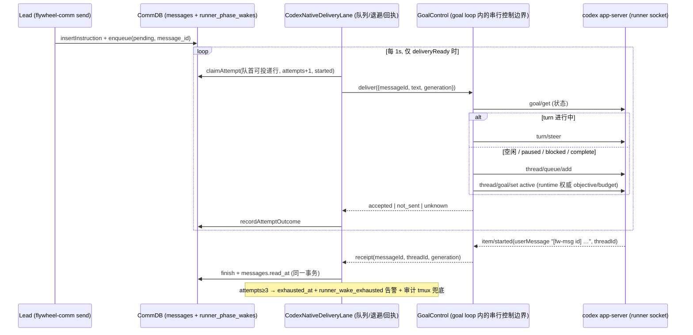

# FLY-2127 Codex runner 原生唤醒 — 实施计划
Issue: FLY-2127 (https://linear.app/geoforge3d/issue/FLY-2127/病根同类合并-7-张-codex-runner-叫不醒-停着空转唤醒和停驻一族-原引擎的-rework-wake-打不醒-goal)
日期: 2026-09-30
基于: research.md

**Version**: v1.56.0（ship 取空号）
**Status**: draft（R2：按 Codex R1 12 项修订）

## 1. 目标

Lead / 引擎发给 Codex runner 的每条消息都通过 runner 自己的 `codex app-server` 控制 socket 投递并得到
runner 侧逐消息回执；停驻（paused / blocked / complete）的 Codex 体收到消息后自动续跑；投递失败有限升级到
Lead 可见的告警 + 有审计的 tmux 兜底；本版**保留**旧 JSON inbox 实现作为可回滚模式（默认关），下版删除；
Claude runner 收信路径零改动。

## 2. 架构



五个层次，权威不下沉：

1. **写点（入口）**：`wakeRunnerMailbox` 解析目标 backend（§3.6），codex 且 native 模式 → 只做 CommDB 入队；不碰文件。
2. **Lane（队列）**：`CodexNativeDeliveryLane`（新文件 `packages/claude-runner/src/codex-native-delivery-lane.ts`）只管**队列、尝试计数、退避、回执落库、升级**；它不直接发 RPC。
3. **GoalControl（控制边界）**：`runGoalToTerminal` 内新建的串行控制对象，把 pause / activate / deliver / terminal generation / 预算恢复 / shutdown 准入放在**同一把异步锁**后面；lane 通过 `control.deliver()` 投递。
4. **回执（观察）**：goal loop 已有的通知处理里识别 `item/started(userMessage)`，绑定 threadId + generation + 精确 message id 后交给 lane 落库。
5. **升级（兜底）**：attempts≥3 → 行隔离 + `runner_wake_exhausted` 事件 + `LeadAlertNotifier.alert()` + 一次经审计的恢复门铃（§3.9）。

## 3. 改动清单

### 3.1 `CodexDaemonClient` 两个新 RPC（`codex-daemon-client.ts`）

```ts
async queueAdd(threadId: string, text: string, timeoutMs?: number): Promise<void>
async steerTurn(threadId: string, turnId: string, text: string, timeoutMs?: number): Promise<void>
```

形状照 `startTurn`（`:468-480`）；方法名 / 参数名以 M0 探针实测回填。`request()` 的 timeout 只移除本地 pending、不撤销远端（`:314-322`），
所以调用方拿到的失败要分 `not_sent`（closed 且在 `t.send` 之前抛）/ `unknown`（timeout、send 之后 closed）——`request()` 返回的错误对象
加 `kind: "not_sent" | "unknown"`（`CodexDaemonError.kind` 已有 `closed` / `timeout`，映射：`closed` 且未 send → not_sent；其余 → unknown）。

### 3.2 runtime 就绪态与 `withControl`（`codex-daemon-goal-runtime.ts` + `codex-daemon-client.ts`）

```ts
interface DeliveryReadiness { generation: number; threadId: string; control: GoalControl }
class CodexDaemonGoalRuntime {
  /** null = 未就绪（启动中 / 重启中 / 已停止）。lane 只在非 null 时投递，等待不计尝试。 */
  deliveryReadiness(): DeliveryReadiness | null;
}
```

- `generation` 每次 `startSession` +1；`readiness` 只在 **socket 所有权已取得 + thread 已 start/resume + goal loop 监听器已装 + 本轮 goal preflight 完成**
  （非 hold：`setGoalStatus("active")` 与初始 kick 已提交；hold 恢复：`ensurePhasePaused` 已确认）后由 goal loop 通过 `input.onDeliveryReady(control)` 发布；
  `stop()` / 检测到 transport closed / 进入 restart 时立即撤销并清空 turn 状态。
- `GoalControl`（`codex-daemon-client.ts` 内定义，随 `runGoalToTerminal` 创建）：

```ts
interface GoalControl {
  generation: number;
  deliver(input: { messageId: string; text: string }): Promise<
    | { outcome: "accepted"; via: "steer" | "queue"; activated: boolean }
    | { outcome: "not_sent"; reason: string }
    | { outcome: "unknown"; reason: string }>;
  activate(): Promise<{ ok: boolean; reason?: string }>;   // 只补 goal/set active，不重投正文
  turnState(): { turnId: string | null };
}
```

`deliver` / `activate` / `enterPhaseHold` / `ensurePhasePaused` / shutdown 准入共用一把 `AsyncMutex`。
`set active` 用 goal loop 自己的 `input.objective` / `input.tokenBudget`（权威，`GoalNotification.goal` 没有 tokenBudget 字段）；
`getGoal` 返回 null 或 objective 不是我们的 → `deliver` 返回 `not_sent reason=goal_foreign`，lane **不计尝试**、记日志、等下一 tick（外来 goal 由既有 `goal_replaced` 守卫终结运行）。

### 3.3 terminal / hold 与投递的顺序（`runGoalToTerminal` 循环）

- `terminalSeen` 改为带 generation 的记录 `{status, atGeneration, atSeq}`；`deliver()` 在锁内执行时把 `terminalSeen` 清零并记 `lastAcceptedSeq`。
  循环里 `if (terminalSeen)` 分支在锁内重读：若 `lastAcceptedSeq > terminalSeen.atSeq`（terminal 之后已有接受的投递）→ 不进 hold、继续循环。
- `enterPhaseHold` 在锁内：先检查 shutdown 未请求且无 accepted-未激活 投递，再 `set paused`。
- `activate()` 失败（queue 已接受、set active 失败）：返回 `accepted, activated:false`；lane 把行标 `accepted`，之后只重试 `control.activate()`（不重投正文），
  两次激活重试仍失败 → 计入 exhausted。
- hold 循环：`observe()` 看到行且 `state==="finished"`（回执已落库）→ 在锁内 `leaveHold()`：清 `held`、清 `terminalSeen`、按 `phaseHold` 记录恢复两条预算钟（沿用 `reactivateWake` 的 `onBudgetRestored` 逻辑）。
  `reactivateWake` 的 `startTurn` 投递被 `control.deliver` 取代；其余记账逻辑迁到 `leaveHold` 流程。
- shutdown：`observe()` 返回 `shutdown` 后，控制边界置 `deliveryRevoked=true`，任何后续 `deliver` 返回 `not_sent reason=shutdown`（不计尝试）；lane `stop()` 在 `runtime.drained()` 之前完成。

### 3.4 `blocked` 进 hold（仅 phase keep-alive）

```ts
if (terminalSeen && phase && (terminalSeen.status === "complete" || terminalSeen.status === "blocked")) { await enterPhaseHold(); continue; }
```

非 phase 路径字节不变；`classifyGoalOutcome` 不改。进 hold 时通过 `input.onHeld?.(status)` 让 adapter 发一条 **Lead 可见告警**（§3.8 `codex_goal_held` kind，eventId `goal-held-<execId>-<generation>-<status>` 去重），
不再依赖任何未落实的 stall 钟。FLY-2861 注释改为：「0.159 下 blocked 重连也弹 Resume paused goal?；菜单只挡键盘，RPC 不受影响」。

### 3.5 消息身份与回执

- **wire message id** = `runner_phase_wakes.message_id`，由**入队边界**统一决定：写点带 `metadata.flywheelId`（`send` 的 instruction id）→ 用它；否则入队时 `randomUUID()`。
  `source_instruction_id` = 有 instruction 行时的 instruction id，否则 NULL。
- **投递时**由 `control.deliver` 在正文前加 `[fw-msg <message_id>]`（写点不再负责前缀；`send.ts` 现有 `[lead-instruction <id>]` 前缀保留给 Claude 路径与审计，
  Codex 正文里两者可同时出现，回执**只认** `[fw-msg …]`）。
- 回执匹配：`item/started`，`params.threadId === readiness.threadId`，`item.type==="userMessage"`，文本正则 `\[fw-msg ([0-9a-f-]{8,64})\]` 精确等于某行 `message_id`，且 `generation === readiness.generation`。
  早到（RPC 返回前）: 行已在 `claimAttempt` 时置 `started`，finish CAS 成立；重复 / 迟到：`finished` 不降级，幂等；DB 写失败：只重试记账（`pendingReceipts` 内存集合，下一 tick 重放）。
- **没有弱回执**。M0 若证明 `item/started(userMessage)` 不可观察，则改用能按 message id 对账的读回 RPC（`thread/read` 或等价，M0 一并探）；两者都不可得 → 架构停在 M0，
  用 `flywheel-comm ask` 报 Lead 决策，不得把「下一次 turn/started」当 ACK。

### 3.6 写点改造与 backend 解析

| 文件 | 改法 |
|---|---|
| `flywheel-comm/src/wake.ts` | 新增解析：`backend = args.backend ?? sessionVendor(execId)`；`args.backend` 与 session vendor 都存在且不等 → `{ok:false, error:"backend_conflict"}`（fail-closed）；vendor 为 NULL 且无 backend → 现有 `fromEnv()`（legacy 字节兼容）。`backend==="codex" && nativeMode` → `db.enqueueRunnerNativeDelivery(...)`（§3.7）返回 `{ok:true}`；`claude-code` 分支字节不变。 |
| `flywheel-comm/src/commands/send.ts` | `delivered_at` 语义改注释为「已入 runner 队列」；其余不变。 |
| `flywheel-comm/src/commands/inbox.ts` | 当目标 session vendor 为 codex 且 native 模式：`getUnreadInstructions(execId, {excludeNativeClaimed:true})` 排除已被 lane 认领（存在 `runner_phase_wakes.source_instruction_id`）的行；其余模式字节不变。 |
| `teamlead/src/bridge/runner-wake.ts`、`actions.ts:465`、`respond.ts:95` | 不改代码；靠 wake.ts 的 vendor 解析正确路由（新增集成用例：无 marker 的 approval / feedback / gate_answered wake 到 codex 目标 → 入队，不写 Claude inbox）。 |
| `teamlead/src/bridge/plugin.ts` `wakePhaseRunner` | 不改；fix / retest 文本无需前缀（前缀在投递时加）。 |
| `agent-team-transport/src/codex/CodexAdapter.ts` | **本版不删**。`capabilities().wakeMode` 保持 `external-watcher`；接口不变。 |
| `claude-runner/src/codex-phase-lifecycle.ts` | native 模式：`watcher` 传 null（不起 watcher）；`observe()` 的「未 finished 行」改为 §3.7 的「可投递行」规则。legacy 模式不变。 |
| `claude-runner/src/CodexTmuxAdapter.ts` | native 模式：`runtime` 建好后建 lane（不要求 phaseKeepAlive），lane 内部等 `deliveryReadiness()`；`finally` 里 `await lane.stop()` 先于 `runtime.drained()`；`onHeld` / `onWakeExhausted` 由构造注入的 `nativeDeliveryHooks`（§3.8）处理。legacy 模式：现状。 |

### 3.7 CommDB 迁移与队列语义（`flywheel-comm/src/db.ts`）

幂等加列（沿用 `delivered_at` 的 race-tolerant `ALTER TABLE`）：`attempts INTEGER NOT NULL DEFAULT 0`、`last_attempt_at INTEGER`、`next_attempt_at INTEGER`、
`last_outcome TEXT`（`not_sent|accepted|unknown`）、`last_error TEXT`、`exhausted_at INTEGER`。`state` CHECK 不动（避免重建表）。

新 helper：

| helper | 语义 |
|---|---|
| `enqueueRunnerNativeDelivery(execId, {message_id, content, metadata, source_instruction_id}, now)` | 与 `enqueueRunnerPhaseWake` 同表同唯一键，**不**更新 `messages.read_at`；重复 id → `duplicate` |
| `nextDeliverableWake(execId, now)` | `state IN ('pending','started') AND exhausted_at IS NULL AND (next_attempt_at IS NULL OR next_attempt_at<=now) ORDER BY queue_seq LIMIT 1` |
| `claimRunnerWakeAttempt(execId, id, now)` | 原子：`SET state='started', attempts=attempts+1, last_attempt_at=now WHERE … AND exhausted_at IS NULL AND (next_attempt_at IS NULL OR next_attempt_at<=now)`；`changes===1` 才继续 |
| `recordRunnerWakeAttemptOutcome(execId, id, {outcome, error?, nextAttemptAt})` | 写 `last_outcome/last_error/next_attempt_at` |
| `finishRunnerWakeWithReceipt(execId, id, now)` | 一个事务：行 `finished`（从 started，幂等）+ 若 `source_instruction_id` 非空则 `messages.read_at=COALESCE(read_at, now)` |
| `markRunnerWakeExhausted(execId, id, now)` | `exhausted_at=now`；行不再被 `nextDeliverable` 选中 |

尝试规则（lane）：

| 上次 outcome | 下次动作 | next_attempt_at |
|---|---|---|
| `not_sent` | 重投正文 | now + backoff[attempts-1]，backoff=[2s,8s,30s] |
| `accepted` 无回执 | 只 `control.activate()`；不重投正文 | now + 60s（ACK 超时） |
| `unknown` | 若 M0 有读回 RPC → 对账后归为 accepted / not_sent；否则按 accepted 处理（只激活）并计入尝试 | 同 accepted |
| attempts ≥ 3 | `markRunnerWakeExhausted` + 升级（§3.8）一次 | — |

FIFO：exhausted 行被隔离，后续行照常投递。`observe()`（hold 循环）与 lane 用同一个 `nextDeliverable` 规则。
旧行（无新列的库）读出 attempts=0 / next_attempt_at NULL，语义一致。

### 3.8 升级与告警（Bridge 侧）

- 新 alert kinds：`runner_wake_exhausted`（severity error，owner lead，arc human_by_design）、`codex_goal_held`（severity warning，同上）。
  加入 `ALERT_EVENT_TYPES`（`LeadAlertNotifier.ts:62+`，回声免疫）与 `KIND_CONTRACTS`（`kind-contract.ts:70`，exhaustive Record，漏项编译失败；`plugin.ts:3287` 启动校验）。
- 调用 `LeadAlertNotifier.alert({leadId, projectName, eventId, eventType, title, body, severity, sessionKey})`（`:624`），
  eventId 分别为 `wake-exhausted-<execId>-<messageId>`、`goal-held-<execId>-<generation>-<status>`（持久去重）。
- 注入路径：`run-infra.ts:349-361` 的 `codex-tmux` 工厂给 `CodexTmuxAdapter` 构造注入 `nativeDeliveryHooks: { onWakeExhausted, onHeld }`（不走 Blueprint ctx）；
  hooks 内三步各自 try/catch，顺序：StateStore 事件 → alert → 恢复门铃；**唯一写者**是 adapter 的 hooks（lane 只回调一次，用 `exhausted_at` 幂等）。
- 恢复入口注册：`claude-runner` 新增 `NativeDeliveryRegistry`（进程内 Map<executionId, {runtime, lane}>），adapter execute 注册 / finally 注销；
  `run-infra` 把它交给 nudge deps（§3.9）。

### 3.9 恢复门铃 Codex 分支（`runner-recovery-nudge.ts`）

- 闸 0-3 保持；**attempt 审计先于任何动作**（现有 `:234-248` 位置不动，审计失败 → 拒绝，RPC/tmux 零调用）。
- codex-tmux 且 registry 有该 execId：不直接发 RPC，而是 `enqueueRunnerNativeDelivery` 一行 `message_id = "nudge-<fingerprint>"`（稳定 id，重复调用 duplicate）并 `lane.kick()`；
  然后等待 ≤10s 读该行 `last_outcome`：`accepted` → 审计 `sent via=rpc` + `handled_remanaged`，200；`not_sent` → 审计 `attempt via=rpc not_sent, falling back` → 闸 4/5 + tmux；
  `unknown` / 超时 → 审计 `unknown`，返回 202 `{nudged:false, pending:true}`，**不**追加 tmux。
- Claude 路径无 registry 命中 → 字节不变。

### 3.10 模式开关与旧文件迁移

- `FLYWHEEL_CODEX_NATIVE_DELIVERY`（默认 `1`）。adapter 在 `execute()` 开头读一次并贯穿整次执行；wake.ts 每次调用读。
- ON：wake.ts 入队 + adapter 起 lane（无 watcher）。OFF：现状（写文件 + hold 内 watcher）；ON 期间入队的 pending/started 行在 OFF 下由 hold 循环的 `observe()` 用旧 `reactivateWake` 消费（同一表，规则兼容）；两条 lane 不会同时存在（模式在 execute 内固定）。
- 一次性 shim（ON 下 lane 启动时）：用 `CodexAdapter.getInboxPath / readUnread / ack`（尊重 `FLYWHEEL_CODEX_TEAMS_DIR` 与路径规范化）读取未 ack 消息 → `enqueueRunnerNativeDelivery(message_id = envelope.id, source_instruction_id = metadata.flywheelId ?? null)` → 入库成功后 `ack` 对应 id。下版删 shim + 文件路径。

## 4. 里程碑与顺序

| M | 内容 | 验证 |
|---|---|---|
| M0 | 探针（research §3 P1–P7 + P8「按 message id 读回」），回填 §3.1 名称与 §3.5 通知名；**go/no-go**：逐消息回执不可得 → ask Lead | `qa/m0-native-delivery-probe.md` |
| M1 | 共同接口先行：§3.5 身份规则、§3.7 迁移 + helpers、§3.2 `GoalControl` / readiness 类型、§3.10 开关 | db 测试（迁移幂等、旧库、FIFO 隔离、claim CAS）；类型编译 |
| M2 | §3.1 RPC + §3.2/§3.3 goal loop 控制边界 + §3.4 blocked | `codex-daemon-client.test.ts`：complete→投递→不进 hold；pause/active 交错；activation 失败只重激活；shutdown 撤销投递；early/late/duplicate/错 thread 回执；steer 无新 turn 仍靠 item 回执 |
| M3 | Lane（注入 fake control / fake db） | 新测试：readiness 等待不计尝试；退避；accepted 只激活；exhausted 只升级一次且 B 行照常投递；重启（generation 变）后 turnId 清零 |
| M4 | §3.6 写点 / inbox / adapter 接线 + §3.10 shim | 改写 research §2.3 五个测试；新增：无 marker approval/feedback 到 codex 入队且不写 Claude inbox；backend_conflict fail-closed；daemon 不可用 read_at 保持 NULL；CLI/native 不双消费；custom teams dir 迁移；OFF 模式字节对照 |
| M5 | §3.8 告警 + §3.9 门铃 | 真实工厂组合测试（run-infra 构造 adapter → hooks → `alert()`）；kind-contract / echo-immunity fixture；nudge：审计失败零调用、accepted 不碰 tmux、not_sent 回退、unknown 202 |
| M6 | 529 真房 E2E | §6 |

M1 先行；M2 / M3 依赖 M1 且互相独立；M4 依赖 M2+M3；M5 依赖 M4。

## 5. 风险与回滚

| 风险 | 处置 |
|---|---|
| RPC 名称 / 回执通知与本机 codex 不符 | M0 go/no-go；FakeDaemon 只锁我们发出的形状 |
| 真 blocked（沙箱拒绝）无限 hold | `codex_goal_held` 告警直达 Lead（去重）；Lead 可 close-runner |
| goal loop 与 lane 竞争 | 全部经 `GoalControl` 单锁；lane 无直接 client 访问 |
| 第二个 adapter 实例同 execId | 复用 socket 独占（第二个 spawn 拒绝 clobber）；readiness 只在取得所有权后发布 |
| 回执落库失败 | 内存 `pendingReceipts` 重放；行不会被降级 |
| Claude 回归 | wake.ts / runner-wake.ts 的 claude 分支零改动；`send-backend-routing.test.ts` claude 断言原样 |
| 回滚 | `FLYWHEEL_CODEX_NATIVE_DELIVERY=0` 回旧路（本版保留完整旧实现） |

## 6. QA 判据（M6，529 真房）

| # | 场景 | 通过标准 |
|---|---|---|
| ① | 长 turn 中 Lead `send` | 同 turn 内 pane 出现 `[fw-msg …]` 文本；行 `finished`、`messages.read_at` 非空（只有 lane 会写它）；日志 `via=steer` |
| ② | paused / blocked / complete 各一次，「Resume paused goal?」挂着时 `send` | ≤5s 内 `turn/started`；goal active；无人碰键盘 |
| ③ | land 冲突 → conflict-rework wake（fix / retest，无 questionId） | 目标 Codex 体自动起 turn；`runner_wake_exhausted` 0 条；Claude inbox 目录零新增文件 |
| ④ | Claude runner `send` | 与 QA@1 一致（沿用证据） |
| ⑤ | approval wake 无 marker（`actions.ts` 路径）到 codex | 入队并送达；不写 Claude inbox |
| QA@2-① 部分 ACK | 单行串行 + 逐消息回执，无批 ACK；写「结构上消失」 |
| QA@2-② wait 已消费跳过激活 | 每次投递在锁内 `getGoal` 决定 active；accepted 未激活行只重激活 |
| QA@2-③ 固定通知键去重 | 同 message_id 才去重；两次 stale 批准 wake 各自 id → 两行都投 |
| QA@2-④ 指针键不一致 | lane 不读 TURN 指针；续跑文本仍要求 runner 先 `flywheel-comm turn` |
| QA@2-⑤ reconciler 孤儿行 | exhausted 行带 `exhausted_at`；follow-up |
| QA@2-⑥ 告警抛错丢失 | hooks 三步各自 try/catch，事件先于告警 |
| 断连 | kill daemon → 行保持 pending（readiness null 不计尝试）→ 重启 resume 后补投 |
| 升级 | 用错 socket 根目录制造 `not_sent` → 3 次退避后 `exhausted_at` + Discord 告警 + 审计到的门铃结果；后续 `send` 的新行仍送达（FIFO 不被卡） |
| 审计 | 把审计库设只读 → 门铃 RPC/tmux 零调用，返回 503 |

⛔ 本机只跑相关测试：`pnpm --filter flywheel-claude-runner test -- codex-`、`pnpm --filter flywheel-comm test -- wake|send|inbox|db`、`pnpm --filter flywheel-teamlead test -- recovery-nudge|runner-wake|kind-contract`。

## 7. 明确不做

- `instant_interrupt`（FLY-3066）；CI 完成自动唤醒写点（FLY-2953）；Bridge 进程 crash 后自动重建 adapter（FLY-1269 follow-up）；
- 删除 JSON inbox 实现（下版，本版只默认关）；
- Codex Lead backend（`lead-backends/codex`）任何改动。
