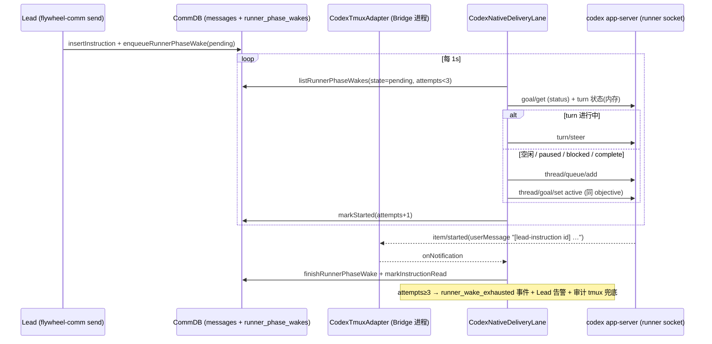

# FLY-2127 Codex runner 原生唤醒 — 实施计划
Issue: FLY-2127 (https://linear.app/geoforge3d/issue/FLY-2127/病根同类合并-7-张-codex-runner-叫不醒-停着空转唤醒和停驻一族-原引擎的-rework-wake-打不醒-goal)
日期: 2026-09-30
基于: research.md

**Version**: v1.56.0（ship 取空号）
**Status**: draft

## 1. 目标

Lead / 引擎发给 Codex runner 的每条消息都通过 runner 自己的 `codex app-server` 控制 socket 投递并得到
runner 侧回执；停驻（paused / blocked / complete）的 Codex 体收到消息后自动续跑；投递失败有限升级到
Lead 可见的告警 + 有审计的 tmux 兜底；JSON inbox 文件路径删除；Claude runner 收信路径零改动。

## 2. 架构



四个层次，权威不下沉：

1. **写点（入口）**：`wakeRunnerMailbox` 对 vendor=codex 只做 CommDB 入队，返回 `{ok:true, queued:true}`；不再碰任何文件。
2. **Lane（投递）**：`CodexNativeDeliveryLane`（新文件 `packages/claude-runner/src/codex-native-delivery-lane.ts`），
   由 `CodexTmuxAdapter.execute()` 在 `runtime` 建好后启动、`finally` 停止；1s 轮询 CommDB 队列；用 `runtime.withClient()` 在当前 client 上发 RPC。
3. **回执（观察）**：adapter 的 `onNotification` 转发点把每条通知交给 lane；lane 匹配 userMessage 标记 → 队列行 finished + `messages.read_at`。
4. **升级（兜底）**：attempts≥3 → `runner_wake_exhausted` 事件 + `LeadAlertNotifier` 告警 + 一次 `attemptRunnerRecoveryNudge(actor:"native-lane")` 的 tmux 兜底（仍过五道闸）。

## 3. 改动清单

### 3.1 `CodexDaemonClient` 两个新 RPC（`packages/claude-runner/src/codex-daemon-client.ts`）

```ts
/** thread/queue/add — 空闲线程排队一条输入；线程空闲时 daemon 立即起 turn。 */
async queueAdd(threadId: string, text: string, timeoutMs?: number): Promise<void> {
  await this.request("thread/queue/add", { threadId, input: [{ type: "text", text }] }, timeoutMs);
}
/** turn/steer — 把一条输入并入进行中的 turn。 */
async steerTurn(threadId: string, turnId: string, text: string, timeoutMs?: number): Promise<void> {
  await this.request("turn/steer", { threadId, turnId, input: [{ type: "text", text }] }, timeoutMs);
}
```

形状照 `startTurn`（`:468-480`）；参数名以 M0 探针（research §3）实测为准回填。测试：`test/codex-daemon-client.test.ts` 用现有 `FakeDaemon` 断言 method / params。

### 3.2 `CodexDaemonGoalRuntime.withClient()`（`codex-daemon-goal-runtime.ts`）

```ts
/** 在当前 daemon session 的 client 上执行；没有 session 或 client 已关 → 抛 CodexDaemonError("closed")。 */
async withClient<T>(fn: (client: CodexDaemonClient, threadId: string) => Promise<T>): Promise<T>
```

`threadId` 来自 runGoal 已 resolve 的 thread（`onThreadReady` 记录）；重启换 client 后自动指向新 client。

### 3.3 turn 状态跟踪（`codex-daemon-client.ts` 循环内）

`runGoalToTerminal` 已看到 `turn/started` / `turn/completed`；把「当前 turnId 或 null」写进一个可注入的 `TurnStateSink`
（`events.onTurnState?: (s: {turnId: string|null}) => void`），lane 订阅它决定 steer 还是 queue。**不**改循环的 terminal 判定。

### 3.4 `blocked` 进 hold（`codex-daemon-client.ts` 循环）

```ts
if (terminalSeen) {
  if (phase && (terminalSeen === "complete" || terminalSeen === "blocked")) {
    input.onHeld?.(terminalSeen);   // 新回调：adapter 写 codex_goal_blocked_held / codex_goal_complete_held 事件
    await enterPhaseHold();
    continue;
  }
  break;
}
```

非 phase 路径字节不变；`classifyGoalOutcome` 不改。FLY-2861 注释改为：
「0.159 下 blocked 重连也弹 Resume paused goal?；菜单只挡键盘，RPC 不受影响」。

### 3.5 `CodexNativeDeliveryLane`（新文件）

```ts
export interface NativeDeliveryLaneDeps {
  executionId: string; commDbPath: string;
  withClient: CodexDaemonGoalRuntime["withClient"];
  turnState: () => { turnId: string | null };
  onExhausted: (wake: RunnerPhaseWake, lastError: string) => Promise<void>;
  now?: () => number; pollIntervalMs?: number /* 1000 */; maxAttempts?: number /* 3 */;
  backoffMs?: number[] /* [2000, 8000, 30000] */;
}
export class CodexNativeDeliveryLane {
  start(): void; stop(): Promise<void>;
  observeNotification(method: string, params: unknown): void;  // 回执
}
```

投递算法（每 tick，串行、`scanInFlight` 互斥）：

1. `wakes = db.listRunnerPhaseWakes(execId).filter(state!=="finished")`，取队首（`queue_seq` 最小，保序）。
2. 若 `state==="started"` 且 `now - started_at < backoff[attempts-1]` → 等下一 tick（同一条不重复投递）。
3. 若 `attempts >= maxAttempts` → `onExhausted`（只触发一次：写 `exhausted_at`）→ 跳过。
4. `withClient(async (c, threadId) => { const goal = await c.getGoal(threadId); const t = turnState();`
   - `t.turnId` 非空 → `c.steerTurn(threadId, t.turnId, text)`；
   - 否则 → `c.queueAdd(threadId, text)`；若 `goal.status !== "active"` → `c.setGoal({threadId, objective: goal.objective, tokenBudget: goal.tokenBudget, status:"active"})`。
   `})`
5. RPC 成功 → `markRunnerPhaseWakeStarted(id, attempts+1)`；失败 → `attempts+1, last_error`（行仍 pending，等退避）。
6. 文本 = 队列行 `content`（写点已带 `[lead-instruction <id>]` / `[phase-wake <id>]` 前缀；lane 不再加前缀）。

回执 `observeNotification`：

- `method === "item/started"` 且 `params.item.type === "userMessage"`：抽 `content[].text` 拼接，正则 `\[(lead-instruction|phase-wake) ([^\]]+)\]`；
  命中 id → `db.finishRunnerPhaseWake(execId, id)` + `db.markInstructionRead(source_instruction_id)`。
- 备用（M0 若证明 item 通知不可得）：`turn/started` 后把所有 `started` 且 `attempts>0` 的行 finished（弱回执，日志标 `receipt=turn_started`）。

与既有 `reactivateWake` 的关系：**替换**。hold 循环里 `observe()` 看到 wake 不再自己 `startTurn`，而是等 lane 的 `finished` 后 `leaveHold()`；
`phase.markWakeStarted / finishWake` 由 lane 调用（同一 CommDB 行状态机，不再有两个写者）。

### 3.6 写点改造

| 文件 | 改法 |
|---|---|
| `flywheel-comm/src/wake.ts` | `backend==="codex"` → `db.enqueueRunnerPhaseWake(execId, {id: metadata.flywheelId ?? randomUUID(), content, metadata, to: agentName}, now)`，返回 `{ok:true}`；不再调 `forBackend("codex").write`。`claude-code` 路径字节不变。 |
| `flywheel-comm/src/commands/send.ts` | 无改动（`delivered_at` 仍在 wake ok 时打；语义改为「已入 runner 队列」，注释更新）。 |
| `teamlead/src/bridge/runner-wake.ts` | 无改动（走 wake.ts）。 |
| `teamlead/src/bridge/plugin.ts` `wakePhaseRunner` | 无改动。 |
| `agent-team-transport/src/codex/CodexAdapter.ts` | 删 `write/readUnread/ack/withLock/getInboxPath` 与 `CodexMailboxWatcher`；`wakeMode` 改 `"native-rpc"`；保留 `preflight`、spawn config。`createReceiver` 返回 `null`。 |
| `claude-runner/src/codex-phase-lifecycle.ts` | 去掉 `watcher` 选项与 `onDelivered` 入队；`confirmHoldPaused` 只写 session.json。 |
| `claude-runner/src/CodexTmuxAdapter.ts` | 建 lane（`runtime` 建好、`commDbPath` 存在即建，**不要求 phaseKeepAlive**）；`onNotification` 里 `heartbeat(); lane.observeNotification(m,p)`；`finally` 里 `await lane.stop()`；`onExhausted` → 写事件 + 调 `ctx.onWakeExhausted?.()`（由 Bridge 注入告警 + 兜底）。 |

### 3.7 CommDB 迁移（`flywheel-comm/src/db.ts`）

`runner_phase_wakes` 幂等加列：`attempts INTEGER NOT NULL DEFAULT 0`、`last_error TEXT`、`exhausted_at INTEGER`。
沿用 `delivered_at` 的 race-tolerant `ALTER TABLE` 形状（`:267-300`）。`markRunnerPhaseWakeStarted` 加 `attempts` 参数；
新增 `recordRunnerPhaseWakeFailure(execId, id, error, now)`、`markRunnerPhaseWakeExhausted(execId, id, now)`。
旧行（无 attempts 列的库）读出 attempts=0，语义一致。

### 3.8 升级（Bridge 侧）

- `CodexTmuxAdapter` 上下文新增 `onWakeExhausted?: (info: {wakeId, lastError, attempts}) => Promise<void>`，由 `run-infra.ts` 注入：
  1. `store.insertEvent({event_type:"runner_wake_exhausted", payload:{wakeId,lastError,attempts}})`；
  2. `LeadAlertNotifier.notify({reason:"runner_wake_exhausted", title, body})`，kind 加入 `ALERT_EVENT_TYPES`（FLY-927 回声免疫要求）；
  3. `attemptRunnerRecoveryNudge({actor:"native-lane", phrase:"continue", fingerprint: <fresh capture>}, deps)` —— 仍过全部闸，拒绝即审计，不重试。
- `runner_wake_failed`（单次失败）保留，语义不变。

### 3.9 恢复门铃 Codex 分支（`runner-recovery-nudge.ts`）

`RunnerNudgeDeps` 新增可选 `rpcNudge?: (executionId) => Promise<{sent:boolean; error?:string}>`（Bridge 用 lane 的 `withClient` 实现：`queueAdd("continue")` + 非 active 则 `set active`）。
闸 0-3 后：`rpcNudge` 存在且 session `adapter_type==="codex-tmux"` → 先试 RPC；成功 → 审计 `sent reason="via=rpc"` + `handled_remanaged`，返回 200；
失败 → 审计 `attempt reason="rpc failed: … falling back to tmux"` → 继续闸 4/5 + 按键。Claude 路径无 `rpcNudge`，字节不变。

### 3.10 一次性 shim：旧 inbox 文件

lane `start()` 时若 `~/.flywheel/codex-teams/<team>/inboxes/<agent>.json` 存在且有 `messages`：逐条 `enqueueRunnerPhaseWake`（id 沿用文件里的 id，UNIQUE 去重），
然后删除文件并打日志 `migrated N legacy inbox messages`。下个版本删 shim。

## 4. 里程碑与顺序

| M | 内容 | 验证 |
|---|---|---|
| M0 | 探针 `qa/m0-native-delivery-probe.mjs`（research §3 P1–P7），回填 §3.1 参数名与 §3.5 回执方法名 | 探针输出 md 附证据 |
| M1 | §3.1 + §3.2 + §3.3（client / runtime 小改） | `codex-daemon-client.test.ts`、`codex-daemon-goal-runtime.test.ts` |
| M2 | §3.7 CommDB 迁移 + helpers | `flywheel-comm` db 测试：迁移幂等、旧库读 attempts=0 |
| M3 | §3.5 lane（纯逻辑，注入 fake client / fake db） | 新 `codex-native-delivery-lane.test.ts`：steer/queue/active 选路、退避、exhausted 只触发一次、回执匹配、乱序通知、client 重启中途 |
| M4 | §3.4 blocked 进 hold + §3.6 写点/adapter 接线 + 删 JSON 路径 + §3.10 shim | 改写 research §2.3 列出的 5 个测试；`CodexTmuxAdapter.test.ts` 新增 lane 生命周期（start after runtime / stop in finally / exhausted 回调） |
| M5 | §3.8 升级 + §3.9 门铃 RPC | `runner-recovery-nudge` 测试：rpc 成功不碰 tmux、rpc 失败回退、Claude 路径不变；LeadAlertNotifier kind 回声免疫 fixture |
| M6 | 529 真房 E2E（QA 节点） | 见 §6 |

M1–M3 互相独立可并行；M4 依赖 M1–M3；M5 依赖 M4。

## 5. 风险与回滚

| 风险 | 处置 |
|---|---|
| queue/add 参数名与本仓 codex 版本不符 | M0 先跑；M1 的 FakeDaemon 测试只锁我们发出的形状，真实性靠 M0 + M6 |
| `item/started(userMessage)` 不可观察 | §3.5 备用弱回执；plan 明写 `receipt=turn_started` 日志可审计 |
| blocked 是真卡（沙箱拒绝） | hold 时写 `codex_goal_blocked_held` 事件；FLY-2096 stall 钟仍生效；不静默 |
| lane 与 hold 循环双写 `runner_phase_wakes` | 明确唯一写者是 lane；hold 循环只读 finished 状态 |
| 同一 execId 的两个 adapter 实例（重派）同时跑 lane | 复用 FLY-1188 socket 独占（第二个 spawn 拒绝 clobber）；lane 不独立于 adapter 存在 |
| Claude runner 回归 | wake.ts / runner-wake.ts 的 claude-code 分支零改动；`send-backend-routing.test.ts` 保留 claude 断言原样 |
| 回滚 | `FLYWHEEL_CODEX_NATIVE_DELIVERY=0`：wake.ts 恢复写文件、adapter 恢复起 watcher（旧代码保留一版，下版删）；默认 ON |

## 6. QA 判据（M6，529 真房，对应 issue 判据 ①–④ + QA@2 追加 ①–⑥）

| # | 场景 | 通过标准 |
|---|---|---|
| ① | 长 turn 中 Lead `send` | 同 turn 内 pane 出现指令文本；CommDB 行 `read_at` 非空；lane 日志 `via=steer` |
| ② | paused / blocked / complete 三态各一次，「Resume paused goal?」菜单挂着时 `send` | ≤5s 内 `turn/started`；goal 变 active；菜单不需人工处理 |
| ③ | 制造 land 冲突 → conflict-rework wake | 目标 Codex 体自动起 turn 消费 rework；**无人碰 pane**；`runner_wake_exhausted` 事件 0 条 |
| ④ | Claude runner `send` | 行为与 QA@1 一致（沿用证据） |
| QA@2-① 部分 ACK | lane 单行串行，无批 ACK 概念 → 写「不适用，结构上消失」 | 
| QA@2-② wait 已消费跳过激活 | §3.5 每次投递都 `getGoal` 再决定 set active，不依赖 wait 状态 | 
| QA@2-③ 固定通知键去重 | 队列 UNIQUE(execution_id, message_id)，同一 stale 批准的两次 wake 带不同 flywheelId → 两行都投；同 id 才去重 | 
| QA@2-④ 指针键不一致 | lane 不读 TURN 指针；续跑文本仍要求 runner 先 `flywheel-comm turn` | 
| QA@2-⑤ reconciler 孤儿行 | attempts≥3 行有 `exhausted_at`，reconciler 可按它清理；follow-up | 
| QA@2-⑥ 告警抛错丢失 | `onWakeExhausted` 三步各自 try/catch，事件先于告警写入 | 
| 断连 | kill runner daemon → 队列行保持 pending → daemon 重启 resume 后 lane 补投 |
| 升级 | 用 `FLYWHEEL_CODEX_DAEMON_SOCKET_ROOT` 指错目录制造 RPC 失败 → 3 次退避后 `runner_wake_exhausted` + Discord 告警 + 审计到的 tmux 兜底（refused 或 sent 均可，但必须审计） |

⛔ 本机只跑相关测试：`pnpm --filter flywheel-claude-runner test -- codex-`、`pnpm --filter flywheel-comm test -- wake|send|db`、`pnpm --filter flywheel-teamlead test -- recovery-nudge|runner-wake`。

## 7. 明确不做

- `instant_interrupt`（FLY-3066）；
- CI 完成自动唤醒写点（FLY-2953）；
- Bridge 进程 crash 后自动重建 adapter（FLY-1269 follow-up）；
- Codex Lead backend（`lead-backends/codex`）任何改动。
